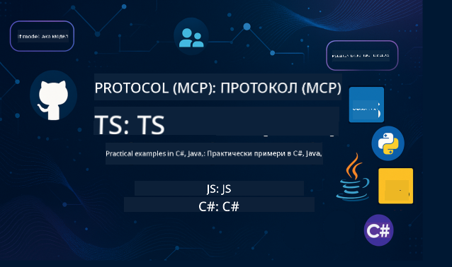

<!--
CO_OP_TRANSLATOR_METADATA:
{
  "original_hash": "866c8877136cb03e1efb9ad633a2f0a6",
  "translation_date": "2025-08-26T18:18:08+00:00",
  "source_file": "README.md",
  "language_code": "bg"
}
-->
 

  
  
  
  

  
  
  

  

Следвайте тези стъпки, за да започнете да използвате тези ресурси:  
1. **Fork на хранилището**: Кликнете   
2. **Клонирайте хранилището**:   `git clone https://github.com/microsoft/mcp-for-beginners.git`  
3. [**Присъединете се към Azure AI Foundry Discord и се свържете с експерти и други разработчици**](https://discord.com/invite/ByRwuEEgH4)  

### 🌐 Поддръжка на много езици  

#### Поддържани чрез GitHub Action (Автоматизирано и винаги актуално)  

 [Arabic](../ar/README.md) | [Bengali](../bn/README.md) | [Bulgarian](./README.md) | [Burmese (Myanmar)](../my/README.md) | [Chinese (Simplified)](../zh/README.md) | [Chinese (Traditional, Hong Kong)](../hk/README.md) | [Chinese (Traditional, Macau)](../mo/README.md) | [Chinese (Traditional, Taiwan)](../tw/README.md) | [Croatian](../hr/README.md) | [Czech](../cs/README.md) | [Danish](../da/README.md) | [Dutch](../nl/README.md) | [Finnish](../fi/README.md) | [French](../fr/README.md) | [German](../de/README.md) | [Greek](../el/README.md) | [Hebrew](../he/README.md) | [Hindi](../hi/README.md) | [Hungarian](../hu/README.md) | [Indonesian](../id/README.md) | [Italian](../it/README.md) | [Japanese](../ja/README.md) | [Korean](../ko/README.md) | [Malay](../ms/README.md) | [Marathi](../mr/README.md) | [Nepali](../ne/README.md) | [Norwegian](../no/README.md) | [Persian (Farsi)](../fa/README.md) | [Polish](../pl/README.md) | [Portuguese (Brazil)](../br/README.md) | [Portuguese (Portugal)](../pt/README.md) | [Punjabi (Gurmukhi)](../pa/README.md) | [Romanian](../ro/README.md) | [Russian](../ru/README.md) | [Serbian (Cyrillic)](../sr/README.md) | [Slovak](../sk/README.md) | [Slovenian](../sl/README.md) | [Spanish](../es/README.md) | [Swahili](../sw/README.md) | [Swedish](../sv/README.md) | [Tagalog (Filipino)](../tl/README.md) | [Thai](../th/README.md) | [Turkish](../tr/README.md) | [Ukrainian](../uk/README.md) | [Urdu](../ur/README.md) | [Vietnamese](../vi/README.md)  

# 🚀 Учебна програма за Model Context Protocol (MCP) за начинаещи  

## **Научете MCP с практически примери на C#, Java, JavaScript, Rust, Python и TypeScript**  

## 🧠 Преглед на учебната програма за Model Context Protocol  

**Model Context Protocol (MCP)** е иновативна рамка, създадена за стандартизиране на взаимодействията между AI модели и клиентски приложения. Тази отворена учебна програма предлага структурирана пътека за обучение, включваща практически примери за код и реални случаи на употреба, на популярни програмни езици като C#, Java, JavaScript, TypeScript и Python.  

Независимо дали сте AI разработчик, системен архитект или софтуерен инженер, това ръководство е вашият цялостен ресурс за овладяване на основите на MCP и стратегии за внедряване.  

## 🔗 Официални ресурси за MCP  

- 📘 [MCP Документация](https://modelcontextprotocol.io/) – Подробни уроци и ръководства за потребители  
- 📜 [MCP Спецификация](https://modelcontextprotocol.io/docs/) – Архитектура на протокола и технически справки  
- 📜 [Оригинална MCP Спецификация](https://spec.modelcontextprotocol.io/) – Наследени технически справки (може да съдържат допълнителни детайли)  
- 🧑‍💻 [MCP GitHub Хранилище](https://github.com/modelcontextprotocol) – Отворени SDK, инструменти и примерен код  
- 🌐 [MCP Общество](https://github.com/orgs/modelcontextprotocol/discussions) – Присъединете се към дискусии и допринасяйте към общността  

## 🧭 Преглед на учебната програма за MCP  

### 📚 Пълна структура на учебната програма  

| Модул | Тема | Описание | Линк |  
|-------|------|----------|------|  
| **Модул 1-3: Основи** | | | |  
| 00 | Въведение в MCP | Преглед на Model Context Protocol и неговото значение в AI процесите | [Прочетете повече](./00-Introduction/README.md) |  
| 01 | Обяснение на основните концепции | Подробно разглеждане на основните концепции на MCP | [Прочетете повече](./01-CoreConcepts/README.md) |  
| 02 | Сигурност в MCP | Заплахи за сигурността и добри практики | [Прочетете повече](./02-Security/README.md) |  
| 03 | Първи стъпки с MCP | Настройка на среда, основни сървъри/клиенти, интеграция | [Прочетете повече](./03-GettingStarted/README.md) |  
| **Модул 3: Създаване на първи сървър и клиент** | | | |  
| 3.1 | Първи сървър | Създайте първия си MCP сървър | [Ръководство](./03-GettingStarted/01-first-server/README.md) |  
| 3.2 | Първи клиент | Разработете основен MCP клиент | [Ръководство](./03-GettingStarted/02-client/README.md) |  
| 3.3 | Клиент с LLM | Интегрирайте големи езикови модели | [Ръководство](./03-GettingStarted/03-llm-client/README.md) |  
| 3.4 | Интеграция с VS Code | Използвайте MCP сървъри във VS Code | [Ръководство](./03-GettingStarted/04-vscode/README.md) |  
| 3.5 | stdio Сървър | Създайте сървъри с използване на stdio транспорт | [Ръководство](./03-GettingStarted/05-stdio-server/README.md) |  
| 3.6 | HTTP Стрийминг | Реализирайте HTTP стрийминг в MCP | [Ръководство](./03-GettingStarted/06-http-streaming/README.md) |  
| 3.7 | AI Toolkit | Използвайте AI Toolkit с MCP | [Ръководство](./03-GettingStarted/07-aitk/README.md) |  
| 3.8 | Тестване | Тествайте вашата MCP сървърна имплементация | [Ръководство](./03-GettingStarted/08-testing/README.md) |  
| 3.9 | Деплоймънт | Деплойвайте MCP сървъри в продукция | [Ръководство](./03-GettingStarted/09-deployment/README.md) |  
| **Модул 4-5: Практически и напреднали теми** | | | |  
| 04 | Практическа имплементация | SDK, дебъгване, тестване, повторно използваеми шаблони за промптове | [Прочетете повече](./04-PracticalImplementation/README.md) |  
| 05 | Напреднали теми в MCP | Мултимодален AI, мащабиране, корпоративна употреба | [Прочетете повече](./05-AdvancedTopics/README.md) |  
| 5.1 | Интеграция с Azure | MCP интеграция с Azure | [Ръководство](./05-AdvancedTopics/mcp-integration/README.md) |  
| 5.2 | Мултимодалност | Работа с множество модалности | [Ръководство](./05-AdvancedTopics/mcp-multi-modality/README.md) |  
| 5.3 | OAuth2 Демонстрация | Реализирайте OAuth2 автентикация | [Ръководство](./05-AdvancedTopics/mcp-oauth2-demo/README.md) |  
| 5.4 | Root Contexts | Разберете и имплементирайте root контексти | [Ръководство](./05-AdvancedTopics/mcp-root-contexts/README.md) |  
| 5.5 | Роутинг | Стратегии за MCP роутинг | [Ръководство](./05-AdvancedTopics/mcp-routing/README.md) |  
| 5.6 | Семплиране | Техники за семплиране в MCP | [Ръководство](./05-AdvancedTopics/mcp-sampling/README.md) |  
| 5.7 | Мащабиране | Мащабирайте MCP имплементации | [Ръководство](./05-AdvancedTopics/mcp-scaling/README.md) |  
| 5.8 | Сигурност | Напреднали съображения за сигурност | [Ръководство](./05-AdvancedTopics/mcp-security/README.md) |  
| 5.9 | Уеб търсене | Реализирайте възможности за уеб търсене | [Ръководство](./05-AdvancedTopics/web-search-mcp/README.md) |  
| 5.10 | Реално време стрийминг | Създайте функционалност за стрийминг в реално време | [Ръководство](./05-AdvancedTopics/mcp-realtimestreaming/README.md) |  
| 5.11 | Реално време търсене | Реализирайте търсене в реално време | [Ръководство](./05-AdvancedTopics/mcp-realtimesearch/README.md) |  
| 5.12 | Entra ID Auth | Автентикация с Microsoft Entra ID | [Ръководство](./05-AdvancedTopics/mcp-security-entra/README.md) |  
| 5.13 | Интеграция с Foundry | Интегрирайте с Azure AI Foundry | [Ръководство](./05-AdvancedTopics/mcp-foundry-agent-integration/README.md) |  
| 5.14 | Контекстно инженерство | Техники за ефективно контекстно инженерство | [Ръководство](./05-AdvancedTopics/mcp-contextengineering/README.md) |  
| **Модул 6-10: Общество и добри практики** | | | |  
| 06 | Приноси към обществото | Как да допринесете към MCP екосистемата | [Ръководство](./06-CommunityContributions/README.md) |  
| 07 | Уроци от ранното внедряване | Истории за реална имплементация | [Ръководство](./07-LessonsFromEarlyAdoption/README.md) |  
| 08 | Най-добри практики за MCP | Производителност, устойчивост на грешки, надеждност | [Ръководство](./08-BestPractices/README.md) |  
| 09 | MCP Казуси | Примери за практическа имплементация | [Ръководство](./09-CaseStudy/README.md) |  
| 10 | Практически семинар | Създаване на MCP сървър с AI Toolkit | [Лаборатория](./10-StreamliningAIWorkflowsBuildingAnMCPServerWithAIToolkit/README.md) |  

### 💻 Примерни проекти с код  

#### Основни примери за MCP калкулатор  

| Език | Описание | Линк |  
|------|----------|------|  
| C# | Пример за MCP сървър | [Преглед на кода](./03-GettingStarted/samples/csharp/README.md) |  
| Java | MCP Калкулатор | [Преглед на кода](./03-GettingStarted/samples/java/calculator/README.md) |  
| JavaScript | MCP Демонстрация | [Преглед на кода](./03-GettingStarted/samples/javascript/README.md) |  
| Python | MCP Сървър | [Преглед на кода](../../03-GettingStarted/samples/python/mcp_calculator_server.py) |  
| TypeScript | MCP Пример | [Преглед на кода](./03-GettingStarted/samples/typescript/README.md) |  
| Rust | MCP Пример | [Преглед на кода](./03-GettingStarted/samples/rust/README.md) |  

#### Напреднали имплементации на MCP  

| Език | Описание | Линк |  
|------|----------|------|  
| C# | Разширен пример | [View Code](./04-PracticalImplementation/samples/csharp/README.md) |
| Java със Spring | Пример за контейнерно приложение | [View Code](./04-PracticalImplementation/samples/java/containerapp/README.md) |
| JavaScript | Разширен пример | [View Code](./04-PracticalImplementation/samples/javascript/README.md) |
| Python | Сложна имплементация | [View Code](../../04-PracticalImplementation/samples/python/READMEmd) |
| TypeScript | Пример за контейнер | [View Code](./04-PracticalImplementation/samples/typescript/README.md) |

## 🎯 Предварителни изисквания за изучаване на MCP

За да извлечете максимума от тази учебна програма, трябва да имате:

- Основни познания по програмиране поне на един от следните езици: C#, Java, JavaScript, Python или TypeScript
- Разбиране на модела клиент-сървър и API
- Запознатост с концепциите за REST и HTTP
- (По избор) Основи в концепциите за AI/ML

- Присъединяване към нашите дискусии в общността за подкрепа

## 📚 Учебно ръководство и ресурси

Този репозиторий включва няколко ресурса, които ще ви помогнат да се ориентирате и учите ефективно:

### Учебно ръководство

Подробно [Учебно ръководство](./study_guide.md) е налично, за да ви помогне да се ориентирате в този репозиторий. Ръководството включва:

- Визуална карта на учебната програма, показваща всички обхванати теми
- Подробно описание на всяка секция от репозитория
- Насоки за използване на примерни проекти
- Препоръчителни учебни пътеки за различни нива на умения
- Допълнителни ресурси за допълване на вашето учебно пътуване

### Дневник на промените

Поддържаме подробен [Дневник на промените](./changelog.md), който проследява всички значителни актуализации на учебните материали, включително:

- Добавяне на ново съдържание
- Структурни промени
- Подобрения на функциите
- Актуализации на документацията

## 🛠️ Как да използвате тази учебна програма ефективно

Всяка лекция в това ръководство включва:

1. Ясни обяснения на концепциите за MCP  
2. Примери с жив код на няколко езика  
3. Упражнения за създаване на реални MCP приложения  
4. Допълнителни ресурси за напреднали учащи

## Събития 

### [MCP Dev Days юли 2025](https://developer.microsoft.com/en-us/reactor/series/S-1563/)
#### [➡️Гледайте на запис - MCP Dev Days](https://developer.microsoft.com/en-us/reactor/series/S-1563/)
Пригответе се за два дни на задълбочени технически прозрения, връзка с общността и практически обучения на MCP Dev Days, виртуално събитие, посветено на Model Context Protocol (MCP) — нововъзникващия стандарт, който свързва AI моделите и инструментите, на които те разчитат.
Можете да гледате MCP Dev Days, като се регистрирате на нашата страница за събития: https://aka.ms/mcpdevdays. 

#### [Ден 1: MCP продуктивност, DevTools и общност:](https://developer.microsoft.com/en-us/reactor/series/S-1563/)

Посветен на овластяването на разработчиците да използват MCP в своя работен процес и празнуването на невероятната MCP общност. Ще се присъединим към членове на общността и партньори като Arcade, Block, Okta и Neon, за да видим как те си сътрудничат с Microsoft за изграждане на отворена, разширяема MCP екосистема.  
Реални демонстрации с VS Code, Visual Studio, GitHub Copilot и популярни инструменти на общността  
Практически, контекстно-ориентирани работни процеси за разработка  
Сесии и прозрения, водени от общността  
Независимо дали тепърва започвате с MCP или вече изграждате с него, Ден 1 ще ви вдъхнови и предостави приложими идеи.

#### [Ден 2: Създавайте MCP сървъри с увереност](https://developer.microsoft.com/en-us/reactor/series/S-1563/)

Посветен на MCP разработчиците. Ще се задълбочим в стратегии за имплементация и най-добри практики за създаване на MCP сървъри и интегриране на MCP във вашите AI работни процеси.

#### Теми включват:

- Създаване на MCP сървъри и интегрирането им в агентски преживявания
- Разработка, водена от подканвания
- Най-добри практики за сигурност
- Използване на градивни блокове като Functions, ACA и API Management
- Подравняване на регистъра и инструменти (1P + 3P)

Ако сте разработчик, създател на инструменти или AI продуктов стратег, този ден е изпълнен с прозрения, които ви трябват за изграждане на мащабируеми, сигурни и готови за бъдещето MCP решения.

### MCP Boot Camp август 2025
Научете в интензивни видео сесии как да създавате MCP сървъри, да интегрирате с VS Code и да разгръщате професионално на Azure, базирано на съдържанието от учебната програма MCP за начинаещи. Придобийте практически умения в технология, която вече се използва от големи компании.

#### [➡️Гледайте на запис MCP Bootcamp | Английски](https://developer.microsoft.com/en-us/reactor/series/s-1568/)
#### [➡️Гледайте на запис MCP Bootcamp | Бразилски](https://developer.microsoft.com/en-us/reactor/series/S-1566/)
#### [➡️Гледайте на запис MCP Bootcamp | Испански](https://developer.microsoft.com/en-us/reactor/series/S-1567/)

## 🌟 Благодарности към общността

Благодарности към Microsoft Valued Professional [Shivam Goyal](https://www.linkedin.com/in/shivam2003/) за важния принос с примерни кодове.

## 📜 Информация за лиценза

Това съдържание е лицензирано под **MIT License**. За условията и разпоредбите вижте [LICENSE](../../LICENSE).

## 🤝 Насоки за принос

Този проект приветства приноси и предложения. Повечето приноси изискват от вас да се съгласите с
Contributor License Agreement (CLA), декларирайки, че имате право и действително предоставяте на нас
правата да използваме вашия принос. За подробности посетете 
<https://cla.opensource.microsoft.com>.

Когато изпратите pull request, CLA бот автоматично ще определи дали трябва да предоставите
CLA и ще украси PR съответно (например статус проверка, коментар). Просто следвайте инструкциите
предоставени от бота. Ще трябва да направите това само веднъж за всички репозитории, използващи нашия CLA.

Този проект е приел [Microsoft Open Source Code of Conduct](https://opensource.microsoft.com/codeofconduct/).
За повече информация вижте [Code of Conduct FAQ](https://opensource.microsoft.com/codeofconduct/faq/) или
се свържете с [opencode@microsoft.com](mailto:opencode@microsoft.com) за допълнителни въпроси или коментари.

## 📂 Структура на репозитория

Репозиторията е организирана както следва:

- **Основна учебна програма (00-10)**: Основното съдържание, организирано в десет последователни модула
- **images/**: Диаграми и илюстрации, използвани в учебната програма
- **translations/**: Поддръжка на много езици с автоматизирани преводи
- **translated_images/**: Локализирани версии на диаграми и илюстрации
- **study_guide.md**: Подробно ръководство за навигация в репозитория
- **changelog.md**: Запис на всички значителни промени в учебните материали
- **mcp.json**: Конфигурационен файл за MCP спецификация
- **CODE_OF_CONDUCT.md, LICENSE, SECURITY.md, SUPPORT.md**: Документи за управление на проекта

## 🎒 Други курсове
Нашият екип създава и други курсове! Вижте:

- [AI Agents For Beginners](https://github.com/microsoft/ai-agents-for-beginners?WT.mc_id=academic-105485-koreyst)
- [Generative AI for Beginners using .NET](https://github.com/microsoft/Generative-AI-for-beginners-dotnet?WT.mc_id=academic-105485-koreyst)
- [Generative AI for Beginners using JavaScript](https://github.com/microsoft/generative-ai-with-javascript?WT.mc_id=academic-105485-koreyst)
- [Generative AI for Beginners](https://github.com/microsoft/generative-ai-for-beginners?WT.mc_id=academic-105485-koreyst)
- [Generative AI for Beginners using Java](https://github.com/microsoft/generative-ai-for-beginners-java?WT.mc_id=academic-105485-koreyst)
- [ML for Beginners](https://aka.ms/ml-beginners?WT.mc_id=academic-105485-koreyst)
- [Data Science for Beginners](https://aka.ms/datascience-beginners?WT.mc_id=academic-105485-koreyst)
- [AI for Beginners](https://aka.ms/ai-beginners?WT.mc_id=academic-105485-koreyst)
- [Cybersecurity for Beginners](https://github.com/microsoft/Security-101?WT.mc_id=academic-96948-sayoung)
- [Web Dev for Beginners](https://aka.ms/webdev-beginners?WT.mc_id=academic-105485-koreyst)
- [IoT for Beginners](https://aka.ms/iot-beginners?WT.mc_id=academic-105485-koreyst)
- [XR Development for Beginners](https://github.com/microsoft/xr-development-for-beginners?WT.mc_id=academic-105485-koreyst)
- [Mastering GitHub Copilot for AI Paired Programming](https://aka.ms/GitHubCopilotAI?WT.mc_id=academic-105485-koreyst)
- [Mastering GitHub Copilot for C#/.NET Developers](https://github.com/microsoft/mastering-github-copilot-for-dotnet-csharp-developers?WT.mc_id=academic-105485-koreyst)
- [Choose Your Own Copilot Adventure](https://github.com/microsoft/CopilotAdventures?WT.mc_id=academic-105485-koreyst)

## ™️ Уведомление за търговска марка

Този проект може да съдържа търговски марки или лога за проекти, продукти или услуги. Употребата на търговски марки или лога на Microsoft трябва да следва
[Microsoft's Trademark & Brand Guidelines](https://www.microsoft.com/legal/intellectualproperty/trademarks/usage/general).
Употребата на търговски марки или лога на Microsoft в модифицирани версии на този проект не трябва да създава объркване или да предполага спонсорство от Microsoft.
Всяка употреба на търговски марки или лога на трети страни трябва да следва политиките на съответните трети страни.

---

**Отказ от отговорност**:  
Този документ е преведен с помощта на AI услуга за превод [Co-op Translator](https://github.com/Azure/co-op-translator). Въпреки че се стремим към точност, моля, имайте предвид, че автоматизираните преводи може да съдържат грешки или неточности. Оригиналният документ на неговия роден език трябва да се счита за авторитетен източник. За критична информация се препоръчва професионален човешки превод. Ние не носим отговорност за недоразумения или погрешни интерпретации, произтичащи от използването на този превод.