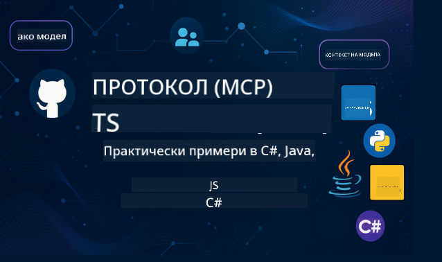

<!--
CO_OP_TRANSLATOR_METADATA:
{
  "original_hash": "2a21391378c12ecfef50f866329dfde0",
  "translation_date": "2025-05-17T05:34:56+00:00",
  "source_file": "README.md",
  "language_code": "bg"
}
-->

Следвайте тези стъпки, за да започнете да използвате тези ресурси:
1. **Форкнете репозиторията**: Кликнете 
2. **Клонирайте репозиторията**: `git clone https://github.com/microsoft/mcp-for-beginners.git`
3. [**Присъединете се към Microsoft Azure AI Foundry Discord и се запознайте с експерти и други разработчици**](https://discord.com/invite/ByRwuEEgH4)

### 🌐 Поддръжка на много езици

#### Поддържана чрез GitHub Action (Автоматизирано и винаги актуално)
[Френски](../fr/README.md) | [Испански](../es/README.md) | [Немски](../de/README.md) | [Руски](../ru/README.md) | [Арабски](../ar/README.md) | [Персийски (Фарси)](../fa/README.md) | [Урду](../ur/README.md) | [Китайски (опростен)](../zh/README.md) | [Китайски (традиционен, Макао)](../mo/README.md) | [Китайски (традиционен, Хонконг)](../hk/README.md) | [Китайски (традиционен, Тайван)](../tw/README.md) | [Японски](../ja/README.md) | [Корейски](../ko/README.md) | [Хинди](../hi/README.md) | [Бенгалски](../bn/README.md) | [Марати](../mr/README.md) | [Непалски](../ne/README.md) | [Пенджабски (Гурмукхи)](../pa/README.md) | [Португалски (Португалия)](../pt/README.md) | [Португалски (Бразилия)](../br/README.md) | [Италиански](../it/README.md) | [Полски](../pl/README.md) | [Турски](../tr/README.md) | [Гръцки](../el/README.md) | [Тайландски](../th/README.md) | [Шведски](../sv/README.md) | [Датски](../da/README.md) | [Норвежки](../no/README.md) | [Фински](../fi/README.md) | [Холандски](../nl/README.md) | [Иврит](../he/README.md) | [Виетнамски](../vi/README.md) | [Индонезийски](../id/README.md) | [Малайски](../ms/README.md) | [Тагалог (Филипински)](../tl/README.md) | [Суахили](../sw/README.md) | [Унгарски](../hu/README.md) | [Чешки](../cs/README.md) | [Словашки](../sk/README.md) | [Румънски](../ro/README.md) | [Български](./README.md) | [Сръбски (Кирилица)](../sr/README.md) | [Хърватски](../hr/README.md) | [Словенски](../sl/README.md)Please write the output from left to right.

[Френски](../fr/README.md) | [Испански](../es/README.md) | [Немски](../de/README.md) | [Руски](../ru/README.md) | [Арабски](../ar/README.md) | [Персийски (Фарси)](../fa/README.md) | [Урду](../ur/README.md) | [Китайски (опростен)](../zh/README.md) | [Китайски (традиционен, Макао)](../mo/README.md) | [Китайски (традиционен, Хонконг)](../hk/README.md) | [Китайски (традиционен, Тайван)](../tw/README.md) | [Японски](../ja/README.md) | [Корейски](../ko/README.md) | [Хинди](../hi/README.md) | [Бенгалски](../bn/README.md) | [Марати](../mr/README.md) | [Непалски](../ne/README.md) | [Пенджабски (Гурмукхи)](../pa/README.md) | [Португалски (Португалия)](../pt/README.md) | [Португалски (Бразилия)](../br/README.md) | [Италиански](../it/README.md) | [Полски](../pl/README.md) | [Турски](../tr/README.md) | [Гръцки](../el/README.md) | [Тайландски](../th/README.md) | [Шведски](../sv/README.md) | [Датски](../da/README.md) | [Норвежки](../no/README.md) | [Фински](../fi/README.md) | [Холандски](../nl/README.md) | [Иврит](../he/README.md) | [Виетнамски](../vi/README.md) | [Индонезийски](../id/README.md) | [Малайски](../ms/README.md) | [Тагалог (Филипински)](../tl/README.md) | [Суахили](../sw/README.md) | [Унгарски](../hu/README.md) | [Чешки](../cs/README.md) | [Словашки](../sk/README.md) | [Румънски](../ro/README.md) | [Български](./README.md) | [Сръбски (Кирилица)](../sr/README.md) | [Хърватски](../hr/README.md) | [Словенски](../sl/README.md)
# 🚀 Ултимативен наръчник за учебната програма на Model Context Protocol (MCP) за начинаещи

## **Научете MCP с практически примери на код в C#, Java, JavaScript, Python и TypeScript**

## 🧠 Обзор на учебната програма на Model Context Protocol

**Model Context Protocol (MCP)** е съвременна рамка, създадена да стандартизира взаимодействията между AI модели и клиентски приложения. Тази отворена учебна програма предлага структурирана пътека за обучение, пълна с практични примери на код и реални случаи на използване, в популярни програмни езици като C#, Java, JavaScript, TypeScript и Python.

Независимо дали сте AI разработчик, системен архитект или софтуерен инженер, този наръчник е вашият всеобхватен ресурс за овладяване на основите и стратегиите за внедряване на MCP.

## 🔗 Официални ресурси за MCP

- 📘 [MCP Документация](https://modelcontextprotocol.io/) – Подробни уроци и ръководства за потребителя  
- 📜 [MCP Спецификация](https://spec.modelcontextprotocol.io/) – Архитектура на протокола и технически справки  
- 🧑‍💻 [MCP GitHub Репозитори](https://github.com/modelcontextprotocol) – Отворени SDK-та, инструменти и примерни кодове  

## 🧭 Структура на пълната учебна програма за MCP

### 📌 [Въведение в MCP](./00-Introduction/README.md)

- Какво представлява Model Context Protocol?
- Защо стандартизацията е важна в AI потоците
- Практически случаи на използване и ползи от MCP

### 🧩 [Обяснение на основните концепции](./01-CoreConcepts/README.md)

- Разбиране на клиент-сървър архитектурата в MCP
- Основни компоненти на протокола: заявки, отговори и схеми
- MCP съобщения и модели за обмен на данни

### 🔐 [Сигурност в MCP](./02-Security/readme.md)

- Идентифициране на заплахи за сигурността в системи, базирани на MCP
- Техники и най-добри практики за осигуряване на внедренията

### 🚀 [Започване с MCP](./03-GettingStarted/README.md)

- Настройка на средата и конфигурация
- Създаване на основни MCP сървъри и клиенти
- Интегриране на MCP със съществуващи приложения

#### 🧮 MCP Проекти с калкулатор:

  
<strong>Разгледайте имплементации на код по езици</strong>

  - [Пример за C# MCP сървър](./03-GettingStarted/samples/csharp/README.md)
  - [Java MCP Калкулатор](./03-GettingStarted/samples/java/calculator/README.md)
  - [JavaScript MCP Демонстрация](./03-GettingStarted/samples/javascript/README.md)
  - [Python MCP Сървър](../../03-GettingStarted/samples/python/mcp_calculator_server.py)
  - [TypeScript MCP Пример](./03-GettingStarted/samples/typescript/README.md)

### 🛠️ [Практическа имплементация](./04-PracticalImplementation/README.md)

- Използване на SDK-та в различни езици
- Дебъгване, тестване и валидация
- Създаване на шаблони за подканващи съобщения и работни потоци

#### 💡 Проекти с напреднали MCP калкулатори:

  
<strong>Разгледайте напреднали примери</strong>

  - [Напреднал C# пример](./04-PracticalImplementation/samples/csharp/README.md)
  - [Java Пример за контейнерно приложение](./04-PracticalImplementation/samples/java/containerapp/README.md)
  - [JavaScript Напреднал пример](./04-PracticalImplementation/samples/javascript/README.md)
  - [Python Сложна имплементация](../../04-PracticalImplementation/samples/python/mcp_sample.py)
  - [TypeScript Пример за контейнер](./04-PracticalImplementation/samples/typescript/README.md)

### 🎓 [Напреднали теми в MCP](./05-AdvancedTopics/README.md)

- Мултимодални AI работни потоци и разширяемост
- Стратегии за сигурно мащабиране
- MCP в корпоративни екосистеми

### 🌍 [Приноси от общността](./06-CommunityContributions/README.md)

- Как да допринесете с код и документи
- Сътрудничество чрез GitHub
- Подобрения и обратна връзка, водени от общността

### 📈 [Инсайти от ранното възприемане](./07-CaseStudies/README.md)

- Реални внедрения и какво работи
- Създаване и внедряване на решения, базирани на MCP
- Тенденции и бъдеща пътна карта

### 📏 [Най-добри практики за MCP](./08-BestPractices/README.md)

- Настройка и оптимизация на производителността
- Проектиране на MCP системи, устойчиви на грешки
- Стратегии за тестване и устойчивост

### 📊 [Проучвания на случаи с MCP](./09-CaseStudy/Readme.md)

- Дълбочинни анализи на архитектури на решения с MCP
- Планове за внедряване и съвети за интеграция
- Анотирани диаграми и разходки през проекти

## 🎯 Предварителни изисквания за изучаване на MCP

За да извлечете максимума от тази учебна програма, трябва да имате:

- Основни познания по C#, Java или Python
- Разбиране на клиент-сървър модел и API-та
- (По избор) Запознатост с концепции за машинно обучение

## 🛠️ Как да използвате ефективно тази учебна програма

Всяка лекция в този наръчник включва:

1. Ясни обяснения на MCP концепции  
2. Примери на живо код в множество езици  
3. Упражнения за създаване на реални MCP приложения  
4. Допълнителни ресурси за напреднали ученици  

## 📜 Информация за лицензията

Това съдържание е лицензирано под **MIT License**. За условията и правилата, вижте [ЛИЦЕНЗИЯТА](../../LICENSE).

## 🤝 Насоки за принос

Този проект приветства приноси и предложения. Повечето приноси изискват да се съгласите с
Contributor License Agreement (CLA), декларирайки че имате право да, и действително предоставяте
правата да използваме вашия принос. За подробности, посетете <https://cla.opensource.microsoft.com>.

Когато изпратите pull request, CLA ботът автоматично ще определи дали трябва да предоставите
CLA и ще украси PR-а подходящо (напр. проверка на статус, коментар). Просто следвайте инструкциите
предоставени от бота. Ще трябва да направите това само веднъж за всички репозитории, използващи нашия CLA.

Този проект е приел [Microsoft Open Source Code of Conduct](https://opensource.microsoft.com/codeofconduct/).
За повече информация вижте [ЧЗВ за кодекс на поведение](https://opensource.microsoft.com/codeofconduct/faq/) или
се свържете с [opencode@microsoft.com](mailto:opencode@microsoft.com) с допълнителни въпроси или коментари.

## ™️ Известие за търговски марки

Този проект може да съдържа търговски марки или лога за проекти, продукти или услуги. Употребата на търговски марки или лога на Microsoft трябва да се съобразява и да следва
[Microsoft's Trademark & Brand Guidelines](https://www.microsoft.com/legal/intellectualproperty/trademarks/usage/general).
Употребата на търговски марки или лога на Microsoft в модифицирани версии на този проект не трябва да предизвиква объркване или да предполага спонсорство от Microsoft.
Всяка употреба на търговски марки или лога на трети страни трябва да се съобразява с политиките на тези трети страни.

**Отказ от отговорност**: 
Този документ е преведен с помощта на AI услуга за превод [Co-op Translator](https://github.com/Azure/co-op-translator). Въпреки че се стремим към точност, моля, имайте предвид, че автоматизираните преводи може да съдържат грешки или неточности. Оригиналният документ на неговия роден език трябва да се счита за авторитетен източник. За критична информация се препоръчва професионален човешки превод. Не носим отговорност за недоразумения или погрешни тълкувания, произтичащи от използването на този превод.