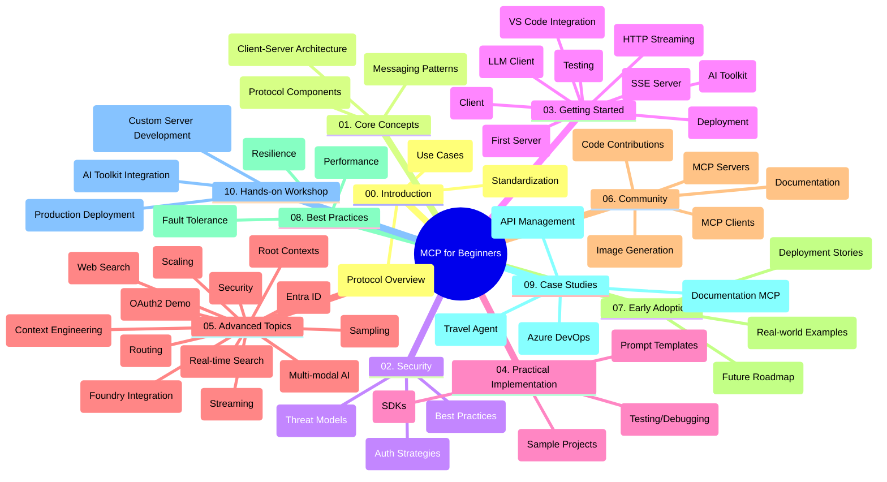

<!--
CO_OP_TRANSLATOR_METADATA:
{
  "original_hash": "5f321ea583cf087a94e47ee74c62b504",
  "translation_date": "2025-07-17T11:22:28+00:00",
  "source_file": "study_guide.md",
  "language_code": "bg"
}
-->
# Model Context Protocol (MCP) за начинаещи - Учебно ръководство

Това учебно ръководство предоставя преглед на структурата и съдържанието на хранилището за учебната програма "Model Context Protocol (MCP) за начинаещи". Използвайте това ръководство, за да навигирате ефективно в хранилището и да извлечете максимума от наличните ресурси.

## Преглед на хранилището

Model Context Protocol (MCP) е стандартизиран фреймуърк за взаимодействия между AI модели и клиентски приложения. Първоначално създаден от Anthropic, MCP сега се поддържа от по-широката MCP общност чрез официалната GitHub организация. Това хранилище предлага изчерпателна учебна програма с практически примери на код на C#, Java, JavaScript, Python и TypeScript, предназначена за AI разработчици, системни архитекти и софтуерни инженери.

## Визуална карта на учебната програма

## Структура на хранилището

Хранилището е организирано в десет основни раздела, всеки от които се фокусира върху различни аспекти на MCP:

1. **Въведение (00-Introduction/)**
   - Преглед на Model Context Protocol
   - Защо стандартизацията е важна в AI процесите
   - Практически случаи на употреба и ползи

2. **Основни концепции (01-CoreConcepts/)**
   - Клиент-сървър архитектура
   - Ключови компоненти на протокола
   - Модели на съобщения в MCP

3. **Сигурност (02-Security/)**
   - Заплахи за сигурността в системи базирани на MCP
   - Най-добри практики за защита на имплементациите
   - Стратегии за автентикация и авторизация

4. **Първи стъпки (03-GettingStarted/)**
   - Настройка и конфигурация на средата
   - Създаване на базови MCP сървъри и клиенти
   - Интеграция с вече съществуващи приложения
   - Включва секции за:
     - Първа имплементация на сървър
     - Разработка на клиент
     - Интеграция на LLM клиент
     - Интеграция с VS Code
     - Сървър с Server-Sent Events (SSE)
     - HTTP стрийминг
     - Интеграция с AI Toolkit
     - Тестови стратегии
     - Насоки за разгръщане

5. **Практическа имплементация (04-PracticalImplementation/)**
   - Използване на SDK-та на различни програмни езици
   - Отстраняване на грешки, тестване и валидация
   - Създаване на многократно използваеми шаблони за prompt-и и работни потоци
   - Примерни проекти с имплементации

6. **Разширени теми (05-AdvancedTopics/)**
   - Техники за инженеринг на контекста
   - Интеграция с Foundry агент
   - Мултимодални AI работни потоци
   - Демонстрации на OAuth2 автентикация
   - Възможности за търсене в реално време
   - Стрийминг в реално време
   - Имплементация на root контексти
   - Стратегии за маршрутизиране
   - Техники за семплиране
   - Подходи за мащабиране
   - Сигурност и съображения
   - Интеграция със сигурността на Entra ID
   - Интеграция с уеб търсене

7. **Приноси от общността (06-CommunityContributions/)**
   - Как да допринасяте с код и документация
   - Сътрудничество чрез GitHub
   - Подобрения и обратна връзка от общността
   - Използване на различни MCP клиенти (Claude Desktop, Cline, VSCode)
   - Работа с популярни MCP сървъри, включително за генериране на изображения

8. **Уроци от ранното приемане (07-LessonsfromEarlyAdoption/)**
   - Реални имплементации и успешни истории
   - Създаване и разгръщане на решения базирани на MCP
   - Тенденции и бъдеща пътна карта

9. **Най-добри практики (08-BestPractices/)**
   - Оптимизация и настройка на производителността
   - Проектиране на устойчиви на грешки MCP системи
   - Стратегии за тестване и устойчивост

10. **Казуси (09-CaseStudy/)**
    - Казус: Интеграция с Azure API Management
    - Казус: Имплементация на туристически агент
    - Казус: Интеграция на Azure DevOps с YouTube
    - Примери за имплементации с подробна документация

11. **Практически уъркшоп (10-StreamliningAIWorkflowsBuildingAnMCPServerWithAIToolkit/)**
    - Изчерпателен практичен уъркшоп, комбиниращ MCP с AI Toolkit
    - Създаване на интелигентни приложения, свързващи AI модели с реални инструменти
    - Практически модули, обхващащи основи, разработка на персонализиран сървър и стратегии за продукционно разгръщане
    - Обучение чрез лабораторни упражнения с инструкции стъпка по стъпка

## Допълнителни ресурси

Хранилището включва допълнителни ресурси:

- **Папка с изображения**: Съдържа диаграми и илюстрации, използвани в учебната програма
- **Преводи**: Поддръжка на множество езици с автоматизирани преводи на документацията
- **Официални MCP ресурси**:
  - [MCP Documentation](https://modelcontextprotocol.io/)
  - [MCP Specification](https://spec.modelcontextprotocol.io/)
  - [MCP GitHub Repository](https://github.com/modelcontextprotocol)

## Как да използвате това хранилище

1. **Последователно учене**: Следвайте главите в ред (от 00 до 10) за структурирано обучение.
2. **Фокус върху конкретен език**: Ако се интересувате от определен програмен език, разгледайте директориите със семпли за имплементации на предпочитания от вас език.
3. **Практическа имплементация**: Започнете с раздела "Първи стъпки", за да настроите средата си и да създадете първия MCP сървър и клиент.
4. **Разширено проучване**: След като усвоите основите, преминете към разширените теми, за да задълбочите знанията си.
5. **Ангажираност с общността**: Присъединете се към MCP общността чрез GitHub дискусии и Discord канали, за да се свържете с експерти и други разработчици.

## MCP клиенти и инструменти

Учебната програма обхваща различни MCP клиенти и инструменти:

1. **Официални клиенти**:
   - Visual Studio Code
   - MCP в Visual Studio Code
   - Claude Desktop
   - Claude в VSCode
   - Claude API

2. **Общностни клиенти**:
   - Cline (терминален клиент)
   - Cursor (редактор на код)
   - ChatMCP
   - Windsurf

3. **Инструменти за управление на MCP**:
   - MCP CLI
   - MCP Manager
   - MCP Linker
   - MCP Router

## Популярни MCP сървъри

Хранилището представя различни MCP сървъри, включително:

1. **Официални референтни сървъри**:
   - Filesystem
   - Fetch
   - Memory
   - Sequential Thinking

2. **Генериране на изображения**:
   - Azure OpenAI DALL-E 3
   - Stable Diffusion WebUI
   - Replicate

3. **Инструменти за разработка**:
   - Git MCP
   - Terminal Control
   - Code Assistant

4. **Специализирани сървъри**:
   - Salesforce
   - Microsoft Teams
   - Jira & Confluence

## Приноси

Това хранилище приветства приноси от общността. Вижте раздела Приноси от общността за насоки как да допринасяте ефективно за MCP екосистемата.

## Промени

| Дата | Промени |
|------|---------|
| 16 юли 2025 | - Актуализирана структура на хранилището, отразяваща текущото съдържание - Добавен раздел MCP клиенти и инструменти - Добавен раздел Популярни MCP сървъри - Обновена визуална карта на учебната програма с всички текущи теми - Разширен раздел Разширени теми с всички специализирани области - Актуализирани казуси с реални примери - Изяснен произход на MCP като създаден от Anthropic |
| 11 юни 2025 | - Първоначално създаване на учебното ръководство - Добавена визуална карта на учебната програма - Описана структура на хранилището - Включени примерни проекти и допълнителни ресурси |

---

*Това учебно ръководство е актуализирано на 16 юли 2025 г. и предоставя преглед на хранилището към тази дата. Съдържанието на хранилището може да бъде обновявано след тази дата.*

**Отказ от отговорност**:  
Този документ е преведен с помощта на AI преводаческа услуга [Co-op Translator](https://github.com/Azure/co-op-translator). Въпреки че се стремим към точност, моля, имайте предвид, че автоматизираните преводи могат да съдържат грешки или неточности. Оригиналният документ на неговия роден език трябва да се счита за авторитетен източник. За критична информация се препоръчва професионален човешки превод. Ние не носим отговорност за каквито и да е недоразумения или неправилни тълкувания, произтичащи от използването на този превод.