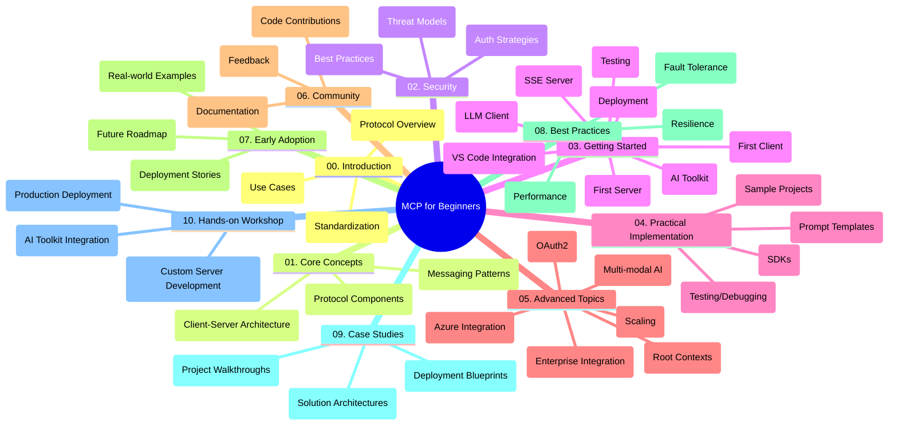

<!--
CO_OP_TRANSLATOR_METADATA:
{
  "original_hash": "a607d4febc94caee9a12b77795f7fc9a",
  "translation_date": "2025-07-13T15:18:33+00:00",
  "source_file": "study_guide.md",
  "language_code": "bg"
}
-->
# Model Context Protocol (MCP) за начинаещи - Учебно ръководство

Това учебно ръководство предоставя преглед на структурата и съдържанието на хранилището за учебната програма "Model Context Protocol (MCP) за начинаещи". Използвайте това ръководство, за да се ориентирате ефективно в хранилището и да извлечете максимума от наличните ресурси.

## Преглед на хранилището

Model Context Protocol (MCP) е стандартизиран фреймуърк за взаимодействия между AI модели и клиентски приложения. Това хранилище предлага изчерпателна учебна програма с практически примери с код на C#, Java, JavaScript, Python и TypeScript, предназначена за AI разработчици, системни архитекти и софтуерни инженери.

## Визуална карта на учебната програма

## Структура на хранилището

Хранилището е организирано в десет основни раздела, всеки от които се фокусира върху различни аспекти на MCP:

1. **Въведение (00-Introduction/)**
   - Преглед на Model Context Protocol
   - Защо стандартизацията е важна в AI процесите
   - Практически случаи на употреба и ползи

2. **Основни концепции (01-CoreConcepts/)**
   - Клиент-сървър архитектура
   - Ключови компоненти на протокола
   - Съобщителни модели в MCP

3. **Сигурност (02-Security/)**
   - Заплахи за сигурността в системи базирани на MCP
   - Най-добри практики за защита на имплементациите
   - Стратегии за автентикация и авторизация

4. **Първи стъпки (03-GettingStarted/)**
   - Настройка и конфигурация на средата
   - Създаване на базови MCP сървъри и клиенти
   - Интеграция с вече съществуващи приложения
   - Подраздели за първи сървър, първи клиент, LLM клиент, интеграция с VS Code, SSE сървър, AI Toolkit, тестване и разгръщане

5. **Практическа реализация (04-PracticalImplementation/)**
   - Използване на SDK-та на различни програмни езици
   - Отстраняване на грешки, тестване и валидиране
   - Създаване на многократно използваеми шаблони за заявки и работни потоци
   - Примерни проекти с демонстрации на имплементации

6. **Разширени теми (05-AdvancedTopics/)**
   - Мултимодални AI работни потоци и разширяемост
   - Стратегии за сигурно мащабиране
   - MCP в корпоративни екосистеми
   - Специализирани теми като интеграция с Azure, мултимодалност, OAuth2, root контексти, маршрутизиране, семплиране, мащабиране, сигурност, интеграция с уеб търсене и стрийминг.

7. **Приноси от общността (06-CommunityContributions/)**
   - Как да допринасяте с код и документация
   - Сътрудничество чрез GitHub
   - Подобрения и обратна връзка от общността

8. **Уроци от ранното приемане (07-LessonsfromEarlyAdoption/)**
   - Реални реализации и успешни истории
   - Създаване и разгръщане на решения базирани на MCP
   - Тенденции и бъдеща пътна карта

9. **Най-добри практики (08-BestPractices/)**
   - Оптимизация и настройка на производителността
   - Проектиране на устойчиви на грешки MCP системи
   - Стратегии за тестване и устойчивост

10. **Казуси (09-CaseStudy/)**
    - Подробен анализ на архитектури на MCP решения
    - Планове за разгръщане и съвети за интеграция
    - Аннотирани диаграми и обхождане на проекти

11. **Практически уъркшоп (10-StreamliningAIWorkflowsBuildingAnMCPServerWithAIToolkit/)**
    - Изчерпателен практичен уъркшоп, комбиниращ MCP с AI Toolkit на Microsoft за VS Code
    - Създаване на интелигентни приложения, свързващи AI модели с реални инструменти
    - Практически модули, обхващащи основи, разработка на персонализиран сървър и стратегии за продукционно разгръщане

## Примерни проекти

Хранилището включва множество примерни проекти, които демонстрират имплементация на MCP на различни програмни езици:

### Основни примери за MCP калкулатор
- C# MCP сървър пример
- Java MCP калкулатор
- JavaScript MCP демонстрация
- Python MCP сървър
- TypeScript MCP пример

### Разширени MCP калкулатор проекти
- Разширен C# пример
- Java контейнерно приложение
- Разширен JavaScript пример
- Сложна Python имплементация
- TypeScript контейнерен пример

## Допълнителни ресурси

Хранилището съдържа и допълнителни ресурси:

- **Папка с изображения**: Съдържа диаграми и илюстрации, използвани в учебната програма
- **Преводи**: Поддръжка на множество езици с автоматизирани преводи на документацията
- **Официални MCP ресурси**:
  - [MCP Documentation](https://modelcontextprotocol.io/)
  - [MCP Specification](https://spec.modelcontextprotocol.io/)
  - [MCP GitHub Repository](https://github.com/modelcontextprotocol)

## Как да използвате това хранилище

1. **Последователно учене**: Следвайте главите в ред (от 00 до 10) за структурирано обучение.
2. **Фокус върху конкретен език**: Ако се интересувате от определен програмен език, разгледайте директориите с примери за имплементации на предпочитания от вас език.
3. **Практическа реализация**: Започнете с раздела "Първи стъпки", за да настроите средата си и да създадете първия MCP сървър и клиент.
4. **Разширено изучаване**: След като усвоите основите, преминете към разширените теми, за да разширите знанията си.
5. **Включване в общността**: Присъединете се към [Azure AI Foundry Discord](https://discord.com/invite/ByRwuEEgH4), за да се свържете с експерти и други разработчици.

## Принос

Това хранилище приветства приноси от общността. Вижте раздела Приноси от общността за насоки как да допринасяте.

---

*Това учебно ръководство е създадено на 11 юни 2025 г. и предоставя преглед на хранилището към тази дата. Съдържанието на хранилището може да е било актуализирано след това.*

**Отказ от отговорност**:  
Този документ е преведен с помощта на AI преводаческа услуга [Co-op Translator](https://github.com/Azure/co-op-translator). Въпреки че се стремим към точност, моля, имайте предвид, че автоматизираните преводи могат да съдържат грешки или неточности. Оригиналният документ на неговия роден език трябва да се счита за авторитетен източник. За критична информация се препоръчва професионален човешки превод. Ние не носим отговорност за каквито и да е недоразумения или неправилни тълкувания, произтичащи от използването на този превод.