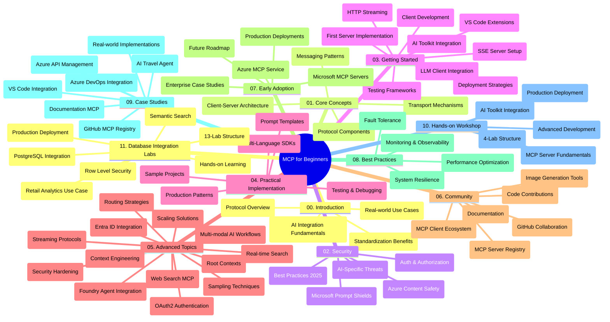

<!--
CO_OP_TRANSLATOR_METADATA:
{
  "original_hash": "aa1ce97bc694b08faf3018bab6d275b9",
  "translation_date": "2025-09-30T22:33:53+00:00",
  "source_file": "study_guide.md",
  "language_code": "bg"
}
-->
# Протокол за контекст на модела (MCP) за начинаещи - Наръчник за обучение

Този наръчник предоставя общ преглед на структурата и съдържанието на хранилището за учебната програма "Протокол за контекст на модела (MCP) за начинаещи". Използвайте го, за да навигирате ефективно в хранилището и да се възползвате максимално от наличните ресурси.

## Общ преглед на хранилището

Протоколът за контекст на модела (MCP) е стандартизирана рамка за взаимодействие между AI модели и клиентски приложения. Първоначално създаден от Anthropic, MCP сега се поддържа от по-широката MCP общност чрез официалната GitHub организация. Това хранилище предоставя цялостна учебна програма с практически примери за код на C#, Java, JavaScript, Python и TypeScript, предназначена за AI разработчици, системни архитекти и софтуерни инженери.

## Визуална карта на учебната програма

## Структура на хранилището

Хранилището е организирано в единадесет основни секции, всяка от които се фокусира върху различни аспекти на MCP:

1. **Въведение (00-Introduction/)**
   - Общ преглед на протокола за контекст на модела
   - Защо стандартизацията е важна в AI процесите
   - Практически приложения и ползи

2. **Основни концепции (01-CoreConcepts/)**
   - Архитектура клиент-сървър
   - Основни компоненти на протокола
   - Модели за съобщения в MCP

3. **Сигурност (02-Security/)**
   - Заплахи за сигурността в системи, базирани на MCP
   - Най-добри практики за осигуряване на реализации
   - Стратегии за автентикация и авторизация
   - **Подробна документация за сигурност**:
     - MCP Най-добри практики за сигурност 2025
     - Ръководство за имплементация на Azure Content Safety
     - Контроли и техники за сигурност в MCP
     - Бърза справка за MCP Най-добри практики
   - **Основни теми за сигурност**:
     - Атаки чрез инжектиране на подсказки и отравяне на инструменти
     - Отвличане на сесии и проблеми с объркани заместници
     - Уязвимости при предаване на токени
     - Прекомерни разрешения и контрол на достъпа
     - Сигурност на веригата за доставки за AI компоненти
     - Интеграция на Microsoft Prompt Shields

4. **Първи стъпки (03-GettingStarted/)**
   - Настройка и конфигурация на средата
   - Създаване на основни MCP сървъри и клиенти
   - Интеграция със съществуващи приложения
   - Включва секции за:
     - Първа имплементация на сървър
     - Разработка на клиенти
     - Интеграция на LLM клиенти
     - Интеграция с VS Code
     - Сървър за събития, изпратени от сървъра (SSE)
     - HTTP стрийминг
     - Интеграция на AI Toolkit
     - Стратегии за тестване
     - Насоки за внедряване

5. **Практическа имплементация (04-PracticalImplementation/)**
   - Използване на SDKs за различни програмни езици
   - Техники за дебъгване, тестване и валидиране
   - Създаване на многократни шаблони за подсказки и работни потоци
   - Примерни проекти с имплементационни примери

6. **Разширени теми (05-AdvancedTopics/)**
   - Техники за инженеринг на контекста
   - Интеграция на Foundry агенти
   - Мултимодални AI работни потоци
   - Демонстрации за автентикация с OAuth2
   - Възможности за търсене в реално време
   - Стрийминг в реално време
   - Имплементация на основни контексти
   - Стратегии за маршрутизация
   - Техники за семплиране
   - Подходи за мащабиране
   - Съображения за сигурност
   - Интеграция на Entra ID сигурност
   - Интеграция на уеб търсене

7. **Приноси от общността (06-CommunityContributions/)**
   - Как да допринесете с код и документация
   - Сътрудничество чрез GitHub
   - Подобрения и обратна връзка, водени от общността
   - Използване на различни MCP клиенти (Claude Desktop, Cline, VSCode)
   - Работа с популярни MCP сървъри, включително генериране на изображения

8. **Уроци от ранното внедряване (07-LessonsfromEarlyAdoption/)**
   - Реални имплементации и успешни истории
   - Създаване и внедряване на решения, базирани на MCP
   - Тенденции и бъдеща пътна карта
   - **Ръководство за Microsoft MCP сървъри**: Подробно ръководство за 10 готови за производство Microsoft MCP сървъри, включително:
     - Microsoft Learn Docs MCP Server
     - Azure MCP Server (15+ специализирани конектори)
     - GitHub MCP Server
     - Azure DevOps MCP Server
     - MarkItDown MCP Server
     - SQL Server MCP Server
     - Playwright MCP Server
     - Dev Box MCP Server
     - Azure AI Foundry MCP Server
     - Microsoft 365 Agents Toolkit MCP Server

9. **Най-добри практики (08-BestPractices/)**
   - Настройка и оптимизация на производителността
   - Проектиране на устойчиви MCP системи
   - Стратегии за тестване и устойчивост

10. **Казуси (09-CaseStudy/)**
    - **Седем подробни казуса**, демонстриращи гъвкавостта на MCP в различни сценарии:
    - **Azure AI Travel Agents**: Оркестрация на множество агенти с Azure OpenAI и AI Search
    - **Интеграция с Azure DevOps**: Автоматизиране на работни процеси с актуализации на данни от YouTube
    - **Извличане на документация в реално време**: Python конзолен клиент със стрийминг HTTP
    - **Интерактивен генератор на учебни планове**: Chainlit уеб приложение с разговорен AI
    - **Документация в редактора**: Интеграция на VS Code с GitHub Copilot работни потоци
    - **Управление на API в Azure**: Интеграция на корпоративни API с MCP сървър
    - **GitHub MCP Registry**: Развитие на екосистемата и платформа за агентна интеграция
    - Примери за имплементация, обхващащи корпоративна интеграция, производителност на разработчиците и развитие на екосистемата

11. **Практически семинар (10-StreamliningAIWorkflowsBuildingAnMCPServerWithAIToolkit/)**
    - Цялостен практически семинар, комбиниращ MCP с AI Toolkit
    - Създаване на интелигентни приложения, свързващи AI модели с реални инструменти
    - Практически модули, обхващащи основи, разработка на персонализирани сървъри и стратегии за внедряване в производство
    - **Структура на лабораториите**:
      - Лаборатория 1: Основи на MCP сървъра
      - Лаборатория 2: Разширена разработка на MCP сървъри
      - Лаборатория 3: Интеграция на AI Toolkit
      - Лаборатория 4: Внедряване и мащабиране в производство
    - Подход за обучение, базиран на лаборатории, със стъпка по стъпка инструкции

12. **Лаборатории за интеграция на MCP сървър с база данни (11-MCPServerHandsOnLabs/)**
    - **Цялостен 13-лабораторен учебен път** за създаване на готови за производство MCP сървъри с интеграция на PostgreSQL
    - **Реална имплементация за анализ на търговия на дребно** с използване на случая Zava Retail
    - **Модели за корпоративен клас**, включително Row Level Security (RLS), семантично търсене и достъп до данни за множество наематели
    - **Пълна структура на лабораториите**:
      - **Лаборатории 00-03: Основи** - Въведение, Архитектура, Сигурност, Настройка на средата
      - **Лаборатории 04-06: Създаване на MCP сървър** - Дизайн на база данни, Имплементация на MCP сървър, Разработка на инструменти
      - **Лаборатории 07-09: Разширени функции** - Семантично търсене, Тестване и дебъгване, Интеграция с VS Code
      - **Лаборатории 10-12: Производство и най-добри практики** - Внедряване, Мониторинг, Оптимизация
    - **Покрити технологии**: FastMCP рамка, PostgreSQL, Azure OpenAI, Azure Container Apps, Application Insights
    - **Резултати от обучението**: Готови за производство MCP сървъри, модели за интеграция на база данни, AI-задвижван анализ, корпоративна сигурност

## Допълнителни ресурси

Хранилището включва поддържащи ресурси:

- **Папка с изображения**: Съдържа диаграми и илюстрации, използвани в учебната програма
- **Преводи**: Поддръжка на много езици с автоматизирани преводи на документация
- **Официални MCP ресурси**:
  - [MCP Документация](https://modelcontextprotocol.io/)
  - [MCP Спецификация](https://spec.modelcontextprotocol.io/)
  - [MCP GitHub Хранилище](https://github.com/modelcontextprotocol)

## Как да използвате това хранилище

1. **Последователно обучение**: Следвайте главите по ред (00 до 11) за структурирано обучение.
2. **Фокус върху конкретен език**: Ако се интересувате от определен програмен език, разгледайте директориите с примери за имплементации на предпочитания от вас език.
3. **Практическа имплементация**: Започнете с раздела "Първи стъпки", за да настроите средата си и да създадете първия си MCP сървър и клиент.
4. **Разширено изследване**: След като се запознаете с основите, навлезте в разширените теми, за да разширите знанията си.
5. **Ангажиране с общността**: Присъединете се към MCP общността чрез GitHub дискусии и Discord канали, за да се свържете с експерти и други разработчици.

## MCP Клиенти и инструменти

Учебната програма обхваща различни MCP клиенти и инструменти:

1. **Официални клиенти**:
   - Visual Studio Code 
   - MCP в Visual Studio Code
   - Claude Desktop
   - Claude в VSCode 
   - Claude API

2. **Клиенти от общността**:
   - Cline (базиран на терминал)
   - Cursor (редактор за код)
   - ChatMCP
   - Windsurf

3. **Инструменти за управление на MCP**:
   - MCP CLI
   - MCP Manager
   - MCP Linker
   - MCP Router

## Популярни MCP сървъри

Хранилището представя различни MCP сървъри, включително:

1. **Официални Microsoft MCP сървъри**:
   - Microsoft Learn Docs MCP Server
   - Azure MCP Server (15+ специализирани конектори)
   - GitHub MCP Server
   - Azure DevOps MCP Server
   - MarkItDown MCP Server
   - SQL Server MCP Server
   - Playwright MCP Server
   - Dev Box MCP Server
   - Azure AI Foundry MCP Server
   - Microsoft 365 Agents Toolkit MCP Server

2. **Официални референтни сървъри**:
   - Файлова система
   - Fetch
   - Памет
   - Последователно мислене

3. **Генериране на изображения**:
   - Azure OpenAI DALL-E 3
   - Stable Diffusion WebUI
   - Replicate

4. **Инструменти за разработка**:
   - Git MCP
   - Контрол на терминала
   - Асистент за код

5. **Специализирани сървъри**:
   - Salesforce
   - Microsoft Teams
   - Jira & Confluence

## Принос

Това хранилище приветства приноси от общността. Вижте раздела "Приноси от общността" за насоки как да допринесете ефективно за MCP екосистемата.

## Дневник на промените

| Дата | Промени |
|------|---------||
| 29 септември 2025 | - Добавен раздел 11-MCPServerHandsOnLabs с цялостен 13-лабораторен учебен път за интеграция на база данни - Актуализирана визуална карта на учебната програма, включваща лаборатории за интеграция на база данни - Подобрена структура на хранилището, отразяваща единадесет основни секции - Добавено подробно описание на интеграцията с PostgreSQL, случай за анализ на търговия на дребно и корпоративни модели - Актуализирани насоки за навигация, включващи секции 00-11 |
| 26 септември 2025 | - Добавен казус GitHub MCP Registry към раздел 09-CaseStudy - Актуализирани казуси, отразяващи седем подробни казуса - Подобрени описания на казусите със специфични детайли за имплементация - Актуализирана визуална карта на учебната програма, включваща GitHub MCP Registry - Ревизирана структура на наръчника, отразяваща фокус върху развитие на екосистемата |
| 18 юли 2025 | - Актуализирана структура на хранилището, включваща ръководство за Microsoft MCP сървъри - Добавен подробен списък с 10 готови за производство Microsoft MCP сървъри - Подобрена секция Популярни MCP сървъри с официални Microsoft MCP сървъри - Актуализиран раздел Казуси с реални файлови примери - Добавени детайли за структурата на лабораториите за практически семинар |
| 16 юли 2025 | - Актуализирана структура на хранилището, отразяваща текущото съдържание - Добавен раздел MCP Клиенти и инструменти - Добавен раздел Популярни MCP сървъри - Актуализирана визуална карта на учебната програма с всички текущи теми - Подобрена секция Разширени теми с всички специализирани области - Актуализирани казуси, отразяващи реални примери - Уточнено, че MCP е създаден от Anthropic |
| 11 юни 2025 | - Първоначално създаване на наръчника - Добавена визуална карта на учебната програма - Очертана структура на хранилището - Включени примерни проекти и допълнителни ресурси |

---

*Този наръчник за обучение е актуализиран на 29 септември 2025 г. и предоставя общ преглед на хранилището към тази дата. Съдържанието на хранилището може да бъде актуализирано след тази дата.*

---

**Отказ от отговорност**:  
Този документ е преведен с помощта на AI услуга за превод [Co-op Translator](https://github.com/Azure/co-op-translator). Въпреки че се стремим към точност, моля, имайте предвид, че автоматизираните преводи може да съдържат грешки или неточности. Оригиналният документ на неговия роден език трябва да се счита за авторитетен източник. За критична информация се препоръчва професионален човешки превод. Ние не носим отговорност за недоразумения или погрешни интерпретации, произтичащи от използването на този превод.