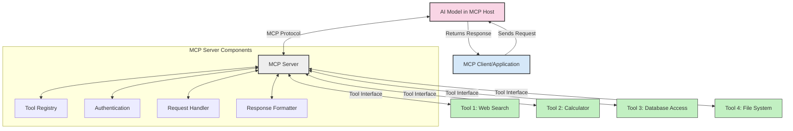
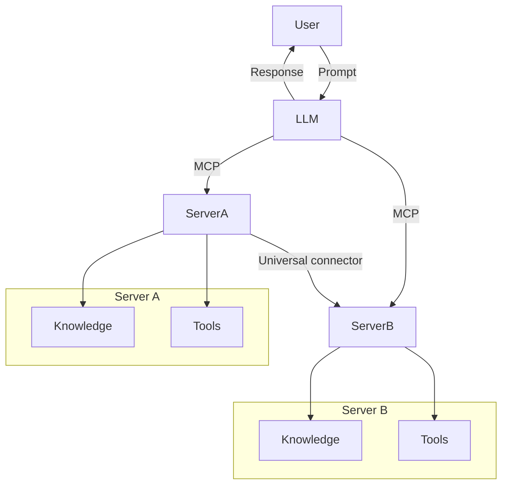

<!--
CO_OP_TRANSLATOR_METADATA:
{
  "original_hash": "02301140adbd807ecf0f17720fa307bc",
  "translation_date": "2025-05-17T05:56:16+00:00",
  "source_file": "00-Introduction/README.md",
  "language_code": "bn"
}
-->
# মডেল কন্টেক্সট প্রোটোকল (MCP) এর পরিচিতি: স্কেলযোগ্য AI অ্যাপ্লিকেশনের জন্য কেন এটি গুরুত্বপূর্ণ

জেনারেটিভ AI অ্যাপ্লিকেশনগুলি একটি বড় অগ্রগতি, কারণ সেগুলি প্রায়শই ব্যবহারকারীকে প্রাকৃতিক ভাষার প্রম্পট ব্যবহার করে অ্যাপের সাথে যোগাযোগ করতে দেয়। তবে, যত বেশি সময় এবং সম্পদ এই ধরনের অ্যাপে বিনিয়োগ করা হয়, আপনি নিশ্চিত করতে চান যে আপনি সহজেই ফাংশনালিটি এবং সম্পদ একত্রিত করতে পারেন, যাতে এটি সহজে বাড়ানো যায়, আপনার অ্যাপ একাধিক মডেলকে সামলাতে পারে এবং এর জটিলতাগুলি সামলাতে পারে। সংক্ষেপে, জেন AI অ্যাপ তৈরি করা শুরুতে সহজ, তবে এটি বাড়তে এবং আরও জটিল হতে থাকলে, আপনাকে একটি আর্কিটেকচার সংজ্ঞায়িত করতে হবে এবং সম্ভবত একটি মানের উপর নির্ভর করতে হবে যাতে নিশ্চিত করা যায় যে আপনার অ্যাপগুলি একটি সঙ্গতিপূর্ণ উপায়ে তৈরি করা হয়েছে। এখানেই MCP জিনিসগুলি সংগঠিত করতে, একটি মান প্রদান করতে আসে।

---

## **🔍 মডেল কন্টেক্সট প্রোটোকল (MCP) কী?**

**মডেল কন্টেক্সট প্রোটোকল (MCP)** একটি **উন্মুক্ত, মানকৃত ইন্টারফেস** যা বড় ভাষার মডেল (LLMs) কে বাহ্যিক সরঞ্জাম, API এবং ডেটা উত্সগুলির সাথে নির্বিঘ্নে যোগাযোগ করতে দেয়। এটি একটি সঙ্গতিপূর্ণ আর্কিটেকচার প্রদান করে AI মডেলের কার্যকারিতা তাদের প্রশিক্ষণ ডেটার বাইরে বাড়াতে, স্মার্টার, স্কেলযোগ্য এবং আরও প্রতিক্রিয়াশীল AI সিস্টেম সক্ষম করে।

---

## **🎯 AI তে মানকরণের গুরুত্ব কেন**

যখন জেনারেটিভ AI অ্যাপ্লিকেশনগুলি আরও জটিল হয়ে ওঠে, তখন এমন মানগুলি গ্রহণ করা অপরিহার্য যা **স্কেলেবিলিটি, এক্সটেনসিবিলিটি** এবং **রক্ষণাবেক্ষণযোগ্যতা** নিশ্চিত করে। MCP এই প্রয়োজনগুলি পূরণ করে:

- মডেল-টুল ইন্টিগ্রেশনগুলিকে একত্রিত করে
- ভঙ্গুর, একক কাস্টম সমাধান হ্রাস করে
- এক ইকোসিস্টেমের মধ্যে একাধিক মডেলের সহাবস্থান অনুমোদন করে

---

## **📚 শেখার উদ্দেশ্য**

এই নিবন্ধের শেষে, আপনি সক্ষম হবেন:

- **মডেল কন্টেক্সট প্রোটোকল (MCP)** এবং এর ব্যবহারের ক্ষেত্রগুলি সংজ্ঞায়িত করতে
- MCP কিভাবে মডেল-টু-টুল যোগাযোগকে মানকরণ করে তা বুঝতে
- MCP আর্কিটেকচারের মূল উপাদানগুলি সনাক্ত করতে
- এন্টারপ্রাইজ এবং উন্নয়ন প্রসঙ্গে MCP এর বাস্তব-বিশ্বের অ্যাপ্লিকেশনগুলি অন্বেষণ করতে

---

## **💡 কেন মডেল কন্টেক্সট প্রোটোকল (MCP) একটি গেম-চেঞ্জার**

### **🔗 MCP AI ইন্টারঅ্যাকশনে ফ্র্যাগমেন্টেশন সমাধান করে**

MCP এর আগে, মডেলগুলির সাথে সরঞ্জাম একত্রিত করতে প্রয়োজন ছিল:

- প্রতিটি টুল-মডেল জুটির জন্য কাস্টম কোড
- প্রতিটি বিক্রেতার জন্য অ-মানক API
- আপডেটের কারণে ঘন ঘন বিরতি
- আরও সরঞ্জাম সহ দরিদ্র স্কেলেবিলিটি

### **✅ MCP মানকরণের সুবিধা**

| **সুবিধা**               | **বর্ণনা**                                                                   |
|--------------------------|-------------------------------------------------------------------------------|
| আন্তঃক্রিয়াশীলতা         | LLM গুলি বিভিন্ন বিক্রেতার সরঞ্জামগুলির সাথে নির্বিঘ্নে কাজ করে                  |
| সামঞ্জস্যতা               | প্ল্যাটফর্ম এবং সরঞ্জামগুলির মধ্যে একরূপ আচরণ                                   |
| পুনঃব্যবহারযোগ্যতা       | একবার তৈরি করা সরঞ্জাম প্রকল্প এবং সিস্টেম জুড়ে ব্যবহার করা যেতে পারে          |
| উন্নত উন্নয়ন            | মানকৃত, প্লাগ-এন্ড-প্লে ইন্টারফেস ব্যবহার করে ডেভ টাইম কমানো                   |

---

## **🧱 উচ্চ-স্তরের MCP আর্কিটেকচার ওভারভিউ**

MCP একটি **ক্লায়েন্ট-সার্ভার মডেল** অনুসরণ করে, যেখানে:

- **MCP হোস্ট** AI মডেলগুলি চালায়
- **MCP ক্লায়েন্ট** অনুরোধ শুরু করে
- **MCP সার্ভার** প্রসঙ্গ, সরঞ্জাম এবং ক্ষমতা সরবরাহ করে

### **মূল উপাদানসমূহ:**

- **সম্পদ** – মডেলগুলির জন্য স্থির বা গতিশীল ডেটা  
- **প্রম্পট** – নির্দেশিত প্রজন্মের জন্য পূর্বনির্ধারিত কর্মপ্রবাহ  
- **সরঞ্জাম** – অনুসন্ধান, গণনা মতো কার্যকরী ফাংশন  
- **স্যাম্পলিং** – পুনরাবৃত্ত ইন্টারঅ্যাকশন মাধ্যমে এজেন্টিক আচরণ

---

## কিভাবে MCP সার্ভার কাজ করে

MCP সার্ভারগুলি নিম্নলিখিতভাবে কাজ করে:

- **অনুরোধ প্রবাহ**: 
    1. MCP ক্লায়েন্ট একটি অনুরোধ পাঠায় MCP হোস্টে চলমান AI মডেলে।
    2. AI মডেলটি সনাক্ত করে কখন এটি বাহ্যিক সরঞ্জাম বা ডেটার প্রয়োজন।
    3. মডেলটি মানকৃত প্রোটোকল ব্যবহার করে MCP সার্ভারের সাথে যোগাযোগ করে।

- **MCP সার্ভার কার্যকারিতা**:
    - টুল রেজিস্ট্রি: উপলব্ধ সরঞ্জাম এবং তাদের ক্ষমতার একটি ক্যাটালগ বজায় রাখে।
    - প্রমাণীকরণ: টুল অ্যাক্সেসের জন্য অনুমতি যাচাই করে।
    - অনুরোধ হ্যান্ডলার: মডেল থেকে আসা টুল অনুরোধগুলি প্রক্রিয়া করে।
    - প্রতিক্রিয়া ফরম্যাটার: মডেলটি বুঝতে পারে এমন একটি ফর্ম্যাটে টুল আউটপুট গঠন করে।

- **টুল এক্সিকিউশন**: 
    - সার্ভারটি উপযুক্ত বাহ্যিক সরঞ্জামগুলিতে অনুরোধ রুট করে
    - সরঞ্জামগুলি তাদের বিশেষায়িত ফাংশনগুলি সম্পাদন করে (অনুসন্ধান, গণনা, ডাটাবেস প্রশ্ন, ইত্যাদি)
    - ফলাফলগুলি একটি সঙ্গতিপূর্ণ ফর্ম্যাটে মডেলে ফেরত দেওয়া হয়।

- **প্রতিক্রিয়া সম্পন্ন**: 
    - AI মডেলটি তার প্রতিক্রিয়ায় টুল আউটপুট অন্তর্ভুক্ত করে।
    - চূড়ান্ত প্রতিক্রিয়াটি ক্লায়েন্ট অ্যাপ্লিকেশনে ফেরত পাঠানো হয়।

## 👨‍💻 কিভাবে একটি MCP সার্ভার তৈরি করবেন (উদাহরণ সহ)

MCP সার্ভারগুলি আপনাকে ডেটা এবং কার্যকারিতা প্রদান করে LLM ক্ষমতাগুলি প্রসারিত করতে দেয়।

এটি চেষ্টা করতে প্রস্তুত? বিভিন্ন ভাষায় একটি সাধারণ MCP সার্ভার তৈরি করার উদাহরণ এখানে দেওয়া হল:

- **পাইথন উদাহরণ**: https://github.com/modelcontextprotocol/python-sdk

- **টাইপস্ক্রিপ্ট উদাহরণ**: https://github.com/modelcontextprotocol/typescript-sdk

- **জাভা উদাহরণ**: https://github.com/modelcontextprotocol/java-sdk

- **C#/.NET উদাহরণ**: https://github.com/modelcontextprotocol/csharp-sdk

## 🌍 বাস্তব-বিশ্বের MCP এর ব্যবহারিক ক্ষেত্র

MCP AI ক্ষমতাগুলি প্রসারিত করে একটি বিস্তৃত অ্যাপ্লিকেশন সক্ষম করে:

| **অ্যাপ্লিকেশন**              | **বর্ণনা**                                                                   |
|-------------------------------|-------------------------------------------------------------------------------|
| এন্টারপ্রাইজ ডেটা ইন্টিগ্রেশন  | LLM গুলিকে ডাটাবেস, CRM বা অভ্যন্তরীণ সরঞ্জামগুলির সাথে সংযুক্ত করে           |
| এজেন্টিক AI সিস্টেম           | সরঞ্জাম অ্যাক্সেস এবং সিদ্ধান্ত গ্রহণ কর্মপ্রবাহ সহ স্বায়ত্তশাসিত এজেন্ট সক্ষম করে |
| মাল্টি-মোডাল অ্যাপ্লিকেশন     | একক একীভূত AI অ্যাপের মধ্যে টেক্সট, ইমেজ এবং অডিও সরঞ্জাম একত্রিত করে        |
| রিয়েল-টাইম ডেটা ইন্টিগ্রেশন  | আরও সঠিক, বর্তমান আউটপুটের জন্য AI ইন্টারঅ্যাকশনে লাইভ ডেটা নিয়ে আসে         |

### 🧠 MCP = AI ইন্টারঅ্যাকশনের জন্য সার্বজনীন মান

মডেল কন্টেক্সট প্রোটোকল (MCP) AI ইন্টারঅ্যাকশনের জন্য একটি সার্বজনীন মান হিসেবে কাজ করে, ঠিক যেমন USB-C ডিভাইসগুলির জন্য শারীরিক সংযোগগুলি মানকরণ করেছে। AI এর জগতে, MCP একটি সঙ্গতিপূর্ণ ইন্টারফেস প্রদান করে, মডেলগুলি (ক্লায়েন্ট) বাহ্যিক সরঞ্জাম এবং ডেটা প্রদানকারীদের (সার্ভার) সাথে নির্বিঘ্নে একত্রিত হতে দেয়। এটি প্রতিটি API বা ডেটা উত্সের জন্য বৈচিত্র্যময়, কাস্টম প্রোটোকলের প্রয়োজনীয়তা দূর করে।

MCP এর অধীনে, একটি MCP-সামঞ্জস্যপূর্ণ সরঞ্জাম (যাকে MCP সার্ভার বলা হয়) একটি একীভূত মান অনুসরণ করে। এই সার্ভারগুলি তারা যে সরঞ্জাম বা ক্রিয়া অফার করে তা তালিকাভুক্ত করতে পারে এবং একটি AI এজেন্ট দ্বারা অনুরোধ করা হলে সেই ক্রিয়াগুলি সম্পাদন করতে পারে। MCP সমর্থনকারী AI এজেন্ট প্ল্যাটফর্মগুলি সার্ভারগুলি থেকে উপলব্ধ সরঞ্জামগুলি আবিষ্কার করতে এবং এই মানক প্রোটোকলের মাধ্যমে সেগুলি আহ্বান করতে সক্ষম।

### 💡 জ্ঞানের অ্যাক্সেসের সুবিধা প্রদান

সরঞ্জাম প্রদান ছাড়াও, MCP জ্ঞানের অ্যাক্সেসের সুবিধা প্রদান করে। এটি অ্যাপ্লিকেশনগুলিকে বড় ভাষার মডেলগুলিকে (LLMs) বিভিন্ন ডেটা উত্সের সাথে লিঙ্ক করে প্রসঙ্গ প্রদান করতে সক্ষম করে। উদাহরণস্বরূপ, একটি MCP সার্ভার একটি কোম্পানির ডকুমেন্ট রিপোজিটরি উপস্থাপন করতে পারে, এজেন্টদের প্রয়োজন অনুযায়ী প্রাসঙ্গিক তথ্য পুনরুদ্ধার করতে দেয়। অন্য একটি সার্ভার ইমেল পাঠানো বা রেকর্ড আপডেট করার মতো নির্দিষ্ট ক্রিয়াগুলি পরিচালনা করতে পারে। এজেন্টের দৃষ্টিকোণ থেকে, এগুলি কেবল সরঞ্জাম যা এটি ব্যবহার করতে পারে—কিছু সরঞ্জাম ডেটা (জ্ঞান প্রসঙ্গ) ফেরত দেয়, অন্যগুলি ক্রিয়া সম্পাদন করে। MCP উভয়কেই দক্ষতার সাথে পরিচালনা করে।

একটি MCP সার্ভারে সংযোগকারী একটি এজেন্ট স্বয়ংক্রিয়ভাবে একটি মানক ফর্ম্যাটের মাধ্যমে সার্ভারের উপলব্ধ ক্ষমতা এবং অ্যাক্সেসযোগ্য ডেটা শিখে। এই মানকরণ গতিশীল সরঞ্জামের প্রাপ্যতা সক্ষম করে। উদাহরণস্বরূপ, একটি এজেন্টের সিস্টেমে একটি নতুন MCP সার্ভার যোগ করা এজেন্টের নির্দেশাবলীর আরও কাস্টমাইজেশন প্রয়োজন ছাড়াই এর ফাংশনগুলিকে অবিলম্বে ব্যবহারযোগ্য করে তোলে।

এই সরলীকৃত ইন্টিগ্রেশনটি মেরমেইড ডায়াগ্রামে চিত্রিত প্রবাহের সাথে সামঞ্জস্যপূর্ণ, যেখানে সার্ভারগুলি সরঞ্জাম এবং জ্ঞান উভয়ই প্রদান করে, সিস্টেম জুড়ে নির্বিঘ্ন সহযোগিতা নিশ্চিত করে।

### 👉 উদাহরণ: স্কেলযোগ্য এজেন্ট সমাধান

## 🔐 MCP এর ব্যবহারিক সুবিধা

MCP ব্যবহার করার কিছু ব্যবহারিক সুবিধা এখানে দেওয়া হল:

- **তাজা তথ্য**: মডেলগুলি তাদের প্রশিক্ষণ ডেটার বাইরে আপ-টু-ডেট তথ্য অ্যাক্সেস করতে পারে
- **ক্ষমতা প্রসারণ**: মডেলগুলি তাদের প্রশিক্ষণ না পাওয়া কাজগুলির জন্য বিশেষায়িত সরঞ্জামগুলিকে কাজে লাগাতে পারে
- **হ্যালুসিনেশন হ্রাস**: বাহ্যিক ডেটা উত্সগুলি তথ্যগত ভিত্তি প্রদান করে
- **গোপনীয়তা**: সংবেদনশীল ডেটা প্রম্পটগুলিতে এমবেড করা না হয়ে সুরক্ষিত পরিবেশের মধ্যে থাকতে পারে

## 📌 মূল বিষয়বস্তু

MCP ব্যবহার করার জন্য নিম্নলিখিত মূল বিষয়বস্তু:

- **MCP** কিভাবে AI মডেলগুলি সরঞ্জাম এবং ডেটার সাথে যোগাযোগ করে তা মানকরণ করে
- **এক্সটেনসিবিলিটি, সামঞ্জস্যতা এবং আন্তঃক্রিয়াশীলতা** প্রচার করে
- MCP **উন্নয়ন সময় কমাতে, নির্ভরযোগ্যতা উন্নত করতে এবং মডেল ক্ষমতা প্রসারণে সহায়তা করে**
- ক্লায়েন্ট-সার্ভার আর্কিটেকচার **নমনীয়, এক্সটেনসিবল AI অ্যাপ্লিকেশন সক্ষম করে**

## 🧠 অনুশীলন

আপনি যে AI অ্যাপ্লিকেশন তৈরি করতে আগ্রহী তা সম্পর্কে ভাবুন।

- কোন **বাহ্যিক সরঞ্জাম বা ডেটা** এর ক্ষমতা বাড়াতে পারে?
- কিভাবে MCP ইন্টিগ্রেশন **সহজ এবং আরও নির্ভরযোগ্য** করতে পারে?

## অতিরিক্ত সম্পদ

- [MCP গিটহাব রিপোজিটরি](https://github.com/modelcontextprotocol)

## পরবর্তী কি

পরবর্তী: [অধ্যায় ১: মূল ধারণা](/01-CoreConcepts/README.md)

**অস্বীকৃতি**:  
এই নথিটি AI অনুবাদ সেবা [Co-op Translator](https://github.com/Azure/co-op-translator) ব্যবহার করে অনূদিত হয়েছে। আমরা যথাসম্ভব সঠিকতার জন্য চেষ্টা করি, তবে অনুগ্রহ করে মনে রাখবেন যে স্বয়ংক্রিয় অনুবাদে ভুল বা অসামঞ্জস্য থাকতে পারে। এর মূল ভাষায় থাকা নথিটিকেই প্রামাণিক উৎস হিসেবে বিবেচনা করা উচিত। গুরুত্বপূর্ণ তথ্যের জন্য, পেশাদার মানব অনুবাদ সুপারিশ করা হয়। এই অনুবাদ ব্যবহারের ফলে সৃষ্ট কোনো ভুল বোঝাবুঝি বা ভুল ব্যাখ্যার জন্য আমরা দায়ী নই।