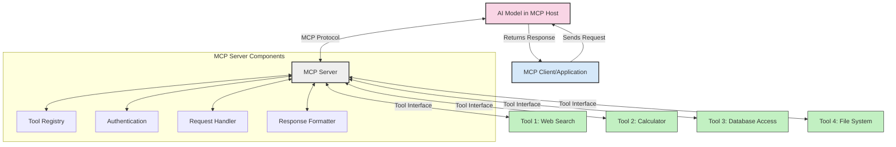
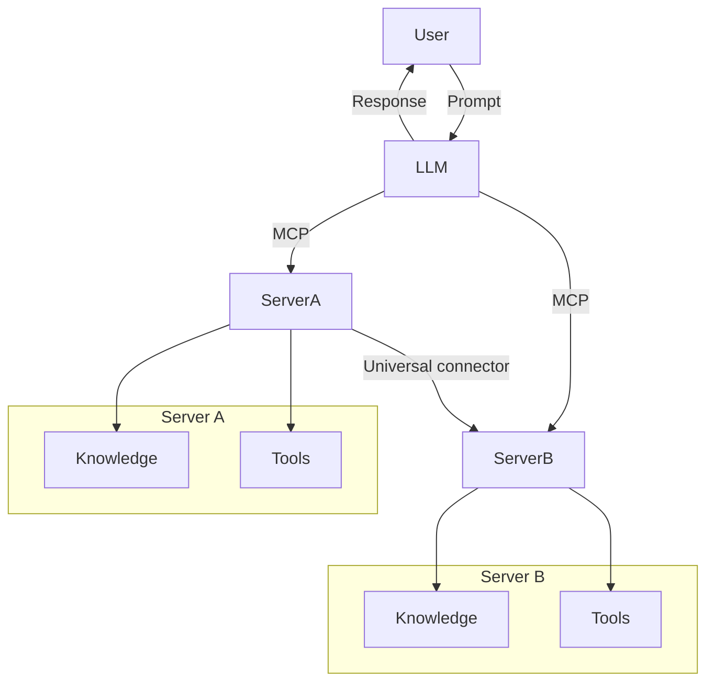
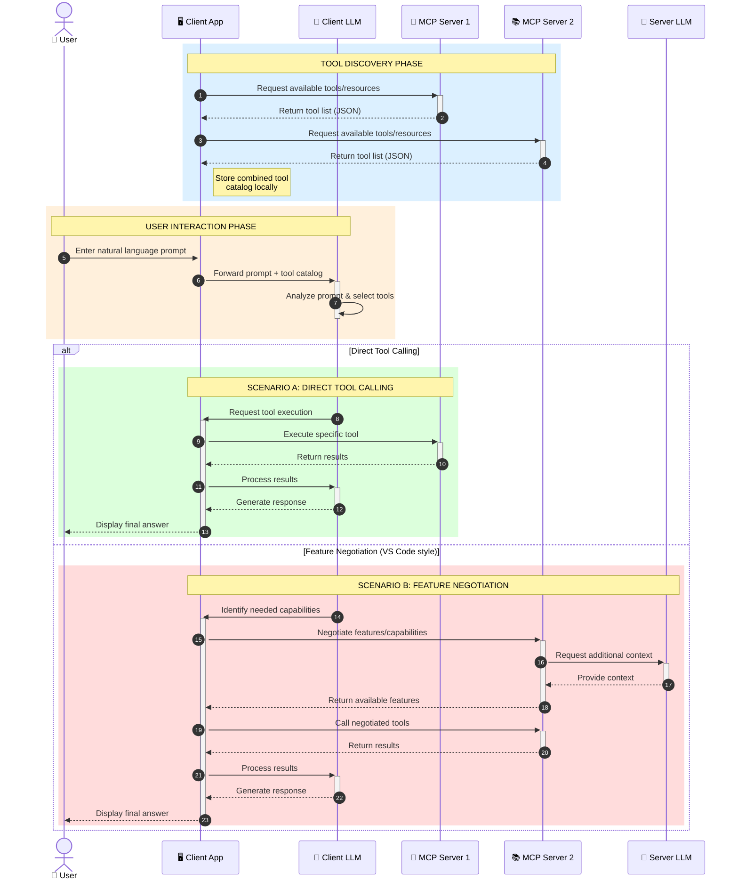

<!--
CO_OP_TRANSLATOR_METADATA:
{
  "original_hash": "25a94c681cf43612ff394d8cf78a74de",
  "translation_date": "2025-05-27T15:59:51+00:00",
  "source_file": "00-Introduction/README.md",
  "language_code": "bn"
}
-->
# Model Context Protocol (MCP) পরিচিতি: স্কেলেবল AI অ্যাপ্লিকেশনগুলোর জন্য এর গুরুত্ব

জেনারেটিভ AI অ্যাপ্লিকেশনগুলি একটি বড় অগ্রগতি, কারণ এগুলো প্রায়শই ব্যবহারকারীকে প্রাকৃতিক ভাষার প্রম্পট ব্যবহার করে অ্যাপ্লিকেশনের সাথে ইন্টারঅ্যাক্ট করার সুযোগ দেয়। তবে, যখন এই ধরনের অ্যাপে আরও সময় এবং সম্পদ বিনিয়োগ করা হয়, তখন আপনি নিশ্চিত হতে চান যে আপনি সহজেই ফাংশনালিটি এবং রিসোর্স একত্রিত করতে পারবেন এমনভাবে যা সহজে সম্প্রসারিত করা যায়, আপনার অ্যাপ্লিকেশন একাধিক মডেল ব্যবহারের জন্য প্রস্তুত থাকবে এবং বিভিন্ন মডেলের জটিলতা সামলাতে পারবে। সংক্ষেপে, জেনারেটিভ AI অ্যাপ তৈরি শুরুতে সহজ, কিন্তু যখন এগুলো বড় এবং জটিল হয়ে ওঠে, তখন আপনাকে একটি আর্কিটেকচার নির্ধারণ করতে হবে এবং সম্ভবত একটি স্ট্যান্ডার্ডের ওপর নির্ভর করতে হবে যাতে আপনার অ্যাপগুলো সঙ্গতিপূর্ণভাবে তৈরি হয়। এখানেই MCP আস্তে কাজ করে এবং একটি স্ট্যান্ডার্ড প্রদান করে।

---

## **🔍 Model Context Protocol (MCP) কী?**

**Model Context Protocol (MCP)** একটি **খোলা, মানসম্মত ইন্টারফেস** যা বড় ভাষা মডেলগুলোকে (LLMs) বাইরের টুল, API এবং ডেটা সোর্সের সাথে নির্বিঘ্নে ইন্টারঅ্যাক্ট করতে দেয়। এটি একটি সঙ্গতিপূর্ণ আর্কিটেকচার প্রদান করে যা AI মডেলের কার্যকারিতা তাদের প্রশিক্ষণ ডেটার বাইরে বাড়ায়, স্মার্টার, স্কেলেবল এবং আরও প্রতিক্রিয়াশীল AI সিস্টেম তৈরি করতে সহায়তা করে।

---

## **🎯 AI-তে স্ট্যান্ডার্ডাইজেশনের গুরুত্ব**

যখন জেনারেটিভ AI অ্যাপ্লিকেশনগুলি আরও জটিল হয়ে ওঠে, তখন এমন স্ট্যান্ডার্ড গ্রহণ করা জরুরি যা **স্কেলেবিলিটি, সম্প্রসারণযোগ্যতা**, এবং **রক্ষণাবেক্ষণযোগ্যতা** নিশ্চিত করে। MCP এই চাহিদাগুলো পূরণ করে:

- মডেল-টুল ইন্টিগ্রেশন একত্রিত করা
- ভঙ্গুর, এককালীন কাস্টম সলিউশন কমানো
- একাধিক মডেল একই পরিবেশে চলার অনুমতি দেওয়া

---

## **📚 শেখার লক্ষ্যসমূহ**

এই নিবন্ধ শেষ হলে আপনি পারবেন:

- **Model Context Protocol (MCP)** কী এবং এর ব্যবহারের ক্ষেত্রসমূহ ব্যাখ্যা করা
- MCP কীভাবে মডেল থেকে টুল কমিউনিকেশন স্ট্যান্ডার্ডাইজ করে তা বোঝা
- MCP আর্কিটেকচারের মূল উপাদানগুলো চিহ্নিত করা
- MCP-এর বাস্তব জীবনের ব্যবহারসমূহ অন্বেষণ করা, বিশেষ করে এন্টারপ্রাইজ এবং ডেভেলপমেন্ট কনটেক্সটে

---

## **💡 কেন Model Context Protocol (MCP) একটি গেম-চেঞ্জার**

### **🔗 MCP AI ইন্টারঅ্যাকশনে বিচ্ছিন্নতা দূর করে**

MCP-এর আগে, মডেল এবং টুল ইন্টিগ্রেট করতে হত:

- প্রতিটি টুল-মডেল জোড়ার জন্য কাস্টম কোড লেখা
- প্রতিটি ভেন্ডারের জন্য অ-স্ট্যান্ডার্ড API ব্যবহার
- আপডেটের কারণে প্রায়ই ভাঙা
- বেশি টুল ব্যবহারে স্কেলেবিলিটি কম

### **✅ MCP স্ট্যান্ডার্ডাইজেশনের সুবিধাসমূহ**

| **সুবিধা**              | **বিবরণ**                                                               |
|-------------------------|------------------------------------------------------------------------|
| ইন্টারঅপারেবিলিটি       | LLM গুলো বিভিন্ন ভেন্ডারের টুলের সাথে নির্বিঘ্নে কাজ করে              |
| সঙ্গতিপূর্ণতা          | প্ল্যাটফর্ম এবং টুল জুড়ে একরকম আচরণ                                  |
| পুনঃব্যবহারযোগ্যতা     | একবার তৈরি টুলগুলো প্রকল্প এবং সিস্টেম জুড়ে ব্যবহার করা যায়          |
| দ্রুত উন্নয়ন           | স্ট্যান্ডার্ড, প্লাগ-অ্যান্ড-প্লে ইন্টারফেস ব্যবহার করে ডেভেলপমেন্ট সময় কমানো |

---

## **🧱 MCP আর্কিটেকচারের উচ্চ স্তরের ওভারভিউ**

MCP একটি **ক্লায়েন্ট-সার্ভার মডেল** অনুসরণ করে, যেখানে:

- **MCP Hosts** AI মডেল চালায়
- **MCP Clients** অনুরোধ শুরু করে
- **MCP Servers** প্রসঙ্গ, টুল এবং ক্ষমতা সরবরাহ করে

### **মূল উপাদানসমূহ:**

- **Resources** – মডেলগুলোর জন্য স্থির বা গতিশীল ডেটা  
- **Prompts** – গাইডেড জেনারেশনের জন্য পূর্বনির্ধারিত ওয়ার্কফ্লো  
- **Tools** – অনুসন্ধান, হিসাব ইত্যাদি কার্যকরী ফাংশন  
- **Sampling** – পুনরাবৃত্তিমূলক ইন্টারঅ্যাকশনের মাধ্যমে এজেন্টিক আচরণ

---

## MCP সার্ভারগুলো কীভাবে কাজ করে

MCP সার্ভারগুলো নিম্নলিখিতভাবে কাজ করে:

- **অনুরোধ প্রবাহ**:  
    1. MCP ক্লায়েন্ট MCP হোস্টে চলমান AI মডেলে একটি অনুরোধ পাঠায়।  
    2. AI মডেল যখন বাইরের টুল বা ডেটার প্রয়োজন অনুভব করে।  
    3. মডেল স্ট্যান্ডার্ডাইজড প্রোটোকল ব্যবহার করে MCP সার্ভারের সাথে যোগাযোগ করে।  

- **MCP সার্ভারের কার্যকারিতা**:  
    - টুল রেজিস্ট্রি: উপলব্ধ টুল এবং তাদের ক্ষমতার তালিকা রাখে।  
    - অথেন্টিকেশন: টুল অ্যাক্সেসের অনুমতি যাচাই করে।  
    - অনুরোধ হ্যান্ডলার: মডেল থেকে আসা টুল অনুরোধ প্রক্রিয়া করে।  
    - রেসপন্স ফরম্যাটার: টুল আউটপুট এমনভাবে গঠন করে যা মডেল বুঝতে পারে।  

- **টুল এক্সিকিউশন**:  
    - সার্ভার অনুরোধগুলো সঠিক বাইরের টুলে রুট করে  
    - টুলগুলো তাদের বিশেষায়িত ফাংশন (অনুসন্ধান, হিসাব, ডেটাবেস কোয়েরি ইত্যাদি) সম্পাদন করে  
    - ফলাফল মডেলের কাছে সঙ্গতিপূর্ণ ফরম্যাটে ফেরত দেয়  

- **রেসপন্স সম্পন্নকরণ**:  
    - AI মডেল টুল আউটপুটকে তার রেসপন্সে অন্তর্ভুক্ত করে  
    - চূড়ান্ত রেসপন্স ক্লায়েন্ট অ্যাপ্লিকেশনে পাঠানো হয়  

## 👨‍💻 MCP সার্ভার কীভাবে তৈরি করবেন (উদাহরণসহ)

MCP সার্ভারগুলো LLM-এর ক্ষমতা বাড়ানোর জন্য ডেটা এবং ফাংশনালিটি প্রদান করে।

পরীক্ষা করতে প্রস্তুত? বিভিন্ন ভাষায় একটি সাধারণ MCP সার্ভার তৈরি করার উদাহরণগুলো এখানে:

- **Python উদাহরণ**: https://github.com/modelcontextprotocol/python-sdk

- **TypeScript উদাহরণ**: https://github.com/modelcontextprotocol/typescript-sdk

- **Java উদাহরণ**: https://github.com/modelcontextprotocol/java-sdk

- **C#/.NET উদাহরণ**: https://github.com/modelcontextprotocol/csharp-sdk

## 🌍 MCP-এর বাস্তব জীবনের ব্যবহার

MCP AI ক্ষমতা সম্প্রসারণ করে বিভিন্ন অ্যাপ্লিকেশনের জন্য সুযোগ সৃষ্টি করে:

| **অ্যাপ্লিকেশন**             | **বিবরণ**                                                                |
|------------------------------|-------------------------------------------------------------------------|
| এন্টারপ্রাইজ ডেটা ইন্টিগ্রেশন | LLM গুলোকে ডেটাবেস, CRM, বা অভ্যন্তরীণ টুলের সাথে সংযুক্ত করা           |
| এজেন্টিক AI সিস্টেম          | স্বায়ত্তশাসিত এজেন্টদের টুল অ্যাক্সেস এবং সিদ্ধান্ত গ্রহণ ওয়ার্কফ্লো প্রদান |
| মাল্টি-মোডাল অ্যাপ্লিকেশন    | একক ঐক্যবদ্ধ AI অ্যাপে টেক্সট, ইমেজ, এবং অডিও টুল একত্রিত করা            |
| রিয়েল-টাইম ডেটা ইন্টিগ্রেশন | AI ইন্টারঅ্যাকশনে লাইভ ডেটা নিয়ে আসা, আরও সঠিক এবং বর্তমান আউটপুটের জন্য  |

### 🧠 MCP = AI ইন্টারঅ্যাকশনের জন্য সার্বজনীন স্ট্যান্ডার্ড

Model Context Protocol (MCP) AI ইন্টারঅ্যাকশনের জন্য একটি সার্বজনীন স্ট্যান্ডার্ড হিসেবে কাজ করে, যেমন USB-C ডিভাইসের শারীরিক সংযোগের জন্য স্ট্যান্ডার্ড করেছে। AI জগতে MCP একটি সঙ্গতিপূর্ণ ইন্টারফেস প্রদান করে, যা মডেলগুলোকে (ক্লায়েন্ট) বাইরের টুল এবং ডেটা প্রোভাইডারদের (সার্ভার) সাথে নির্বিঘ্নে সংযুক্ত হতে দেয়। এর ফলে প্রতিটি API বা ডেটা সোর্সের জন্য ভিন্ন ভিন্ন, কাস্টম প্রোটোকলের প্রয়োজন হয় না।

MCP-এর আওতায়, একটি MCP-সঙ্গত টুল (যাকে MCP সার্ভার বলা হয়) একটি একক স্ট্যান্ডার্ড অনুসরণ করে। এই সার্ভারগুলো তাদের টুল বা কার্যক্রমের তালিকা প্রকাশ করে এবং AI এজেন্টের অনুরোধে সেগুলো কার্যকর করে। MCP সমর্থিত AI এজেন্ট প্ল্যাটফর্মগুলো সার্ভার থেকে উপলব্ধ টুল আবিষ্কার করতে এবং এই স্ট্যান্ডার্ড প্রোটোকলের মাধ্যমে সেগুলো চালাতে সক্ষম।

### 💡 জ্ঞানের প্রবেশাধিকার সহজতর করে

টুল সরবরাহের বাইরে, MCP জ্ঞানের প্রবেশাধিকারও সহজ করে। এটি অ্যাপ্লিকেশনগুলোকে বড় ভাষা মডেলগুলোকে বিভিন্ন ডেটা সোর্সের সাথে সংযুক্ত করে প্রসঙ্গ প্রদান করতে দেয়। উদাহরণস্বরূপ, একটি MCP সার্ভার হতে পারে একটি কোম্পানির ডকুমেন্ট রেপোজিটরি, যা এজেন্টদের প্রয়োজনীয় তথ্য রিট্রিভ করতে সাহায্য করে। অন্য একটি সার্ভার নির্দিষ্ট কাজ যেমন ইমেল পাঠানো বা রেকর্ড আপডেট করার কাজ করে। এজেন্টের দৃষ্টিকোণ থেকে, এগুলো শুধু টুল যা ব্যবহার করতে পারে—কিছু টুল ডেটা (জ্ঞান প্রসঙ্গ) ফেরত দেয়, আবার কিছু কাজ সম্পাদন করে। MCP উভয়ই দক্ষতার সাথে পরিচালনা করে।

একটি এজেন্ট যখন MCP সার্ভারের সাথে সংযুক্ত হয়, তখন স্বয়ংক্রিয়ভাবে সার্ভারের উপলব্ধ ক্ষমতা এবং প্রবেশযোগ্য ডেটা একটি স্ট্যান্ডার্ড ফরম্যাটের মাধ্যমে শিখে নেয়। এই স্ট্যান্ডার্ডাইজেশন ডায়নামিক টুল উপলব্ধতা সম্ভব করে। উদাহরণস্বরূপ, একটি নতুন MCP সার্ভার এজেন্টের সিস্টেমে যুক্ত করলে তার ফাংশনগুলো অবিলম্বে ব্যবহারযোগ্য হয়ে ওঠে, এজেন্টের নির্দেশাবলীতে অতিরিক্ত কাস্টমাইজেশনের প্রয়োজন হয় না।

এই সহজ ইন্টিগ্রেশনটি মেরমেইড ডায়াগ্রামে দেখানো প্রবাহের সাথে সামঞ্জস্যপূর্ণ, যেখানে সার্ভারগুলো টুল এবং জ্ঞান উভয়ই সরবরাহ করে, সিস্টেম জুড়ে নির্বিঘ্ন সহযোগিতা নিশ্চিত করে।

### 👉 উদাহরণ: স্কেলেবল এজেন্ট সলিউশন

### 🔄 ক্লায়েন্ট-সাইড LLM ইন্টিগ্রেশনের সাথে উন্নত MCP দৃশ্যপট

বেসিক MCP আর্কিটেকচারের বাইরে, এমন উন্নত দৃশ্যপট আছে যেখানে ক্লায়েন্ট এবং সার্ভার উভয়েই LLM থাকে, যা আরও জটিল ইন্টারঅ্যাকশন সক্ষম করে:

## 🔐 MCP-এর ব্যবহারিক সুবিধাসমূহ

MCP ব্যবহারের ব্যবহারিক সুবিধাগুলো:

- **তাজা তথ্য**: মডেলগুলি তাদের প্রশিক্ষণ ডেটার বাইরে আপডেটেড তথ্য অ্যাক্সেস করতে পারে  
- **ক্ষমতা সম্প্রসারণ**: মডেলগুলো এমন বিশেষায়িত টুল ব্যবহার করতে পারে যেগুলো তাদের প্রশিক্ষণে ছিল না  
- **হ্যালুসিনেশন কমানো**: বাইরের ডেটা সোর্স বাস্তব তথ্য সরবরাহ করে  
- **গোপনীয়তা**: সংবেদনশীল ডেটা নিরাপদ পরিবেশে থাকে, প্রম্পটে এম্বেড হওয়ার পরিবর্তে  

## 📌 মূল বিষয়সমূহ

MCP ব্যবহারের মূল বিষয়গুলো:

- **MCP** AI মডেল ও টুল ও ডেটার সাথে ইন্টারঅ্যাকশন স্ট্যান্ডার্ডাইজ করে  
- **সম্প্রসারণযোগ্যতা, সঙ্গতিপূর্ণতা, এবং ইন্টারঅপারেবিলিটি** প্রচার করে  
- MCP ডেভেলপমেন্ট সময় কমায়, নির্ভরযোগ্যতা বাড়ায় এবং মডেলের ক্ষমতা বাড়ায়  
- ক্লায়েন্ট-সার্ভার আর্কিটেকচার নমনীয়, সম্প্রসারণযোগ্য AI অ্যাপ্লিকেশন সক্ষম করে  

## 🧠 অনুশীলন

আপনি যে AI অ্যাপ্লিকেশন তৈরি করতে আগ্রহী তা ভাবুন।

- কোন **বাইরের টুল বা ডেটা** এর মাধ্যমে এর ক্ষমতা বাড়ানো যেতে পারে?  
- MCP কীভাবে ইন্টিগ্রেশনকে **সহজ এবং নির্ভরযোগ্য** করতে পারে?  

## অতিরিক্ত সম্পদ

- [MCP GitHub Repository](https://github.com/modelcontextprotocol)

## পরবর্তী কী

পরবর্তী: [Chapter 1: Core Concepts](/01-CoreConcepts/README.md)

**দায়িত্ব অস্বীকার**:  
এই নথিটি AI অনুবাদ সেবা [Co-op Translator](https://github.com/Azure/co-op-translator) ব্যবহার করে অনূদিত হয়েছে। আমরা যথাসাধ্য সঠিকতার চেষ্টা করি, তবে স্বয়ংক্রিয় অনুবাদে ভুল বা অসঙ্গতি থাকতে পারে। মূল নথিটি তার নিজস্ব ভাষায় কর্তৃত্বপূর্ণ উৎস হিসেবে বিবেচিত হওয়া উচিত। গুরুত্বপূর্ণ তথ্যের জন্য পেশাদার মানুষের অনুবাদ গ্রহণ করার পরামর্শ দেওয়া হয়। এই অনুবাদের ব্যবহারে সৃষ্ট কোনো ভুল বোঝাবুঝি বা ভুল ব্যাখ্যার জন্য আমরা দায়ী নই।