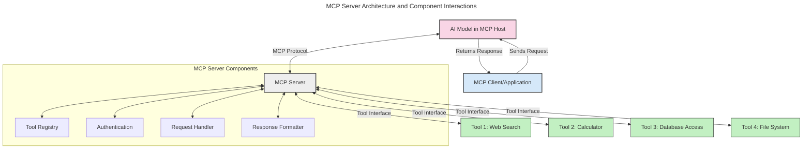
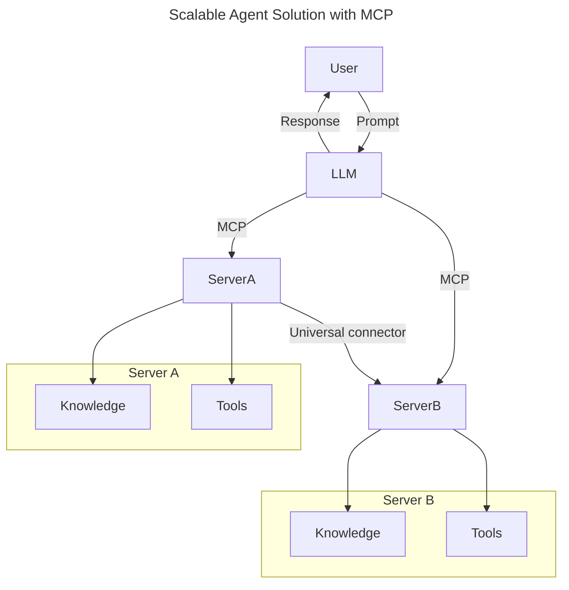
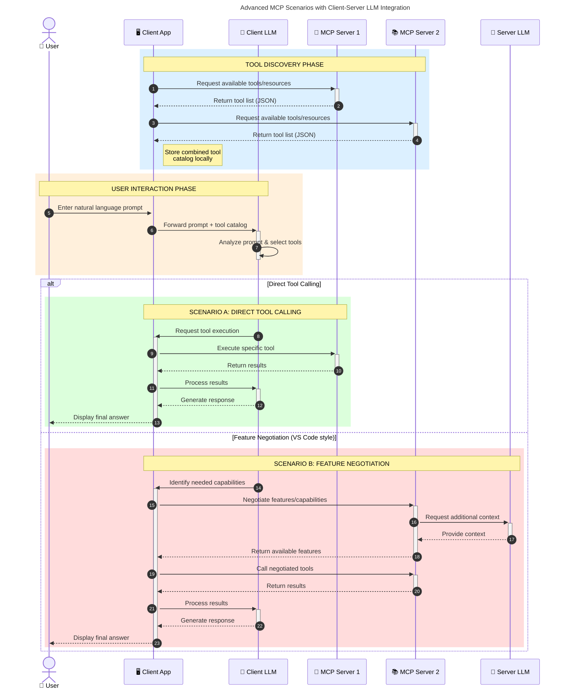

<!--
CO_OP_TRANSLATOR_METADATA:
{
  "original_hash": "1446979020432f512c883848d7eca144",
  "translation_date": "2025-05-29T21:44:43+00:00",
  "source_file": "00-Introduction/README.md",
  "language_code": "bn"
}
-->
# মডেল কনটেক্সট প্রোটোকল (MCP) পরিচিতি: স্কেলযোগ্য AI অ্যাপ্লিকেশনের জন্য এর গুরুত্ব

জেনারেটিভ AI অ্যাপ্লিকেশনগুলো একটি বড় অগ্রগতি কারণ এগুলো ব্যবহারকারীদের প্রাকৃতিক ভাষার মাধ্যমে অ্যাপের সঙ্গে ইন্টারঅ্যাক্ট করার সুযোগ দেয়। তবে, যখন এই ধরনের অ্যাপে আরও সময় ও সম্পদ বিনিয়োগ করা হয়, তখন আপনি নিশ্চিত করতে চান যে ফাংশনালিটি এবং রিসোর্সগুলো সহজেই ইন্টিগ্রেট করা যায়, অ্যাপটি একাধিক মডেল সমর্থন করতে পারে এবং বিভিন্ন মডেল সংক্রান্ত জটিলতাগুলো পরিচালনা করতে পারে। সংক্ষেপে, জেনারেটিভ AI অ্যাপ তৈরি শুরুতে সহজ হলেও, যখন এগুলো বড় এবং জটিল হয়ে ওঠে, তখন আপনাকে একটি আর্কিটেকচার নির্ধারণ করতে হবে এবং সম্ভবত একটি স্ট্যান্ডার্ডের ওপর নির্ভর করতে হবে যাতে আপনার অ্যাপগুলো সঙ্গতিপূর্ণভাবে তৈরি হয়। এখানেই MCP কাজ করে, বিষয়গুলো সংগঠিত করে এবং একটি স্ট্যান্ডার্ড প্রদান করে।

---

## **🔍 মডেল কনটেক্সট প্রোটোকল (MCP) কী?**

**মডেল কনটেক্সট প্রোটোকল (MCP)** একটি **ওপেন, স্ট্যান্ডার্ডাইজড ইন্টারফেস** যা বড় ভাষা মডেলগুলোকে (LLMs) বাহ্যিক টুল, API, এবং ডেটা সোর্সের সাথে নির্বিঘ্নে ইন্টারঅ্যাক্ট করতে দেয়। এটি একটি সঙ্গতিপূর্ণ আর্কিটেকচার প্রদান করে যা AI মডেলের কার্যকারিতা তাদের ট্রেনিং ডেটার বাইরে বাড়ায়, আরও বুদ্ধিমান, স্কেলযোগ্য এবং দ্রুত প্রতিক্রিয়াশীল AI সিস্টেম তৈরি করে।

---

## **🎯 AI-তে স্ট্যান্ডার্ডাইজেশনের গুরুত্ব**

জেনারেটিভ AI অ্যাপ্লিকেশনগুলো যখন আরও জটিল হয়, তখন স্কেলযোগ্যতা, সম্প্রসারণযোগ্যতা এবং রক্ষণাবেক্ষণযোগ্যতা নিশ্চিত করার জন্য স্ট্যান্ডার্ড গ্রহণ করা অপরিহার্য। MCP এই চাহিদাগুলো পূরণ করে:

- মডেল-টুল ইন্টিগ্রেশন একত্রিত করা
- ভঙ্গুর, এককালীন কাস্টম সলিউশন কমানো
- একাধিক মডেল এক ইকোসিস্টেমে একসাথে চলার সুযোগ দেওয়া

---

## **📚 শেখার উদ্দেশ্য**

এই আর্টিকেল শেষে আপনি পারবেন:

- **মডেল কনটেক্সট প্রোটোকল (MCP)** কী এবং এর ব্যবহার ক্ষেত্রগুলি সংজ্ঞায়িত করতে
- MCP কিভাবে মডেল-টু-টুল যোগাযোগ স্ট্যান্ডার্ডাইজ করে তা বুঝতে
- MCP আর্কিটেকচারের মূল উপাদানগুলো চিহ্নিত করতে
- MCP-এর বাস্তব জীবনের অ্যাপ্লিকেশনগুলো অন্বেষণ করতে

---

## **💡 কেন মডেল কনটেক্সট প্রোটোকল (MCP) একটি গেম-চেঞ্জার**

### **🔗 MCP AI ইন্টারঅ্যাকশনে বিভাজন দূর করে**

MCP-এর আগে, মডেল এবং টুল ইন্টিগ্রেশনের জন্য প্রয়োজন ছিল:

- প্রতিটি টুল-মডেল জোড়ার জন্য কাস্টম কোড
- প্রতিটি বিক্রেতার জন্য নন-স্ট্যান্ডার্ড API
- আপডেটের কারণে প্রায়ই বিঘ্ন ঘটে
- বেশি টুলের ক্ষেত্রে স্কেলেবিলিটি কম

### **✅ MCP স্ট্যান্ডার্ডাইজেশনের সুবিধাসমূহ**

| **সুবিধা**             | **বর্ণনা**                                                                   |
|------------------------|-------------------------------------------------------------------------------|
| ইন্টারঅপারেবিলিটি      | LLM গুলো বিভিন্ন বিক্রেতার টুলের সঙ্গে নির্বিঘ্নে কাজ করে                     |
| সঙ্গতি                 | প্ল্যাটফর্ম এবং টুল জুড়ে একরকম আচরণ                                        |
| পুনঃব্যবহারযোগ্যতা     | একবার তৈরি টুলগুলো বিভিন্ন প্রজেক্ট ও সিস্টেমে ব্যবহারযোগ্য                    |
| দ্রুত উন্নয়ন           | স্ট্যান্ডার্ড, প্লাগ-অ্যান্ড-প্লে ইন্টারফেস ব্যবহার করে ডেভেলপমেন্ট সময় কমানো |

---

## **🧱 উচ্চ-স্তরের MCP আর্কিটেকচার ওভারভিউ**

MCP একটি **ক্লায়েন্ট-সার্ভার মডেল** অনুসরণ করে, যেখানে:

- **MCP হোস্ট** AI মডেল চালায়
- **MCP ক্লায়েন্ট** অনুরোধ শুরু করে
- **MCP সার্ভার** কনটেক্সট, টুল এবং সক্ষমতা সরবরাহ করে

### **মূল উপাদানসমূহ:**

- **রিসোর্স** – মডেলের জন্য স্ট্যাটিক বা ডায়নামিক ডেটা  
- **প্রম্পটস** – গাইডেড জেনারেশনের জন্য পূর্বনির্ধারিত ওয়ার্কফ্লো  
- **টুলস** – সার্চ, গণনা ইত্যাদি এক্সিকিউটেবল ফাংশন  
- **স্যাম্পলিং** – পুনরাবৃত্তিমূলক ইন্টারঅ্যাকশনের মাধ্যমে এজেন্টিক আচরণ

---

## MCP সার্ভার কিভাবে কাজ করে

MCP সার্ভার নিম্নলিখিতভাবে কাজ করে:

- **অনুরোধ প্রবাহ**:  
    ১. MCP ক্লায়েন্ট MCP হোস্টে চলমান AI মডেলে একটি অনুরোধ পাঠায়।  
    ২. AI মডেল বাহ্যিক টুল বা ডেটার প্রয়োজন হলে তা সনাক্ত করে।  
    ৩. মডেল স্ট্যান্ডার্ডাইজড প্রোটোকল ব্যবহার করে MCP সার্ভারের সাথে যোগাযোগ করে।

- **MCP সার্ভারের কার্যকারিতা**:  
    - টুল রেজিস্ট্রি: উপলব্ধ টুল এবং তাদের সক্ষমতার ক্যাটালগ বজায় রাখে।  
    - অথেনটিকেশন: টুল অ্যাক্সেসের অনুমতি যাচাই করে।  
    - অনুরোধ হ্যান্ডলার: মডেল থেকে আসা টুল অনুরোধ প্রক্রিয়াজাত করে।  
    - রেসপন্স ফরম্যাটার: মডেল বুঝতে পারার মতো ফরম্যাটে টুল আউটপুট গঠন করে।

- **টুল এক্সিকিউশন**:  
    - সার্ভার অনুরোধগুলো সঠিক বাহ্যিক টুলের কাছে রুট করে  
    - টুলগুলো তাদের বিশেষায়িত কাজ (সার্চ, গণনা, ডাটাবেস কুয়েরি ইত্যাদি) সম্পাদন করে  
    - ফলাফল মডেলের কাছে সঙ্গতিপূর্ণ ফরম্যাটে ফেরত পাঠানো হয়।

- **রেসপন্স সম্পূর্ণকরণ**:  
    - AI মডেল টুল আউটপুটগুলো তার উত্তর তৈরি করার সময় অন্তর্ভুক্ত করে।  
    - চূড়ান্ত উত্তর ক্লায়েন্ট অ্যাপ্লিকেশনে পাঠানো হয়।

## 👨‍💻 MCP সার্ভার তৈরি করার উপায় (উদাহরণসহ)

MCP সার্ভারগুলো LLM-এর সক্ষমতা বাড়াতে ডেটা এবং ফাংশনালিটি প্রদান করে।

পরীক্ষা করতে প্রস্তুত? এখানে বিভিন্ন ভাষায় একটি সাধারণ MCP সার্ভার তৈরির উদাহরণ দেওয়া হল:

- **Python Example**: https://github.com/modelcontextprotocol/python-sdk

- **TypeScript Example**: https://github.com/modelcontextprotocol/typescript-sdk

- **Java Example**: https://github.com/modelcontextprotocol/java-sdk

- **C#/.NET Example**: https://github.com/modelcontextprotocol/csharp-sdk

## 🌍 MCP-এর বাস্তব জীবনের ব্যবহার ক্ষেত্র

MCP AI সক্ষমতা বাড়িয়ে বিভিন্ন অ্যাপ্লিকেশনকে সক্ষম করে:

| **অ্যাপ্লিকেশন**             | **বর্ণনা**                                                                  |
|-----------------------------|-----------------------------------------------------------------------------|
| এন্টারপ্রাইজ ডেটা ইন্টিগ্রেশন | LLM-কে ডাটাবেস, CRM, বা অভ্যন্তরীণ টুলের সাথে সংযুক্ত করা                  |
| এজেন্টিক AI সিস্টেম          | স্বায়ত্তশাসিত এজেন্টদের টুল অ্যাক্সেস এবং সিদ্ধান্ত গ্রহণ ওয়ার্কফ্লো সক্ষম করা |
| মাল্টি-মোডাল অ্যাপ্লিকেশন    | একক AI অ্যাপে টেক্সট, ইমেজ এবং অডিও টুল একত্রিত করা                        |
| রিয়েল-টাইম ডেটা ইন্টিগ্রেশন | AI ইন্টারঅ্যাকশনে লাইভ ডেটা নিয়ে আসা, আরও সঠিক ও আপডেটেড আউটপুটের জন্য    |

### 🧠 MCP = AI ইন্টারঅ্যাকশনের জন্য সর্বজনীন স্ট্যান্ডার্ড

মডেল কনটেক্সট প্রোটোকল (MCP) AI ইন্টারঅ্যাকশনের জন্য একটি সর্বজনীন স্ট্যান্ডার্ড হিসেবে কাজ করে, যেমন USB-C ডিভাইসের জন্য ফিজিক্যাল সংযোগকে স্ট্যান্ডার্ড করে। AI জগতে, MCP একটি সঙ্গতিপূর্ণ ইন্টারফেস প্রদান করে, যা মডেলগুলোকে (ক্লায়েন্ট) বাহ্যিক টুল এবং ডেটা প্রদানকারী (সার্ভার) এর সঙ্গে নির্বিঘ্নে ইন্টিগ্রেট হতে দেয়। এর ফলে প্রতিটি API বা ডেটা সোর্সের জন্য আলাদা কাস্টম প্রোটোকলের প্রয়োজন থাকে না।

MCP-সাপোর্টেড একটি টুল (যাকে MCP সার্ভার বলা হয়) একটি একক স্ট্যান্ডার্ড অনুসরণ করে। এই সার্ভারগুলো তাদের টুল বা অ্যাকশনগুলো তালিকাভুক্ত করতে পারে এবং AI এজেন্টের অনুরোধে সেগুলো কার্যকর করে। MCP সমর্থিত AI এজেন্ট প্ল্যাটফর্মগুলো সার্ভার থেকে উপলব্ধ টুলগুলো আবিষ্কার এবং এই স্ট্যান্ডার্ড প্রোটোকলের মাধ্যমে সেগুলো কল করতে সক্ষম।

### 💡 জ্ঞানে প্রবেশাধিকার সহজ করে

শুধু টুল সরবরাহ করাই নয়, MCP জ্ঞানে প্রবেশাধারক হিসেবেও কাজ করে। এটি অ্যাপ্লিকেশনগুলোকে বড় ভাষা মডেলের (LLM) জন্য প্রাসঙ্গিকতা যোগ করতে বিভিন্ন ডেটা সোর্সের সাথে যুক্ত হতে দেয়। উদাহরণস্বরূপ, একটি MCP সার্ভার একটি কোম্পানির ডকুমেন্ট রেপোজিটরি প্রতিনিধিত্ব করতে পারে, যা এজেন্টদের প্রয়োজনীয় তথ্য দ্রুত আনতে সাহায্য করে। অন্য একটি সার্ভার ইমেল পাঠানো বা রেকর্ড আপডেট করার মতো নির্দিষ্ট কাজ পরিচালনা করতে পারে। এজেন্টের দৃষ্টিকোণ থেকে, এগুলো কেবল টুল—কিছু টুল তথ্য (জ্ঞান কনটেক্সট) প্রদান করে, অন্যগুলো কাজ সম্পাদন করে। MCP দক্ষতার সঙ্গে উভয় পরিচালনা করে।

একটি এজেন্ট যখন MCP সার্ভারের সাথে সংযুক্ত হয়, তখন স্বয়ংক্রিয়ভাবে সার্ভারের উপলব্ধ সক্ষমতা এবং ডেটা স্ট্যান্ডার্ড ফরম্যাটের মাধ্যমে শিখে নেয়। এই স্ট্যান্ডার্ডাইজেশন ডায়নামিক টুল উপলব্ধতা নিশ্চিত করে। উদাহরণস্বরূপ, একটি নতুন MCP সার্ভার এজেন্টের সিস্টেমে যোগ করলে, তার ফাংশনগুলো অবিলম্বে ব্যবহারযোগ্য হয়, এজেন্টের নির্দেশনায় কোনো অতিরিক্ত কাস্টমাইজেশনের প্রয়োজন হয় না।

এই সহজ ইন্টিগ্রেশনটি মেরমেইড ডায়াগ্রামে প্রদর্শিত প্রবাহের সাথে সামঞ্জস্যপূর্ণ, যেখানে সার্ভারগুলো টুল এবং জ্ঞান উভয়ই সরবরাহ করে, যা সিস্টেমগুলোর মধ্যে নির্বিঘ্ন সহযোগিতা নিশ্চিত করে।

### 👉 উদাহরণ: স্কেলযোগ্য এজেন্ট সলিউশন

### 🔄 ক্লায়েন্ট-সাইড LLM ইন্টিগ্রেশনসহ উন্নত MCP পরিস্থিতি

মৌলিক MCP আর্কিটেকচারের বাইরে, এমন উন্নত পরিস্থিতি রয়েছে যেখানে ক্লায়েন্ট এবং সার্ভার উভয়েই LLM থাকে, যা আরও জটিল ইন্টারঅ্যাকশন সক্ষম করে:

## 🔐 MCP-এর ব্যবহারিক সুবিধাসমূহ

MCP ব্যবহারের কিছু ব্যবহারিক সুবিধা:

- **আপডেটেড তথ্য**: মডেল তাদের ট্রেনিং ডেটার বাইরে নতুন তথ্য অ্যাক্সেস করতে পারে  
- **ক্ষমতা সম্প্রসারণ**: মডেল বিশেষায়িত টুল ব্যবহার করতে পারে যেগুলো তারা ট্রেন হয়নি  
- **হ্যালুসিনেশন কমানো**: বাহ্যিক ডেটা সোর্স বাস্তব ভিত্তি প্রদান করে  
- **গোপনীয়তা**: সংবেদনশীল ডেটা নিরাপদ পরিবেশে থাকে, প্রম্পটে এম্বেড হওয়ার পরিবর্তে

## 📌 মূল বিষয়সমূহ

MCP ব্যবহারের প্রধান বিষয়গুলো:

- **MCP** AI মডেল এবং টুল ও ডেটার সঙ্গে ইন্টারঅ্যাকশন স্ট্যান্ডার্ড করে  
- সম্প্রসারণযোগ্যতা, সঙ্গতি, এবং ইন্টারঅপারেবিলিটি উন্নীত করে  
- MCP ডেভেলপমেন্ট সময় কমায়, নির্ভরযোগ্যতা বাড়ায়, এবং মডেল ক্ষমতা বাড়ায়  
- ক্লায়েন্ট-সার্ভার আর্কিটেকচার নমনীয়, সম্প্রসারণযোগ্য AI অ্যাপ্লিকেশন সক্ষম করে

## 🧠 অনুশীলন

আপনি যে AI অ্যাপ্লিকেশন তৈরি করতে আগ্রহী তা ভাবুন।

- কোন কোন **বাহ্যিক টুল বা ডেটা** এর মাধ্যমে এর ক্ষমতা বাড়ানো যেতে পারে?  
- MCP কিভাবে ইন্টিগ্রেশনকে **সহজ এবং নির্ভরযোগ্য** করতে পারে?

## অতিরিক্ত রিসোর্স

- [MCP GitHub Repository](https://github.com/modelcontextprotocol)

## পরবর্তী ধাপ

পরবর্তী: [Chapter 1: Core Concepts](/01-CoreConcepts/README.md)

**অস্বীকৃতি**:  
এই নথিটি AI অনুবাদ সেবা [Co-op Translator](https://github.com/Azure/co-op-translator) ব্যবহার করে অনূদিত হয়েছে। আমরা যথাসাধ্য সঠিকতার চেষ্টা করি, তবে স্বয়ংক্রিয় অনুবাদে ভুল বা অসঙ্গতি থাকতে পারে তা দয়া করে বুঝে নিন। মূল নথিটি তার স্বাভাবিক ভাষায়ই কর্তৃত্বপূর্ণ উৎস হিসেবে বিবেচিত হওয়া উচিত। গুরুত্বপূর্ণ তথ্যের জন্য পেশাদার মানব অনুবাদ গ্রহণ করার পরামর্শ দেওয়া হয়। এই অনুবাদের ব্যবহারে উদ্ভূত কোনো ভুল বোঝাবুঝি বা ভুল ব্যাখ্যার জন্য আমরা দায়ী নই।