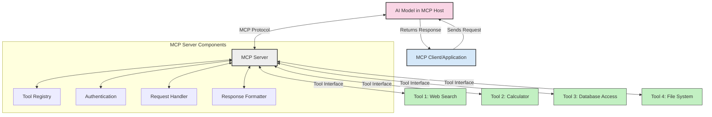
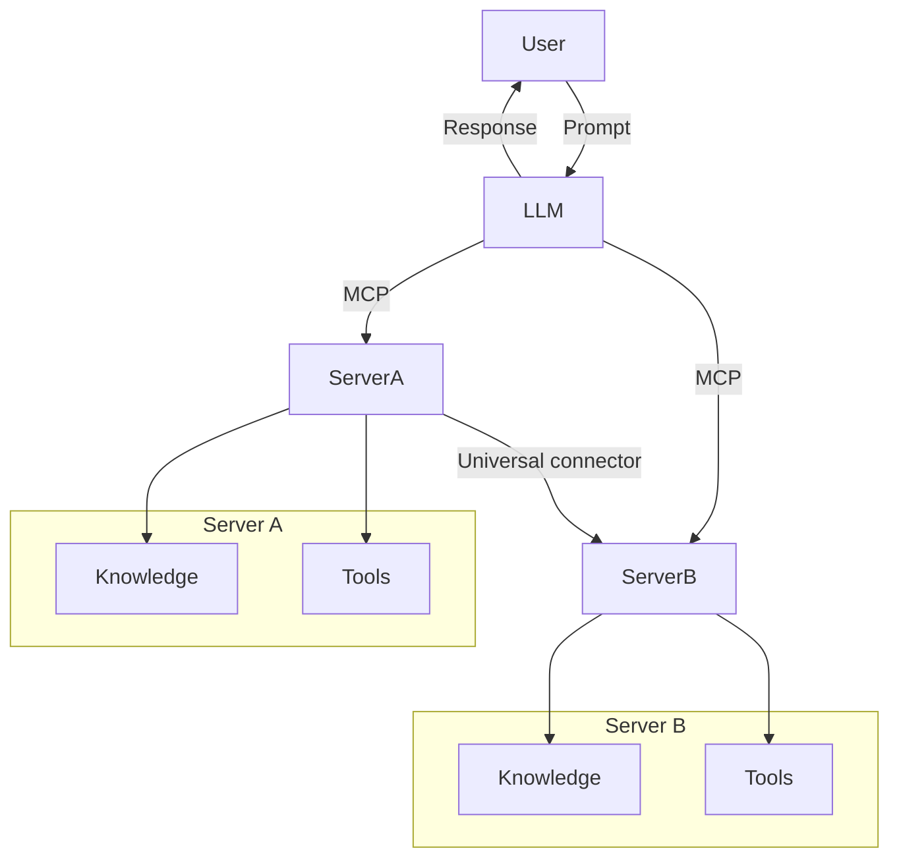

<!--
CO_OP_TRANSLATOR_METADATA:
{
  "original_hash": "1d88dee994dcbb3fa52c271d0c0817b5",
  "translation_date": "2025-05-20T20:56:30+00:00",
  "source_file": "00-Introduction/README.md",
  "language_code": "bn"
}
-->
# মডেল কনটেক্সট প্রোটোকল (MCP) পরিচিতি: স্কেলেবল AI অ্যাপ্লিকেশনগুলোর জন্য কেন গুরুত্বপূর্ণ

জেনারেটিভ AI অ্যাপ্লিকেশনগুলো একটি বড় অগ্রগতি, কারণ এগুলো প্রায়শই ব্যবহারকারীকে প্রাকৃতিক ভাষার প্রম্পট ব্যবহার করে অ্যাপের সাথে ইন্টারঅ্যাক্ট করার সুযোগ দেয়। তবে, যখন এই ধরনের অ্যাপে আরও সময় এবং সম্পদ বিনিয়োগ করা হয়, তখন আপনি চাইবেন যে ফাংশনালিটি এবং রিসোর্সগুলো সহজেই একত্রিত করা যায়, যাতে এটি সহজে প্রসারিত করা যায়, আপনার অ্যাপ একাধিক মডেল ব্যবহার করতে পারে এবং বিভিন্ন মডেলের জটিলতাগুলো সামলাতে পারে। সংক্ষেপে, Gen AI অ্যাপ তৈরি শুরুতে সহজ হলেও, এগুলো বাড়তে এবং জটিল হতে থাকলে আপনাকে একটি আর্কিটেকচার নির্ধারণ করতে হবে এবং সম্ভবত একটি স্ট্যান্ডার্ডের উপর নির্ভর করতে হবে যাতে আপনার অ্যাপগুলো সঙ্গতিপূর্ণভাবে তৈরি হয়। এখানেই MCP আসে, যা বিষয়গুলো সংগঠিত করে এবং একটি স্ট্যান্ডার্ড প্রদান করে।

---

## **🔍 মডেল কনটেক্সট প্রোটোকল (MCP) কী?**

**মডেল কনটেক্সট প্রোটোকল (MCP)** একটি **খোলা, স্ট্যান্ডার্ডাইজড ইন্টারফেস** যা বড় ভাষার মডেলগুলোকে (LLMs) বহিরাগত টুল, API, এবং ডেটা সোর্সের সাথে নির্বিঘ্নে ইন্টারঅ্যাক্ট করার সুযোগ দেয়। এটি একটি সঙ্গতিপূর্ণ আর্কিটেকচার প্রদান করে যা AI মডেলের কার্যকারিতা তাদের প্রশিক্ষণ ডেটার বাইরে বাড়ায়, স্মার্ট, স্কেলেবল এবং আরও প্রতিক্রিয়াশীল AI সিস্টেম তৈরি করতে সহায়তা করে।

---

## **🎯 AI-তে স্ট্যান্ডার্ডাইজেশনের গুরুত্ব**

যখন জেনারেটিভ AI অ্যাপ্লিকেশনগুলো আরও জটিল হয়, তখন এমন স্ট্যান্ডার্ড গ্রহণ করা জরুরি যা **স্কেলেবিলিটি, এক্সটেনসিবিলিটি**, এবং **মেইনটেনেবিলিটি** নিশ্চিত করে। MCP এই চাহিদাগুলো পূরণ করে:

- মডেল-টুল ইন্টিগ্রেশনগুলোকে একত্রিত করে
- ভঙ্গুর, এককালীন কাস্টম সমাধানগুলো কমায়
- একাধিক মডেল একসাথে একই পরিবেশে কাজ করার সুযোগ দেয়

---

## **📚 শেখার উদ্দেশ্য**

এই আর্টিকেলের শেষে, আপনি পারবেন:

- **মডেল কনটেক্সট প্রোটোকল (MCP)** এবং এর ব্যবহার ক্ষেত্রগুলো সংজ্ঞায়িত করতে
- MCP কীভাবে মডেল-টু-টুল কমিউনিকেশন স্ট্যান্ডার্ডাইজ করে তা বুঝতে
- MCP আর্কিটেকচারের মূল উপাদানগুলো চিহ্নিত করতে
- এন্টারপ্রাইজ এবং ডেভেলপমেন্ট প্রেক্ষাপটে MCP এর বাস্তব জীবনের ব্যবহার অন্বেষণ করতে

---

## **💡 কেন মডেল কনটেক্সট প্রোটোকল (MCP) একটি গেম-চেঞ্জার**

### **🔗 MCP AI ইন্টারঅ্যাকশনে বিভাজন দূর করে**

MCP-এর আগে, মডেলগুলোকে টুলের সাথে ইন্টিগ্রেট করতে হত:

- প্রতিটি টুল-মডেল জোড়ার জন্য কাস্টম কোড
- প্রতিটি ভেন্ডারের জন্য অ-স্ট্যান্ডার্ড API
- আপডেটের কারণে প্রায়ই ব্রেক হওয়া
- আরও টুল যুক্ত হলে স্কেলেবিলিটির অভাব

### **✅ MCP স্ট্যান্ডার্ডাইজেশনের সুবিধাসমূহ**

| **সুবিধা**              | **বর্ণনা**                                                                |
|--------------------------|--------------------------------------------------------------------------------|
| ইন্টারঅপারেবিলিটি         | LLM গুলো বিভিন্ন ভেন্ডারের টুলের সাথে নির্বিঘ্নে কাজ করে                       |
| সঙ্গতি                   | প্ল্যাটফর্ম ও টুল জুড়ে একরকম আচরণ নিশ্চিত করে                               |
| পুনঃব্যবহারযোগ্যতা       | একবার তৈরি টুলগুলো বিভিন্ন প্রকল্প ও সিস্টেমে ব্যবহার করা যায়                 |
| দ্রুত উন্নয়ন             | স্ট্যান্ডার্ড, প্লাগ-অ্যান্ড-প্লে ইন্টারফেস ব্যবহার করে ডেভেলপমেন্ট সময় কমায়    |

---

## **🧱 উচ্চস্তরের MCP আর্কিটেকচার ওভারভিউ**

MCP একটি **ক্লায়েন্ট-সার্ভার মডেল** অনুসরণ করে, যেখানে:

- **MCP হোস্ট** AI মডেলগুলো চালায়
- **MCP ক্লায়েন্ট** অনুরোধ শুরু করে
- **MCP সার্ভার** কনটেক্সট, টুল এবং সক্ষমতা সরবরাহ করে

### **মূল উপাদানসমূহ:**

- **রিসোর্স** – মডেলের জন্য স্থির বা গতিশীল ডেটা  
- **প্রম্পট** – গাইডেড জেনারেশনের জন্য পূর্বনির্ধারিত ওয়ার্কফ্লো  
- **টুল** – সার্চ, হিসাব-নিকাশের মতো কার্যকরী ফাংশন  
- **স্যাম্পলিং** – পুনরাবৃত্তিমূলক ইন্টারঅ্যাকশনের মাধ্যমে এজেন্টিক আচরণ

---

## MCP সার্ভার কীভাবে কাজ করে

MCP সার্ভার নিম্নলিখিতভাবে কাজ করে:

- **অনুরোধ প্রবাহ**: 
    1. MCP ক্লায়েন্ট MCP হোস্টে চলমান AI মডেলে অনুরোধ পাঠায়।
    2. AI মডেল বুঝতে পারে কখন বাহ্যিক টুল বা ডেটার প্রয়োজন।
    3. মডেল স্ট্যান্ডার্ডাইজড প্রোটোকল ব্যবহার করে MCP সার্ভারের সাথে যোগাযোগ করে।

- **MCP সার্ভারের কার্যকারিতা**:
    - টুল রেজিস্ট্রি: উপলব্ধ টুল এবং তাদের সক্ষমতার তালিকা রাখে।
    - অথেন্টিকেশন: টুল অ্যাক্সেসের অনুমতি যাচাই করে।
    - অনুরোধ হ্যান্ডলার: মডেল থেকে আসা টুল অনুরোধ প্রক্রিয়া করে।
    - রেসপন্স ফরম্যাটার: টুল আউটপুট মডেল বুঝতে পারে এমন ফরম্যাটে সাজায়।

- **টুল কার্যকরী**: 
    - সার্ভার অনুরোধগুলো যথাযথ বহিরাগত টুলে পাঠায়
    - টুলগুলো তাদের বিশেষায়িত ফাংশন (সার্চ, হিসাব, ডেটাবেস কোয়েরি ইত্যাদি) সম্পাদন করে
    - ফলাফল মডেলে সঙ্গতিপূর্ণ ফরম্যাটে ফেরত দেয়।

- **রেসপন্স সম্পন্নকরণ**: 
    - AI মডেল টুল আউটপুটগুলো তার রেসপন্সে অন্তর্ভুক্ত করে।
    - চূড়ান্ত রেসপন্স ক্লায়েন্ট অ্যাপ্লিকেশনে পাঠানো হয়।

## 👨‍💻 MCP সার্ভার কীভাবে তৈরি করবেন (উদাহরণসহ)

MCP সার্ভারগুলো আপনাকে LLM এর সক্ষমতা বাড়াতে ডেটা এবং ফাংশনালিটি প্রদান করে।

পরীক্ষা করতে প্রস্তুত? এখানে বিভিন্ন ভাষায় একটি সাধারণ MCP সার্ভার তৈরি করার উদাহরণ:

- **Python উদাহরণ**: https://github.com/modelcontextprotocol/python-sdk

- **TypeScript উদাহরণ**: https://github.com/modelcontextprotocol/typescript-sdk

- **Java উদাহরণ**: https://github.com/modelcontextprotocol/java-sdk

- **C#/.NET উদাহরণ**: https://github.com/modelcontextprotocol/csharp-sdk

## 🌍 MCP এর বাস্তব জীবনের ব্যবহার ক্ষেত্র

MCP AI সক্ষমতা বাড়িয়ে বিভিন্ন অ্যাপ্লিকেশন সম্ভব করে:

| **অ্যাপ্লিকেশন**              | **বর্ণনা**                                                                |
|------------------------------|--------------------------------------------------------------------------------|
| এন্টারপ্রাইজ ডেটা ইন্টিগ্রেশন  | LLM গুলোকে ডেটাবেস, CRM, বা অভ্যন্তরীণ টুলের সাথে সংযুক্ত করা                             |
| এজেন্টিক AI সিস্টেম          | টুল অ্যাক্সেস এবং সিদ্ধান্ত গ্রহণের ওয়ার্কফ্লো সহ স্বায়ত্তশাসিত এজেন্ট সক্ষম করা        |
| মাল্টি-মোডাল অ্যাপ্লিকেশন    | টেক্সট, ছবি, এবং অডিও টুলগুলো একক সম্মিলিত AI অ্যাপে সংযুক্ত করা            |
| রিয়েল-টাইম ডেটা ইন্টিগ্রেশন | AI ইন্টারঅ্যাকশনে লাইভ ডেটা নিয়ে এসে আরও সঠিক এবং আপডেটেড আউটপুট নিশ্চিত করা        |

### 🧠 MCP = AI ইন্টারঅ্যাকশনের জন্য ইউনিভার্সাল স্ট্যান্ডার্ড

মডেল কনটেক্সট প্রোটোকল (MCP) AI ইন্টারঅ্যাকশনের জন্য একটি ইউনিভার্সাল স্ট্যান্ডার্ড হিসেবে কাজ করে, যেমন USB-C ডিভাইসের জন্য ফিজিক্যাল কানেকশন স্ট্যান্ডার্ড করেছে। AI দুনিয়ায় MCP একটি সঙ্গতিপূর্ণ ইন্টারফেস প্রদান করে, যা মডেলগুলো (ক্লায়েন্ট) কে বহিরাগত টুল এবং ডেটা প্রোভাইডার (সার্ভার) এর সাথে নির্বিঘ্নে সংযুক্ত হতে দেয়। এতে প্রতিটি API বা ডেটা সোর্সের জন্য আলাদা, কাস্টম প্রোটোকলের প্রয়োজন হয় না।

MCP-এর অধীনে, একটি MCP-সামঞ্জস্যপূর্ণ টুল (যাকে MCP সার্ভার বলা হয়) একটি একক স্ট্যান্ডার্ড অনুসরণ করে। এই সার্ভারগুলো তাদের টুল বা কার্যক্রমের তালিকা দিতে পারে এবং AI এজেন্ট অনুরোধ করলে সেই কার্যক্রম সম্পাদন করে। MCP সমর্থিত AI এজেন্ট প্ল্যাটফর্মগুলো সার্ভার থেকে উপলব্ধ টুল খুঁজে বের করতে এবং এই স্ট্যান্ডার্ড প্রোটোকলের মাধ্যমে সেগুলো আহ্বান করতে সক্ষম।

### 💡 জ্ঞানে প্রবেশাধিকার সহজ করে

শুধুমাত্র টুল সরবরাহের বাইরে, MCP জ্ঞানে প্রবেশাধিকারও সহজ করে তোলে। এটি অ্যাপ্লিকেশনগুলোকে বড় ভাষার মডেল (LLMs) এর সাথে বিভিন্ন ডেটা সোর্স যুক্ত করে কনটেক্সট প্রদান করার সুযোগ দেয়। উদাহরণস্বরূপ, একটি MCP সার্ভার হতে পারে একটি কোম্পানির ডকুমেন্ট রেপোজিটরি, যা এজেন্টদের প্রয়োজনীয় তথ্য অনুরোধে সরবরাহ করে। আরেকটি সার্ভার নির্দিষ্ট কাজ যেমন ইমেইল পাঠানো বা রেকর্ড আপডেট করার কাজ করতে পারে। এজেন্টের দৃষ্টিকোণ থেকে এগুলো শুধু টুল, কিছু টুল তথ্য (জ্ঞান কনটেক্সট) ফেরত দেয়, আবার কিছু টুল কাজ সম্পাদন করে। MCP উভয়ই দক্ষতার সাথে পরিচালনা করে।

একটি এজেন্ট MCP সার্ভারের সাথে সংযুক্ত হলে স্বয়ংক্রিয়ভাবে সার্ভারের উপলব্ধ সক্ষমতা এবং অ্যাক্সেসযোগ্য ডেটা একটি স্ট্যান্ডার্ড ফরম্যাটের মাধ্যমে শিখে নেয়। এই স্ট্যান্ডার্ডাইজেশন ডায়নামিক টুল উপলব্ধতা নিশ্চিত করে। উদাহরণস্বরূপ, একটি নতুন MCP সার্ভার এজেন্ট সিস্টেমে যোগ করলে তার ফাংশনগুলো অবিলম্বে ব্যবহারযোগ্য হয়, এজেন্টের নির্দেশাবলী পুনরায় কাস্টমাইজ করার প্রয়োজন হয় না।

এই সহজীকৃত ইন্টিগ্রেশন মেরমেইড ডায়াগ্রামে প্রদর্শিত প্রবাহের সাথে সামঞ্জস্যপূর্ণ, যেখানে সার্ভারগুলো টুল এবং জ্ঞান উভয়ই সরবরাহ করে, সিস্টেমগুলোর মধ্যে নির্বিঘ্ন সহযোগিতা নিশ্চিত করে।

### 👉 উদাহরণ: স্কেলেবল এজেন্ট সলিউশন

## 🔐 MCP এর ব্যবহারিক সুবিধা

MCP ব্যবহারের ব্যবহারিক সুবিধাসমূহ:

- **তাজা তথ্য**: মডেলগুলো তাদের প্রশিক্ষণ ডেটার বাইরে আপ-টু-ডেট তথ্য অ্যাক্সেস করতে পারে
- **ক্ষমতা বৃদ্ধি**: মডেলগুলো এমন বিশেষায়িত টুল ব্যবহার করতে পারে যেগুলোর জন্য প্রশিক্ষিত হয়নি
- **হ্যালুসিনেশন কমানো**: বাহ্যিক ডেটা সোর্স বাস্তবভিত্তিক তথ্য প্রদান করে
- **গোপনীয়তা**: সংবেদনশীল ডেটা প্রম্পটে এমবেড না করে নিরাপদ পরিবেশে রাখা যায়

## 📌 মূল বিষয়গুলো

MCP ব্যবহারের মূল বিষয়গুলো:

- **MCP** AI মডেলগুলোর টুল এবং ডেটার সাথে ইন্টারঅ্যাকশন স্ট্যান্ডার্ডাইজ করে
- **এক্সটেনসিবিলিটি, সঙ্গতি, এবং ইন্টারঅপারেবিলিটি** উন্নীত করে
- MCP ডেভেলপমেন্ট সময় কমায়, নির্ভরযোগ্যতা বাড়ায়, এবং মডেলের সক্ষমতা বাড়ায়
- ক্লায়েন্ট-সার্ভার আর্কিটেকচার নমনীয়, প্রসারযোগ্য AI অ্যাপ্লিকেশন সম্ভব করে

## 🧠 অনুশীলন

আপনি যে AI অ্যাপ্লিকেশন তৈরি করতে আগ্রহী তা ভাবুন।

- কোন **বাহ্যিক টুল বা ডেটা** এর মাধ্যমে তার সক্ষমতা বাড়ানো যেতে পারে?
- MCP কীভাবে ইন্টিগ্রেশনকে **সহজ এবং নির্ভরযোগ্য** করতে পারে?

## অতিরিক্ত রিসোর্স

- [MCP GitHub Repository](https://github.com/modelcontextprotocol)

## পরবর্তী কী

পরবর্তী: [Chapter 1: Core Concepts](/01-CoreConcepts/README.md)

**দ্রষ্টব্য**:  
এই নথিটি AI অনুবাদ সেবা [Co-op Translator](https://github.com/Azure/co-op-translator) ব্যবহার করে অনূদিত হয়েছে। আমরা যথাসাধ্য সঠিকতার চেষ্টা করি, তবে স্বয়ংক্রিয় অনুবাদে ত্রুটি বা ভুল থাকতে পারে। মূল নথি তার নিজস্ব ভাষায় কর্তৃত্বপূর্ণ উৎস হিসেবে বিবেচনা করা উচিত। গুরুত্বপূর্ণ তথ্যের জন্য পেশাদার মানব অনুবাদ সুপারিশ করা হয়। এই অনুবাদের ব্যবহারে কোনো ভুলবোঝাবুঝি বা ভুল ব্যাখ্যার জন্য আমরা দায়বদ্ধ নই।