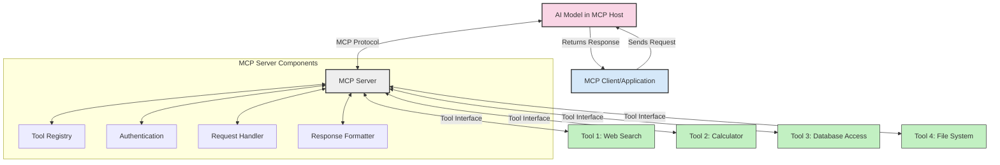
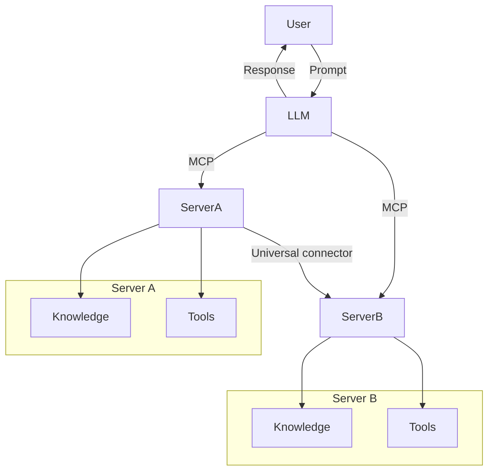

<!--
CO_OP_TRANSLATOR_METADATA:
{
  "original_hash": "cf84f987e1b771d2201408e110dfd2db",
  "translation_date": "2025-05-20T16:28:06+00:00",
  "source_file": "00-Introduction/README.md",
  "language_code": "bn"
}
-->
# মডেল কনটেক্সট প্রোটোকল (MCP) পরিচিতি: স্কেলেবল AI অ্যাপ্লিকেশনের জন্য কেন এটি গুরুত্বপূর্ণ

জেনারেটিভ AI অ্যাপ্লিকেশনগুলি একটি বড় অগ্রগতি, কারণ এগুলো প্রায়শই ব্যবহারকারীকে স্বাভাবিক ভাষার প্রম্পট ব্যবহার করে অ্যাপের সাথে যোগাযোগ করার সুযোগ দেয়। তবে, যখন এই ধরনের অ্যাপে আরও সময় এবং সম্পদ বিনিয়োগ করা হয়, তখন আপনি নিশ্চিত করতে চান যে আপনি সহজেই ফাংশনালিটি এবং রিসোর্স একত্রিত করতে পারবেন এমনভাবে যা সহজে বাড়ানো যায়, আপনার অ্যাপ একাধিক মডেল ব্যবহারের সক্ষমতা রাখে এবং এর জটিলতাগুলো সামলাতে পারে। সংক্ষেপে, জেন AI অ্যাপ তৈরি শুরুতে সহজ হলেও, যখন তা বৃদ্ধি পায় এবং জটিল হয়, তখন আপনাকে একটি স্থাপত্য নির্ধারণ শুরু করতে হবে এবং সম্ভবত একটি স্ট্যান্ডার্ডের উপর নির্ভর করতে হবে যাতে আপনার অ্যাপগুলি ধারাবাহিকভাবে তৈরি হয়। MCP ঠিক এই কাজটি করে, জিনিসগুলোকে সংগঠিত করে, একটি স্ট্যান্ডার্ড প্রদান করে।

---

## **🔍 মডেল কনটেক্সট প্রোটোকল (MCP) কী?**

**মডেল কনটেক্সট প্রোটোকল (MCP)** একটি **খোলা, স্ট্যান্ডার্ডাইজড ইন্টারফেস** যা বড় ভাষার মডেলগুলিকে (LLMs) সহজে বাহ্যিক টুল, API এবং ডেটা সোর্সের সাথে সংযোগ স্থাপন করতে দেয়। এটি একটি ধারাবাহিক স্থাপত্য প্রদান করে যা AI মডেলের কার্যকারিতা তাদের প্রশিক্ষণ ডেটার বাইরে উন্নত করে, স্মার্টার, স্কেলেবল এবং আরও প্রতিক্রিয়াশীল AI সিস্টেম তৈরি করতে সহায়তা করে।

---

## **🎯 AI-তে স্ট্যান্ডার্ডাইজেশনের গুরুত্ব**

যখন জেনারেটিভ AI অ্যাপ্লিকেশনগুলি আরও জটিল হয়ে ওঠে, তখন এমন স্ট্যান্ডার্ড গ্রহণ করা জরুরি যা **স্কেলেবিলিটি, এক্সটেনসিবিলিটি** এবং **রক্ষণাবেক্ষণযোগ্যতা** নিশ্চিত করে। MCP এই চাহিদাগুলো পূরণ করে:

- মডেল-টুল ইন্টিগ্রেশন একত্রিত করা
- ভঙ্গুর, এককালীন কাস্টম সমাধান কমানো
- একাধিক মডেল একসঙ্গে একটি ইকোসিস্টেমে কাজ করার অনুমতি দেয়া

---

## **📚 শেখার লক্ষ্য**

এই আর্টিকেল শেষে, আপনি পারবেন:

- **মডেল কনটেক্সট প্রোটোকল (MCP)** কী এবং এর ব্যবহার ক্ষেত্রগুলি সংজ্ঞায়িত করতে
- MCP কীভাবে মডেল-টু-টুল যোগাযোগ স্ট্যান্ডার্ডাইজ করে তা বুঝতে
- MCP স্থাপত্যের মূল উপাদানগুলো চিনতে
- MCP এর বাস্তব জীবনের অ্যাপ্লিকেশনগুলি এন্টারপ্রাইজ এবং ডেভেলপমেন্ট প্রসঙ্গে অন্বেষণ করতে

---

## **💡 মডেল কনটেক্সট প্রোটোকল (MCP) কেন একটি গেম-চেঞ্জার**

### **🔗 MCP AI ইন্টারঅ্যাকশনে বিভাজন দূর করে**

MCP এর আগে, মডেল এবং টুল সংযোগের জন্য প্রয়োজন ছিল:

- প্রতিটি টুল-মডেল জোড়ার জন্য কাস্টম কোড
- প্রতিটি বিক্রেতার জন্য অ-স্ট্যান্ডার্ড API
- আপডেটের কারণে নিয়মিত ভাঙ্গন
- আরও টুলের সাথে খারাপ স্কেলেবিলিটি

### **✅ MCP স্ট্যান্ডার্ডাইজেশনের সুবিধা**

| **সুবিধা**              | **বর্ণনা**                                                               |
|--------------------------|---------------------------------------------------------------------------|
| ইন্টারঅপারেবিলিটি        | LLM গুলো বিভিন্ন বিক্রেতার টুলের সাথে নির্বিঘ্নে কাজ করে                   |
| সামঞ্জস্য                 | প্ল্যাটফর্ম এবং টুল জুড়ে অভিন্ন আচরণ                                      |
| পুনর্ব্যবহারযোগ্যতা       | একবার তৈরি টুলগুলো বিভিন্ন প্রকল্প এবং সিস্টেমে ব্যবহারযোগ্য                  |
| দ্রুত উন্নয়ন            | স্ট্যান্ডার্ডাইজড, প্লাগ-অ্যান্ড-প্লে ইন্টারফেস ব্যবহার করে ডেভেলপমেন্ট সময় কমানো |

---

## **🧱 উচ্চস্তরের MCP স্থাপত্য ওভারভিউ**

MCP একটি **ক্লায়েন্ট-সার্ভার মডেল** অনুসরণ করে, যেখানে:

- **MCP হোস্টস** AI মডেল চালায়
- **MCP ক্লায়েন্টস** অনুরোধ শুরু করে
- **MCP সার্ভারস** কনটেক্সট, টুল এবং ক্ষমতা সরবরাহ করে

### **মূল উপাদান:**

- **রিসোর্সেস** – মডেলের জন্য স্থির বা গতিশীল ডেটা  
- **প্রম্পটস** – গাইডেড জেনারেশনের জন্য পূর্বনির্ধারিত ওয়ার্কফ্লো  
- **টুলস** – সার্চ, হিসাব-নিকাশের মতো কার্যকরী ফাংশন  
- **স্যাম্পলিং** – পুনরাবৃত্তিমূলক ইন্টারঅ্যাকশনের মাধ্যমে এজেন্টিক আচরণ

---

## MCP সার্ভার কীভাবে কাজ করে

MCP সার্ভার নিম্নলিখিতভাবে কাজ করে:

- **অনুরোধ প্রবাহ**:  
    ১. MCP ক্লায়েন্ট একটি অনুরোধ পাঠায় MCP হোস্টে চলমান AI মডেলকে।  
    ২. AI মডেল নির্ধারণ করে কখন বাহ্যিক টুল বা ডেটার প্রয়োজন।  
    ৩. মডেল স্ট্যান্ডার্ডাইজড প্রোটোকল ব্যবহার করে MCP সার্ভারের সাথে যোগাযোগ করে।

- **MCP সার্ভারের কার্যকারিতা**:  
    - টুল রেজিস্ট্রি: উপলব্ধ টুল এবং তাদের ক্ষমতার ক্যাটালগ বজায় রাখে।  
    - অথেনটিকেশন: টুল অ্যাক্সেসের অনুমতি যাচাই করে।  
    - অনুরোধ হ্যান্ডলার: মডেল থেকে আসা টুল অনুরোধ প্রক্রিয়াজাত করে।  
    - রেসপন্স ফরম্যাটার: মডেলের বোঝার জন্য টুল আউটপুট গঠন করে।

- **টুল এক্সিকিউশন**:  
    - সার্ভার অনুরোধগুলো উপযুক্ত বাহ্যিক টুলে রুট করে  
    - টুলগুলো তাদের বিশেষায়িত ফাংশন সম্পাদন করে (সার্চ, হিসাব, ডাটাবেস কোয়েরি ইত্যাদি)  
    - ফলাফল ধারাবাহিক ফরম্যাটে মডেলে ফেরত পাঠানো হয়।

- **রেসপন্স সম্পন্নকরণ**:  
    - AI মডেল টুল আউটপুটকে তার রেসপন্সে অন্তর্ভুক্ত করে।  
    - চূড়ান্ত রেসপন্স ক্লায়েন্ট অ্যাপ্লিকেশনে পাঠানো হয়।

## 👨‍💻 MCP সার্ভার কীভাবে তৈরি করবেন (উদাহরণসহ)

MCP সার্ভার আপনাকে LLM ক্ষমতা বাড়াতে ডেটা এবং ফাংশনালিটি প্রদান করার সুযোগ দেয়।

পরীক্ষা করতে প্রস্তুত? বিভিন্ন ভাষায় সহজ MCP সার্ভার তৈরির উদাহরণ এখানে:

- **Python উদাহরণ**: https://github.com/modelcontextprotocol/python-sdk

- **TypeScript উদাহরণ**: https://github.com/modelcontextprotocol/typescript-sdk

- **Java উদাহরণ**: https://github.com/modelcontextprotocol/java-sdk

- **C#/.NET উদাহরণ**: https://github.com/modelcontextprotocol/csharp-sdk

## 🌍 MCP এর বাস্তব জীবনের ব্যবহার ক্ষেত্র

MCP AI ক্ষমতা বাড়িয়ে বিভিন্ন অ্যাপ্লিকেশন সক্ষম করে:

| **অ্যাপ্লিকেশন**             | **বর্ণনা**                                                                |
|------------------------------|---------------------------------------------------------------------------|
| এন্টারপ্রাইজ ডেটা ইন্টিগ্রেশন | LLM গুলোকে ডাটাবেস, CRM বা অভ্যন্তরীণ টুলের সাথে সংযুক্ত করা               |
| এজেন্টিক AI সিস্টেম          | টুল অ্যাক্সেস এবং সিদ্ধান্ত গ্রহণের ওয়ার্কফ্লো সহ স্বায়ত্তশাসিত এজেন্ট সক্ষম করা  |
| মাল্টি-মোডাল অ্যাপ্লিকেশন    | একটি একক একীভূত AI অ্যাপে টেক্সট, ছবি এবং অডিও টুল একত্রিত করা               |
| রিয়েল-টাইম ডেটা ইন্টিগ্রেশন | AI ইন্টারঅ্যাকশনে লাইভ ডেটা এনে আরও সঠিক, বর্তমান আউটপুট তৈরি করা           |

### 🧠 MCP = AI ইন্টারঅ্যাকশনের জন্য সার্বজনীন স্ট্যান্ডার্ড

মডেল কনটেক্সট প্রোটোকল (MCP) AI ইন্টারঅ্যাকশনের জন্য একটি সার্বজনীন স্ট্যান্ডার্ড হিসেবে কাজ করে, যেমন USB-C ডিভাইসের জন্য শারীরিক সংযোগ স্ট্যান্ডার্ড করেছে। AI জগতে, MCP একটি ধারাবাহিক ইন্টারফেস প্রদান করে, যা মডেল (ক্লায়েন্ট) গুলোকে বাহ্যিক টুল এবং ডেটা প্রদানকারী (সার্ভার) এর সাথে নির্বিঘ্নে সংযুক্ত হতে দেয়। এটি প্রতিটি API বা ডেটা সোর্সের জন্য বিভিন্ন, কাস্টম প্রোটোকল ব্যবহারের প্রয়োজনীয়তা দূর করে।

MCP এর অধীনে, একটি MCP-সঙ্গত টুল (যাকে MCP সার্ভার বলা হয়) একটি একক স্ট্যান্ডার্ড অনুসরণ করে। এই সার্ভারগুলো তাদের সরবরাহকৃত টুল বা অ্যাকশন তালিকাভুক্ত করতে পারে এবং AI এজেন্টের অনুরোধে সেই অ্যাকশনগুলো সম্পাদন করে। MCP সমর্থিত AI এজেন্ট প্ল্যাটফর্মগুলো সার্ভার থেকে উপলব্ধ টুলগুলো আবিষ্কার করতে পারে এবং এই স্ট্যান্ডার্ড প্রোটোকলের মাধ্যমে সেগুলো কল করতে পারে।

### 💡 জ্ঞানের প্রবেশাধিকার সহজতর করে

টুল সরবরাহের বাইরে, MCP জ্ঞানের প্রবেশাধিকারও সহজতর করে। এটি অ্যাপ্লিকেশনগুলোকে বড় ভাষার মডেলগুলিকে (LLMs) বিভিন্ন ডেটা সোর্সের সাথে সংযুক্ত করে প্রসঙ্গ প্রদান করতে সক্ষম করে। উদাহরণস্বরূপ, একটি MCP সার্ভার একটি কোম্পানির ডকুমেন্ট রিপোজিটরি প্রতিনিধিত্ব করতে পারে, যা এজেন্টদের প্রয়োজনীয় তথ্য অনুরোধে পাওয়ার সুযোগ দেয়। অন্য একটি সার্ভার নির্দিষ্ট কাজ যেমন ইমেইল পাঠানো বা রেকর্ড আপডেট করার কাজ করতে পারে। এজেন্টের দৃষ্টিকোণ থেকে, এগুলো কেবল ব্যবহারযোগ্য টুল, কিছু টুল ডেটা (জ্ঞান প্রসঙ্গ) ফেরত দেয়, অন্যগুলো কাজ সম্পাদন করে। MCP দক্ষতার সাথে উভয় পরিচালনা করে।

একটি এজেন্ট MCP সার্ভারের সাথে সংযোগ করলে স্বয়ংক্রিয়ভাবে সার্ভারের উপলব্ধ ক্ষমতা এবং অ্যাক্সেসযোগ্য ডেটা একটি স্ট্যান্ডার্ড ফরম্যাটের মাধ্যমে শিখে। এই স্ট্যান্ডার্ডাইজেশন গতিশীল টুল উপলব্ধতা সম্ভব করে। উদাহরণস্বরূপ, একটি নতুন MCP সার্ভার এজেন্টের সিস্টেমে যোগ করলে তার ফাংশনগুলো অবিলম্বে ব্যবহারযোগ্য হয়, এজেন্টের নির্দেশাবলী পরিবর্তনের প্রয়োজন ছাড়াই।

এই সুশৃঙ্খল ইন্টিগ্রেশন মেরমেইড ডায়াগ্রামে প্রদর্শিত প্রবাহের সাথে সামঞ্জস্যপূর্ণ, যেখানে সার্ভারগুলো টুল এবং জ্ঞান উভয়ই সরবরাহ করে, সিস্টেমের মধ্যে নির্বিঘ্ন সহযোগিতা নিশ্চিত করে।

### 👉 উদাহরণ: স্কেলেবল এজেন্ট সলিউশন

## 🔐 MCP এর ব্যবহারিক সুবিধা

MCP ব্যবহারের ব্যবহারিক সুবিধাগুলো হলো:

- **তারতম্য**: মডেল তাদের প্রশিক্ষণ ডেটার বাইরে সর্বশেষ তথ্য অ্যাক্সেস করতে পারে  
- **ক্ষমতা সম্প্রসারণ**: মডেল তাদের প্রশিক্ষণকৃত কাজের বাইরে বিশেষায়িত টুল ব্যবহার করতে পারে  
- **হ্যালুসিনেশন কমানো**: বাহ্যিক ডেটা সোর্স বাস্তব ভিত্তি প্রদান করে  
- **গোপনীয়তা**: সংবেদনশীল ডেটা প্রম্পটে এম্বেড না করে সুরক্ষিত পরিবেশে রাখা যায়  

## 📌 মূল বিষয়সমূহ

MCP ব্যবহারের জন্য মূল বিষয়গুলো:

- **MCP** AI মডেলগুলোর টুল এবং ডেটার সাথে যোগাযোগ স্ট্যান্ডার্ডাইজ করে  
- **এক্সটেনসিবিলিটি, সামঞ্জস্য এবং ইন্টারঅপারেবিলিটি** প্রচার করে  
- MCP ডেভেলপমেন্ট সময় কমাতে, নির্ভরযোগ্যতা বাড়াতে এবং মডেল ক্ষমতা সম্প্রসারণে সাহায্য করে  
- ক্লায়েন্ট-সার্ভার স্থাপত্য নমনীয়, এক্সটেনসিবল AI অ্যাপ্লিকেশন সক্ষম করে  

## 🧠 অনুশীলন

আপনি যে AI অ্যাপ্লিকেশন তৈরি করতে আগ্রহী তা ভাবুন।

- কোন **বাহ্যিক টুল বা ডেটা** এর মাধ্যমে এর ক্ষমতা বাড়ানো যেতে পারে?  
- MCP কীভাবে ইন্টিগ্রেশনকে **সহজ এবং নির্ভরযোগ্য** করতে পারে?  

## অতিরিক্ত রিসোর্স

- [MCP GitHub Repository](https://github.com/modelcontextprotocol)

## পরবর্তী ধাপ

পরবর্তী: [Chapter 1: Core Concepts](/01-CoreConcepts/README.md)

**অস্বীকৃতি**:  
এই ডকুমেন্টটি AI অনুবাদ সেবা [Co-op Translator](https://github.com/Azure/co-op-translator) ব্যবহার করে অনূদিত হয়েছে। আমরা যথাসাধ্য সঠিকতার চেষ্টা করি, তবে অনুগ্রহ করে মনে রাখবেন যে স্বয়ংক্রিয় অনুবাদে ভুল বা অসঙ্গতি থাকতে পারে। মূল ডকুমেন্টের নিজস্ব ভাষায় সংস্করণকেই সর্বোচ্চ কর্তৃত্বপূর্ণ উৎস হিসেবে বিবেচনা করা উচিত। গুরুত্বপূর্ণ তথ্যের জন্য পেশাদার মানব অনুবাদের পরামর্শ দেওয়া হয়। এই অনুবাদের ব্যবহারে সৃষ্ট কোনো ভুল বোঝাবুঝি বা ভুল ব্যাখ্যার জন্য আমরা দায়ী নই।