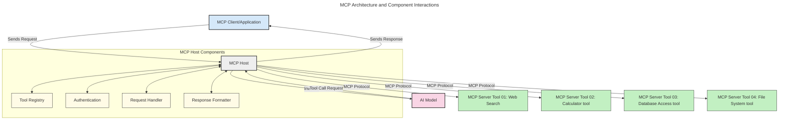
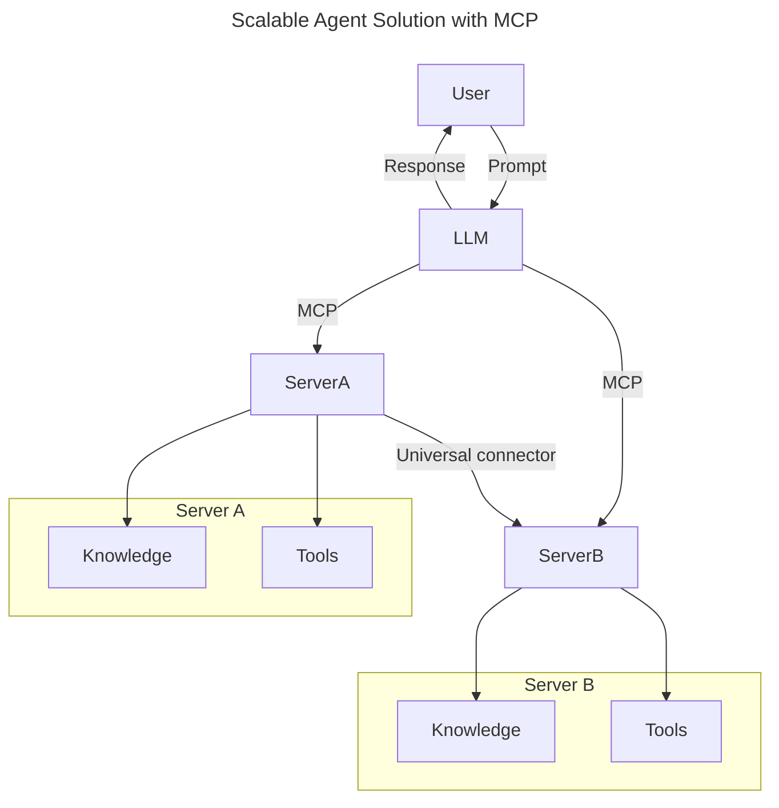
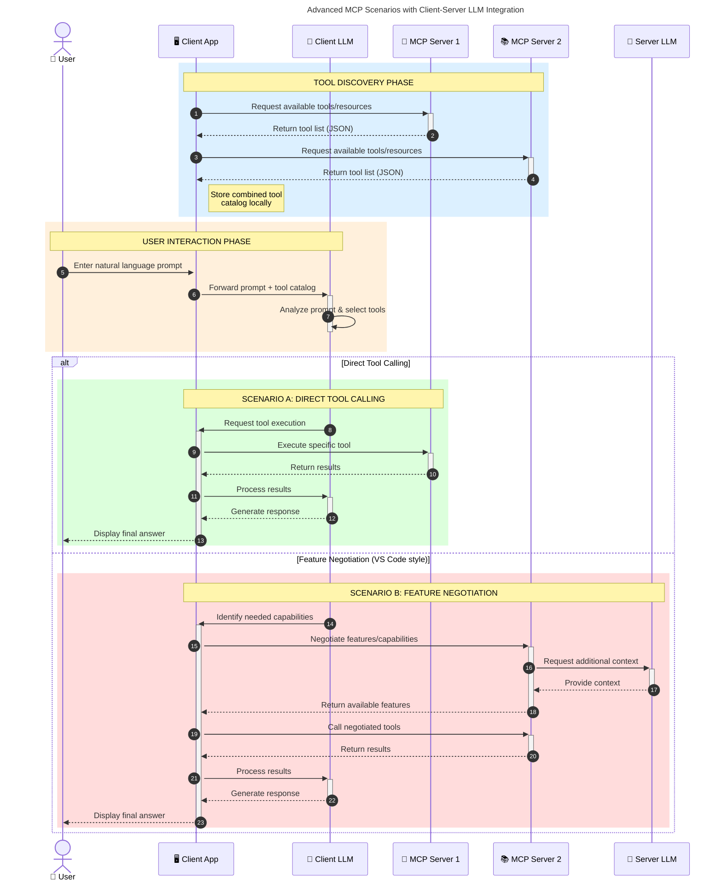

<!--
CO_OP_TRANSLATOR_METADATA:
{
  "original_hash": "0df1ee78a6dd8300f3a040ca5b411c2e",
  "translation_date": "2025-08-18T15:18:01+00:00",
  "source_file": "00-Introduction/README.md",
  "language_code": "bn"
}
-->
# মডেল কনটেক্সট প্রোটোকল (MCP) পরিচিতি: স্কেলযোগ্য AI অ্যাপ্লিকেশনের জন্য কেন এটি গুরুত্বপূর্ণ

_(উপরের ছবিতে ক্লিক করে এই পাঠের ভিডিও দেখুন)_

জেনারেটিভ AI অ্যাপ্লিকেশনগুলো একটি বড় অগ্রগতি, কারণ এগুলো প্রায়ই ব্যবহারকারীকে প্রাকৃতিক ভাষার প্রম্পট ব্যবহার করে অ্যাপের সাথে যোগাযোগ করতে দেয়। তবে, যখন এই ধরনের অ্যাপগুলোর উন্নয়নে আরও সময় এবং সম্পদ বিনিয়োগ করা হয়, তখন নিশ্চিত করতে হবে যে আপনি সহজে ফিচার এবং রিসোর্স ইন্টিগ্রেট করতে পারেন, যাতে এটি সহজে সম্প্রসারণযোগ্য হয়, আপনার অ্যাপ একাধিক মডেল ব্যবহার করতে পারে এবং বিভিন্ন মডেলের জটিলতা পরিচালনা করতে পারে। সংক্ষেপে, জেন AI অ্যাপ তৈরি করা শুরুতে সহজ, কিন্তু যখন এগুলো বড় হয় এবং আরও জটিল হয়ে ওঠে, তখন আপনাকে একটি আর্কিটেকচার সংজ্ঞায়িত করতে হবে এবং সম্ভবত একটি স্ট্যান্ডার্ডের উপর নির্ভর করতে হবে যাতে আপনার অ্যাপগুলো একটি সঙ্গতিপূর্ণ উপায়ে তৈরি হয়। এখানেই MCP আসে জিনিসগুলো সংগঠিত করতে এবং একটি স্ট্যান্ডার্ড প্রদান করতে।

---

## **🔍 মডেল কনটেক্সট প্রোটোকল (MCP) কী?**

**মডেল কনটেক্সট প্রোটোকল (MCP)** একটি **ওপেন, স্ট্যান্ডার্ডাইজড ইন্টারফেস**, যা বড় ভাষার মডেলগুলোকে (LLMs) বাইরের টুল, API এবং ডেটা সোর্সের সাথে নির্বিঘ্নে যোগাযোগ করতে দেয়। এটি একটি সঙ্গতিপূর্ণ আর্কিটেকচার প্রদান করে, যা AI মডেলের কার্যকারিতা তাদের প্রশিক্ষণ ডেটার বাইরে উন্নত করে, স্মার্ট, স্কেলযোগ্য এবং আরও প্রতিক্রিয়াশীল AI সিস্টেম তৈরি করতে সাহায্য করে।

---

## **🎯 AI-তে স্ট্যান্ডার্ডাইজেশন কেন গুরুত্বপূর্ণ**

যখন জেনারেটিভ AI অ্যাপ্লিকেশনগুলো আরও জটিল হয়ে ওঠে, তখন এমন স্ট্যান্ডার্ড গ্রহণ করা অপরিহার্য হয়ে ওঠে যা **স্কেলযোগ্যতা, সম্প্রসারণযোগ্যতা, রক্ষণাবেক্ষণযোগ্যতা** এবং **ভেন্ডর লক-ইন এড়ানো** নিশ্চিত করে। MCP এই চাহিদাগুলো পূরণ করে:

- মডেল-টুল ইন্টিগ্রেশনকে একীভূত করে
- ভঙ্গুর, এককালীন কাস্টম সমাধান কমায়
- বিভিন্ন ভেন্ডরের একাধিক মডেলকে এক ইকোসিস্টেমে সহাবস্থান করতে দেয়

**নোট:** যদিও MCP নিজেকে একটি ওপেন স্ট্যান্ডার্ড হিসেবে উপস্থাপন করে, MCP-কে IEEE, IETF, W3C, ISO বা অন্য কোনো স্ট্যান্ডার্ড বডির মাধ্যমে স্ট্যান্ডার্ডাইজ করার কোনো পরিকল্পনা নেই।

---

## **📚 শেখার লক্ষ্য**

এই নিবন্ধের শেষে, আপনি:

- **মডেল কনটেক্সট প্রোটোকল (MCP)** এবং এর ব্যবহার ক্ষেত্র সংজ্ঞায়িত করতে পারবেন
- MCP কীভাবে মডেল-টুল যোগাযোগকে স্ট্যান্ডার্ডাইজ করে তা বুঝতে পারবেন
- MCP আর্কিটেকচারের মূল উপাদানগুলো চিহ্নিত করতে পারবেন
- এন্টারপ্রাইজ এবং ডেভেলপমেন্ট প্রসঙ্গে MCP-এর বাস্তব জীবনের প্রয়োগগুলো অন্বেষণ করতে পারবেন

---

## **💡 মডেল কনটেক্সট প্রোটোকল (MCP) কেন একটি গেম-চেঞ্জার**

### **🔗 MCP AI ইন্টিগ্রেশনের বিভাজন সমাধান করে**

MCP-এর আগে, মডেলগুলোকে টুলের সাথে ইন্টিগ্রেট করতে প্রয়োজন ছিল:

- প্রতিটি টুল-মডেল জোড়ার জন্য কাস্টম কোড
- প্রতিটি ভেন্ডরের জন্য অ-স্ট্যান্ডার্ড API
- আপডেটের কারণে ঘন ঘন ভাঙন
- আরও টুল যোগ করার সাথে স্কেলিংয়ের সমস্যা

### **✅ MCP স্ট্যান্ডার্ডাইজেশনের সুবিধা**

| **সুবিধা**                | **বর্ণনা**                                                                     |
|--------------------------|--------------------------------------------------------------------------------|
| ইন্টারঅপারেবিলিটি         | LLMs বিভিন্ন ভেন্ডরের টুলের সাথে নির্বিঘ্নে কাজ করে                           |
| সঙ্গতি                   | প্ল্যাটফর্ম এবং টুল জুড়ে অভিন্ন আচরণ                                           |
| পুনঃব্যবহারযোগ্যতা       | একবার তৈরি করা টুল বিভিন্ন প্রকল্প এবং সিস্টেমে ব্যবহার করা যায়                 |
| উন্নয়ন ত্বরান্বিত        | স্ট্যান্ডার্ডাইজড, প্লাগ-এন্ড-প্লে ইন্টারফেস ব্যবহার করে ডেভেলপমেন্ট সময় কমানো |

---

## **🧱 MCP আর্কিটেকচারের উচ্চ-স্তরের ওভারভিউ**

MCP একটি **ক্লায়েন্ট-সার্ভার মডেল** অনুসরণ করে, যেখানে:

- **MCP হোস্ট** AI মডেল চালায়
- **MCP ক্লায়েন্ট** অনুরোধ শুরু করে
- **MCP সার্ভার** কনটেক্সট, টুল এবং সক্ষমতা প্রদান করে

### **মূল উপাদানগুলো:**

- **রিসোর্স** – মডেলের জন্য স্থির বা গতিশীল ডেটা  
- **প্রম্পট** – নির্দেশিত জেনারেশনের জন্য পূর্বনির্ধারিত ওয়ার্কফ্লো  
- **টুল** – অনুসন্ধান, গণনা ইত্যাদির মতো কার্যকরী ফাংশন  
- **স্যাম্পলিং** – পুনরাবৃত্তি ইন্টারঅ্যাকশনের মাধ্যমে এজেন্টিক আচরণ  

---

## MCP সার্ভার কীভাবে কাজ করে

MCP সার্ভার নিম্নলিখিতভাবে কাজ করে:

- **অনুরোধ প্রবাহ**:
    1. একজন ব্যবহারকারী বা তাদের পক্ষ থেকে কাজ করা সফটওয়্যার একটি অনুরোধ শুরু করে।
    2. **MCP ক্লায়েন্ট** অনুরোধটি **MCP হোস্ট**-এ পাঠায়, যা AI মডেল রানটাইম পরিচালনা করে।
    3. **AI মডেল** ব্যবহারকারীর প্রম্পট গ্রহণ করে এবং এক বা একাধিক টুল কলের মাধ্যমে বাইরের টুল বা ডেটা অ্যাক্সেসের অনুরোধ করতে পারে।
    4. **MCP হোস্ট**, সরাসরি মডেল নয়, স্ট্যান্ডার্ডাইজড প্রোটোকল ব্যবহার করে প্রাসঙ্গিক **MCP সার্ভার(গুলো)**-এর সাথে যোগাযোগ করে।
- **MCP হোস্টের কার্যকারিতা**:
    - **টুল রেজিস্ট্রি**: উপলব্ধ টুল এবং তাদের সক্ষমতার একটি ক্যাটালগ বজায় রাখে।
    - **অথেনটিকেশন**: টুল অ্যাক্সেসের অনুমতি যাচাই করে।
    - **অনুরোধ হ্যান্ডলার**: মডেল থেকে আসা টুল অনুরোধ প্রক্রিয়া করে।
    - **প্রতিক্রিয়া ফরম্যাটার**: টুল আউটপুটকে এমন ফরম্যাটে গঠন করে যা মডেল বুঝতে পারে।
- **MCP সার্ভার এক্সিকিউশন**:
    - **MCP হোস্ট** টুল কলগুলো এক বা একাধিক **MCP সার্ভার**-এ রাউট করে, যা বিশেষায়িত ফাংশন (যেমন অনুসন্ধান, গণনা, ডেটাবেস প্রশ্ন) প্রকাশ করে।
    - **MCP সার্ভারগুলো** তাদের নিজ নিজ অপারেশন সম্পাদন করে এবং **MCP হোস্ট**-এ একটি সঙ্গতিপূর্ণ ফরম্যাটে ফলাফল ফেরত দেয়।
    - **MCP হোস্ট** এই ফলাফলগুলো ফরম্যাট করে এবং AI মডেলে পাঠায়।
- **প্রতিক্রিয়া সম্পন্ন**:
    - **AI মডেল** টুল আউটপুটগুলোকে চূড়ান্ত প্রতিক্রিয়ায় অন্তর্ভুক্ত করে।
    - **MCP হোস্ট** এই প্রতিক্রিয়াটি **MCP ক্লায়েন্ট**-এ পাঠায়, যা এটি শেষ ব্যবহারকারী বা কলিং সফটওয়্যারে সরবরাহ করে।

## 👨‍💻 MCP সার্ভার তৈরি করার উপায় (উদাহরণসহ)

MCP সার্ভারগুলো LLM-এর সক্ষমতা বাড়াতে ডেটা এবং কার্যকারিতা প্রদান করে।

প্রস্তুত? এখানে বিভিন্ন ভাষা/স্ট্যাকের SDK এবং উদাহরণ রয়েছে, যা MCP সার্ভার তৈরি করতে সাহায্য করবে:

- **Python SDK**: https://github.com/modelcontextprotocol/python-sdk

- **TypeScript SDK**: https://github.com/modelcontextprotocol/typescript-sdk

- **Java SDK**: https://github.com/modelcontextprotocol/java-sdk

- **C#/.NET SDK**: https://github.com/modelcontextprotocol/csharp-sdk

---

## 🌍 MCP-এর বাস্তব জীবনের ব্যবহার ক্ষেত্র

MCP AI-এর সক্ষমতা বাড়িয়ে বিভিন্ন অ্যাপ্লিকেশন সক্ষম করে:

| **অ্যাপ্লিকেশন**              | **বর্ণনা**                                                                     |
|------------------------------|--------------------------------------------------------------------------------|
| এন্টারপ্রাইজ ডেটা ইন্টিগ্রেশন | LLM-কে ডেটাবেস, CRM বা অভ্যন্তরীণ টুলের সাথে সংযুক্ত করুন                     |
| এজেন্টিক AI সিস্টেম          | টুল অ্যাক্সেস এবং সিদ্ধান্ত গ্রহণের ওয়ার্কফ্লো সহ স্বায়ত্তশাসিত এজেন্ট সক্ষম করুন |
| মাল্টি-মোডাল অ্যাপ্লিকেশন    | একটি একক AI অ্যাপে টেক্সট, ইমেজ এবং অডিও টুল একত্রিত করুন                     |
| রিয়েল-টাইম ডেটা ইন্টিগ্রেশন | AI ইন্টারঅ্যাকশনে লাইভ ডেটা নিয়ে আসুন আরও সঠিক, বর্তমান আউটপুটের জন্য          |

---

### 🧠 MCP = AI ইন্টিগ্রেশনের জন্য ইউনিভার্সাল স্ট্যান্ডার্ড

মডেল কনটেক্সট প্রোটোকল (MCP) AI ইন্টিগ্রেশনের জন্য একটি ইউনিভার্সাল স্ট্যান্ডার্ড হিসেবে কাজ করে, যেমন USB-C ডিভাইসের জন্য শারীরিক সংযোগকে স্ট্যান্ডার্ডাইজ করেছে। AI-এর জগতে, MCP একটি সঙ্গতিপূর্ণ ইন্টারফেস প্রদান করে, যা মডেল (ক্লায়েন্ট) এবং বাইরের টুল ও ডেটা প্রদানকারী (সার্ভার) নির্বিঘ্নে ইন্টিগ্রেট করতে দেয়। এটি প্রতিটি API বা ডেটা সোর্সের জন্য বিভিন্ন, কাস্টম প্রোটোকলের প্রয়োজনীয়তা দূর করে।

MCP-এর অধীনে, MCP-সামঞ্জস্যপূর্ণ টুল (MCP সার্ভার নামে পরিচিত) একটি একীভূত স্ট্যান্ডার্ড অনুসরণ করে। এই সার্ভারগুলো তাদের দেওয়া টুল বা অ্যাকশনগুলো তালিকাভুক্ত করতে পারে এবং AI এজেন্টের অনুরোধে সেই অ্যাকশনগুলো সম্পাদন করতে পারে। MCP সমর্থনকারী AI এজেন্ট প্ল্যাটফর্মগুলো সার্ভার থেকে উপলব্ধ টুলগুলো আবিষ্কার করতে এবং এই স্ট্যান্ডার্ড প্রোটোকলের মাধ্যমে সেগুলোকে আহ্বান করতে সক্ষম।

---

### 💡 জ্ঞান অ্যাক্সেস সহজতর করে

টুল সরবরাহের পাশাপাশি, MCP জ্ঞান অ্যাক্সেস সহজতর করে। এটি অ্যাপ্লিকেশনগুলোকে বড় ভাষার মডেল (LLMs)-এর জন্য বিভিন্ন ডেটা সোর্সের সাথে সংযোগ স্থাপন করে কনটেক্সট প্রদান করতে সক্ষম করে। উদাহরণস্বরূপ, একটি MCP সার্ভার একটি কোম্পানির ডকুমেন্ট রিপোজিটরি উপস্থাপন করতে পারে, যা এজেন্টকে প্রাসঙ্গিক তথ্য অন-ডিমান্ডে পুনরুদ্ধার করতে দেয়। অন্য একটি সার্ভার ইমেইল পাঠানো বা রেকর্ড আপডেট করার মতো নির্দিষ্ট অ্যাকশন পরিচালনা করতে পারে। এজেন্টের দৃষ্টিকোণ থেকে, এগুলো শুধুমাত্র টুল যা এটি ব্যবহার করতে পারে—কিছু টুল ডেটা (জ্ঞান কনটেক্সট) ফেরত দেয়, অন্যগুলো অ্যাকশন সম্পাদন করে। MCP দক্ষতার সাথে উভয়ই পরিচালনা করে।

---

### 👉 উদাহরণ: স্কেলযোগ্য এজেন্ট সমাধান

---

### 🔄 ক্লায়েন্ট-সাইড LLM ইন্টিগ্রেশনের সাথে উন্নত MCP দৃশ্যপট

মৌলিক MCP আর্কিটেকচারের বাইরে, এমন উন্নত দৃশ্যপট রয়েছে যেখানে ক্লায়েন্ট এবং সার্ভার উভয়ই LLM ধারণ করে, যা আরও জটিল ইন্টারঅ্যাকশন সক্ষম করে। নিম্নলিখিত ডায়াগ্রামে, **ক্লায়েন্ট অ্যাপ** একটি IDE হতে পারে, যেখানে ব্যবহারকারীর জন্য LLM-এর MCP টুল উপলব্ধ:

---

## 🔐 MCP ব্যবহারের বাস্তবিক সুবিধা

MCP ব্যবহারের বাস্তবিক সুবিধাগুলো হলো:

- **তাজা তথ্য**: মডেলগুলো তাদের প্রশিক্ষণ ডেটার বাইরে আপ-টু-ডেট তথ্য অ্যাক্সেস করতে পারে
- **সক্ষমতা সম্প্রসারণ**: মডেলগুলো বিশেষায়িত টুল ব্যবহার করতে পারে, যা তাদের প্রশিক্ষণ করা হয়নি
- **হ্যালুসিনেশন কমানো**: বাইরের ডেটা সোর্সগুলো তথ্যগত ভিত্তি প্রদান করে
- **গোপনীয়তা**: সংবেদনশীল ডেটা নিরাপদ পরিবেশে থাকতে পারে, প্রম্পটে এম্বেড না হয়ে

---

## 📌 মূল বিষয়গুলো

MCP ব্যবহারের জন্য নিম্নলিখিত মূল বিষয়গুলো:

- **MCP** AI মডেলগুলো কীভাবে টুল এবং ডেটার সাথে যোগাযোগ করে তা স্ট্যান্ডার্ডাইজ করে
- **সম্প্রসারণযোগ্যতা, সঙ্গতি এবং ইন্টারঅপারেবিলিটি** প্রচার করে
- MCP **উন্নয়ন সময় কমায়, নির্ভরযোগ্যতা বাড়ায় এবং মডেলের সক্ষমতা সম্প্রসারণ করে**
- ক্লায়েন্ট-সার্ভার আর্কিটেকচার **ফ্লেক্সিবল, সম্প্রসারণযোগ্য AI অ্যাপ্লিকেশন সক্ষম করে**

---

## 🧠 অনুশীলন

আপনার তৈরি করতে আগ্রহী একটি AI অ্যাপ্লিকেশন সম্পর্কে চিন্তা করুন।

- কোন **বাইরের টুল বা ডেটা** এর সক্ষমতা বাড়াতে পারে?
- MCP কীভাবে ইন্টিগ্রেশন **সহজ এবং নির্ভরযোগ্য** করতে পারে?

---

## অতিরিক্ত রিসোর্স

- [MCP GitHub রিপোজিটরি](https://github.com/modelcontextprotocol)

---

## পরবর্তী কী

পরবর্তী: [চ্যাপ্টার ১: মূল ধারণা](../01-CoreConcepts/README.md)

**অস্বীকৃতি**:  
এই নথিটি AI অনুবাদ পরিষেবা [Co-op Translator](https://github.com/Azure/co-op-translator) ব্যবহার করে অনুবাদ করা হয়েছে। আমরা যথাসাধ্য সঠিকতা নিশ্চিত করার চেষ্টা করি, তবে অনুগ্রহ করে মনে রাখবেন যে স্বয়ংক্রিয় অনুবাদে ত্রুটি বা অসঙ্গতি থাকতে পারে। মূল ভাষায় থাকা নথিটিকে প্রামাণিক উৎস হিসেবে বিবেচনা করা উচিত। গুরুত্বপূর্ণ তথ্যের জন্য, পেশাদার মানব অনুবাদ সুপারিশ করা হয়। এই অনুবাদ ব্যবহারের ফলে কোনো ভুল বোঝাবুঝি বা ভুল ব্যাখ্যা হলে আমরা দায়বদ্ধ থাকব না।