<!--
CO_OP_TRANSLATOR_METADATA:
{
  "original_hash": "105c2ddbb77bc38f7e9df009e1b06e45",
  "translation_date": "2025-07-04T16:28:44+00:00",
  "source_file": "00-Introduction/README.md",
  "language_code": "bn"
}
-->
# মডেল কনটেক্সট প্রোটোকল (MCP) পরিচিতি: স্কেলেবল AI অ্যাপ্লিকেশনের জন্য কেন এটি গুরুত্বপূর্ণ

জেনারেটিভ AI অ্যাপ্লিকেশনগুলো একটি বড় অগ্রগতি, কারণ এগুলো প্রায়ই ব্যবহারকারীকে প্রাকৃতিক ভাষার প্রম্পট ব্যবহার করে অ্যাপের সাথে ইন্টারঅ্যাক্ট করার সুযোগ দেয়। তবে, যখন এই ধরনের অ্যাপে আরও সময় ও সম্পদ বিনিয়োগ করা হয়, তখন আপনি নিশ্চিত হতে চান যে আপনি সহজেই ফাংশনালিটি এবং রিসোর্সগুলো এমনভাবে ইন্টিগ্রেট করতে পারবেন যা সহজে সম্প্রসারিত করা যায়, আপনার অ্যাপ একাধিক মডেল ব্যবহারের জন্য প্রস্তুত থাকবে এবং বিভিন্ন মডেলের জটিলতা সামলাতে পারবে। সংক্ষেপে, জেন AI অ্যাপ তৈরি করা শুরুতে সহজ, কিন্তু যখন এগুলো বড় এবং জটিল হয়, তখন আপনাকে একটি আর্কিটেকচার নির্ধারণ করতে হবে এবং সম্ভবত একটি স্ট্যান্ডার্ডের ওপর নির্ভর করতে হবে যাতে আপনার অ্যাপগুলো সঙ্গতিপূর্ণভাবে তৈরি হয়। এখানেই MCP আসে, যা বিষয়গুলো সংগঠিত করে এবং একটি স্ট্যান্ডার্ড প্রদান করে।

---

## **🔍 মডেল কনটেক্সট প্রোটোকল (MCP) কী?**

**মডেল কনটেক্সট প্রোটোকল (MCP)** একটি **ওপেন, স্ট্যান্ডার্ডাইজড ইন্টারফেস** যা বড় ভাষা মডেলগুলোকে (LLMs) বাহ্যিক টুল, API, এবং ডেটা সোর্সের সাথে নির্বিঘ্নে ইন্টারঅ্যাক্ট করার সুযোগ দেয়। এটি একটি সঙ্গতিপূর্ণ আর্কিটেকচার প্রদান করে যা AI মডেলের কার্যকারিতা তাদের প্রশিক্ষণ ডেটার বাইরে বাড়ায়, স্মার্টার, স্কেলেবল এবং আরও প্রতিক্রিয়াশীল AI সিস্টেম তৈরি করতে সহায়তা করে।

---

## **🎯 AI-তে স্ট্যান্ডার্ডাইজেশনের গুরুত্ব**

যখন জেনারেটিভ AI অ্যাপ্লিকেশনগুলো আরও জটিল হয়ে ওঠে, তখন স্কেলেবিলিটি, এক্সটেনসিবিলিটি এবং মেইনটেইনেবিলিটি নিশ্চিত করার জন্য স্ট্যান্ডার্ড গ্রহণ করা অপরিহার্য। MCP এই চাহিদাগুলো পূরণ করে:

- মডেল-টুল ইন্টিগ্রেশনগুলো একত্রিত করে
- ভঙ্গুর, এককালীন কাস্টম সলিউশন কমায়
- একাধিক মডেলকে একই ইকোসিস্টেমে একসাথে কাজ করার সুযোগ দেয়

---

## **📚 শেখার উদ্দেশ্য**

এই আর্টিকেল শেষে আপনি পারবেন:

- **মডেল কনটেক্সট প্রোটোকল (MCP)** কী এবং এর ব্যবহার ক্ষেত্রগুলো ব্যাখ্যা করতে
- MCP কীভাবে মডেল-টু-টুল যোগাযোগ স্ট্যান্ডার্ডাইজ করে তা বুঝতে
- MCP আর্কিটেকচারের মূল উপাদানগুলো চিহ্নিত করতে
- এন্টারপ্রাইজ এবং ডেভেলপমেন্ট প্রেক্ষাপটে MCP এর বাস্তব ব্যবহার অন্বেষণ করতে

---

## **💡 কেন মডেল কনটেক্সট প্রোটোকল (MCP) একটি গেম-চেঞ্জার**

### **🔗 MCP AI ইন্টারঅ্যাকশনে বিভাজন দূর করে**

MCP এর আগে, মডেলগুলোকে টুলের সাথে ইন্টিগ্রেট করতে হত:

- প্রতিটি টুল-মডেল জোড়ার জন্য কাস্টম কোড লিখতে
- প্রতিটি ভেন্ডারের জন্য নন-স্ট্যান্ডার্ড API ব্যবহার করতে
- আপডেটের কারণে প্রায়ই ব্রেক হওয়া
- বেশি টুলের সাথে স্কেল করা কঠিন

### **✅ MCP স্ট্যান্ডার্ডাইজেশনের সুবিধাসমূহ**

| **সুবিধা**               | **বর্ণনা**                                                                    |
|--------------------------|-------------------------------------------------------------------------------|
| ইন্টারঅপারেবিলিটি         | LLM গুলো বিভিন্ন ভেন্ডারের টুলের সাথে নির্বিঘ্নে কাজ করে                      |
| সঙ্গতি                   | প্ল্যাটফর্ম এবং টুল জুড়ে একরকম আচরণ নিশ্চিত করে                             |
| পুনঃব্যবহারযোগ্যতা       | একবার তৈরি টুলগুলো বিভিন্ন প্রজেক্ট এবং সিস্টেমে ব্যবহার করা যায়              |
| দ্রুত উন্নয়ন             | স্ট্যান্ডার্ড, প্লাগ-অ্যান্ড-প্লে ইন্টারফেস ব্যবহার করে ডেভেলপমেন্ট সময় কমায় |

---

## **🧱 MCP আর্কিটেকচারের উচ্চ-স্তরের ওভারভিউ**

MCP একটি **ক্লায়েন্ট-সার্ভার মডেল** অনুসরণ করে, যেখানে:

- **MCP হোস্ট** AI মডেলগুলো চালায়
- **MCP ক্লায়েন্ট** অনুরোধ শুরু করে
- **MCP সার্ভার** কনটেক্সট, টুল এবং সক্ষমতা সরবরাহ করে

### **মূল উপাদানসমূহ:**

- **রিসোর্স** – মডেলের জন্য স্থির বা গতিশীল ডেটা  
- **প্রম্পট** – গাইডেড জেনারেশনের জন্য পূর্বনির্ধারিত ওয়ার্কফ্লো  
- **টুল** – সার্চ, গণনা ইত্যাদি কার্যকরী ফাংশন  
- **স্যাম্পলিং** – পুনরাবৃত্তিমূলক ইন্টারঅ্যাকশনের মাধ্যমে এজেন্টিক আচরণ

---

## MCP সার্ভার কীভাবে কাজ করে

MCP সার্ভার নিম্নলিখিতভাবে কাজ করে:

- **অনুরোধ প্রবাহ**:  
    ১. MCP ক্লায়েন্ট MCP হোস্টে চলমান AI মডেলে একটি অনুরোধ পাঠায়।  
    ২. AI মডেল বুঝতে পারে কখন বাহ্যিক টুল বা ডেটার প্রয়োজন।  
    ৩. মডেল স্ট্যান্ডার্ডাইজড প্রোটোকল ব্যবহার করে MCP সার্ভারের সাথে যোগাযোগ করে।

- **MCP সার্ভারের কার্যকারিতা**:  
    - টুল রেজিস্ট্রি: উপলব্ধ টুল এবং তাদের সক্ষমতার ক্যাটালগ বজায় রাখে।  
    - অথেনটিকেশন: টুল অ্যাক্সেসের অনুমতি যাচাই করে।  
    - অনুরোধ হ্যান্ডলার: মডেল থেকে আসা টুল অনুরোধ প্রক্রিয়া করে।  
    - রেসপন্স ফরম্যাটার: টুল আউটপুট মডেল বুঝতে পারার ফরম্যাটে সাজায়।

- **টুল এক্সিকিউশন**:  
    - সার্ভার অনুরোধগুলো সঠিক বাহ্যিক টুলে রুট করে  
    - টুলগুলো তাদের বিশেষায়িত ফাংশন (সার্চ, গণনা, ডেটাবেস কোয়েরি ইত্যাদি) সম্পাদন করে  
    - ফলাফল মডেলের কাছে সঙ্গতিপূর্ণ ফরম্যাটে ফেরত দেয়

- **রেসপন্স সম্পন্নকরণ**:  
    - AI মডেল টুল আউটপুটকে তার রেসপন্সে অন্তর্ভুক্ত করে  
    - চূড়ান্ত রেসপন্স ক্লায়েন্ট অ্যাপ্লিকেশনে পাঠানো হয়

## 👨‍💻 MCP সার্ভার কীভাবে তৈরি করবেন (উদাহরণসহ)

MCP সার্ভার আপনাকে LLM এর সক্ষমতা বাড়াতে ডেটা এবং ফাংশনালিটি প্রদান করার সুযোগ দেয়।

চলুন চেষ্টা করি! বিভিন্ন ভাষায় একটি সাধারণ MCP সার্ভার তৈরির উদাহরণ:

- **Python উদাহরণ**: https://github.com/modelcontextprotocol/python-sdk

- **TypeScript উদাহরণ**: https://github.com/modelcontextprotocol/typescript-sdk

- **Java উদাহরণ**: https://github.com/modelcontextprotocol/java-sdk

- **C#/.NET উদাহরণ**: https://github.com/modelcontextprotocol/csharp-sdk

## 🌍 MCP এর বাস্তব ব্যবহার ক্ষেত্র

MCP AI সক্ষমতা বাড়িয়ে বিভিন্ন ধরনের অ্যাপ্লিকেশন চালাতে সাহায্য করে:

| **অ্যাপ্লিকেশন**            | **বর্ণনা**                                                                    |
|----------------------------|-------------------------------------------------------------------------------|
| এন্টারপ্রাইজ ডেটা ইন্টিগ্রেশন | LLM গুলোকে ডেটাবেস, CRM, বা অভ্যন্তরীণ টুলের সাথে সংযুক্ত করা                |
| এজেন্টিক AI সিস্টেম         | স্বয়ংক্রিয় এজেন্টদের টুল অ্যাক্সেস এবং সিদ্ধান্ত গ্রহণের ওয়ার্কফ্লো সক্ষম করা |
| মাল্টি-মোডাল অ্যাপ্লিকেশন  | একক AI অ্যাপে টেক্সট, ছবি, এবং অডিও টুল একত্রিত করা                           |
| রিয়েল-টাইম ডেটা ইন্টিগ্রেশন | AI ইন্টারঅ্যাকশনে লাইভ ডেটা নিয়ে আসা, আরও সঠিক এবং আপডেটেড আউটপুটের জন্য    |

### 🧠 MCP = AI ইন্টারঅ্যাকশনের জন্য সর্বজনীন স্ট্যান্ডার্ড

মডেল কনটেক্সট প্রোটোকল (MCP) AI ইন্টারঅ্যাকশনের জন্য একটি সর্বজনীন স্ট্যান্ডার্ড হিসেবে কাজ করে, যেমন USB-C ডিভাইসের জন্য ফিজিক্যাল কানেকশন স্ট্যান্ডার্ড করেছে। AI জগতে MCP একটি সঙ্গতিপূর্ণ ইন্টারফেস প্রদান করে, যা মডেল (ক্লায়েন্ট) এবং বাহ্যিক টুল ও ডেটা প্রদানকারী (সার্ভার) এর মধ্যে নির্বিঘ্ন সংযোগ নিশ্চিত করে। এর ফলে প্রতিটি API বা ডেটা সোর্সের জন্য আলাদা, কাস্টম প্রোটোকলের প্রয়োজন হয় না।

MCP-সঙ্গত টুল (যাকে MCP সার্ভার বলা হয়) একটি একক স্ট্যান্ডার্ড অনুসরণ করে। এই সার্ভারগুলো তাদের টুল বা অ্যাকশনগুলোর তালিকা দেয় এবং AI এজেন্টের অনুরোধে সেগুলো কার্যকর করে। MCP সমর্থিত AI এজেন্ট প্ল্যাটফর্মগুলো সার্ভার থেকে উপলব্ধ টুলগুলো আবিষ্কার করতে পারে এবং এই স্ট্যান্ডার্ড প্রোটোকলের মাধ্যমে সেগুলো কল করতে পারে।

### 💡 জ্ঞানের প্রবেশাধিকার সহজতর করে

টুল সরবরাহের পাশাপাশি MCP জ্ঞানের প্রবেশাধিকারও সহজতর করে। এটি অ্যাপ্লিকেশনগুলোকে বড় ভাষা মডেলগুলোর (LLMs) জন্য প্রাসঙ্গিক কনটেক্সট প্রদান করতে সক্ষম করে বিভিন্ন ডেটা সোর্সের সাথে সংযুক্ত করে। উদাহরণস্বরূপ, একটি MCP সার্ভার হতে পারে একটি কোম্পানির ডকুমেন্ট রিপোজিটরি, যা এজেন্টদের প্রয়োজনীয় তথ্য রিট্রিভ করতে দেয়। অন্য একটি সার্ভার নির্দিষ্ট কাজ যেমন ইমেইল পাঠানো বা রেকর্ড আপডেট করার কাজ করতে পারে। এজেন্টের দৃষ্টিকোণ থেকে, এগুলো শুধু টুল, কিছু টুল ডেটা (জ্ঞান কনটেক্সট) ফেরত দেয়, আবার কিছু টুল কাজ সম্পাদন করে। MCP উভয় ক্ষেত্রেই দক্ষতার সাথে পরিচালনা করে।

একটি এজেন্ট যখন MCP সার্ভারের সাথে সংযুক্ত হয়, তখন স্বয়ংক্রিয়ভাবে সার্ভারের উপলব্ধ সক্ষমতা এবং অ্যাক্সেসযোগ্য ডেটা একটি স্ট্যান্ডার্ড ফরম্যাটে শিখে নেয়। এই স্ট্যান্ডার্ডাইজেশন ডায়নামিক টুল উপলব্ধতা নিশ্চিত করে। উদাহরণস্বরূপ, একটি নতুন MCP সার্ভার এজেন্টের সিস্টেমে যোগ করলে তার ফাংশনগুলো অবিলম্বে ব্যবহারযোগ্য হয়, এজেন্টের নির্দেশাবলীতে অতিরিক্ত কাস্টমাইজেশনের প্রয়োজন হয় না।

এই সহজ ইন্টিগ্রেশনটি মেরমেইড ডায়াগ্রামে দেখানো প্রবাহের সাথে সামঞ্জস্যপূর্ণ, যেখানে সার্ভারগুলো টুল এবং জ্ঞান উভয়ই সরবরাহ করে, সিস্টেমগুলোর মধ্যে নির্বিঘ্ন সহযোগিতা নিশ্চিত করে।

### 👉 উদাহরণ: স্কেলেবল এজেন্ট সলিউশন

### 🔄 ক্লায়েন্ট-সাইড LLM ইন্টিগ্রেশনসহ উন্নত MCP পরিস্থিতি

মৌলিক MCP আর্কিটেকচারের বাইরে, এমন উন্নত পরিস্থিতি রয়েছে যেখানে ক্লায়েন্ট এবং সার্ভার উভয়েই LLM থাকে, যা আরও জটিল ইন্টারঅ্যাকশন সক্ষম করে:

```mermaid
---
title: Advanced MCP Scenarios with Client-Server LLM Integration
description: A sequence diagram showing the detailed interaction flow between user, client application, client LLM, multiple MCP servers, and server LLM, illustrating tool discovery, user interaction, direct tool calling, and feature negotiation phases
---
sequenceDiagram
    autonumber
    actor User as 👤 User
    participant ClientApp as 🖥️ Client App
    participant ClientLLM as 🧠 Client LLM
    participant Server1 as 🔧 MCP Server 1
    participant Server2 as 📚 MCP Server 2
    participant ServerLLM as 🤖 Server LLM
    
    %% Discovery Phase
    rect rgb(220, 240, 255)
        Note over ClientApp, Server2: TOOL DISCOVERY PHASE
        ClientApp->>+Server1: Request available tools/resources
        Server1-->>-ClientApp: Return tool list (JSON)
        ClientApp->>+Server2: Request available tools/resources
        Server2-->>-ClientApp: Return tool list (JSON)
        Note right of ClientApp: Store combined tool<br/>catalog locally
    end
    
    %% User Interaction
    rect rgb(255, 240, 220)
        Note over User, ClientLLM: USER INTERACTION PHASE
        User->>+ClientApp: Enter natural language prompt
        ClientApp->>+ClientLLM: Forward prompt + tool catalog
        ClientLLM->>-ClientLLM: Analyze prompt & select tools
    end
    
    %% Scenario A: Direct Tool Calling
    alt Direct Tool Calling
        rect rgb(220, 255, 220)
            Note over ClientApp, Server1: SCENARIO A: DIRECT TOOL CALLING
            ClientLLM->>+ClientApp: Request tool execution
            ClientApp->>+Server1: Execute specific tool
            Server1-->>-ClientApp: Return results
            ClientApp->>+ClientLLM: Process results
            ClientLLM-->>-ClientApp: Generate response
            ClientApp-->>-User: Display final answer
        end
    
    %% Scenario B: Feature Negotiation (VS Code style)
    else Feature Negotiation (VS Code style)
        rect rgb(255, 220, 220)
            Note over ClientApp, ServerLLM: SCENARIO B: FEATURE NEGOTIATION
            ClientLLM->>+ClientApp: Identify needed capabilities
            ClientApp->>+Server2: Negotiate features/capabilities
            Server2->>+ServerLLM: Request additional context
            ServerLLM-->>-Server2: Provide context
            Server2-->>-ClientApp: Return available features
            ClientApp->>+Server2: Call negotiated tools
            Server2-->>-ClientApp: Return results
            ClientApp->>+ClientLLM: Process results
            ClientLLM-->>-ClientApp: Generate response
            ClientApp-->>-User: Display final answer
        end
    end
```

## 🔐 MCP এর ব্যবহারিক সুবিধাসমূহ

MCP ব্যবহারের কিছু ব্যবহারিক সুবিধা:

- **তাজা তথ্য**: মডেলগুলো তাদের প্রশিক্ষণ ডেটার বাইরে আপডেটেড তথ্য অ্যাক্সেস করতে পারে  
- **ক্ষমতা সম্প্রসারণ**: মডেলগুলো তাদের প্রশিক্ষণকৃত কাজের বাইরে বিশেষায়িত টুল ব্যবহার করতে পারে  
- **হ্যালুসিনেশন কমানো**: বাহ্যিক ডেটা সোর্স বাস্তব তথ্য সরবরাহ করে  
- **গোপনীয়তা**: সংবেদনশীল ডেটা প্রম্পটে এম্বেড না করে নিরাপদ পরিবেশে রাখা যায়

## 📌 মূল বিষয়সমূহ

MCP ব্যবহারের মূল বিষয়গুলো:

- **MCP** AI মডেলগুলোকে টুল এবং ডেটার সাথে ইন্টারঅ্যাক্ট করার পদ্ধতি স্ট্যান্ডার্ড করে  
- এক্সটেনসিবিলিটি, সঙ্গতি, এবং ইন্টারঅপারেবিলিটি উন্নত করে  
- MCP ডেভেলপমেন্ট সময় কমায়, নির্ভরযোগ্যতা বাড়ায়, এবং মডেলের সক্ষমতা বাড়ায়  
- ক্লায়েন্ট-সার্ভার আর্কিটেকচার নমনীয়, সম্প্রসারিত AI অ্যাপ্লিকেশন তৈরি করতে সাহায্য করে

## 🧠 অনুশীলন

আপনি যে AI অ্যাপ্লিকেশন তৈরি করতে আগ্রহী তা নিয়ে ভাবুন।

- কোন **বাহ্যিক টুল বা ডেটা** এর মাধ্যমে এর সক্ষমতা বাড়ানো যেতে পারে?  
- MCP কীভাবে ইন্টিগ্রেশনকে **সহজ এবং নির্ভরযোগ্য** করতে পারে?

## অতিরিক্ত রিসোর্স

- [MCP GitHub Repository](https://github.com/modelcontextprotocol)

## পরবর্তী ধাপ

পরবর্তী: [অধ্যায় ১: মূল ধারণা](../01-CoreConcepts/README.md)

**অস্বীকৃতি**:  
এই নথিটি AI অনুবাদ সেবা [Co-op Translator](https://github.com/Azure/co-op-translator) ব্যবহার করে অনূদিত হয়েছে। আমরা যথাসাধ্য সঠিকতার চেষ্টা করি, তবে স্বয়ংক্রিয় অনুবাদে ত্রুটি বা অসঙ্গতি থাকতে পারে। মূল নথিটি তার নিজস্ব ভাষায়ই কর্তৃত্বপূর্ণ উৎস হিসেবে বিবেচিত হওয়া উচিত। গুরুত্বপূর্ণ তথ্যের জন্য পেশাদার মানব অনুবাদ গ্রহণ করার পরামর্শ দেওয়া হয়। এই অনুবাদের ব্যবহারে সৃষ্ট কোনো ভুল বোঝাবুঝি বা ভুল ব্যাখ্যার জন্য আমরা দায়ী নই।