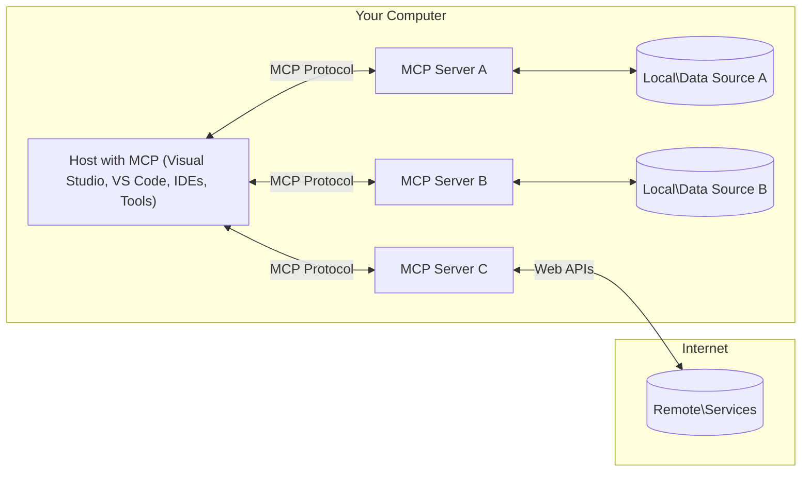

<!--
CO_OP_TRANSLATOR_METADATA:
{
  "original_hash": "904b59de1de9264801242d90a42cdd9d",
  "translation_date": "2025-09-05T10:40:40+00:00",
  "source_file": "01-CoreConcepts/README.md",
  "language_code": "bn"
}
-->
# এমসিপি মূল ধারণা: এআই ইন্টিগ্রেশনের জন্য মডেল কনটেক্সট প্রোটোকল আয়ত্ত করা

[](https://youtu.be/earDzWGtE84)

_(উপরের ছবিতে ক্লিক করে এই পাঠের ভিডিও দেখুন)_

[মডেল কনটেক্সট প্রোটোকল (এমসিপি)](https://github.com/modelcontextprotocol) একটি শক্তিশালী, মানসম্মত কাঠামো যা বড় ভাষার মডেল (এলএলএম) এবং বাহ্যিক টুল, অ্যাপ্লিকেশন এবং ডেটা সোর্সের মধ্যে যোগাযোগকে অপ্টিমাইজ করে। 
এই গাইডটি আপনাকে এমসিপি-এর মূল ধারণাগুলি শেখাবে। আপনি এর ক্লায়েন্ট-সার্ভার আর্কিটেকচার, গুরুত্বপূর্ণ উপাদান, যোগাযোগের প্রক্রিয়া এবং সেরা বাস্তবায়ন পদ্ধতি সম্পর্কে জানতে পারবেন।

- **ব্যবহারকারীর স্পষ্ট সম্মতি**: সমস্ত ডেটা অ্যাক্সেস এবং কার্যক্রম সম্পাদনের আগে ব্যবহারকারীর স্পষ্ট অনুমোদন প্রয়োজন। ব্যবহারকারীদের অবশ্যই পরিষ্কারভাবে বুঝতে হবে কোন ডেটা অ্যাক্সেস করা হবে এবং কোন কার্যক্রম সম্পাদিত হবে, এবং অনুমতি ও অনুমোদনের উপর বিস্তারিত নিয়ন্ত্রণ থাকতে হবে।

- **ডেটা গোপনীয়তা সুরক্ষা**: ব্যবহারকারীর ডেটা শুধুমাত্র স্পষ্ট সম্মতির মাধ্যমে প্রকাশ করা হবে এবং পুরো ইন্টারঅ্যাকশন লাইফসাইকেল জুড়ে শক্তিশালী অ্যাক্সেস নিয়ন্ত্রণ দ্বারা সুরক্ষিত থাকতে হবে। অননুমোদিত ডেটা ট্রান্সমিশন প্রতিরোধ করতে হবে এবং কঠোর গোপনীয়তার সীমা বজায় রাখতে হবে।

- **টুল কার্যক্রমের নিরাপত্তা**: প্রতিটি টুল চালানোর জন্য ব্যবহারকারীর স্পষ্ট সম্মতি প্রয়োজন, যেখানে টুলের কার্যকারিতা, প্যারামিটার এবং সম্ভাব্য প্রভাব সম্পর্কে পরিষ্কার ধারণা প্রদান করা হয়। অনিচ্ছাকৃত, অনিরাপদ বা ক্ষতিকারক টুল কার্যক্রম প্রতিরোধে শক্তিশালী নিরাপত্তা সীমা থাকতে হবে।

- **ট্রান্সপোর্ট লেয়ার সিকিউরিটি**: সমস্ত যোগাযোগ চ্যানেলে উপযুক্ত এনক্রিপশন এবং প্রমাণীকরণ পদ্ধতি ব্যবহার করা উচিত। রিমোট সংযোগে নিরাপদ ট্রান্সপোর্ট প্রোটোকল এবং সঠিক ক্রেডেনশিয়াল ব্যবস্থাপনা প্রয়োগ করা উচিত।

#### বাস্তবায়ন নির্দেশিকা:

- **অনুমতি ব্যবস্থাপনা**: এমন একটি সূক্ষ্ম-নিয়ন্ত্রিত অনুমতি ব্যবস্থা বাস্তবায়ন করুন যা ব্যবহারকারীদের নির্ধারণ করতে দেয় কোন সার্ভার, টুল এবং রিসোর্স অ্যাক্সেসযোগ্য হবে।
- **প্রমাণীকরণ ও অনুমোদন**: সুরক্ষিত প্রমাণীকরণ পদ্ধতি (OAuth, API কী) ব্যবহার করুন, সঠিক টোকেন ব্যবস্থাপনা এবং মেয়াদ শেষ হওয়ার সাথে।
- **ইনপুট যাচাইকরণ**: ইনজেকশন আক্রমণ প্রতিরোধে সংজ্ঞায়িত স্কিমা অনুযায়ী সমস্ত প্যারামিটার এবং ডেটা ইনপুট যাচাই করুন।
- **অডিট লগিং**: নিরাপত্তা পর্যবেক্ষণ এবং সম্মতির জন্য সমস্ত কার্যক্রমের ব্যাপক লগ সংরক্ষণ করুন।

## ওভারভিউ

এই পাঠটি মডেল কনটেক্সট প্রোটোকল (এমসিপি) ইকোসিস্টেমের মৌলিক আর্কিটেকচার এবং উপাদানগুলি অন্বেষণ করে। আপনি এমসিপি ইন্টারঅ্যাকশনের শক্তি জোগানো ক্লায়েন্ট-সার্ভার আর্কিটেকচার, মূল উপাদান এবং যোগাযোগের প্রক্রিয়া সম্পর্কে শিখবেন।

## মূল শিক্ষার উদ্দেশ্য

এই পাঠ শেষে, আপনি:

- এমসিপি ক্লায়েন্ট-সার্ভার আর্কিটেকচার বুঝতে পারবেন।
- হোস্ট, ক্লায়েন্ট এবং সার্ভারের ভূমিকা এবং দায়িত্ব চিহ্নিত করতে পারবেন।
- এমসিপি-কে একটি নমনীয় ইন্টিগ্রেশন লেয়ার হিসেবে গড়ে তোলার মূল বৈশিষ্ট্য বিশ্লেষণ করতে পারবেন।
- এমসিপি ইকোসিস্টেমে তথ্য প্রবাহ কিভাবে কাজ করে তা শিখবেন।
- .NET, জাভা, পাইথন এবং জাভাস্ক্রিপ্টে কোড উদাহরণের মাধ্যমে বাস্তবিক অন্তর্দৃষ্টি অর্জন করবেন।

## এমসিপি আর্কিটেকচার: গভীরভাবে দেখা

এমসিপি ইকোসিস্টেম একটি ক্লায়েন্ট-সার্ভার মডেলের উপর ভিত্তি করে তৈরি। এই মডুলার কাঠামো এআই অ্যাপ্লিকেশনগুলিকে টুল, ডেটাবেস, এপিআই এবং প্রসঙ্গগত রিসোর্সের সাথে দক্ষতার সাথে ইন্টারঅ্যাক্ট করতে দেয়। আসুন এই আর্কিটেকচারটি এর মূল উপাদানগুলিতে ভেঙে দেখি।

মূলত, এমসিপি একটি ক্লায়েন্ট-সার্ভার আর্কিটেকচার অনুসরণ করে যেখানে একটি হোস্ট অ্যাপ্লিকেশন একাধিক সার্ভারের সাথে সংযোগ স্থাপন করতে পারে:



- **এমসিপি হোস্ট**: প্রোগ্রাম যেমন VSCode, Claude Desktop, IDEs, বা এমসিপি-এর মাধ্যমে ডেটা অ্যাক্সেস করতে চায় এমন এআই টুল।
- **এমসিপি ক্লায়েন্ট**: প্রোটোকল ক্লায়েন্ট যা সার্ভারের সাথে ১:১ সংযোগ বজায় রাখে।
- **এমসিপি সার্ভার**: হালকা প্রোগ্রাম যা প্রতিটি নির্দিষ্ট ক্ষমতা এমসিপি-এর মাধ্যমে প্রকাশ করে।
- **লোকাল ডেটা সোর্স**: আপনার কম্পিউটারের ফাইল, ডেটাবেস এবং পরিষেবা যা এমসিপি সার্ভার নিরাপদে অ্যাক্সেস করতে পারে।
- **রিমোট পরিষেবা**: ইন্টারনেটের মাধ্যমে উপলব্ধ বাহ্যিক সিস্টেম যা এমসিপি সার্ভার এপিআই-এর মাধ্যমে সংযোগ করতে পারে।

এমসিপি প্রোটোকল একটি তারিখ-ভিত্তিক সংস্করণিং (YYYY-MM-DD ফরম্যাট) ব্যবহার করে একটি ক্রমবর্ধমান মান হিসেবে কাজ করে। বর্তমান প্রোটোকল সংস্করণ **2025-06-18**। [প্রোটোকল স্পেসিফিকেশন](https://modelcontextprotocol.io/specification/2025-06-18/) এর সর্বশেষ আপডেটগুলি দেখতে পারেন।

### ১. হোস্ট

মডেল কনটেক্সট প্রোটোকল (এমসিপি)-এ, **হোস্ট** হলো এআই অ্যাপ্লিকেশন যা প্রোটোকলের মাধ্যমে ব্যবহারকারীদের সাথে ইন্টারফেস হিসেবে কাজ করে। হোস্ট একাধিক এমসিপি সার্ভারের সাথে সংযোগ পরিচালনা করে এবং প্রতিটি সার্ভার সংযোগের জন্য নিবেদিত এমসিপি ক্লায়েন্ট তৈরি করে। হোস্টের উদাহরণগুলির মধ্যে রয়েছে:

- **এআই অ্যাপ্লিকেশন**: Claude Desktop, Visual Studio Code, Claude Code
- **ডেভেলপমেন্ট এনভায়রনমেন্ট**: এমসিপি ইন্টিগ্রেশন সহ আইডিই এবং কোড এডিটর  
- **কাস্টম অ্যাপ্লিকেশন**: নির্দিষ্ট উদ্দেশ্যে তৈরি এআই এজেন্ট এবং টুল

**হোস্ট** হলো এমন অ্যাপ্লিকেশন যা এআই মডেলের ইন্টারঅ্যাকশন সমন্বয় করে। তারা:

- **এআই মডেল সমন্বয় করে**: এলএলএম চালানো বা তাদের সাথে ইন্টারঅ্যাক্ট করে প্রতিক্রিয়া তৈরি করে এবং এআই ওয়ার্কফ্লো সমন্বয় করে।
- **ক্লায়েন্ট সংযোগ পরিচালনা করে**: প্রতিটি এমসিপি সার্ভার সংযোগের জন্য একটি এমসিপি ক্লায়েন্ট তৈরি এবং বজায় রাখে।
- **ইউজার ইন্টারফেস নিয়ন্ত্রণ করে**: কথোপকথনের প্রবাহ, ব্যবহারকারীর ইন্টারঅ্যাকশন এবং প্রতিক্রিয়া প্রদর্শন পরিচালনা করে।
- **নিরাপত্তা প্রয়োগ করে**: অনুমতি, নিরাপত্তা সীমাবদ্ধতা এবং প্রমাণীকরণ নিয়ন্ত্রণ করে।
- **ব্যবহারকারীর সম্মতি পরিচালনা করে**: ডেটা শেয়ারিং এবং টুল কার্যক্রমের জন্য ব্যবহারকারীর অনুমোদন পরিচালনা করে।

### ২. ক্লায়েন্ট

**ক্লায়েন্ট** হলো গুরুত্বপূর্ণ উপাদান যা হোস্ট এবং এমসিপি সার্ভারের মধ্যে নিবেদিত এক-এক সংযোগ বজায় রাখে। প্রতিটি এমসিপি ক্লায়েন্ট একটি নির্দিষ্ট এমসিপি সার্ভারের সাথে সংযোগ স্থাপনের জন্য হোস্ট দ্বারা উদ্ভূত হয়, যা সংগঠিত এবং নিরাপদ যোগাযোগ চ্যানেল নিশ্চিত করে। একাধিক ক্লায়েন্ট হোস্টকে একাধিক সার্ভারের সাথে একযোগে সংযোগ স্থাপন করতে সক্ষম করে। 

**ক্লায়েন্ট** হলো হোস্ট অ্যাপ্লিকেশনের মধ্যে সংযোগকারী উপাদান। তারা:

- **প্রোটোকল যোগাযোগ**: সার্ভারে প্রম্পট এবং নির্দেশাবলী সহ JSON-RPC 2.0 অনুরোধ পাঠায়।
- **ক্ষমতা আলোচনা**: প্রাথমিককরণের সময় সার্ভারের সাথে সমর্থিত বৈশিষ্ট্য এবং প্রোটোকল সংস্করণ নিয়ে আলোচনা করে।
- **টুল কার্যক্রম পরিচালনা**: মডেল থেকে টুল কার্যক্রম অনুরোধ পরিচালনা করে এবং প্রতিক্রিয়া প্রক্রিয়া করে।
- **রিয়েল-টাইম আপডেট**: সার্ভার থেকে বিজ্ঞপ্তি এবং রিয়েল-টাইম আপডেট পরিচালনা করে।
- **প্রতিক্রিয়া প্রক্রিয়াকরণ**: ব্যবহারকারীদের প্রদর্শনের জন্য সার্ভারের প্রতিক্রিয়া প্রক্রিয়া এবং ফরম্যাট করে।

### ৩. সার্ভার

**সার্ভার** হলো প্রোগ্রাম যা এমসিপি ক্লায়েন্টকে প্রসঙ্গ, টুল এবং ক্ষমতা প্রদান করে। তারা স্থানীয়ভাবে (হোস্টের একই মেশিনে) বা দূরবর্তীভাবে (বাহ্যিক প্ল্যাটফর্মে) কার্যকর হতে পারে এবং ক্লায়েন্ট অনুরোধ পরিচালনা এবং কাঠামোগত প্রতিক্রিয়া প্রদান করার জন্য দায়ী। সার্ভার স্ট্যান্ডার্ডাইজড মডেল কনটেক্সট প্রোটোকলের মাধ্যমে নির্দিষ্ট কার্যকারিতা প্রকাশ করে। 

**সার্ভার** হলো পরিষেবা যা প্রসঙ্গ এবং ক্ষমতা প্রদান করে। তারা:

- **বৈশিষ্ট্য নিবন্ধন**: ক্লায়েন্টের কাছে উপলব্ধ প্রাথমিক উপাদান (রিসোর্স, প্রম্পট, টুল) নিবন্ধন এবং প্রকাশ করে।
- **অনুরোধ প্রক্রিয়াকরণ**: ক্লায়েন্ট থেকে টুল কল, রিসোর্স অনুরোধ এবং প্রম্পট অনুরোধ গ্রহণ এবং কার্যকর করে।
- **প্রসঙ্গ প্রদান**: মডেলের প্রতিক্রিয়া উন্নত করতে প্রসঙ্গগত তথ্য এবং ডেটা প্রদান করে।
- **অবস্থা ব্যবস্থাপনা**: সেশন অবস্থা বজায় রাখে এবং প্রয়োজন হলে স্টেটফুল ইন্টারঅ্যাকশন পরিচালনা করে।
- **রিয়েল-টাইম বিজ্ঞপ্তি**: সংযুক্ত ক্লায়েন্টদের ক্ষমতা পরিবর্তন এবং আপডেট সম্পর্কে বিজ্ঞপ্তি পাঠায়।

সার্ভার যে কেউ তৈরি করতে পারে মডেলের ক্ষমতা বিশেষায়িত কার্যকারিতা দিয়ে বাড়ানোর জন্য, এবং তারা স্থানীয় এবং দূরবর্তী উভয় স্থাপনার দৃশ্যপট সমর্থন করে। 

### ৪. সার্ভার প্রিমিটিভ

মডেল কনটেক্সট প্রোটোকল (এমসিপি)-এ সার্ভার তিনটি মূল **প্রিমিটিভ** প্রদান করে যা ক্লায়েন্ট, হোস্ট এবং ভাষার মডেলের মধ্যে সমৃদ্ধ ইন্টারঅ্যাকশনের মৌলিক বিল্ডিং ব্লক সংজ্ঞায়িত করে। এই প্রিমিটিভগুলি প্রোটোকলের মাধ্যমে উপলব্ধ প্রসঙ্গগত তথ্য এবং ক্রিয়াগুলির ধরন নির্দিষ্ট করে। 

এমসিপি সার্ভার নিম্নলিখিত তিনটি মূল প্রিমিটিভের যেকোনো সংমিশ্রণ প্রকাশ করতে পারে: 

#### রিসোর্স

**রিসোর্স** হলো ডেটা সোর্স যা এআই অ্যাপ্লিকেশনগুলিকে প্রসঙ্গগত তথ্য প্রদান করে। তারা মডেলের বোঝাপড়া এবং সিদ্ধান্ত গ্রহণ উন্নত করতে স্থির বা গতিশীল বিষয়বস্তু উপস্থাপন করে:

- **প্রসঙ্গগত ডেটা**: এআই মডেল ব্যবহারের জন্য কাঠামোগত তথ্য এবং প্রসঙ্গ।
- **জ্ঞানভাণ্ডার**: ডকুমেন্ট রিপোজিটরি, নিবন্ধ, ম্যানুয়াল এবং গবেষণা পত্র।
- **স্থানীয় ডেটা সোর্স**: ফাইল, ডেটাবেস এবং স্থানীয় সিস্টেম তথ্য।  
- **বাহ্যিক ডেটা**: এপিআই প্রতিক্রিয়া, ওয়েব পরিষেবা এবং দূরবর্তী সিস্টেম ডেটা।
- **গতিশীল বিষয়বস্তু**: বাহ্যিক অবস্থার উপর ভিত্তি করে আপডেট হওয়া রিয়েল-টাইম ডেটা।

রিসোর্সগুলি URI দ্বারা চিহ্নিত করা হয় এবং `resources/list` এর মাধ্যমে আবিষ্কার এবং `resources/read` পদ্ধতির মাধ্যমে পুনরুদ্ধার সমর্থন করে:

```text
file://documents/project-spec.md
database://production/users/schema
api://weather/current
```

#### প্রম্পট

**প্রম্পট** হলো পুনঃব্যবহারযোগ্য টেমপ্লেট যা ভাষার মডেলের সাথে ইন্টারঅ্যাকশন গঠন করতে সহায়তা করে। তারা মানক ইন্টারঅ্যাকশন প্যাটার্ন এবং টেমপ্লেটেড ওয়ার্কফ্লো প্রদান করে:

- **টেমপ্লেট-ভিত্তিক ইন্টারঅ্যাকশন**: পূর্ব-গঠিত বার্তা এবং কথোপকথনের সূচনা।
- **ওয়ার্কফ্লো টেমপ্লেট**: সাধারণ কাজ এবং ইন্টারঅ্যাকশনের জন্য মানক ক্রম।
- **ফিউ-শট উদাহরণ**: মডেল নির্দেশনার জন্য উদাহরণ-ভিত্তিক টেমপ্লেট।
- **সিস্টেম প্রম্পট**: মডেলের আচরণ এবং প্রসঙ্গ সংজ্ঞায়িত করা মৌলিক প্রম্পট।
- **গতিশীল টেমপ্লেট**: নির্দিষ্ট প্রসঙ্গের সাথে মানানসই প্যারামিটারযুক্ত প্রম্পট।

প্রম্পটগুলি ভেরিয়েবল প্রতিস্থাপন সমর্থন করে এবং `prompts/list` এর মাধ্যমে আবিষ্কার এবং `prompts/get` এর মাধ্যমে পুনরুদ্ধার করা যায়:

```markdown
Generate a {{task_type}} for {{product}} targeting {{audience}} with the following requirements: {{requirements}}
```

#### টুল

**টুল** হলো কার্যকরী ফাংশন যা এআই মডেল নির্দিষ্ট ক্রিয়াকলাপ সম্পাদনের জন্য আহ্বান করতে পারে। তারা এমসিপি ইকোসিস্টেমের "ক্রিয়া" উপস্থাপন করে, যা মডেলকে বাহ্যিক সিস্টেমের সাথে ইন্টারঅ্যাক্ট করতে সক্ষম করে:

- **কার্যকরী ফাংশন**: নির্দিষ্ট প্যারামিটার সহ মডেল আহ্বান করতে পারে এমন পৃথক কার্যক্রম।
- **বাহ্যিক সিস্টেম ইন্টিগ্রেশন**: এপিআই কল, ডেটাবেস অনুসন্ধান, ফাইল অপারেশন, গণনা।
- **স্বতন্ত্র পরিচয়**: প্রতিটি টুলের একটি স্বতন্ত্র নাম, বিবরণ এবং প্যারামিটার স্কিমা থাকে।
- **গঠনমূলক ইনপুট/আউটপুট**: টুল যাচাইকৃত প্যারামিটার গ্রহণ করে এবং কাঠামোগত, টাইপ করা প্রতিক্রিয়া প্রদান করে।
- **ক্রিয়া ক্ষমতা**: মডেলকে বাস্তব-জগতের ক্রিয়া সম্পাদন এবং লাইভ ডেটা পুনরুদ্ধার করতে সক্ষম করে।

টুলগুলি প্যারামিটার যাচাইকরণের জন্য JSON স্কিমা দিয়ে সংজ্ঞায়িত করা হয় এবং `tools/list` এর মাধ্যমে আবিষ্কার এবং `tools/call` এর মাধ্যমে কার্যকর করা হয়:

```typescript
server.tool(
  "search_products", 
  {
    query: z.string().describe("Search query for products"),
    category: z.string().optional().describe("Product category filter"),
    max_results: z.number().default(10).describe("Maximum results to return")
  }, 
  async (params) => {
    // Execute search and return structured results
    return await productService.search(params);
  }
);
```

## ক্লায়েন্ট প্রিমিটিভ

মডেল কনটেক্সট প্রোটোকল (এমসিপি)-এ, **ক্লায়েন্ট** প্রিমিটিভ প্রকাশ করতে পারে যা সার্ভারকে হোস্ট অ্যাপ্লিকেশন থেকে অতিরিক্ত ক্ষমতা অনুরোধ করতে সক্ষম করে। এই ক্লায়েন্ট-সাইড প্রিমিটিভগুলি সমৃদ্ধ, আরও ইন্টারঅ্যাকটিভ সার্ভার বাস্তবায়ন সক্ষম করে যা এআই মডেল ক্ষমতা এবং ব্যবহারকারীর ইন্টারঅ্যাকশন অ্যাক্সেস করতে পারে। 

### স্যাম্পলিং

**স্যাম্পলিং** সার্ভারকে ক্লায়েন্টের এআই অ্যাপ্লিকেশন থেকে ভাষার মডেল সম্পূর্ণতা অনুরোধ করতে দেয়। এই প্রিমিটিভ সার্ভারকে তাদের নিজস্ব মডেল নির্ভরতা এম্বেড না করেই এলএলএম ক্ষমতা অ্যাক্সেস করতে সক্ষম করে:

- **মডেল-স্বাধীন অ্যাক্সেস**: সার্ভার সম্পূর্ণতা অনুরোধ করতে পারে এলএলএম SDK বা মডেল অ্যাক্সেস পরিচালনা ছাড়াই।
- **সার্ভার-উদ্যোগী এআই**: সার্ভারকে ক্লায়েন্টের এআই মডেল ব্যবহার করে স্বয়ংক্রিয়ভাবে বিষয়বস্তু তৈরি করতে সক্ষম করে।
- **পুনরাবৃত্তিমূলক এলএলএম ইন্টারঅ্যাকশন**: জটিল দৃশ্যপট সমর্থন করে যেখানে সার্ভার প্রক্রিয়াকরণের জন্য এআই সহায়তা প্রয়োজন।
- **গতিশীল বিষয়বস্তু তৈরি**: হোস্টের মডেল ব্যবহার করে প্রসঙ্গগত প্রতিক্রিয়া তৈরি করতে সার্ভারকে সক্ষম করে।

স্যাম্পলিং `sampling/complete` পদ্ধতির মাধ্যমে শুরু হয়, যেখানে সার্ভার ক্লায়
- **JSON-RPC 2.0 প্রোটোকল**: সমস্ত যোগাযোগ পদ্ধতি, প্রতিক্রিয়া এবং বিজ্ঞপ্তির জন্য মানসম্মত JSON-RPC 2.0 বার্তা ফরম্যাট ব্যবহার করে  
- **লাইফসাইকেল ম্যানেজমেন্ট**: ক্লায়েন্ট এবং সার্ভারের মধ্যে সংযোগ শুরু, সক্ষমতা আলোচনা এবং সেশন সমাপ্তি পরিচালনা করে  
- **সার্ভার প্রিমিটিভস**: সার্ভারগুলোকে টুল, রিসোর্স এবং প্রম্পটের মাধ্যমে মূল কার্যকারিতা প্রদান করতে সক্ষম করে  
- **ক্লায়েন্ট প্রিমিটিভস**: সার্ভারগুলোকে LLM থেকে স্যাম্পলিং অনুরোধ করতে, ব্যবহারকারীর ইনপুট আহরণ করতে এবং লগ বার্তা পাঠাতে সক্ষম করে  
- **রিয়েল-টাইম বিজ্ঞপ্তি**: পোলিং ছাড়াই গতিশীল আপডেটের জন্য অ্যাসিঙ্ক্রোনাস বিজ্ঞপ্তি সমর্থন করে  

#### প্রধান বৈশিষ্ট্যসমূহ:

- **প্রোটোকল সংস্করণ আলোচনা**: সামঞ্জস্য নিশ্চিত করতে তারিখ-ভিত্তিক সংস্করণিং (YYYY-MM-DD) ব্যবহার করে  
- **সক্ষমতা আবিষ্কার**: ক্লায়েন্ট এবং সার্ভারগুলো প্রাথমিককরণের সময় সমর্থিত বৈশিষ্ট্যের তথ্য বিনিময় করে  
- **স্টেটফুল সেশন**: প্রসঙ্গ ধারাবাহিকতার জন্য একাধিক ইন্টারঅ্যাকশনের মধ্যে সংযোগের অবস্থা বজায় রাখে  

### পরিবহন স্তর

**পরিবহন স্তর** MCP অংশগ্রহণকারীদের মধ্যে যোগাযোগ চ্যানেল, বার্তা ফ্রেমিং এবং প্রমাণীকরণ পরিচালনা করে:

#### সমর্থিত পরিবহন পদ্ধতি:

1. **STDIO পরিবহন**:
   - সরাসরি প্রক্রিয়া যোগাযোগের জন্য স্ট্যান্ডার্ড ইনপুট/আউটপুট স্ট্রিম ব্যবহার করে  
   - একই মেশিনে স্থানীয় প্রক্রিয়ার জন্য উপযুক্ত, যেখানে নেটওয়ার্ক ওভারহেড নেই  
   - স্থানীয় MCP সার্ভার বাস্তবায়নের জন্য সাধারণত ব্যবহৃত হয়  

2. **স্ট্রিমেবল HTTP পরিবহন**:
   - ক্লায়েন্ট-টু-সার্ভার বার্তার জন্য HTTP POST ব্যবহার করে  
   - সার্ভার-টু-ক্লায়েন্ট স্ট্রিমিংয়ের জন্য ঐচ্ছিক Server-Sent Events (SSE)  
   - নেটওয়ার্ক জুড়ে দূরবর্তী সার্ভার যোগাযোগ সক্ষম করে  
   - স্ট্যান্ডার্ড HTTP প্রমাণীকরণ সমর্থন করে (বিয়ারার টোকেন, API কী, কাস্টম হেডার)  
   - MCP নিরাপদ টোকেন-ভিত্তিক প্রমাণীকরণের জন্য OAuth সুপারিশ করে  

#### পরিবহন বিমূর্ততা:

পরিবহন স্তর ডেটা স্তর থেকে যোগাযোগের বিবরণ বিমূর্ত করে, সমস্ত পরিবহন পদ্ধতির জুড়ে একই JSON-RPC 2.0 বার্তা ফরম্যাট সক্ষম করে। এই বিমূর্ততা অ্যাপ্লিকেশনগুলোকে স্থানীয় এবং দূরবর্তী সার্ভারের মধ্যে নির্বিঘ্নে স্যুইচ করতে দেয়।

### নিরাপত্তা বিবেচনা

MCP বাস্তবায়নগুলোকে সমস্ত প্রোটোকল অপারেশনের জুড়ে নিরাপদ, বিশ্বাসযোগ্য এবং সুরক্ষিত ইন্টারঅ্যাকশন নিশ্চিত করতে কয়েকটি গুরুত্বপূর্ণ নিরাপত্তা নীতির অনুসরণ করতে হবে:

- **ব্যবহারকারীর সম্মতি এবং নিয়ন্ত্রণ**: কোনো ডেটা অ্যাক্সেস বা অপারেশন সম্পাদনের আগে ব্যবহারকারীদের স্পষ্ট সম্মতি প্রদান করতে হবে। তাদের স্পষ্ট নিয়ন্ত্রণ থাকতে হবে যে কোন ডেটা শেয়ার করা হচ্ছে এবং কোন ক্রিয়াগুলো অনুমোদিত, যা কার্যক্রম পর্যালোচনা এবং অনুমোদনের জন্য সহজবোধ্য ব্যবহারকারী ইন্টারফেস দ্বারা সমর্থিত।  

- **ডেটা গোপনীয়তা**: ব্যবহারকারীর ডেটা শুধুমাত্র স্পষ্ট সম্মতির মাধ্যমে প্রকাশ করা উচিত এবং যথাযথ অ্যাক্সেস নিয়ন্ত্রণ দ্বারা সুরক্ষিত থাকতে হবে। MCP বাস্তবায়নগুলোকে অননুমোদিত ডেটা সংক্রমণ থেকে রক্ষা করতে হবে এবং সমস্ত ইন্টারঅ্যাকশনের সময় গোপনীয়তা বজায় রাখতে হবে।  

- **টুল নিরাপত্তা**: কোনো টুল চালানোর আগে স্পষ্ট ব্যবহারকারীর সম্মতি প্রয়োজন। ব্যবহারকারীদের প্রতিটি টুলের কার্যকারিতা সম্পর্কে স্পষ্ট ধারণা থাকতে হবে এবং অনিচ্ছাকৃত বা অনিরাপদ টুল কার্যকরীতা প্রতিরোধ করতে শক্তিশালী নিরাপত্তা সীমানা প্রয়োগ করতে হবে।  

এই নিরাপত্তা নীতিগুলো অনুসরণ করে, MCP ব্যবহারকারীর বিশ্বাস, গোপনীয়তা এবং নিরাপত্তা বজায় রাখে, একই সাথে শক্তিশালী AI ইন্টিগ্রেশন সক্ষম করে।

## কোড উদাহরণ: প্রধান উপাদান

নিচে কয়েকটি জনপ্রিয় প্রোগ্রামিং ভাষায় কোড উদাহরণ দেওয়া হয়েছে, যা কীভাবে প্রধান MCP সার্ভার উপাদান এবং টুল বাস্তবায়ন করতে হয় তা প্রদর্শন করে।

### .NET উদাহরণ: টুল সহ একটি সাধারণ MCP সার্ভার তৈরি করা

এখানে একটি ব্যবহারিক .NET কোড উদাহরণ রয়েছে যা কাস্টম টুল সহ একটি সাধারণ MCP সার্ভার বাস্তবায়ন করতে দেখায়। এই উদাহরণটি টুল সংজ্ঞায়িত এবং নিবন্ধন করা, অনুরোধ পরিচালনা করা এবং Model Context Protocol ব্যবহার করে সার্ভার সংযোগ করার পদ্ধতি প্রদর্শন করে।

```csharp
using System;
using System.Threading.Tasks;
using ModelContextProtocol.Server;
using ModelContextProtocol.Server.Transport;
using ModelContextProtocol.Server.Tools;

public class WeatherServer
{
    public static async Task Main(string[] args)
    {
        // Create an MCP server
        var server = new McpServer(
            name: "Weather MCP Server",
            version: "1.0.0"
        );
        
        // Register our custom weather tool
        server.AddTool<string, WeatherData>("weatherTool", 
            description: "Gets current weather for a location",
            execute: async (location) => {
                // Call weather API (simplified)
                var weatherData = await GetWeatherDataAsync(location);
                return weatherData;
            });
        
        // Connect the server using stdio transport
        var transport = new StdioServerTransport();
        await server.ConnectAsync(transport);
        
        Console.WriteLine("Weather MCP Server started");
        
        // Keep the server running until process is terminated
        await Task.Delay(-1);
    }
    
    private static async Task<WeatherData> GetWeatherDataAsync(string location)
    {
        // This would normally call a weather API
        // Simplified for demonstration
        await Task.Delay(100); // Simulate API call
        return new WeatherData { 
            Temperature = 72.5,
            Conditions = "Sunny",
            Location = location
        };
    }
}

public class WeatherData
{
    public double Temperature { get; set; }
    public string Conditions { get; set; }
    public string Location { get; set; }
}
```

### জাভা উদাহরণ: MCP সার্ভার উপাদান

এই উদাহরণটি উপরের .NET উদাহরণের মতো একই MCP সার্ভার এবং টুল নিবন্ধন প্রদর্শন করে, তবে এটি জাভাতে বাস্তবায়িত।

```java
import io.modelcontextprotocol.server.McpServer;
import io.modelcontextprotocol.server.McpToolDefinition;
import io.modelcontextprotocol.server.transport.StdioServerTransport;
import io.modelcontextprotocol.server.tool.ToolExecutionContext;
import io.modelcontextprotocol.server.tool.ToolResponse;

public class WeatherMcpServer {
    public static void main(String[] args) throws Exception {
        // Create an MCP server
        McpServer server = McpServer.builder()
            .name("Weather MCP Server")
            .version("1.0.0")
            .build();
            
        // Register a weather tool
        server.registerTool(McpToolDefinition.builder("weatherTool")
            .description("Gets current weather for a location")
            .parameter("location", String.class)
            .execute((ToolExecutionContext ctx) -> {
                String location = ctx.getParameter("location", String.class);
                
                // Get weather data (simplified)
                WeatherData data = getWeatherData(location);
                
                // Return formatted response
                return ToolResponse.content(
                    String.format("Temperature: %.1f°F, Conditions: %s, Location: %s", 
                    data.getTemperature(), 
                    data.getConditions(), 
                    data.getLocation())
                );
            })
            .build());
        
        // Connect the server using stdio transport
        try (StdioServerTransport transport = new StdioServerTransport()) {
            server.connect(transport);
            System.out.println("Weather MCP Server started");
            // Keep server running until process is terminated
            Thread.currentThread().join();
        }
    }
    
    private static WeatherData getWeatherData(String location) {
        // Implementation would call a weather API
        // Simplified for example purposes
        return new WeatherData(72.5, "Sunny", location);
    }
}

class WeatherData {
    private double temperature;
    private String conditions;
    private String location;
    
    public WeatherData(double temperature, String conditions, String location) {
        this.temperature = temperature;
        this.conditions = conditions;
        this.location = location;
    }
    
    public double getTemperature() {
        return temperature;
    }
    
    public String getConditions() {
        return conditions;
    }
    
    public String getLocation() {
        return location;
    }
}
```

### পাইথন উদাহরণ: MCP সার্ভার তৈরি করা

এই উদাহরণটি fastmcp ব্যবহার করে, তাই প্রথমে এটি ইনস্টল করুন:

```python
pip install fastmcp
```  
কোড নমুনা:

```python
#!/usr/bin/env python3
import asyncio
from fastmcp import FastMCP
from fastmcp.transports.stdio import serve_stdio

# Create a FastMCP server
mcp = FastMCP(
    name="Weather MCP Server",
    version="1.0.0"
)

@mcp.tool()
def get_weather(location: str) -> dict:
    """Gets current weather for a location."""
    return {
        "temperature": 72.5,
        "conditions": "Sunny",
        "location": location
    }

# Alternative approach using a class
class WeatherTools:
    @mcp.tool()
    def forecast(self, location: str, days: int = 1) -> dict:
        """Gets weather forecast for a location for the specified number of days."""
        return {
            "location": location,
            "forecast": [
                {"day": i+1, "temperature": 70 + i, "conditions": "Partly Cloudy"}
                for i in range(days)
            ]
        }

# Register class tools
weather_tools = WeatherTools()

# Start the server
if __name__ == "__main__":
    asyncio.run(serve_stdio(mcp))
```

### জাভাস্ক্রিপ্ট উদাহরণ: MCP সার্ভার তৈরি করা

এই উদাহরণটি জাভাস্ক্রিপ্টে MCP সার্ভার তৈরি এবং দুটি আবহাওয়া-সম্পর্কিত টুল নিবন্ধনের পদ্ধতি দেখায়।

```javascript
// Using the official Model Context Protocol SDK
import { McpServer } from "@modelcontextprotocol/sdk/server/mcp.js";
import { StdioServerTransport } from "@modelcontextprotocol/sdk/server/stdio.js";
import { z } from "zod"; // For parameter validation

// Create an MCP server
const server = new McpServer({
  name: "Weather MCP Server",
  version: "1.0.0"
});

// Define a weather tool
server.tool(
  "weatherTool",
  {
    location: z.string().describe("The location to get weather for")
  },
  async ({ location }) => {
    // This would normally call a weather API
    // Simplified for demonstration
    const weatherData = await getWeatherData(location);
    
    return {
      content: [
        { 
          type: "text", 
          text: `Temperature: ${weatherData.temperature}°F, Conditions: ${weatherData.conditions}, Location: ${weatherData.location}` 
        }
      ]
    };
  }
);

// Define a forecast tool
server.tool(
  "forecastTool",
  {
    location: z.string(),
    days: z.number().default(3).describe("Number of days for forecast")
  },
  async ({ location, days }) => {
    // This would normally call a weather API
    // Simplified for demonstration
    const forecast = await getForecastData(location, days);
    
    return {
      content: [
        { 
          type: "text", 
          text: `${days}-day forecast for ${location}: ${JSON.stringify(forecast)}` 
        }
      ]
    };
  }
);

// Helper functions
async function getWeatherData(location) {
  // Simulate API call
  return {
    temperature: 72.5,
    conditions: "Sunny",
    location: location
  };
}

async function getForecastData(location, days) {
  // Simulate API call
  return Array.from({ length: days }, (_, i) => ({
    day: i + 1,
    temperature: 70 + Math.floor(Math.random() * 10),
    conditions: i % 2 === 0 ? "Sunny" : "Partly Cloudy"
  }));
}

// Connect the server using stdio transport
const transport = new StdioServerTransport();
server.connect(transport).catch(console.error);

console.log("Weather MCP Server started");
```

এই জাভাস্ক্রিপ্ট উদাহরণটি দেখায় কীভাবে একটি MCP ক্লায়েন্ট তৈরি করতে হয়, যা একটি সার্ভারের সাথে সংযোগ স্থাপন করে, একটি প্রম্পট পাঠায় এবং প্রতিক্রিয়া প্রক্রিয়া করে, যার মধ্যে কোনো টুল কল করা হয়েছে।

## নিরাপত্তা এবং অনুমোদন

MCP প্রোটোকলের জুড়ে নিরাপত্তা এবং অনুমোদন পরিচালনার জন্য বেশ কয়েকটি অন্তর্নির্মিত ধারণা এবং পদ্ধতি অন্তর্ভুক্ত করে:

1. **টুল অনুমতি নিয়ন্ত্রণ**:  
   ক্লায়েন্টগুলো নির্দিষ্ট করতে পারে যে একটি সেশনের সময় কোন টুলগুলো একটি মডেল ব্যবহার করতে পারবে। এটি নিশ্চিত করে যে শুধুমাত্র স্পষ্টভাবে অনুমোদিত টুলগুলো অ্যাক্সেসযোগ্য, অনিচ্ছাকৃত বা অনিরাপদ অপারেশনের ঝুঁকি কমায়। অনুমতিগুলো ব্যবহারকারীর পছন্দ, সংস্থার নীতি বা ইন্টারঅ্যাকশনের প্রসঙ্গের উপর ভিত্তি করে গতিশীলভাবে কনফিগার করা যেতে পারে।  

2. **প্রমাণীকরণ**:  
   টুল, রিসোর্স বা সংবেদনশীল অপারেশনে অ্যাক্সেস দেওয়ার আগে সার্ভারগুলো প্রমাণীকরণ প্রয়োজন করতে পারে। এটি API কী, OAuth টোকেন বা অন্যান্য প্রমাণীকরণ স্কিমের মাধ্যমে হতে পারে। সঠিক প্রমাণীকরণ নিশ্চিত করে যে শুধুমাত্র বিশ্বস্ত ক্লায়েন্ট এবং ব্যবহারকারীরা সার্ভার-সাইড সক্ষমতাগুলো আহ্বান করতে পারে।  

3. **যাচাইকরণ**:  
   সমস্ত টুল আহ্বানের জন্য প্যারামিটার যাচাইকরণ প্রয়োগ করা হয়। প্রতিটি টুল তার প্যারামিটারগুলোর জন্য প্রত্যাশিত ধরন, ফরম্যাট এবং সীমাবদ্ধতা সংজ্ঞায়িত করে, এবং সার্ভার আগত অনুরোধগুলো সেই অনুযায়ী যাচাই করে। এটি ত্রুটিপূর্ণ বা ক্ষতিকারক ইনপুট টুল বাস্তবায়নে পৌঁছানো থেকে প্রতিরোধ করে এবং অপারেশনের অখণ্ডতা বজায় রাখতে সাহায্য করে।  

4. **হার সীমাবদ্ধতা**:  
   সার্ভার রিসোর্সের অপব্যবহার প্রতিরোধ এবং ন্যায্য ব্যবহার নিশ্চিত করতে, MCP সার্ভারগুলো টুল কল এবং রিসোর্স অ্যাক্সেসের জন্য হার সীমাবদ্ধতা বাস্তবায়ন করতে পারে। হার সীমাবদ্ধতা ব্যবহারকারী, সেশন বা বিশ্বব্যাপী প্রয়োগ করা যেতে পারে এবং ডিনায়াল-অফ-সার্ভিস আক্রমণ বা অতিরিক্ত রিসোর্স ব্যবহারের বিরুদ্ধে সুরক্ষা প্রদান করে।  

এই পদ্ধতিগুলো একত্রিত করে, MCP ভাষার মডেলগুলোকে বাহ্যিক টুল এবং ডেটা উৎসের সাথে সংযুক্ত করার জন্য একটি নিরাপদ ভিত্তি প্রদান করে, একই সাথে ব্যবহারকারী এবং ডেভেলপারদের অ্যাক্সেস এবং ব্যবহারের উপর সূক্ষ্ম-গ্রেড নিয়ন্ত্রণ দেয়।

## প্রোটোকল বার্তা এবং যোগাযোগ প্রবাহ

MCP যোগাযোগ হোস্ট, ক্লায়েন্ট এবং সার্ভারের মধ্যে স্পষ্ট এবং নির্ভরযোগ্য ইন্টারঅ্যাকশন সহজতর করতে গঠিত **JSON-RPC 2.0** বার্তা ব্যবহার করে। প্রোটোকল বিভিন্ন ধরনের অপারেশনের জন্য নির্দিষ্ট বার্তা প্যাটার্ন সংজ্ঞায়িত করে:

### মূল বার্তা প্রকার:

#### **প্রাথমিককরণ বার্তা**
- **`initialize` অনুরোধ**: সংযোগ স্থাপন করে এবং প্রোটোকল সংস্করণ এবং সক্ষমতা আলোচনা করে  
- **`initialize` প্রতিক্রিয়া**: সমর্থিত বৈশিষ্ট্য এবং সার্ভারের তথ্য নিশ্চিত করে  
- **`notifications/initialized`**: সংকেত দেয় যে প্রাথমিককরণ সম্পন্ন হয়েছে এবং সেশন প্রস্তুত  

#### **আবিষ্কার বার্তা**
- **`tools/list` অনুরোধ**: সার্ভার থেকে উপলব্ধ টুলগুলো আবিষ্কার করে  
- **`resources/list` অনুরোধ**: উপলব্ধ রিসোর্স (ডেটা উৎস) তালিকাভুক্ত করে  
- **`prompts/list` অনুরোধ**: উপলব্ধ প্রম্পট টেমপ্লেটগুলো পুনরুদ্ধার করে  

#### **কার্যকরী বার্তা**  
- **`tools/call` অনুরোধ**: প্রদত্ত প্যারামিটার সহ একটি নির্দিষ্ট টুল কার্যকর করে  
- **`resources/read` অনুরোধ**: একটি নির্দিষ্ট রিসোর্স থেকে বিষয়বস্তু পুনরুদ্ধার করে  
- **`prompts/get` অনুরোধ**: ঐচ্ছিক প্যারামিটার সহ একটি প্রম্পট টেমপ্লেট পুনরুদ্ধার করে  

#### **ক্লায়েন্ট-সাইড বার্তা**
- **`sampling/complete` অনুরোধ**: সার্ভার ক্লায়েন্ট থেকে LLM সম্পূর্ণতা অনুরোধ করে  
- **`elicitation/request`**: সার্ভার ক্লায়েন্ট ইন্টারফেসের মাধ্যমে ব্যবহারকারীর ইনপুট অনুরোধ করে  
- **লগিং বার্তা**: সার্ভার ক্লায়েন্টকে গঠিত লগ বার্তা পাঠায়  

#### **বিজ্ঞপ্তি বার্তা**
- **`notifications/tools/list_changed`**: সার্ভার ক্লায়েন্টকে টুল পরিবর্তনের বিষয়ে অবহিত করে  
- **`notifications/resources/list_changed`**: সার্ভার ক্লায়েন্টকে রিসোর্স পরিবর্তনের বিষয়ে অবহিত করে  
- **`notifications/prompts/list_changed`**: সার্ভার ক্লায়েন্টকে প্রম্পট পরিবর্তনের বিষয়ে অবহিত করে  

### বার্তা কাঠামো:

সমস্ত MCP বার্তা JSON-RPC 2.0 ফরম্যাট অনুসরণ করে:
- **অনুরোধ বার্তা**: `id`, `method` এবং ঐচ্ছিক `params` অন্তর্ভুক্ত করে  
- **প্রতিক্রিয়া বার্তা**: `id` এবং `result` বা `error` অন্তর্ভুক্ত করে  
- **বিজ্ঞপ্তি বার্তা**: `method` এবং ঐচ্ছিক `params` অন্তর্ভুক্ত করে (কোনো `id` বা প্রতিক্রিয়া প্রত্যাশিত নয়)  

এই গঠিত যোগাযোগ নির্ভরযোগ্য, ট্রেসযোগ্য এবং সম্প্রসারণযোগ্য ইন্টারঅ্যাকশন নিশ্চিত করে, যা রিয়েল-টাইম আপডেট, টুল চেইনিং এবং শক্তিশালী ত্রুটি পরিচালনার মতো উন্নত পরিস্থিতি সমর্থন করে।

## মূল বিষয়গুলো

- **স্থাপত্য**: MCP একটি ক্লায়েন্ট-সার্ভার স্থাপত্য ব্যবহার করে যেখানে হোস্টগুলো সার্ভারের সাথে একাধিক ক্লায়েন্ট সংযোগ পরিচালনা করে  
- **অংশগ্রহণকারীরা**: ইকোসিস্টেমে হোস্ট (AI অ্যাপ্লিকেশন), ক্লায়েন্ট (প্রোটোকল সংযোগকারী) এবং সার্ভার (সক্ষমতা প্রদানকারী) অন্তর্ভুক্ত  
- **পরিবহন পদ্ধতি**: যোগাযোগ STDIO (স্থানীয়) এবং Streamable HTTP সহ ঐচ্ছিক SSE (দূরবর্তী) সমর্থন করে  
- **মূল প্রিমিটিভস**: সার্ভারগুলো টুল (কার্যকরী ফাংশন), রিসোর্স (ডেটা উৎস) এবং প্রম্পট (টেমপ্লেট) প্রকাশ করে  
- **ক্লায়েন্ট প্রিমিটিভস**: সার্ভারগুলো স্যাম্পলিং (LLM সম্পূর্ণতা), আহরণ (ব্যবহারকারীর ইনপুট) এবং লগিং ক্লায়েন্ট থেকে অনুরোধ করতে পারে  
- **প্রোটোকল ভিত্তি**: JSON-RPC 2.0 এর উপর নির্মিত, তারিখ-ভিত্তিক সংস্করণিং সহ (বর্তমান: 2025-06-18)  
- **রিয়েল-টাইম সক্ষমতা**: গতিশীল আপডেট এবং রিয়েল-টাইম সিঙ্ক্রোনাইজেশনের জন্য বিজ্ঞপ্তি সমর্থন করে  
- **নিরাপত্তা প্রথম**: স্পষ্ট ব্যবহারকারীর সম্মতি, ডেটা গোপনীয়তা সুরক্ষা এবং নিরাপদ পরিবহন মূল প্রয়োজনীয়তা  

## অনুশীলন

আপনার ডোমেইনে একটি সাধারণ MCP টুল ডিজাইন করুন। সংজ্ঞায়িত করুন:
1. টুলটির নাম কী হবে  
2. এটি কোন প্যারামিটার গ্রহণ করবে  
3. এটি কী আউটপুট প্রদান করবে  
4. একটি মডেল কীভাবে এই টুলটি ব্যবহার করে ব্যবহারকারীর সমস্যার সমাধান করতে পারে  

---

## পরবর্তী ধাপ

পরবর্তী: [অধ্যায় ২: নিরাপত্তা](../02-Security/README.md)  

---

**অস্বীকৃতি**:  
এই নথিটি AI অনুবাদ পরিষেবা [Co-op Translator](https://github.com/Azure/co-op-translator) ব্যবহার করে অনুবাদ করা হয়েছে। আমরা যথাসম্ভব সঠিক অনুবাদের চেষ্টা করি, তবে অনুগ্রহ করে মনে রাখবেন যে স্বয়ংক্রিয় অনুবাদে ত্রুটি বা অসঙ্গতি থাকতে পারে। নথিটির মূল ভাষায় রচিত সংস্করণটিকেই প্রামাণিক উৎস হিসেবে বিবেচনা করা উচিত। গুরুত্বপূর্ণ তথ্যের জন্য পেশাদার মানব অনুবাদ সুপারিশ করা হয়। এই অনুবাদ ব্যবহারের ফলে সৃষ্ট কোনো ভুল বোঝাবুঝি বা ভুল ব্যাখ্যার জন্য আমরা দায়ী নই।