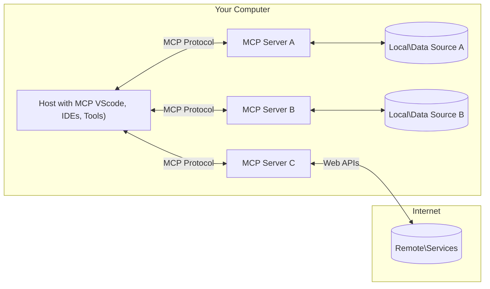

<!--
CO_OP_TRANSLATOR_METADATA:
{
  "original_hash": "355b12a5970c5c9e6db0bee970c751ba",
  "translation_date": "2025-07-04T16:29:50+00:00",
  "source_file": "01-CoreConcepts/README.md",
  "language_code": "bn"
}
-->
# 📖 MCP কোর ধারণা: AI ইন্টিগ্রেশনের জন্য Model Context Protocol আয়ত্ত করা

[Model Context Protocol (MCP)](https://github.com/modelcontextprotocol) একটি শক্তিশালী, স্ট্যান্ডার্ডাইজড ফ্রেমওয়ার্ক যা বড় ভাষা মডেল (LLMs) এবং বাহ্যিক টুল, অ্যাপ্লিকেশন, ও ডেটা সোর্সের মধ্যে যোগাযোগকে অপ্টিমাইজ করে। এই SEO-অপ্টিমাইজড গাইডটি আপনাকে MCP এর মূল ধারণাগুলো বুঝতে সাহায্য করবে, যাতে আপনি এর ক্লায়েন্ট-সার্ভার আর্কিটেকচার, গুরুত্বপূর্ণ উপাদান, যোগাযোগের পদ্ধতি এবং বাস্তবায়নের সেরা অনুশীলনগুলো সম্পর্কে স্পষ্ট ধারণা পান।

## ওভারভিউ

এই পাঠে Model Context Protocol (MCP) ইকোসিস্টেমের মৌলিক আর্কিটেকচার এবং উপাদানগুলো আলোচনা করা হবে। আপনি MCP ইন্টারঅ্যাকশনের জন্য ক্লায়েন্ট-সার্ভার আর্কিটেকচার, মূল উপাদান এবং যোগাযোগের পদ্ধতিগুলো সম্পর্কে শিখবেন।

## 👩‍🎓 প্রধান শেখার লক্ষ্যসমূহ

এই পাঠের শেষে আপনি:

- MCP ক্লায়েন্ট-সার্ভার আর্কিটেকচার বুঝতে পারবেন।
- Hosts, Clients, এবং Servers এর ভূমিকা ও দায়িত্ব চিহ্নিত করতে পারবেন।
- MCP কে একটি নমনীয় ইন্টিগ্রেশন লেয়ার হিসেবে গড়ে তোলার মূল বৈশিষ্ট্য বিশ্লেষণ করতে পারবেন।
- MCP ইকোসিস্টেমের মধ্যে তথ্য প্রবাহ কিভাবে ঘটে তা শিখবেন।
- .NET, Java, Python, এবং JavaScript এ কোড উদাহরণের মাধ্যমে ব্যবহারিক ধারণা পাবেন।

## 🔎 MCP আর্কিটেকচার: গভীর দৃষ্টিভঙ্গি

MCP ইকোসিস্টেম ক্লায়েন্ট-সার্ভার মডেলের ওপর ভিত্তি করে তৈরি। এই মডুলার কাঠামো AI অ্যাপ্লিকেশনগুলোকে টুল, ডেটাবেস, API, এবং প্রাসঙ্গিক রিসোর্সের সাথে দক্ষতার সঙ্গে ইন্টারঅ্যাক্ট করতে দেয়। আসুন এই আর্কিটেকচারকে এর মূল উপাদানে ভাগ করি।

মূলত, MCP একটি ক্লায়েন্ট-সার্ভার আর্কিটেকচার অনুসরণ করে যেখানে একটি হোস্ট অ্যাপ্লিকেশন একাধিক সার্ভারের সাথে সংযোগ স্থাপন করতে পারে:



- **MCP Hosts**: VSCode, Claude Desktop, IDEs, বা AI টুলের মতো প্রোগ্রাম যা MCP এর মাধ্যমে ডেটা অ্যাক্সেস করতে চায়
- **MCP Clients**: প্রোটোকল ক্লায়েন্ট যারা সার্ভারের সাথে ১:১ সংযোগ বজায় রাখে
- **MCP Servers**: হালকা ওজনের প্রোগ্রাম যা প্রতিটি নির্দিষ্ট ক্ষমতা স্ট্যান্ডার্ডাইজড Model Context Protocol এর মাধ্যমে প্রদান করে
- **লোকাল ডেটা সোর্স**: আপনার কম্পিউটারের ফাইল, ডেটাবেস, এবং সার্ভিস যা MCP সার্ভার নিরাপদে অ্যাক্সেস করতে পারে
- **রিমোট সার্ভিসেস**: ইন্টারনেটের মাধ্যমে উপলব্ধ বাহ্যিক সিস্টেম যা MCP সার্ভার API এর মাধ্যমে সংযোগ করতে পারে।

MCP প্রোটোকল একটি বিকাশমান স্ট্যান্ডার্ড, এর সর্বশেষ আপডেটগুলো দেখতে পারেন [প্রোটোকল স্পেসিফিকেশন](https://modelcontextprotocol.io/specification/2025-06-18/)

### ১. Hosts

Model Context Protocol (MCP) এ Hosts একটি গুরুত্বপূর্ণ ভূমিকা পালন করে, কারণ ব্যবহারকারীরা প্রোটোকলের সাথে যোগাযোগ করার জন্য মূল ইন্টারফেস হিসেবে Hosts ব্যবহার করে। Hosts হল অ্যাপ্লিকেশন বা পরিবেশ যা MCP সার্ভারের সাথে সংযোগ শুরু করে ডেটা, টুল, এবং প্রম্পট অ্যাক্সেস করার জন্য। Hosts এর উদাহরণ হিসেবে Visual Studio Code, Claude Desktop এর মতো AI টুল, বা নির্দিষ্ট কাজের জন্য তৈরি কাস্টম এজেন্ট অন্তর্ভুক্ত।

**Hosts** হল LLM অ্যাপ্লিকেশন যা সংযোগ শুরু করে। তারা:

- AI মডেলের সাথে ইন্টারঅ্যাক্ট করে বা রেসপন্স তৈরি করে।
- MCP সার্ভারের সাথে সংযোগ শুরু করে।
- কথোপকথনের প্রবাহ এবং ইউজার ইন্টারফেস পরিচালনা করে।
- অনুমতি এবং নিরাপত্তা নিয়ন্ত্রণ করে।
- ডেটা শেয়ারিং এবং টুল এক্সিকিউশনের জন্য ব্যবহারকারীর সম্মতি পরিচালনা করে।

### ২. Clients

Clients হল গুরুত্বপূর্ণ উপাদান যা Hosts এবং MCP সার্ভারের মধ্যে ইন্টারঅ্যাকশন সহজ করে। Clients মধ্যস্থতাকারীর মতো কাজ করে, Hosts কে MCP সার্ভারের প্রদত্ত ফাংশনালিটি ব্যবহার করার সুযোগ দেয়। তারা MCP আর্কিটেকচারের মধ্যে মসৃণ যোগাযোগ এবং দক্ষ ডেটা বিনিময় নিশ্চিত করে।

**Clients** হল হোস্ট অ্যাপ্লিকেশনের মধ্যে সংযোগকারী। তারা:

- সার্ভারে প্রম্পট/নির্দেশনা সহ অনুরোধ পাঠায়।
- সার্ভারের সাথে ক্ষমতা নিয়ে আলোচনা করে।
- মডেল থেকে টুল এক্সিকিউশনের অনুরোধ পরিচালনা করে।
- ব্যবহারকারীদের কাছে রেসপন্স প্রক্রিয়া ও প্রদর্শন করে।

### ৩. Servers

Servers MCP ক্লায়েন্ট থেকে অনুরোধ গ্রহণ করে উপযুক্ত রেসপন্স প্রদান করে। তারা ডেটা রিট্রিভাল, টুল এক্সিকিউশন, এবং প্রম্পট জেনারেশনের মতো বিভিন্ন অপারেশন পরিচালনা করে। Servers নিশ্চিত করে যে ক্লায়েন্ট এবং Hosts এর মধ্যে যোগাযোগ কার্যকর এবং নির্ভরযোগ্য হয়, এবং ইন্টারঅ্যাকশনের অখণ্ডতা বজায় থাকে।

**Servers** হল সার্ভিস যা প্রসঙ্গ এবং ক্ষমতা প্রদান করে। তারা:

- উপলব্ধ ফিচার (রিসোর্স, প্রম্পট, টুল) নিবন্ধন করে
- ক্লায়েন্ট থেকে টুল কল গ্রহণ ও এক্সিকিউট করে
- মডেলের রেসপন্স উন্নত করার জন্য প্রসঙ্গগত তথ্য প্রদান করে
- আউটপুট ক্লায়েন্টকে ফেরত দেয়
- প্রয়োজনে ইন্টারঅ্যাকশনের মধ্যে স্টেট বজায় রাখে

Servers যেকেউ তৈরি করতে পারে মডেলের ক্ষমতা বাড়ানোর জন্য বিশেষায়িত ফাংশনালিটি সহ।

### ৪. Server Features

Model Context Protocol (MCP) এর Servers ক্লায়েন্ট, হোস্ট, এবং ভাষা মডেলের মধ্যে সমৃদ্ধ ইন্টারঅ্যাকশন সক্ষম করার জন্য মৌলিক বিল্ডিং ব্লক সরবরাহ করে। এই ফিচারগুলো MCP এর ক্ষমতা বাড়াতে গঠনমূলক প্রসঙ্গ, টুল, এবং প্রম্পট প্রদান করে।

MCP সার্ভার নিম্নলিখিত ফিচারগুলো দিতে পারে:

#### 📑 Resources

Model Context Protocol (MCP) এ Resources বিভিন্ন ধরনের প্রসঙ্গ এবং ডেটা অন্তর্ভুক্ত করে যা ব্যবহারকারী বা AI মডেল ব্যবহার করতে পারে। এর মধ্যে রয়েছে:

- **প্রসঙ্গগত ডেটা**: তথ্য এবং প্রসঙ্গ যা ব্যবহারকারী বা AI মডেল সিদ্ধান্ত গ্রহণ এবং কাজ সম্পাদনের জন্য ব্যবহার করতে পারে।
- **জ্ঞানভাণ্ডার এবং ডকুমেন্ট সংগ্রহ**: কাঠামোবদ্ধ ও অ-কাঠামোবদ্ধ ডেটার সংগ্রহ, যেমন আর্টিকেল, ম্যানুয়াল, এবং গবেষণাপত্র, যা মূল্যবান তথ্য সরবরাহ করে।
- **লোকাল ফাইল এবং ডেটাবেস**: ডিভাইস বা ডেটাবেসে স্থানীয়ভাবে সংরক্ষিত ডেটা, যা প্রক্রিয়াকরণ এবং বিশ্লেষণের জন্য অ্যাক্সেসযোগ্য।
- **API এবং ওয়েব সার্ভিস**: বাহ্যিক ইন্টারফেস এবং সার্ভিস যা অতিরিক্ত ডেটা এবং ফাংশনালিটি প্রদান করে, বিভিন্ন অনলাইন রিসোর্স এবং টুলের সাথে ইন্টিগ্রেশন সক্ষম করে।

একটি রিসোর্সের উদাহরণ হতে পারে একটি ডেটাবেস স্কিমা বা একটি ফাইল যা এভাবে অ্যাক্সেস করা যায়:

```text
file://log.txt
database://schema
```

### 🤖 Prompts

Model Context Protocol (MCP) এ Prompts বিভিন্ন প্রি-ডিফাইন্ড টেমপ্লেট এবং ইন্টারঅ্যাকশন প্যাটার্ন অন্তর্ভুক্ত করে যা ব্যবহারকারীর কাজের প্রবাহ সহজ করে এবং যোগাযোগ উন্নত করে। এর মধ্যে রয়েছে:

- **টেমপ্লেটেড মেসেজ এবং ওয়ার্কফ্লো**: পূর্বনির্ধারিত মেসেজ এবং প্রক্রিয়া যা ব্যবহারকারীকে নির্দিষ্ট কাজ এবং ইন্টারঅ্যাকশনে গাইড করে।
- **প্রি-ডিফাইন্ড ইন্টারঅ্যাকশন প্যাটার্ন**: স্ট্যান্ডার্ডাইজড ক্রিয়া এবং রেসপন্সের সিকোয়েন্স যা ধারাবাহিক এবং দক্ষ যোগাযোগ নিশ্চিত করে।
- **বিশেষায়িত কথোপকথন টেমপ্লেট**: নির্দিষ্ট ধরনের কথোপকথনের জন্য কাস্টমাইজযোগ্য টেমপ্লেট, যা প্রাসঙ্গিক এবং প্রসঙ্গভিত্তিক ইন্টারঅ্যাকশন নিশ্চিত করে।

একটি প্রম্পট টেমপ্লেট এরকম দেখতে পারে:

```markdown
Generate a product slogan based on the following {{product}} with the following {{keywords}}
```

#### ⛏️ Tools

Model Context Protocol (MCP) এ Tools হল ফাংশন যা AI মডেল নির্দিষ্ট কাজ সম্পাদনের জন্য এক্সিকিউট করতে পারে। এই টুলগুলো AI মডেলের ক্ষমতা বাড়ানোর জন্য গঠনমূলক এবং নির্ভরযোগ্য অপারেশন প্রদান করে। মূল দিকগুলো হল:

- **AI মডেলের জন্য এক্সিকিউটেবল ফাংশন**: টুলগুলো এমন ফাংশন যা AI মডেল বিভিন্ন কাজ সম্পাদনের জন্য কল করতে পারে।
- **স্বতন্ত্র নাম এবং বর্ণনা**: প্রতিটি টুলের একটি অনন্য নাম এবং বিস্তারিত বর্ণনা থাকে যা এর উদ্দেশ্য এবং কার্যকারিতা ব্যাখ্যা করে।
- **প্যারামিটার এবং আউটপুট**: টুল নির্দিষ্ট প্যারামিটার গ্রহণ করে এবং গঠনমূলক আউটপুট প্রদান করে, যা ধারাবাহিক এবং পূর্বানুমেয় ফলাফল নিশ্চিত করে।
- **স্বতন্ত্র ফাংশন**: টুলগুলো ওয়েব সার্চ, গণনা, এবং ডেটাবেস কোয়েরির মতো স্বতন্ত্র কাজ সম্পাদন করে।

একটি টুলের উদাহরণ এরকম হতে পারে:

```typescript
server.tool(
  "GetProducts",
  {
    pageSize: z.string().optional(),
    pageCount: z.string().optional()
  }, () => {
    // return results from API
  }
)
```

## Client Features

Model Context Protocol (MCP) এ ক্লায়েন্টরা সার্ভারকে বিভিন্ন গুরুত্বপূর্ণ ফিচার প্রদান করে, যা প্রোটোকলের সামগ্রিক কার্যকারিতা এবং ইন্টারঅ্যাকশন উন্নত করে। এর মধ্যে একটি উল্লেখযোগ্য ফিচার হল Sampling।

### 👉 Sampling

- **সার্ভার-উদ্বুদ্ধ এজেন্টিক আচরণ**: ক্লায়েন্ট সার্ভারকে নির্দিষ্ট কাজ বা আচরণ স্বয়ংক্রিয়ভাবে শুরু করার সুযোগ দেয়, যা সিস্টেমের গতিশীল ক্ষমতা বাড়ায়।
- **Recursive LLM ইন্টারঅ্যাকশন**: এই ফিচারটি বড় ভাষা মডেলের সাথে পুনরাবৃত্তিমূলক ইন্টারঅ্যাকশন সক্ষম করে, যা আরও জটিল এবং পর্যায়ক্রমিক কাজ প্রক্রিয়াকরণ সম্ভব করে।
- **অতিরিক্ত মডেল কমপ্লিশন অনুরোধ**: সার্ভার মডেল থেকে অতিরিক্ত রেসপন্স চেয়ে নিশ্চিত করে যে উত্তরগুলো সম্পূর্ণ এবং প্রসঙ্গভিত্তিক।

## MCP তে তথ্য প্রবাহ

Model Context Protocol (MCP) হোস্ট, ক্লায়েন্ট, সার্ভার, এবং মডেলের মধ্যে তথ্যের একটি গঠনমূলক প্রবাহ নির্ধারণ করে। এই প্রবাহ বোঝা ব্যবহারকারীর অনুরোধ কীভাবে প্রক্রিয়াকৃত হয় এবং কিভাবে বাহ্যিক টুল ও ডেটা মডেলের রেসপন্সে সংযুক্ত হয় তা স্পষ্ট করে।

- **হোস্ট সংযোগ শুরু করে**  
  হোস্ট অ্যাপ্লিকেশন (যেমন IDE বা চ্যাট ইন্টারফেস) একটি MCP সার্ভারের সাথে সংযোগ স্থাপন করে, সাধারণত STDIO, WebSocket, বা অন্য কোনো সমর্থিত ট্রান্সপোর্টের মাধ্যমে।

- **ক্ষমতা নিয়ে আলোচনা**  
  ক্লায়েন্ট (হোস্টের মধ্যে এমবেড করা) এবং সার্ভার তাদের সমর্থিত ফিচার, টুল, রিসোর্স, এবং প্রোটোকল ভার্সন সম্পর্কে তথ্য বিনিময় করে। এটি নিশ্চিত করে যে উভয় পক্ষ সেশনটির জন্য উপলব্ধ ক্ষমতা বুঝতে পারে।

- **ব্যবহারকারীর অনুরোধ**  
  ব্যবহারকারী হোস্টের সাথে ইন্টারঅ্যাক্ট করে (যেমন প্রম্পট বা কমান্ড প্রবেশ করায়)। হোস্ট এই ইনপুট সংগ্রহ করে ক্লায়েন্টকে প্রক্রিয়াকরণের জন্য পাঠায়।

- **রিসোর্স বা টুল ব্যবহার**  
  - ক্লায়েন্ট সার্ভার থেকে অতিরিক্ত প্রসঙ্গ বা রিসোর্স (যেমন ফাইল, ডেটাবেস এন্ট্রি, বা জ্ঞানভাণ্ডার আর্টিকেল) অনুরোধ করতে পারে মডেলের বোঝাপড়া সমৃদ্ধ করার জন্য।
  - যদি মডেল নির্ধারণ করে যে একটি টুল প্রয়োজন (যেমন ডেটা আনার জন্য, গণনা করার জন্য, বা API কল করার জন্য), ক্লায়েন্ট টুলের নাম এবং প্যারামিটার উল্লেখ করে সার্ভারে টুল কল অনুরোধ পাঠায়।

- **সার্ভার এক্সিকিউশন**  
  সার্ভার রিসোর্স বা টুল অনুরোধ গ্রহণ করে, প্রয়োজনীয় অপারেশন (যেমন ফাংশন চালানো, ডেটাবেস কোয়েরি, বা ফাইল রিট্রিভাল) সম্পাদন করে, এবং ফলাফল গঠনমূলক ফরম্যাটে ক্লায়েন্টকে ফেরত দেয়।

- **রেসপন্স জেনারেশন**  
  ক্লায়েন্ট সার্ভারের রেসপন্স (রিসোর্স ডেটা, টুল আউটপুট ইত্যাদি) মডেলের চলমান ইন্টারঅ্যাকশনে সংযুক্ত করে। মডেল এই তথ্য ব্যবহার করে একটি বিস্তৃত এবং প্রসঙ্গভিত্তিক রেসপন্স তৈরি করে।

- **ফলাফল উপস্থাপন**  
  হোস্ট ক্লায়েন্ট থেকে চূড়ান্ত আউটপুট গ্রহণ করে ব্যবহারকারীর কাছে উপস্থাপন করে, সাধারণত মডেলের তৈরি টেক্সট এবং টুল এক্সিকিউশন বা রিসোর্স লুকআপের ফলাফল উভয়ই অন্তর্ভুক্ত থাকে।

এই প্রবাহ MCP কে উন্নত, ইন্টারঅ্যাকটিভ, এবং প্রসঙ্গ-সচেতন AI অ্যাপ্লিকেশন সমর্থন করতে সক্ষম করে, মডেলগুলোকে বাহ্যিক টুল এবং ডেটা সোর্সের সাথে নির্বিঘ্নে সংযুক্ত করে।

## প্রোটোকল বিস্তারিত

MCP (Model Context Protocol) [JSON-RPC 2.0](https://www.jsonrpc.org/) এর ওপর নির্মিত, যা হোস্ট, ক্লায়েন্ট, এবং সার্ভারের মধ্যে যোগাযোগের জন্য একটি স্ট্যান্ডার্ড, ভাষা-নিরপেক্ষ মেসেজ ফরম্যাট প্রদান করে। এই ভিত্তি বিভিন্ন প্ল্যাটফর্ম এবং প্রোগ্রামিং ভাষায় নির্ভরযোগ্য, গঠনমূলক, এবং সম্প্রসারিত ইন্টারঅ্যাকশন সক্ষম করে।

### প্রধান প্রোটোকল ফিচার

MCP JSON-RPC 2.0 কে টুল কল, রিসোর্স অ্যাক্সেস, এবং প্রম্পট ব্যবস্থাপনার জন্য অতিরিক্ত নিয়মাবলী দিয়ে সম্প্রসারিত করে। এটি একাধিক ট্রান্সপোর্ট লেয়ার (STDIO, WebSocket, SSE) সমর্থন করে এবং উপাদানগুলোর মধ্যে নিরাপদ, সম্প্রসারিত, এবং ভাষা-নিরপেক্ষ যোগাযোগ নিশ্চিত করে।

#### 🧢 বেস প্রোটোকল

- **JSON-RPC মেসেজ ফরম্যাট**: সব অনুরোধ এবং রেসপন্স JSON-RPC 2.0 স্পেসিফিকেশন অনুসারে, যা মেথড কল, প্যারামিটার, ফলাফল, এবং এরর হ্যান্ডলিংয়ের জন্য ধারাবাহিক কাঠামো নিশ্চিত করে।
- **স্টেটফুল সংযোগ**: MCP সেশন একাধিক অনুরোধ জুড়ে স্টেট বজায় রাখে, চলমান কথোপকথন, প্রসঙ্গ সঞ্চয়, এবং রিসোর্স ব্যবস্থাপনা সমর্থন করে।
- **ক্ষমতা নিয়ে আলোচনা**: সংযোগ স্থাপনের সময় ক্লায়েন্ট এবং সার্ভার তাদের সমর্থিত ফিচার, প্রোটোকল ভার্সন, উপলব্ধ টুল এবং রিসোর্স সম্পর্কে তথ্য বিনিময় করে। এটি নিশ্চিত করে যে উভয় পক্ষ একে অপরের ক্ষমতা বুঝতে পারে এবং প্রয়োজন অনুযায়ী মানিয়ে নিতে পারে।

#### ➕ অতিরিক্ত ইউটিলিটি

নিম্নলিখিত অতিরিক্ত ইউটিলিটি এবং প্রোটোকল সম্প্রসারণ MCP ডেভেলপার অভিজ্ঞতা উন্নত এবং উন্নত পরিস্থিতি সক্ষম করার জন্য প্রদান করে:

- **কনফিগারেশন অপশন**: MCP সেশন প্যারামিটার যেমন টুল অনুমতি, রিসোর্স অ্যাক্সেস, এবং মডেল সেটিংস ডায়নামিকভাবে কনফিগার করার সুযোগ দেয়, প্রতিটি ইন্টারঅ্যাকশনের জন্য উপযোগী।
- **প্রগ্রেস ট্র্যাকিং**: দীর্ঘমেয়াদী অপারেশনগুলো প্রগ্রেস আপডেট রিপোর্ট করতে পারে, যা জটিল কাজের সময় প্রতিক্রিয়াশীল ইউজার ইন্টারফেস এবং উন্নত ব্যবহারকারীর অভিজ্ঞতা নিশ্চিত করে।
- **অনুরোধ বাতিলকরণ**: ক্লায়েন্টরা চলমান অনুরোধ বাতিল করতে পারে, যা ব্যবহারকারীকে অপ্রয়োজনীয় বা দীর্ঘস্থায়ী অপারেশন বন্ধ করার সুযোগ দেয়।
- **এরর রিপোর্টিং**: স্ট্যান্ডার্ডাইজড এরর মেসেজ এবং কোড সমস্যা নির্ণয়, ব্যর্থতা সুষ্ঠুভাবে পরিচালনা, এবং ব্যবহারকারী ও ডেভেলপারদের জন্য কার্যকর প্রতিক্রিয়া প্রদান করে।
- **লগিং**: ক্লায়েন্ট এবং সার্ভার উভয়ই প্রোটোকল ইন্টারঅ্যাকশনের অডিট, ডিবাগিং
MCP প্রোটোকল জুড়ে নিরাপত্তা এবং অনুমোদন পরিচালনার জন্য বেশ কয়েকটি অন্তর্নির্মিত ধারণা এবং প্রক্রিয়া অন্তর্ভুক্ত করে:

1. **টুল পারমিশন কন্ট্রোল**:  
  ক্লায়েন্টরা নির্দিষ্ট করতে পারে কোন টুলগুলি একটি মডেল সেশনের সময় ব্যবহার করতে পারবে। এটি নিশ্চিত করে যে শুধুমাত্র স্পষ্টভাবে অনুমোদিত টুলগুলিই অ্যাক্সেসযোগ্য, যা অনিচ্ছাকৃত বা অনিরাপদ অপারেশনের ঝুঁকি কমায়। পারমিশনগুলি ব্যবহারকারীর পছন্দ, সংস্থার নীতি, বা ইন্টারঅ্যাকশনের প্রেক্ষাপট অনুযায়ী গতিশীলভাবে কনফিগার করা যেতে পারে।

2. **অথেন্টিকেশন**:  
  সার্ভারগুলি টুল, রিসোর্স, বা সংবেদনশীল অপারেশনে অ্যাক্সেস দেওয়ার আগে অথেন্টিকেশন দাবি করতে পারে। এর মধ্যে API কী, OAuth টোকেন, বা অন্যান্য অথেন্টিকেশন পদ্ধতি থাকতে পারে। সঠিক অথেন্টিকেশন নিশ্চিত করে যে শুধুমাত্র বিশ্বাসযোগ্য ক্লায়েন্ট এবং ব্যবহারকারীরাই সার্ভার-সাইড ক্ষমতাগুলি ব্যবহার করতে পারে।

3. **ভ্যালিডেশন**:  
  সমস্ত টুল কলের জন্য প্যারামিটার ভ্যালিডেশন বাধ্যতামূলক। প্রতিটি টুল তার প্যারামিটারগুলোর প্রত্যাশিত টাইপ, ফরম্যাট, এবং সীমাবদ্ধতা নির্ধারণ করে, এবং সার্ভার সেই অনুযায়ী ইনকামিং রিকোয়েস্ট যাচাই করে। এটি ভুল বা ক্ষতিকর ইনপুট টুল ইমপ্লিমেন্টেশনে পৌঁছানো থেকে রোধ করে এবং অপারেশনের অখণ্ডতা বজায় রাখতে সাহায্য করে।

4. **রেট লিমিটিং**:  
  অপব্যবহার রোধ এবং সার্ভার রিসোর্সের ন্যায্য ব্যবহার নিশ্চিত করতে MCP সার্ভারগুলি টুল কল এবং রিসোর্স অ্যাক্সেসের জন্য রেট লিমিটিং প্রয়োগ করতে পারে। রেট লিমিট ব্যবহারকারী, সেশন, বা গ্লোবালি প্রয়োগ করা যেতে পারে এবং ডিনায়াল-অফ-সার্ভিস আক্রমণ বা অতিরিক্ত রিসোর্স ব্যবহারের বিরুদ্ধে সুরক্ষা দেয়।

এই প্রক্রিয়াগুলো একত্রিত করে MCP ভাষা মডেলকে বাহ্যিক টুল এবং ডেটা সোর্সের সাথে নিরাপদভাবে সংযুক্ত করার জন্য একটি মজবুত ভিত্তি প্রদান করে, একই সাথে ব্যবহারকারী এবং ডেভেলপারদের অ্যাক্সেস ও ব্যবহারের উপর সূক্ষ্ম নিয়ন্ত্রণ দেয়।

## প্রোটোকল মেসেজসমূহ

MCP যোগাযোগ ক্লায়েন্ট, সার্ভার, এবং মডেলের মধ্যে স্পষ্ট ও নির্ভরযোগ্য ইন্টারঅ্যাকশনের জন্য গঠনমূলক JSON মেসেজ ব্যবহার করে। প্রধান মেসেজ টাইপগুলো হলো:

- **Client Request**  
  ক্লায়েন্ট থেকে সার্ভারে পাঠানো হয়, সাধারণত এতে থাকে:
  - ব্যবহারকারীর প্রম্পট বা কমান্ড
  - প্রসঙ্গের জন্য কথোপকথনের ইতিহাস
  - টুল কনফিগারেশন এবং পারমিশন
  - অতিরিক্ত মেটাডেটা বা সেশন তথ্য

- **Model Response**  
  মডেল থেকে (ক্লায়েন্টের মাধ্যমে) ফেরত আসে, এতে থাকে:
  - প্রম্পট এবং প্রসঙ্গের ভিত্তিতে তৈরি টেক্সট বা সম্পূর্ণতা
  - ঐচ্ছিক টুল কল নির্দেশনা যদি মডেল মনে করে টুল ব্যবহার করা উচিত
  - প্রয়োজনীয় রিসোর্স বা অতিরিক্ত প্রসঙ্গের রেফারেন্স

- **Tool Request**  
  যখন একটি টুল চালানোর প্রয়োজন হয়, ক্লায়েন্ট থেকে সার্ভারে পাঠানো হয়। এতে থাকে:
  - কল করার টুলের নাম
  - টুলের স্কিমা অনুযায়ী প্রয়োজনীয় প্যারামিটার
  - রিকোয়েস্ট ট্র্যাক করার জন্য প্রসঙ্গগত তথ্য বা আইডেন্টিফায়ার

- **Tool Response**  
  টুল চালানোর পর সার্ভার থেকে ফেরত আসে। এতে থাকে:
  - টুলের কার্যক্রমের ফলাফল (গঠনমূলক ডেটা বা কনটেন্ট)
  - টুল কল ব্যর্থ হলে কোনো ত্রুটি বা স্ট্যাটাস তথ্য
  - ঐচ্ছিকভাবে, কার্যক্রম সম্পর্কিত অতিরিক্ত মেটাডেটা বা লগ

এই গঠনমূলক মেসেজগুলো MCP ওয়ার্কফ্লোর প্রতিটি ধাপকে স্পষ্ট, ট্রেসযোগ্য, এবং সম্প্রসারণযোগ্য করে তোলে, যা মাল্টি-টার্ন কথোপকথন, টুল চেইনিং, এবং শক্তিশালী ত্রুটি পরিচালনার মতো উন্নত পরিস্থিতি সমর্থন করে।

## মূল বিষয়সমূহ

- MCP ক্লায়েন্ট-সার্ভার আর্কিটেকচার ব্যবহার করে মডেলকে বাহ্যিক ক্ষমতার সাথে সংযুক্ত করে
- ইকোসিস্টেমে রয়েছে ক্লায়েন্ট, হোস্ট, সার্ভার, টুল, এবং ডেটা সোর্স
- যোগাযোগ STDIO, SSE, বা WebSockets এর মাধ্যমে হতে পারে
- টুল হলো মডেলের জন্য প্রকাশিত কার্যকারিতার মৌলিক ইউনিট
- গঠনমূলক যোগাযোগ প্রোটোকল নিশ্চিত করে সঙ্গতিপূর্ণ ইন্টারঅ্যাকশন

## অনুশীলন

আপনার ডোমেইনে উপযোগী একটি সহজ MCP টুল ডিজাইন করুন। নির্ধারণ করুন:
1. টুলটির নাম কী হবে
2. এটি কোন প্যারামিটার গ্রহণ করবে
3. এটি কী আউটপুট দেবে
4. মডেল কীভাবে এই টুল ব্যবহার করে ব্যবহারকারীর সমস্যা সমাধান করতে পারে

---

## পরবর্তী কী

পরবর্তী: [Chapter 2: Security](../02-Security/README.md)

**অস্বীকৃতি**:  
এই নথিটি AI অনুবাদ সেবা [Co-op Translator](https://github.com/Azure/co-op-translator) ব্যবহার করে অনূদিত হয়েছে। আমরা যথাসাধ্য সঠিকতার চেষ্টা করি, তবে স্বয়ংক্রিয় অনুবাদে ত্রুটি বা অসঙ্গতি থাকতে পারে। মূল নথিটি তার নিজস্ব ভাষায়ই কর্তৃত্বপূর্ণ উৎস হিসেবে বিবেচিত হওয়া উচিত। গুরুত্বপূর্ণ তথ্যের জন্য পেশাদার মানব অনুবাদ গ্রহণ করার পরামর্শ দেওয়া হয়। এই অনুবাদের ব্যবহারে সৃষ্ট কোনো ভুল বোঝাবুঝি বা ভুল ব্যাখ্যার জন্য আমরা দায়ী নই।