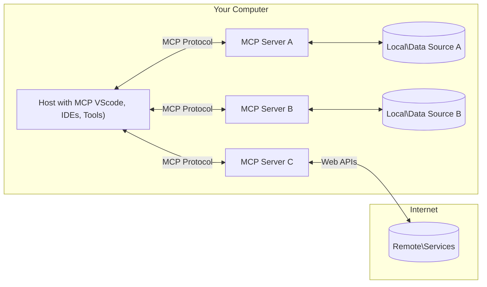

<!--
CO_OP_TRANSLATOR_METADATA:
{
  "original_hash": "b3b4a6ad10c3c0edbf7fa7cfa0ec496b",
  "translation_date": "2025-07-02T07:05:35+00:00",
  "source_file": "01-CoreConcepts/README.md",
  "language_code": "bn"
}
-->
# 📖 MCP কোর ধারণা: AI ইন্টিগ্রেশনের জন্য Model Context Protocol আয়ত্ত করা

[Model Context Protocol (MCP)](https://github.com/modelcontextprotocol) একটি শক্তিশালী, স্ট্যান্ডার্ডাইজড ফ্রেমওয়ার্ক যা বড় ভাষা মডেল (LLMs) এবং বাহ্যিক টুল, অ্যাপ্লিকেশন, এবং ডেটা উৎসগুলোর মধ্যে যোগাযোগকে অপ্টিমাইজ করে। এই SEO-অপ্টিমাইজড গাইডটি আপনাকে MCP এর মূল ধারণাগুলো বুঝতে সাহায্য করবে, যাতে আপনি এর ক্লায়েন্ট-সার্ভার আর্কিটেকচার, গুরুত্বপূর্ণ উপাদান, যোগাযোগের প্রক্রিয়া এবং বাস্তবায়নের সেরা পদ্ধতিগুলো সম্পর্কে পরিষ্কার ধারণা পান।

## ওভারভিউ

এই পাঠে আমরা Model Context Protocol (MCP) ইকোসিস্টেমের মৌলিক আর্কিটেকচার এবং উপাদানগুলো বিশ্লেষণ করব। আপনি MCP এর ক্লায়েন্ট-সার্ভার আর্কিটেকচার, প্রধান উপাদান, এবং যোগাযোগের প্রক্রিয়া সম্পর্কে জানবেন যা MCP ইন্টারঅ্যাকশন চালায়।

## 👩‍🎓 মূল শেখার উদ্দেশ্যসমূহ

এই পাঠের শেষে, আপনি:

- MCP ক্লায়েন্ট-সার্ভার আর্কিটেকচার বুঝতে পারবেন।
- Hosts, Clients, এবং Servers এর ভূমিকা ও দায়িত্ব চিনতে পারবেন।
- MCP কে একটি নমনীয় ইন্টিগ্রেশন লেয়ার হিসেবে গঠন করে এমন মূল বৈশিষ্ট্যগুলো বিশ্লেষণ করতে পারবেন।
- MCP ইকোসিস্টেমের মধ্যে তথ্য প্রবাহ কীভাবে ঘটে তা শিখবেন।
- .NET, Java, Python, এবং JavaScript এ কোড উদাহরণের মাধ্যমে ব্যবহারিক ধারণা অর্জন করবেন।

## 🔎 MCP আর্কিটেকচার: একটি গভীর দৃষ্টি

MCP ইকোসিস্টেমটি একটি ক্লায়েন্ট-সার্ভার মডেলের ওপর ভিত্তি করে তৈরি। এই মডুলার কাঠামো AI অ্যাপ্লিকেশনগুলোকে টুল, ডেটাবেস, API, এবং প্রাসঙ্গিক রিসোর্সের সঙ্গে দক্ষতার সাথে ইন্টারঅ্যাক্ট করতে দেয়। আসুন এই আর্কিটেকচারকে এর মূল উপাদানে ভাগ করি।

মূলত, MCP একটি ক্লায়েন্ট-সার্ভার আর্কিটেকচার অনুসরণ করে যেখানে একটি হোস্ট অ্যাপ্লিকেশন একাধিক সার্ভারের সঙ্গে সংযোগ স্থাপন করতে পারে:



- **MCP Hosts**: VSCode, Claude Desktop, IDEs বা MCP এর মাধ্যমে ডেটা অ্যাক্সেস করতে চাওয়া AI টুলের মতো প্রোগ্রাম
- **MCP Clients**: প্রোটোকল ক্লায়েন্ট যারা সার্ভারের সঙ্গে ১:১ সংযোগ বজায় রাখে
- **MCP Servers**: হালকা ওজনের প্রোগ্রাম যা প্রতিটি নির্দিষ্ট ক্ষমতা স্ট্যান্ডার্ডাইজড Model Context Protocol এর মাধ্যমে প্রদান করে
- **লোকাল ডেটা সোর্স**: আপনার কম্পিউটারের ফাইল, ডেটাবেস এবং সার্ভিস যা MCP সার্ভার নিরাপদে অ্যাক্সেস করতে পারে
- **রিমোট সার্ভিসেস**: ইন্টারনেটের মাধ্যমে উপলব্ধ বাহ্যিক সিস্টেম যা MCP সার্ভার API এর মাধ্যমে সংযুক্ত হতে পারে।

MCP প্রোটোকল একটি ক্রমবর্ধমান স্ট্যান্ডার্ড, এর সর্বশেষ আপডেটগুলো দেখতে পারেন [প্রোটোকল স্পেসিফিকেশন](https://modelcontextprotocol.io/specification/2025-06-18/) এ।

### ১. Hosts

Model Context Protocol (MCP) এ Hosts একটি গুরুত্বপূর্ণ ভূমিকা পালন করে, কারণ এটি ব্যবহারকারীদের প্রোটোকলের সঙ্গে ইন্টারঅ্যাক্ট করার প্রধান ইন্টারফেস। Hosts হলো এমন অ্যাপ্লিকেশন বা পরিবেশ যা MCP সার্ভারের সঙ্গে সংযোগ শুরু করে ডেটা, টুল এবং প্রম্পট অ্যাক্সেস করে। Hosts এর উদাহরণ হিসেবে রয়েছে Visual Studio Code এর মতো IDE, Claude Desktop এর মতো AI টুল, অথবা নির্দিষ্ট কাজের জন্য কাস্টম-তৈরি এজেন্ট।

**Hosts** হলো LLM অ্যাপ্লিকেশন যারা সংযোগ শুরু করে। তারা:

- AI মডেলের সঙ্গে ইন্টারঅ্যাক্ট করে বা রেসপন্স তৈরি করে।
- MCP সার্ভারের সঙ্গে সংযোগ শুরু করে।
- কথোপকথনের প্রবাহ এবং ব্যবহারকারীর ইন্টারফেস পরিচালনা করে।
- অনুমতি এবং নিরাপত্তা নিয়ন্ত্রণ করে।
- ডেটা শেয়ারিং এবং টুল এক্সিকিউশনের জন্য ব্যবহারকারীর সম্মতি পরিচালনা করে।

### ২. Clients

Clients হল গুরুত্বপূর্ণ উপাদান যা Hosts এবং MCP সার্ভারের মধ্যে ইন্টারঅ্যাকশন সহজতর করে। Clients মধ্যস্থতাকারীর মতো কাজ করে, Hosts কে MCP সার্ভার দ্বারা প্রদত্ত ফাংশনালিটি ব্যবহারে সক্ষম করে। তারা MCP আর্কিটেকচারে মসৃণ যোগাযোগ এবং কার্যকর তথ্য বিনিময় নিশ্চিত করে।

**Clients** হলো হোস্ট অ্যাপ্লিকেশনের ভেতরের সংযোগকারী। তারা:

- সার্ভারে প্রম্পট/নির্দেশনা সহ অনুরোধ পাঠায়।
- সার্ভারের সঙ্গে সক্ষমতা নিয়ে আলোচনা করে।
- মডেল থেকে আসা টুল এক্সিকিউশনের অনুরোধ পরিচালনা করে।
- ব্যবহারকারীদের কাছে রেসপন্স প্রক্রিয়া ও প্রদর্শন করে।

### ৩. Servers

Servers MCP ক্লায়েন্টদের অনুরোধ গ্রহণ এবং উপযুক্ত রেসপন্স প্রদান করার দায়িত্বে থাকে। তারা ডেটা পুনরুদ্ধার, টুল এক্সিকিউশন, এবং প্রম্পট জেনারেশন সহ বিভিন্ন অপারেশন পরিচালনা করে। Servers নিশ্চিত করে যে ক্লায়েন্ট এবং Hosts এর মধ্যে যোগাযোগ কার্যকর এবং নির্ভরযোগ্য, এবং ইন্টারঅ্যাকশনের সততা বজায় থাকে।

**Servers** হলো সার্ভিস যা প্রাসঙ্গিক তথ্য এবং ক্ষমতা প্রদান করে। তারা:

- উপলব্ধ ফিচার (রিসোর্স, প্রম্পট, টুল) নিবন্ধন করে
- ক্লায়েন্ট থেকে আসা টুল কল গ্রহণ ও এক্সিকিউট করে
- মডেলের রেসপন্স উন্নত করার জন্য প্রাসঙ্গিক তথ্য প্রদান করে
- আউটপুট ক্লায়েন্টকে ফেরত দেয়
- প্রয়োজনে ইন্টারঅ্যাকশনের মাঝে স্টেট বজায় রাখে

Servers যে কেউ তৈরি করতে পারে, বিশেষায়িত ফাংশনালিটি দিয়ে মডেলের ক্ষমতা বাড়ানোর জন্য।

### ৪. Server Features

Model Context Protocol (MCP) এর Servers এমন মৌলিক ব্লক সরবরাহ করে যা ক্লায়েন্ট, হোস্ট, এবং ভাষা মডেলের মধ্যে সমৃদ্ধ ইন্টারঅ্যাকশন সম্ভব করে। এই ফিচারগুলো MCP এর ক্ষমতা বাড়াতে কাঠামোবদ্ধ প্রসঙ্গ, টুল, এবং প্রম্পট অফার করে।

MCP সার্ভার নিচের যে কোনো ফিচার অফার করতে পারে:

#### 📑 Resources

Model Context Protocol (MCP) এ Resources হলো বিভিন্ন ধরনের প্রসঙ্গ এবং ডেটা যা ব্যবহারকারী বা AI মডেল ব্যবহার করতে পারে। এর মধ্যে রয়েছে:

- **প্রসঙ্গগত ডেটা**: তথ্য এবং প্রসঙ্গ যা ব্যবহারকারী বা AI মডেল সিদ্ধান্ত নেওয়া ও কাজ সম্পাদনের জন্য ব্যবহার করে।
- **জ্ঞানভাণ্ডার এবং ডকুমেন্ট রিপোজিটরি**: কাঠামোবদ্ধ এবং অ-কাঠামোবদ্ধ ডেটার সংগ্রহ, যেমন আর্টিকেল, ম্যানুয়াল, গবেষণা পত্র যা মূল্যবান তথ্য প্রদান করে।
- **লোকাল ফাইল এবং ডেটাবেস**: ডিভাইস বা ডেটাবেসে স্থানীয়ভাবে সংরক্ষিত ডেটা যা প্রক্রিয়াকরণ ও বিশ্লেষণের জন্য অ্যাক্সেসযোগ্য।
- **API এবং ওয়েব সার্ভিসেস**: বাহ্যিক ইন্টারফেস এবং সার্ভিস যা অতিরিক্ত ডেটা ও ফাংশনালিটি দেয়, বিভিন্ন অনলাইন রিসোর্স এবং টুলের সঙ্গে ইন্টিগ্রেশন সম্ভব করে।

একটি রিসোর্স হতে পারে একটি ডেটাবেস স্কিমা বা একটি ফাইল, যা এভাবে অ্যাক্সেস করা যায়:

```text
file://log.txt
database://schema
```

### 🤖 Prompts

Model Context Protocol (MCP) এ Prompts বিভিন্ন প্রি-ডিফাইন্ড টেমপ্লেট এবং ইন্টারঅ্যাকশন প্যাটার্ন অন্তর্ভুক্ত করে যা ব্যবহারকারীর কাজকে সহজতর করে এবং যোগাযোগ উন্নত করে। এর মধ্যে রয়েছে:

- **টেমপ্লেটেড মেসেজ এবং ওয়ার্কফ্লো**: পূর্বনির্ধারিত কাঠামোবদ্ধ মেসেজ এবং প্রক্রিয়া যা ব্যবহারকারীকে নির্দিষ্ট কাজ ও ইন্টারঅ্যাকশনে গাইড করে।
- **প্রি-ডিফাইন্ড ইন্টারঅ্যাকশন প্যাটার্ন**: স্ট্যান্ডার্ড ক্রম যা ধারাবাহিক এবং কার্যকর যোগাযোগ নিশ্চিত করে।
- **বিশেষায়িত কথোপকথনের টেমপ্লেট**: নির্দিষ্ট ধরনের কথোপকথনের জন্য কাস্টমাইজযোগ্য টেমপ্লেট যা প্রাসঙ্গিক এবং উপযুক্ত ইন্টারঅ্যাকশন নিশ্চিত করে।

একটি প্রম্পট টেমপ্লেট দেখতে পারে এরকম:

```markdown
Generate a product slogan based on the following {{product}} with the following {{keywords}}
```

#### ⛏️ Tools

Model Context Protocol (MCP) এ Tools হলো ফাংশন যা AI মডেল নির্দিষ্ট কাজ করার জন্য এক্সিকিউট করতে পারে। এই টুলগুলো AI মডেলের ক্ষমতা বাড়াতে কাঠামোবদ্ধ এবং নির্ভরযোগ্য অপারেশন সরবরাহ করে। মূল দিকগুলো হলো:

- **AI মডেল এক্সিকিউট করার জন্য ফাংশন**: টুলগুলো এক্সিকিউটেবল ফাংশন যা AI মডেল বিভিন্ন কাজ সম্পাদনের জন্য কল করে।
- **অনন্য নাম এবং বর্ণনা**: প্রতিটি টুলের একটি স্বতন্ত্র নাম এবং বিস্তারিত বর্ণনা থাকে যা এর উদ্দেশ্য ও কার্যকারিতা ব্যাখ্যা করে।
- **প্যারামিটার এবং আউটপুট**: টুল নির্দিষ্ট প্যারামিটার গ্রহণ করে এবং কাঠামোবদ্ধ আউটপুট প্রদান করে, যা ধারাবাহিক এবং পূর্বানুমানযোগ্য ফলাফল নিশ্চিত করে।
- **স্বতন্ত্র ফাংশন**: টুলগুলো ওয়েব সার্চ, গণনা, ডেটাবেস কুয়েরি ইত্যাদি স্বতন্ত্র কাজ সম্পাদন করে।

একটি টুলের উদাহরণ হতে পারে এরকম:

```typescript
server.tool(
  "GetProducts",
  {
    pageSize: z.string().optional(),
    pageCount: z.string().optional()
  }, () => {
    // return results from API
  }
)
```

## Client Features

Model Context Protocol (MCP) এ ক্লায়েন্ট সার্ভারকে বিভিন্ন গুরুত্বপূর্ণ ফিচার প্রদান করে, যা প্রোটোকলের সামগ্রিক কার্যকারিতা ও ইন্টারঅ্যাকশন উন্নত করে। এর মধ্যে একটি উল্লেখযোগ্য ফিচার হলো Sampling।

### 👉 Sampling

- **সার্ভার-প্রবর্তিত এজেন্টিক আচরণ**: ক্লায়েন্ট সার্ভারকে স্বয়ংক্রিয়ভাবে নির্দিষ্ট ক্রিয়া বা আচরণ শুরু করার সুযোগ দেয়, যা সিস্টেমের গতিশীল ক্ষমতা বৃদ্ধি করে।
- **Recursive LLM ইন্টারঅ্যাকশন**: এই ফিচার বড় ভাষা মডেলের সঙ্গে পুনরাবৃত্তিমূলক ইন্টারঅ্যাকশন সম্ভব করে, যা জটিল এবং পর্যায়ক্রমিক কাজ প্রক্রিয়াকরণে সাহায্য করে।
- **অতিরিক্ত মডেল কমপ্লিশন অনুরোধ**: সার্ভার মডেল থেকে অতিরিক্ত রেসপন্স চাইতে পারে, নিশ্চিত করতে যে উত্তরগুলো পূর্ণাঙ্গ এবং প্রসঙ্গানুযায়ী।

## MCP তে তথ্য প্রবাহ

Model Context Protocol (MCP) হোস্ট, ক্লায়েন্ট, সার্ভার, এবং মডেলের মধ্যে তথ্যের কাঠামোবদ্ধ প্রবাহ নির্ধারণ করে। এই প্রবাহ বুঝলে স্পষ্ট হয় কীভাবে ব্যবহারকারীর অনুরোধ প্রক্রিয়াকরণ হয় এবং কীভাবে বাহ্যিক টুল ও ডেটা মডেলের রেসপন্সে সংযুক্ত হয়।

- **Host সংযোগ শুরু করে**  
  হোস্ট অ্যাপ্লিকেশন (যেমন IDE বা চ্যাট ইন্টারফেস) MCP সার্ভারের সঙ্গে সংযোগ স্থাপন করে, সাধারণত STDIO, WebSocket, অথবা অন্য সমর্থিত ট্রান্সপোর্টের মাধ্যমে।

- **ক্ষমতা নিয়ে আলোচনা**  
  হোস্টের মধ্যে এমবেড করা ক্লায়েন্ট এবং সার্ভার তাদের সমর্থিত ফিচার, টুল, রিসোর্স, এবং প্রোটোকল সংস্করণ সম্পর্কে তথ্য বিনিময় করে। এতে উভয় পক্ষ বুঝতে পারে সেশনটির জন্য কোন ক্ষমতাগুলো উপলব্ধ।

- **ব্যবহারকারীর অনুরোধ**  
  ব্যবহারকারী হোস্টের সঙ্গে ইন্টারঅ্যাক্ট করে (যেমন প্রম্পট বা কমান্ড প্রদান)। হোস্ট এই ইনপুট সংগ্রহ করে ক্লায়েন্টকে প্রক্রিয়াকরণের জন্য পাঠায়।

- **রিসোর্স বা টুল ব্যবহার**  
  - ক্লায়েন্ট সার্ভার থেকে অতিরিক্ত প্রসঙ্গ বা রিসোর্স (যেমন ফাইল, ডেটাবেস এন্ট্রি, বা জ্ঞানভাণ্ডারের আর্টিকেল) অনুরোধ করতে পারে মডেলের বোঝাপড়া উন্নত করার জন্য।
  - যদি মডেল নির্ধারণ করে যে একটি টুল প্রয়োজন (যেমন ডেটা আনা, গণনা করা, বা API কল করা), ক্লায়েন্ট টুলের নাম এবং প্যারামিটারসহ টুল ইনভোকেশন অনুরোধ সার্ভারে পাঠায়।

- **সার্ভার এক্সিকিউশন**  
  সার্ভার রিসোর্স বা টুল অনুরোধ গ্রহণ করে, প্রয়োজনীয় অপারেশন (যেমন ফাংশন চালানো, ডেটাবেস কুয়েরি, বা ফাইল পুনরুদ্ধার) সম্পাদন করে এবং ফলাফল কাঠামোবদ্ধ আকারে ক্লায়েন্টকে ফেরত দেয়।

- **রেসপন্স জেনারেশন**  
  ক্লায়েন্ট সার্ভারের রেসপন্স (রিসোর্স ডেটা, টুল আউটপুট ইত্যাদি) মডেলের চলমান ইন্টারঅ্যাকশনে একত্রিত করে। মডেল এই তথ্য ব্যবহার করে একটি ব্যাপক এবং প্রসঙ্গভিত্তিক প্রাসঙ্গিক উত্তর তৈরি করে।

- **ফলাফল উপস্থাপন**  
  হোস্ট ক্লায়েন্ট থেকে চূড়ান্ত আউটপুট গ্রহণ করে ব্যবহারকারীর সামনে উপস্থাপন করে, প্রায়ই মডেলের তৈরি টেক্সট এবং টুল এক্সিকিউশন বা রিসোর্স লুকআপ থেকে আসা ফলাফলসহ।

এই প্রবাহ MCP কে উন্নত, ইন্টারঅ্যাকটিভ, এবং প্রসঙ্গ-সচেতন AI অ্যাপ্লিকেশন সমর্থন করতে সক্ষম করে, মডেলকে বাহ্যিক টুল এবং ডেটা উৎসের সঙ্গে নির্বিঘ্নে সংযুক্ত করে।

## প্রোটোকল বিস্তারিত

MCP (Model Context Protocol) [JSON-RPC 2.0](https://www.jsonrpc.org/) এর ওপর ভিত্তি করে তৈরি, যা হোস্ট, ক্লায়েন্ট, এবং সার্ভারের মধ্যে যোগাযোগের জন্য একটি স্ট্যান্ডার্ডাইজড, ভাষা-নিরপেক্ষ মেসেজ ফরম্যাট প্রদান করে। এই ভিত্তি বিভিন্ন প্ল্যাটফর্ম এবং প্রোগ্রামিং ভাষায় নির্ভরযোগ্য, কাঠামোবদ্ধ, এবং সম্প্রসারিত ইন্টারঅ্যাকশন সম্ভব করে।

### মূল প্রোটোকল বৈশিষ্ট্য

MCP JSON-RPC 2.0 কে টুল ইনভোকেশন, রিসোর্স অ্যাক্সেস, এবং প্রম্পট ব্যবস্থাপনার জন্য অতিরিক্ত নিয়মাবলী দিয়ে সম্প্রসারিত করে। এটি একাধিক ট্রান্সপোর্ট লেয়ার (STDIO, WebSocket, SSE) সমর্থন করে এবং উপাদানগুলোর মধ্যে নিরাপদ, সম্প্রসারিত, এবং ভাষা-নিরপেক্ষ যোগাযোগ সক্ষম করে।

#### 🧢 বেস প্রোটোকল

- **JSON-RPC মেসেজ ফরম্যাট**: সব অনুরোধ এবং রেসপন্স JSON-RPC 2.0 স্পেসিফিকেশন অনুসারে, পদ্ধতি কল, প্যারামিটার, ফলাফল, এবং ত্রুটি হ্যান্ডলিংয়ের জন্য ধারাবাহিক কাঠামো নিশ্চিত করে।
- **স্টেটফুল সংযোগ**: MCP সেশন একাধিক অনুরোধ জুড়ে স্টেট বজায় রাখে, চলমান কথোপকথন, প্রসঙ্গ সঞ্চয়, এবং রিসোর্স ব্যবস্থাপনা সমর্থন করে।
- **ক্ষমতা আলোচনা**: সংযোগ স্থাপনের সময়, ক্লায়েন্ট এবং সার্ভার তাদের সমর্থিত ফিচার, প্রোটোকল সংস্করণ, উপলব্ধ টুল, এবং রিসোর্স সম্পর্কে তথ্য বিনিময় করে। এতে উভয় পক্ষ একে অপরের ক্ষমতা বুঝতে পারে এবং প্রয়োজনে অভিযোজিত হতে পারে।

#### ➕ অতিরিক্ত ইউটিলিটিজ

নিচে MCP প্রদান করে এমন কিছু অতিরিক্ত ইউটিলিটি এবং প্রোটোকল সম্প্রসারণ দেওয়া হলো যা ডেভেলপার অভিজ্ঞতা উন্নত এবং উন্নত পরিস্থিতি সক্ষম করে:

- **কনফিগারেশন অপশনস**: MCP সেশন প্যারামিটার যেমন টুল পারমিশন, রিসোর্স অ্যাক্সেস, এবং মডেল সেটিংস ডাইনামিক কনফিগার করার সুযোগ দেয়, প্রতিটি ইন্টারঅ্যাকশনের জন্য উপযোগী।
- **প্রগ্রেস ট্র্যাকিং**: দীর্ঘমেয়াদী অপারেশন প্রগ্রেস আপডেট রিপোর্ট করতে পারে, জটিল কাজের সময় প্রতিক্রিয়াশীল UI এবং উন্নত ব্যবহারকারীর অভিজ্ঞতা নিশ্চিত করে।
- **অনুরোধ বাতিলকরণ**: ক্লায়েন্ট চলমান অনুরোধ বাতিল করতে পারে, ব্যবহারকারীকে এমন অপারেশন বন্ধ করার সুযোগ দেয় যা আর প্রয়োজন নেই বা অনেক সময় নিচ্ছে।
- **ত্রুটি রিপোর্টিং**: স্ট্যান্ডার্ডাইজড ত্রুটি বার্তা এবং কোড সমস্যা নির্ণয়, ব্যর্থতা হ্যান্ডলিং, এবং ব্যবহারকারী ও ডেভেলপারদের জন্য কার্যকর প্রতিক্রিয়া প্রদান করে।
- **লগিং**: ক্লায়েন্ট এবং সার্ভার উভয়ই প্রোটোকল ইন্টারঅ্যাকশন অডিট, ডিবাগ, এবং মনিটরিংয়ের জন্য কাঠামোবদ্ধ লগ তৈরি করতে পারে।

এই প্রোট

**অস্বীকৃতি**:  
এই নথিটি AI অনুবাদ সেবা [Co-op Translator](https://github.com/Azure/co-op-translator) ব্যবহার করে অনূদিত হয়েছে। আমরা যথাসাধ্য সঠিকতার চেষ্টা করি, তবে স্বয়ংক্রিয় অনুবাদে ত্রুটি বা ভুল থাকতে পারে। মূল নথিটি তার নিজস্ব ভাষায় কর্তৃত্বপূর্ণ উৎস হিসেবে বিবেচিত হওয়া উচিত। গুরুত্বপূর্ণ তথ্যের জন্য পেশাদার মানব অনুবাদ প্রয়োজন। এই অনুবাদের ব্যবহারে সৃষ্ট কোনো ভুল বোঝাবুঝি বা ভুল ব্যাখ্যার জন্য আমরা দায়ী নই।