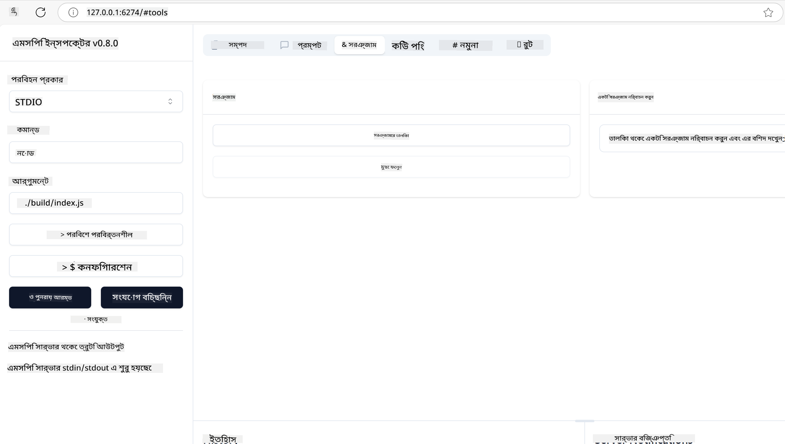

<!--
CO_OP_TRANSLATOR_METADATA:
{
  "original_hash": "5331ffd328a54b90f76706c52b673e27",
  "translation_date": "2025-05-17T08:27:22+00:00",
  "source_file": "03-GettingStarted/01-first-server/README.md",
  "language_code": "bn"
}
-->
# এমসিপি দিয়ে শুরু করা

মডেল কনটেক্সট প্রোটোকল (এমসিপি) এর সাথে আপনার প্রথম পদক্ষেপে আপনাকে স্বাগতম! আপনি যদি এমসিপিতে নতুন হন বা আপনার বোঝাপড়া গভীর করতে চান, এই গাইডটি আপনাকে প্রয়োজনীয় সেটআপ এবং উন্নয়ন প্রক্রিয়ার মাধ্যমে গাইড করবে। আপনি আবিষ্কার করবেন কিভাবে এমসিপি এআই মডেল এবং অ্যাপ্লিকেশনের মধ্যে নির্বিঘ্ন সংহতকরণ সক্ষম করে এবং এমসিপি-চালিত সমাধানগুলি তৈরি এবং পরীক্ষা করার জন্য আপনার পরিবেশটি দ্রুত প্রস্তুত করতে শিখবেন।

> সংক্ষেপে; আপনি যদি এআই অ্যাপ তৈরি করেন, আপনি জানেন যে আপনি আপনার এলএলএম (বৃহৎ ভাষা মডেল) এ টুল এবং অন্যান্য সম্পদ যোগ করতে পারেন, এলএলএমকে আরও জ্ঞানী করতে। তবে যদি আপনি সেই টুল এবং সম্পদ একটি সার্ভারে রাখেন, তাহলে অ্যাপ এবং সার্ভার ক্ষমতাগুলি যে কোনও ক্লায়েন্ট এলএলএম সহ/বিহীন ব্যবহার করতে পারে।

## ওভারভিউ

এই পাঠটি এমসিপি পরিবেশ সেটআপ এবং আপনার প্রথম এমসিপি অ্যাপ্লিকেশনগুলি তৈরির উপর বাস্তবিক নির্দেশনা প্রদান করে। আপনি প্রয়োজনীয় টুল এবং ফ্রেমওয়ার্ক সেটআপ করতে, মৌলিক এমসিপি সার্ভার তৈরি করতে, হোস্ট অ্যাপ্লিকেশন তৈরি করতে এবং আপনার বাস্তবায়ন পরীক্ষা করতে শিখবেন।

মডেল কনটেক্সট প্রোটোকল (এমসিপি) একটি ওপেন প্রোটোকল যা অ্যাপ্লিকেশনগুলি এলএলএমগুলিকে কনটেক্সট কীভাবে প্রদান করে তা মানক করে। এমসিপি সম্পর্কে চিন্তা করুন একটি ইউএসবি-সি পোর্টের মতো এআই অ্যাপ্লিকেশনের জন্য - এটি এআই মডেলগুলিকে বিভিন্ন ডেটা উত্স এবং টুলের সাথে সংযোগ করার জন্য একটি মানক উপায় প্রদান করে।

## শেখার উদ্দেশ্য

এই পাঠের শেষে, আপনি সক্ষম হবেন:

- C#, Java, Python, TypeScript, এবং JavaScript এ এমসিপি জন্য উন্নয়ন পরিবেশ সেটআপ করতে
- কাস্টম বৈশিষ্ট্য (সম্পদ, প্রম্পট এবং টুল) সহ মৌলিক এমসিপি সার্ভার তৈরি এবং স্থাপন করতে
- এমসিপি সার্ভারের সাথে সংযোগকারী হোস্ট অ্যাপ্লিকেশন তৈরি করতে
- এমসিপি বাস্তবায়ন পরীক্ষা এবং ডিবাগ করতে

## আপনার এমসিপি পরিবেশ সেটআপ করা

এমসিপি নিয়ে কাজ শুরু করার আগে, আপনার উন্নয়ন পরিবেশ প্রস্তুত করা এবং মৌলিক কার্যপ্রবাহ বুঝা গুরুত্বপূর্ণ। এই বিভাগটি আপনাকে একটি নির্বিঘ্ন শুরু নিশ্চিত করতে প্রাথমিক সেটআপ ধাপগুলির মাধ্যমে গাইড করবে।

### পূর্বশর্ত

এমসিপি উন্নয়নে প্রবেশ করার আগে নিশ্চিত করুন আপনার কাছে রয়েছে:

- **উন্নয়ন পরিবেশ**: আপনার পছন্দের ভাষার জন্য (C#, Java, Python, TypeScript, বা JavaScript)
- **আইডিই/এডিটর**: ভিজ্যুয়াল স্টুডিও, ভিজ্যুয়াল স্টুডিও কোড, ইন্টেলিজে, ইক্লিপ্স, পাইচার্ম, বা কোনো আধুনিক কোড এডিটর
- **প্যাকেজ ম্যানেজার**: NuGet, Maven/Gradle, pip, বা npm/yarn
- **এপিআই কী**: আপনার হোস্ট অ্যাপ্লিকেশনগুলিতে ব্যবহার করার জন্য পরিকল্পিত কোনো এআই পরিষেবার জন্য

## মৌলিক এমসিপি সার্ভার কাঠামো

একটি এমসিপি সার্ভার সাধারণত অন্তর্ভুক্ত করে:

- **সার্ভার কনফিগারেশন**: পোর্ট, প্রমাণীকরণ এবং অন্যান্য সেটিংস সেটআপ করা
- **সম্পদ**: এলএলএমগুলির জন্য উপলব্ধ ডেটা এবং প্রেক্ষাপট
- **টুল**: মডেলগুলি যা আহ্বান করতে পারে এমন কার্যকারিতা
- **প্রম্পট**: টেক্সট তৈরি বা গঠন করার জন্য টেম্পলেট

এখানে TypeScript এ একটি সরল উদাহরণ দেওয়া হল:

```typescript
import { Server, Tool, Resource } from "@modelcontextprotocol/typescript-server-sdk";

// Create a new MCP server
const server = new Server({
  port: 3000,
  name: "Example MCP Server",
  version: "1.0.0"
});

// Register a tool
server.registerTool({
  name: "calculator",
  description: "Performs basic calculations",
  parameters: {
    expression: {
      type: "string",
      description: "The math expression to evaluate"
    }
  },
  handler: async (params) => {
    const result = eval(params.expression);
    return { result };
  }
});

// Start the server
server.start();
```

উপরের কোডে আমরা:

- এমসিপি টাইপস্ক্রিপ্ট এসডিকে থেকে প্রয়োজনীয় ক্লাসগুলি আমদানি করি।
- একটি নতুন এমসিপি সার্ভার ইনস্ট্যান্স তৈরি এবং কনফিগার করি।
- একটি কাস্টম টুল (`calculator`) একটি হ্যান্ডলার ফাংশন সহ নিবন্ধন করি।
- আসন্ন এমসিপি অনুরোধগুলির জন্য শোনার জন্য সার্ভার শুরু করি।

## পরীক্ষা এবং ডিবাগিং

আপনার এমসিপি সার্ভার পরীক্ষা শুরু করার আগে, উপলব্ধ টুল এবং ডিবাগিংয়ের জন্য সেরা অনুশীলনগুলি বুঝা গুরুত্বপূর্ণ। কার্যকরী পরীক্ষা নিশ্চিত করে আপনার সার্ভার প্রত্যাশিত আচরণ করে এবং আপনাকে দ্রুত সমস্যা সনাক্ত এবং সমাধান করতে সহায়তা করে। নিম্নলিখিত বিভাগটি আপনার এমসিপি বাস্তবায়ন যাচাই করার জন্য প্রস্তাবিত পদ্ধতিগুলি রূপরেখা দেয়।

এমসিপি আপনাকে আপনার সার্ভারগুলি পরীক্ষা এবং ডিবাগ করতে সহায়তা করার জন্য টুল সরবরাহ করে:

- **ইনস্পেক্টর টুল**, এই গ্রাফিকাল ইন্টারফেস আপনাকে আপনার সার্ভারে সংযোগ করতে এবং আপনার টুল, প্রম্পট এবং সম্পদ পরীক্ষা করতে দেয়।
- **কার্ল**, আপনি কার্ল বা অন্যান্য ক্লায়েন্টের মতো একটি কমান্ড লাইন টুল ব্যবহার করে আপনার সার্ভারে সংযোগ করতে পারেন যা HTTP কমান্ড তৈরি এবং চালাতে পারে।

### এমসিপি ইনস্পেক্টর ব্যবহার করা

[MCP Inspector](https://github.com/modelcontextprotocol/inspector) একটি ভিজ্যুয়াল টেস্টিং টুল যা আপনাকে সাহায্য করে:

1. **সার্ভার ক্ষমতা আবিষ্কার করুন**: উপলব্ধ সম্পদ, টুল, এবং প্রম্পটগুলি স্বয়ংক্রিয়ভাবে সনাক্ত করুন
2. **টুল এক্সিকিউশন পরীক্ষা করুন**: বিভিন্ন প্যারামিটার চেষ্টা করুন এবং রিয়েল-টাইমে প্রতিক্রিয়া দেখুন
3. **সার্ভার মেটাডেটা দেখুন**: সার্ভার তথ্য, স্কিমা এবং কনফিগারেশন পরীক্ষা করুন

```bash
# ex TypeScript, installing and running MCP Inspector
npx @modelcontextprotocol/inspector node build/index.js
```

যখন আপনি উপরের কমান্ডগুলি চালান, এমসিপি ইনস্পেক্টর আপনার ব্রাউজারে একটি স্থানীয় ওয়েব ইন্টারফেস চালু করবে। আপনি আপনার নিবন্ধিত এমসিপি সার্ভারগুলি, তাদের উপলব্ধ টুল, সম্পদ এবং প্রম্পটগুলি প্রদর্শন করা একটি ড্যাশবোর্ড দেখতে আশা করতে পারেন। ইন্টারফেসটি আপনাকে ইন্টারেক্টিভভাবে টুল এক্সিকিউশন পরীক্ষা করতে, সার্ভার মেটাডেটা পরিদর্শন করতে এবং রিয়েল-টাইম প্রতিক্রিয়া দেখতে দেয়, যা আপনার এমসিপি সার্ভার বাস্তবায়নগুলি যাচাই এবং ডিবাগ করা সহজ করে তোলে।

এটি দেখতে কেমন হতে পারে তার একটি স্ক্রিনশট এখানে দেওয়া হল:



## সাধারণ সেটআপ সমস্যা এবং সমাধান

| সমস্যা | সম্ভাব্য সমাধান |
|-------|-------------------|
| সংযোগ প্রত্যাখ্যান | চেক করুন সার্ভার চলছে এবং পোর্ট সঠিক |
| টুল এক্সিকিউশন ত্রুটি | প্যারামিটার যাচাইকরণ এবং ত্রুটি হ্যান্ডলিং পর্যালোচনা করুন |
| প্রমাণীকরণ ব্যর্থতা | এপিআই কী এবং অনুমতিগুলি যাচাই করুন |
| স্কিমা যাচাইকরণ ত্রুটি | নিশ্চিত করুন প্যারামিটারগুলি সংজ্ঞায়িত স্কিমার সাথে মেলে |
| সার্ভার শুরু হচ্ছে না | পোর্টের সংঘর্ষ বা অনুপস্থিত নির্ভরতাগুলি চেক করুন |
| CORS ত্রুটি | ক্রস-অরিজিন অনুরোধের জন্য সঠিক CORS হেডার কনফিগার করুন |
| প্রমাণীকরণ সমস্যা | টোকেনের বৈধতা এবং অনুমতিগুলি যাচাই করুন |

## স্থানীয় উন্নয়ন

স্থানীয় উন্নয়ন এবং পরীক্ষার জন্য, আপনি আপনার মেশিনে সরাসরি এমসিপি সার্ভার চালাতে পারেন:

1. **সার্ভার প্রক্রিয়া শুরু করুন**: আপনার এমসিপি সার্ভার অ্যাপ্লিকেশন চালান
2. **নেটওয়ার্কিং কনফিগার করুন**: নিশ্চিত করুন সার্ভারটি প্রত্যাশিত পোর্টে অ্যাক্সেসযোগ্য
3. **ক্লায়েন্ট সংযোগ করুন**: `http://localhost:3000` এর মতো স্থানীয় সংযোগ ইউআরএল ব্যবহার করুন

```bash
# Example: Running a TypeScript MCP server locally
npm run start
# Server running at http://localhost:3000
```

## আপনার প্রথম এমসিপি সার্ভার তৈরি করা

আমরা আগের পাঠে [কোর ধারণাগুলি](/01-CoreConcepts/README.md) কভার করেছি, এখন সেই জ্ঞানকে কাজে লাগানোর সময় এসেছে।

### একটি সার্ভার কি করতে পারে

কোড লেখা শুরু করার আগে, আসুন মনে করিয়ে দেই একটি সার্ভার কি করতে পারে:

একটি এমসিপি সার্ভার উদাহরণস্বরূপ:

- স্থানীয় ফাইল এবং ডাটাবেস অ্যাক্সেস করতে পারে
- দূরবর্তী এপিআইগুলির সাথে সংযোগ করতে পারে
- গণনা সম্পাদন করতে পারে
- অন্যান্য টুল এবং পরিষেবার সাথে সংহত করতে পারে
- মিথস্ক্রিয়ার জন্য একটি ব্যবহারকারী ইন্টারফেস প্রদান করতে পারে

দারুণ, এখন আমরা জানি এটি আমাদের জন্য কি করতে পারে, আসুন কোডিং শুরু করি।

## অনুশীলন: একটি সার্ভার তৈরি করা

একটি সার্ভার তৈরি করতে, আপনাকে নিম্নলিখিত পদক্ষেপগুলি অনুসরণ করতে হবে:

- এমসিপি এসডিকে ইনস্টল করুন।
- একটি প্রকল্প তৈরি করুন এবং প্রকল্প কাঠামো সেট আপ করুন।
- সার্ভার কোড লিখুন।
- সার্ভার পরীক্ষা করুন।

### -1- এসডিকে ইনস্টল করুন

এটি আপনার নির্বাচিত রUNTIME উপর নির্ভর করে একটু ভিন্ন হয়, তাই নীচের রUNTIMEগুলির একটি চয়ন করুন:

জেনারেটিভ এআই টেক্সট, ছবি এবং এমনকি কোড তৈরি করতে পারে।
আপনি অক্টোবর ২০২৩ পর্যন্ত ডেটাতে প্রশিক্ষিত।

**অস্বীকৃতি**:  
এই নথিটি AI অনুবাদ পরিষেবা [Co-op Translator](https://github.com/Azure/co-op-translator) ব্যবহার করে অনূদিত হয়েছে। আমরা যথাসম্ভব সঠিক অনুবাদ করার চেষ্টা করি, তবে দয়া করে মনে রাখবেন যে স্বয়ংক্রিয় অনুবাদে ত্রুটি বা অসংগতি থাকতে পারে। এর মূল ভাষায় থাকা নথিটিকে প্রামাণিক উৎস হিসেবে বিবেচনা করা উচিত। গুরুত্বপূর্ণ তথ্যের জন্য, পেশাদার মানব অনুবাদ সুপারিশ করা হয়। এই অনুবাদ ব্যবহারের ফলে সৃষ্ট কোনো ভুল বোঝাবুঝি বা ভুল ব্যাখ্যার জন্য আমরা দায়ী নই।