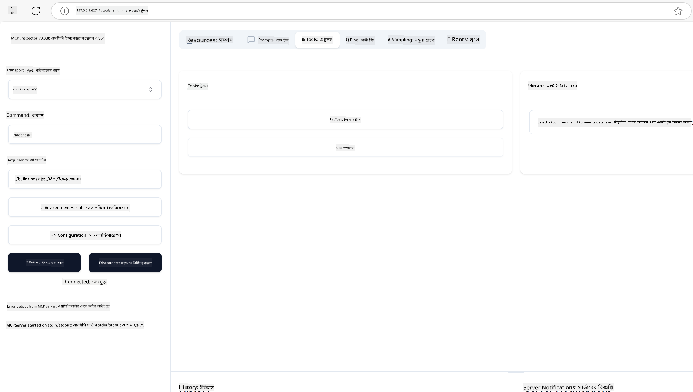
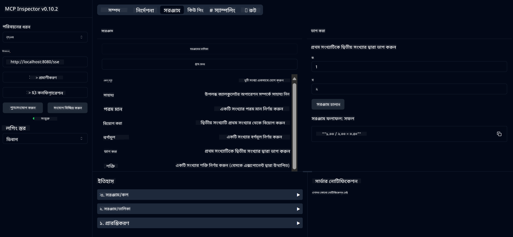

<!--
CO_OP_TRANSLATOR_METADATA:
{
  "original_hash": "ec11ee93f31fdadd94facd3e3d22f9e6",
  "translation_date": "2025-09-09T21:36:34+00:00",
  "source_file": "03-GettingStarted/01-first-server/README.md",
  "language_code": "bn"
}
-->
# MCP দিয়ে শুরু করা

Model Context Protocol (MCP) এর সাথে আপনার প্রথম পদক্ষেপে স্বাগতম! আপনি MCP-তে নতুন হোন বা আপনার জ্ঞান আরও গভীর করতে চান, এই গাইডটি আপনাকে প্রয়োজনীয় সেটআপ এবং ডেভেলপমেন্ট প্রক্রিয়ার মধ্য দিয়ে নিয়ে যাবে। আপনি শিখবেন কীভাবে MCP AI মডেল এবং অ্যাপ্লিকেশনের মধ্যে সহজ ইন্টিগ্রেশন সক্ষম করে এবং MCP-চালিত সমাধান তৈরি ও পরীক্ষা করার জন্য আপনার পরিবেশ দ্রুত প্রস্তুত করবেন।

> TLDR; যদি আপনি AI অ্যাপ তৈরি করেন, তাহলে আপনি জানেন যে আপনি LLM (large language model)-এ টুল এবং অন্যান্য রিসোর্স যোগ করতে পারেন, যাতে LLM আরও জ্ঞানী হয়। তবে যদি আপনি সেই টুল এবং রিসোর্সগুলো একটি সার্ভারে রাখেন, তাহলে অ্যাপ এবং সার্ভারের ক্ষমতা কোনো ক্লায়েন্ট LLM সহ বা ছাড়া ব্যবহার করতে পারে।

## ওভারভিউ

এই পাঠটি MCP পরিবেশ সেটআপ এবং আপনার প্রথম MCP অ্যাপ্লিকেশন তৈরি করার জন্য ব্যবহারিক নির্দেশনা প্রদান করে। আপনি শিখবেন কীভাবে প্রয়োজনীয় টুল এবং ফ্রেমওয়ার্ক সেটআপ করবেন, বেসিক MCP সার্ভার তৈরি করবেন, হোস্ট অ্যাপ্লিকেশন তৈরি করবেন এবং আপনার ইমপ্লিমেন্টেশন পরীক্ষা করবেন।

Model Context Protocol (MCP) একটি ওপেন প্রোটোকল যা অ্যাপ্লিকেশনগুলোকে LLM-এ কনটেক্সট প্রদান করার পদ্ধতি স্ট্যান্ডার্ডাইজ করে। MCP-কে AI অ্যাপ্লিকেশনের জন্য USB-C পোর্টের মতো ভাবুন - এটি AI মডেলগুলোকে বিভিন্ন ডেটা সোর্স এবং টুলের সাথে সংযুক্ত করার একটি স্ট্যান্ডার্ডাইজড উপায় প্রদান করে।

## শেখার লক্ষ্য

এই পাঠ শেষে, আপনি সক্ষম হবেন:

- C#, Java, Python, TypeScript, এবং Rust-এ MCP ডেভেলপমেন্ট পরিবেশ সেটআপ করতে
- কাস্টম ফিচার (রিসোর্স, প্রম্পট, এবং টুল) সহ বেসিক MCP সার্ভার তৈরি এবং ডিপ্লয় করতে
- MCP সার্ভারের সাথে সংযুক্ত হোস্ট অ্যাপ্লিকেশন তৈরি করতে
- MCP ইমপ্লিমেন্টেশন পরীক্ষা এবং ডিবাগ করতে

## MCP পরিবেশ সেটআপ করা

MCP নিয়ে কাজ শুরু করার আগে, আপনার ডেভেলপমেন্ট পরিবেশ প্রস্তুত করা এবং মৌলিক ওয়ার্কফ্লো বুঝা গুরুত্বপূর্ণ। এই সেকশনটি আপনাকে MCP-এর সাথে একটি মসৃণ শুরু নিশ্চিত করার জন্য প্রাথমিক সেটআপ ধাপগুলোতে গাইড করবে।

### প্রাক-প্রয়োজনীয়তা

MCP ডেভেলপমেন্টে প্রবেশ করার আগে নিশ্চিত করুন যে আপনার কাছে রয়েছে:

- **ডেভেলপমেন্ট পরিবেশ**: আপনার পছন্দের ভাষার জন্য (C#, Java, Python, TypeScript, বা Rust)
- **IDE/এডিটর**: Visual Studio, Visual Studio Code, IntelliJ, Eclipse, PyCharm, বা যেকোনো আধুনিক কোড এডিটর
- **প্যাকেজ ম্যানেজার**: NuGet, Maven/Gradle, pip, npm/yarn, বা Cargo
- **API কী**: যেকোনো AI সার্ভিসের জন্য যা আপনি আপনার হোস্ট অ্যাপ্লিকেশনে ব্যবহার করতে চান

## বেসিক MCP সার্ভার স্ট্রাকচার

একটি MCP সার্ভার সাধারণত অন্তর্ভুক্ত করে:

- **সার্ভার কনফিগারেশন**: পোর্ট, অথেনটিকেশন, এবং অন্যান্য সেটিংস সেটআপ করা
- **রিসোর্স**: LLM-এ উপলব্ধ ডেটা এবং কনটেক্সট
- **টুল**: মডেলগুলো যে ফাংশনালিটি ইনভোক করতে পারে
- **প্রম্পট**: টেক্সট তৈরি বা স্ট্রাকচার করার টেমপ্লেট

TypeScript-এ একটি সরল উদাহরণ এখানে দেওয়া হলো:

```typescript
import { McpServer, ResourceTemplate } from "@modelcontextprotocol/sdk/server/mcp.js";
import { StdioServerTransport } from "@modelcontextprotocol/sdk/server/stdio.js";
import { z } from "zod";

// Create an MCP server
const server = new McpServer({
  name: "Demo",
  version: "1.0.0"
});

// Add an addition tool
server.tool("add",
  { a: z.number(), b: z.number() },
  async ({ a, b }) => ({
    content: [{ type: "text", text: String(a + b) }]
  })
);

// Add a dynamic greeting resource
server.resource(
  "file",
  // The 'list' parameter controls how the resource lists available files. Setting it to undefined disables listing for this resource.
  new ResourceTemplate("file://{path}", { list: undefined }),
  async (uri, { path }) => ({
    contents: [{
      uri: uri.href,
      text: `File, ${path}!`
    }]
  })
);

// Add a file resource that reads the file contents
server.resource(
  "file",
  new ResourceTemplate("file://{path}", { list: undefined }),
  async (uri, { path }) => {
    let text;
    try {
      text = await fs.readFile(path, "utf8");
    } catch (err) {
      text = `Error reading file: ${err.message}`;
    }
    return {
      contents: [{
        uri: uri.href,
        text
      }]
    };
  }
);

server.prompt(
  "review-code",
  { code: z.string() },
  ({ code }) => ({
    messages: [{
      role: "user",
      content: {
        type: "text",
        text: `Please review this code:\n\n${code}`
      }
    }]
  })
);

// Start receiving messages on stdin and sending messages on stdout
const transport = new StdioServerTransport();
await server.connect(transport);
```

উপরের কোডে আমরা:

- MCP TypeScript SDK থেকে প্রয়োজনীয় ক্লাসগুলো ইমপোর্ট করেছি।
- একটি নতুন MCP সার্ভার ইনস্ট্যান্স তৈরি এবং কনফিগার করেছি।
- একটি কাস্টম টুল (`calculator`) একটি হ্যান্ডলার ফাংশন সহ রেজিস্টার করেছি।
- ইনকামিং MCP রিকোয়েস্টের জন্য সার্ভার শুরু করেছি।

## পরীক্ষা এবং ডিবাগিং

আপনার MCP সার্ভার পরীক্ষা শুরু করার আগে, উপলব্ধ টুল এবং ডিবাগিংয়ের সেরা পদ্ধতিগুলো বুঝা গুরুত্বপূর্ণ। কার্যকর পরীক্ষা নিশ্চিত করে যে আপনার সার্ভার প্রত্যাশিতভাবে কাজ করছে এবং আপনাকে দ্রুত সমস্যা সনাক্ত ও সমাধান করতে সাহায্য করে। নিম্নলিখিত সেকশনটি MCP ইমপ্লিমেন্টেশন যাচাই করার জন্য সুপারিশকৃত পদ্ধতিগুলো তুলে ধরে।

MCP সার্ভার পরীক্ষা এবং ডিবাগ করার জন্য টুল সরবরাহ করে:

- **Inspector tool**, এই গ্রাফিকাল ইন্টারফেস আপনাকে আপনার সার্ভারের সাথে সংযুক্ত হতে এবং টুল, প্রম্পট এবং রিসোর্স পরীক্ষা করতে সাহায্য করে।
- **curl**, আপনি কমান্ড লাইন টুল যেমন curl বা HTTP কমান্ড তৈরি এবং চালানোর সক্ষমতা সম্পন্ন অন্যান্য ক্লায়েন্ট ব্যবহার করে আপনার সার্ভারের সাথে সংযুক্ত হতে পারেন।

### MCP Inspector ব্যবহার করা

[MCP Inspector](https://github.com/modelcontextprotocol/inspector) একটি ভিজ্যুয়াল টেস্টিং টুল যা আপনাকে সাহায্য করে:

1. **সার্ভার ক্ষমতা আবিষ্কার করা**: উপলব্ধ রিসোর্স, টুল এবং প্রম্পট স্বয়ংক্রিয়ভাবে সনাক্ত করা
2. **টুল এক্সিকিউশন পরীক্ষা করা**: বিভিন্ন প্যারামিটার চেষ্টা করা এবং রিয়েল-টাইমে রেসপন্স দেখা
3. **সার্ভার মেটাডেটা দেখা**: সার্ভার তথ্য, স্কিমা এবং কনফিগারেশন পরীক্ষা করা

```bash
# ex TypeScript, installing and running MCP Inspector
npx @modelcontextprotocol/inspector node build/index.js
```

উপরের কমান্ডগুলো চালানোর সময় MCP Inspector আপনার ব্রাউজারে একটি লোকাল ওয়েব ইন্টারফেস চালু করবে। আপনি একটি ড্যাশবোর্ড দেখতে পাবেন যেখানে আপনার রেজিস্টার করা MCP সার্ভার, তাদের উপলব্ধ টুল, রিসোর্স এবং প্রম্পট প্রদর্শিত হবে। ইন্টারফেসটি আপনাকে ইন্টারঅ্যাকটিভভাবে টুল এক্সিকিউশন পরীক্ষা করতে, সার্ভার মেটাডেটা পরিদর্শন করতে এবং রিয়েল-টাইম রেসপন্স দেখতে সাহায্য করে, যা MCP সার্ভার ইমপ্লিমেন্টেশন যাচাই এবং ডিবাগ করা সহজ করে তোলে।

এটি দেখতে কেমন হতে পারে তার একটি স্ক্রিনশট এখানে দেওয়া হলো:



## সাধারণ সেটআপ সমস্যা এবং সমাধান

| সমস্যা | সম্ভাব্য সমাধান |
|-------|-------------------|
| কানেকশন রিফিউজড | নিশ্চিত করুন যে সার্ভার চলছে এবং পোর্ট সঠিক |
| টুল এক্সিকিউশন ত্রুটি | প্যারামিটার ভ্যালিডেশন এবং ত্রুটি হ্যান্ডলিং পর্যালোচনা করুন |
| অথেনটিকেশন ব্যর্থতা | API কী এবং অনুমতি যাচাই করুন |
| স্কিমা ভ্যালিডেশন ত্রুটি | নিশ্চিত করুন যে প্যারামিটারগুলো সংজ্ঞায়িত স্কিমার সাথে মিলে |
| সার্ভার শুরু হচ্ছে না | পোর্ট কনফ্লিক্ট বা মিসিং ডিপেনডেন্সি পরীক্ষা করুন |
| CORS ত্রুটি | ক্রস-অরিজিন রিকোয়েস্টের জন্য সঠিক CORS হেডার কনফিগার করুন |
| অথেনটিকেশন সমস্যা | টোকেনের বৈধতা এবং অনুমতি যাচাই করুন |

## লোকাল ডেভেলপমেন্ট

লোকাল ডেভেলপমেন্ট এবং পরীক্ষার জন্য, আপনি MCP সার্ভারগুলো সরাসরি আপনার মেশিনে চালাতে পারেন:

1. **সার্ভার প্রসেস শুরু করুন**: আপনার MCP সার্ভার অ্যাপ্লিকেশন চালান
2. **নেটওয়ার্কিং কনফিগার করুন**: নিশ্চিত করুন যে সার্ভার প্রত্যাশিত পোর্টে অ্যাক্সেসযোগ্য
3. **ক্লায়েন্ট সংযুক্ত করুন**: লোকাল কানেকশন URL ব্যবহার করুন যেমন `http://localhost:3000`

```bash
# Example: Running a TypeScript MCP server locally
npm run start
# Server running at http://localhost:3000
```

## আপনার প্রথম MCP সার্ভার তৈরি করা

আমরা আগের পাঠে [Core concepts](/01-CoreConcepts/README.md) কভার করেছি, এখন সেই জ্ঞান কাজে লাগানোর সময়।

### একটি সার্ভার কী করতে পারে

কোড লেখার আগে, চলুন মনে করিয়ে নেই একটি সার্ভার কী করতে পারে:

একটি MCP সার্ভার উদাহরণস্বরূপ:

- লোকাল ফাইল এবং ডেটাবেস অ্যাক্সেস করতে পারে
- রিমোট API-তে সংযুক্ত হতে পারে
- গণনা করতে পারে
- অন্যান্য টুল এবং সার্ভিসের সাথে ইন্টিগ্রেট করতে পারে
- ইন্টারঅ্যাকশন জন্য একটি ইউজার ইন্টারফেস প্রদান করতে পারে

দারুণ, এখন আমরা জানি এটি কী করতে পারে, চলুন কোড লেখা শুরু করি।

## অনুশীলন: একটি সার্ভার তৈরি করা

একটি সার্ভার তৈরি করতে, আপনাকে নিম্নলিখিত ধাপগুলো অনুসরণ করতে হবে:

- MCP SDK ইনস্টল করুন।
- একটি প্রজেক্ট তৈরি করুন এবং প্রজেক্ট স্ট্রাকচার সেটআপ করুন।
- সার্ভার কোড লিখুন।
- সার্ভার পরীক্ষা করুন।

### -1- প্রজেক্ট তৈরি করা

#### TypeScript

```sh
# Create project directory and initialize npm project
mkdir calculator-server
cd calculator-server
npm init -y
```

#### Python

```sh
# Create project dir
mkdir calculator-server
cd calculator-server
# Open the folder in Visual Studio Code - Skip this if you are using a different IDE
code .
```

#### .NET

```sh
dotnet new console -n McpCalculatorServer
cd McpCalculatorServer
```

#### Java

Java-এর জন্য একটি Spring Boot প্রজেক্ট তৈরি করুন:

```bash
curl https://start.spring.io/starter.zip \
  -d dependencies=web \
  -d javaVersion=21 \
  -d type=maven-project \
  -d groupId=com.example \
  -d artifactId=calculator-server \
  -d name=McpServer \
  -d packageName=com.microsoft.mcp.sample.server \
  -o calculator-server.zip
```

জিপ ফাইলটি এক্সট্রাক্ট করুন:

```bash
unzip calculator-server.zip -d calculator-server
cd calculator-server
# optional remove the unused test
rm -rf src/test/java
```

আপনার *pom.xml* ফাইলে নিম্নলিখিত সম্পূর্ণ কনফিগারেশন যোগ করুন:

```xml
<?xml version="1.0" encoding="UTF-8"?>
<project xmlns="http://maven.apache.org/POM/4.0.0"
    xmlns:xsi="http://www.w3.org/2001/XMLSchema-instance"
    xsi:schemaLocation="http://maven.apache.org/POM/4.0.0 http://maven.apache.org/xsd/maven-4.0.0.xsd">
    <modelVersion>4.0.0</modelVersion>
    
    <!-- Spring Boot parent for dependency management -->
    <parent>
        <groupId>org.springframework.boot</groupId>
        <artifactId>spring-boot-starter-parent</artifactId>
        <version>3.5.0</version>
        <relativePath />
    </parent>

    <!-- Project coordinates -->
    <groupId>com.example</groupId>
    <artifactId>calculator-server</artifactId>
    <version>0.0.1-SNAPSHOT</version>
    <name>Calculator Server</name>
    <description>Basic calculator MCP service for beginners</description>

    <!-- Properties -->
    <properties>
        <java.version>21</java.version>
        <maven.compiler.source>21</maven.compiler.source>
        <maven.compiler.target>21</maven.compiler.target>
    </properties>

    <!-- Spring AI BOM for version management -->
    <dependencyManagement>
        <dependencies>
            <dependency>
                <groupId>org.springframework.ai</groupId>
                <artifactId>spring-ai-bom</artifactId>
                <version>1.0.0-SNAPSHOT</version>
                <type>pom</type>
                <scope>import</scope>
            </dependency>
        </dependencies>
    </dependencyManagement>

    <!-- Dependencies -->
    <dependencies>
        <dependency>
            <groupId>org.springframework.ai</groupId>
            <artifactId>spring-ai-starter-mcp-server-webflux</artifactId>
        </dependency>
        <dependency>
            <groupId>org.springframework.boot</groupId>
            <artifactId>spring-boot-starter-actuator</artifactId>
        </dependency>
        <dependency>
         <groupId>org.springframework.boot</groupId>
         <artifactId>spring-boot-starter-test</artifactId>
         <scope>test</scope>
      </dependency>
    </dependencies>

    <!-- Build configuration -->
    <build>
        <plugins>
            <plugin>
                <groupId>org.springframework.boot</groupId>
                <artifactId>spring-boot-maven-plugin</artifactId>
            </plugin>
            <plugin>
                <groupId>org.apache.maven.plugins</groupId>
                <artifactId>maven-compiler-plugin</artifactId>
                <configuration>
                    <release>21</release>
                </configuration>
            </plugin>
        </plugins>
    </build>

    <!-- Repositories for Spring AI snapshots -->
    <repositories>
        <repository>
            <id>spring-milestones</id>
            <name>Spring Milestones</name>
            <url>https://repo.spring.io/milestone</url>
            <snapshots>
                <enabled>false</enabled>
            </snapshots>
        </repository>
        <repository>
            <id>spring-snapshots</id>
            <name>Spring Snapshots</name>
            <url>https://repo.spring.io/snapshot</url>
            <releases>
                <enabled>false</enabled>
            </releases>
        </repository>
    </repositories>
</project>
```

#### Rust

```sh
mkdir calculator-server
cd calculator-server
cargo init
```

### -2- ডিপেনডেন্সি যোগ করা

এখন আপনার প্রজেক্ট তৈরি হয়েছে, চলুন পরবর্তী ধাপে ডিপেনডেন্সি যোগ করি:

#### TypeScript

```sh
# If not already installed, install TypeScript globally
npm install typescript -g

# Install the MCP SDK and Zod for schema validation
npm install @modelcontextprotocol/sdk zod
npm install -D @types/node typescript
```

#### Python

```sh
# Create a virtual env and install dependencies
python -m venv venv
venv\Scripts\activate
pip install "mcp[cli]"
```

#### Java

```bash
cd calculator-server
./mvnw clean install -DskipTests
```

#### Rust

```sh
cargo add rmcp --features server,transport-io
cargo add serde
cargo add tokio --features rt-multi-thread
```

### -3- প্রজেক্ট ফাইল তৈরি করা

#### TypeScript

*package.json* ফাইলটি খুলুন এবং সার্ভার তৈরি এবং চালানোর জন্য নিম্নলিখিত কনটেন্ট দিয়ে প্রতিস্থাপন করুন:

```json
{
  "name": "calculator-server",
  "version": "1.0.0",
  "main": "index.js",
  "type": "module",
  "scripts": {
    "start": "tsc && node ./build/index.js",
    "build": "tsc && node ./build/index.js"
  },
  "keywords": [],
  "author": "",
  "license": "ISC",
  "description": "A simple calculator server using Model Context Protocol",
  "dependencies": {
    "@modelcontextprotocol/sdk": "^1.16.0",
    "zod": "^3.25.76"
  },
  "devDependencies": {
    "@types/node": "^24.0.14",
    "typescript": "^5.8.3"
  }
}
```

*tsconfig.json* তৈরি করুন নিম্নলিখিত কনটেন্ট দিয়ে:

```json
{
  "compilerOptions": {
    "target": "ES2022",
    "module": "Node16",
    "moduleResolution": "Node16",
    "outDir": "./build",
    "rootDir": "./src",
    "strict": true,
    "esModuleInterop": true,
    "skipLibCheck": true,
    "forceConsistentCasingInFileNames": true
  },
  "include": ["src/**/*"],
  "exclude": ["node_modules"]
}
```

আপনার সোর্স কোডের জন্য একটি ডিরেক্টরি তৈরি করুন:

```sh
mkdir src
touch src/index.ts
```

#### Python

*server.py* নামে একটি ফাইল তৈরি করুন

```sh
touch server.py
```

#### .NET

প্রয়োজনীয় NuGet প্যাকেজ ইনস্টল করুন:

```sh
dotnet add package ModelContextProtocol --prerelease
dotnet add package Microsoft.Extensions.Hosting
```

#### Java

Java Spring Boot প্রজেক্টের জন্য প্রজেক্ট স্ট্রাকচার স্বয়ংক্রিয়ভাবে তৈরি হয়।

#### Rust

Rust-এর জন্য, একটি *src/main.rs* ফাইল ডিফল্টভাবে তৈরি হয় যখন আপনি `cargo init` চালান। ফাইলটি খুলুন এবং ডিফল্ট কোড মুছে ফেলুন।

### -4- সার্ভার কোড তৈরি করা

#### TypeScript

*index.ts* নামে একটি ফাইল তৈরি করুন এবং নিম্নলিখিত কোড যোগ করুন:

```typescript
import { McpServer, ResourceTemplate } from "@modelcontextprotocol/sdk/server/mcp.js";
import { StdioServerTransport } from "@modelcontextprotocol/sdk/server/stdio.js";
import { z } from "zod";
 
// Create an MCP server
const server = new McpServer({
  name: "Calculator MCP Server",
  version: "1.0.0"
});
```

এখন আপনার একটি সার্ভার আছে, তবে এটি খুব বেশি কিছু করে না, চলুন এটি ঠিক করি।

#### Python

```python
# server.py
from mcp.server.fastmcp import FastMCP

# Create an MCP server
mcp = FastMCP("Demo")
```

#### .NET

```csharp
using Microsoft.Extensions.DependencyInjection;
using Microsoft.Extensions.Hosting;
using Microsoft.Extensions.Logging;
using ModelContextProtocol.Server;
using System.ComponentModel;

var builder = Host.CreateApplicationBuilder(args);
builder.Logging.AddConsole(consoleLogOptions =>
{
    // Configure all logs to go to stderr
    consoleLogOptions.LogToStandardErrorThreshold = LogLevel.Trace;
});

builder.Services
    .AddMcpServer()
    .WithStdioServerTransport()
    .WithToolsFromAssembly();
await builder.Build().RunAsync();

// add features
```

#### Java

Java-এর জন্য মূল সার্ভার কম্পোনেন্ট তৈরি করুন। প্রথমে প্রধান অ্যাপ্লিকেশন ক্লাসটি পরিবর্তন করুন:

*src/main/java/com/microsoft/mcp/sample/server/McpServerApplication.java*:

```java
package com.microsoft.mcp.sample.server;

import org.springframework.ai.tool.ToolCallbackProvider;
import org.springframework.ai.tool.method.MethodToolCallbackProvider;
import org.springframework.boot.SpringApplication;
import org.springframework.boot.autoconfigure.SpringBootApplication;
import org.springframework.context.annotation.Bean;
import com.microsoft.mcp.sample.server.service.CalculatorService;

@SpringBootApplication
public class McpServerApplication {

    public static void main(String[] args) {
        SpringApplication.run(McpServerApplication.class, args);
    }
    
    @Bean
    public ToolCallbackProvider calculatorTools(CalculatorService calculator) {
        return MethodToolCallbackProvider.builder().toolObjects(calculator).build();
    }
}
```

ক্যালকুলেটর সার্ভিস তৈরি করুন *src/main/java/com/microsoft/mcp/sample/server/service/CalculatorService.java*:

```java
package com.microsoft.mcp.sample.server.service;

import org.springframework.ai.tool.annotation.Tool;
import org.springframework.stereotype.Service;

/**
 * Service for basic calculator operations.
 * This service provides simple calculator functionality through MCP.
 */
@Service
public class CalculatorService {

    /**
     * Add two numbers
     * @param a The first number
     * @param b The second number
     * @return The sum of the two numbers
     */
    @Tool(description = "Add two numbers together")
    public String add(double a, double b) {
        double result = a + b;
        return formatResult(a, "+", b, result);
    }

    /**
     * Subtract one number from another
     * @param a The number to subtract from
     * @param b The number to subtract
     * @return The result of the subtraction
     */
    @Tool(description = "Subtract the second number from the first number")
    public String subtract(double a, double b) {
        double result = a - b;
        return formatResult(a, "-", b, result);
    }

    /**
     * Multiply two numbers
     * @param a The first number
     * @param b The second number
     * @return The product of the two numbers
     */
    @Tool(description = "Multiply two numbers together")
    public String multiply(double a, double b) {
        double result = a * b;
        return formatResult(a, "*", b, result);
    }

    /**
     * Divide one number by another
     * @param a The numerator
     * @param b The denominator
     * @return The result of the division
     */
    @Tool(description = "Divide the first number by the second number")
    public String divide(double a, double b) {
        if (b == 0) {
            return "Error: Cannot divide by zero";
        }
        double result = a / b;
        return formatResult(a, "/", b, result);
    }

    /**
     * Calculate the power of a number
     * @param base The base number
     * @param exponent The exponent
     * @return The result of raising the base to the exponent
     */
    @Tool(description = "Calculate the power of a number (base raised to an exponent)")
    public String power(double base, double exponent) {
        double result = Math.pow(base, exponent);
        return formatResult(base, "^", exponent, result);
    }

    /**
     * Calculate the square root of a number
     * @param number The number to find the square root of
     * @return The square root of the number
     */
    @Tool(description = "Calculate the square root of a number")
    public String squareRoot(double number) {
        if (number < 0) {
            return "Error: Cannot calculate square root of a negative number";
        }
        double result = Math.sqrt(number);
        return String.format("√%.2f = %.2f", number, result);
    }

    /**
     * Calculate the modulus (remainder) of division
     * @param a The dividend
     * @param b The divisor
     * @return The remainder of the division
     */
    @Tool(description = "Calculate the remainder when one number is divided by another")
    public String modulus(double a, double b) {
        if (b == 0) {
            return "Error: Cannot divide by zero";
        }
        double result = a % b;
        return formatResult(a, "%", b, result);
    }

    /**
     * Calculate the absolute value of a number
     * @param number The number to find the absolute value of
     * @return The absolute value of the number
     */
    @Tool(description = "Calculate the absolute value of a number")
    public String absolute(double number) {
        double result = Math.abs(number);
        return String.format("|%.2f| = %.2f", number, result);
    }

    /**
     * Get help about available calculator operations
     * @return Information about available operations
     */
    @Tool(description = "Get help about available calculator operations")
    public String help() {
        return "Basic Calculator MCP Service\n\n" +
               "Available operations:\n" +
               "1. add(a, b) - Adds two numbers\n" +
               "2. subtract(a, b) - Subtracts the second number from the first\n" +
               "3. multiply(a, b) - Multiplies two numbers\n" +
               "4. divide(a, b) - Divides the first number by the second\n" +
               "5. power(base, exponent) - Raises a number to a power\n" +
               "6. squareRoot(number) - Calculates the square root\n" + 
               "7. modulus(a, b) - Calculates the remainder of division\n" +
               "8. absolute(number) - Calculates the absolute value\n\n" +
               "Example usage: add(5, 3) will return 5 + 3 = 8";
    }

    /**
     * Format the result of a calculation
     */
    private String formatResult(double a, String operator, double b, double result) {
        return String.format("%.2f %s %.2f = %.2f", a, operator, b, result);
    }
}
```

**প্রোডাকশন-রেডি সার্ভিসের জন্য ঐচ্ছিক কম্পোনেন্ট:**

স্টার্টআপ কনফিগারেশন তৈরি করুন *src/main/java/com/microsoft/mcp/sample/server/config/StartupConfig.java*:

```java
package com.microsoft.mcp.sample.server.config;

import org.springframework.boot.CommandLineRunner;
import org.springframework.context.annotation.Bean;
import org.springframework.context.annotation.Configuration;

@Configuration
public class StartupConfig {
    
    @Bean
    public CommandLineRunner startupInfo() {
        return args -> {
            System.out.println("\n" + "=".repeat(60));
            System.out.println("Calculator MCP Server is starting...");
            System.out.println("SSE endpoint: http://localhost:8080/sse");
            System.out.println("Health check: http://localhost:8080/actuator/health");
            System.out.println("=".repeat(60) + "\n");
        };
    }
}
```

হেলথ কন্ট্রোলার তৈরি করুন *src/main/java/com/microsoft/mcp/sample/server/controller/HealthController.java*:

```java
package com.microsoft.mcp.sample.server.controller;

import org.springframework.http.ResponseEntity;
import org.springframework.web.bind.annotation.GetMapping;
import org.springframework.web.bind.annotation.RestController;
import java.time.LocalDateTime;
import java.util.HashMap;
import java.util.Map;

@RestController
public class HealthController {
    
    @GetMapping("/health")
    public ResponseEntity<Map<String, Object>> healthCheck() {
        Map<String, Object> response = new HashMap<>();
        response.put("status", "UP");
        response.put("timestamp", LocalDateTime.now().toString());
        response.put("service", "Calculator MCP Server");
        return ResponseEntity.ok(response);
    }
}
```

এক্সসেপশন হ্যান্ডলার তৈরি করুন *src/main/java/com/microsoft/mcp/sample/server/exception/GlobalExceptionHandler.java*:

```java
package com.microsoft.mcp.sample.server.exception;

import org.springframework.http.HttpStatus;
import org.springframework.http.ResponseEntity;
import org.springframework.web.bind.annotation.ExceptionHandler;
import org.springframework.web.bind.annotation.RestControllerAdvice;

@RestControllerAdvice
public class GlobalExceptionHandler {

    @ExceptionHandler(IllegalArgumentException.class)
    public ResponseEntity<ErrorResponse> handleIllegalArgumentException(IllegalArgumentException ex) {
        ErrorResponse error = new ErrorResponse(
            "Invalid_Input", 
            "Invalid input parameter: " + ex.getMessage());
        return new ResponseEntity<>(error, HttpStatus.BAD_REQUEST);
    }

    public static class ErrorResponse {
        private String code;
        private String message;

        public ErrorResponse(String code, String message) {
            this.code = code;
            this.message = message;
        }

        // Getters
        public String getCode() { return code; }
        public String getMessage() { return message; }
    }
}
```

কাস্টম ব্যানার তৈরি করুন *src/main/resources/banner.txt*:

```text
_____      _            _       _             
 / ____|    | |          | |     | |            
| |     __ _| | ___ _   _| | __ _| |_ ___  _ __ 
| |    / _` | |/ __| | | | |/ _` | __/ _ \| '__|
| |___| (_| | | (__| |_| | | (_| | || (_) | |   
 \_____\__,_|_|\___|\__,_|_|\__,_|\__\___/|_|   
                                                
Calculator MCP Server v1.0
Spring Boot MCP Application
```

#### Rust

*src/main.rs* ফাইলের শীর্ষে নিম্নলিখিত কোড যোগ করুন। এটি MCP সার্ভারের জন্য প্রয়োজনীয় লাইব্রেরি এবং মডিউল ইমপোর্ট করে।

```rust
use rmcp::{
    handler::server::{router::tool::ToolRouter, tool::Parameters},
    model::{ServerCapabilities, ServerInfo},
    schemars, tool, tool_handler, tool_router,
    transport::stdio,
    ServerHandler, ServiceExt,
};
use std::error::Error;
```

ক্যালকুলেটর রিকোয়েস্ট উপস্থাপন করার জন্য একটি স্ট্রাক্ট তৈরি করুন।

```rust
#[derive(Debug, serde::Deserialize, schemars::JsonSchema)]
pub struct CalculatorRequest {
    pub a: f64,
    pub b: f64,
}
```

এরপর, ক্যালকুলেটর সার্ভার উপস্থাপন করার জন্য একটি স্ট্রাক্ট তৈরি করুন। এই স্ট্রাক্ট টুল রাউটার ধারণ করবে, যা টুল রেজিস্টার করতে ব্যবহৃত হয়।

```rust
#[derive(Debug, Clone)]
pub struct Calculator {
    tool_router: ToolRouter<Self>,
}
```

এখন, আমরা `Calculator` স্ট্রাক্ট ইমপ্লিমেন্ট করতে পারি একটি নতুন সার্ভার ইনস্ট্যান্স তৈরি করতে এবং সার্ভার হ্যান্ডলার ইমপ্লিমেন্ট করতে সার্ভার তথ্য প্রদান করার জন্য।

```rust
#[tool_router]
impl Calculator {
    pub fn new() -> Self {
        Self {
            tool_router: Self::tool_router(),
        }
    }
}

#[tool_handler]
impl ServerHandler for Calculator {
    fn get_info(&self) -> ServerInfo {
        ServerInfo {
            instructions: Some("A simple calculator tool".into()),
            capabilities: ServerCapabilities::builder().enable_tools().build(),
            ..Default::default()
        }
    }
}
```

শেষে, সার্ভার শুরু করার জন্য আমাদের প্রধান ফাংশন ইমপ্লিমেন্ট করতে হবে। এই ফাংশনটি `Calculator` স্ট্রাক্টের একটি ইনস্ট্যান্স তৈরি করবে এবং এটি স্ট্যান্ডার্ড ইনপুট/আউটপুটের মাধ্যমে সার্ভ করবে।

```rust
#[tokio::main]
async fn main() -> Result<(), Box<dyn Error>> {
    let service = Calculator::new().serve(stdio()).await?;
    service.waiting().await?;
    Ok(())
}
```

এখন সার্ভারটি নিজ সম্পর্কে মৌলিক তথ্য প্রদান করতে প্রস্তুত। পরবর্তী ধাপে আমরা একটি টুল যোগ করব যা যোগফল গণনা করে।

### -5- একটি টুল এবং একটি রিসোর্স যোগ করা

টুল এবং রিসোর্স যোগ করতে নিম্নলিখিত কোড যোগ করুন:

#### TypeScript

```typescript
server.tool(
  "add",
  { a: z.number(), b: z.number() },
  async ({ a, b }) => ({
    content: [{ type: "text", text: String(a + b) }]
  })
);

server.resource(
  "greeting",
  new ResourceTemplate("greeting://{name}", { list: undefined }),
  async (uri, { name }) => ({
    contents: [{
      uri: uri.href,
      text: `Hello, ${name}!`
    }]
  })
);
```

আপনার টুল প্যারামিটার `a` এবং `b` নেয় এবং একটি ফাংশন চালায় যা নিম্নলিখিত ফর্মে একটি রেসপন্স তৈরি করে:

```typescript
{
  contents: [{
    type: "text", content: "some content"
  }]
}
```

আপনার রিসোর্স একটি স্ট্রিং "greeting" এর মাধ্যমে অ্যাক্সেস করা হয় এবং প্যারামিটার `name` নেয় এবং টুলের মতো একটি রেসপন্স তৈরি করে:

```typescript
{
  uri: "<href>",
  text: "a text"
}
```

#### Python

```python
# Add an addition tool
@mcp.tool()
def add(a: int, b: int) -> int:
    """Add two numbers"""
    return a + b


# Add a dynamic greeting resource
@mcp.resource("greeting://{name}")
def get_greeting(name: str) -> str:
    """Get a personalized greeting"""
    return f"Hello, {name}!"
```

উপরের কোডে আমরা:

- একটি টুল `add` সংজ্ঞায়িত করেছি যা দুটি পূর্ণসংখ্যা প্যারামিটার `a` এবং `p` নেয়।
- একটি রিসোর্স তৈরি করেছি যার নাম `greeting` যা প্যারামিটার `name` নেয়।

#### .NET

আপনার Program.cs ফাইলে এটি যোগ করুন:

```csharp
[McpServerToolType]
public static class CalculatorTool
{
    [McpServerTool, Description("Adds two numbers")]
    public static string Add(int a, int b) => $"Sum {a + b}";
}
```

#### Java

টুলগুলো আগের ধাপে ইতিমধ্যে তৈরি করা হয়েছে।

#### Rust

`impl Calculator` ব্লকের ভিতরে একটি নতুন টুল যোগ করুন:

```rust
#[tool(description = "Adds a and b")]
async fn add(
    &self,
    Parameters(CalculatorRequest { a, b }): Parameters<CalculatorRequest>,
) -> String {
    (a + b).to_string()
}
```

### -6- চূড়ান্ত কোড

চলুন শেষ কোড যোগ করি যাতে সার্ভার শুরু করতে পারে:

#### TypeScript

```typescript
// Start receiving messages on stdin and sending messages on stdout
const transport = new StdioServerTransport();
await server.connect(transport);
```

এখানে সম্পূর্ণ কোড:

```typescript
// index.ts
import { McpServer, ResourceTemplate } from "@modelcontextprotocol/sdk/server/mcp.js";
import { StdioServerTransport } from "@modelcontextprotocol/sdk/server/stdio.js";
import { z } from "zod";

// Create an MCP server
const server = new McpServer({
  name: "Calculator MCP Server",
  version: "1.0.0"
});

// Add an addition tool
server.tool(
  "add",
  { a: z.number(), b: z.number() },
  async ({ a, b }) => ({
    content: [{ type: "text", text: String(a + b) }]
  })
);

// Add a dynamic greeting resource
server.resource(
  "greeting",
  new ResourceTemplate("greeting://{name}", { list: undefined }),
  async (uri, { name }) => ({
    contents: [{
      uri: uri.href,
      text: `Hello, ${name}!`
    }]
  })
);

// Start receiving messages on stdin and sending messages on stdout
const transport = new StdioServerTransport();
server.connect(transport);
```

#### Python

```python
# server.py
from mcp.server.fastmcp import FastMCP

# Create an MCP server
mcp = FastMCP("Demo")


# Add an addition tool
@mcp.tool()
def add(a: int, b: int) -> int:
    """Add two numbers"""
    return a + b


# Add a dynamic greeting resource
@mcp.resource("greeting://{name}")
def get_greeting(name: str) -> str:
    """Get a personalized greeting"""
    return f"Hello, {name}!"

# Main execution block - this is required to run the server
if __name__ == "__main__":
    mcp.run()
```

#### .NET

একটি Program.cs ফাইল তৈরি করুন নিম্নলিখিত কনটেন্ট দিয়ে:

```csharp
using Microsoft.Extensions.DependencyInjection;
using Microsoft.Extensions.Hosting;
using Microsoft.Extensions.Logging;
using ModelContextProtocol.Server;
using System.ComponentModel;

var builder = Host.CreateApplicationBuilder(args);
builder.Logging.AddConsole(consoleLogOptions =>
{
    // Configure all logs to go to stderr
    consoleLogOptions.LogToStandardErrorThreshold = LogLevel.Trace;
});

builder.Services
    .AddMcpServer()
    .WithStdioServerTransport()
    .WithToolsFromAssembly();
await builder.Build().RunAsync();

[McpServerToolType]
public static class CalculatorTool
{
    [McpServerTool, Description("Adds two numbers")]
    public static string Add(int a, int b) => $"Sum {a + b}";
}
```

#### Java

আপনার সম্পূর্ণ প্রধান অ্যাপ্লিকেশন ক্লাসটি দেখতে এমন হবে:

```java
// McpServerApplication.java
package com.microsoft.mcp.sample.server;

import org.springframework.ai.tool.ToolCallbackProvider;
import org.springframework.ai.tool.method.MethodToolCallbackProvider;
import org.springframework.boot.SpringApplication;
import org.springframework.boot.autoconfigure.SpringBootApplication;
import org.springframework.context.annotation.Bean;
import com.microsoft.mcp.sample.server.service.CalculatorService;

@SpringBootApplication
public class McpServerApplication {

    public static void main(String[] args) {
        SpringApplication.run(McpServerApplication.class, args);
    }
    
    @Bean
    public ToolCallbackProvider calculatorTools(CalculatorService calculator) {
        return MethodToolCallbackProvider.builder().toolObjects(calculator).build();
    }
}
```

#### Rust

Rust সার্ভারের চূড়ান্ত কোড দেখতে এমন হবে:

```rust
use rmcp::{
    ServerHandler, ServiceExt,
    handler::server::{router::tool::ToolRouter, tool::Parameters},
    model::{ServerCapabilities, ServerInfo},
    schemars, tool, tool_handler, tool_router,
    transport::stdio,
};
use std::error::Error;

#[derive(Debug, serde::Deserialize, schemars::JsonSchema)]
pub struct CalculatorRequest {
    pub a: f64,
    pub b: f64,
}

#[derive(Debug, Clone)]
pub struct Calculator {
    tool_router: ToolRouter<Self>,
}

#[tool_router]
impl Calculator {
    pub fn new() -> Self {
        Self {
            tool_router: Self::tool_router(),
        }
    }
    
    #[tool(description = "Adds a and b")]
    async fn add(
        &self,
        Parameters(CalculatorRequest { a, b }): Parameters<CalculatorRequest>,
    ) -> String {
        (a + b).to_string()
    }
}

#[tool_handler]
impl ServerHandler for Calculator {
    fn get_info(&self) -> ServerInfo {
        ServerInfo {
            instructions: Some("A simple calculator tool".into()),
            capabilities: ServerCapabilities::builder().enable_tools().build(),
            ..Default::default()
        }
    }
}

#[tokio::main]
async fn main() -> Result<(), Box<dyn Error>> {
    let service = Calculator::new().serve(stdio()).await?;
    service.waiting().await?;
    Ok(())
}
```

### -7- সার্ভার পরীক্ষা করা

নিম্নলিখিত কমান্ড দিয়ে সার্ভার শুরু করুন:

#### TypeScript

```sh
npm run build
```

#### Python

```sh
mcp run server.py
```

> MCP Inspector ব্যবহার করতে, `mcp dev server.py` ব্যবহার করুন যা স্বয়ংক্রিয়ভাবে Inspector চালু করে এবং প্রয়োজনীয় প্রক্সি সেশন টোকেন প্রদান করে। যদি `mcp run server.py` ব্যবহার করেন, তাহলে আপনাকে ম্যানুয়ালি Inspector চালু করতে হবে এবং কানেকশন কনফিগার করতে হবে।

#### .NET

নিশ্চিত করুন যে আপনি আপনার প্রজেক্ট ডিরেক্টরিতে আছেন:

```sh
cd McpCalculatorServer
dotnet run
```

#### Java

```bash
./mvnw clean install -DskipTests
java -jar target/calculator-server-0.0.1-SNAPSHOT.jar
```

#### Rust

সার্ভার ফরম্যাট এবং চালানোর জন্য নিম্নলিখিত কমান্ড চালান:

```sh
cargo fmt
cargo run
```

### -8- Inspector ব্যবহার করে চালানো

Inspector একটি দারুণ টুল যা আপনার সার্ভার চালু করতে পারে এবং আপনাকে এর সাথে ইন্টারঅ্যাক্ট করতে দেয় যাতে আপনি পরীক্ষা করতে পারেন এটি কাজ করছে কিনা। চলুন এটি চালু করি:

> [!NOTE]
> "command" ফিল্ডে এটি ভিন্ন দেখাতে পারে কারণ এটি আপনার নির্দিষ্ট রানটাইমের সাথে একটি সার্ভার চালানোর কমান্ড ধারণ করে।

#### TypeScript

```sh
npx @modelcontextprotocol/inspector node build/index.js
```

অথবা এটি আপনার *package.json* এ যোগ করুন: `"inspector": "npx @modelcontextprotocol/inspector node build/index.js"` এবং তারপর `npm run inspector` চালান।

Python একটি Node.js টুলকে র‍্যাপ করে যাকে inspector বলা হয়। এটি নিম্নলিখিতভাবে কল করা সম্ভব:

```sh
mcp dev server.py
```

তবে, এটি টুলের সব পদ্ধতি ইমপ্লিমেন্ট করে না, তাই আপনি নিচের মতো সরাসরি Node.js টুল চালানোর সুপারিশ করা হয়:

```sh
npx @modelcontextprotocol/inspector mcp run server.py
```




**আপনি এখন সার্ভারের সাথে সংযুক্ত**
**জাভা সার্ভার টেস্টিং সেকশন এখন সম্পন্ন হয়েছে**

পরবর্তী সেকশনটি সার্ভারের সাথে ইন্টারঅ্যাক্ট করার বিষয়ে।

আপনার নিম্নলিখিত ইউজার ইন্টারফেসটি দেখতে পাওয়া উচিত:


1. "Connect" বোতামটি নির্বাচন করে সার্ভারের সাথে সংযুক্ত হন।  
   একবার সংযুক্ত হলে, আপনি নিম্নলিখিত দেখতে পাবেন:

   

1. "Tools" এবং "listTools" নির্বাচন করুন। আপনি "Add" দেখতে পাবেন। "Add" নির্বাচন করুন এবং প্যারামিটার মানগুলো পূরণ করুন।

   আপনি নিম্নলিখিত রেসপন্স দেখতে পাবেন, অর্থাৎ "add" টুলের একটি ফলাফল:

   

অভিনন্দন, আপনি আপনার প্রথম সার্ভার তৈরি এবং চালাতে সক্ষম হয়েছেন!

#### Rust

MCP Inspector CLI ব্যবহার করে Rust সার্ভার চালানোর জন্য নিম্নলিখিত কমান্ডটি ব্যবহার করুন:

```sh
npx @modelcontextprotocol/inspector cargo run --cli --method tools/call --tool-name add --tool-arg a=1 b=2
```

### অফিসিয়াল SDKs

MCP বিভিন্ন ভাষার জন্য অফিসিয়াল SDKs প্রদান করে:

- [C# SDK](https://github.com/modelcontextprotocol/csharp-sdk) - Microsoft এর সাথে সহযোগিতায় রক্ষণাবেক্ষণ করা হয়
- [Java SDK](https://github.com/modelcontextprotocol/java-sdk) - Spring AI এর সাথে সহযোগিতায় রক্ষণাবেক্ষণ করা হয়
- [TypeScript SDK](https://github.com/modelcontextprotocol/typescript-sdk) - অফিসিয়াল TypeScript ইমপ্লিমেন্টেশন
- [Python SDK](https://github.com/modelcontextprotocol/python-sdk) - অফিসিয়াল Python ইমপ্লিমেন্টেশন
- [Kotlin SDK](https://github.com/modelcontextprotocol/kotlin-sdk) - অফিসিয়াল Kotlin ইমপ্লিমেন্টেশন
- [Swift SDK](https://github.com/modelcontextprotocol/swift-sdk) - Loopwork AI এর সাথে সহযোগিতায় রক্ষণাবেক্ষণ করা হয়
- [Rust SDK](https://github.com/modelcontextprotocol/rust-sdk) - অফিসিয়াল Rust ইমপ্লিমেন্টেশন

## মূল বিষয়গুলো

- MCP ডেভেলপমেন্ট এনভায়রনমেন্ট সেটআপ করা ভাষা-নির্দিষ্ট SDKs এর মাধ্যমে সহজ
- MCP সার্ভার তৈরি করতে টুল তৈরি এবং স্পষ্ট স্কিমাস সহ রেজিস্টার করা প্রয়োজন
- নির্ভরযোগ্য MCP ইমপ্লিমেন্টেশনের জন্য টেস্টিং এবং ডিবাগিং অত্যন্ত গুরুত্বপূর্ণ

## নমুনা

- [Java Calculator](../samples/java/calculator/README.md)
- [.Net Calculator](../../../../03-GettingStarted/samples/csharp)
- [JavaScript Calculator](../samples/javascript/README.md)
- [TypeScript Calculator](../samples/typescript/README.md)
- [Python Calculator](../../../../03-GettingStarted/samples/python)
- [Rust Calculator](../../../../03-GettingStarted/samples/rust)

## অ্যাসাইনমেন্ট

আপনার পছন্দের একটি টুল দিয়ে একটি সাধারণ MCP সার্ভার তৈরি করুন:

1. আপনার পছন্দের ভাষায় (.NET, Java, Python, TypeScript, বা Rust) টুলটি ইমপ্লিমেন্ট করুন।
2. ইনপুট প্যারামিটার এবং রিটার্ন ভ্যালু সংজ্ঞায়িত করুন।
3. সার্ভারটি সঠিকভাবে কাজ করছে কিনা তা নিশ্চিত করতে ইন্সপেক্টর টুল চালান।
4. বিভিন্ন ইনপুট দিয়ে ইমপ্লিমেন্টেশনটি টেস্ট করুন।

## সমাধান

[Solution](./solution/README.md)

## অতিরিক্ত রিসোর্স

- [Model Context Protocol ব্যবহার করে Azure এ এজেন্ট তৈরি করুন](https://learn.microsoft.com/azure/developer/ai/intro-agents-mcp)
- [Azure Container Apps দিয়ে রিমোট MCP (Node.js/TypeScript/JavaScript)](https://learn.microsoft.com/samples/azure-samples/mcp-container-ts/mcp-container-ts/)
- [.NET OpenAI MCP Agent](https://learn.microsoft.com/samples/azure-samples/openai-mcp-agent-dotnet/openai-mcp-agent-dotnet/)

## পরবর্তী ধাপ

পরবর্তী: [MCP ক্লায়েন্ট নিয়ে শুরু করুন](../02-client/README.md)

---

**অস্বীকৃতি**:  
এই নথিটি AI অনুবাদ পরিষেবা [Co-op Translator](https://github.com/Azure/co-op-translator) ব্যবহার করে অনুবাদ করা হয়েছে। আমরা যথাসম্ভব সঠিক অনুবাদ প্রদানের চেষ্টা করি, তবে অনুগ্রহ করে মনে রাখবেন যে স্বয়ংক্রিয় অনুবাদে ত্রুটি বা অসঙ্গতি থাকতে পারে। মূল ভাষায় থাকা নথিটিকে প্রামাণিক উৎস হিসেবে বিবেচনা করা উচিত। গুরুত্বপূর্ণ তথ্যের জন্য, পেশাদার মানব অনুবাদ সুপারিশ করা হয়। এই অনুবাদ ব্যবহারের ফলে কোনো ভুল বোঝাবুঝি বা ভুল ব্যাখ্যা হলে আমরা তার জন্য দায়ী থাকব না।