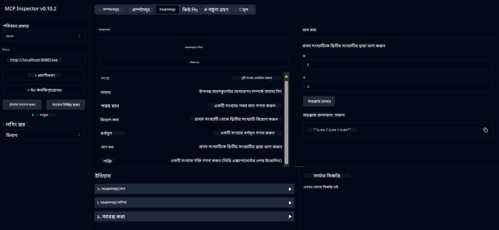

<!--
CO_OP_TRANSLATOR_METADATA:
{
  "original_hash": "ed9cab32cc67c12d8969b407aa47100a",
  "translation_date": "2025-07-13T17:53:16+00:00",
  "source_file": "03-GettingStarted/01-first-server/solution/java/README.md",
  "language_code": "bn"
}
-->
# Basic Calculator MCP Service

এই সার্ভিসটি Model Context Protocol (MCP) ব্যবহার করে Spring Boot এবং WebFlux ট্রান্সপোর্টের মাধ্যমে বেসিক ক্যালকুলেটর অপারেশন প্রদান করে। এটি MCP ইমপ্লিমেন্টেশন শেখার জন্য নতুনদের জন্য একটি সহজ উদাহরণ হিসেবে ডিজাইন করা হয়েছে।

অধিক তথ্যের জন্য দেখুন [MCP Server Boot Starter](https://docs.spring.io/spring-ai/reference/api/mcp/mcp-server-boot-starter-docs.html) রেফারেন্স ডকুমেন্টেশন।


## সার্ভিস ব্যবহারের পদ্ধতি

সার্ভিসটি MCP প্রোটোকলের মাধ্যমে নিম্নলিখিত API এন্ডপয়েন্টগুলো প্রদান করে:

- `add(a, b)`: দুইটি সংখ্যার যোগফল
- `subtract(a, b)`: প্রথম সংখ্যার থেকে দ্বিতীয় সংখ্যা বিয়োগ
- `multiply(a, b)`: দুইটি সংখ্যার গুণফল
- `divide(a, b)`: প্রথম সংখ্যাকে দ্বিতীয় সংখ্যার দ্বারা ভাগ (শূন্য চেক সহ)
- `power(base, exponent)`: একটি সংখ্যার ঘাত নির্ণয়
- `squareRoot(number)`: বর্গমূল নির্ণয় (ঋণাত্মক সংখ্যা চেক সহ)
- `modulus(a, b)`: ভাগশেষ নির্ণয়
- `absolute(number)`: একটি সংখ্যার পরম মান নির্ণয়

## নির্ভরশীলতা

প্রকল্পের জন্য নিম্নলিখিত প্রধান নির্ভরশীলতাগুলো প্রয়োজন:

```xml
<dependency>
    <groupId>org.springframework.ai</groupId>
    <artifactId>spring-ai-starter-mcp-server-webflux</artifactId>
</dependency>
```

## প্রকল্প তৈরি করা

Maven ব্যবহার করে প্রকল্পটি তৈরি করুন:
```bash
./mvnw clean install -DskipTests
```

## সার্ভার চালানো

### Java ব্যবহার করে

```bash
java -jar target/calculator-server-0.0.1-SNAPSHOT.jar
```

### MCP Inspector ব্যবহার করে

MCP Inspector একটি সহায়ক টুল যা MCP সার্ভিসের সাথে ইন্টারঅ্যাক্ট করার জন্য ব্যবহৃত হয়। এই ক্যালকুলেটর সার্ভিসের সাথে এটি ব্যবহার করতে:

1. **MCP Inspector ইনস্টল ও চালু করুন** একটি নতুন টার্মিনাল উইন্ডোতে:
   ```bash
   npx @modelcontextprotocol/inspector
   ```

2. **ওয়েব UI অ্যাক্সেস করুন** অ্যাপ দ্বারা প্রদর্শিত URL-এ ক্লিক করে (সাধারণত http://localhost:6274)

3. **কানেকশন কনফিগার করুন**:
   - ট্রান্সপোর্ট টাইপ "SSE" সেট করুন
   - URL সেট করুন আপনার চলমান সার্ভারের SSE এন্ডপয়েন্ট: `http://localhost:8080/sse`
   - "Connect" এ ক্লিক করুন

4. **টুলগুলো ব্যবহার করুন**:
   - "List Tools" এ ক্লিক করে উপলব্ধ ক্যালকুলেটর অপারেশনগুলো দেখুন
   - একটি টুল নির্বাচন করে "Run Tool" এ ক্লিক করে অপারেশন চালান



**অস্বীকৃতি**:  
এই নথিটি AI অনুবাদ সেবা [Co-op Translator](https://github.com/Azure/co-op-translator) ব্যবহার করে অনূদিত হয়েছে। আমরা যথাসাধ্য সঠিকতার চেষ্টা করি, তবে স্বয়ংক্রিয় অনুবাদে ত্রুটি বা অসঙ্গতি থাকতে পারে। মূল নথিটি তার নিজস্ব ভাষায়ই কর্তৃত্বপূর্ণ উৎস হিসেবে বিবেচিত হওয়া উচিত। গুরুত্বপূর্ণ তথ্যের জন্য পেশাদার মানব অনুবাদ গ্রহণ করার পরামর্শ দেওয়া হয়। এই অনুবাদের ব্যবহারে সৃষ্ট কোনো ভুল বোঝাবুঝি বা ভুল ব্যাখ্যার জন্য আমরা দায়ী নই।