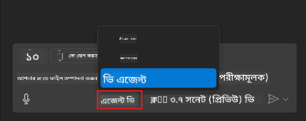
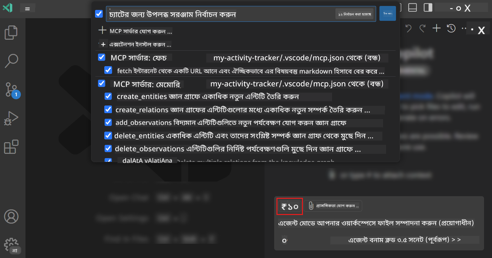
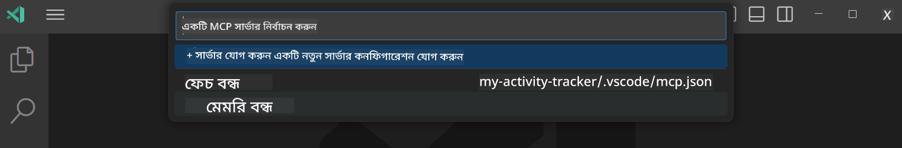
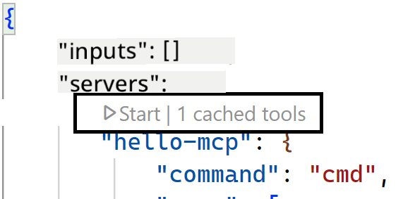
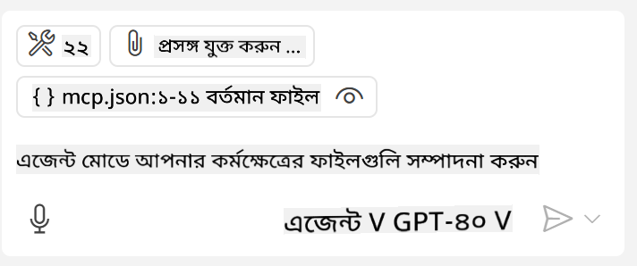

<!--
CO_OP_TRANSLATOR_METADATA:
{
  "original_hash": "d940b5e0af75e3a3a4d1c3179120d1d9",
  "translation_date": "2025-08-26T17:28:23+00:00",
  "source_file": "03-GettingStarted/04-vscode/README.md",
  "language_code": "bn"
}
-->
# গিটহাব কপাইলট এজেন্ট মোড থেকে একটি সার্ভার ব্যবহার করা

Visual Studio Code এবং GitHub Copilot একটি ক্লায়েন্ট হিসেবে কাজ করতে পারে এবং একটি MCP সার্ভার ব্যবহার করতে পারে। আপনি হয়তো ভাবছেন, কেন আমরা এটি করতে চাইব? কারণ, MCP সার্ভারের যেসব ফিচার রয়েছে, সেগুলো এখন আপনার IDE থেকে ব্যবহার করা সম্ভব। উদাহরণস্বরূপ, আপনি যদি গিটহাবের MCP সার্ভার যোগ করেন, তাহলে এটি আপনাকে টার্মিনালে নির্দিষ্ট কমান্ড টাইপ করার পরিবর্তে প্রম্পটের মাধ্যমে গিটহাব নিয়ন্ত্রণ করতে দেবে। অথবা এমন কিছু কল্পনা করুন যা আপনার ডেভেলপার অভিজ্ঞতাকে উন্নত করতে পারে এবং সবকিছুই প্রাকৃতিক ভাষার মাধ্যমে নিয়ন্ত্রিত। এখন আপনি নিশ্চয়ই এর সুবিধা বুঝতে পারছেন, তাই না?

## ওভারভিউ

এই পাঠে আলোচনা করা হয়েছে কীভাবে Visual Studio Code এবং GitHub Copilot-এর এজেন্ট মোড ব্যবহার করে MCP সার্ভার ব্যবহার করা যায়।

## শেখার উদ্দেশ্য

এই পাঠ শেষে, আপনি সক্ষম হবেন:

- Visual Studio Code ব্যবহার করে একটি MCP সার্ভার ব্যবহার করতে।
- GitHub Copilot-এর মাধ্যমে টুলস চালানোর মতো ক্ষমতাগুলো ব্যবহার করতে।
- Visual Studio Code কনফিগার করতে যাতে এটি আপনার MCP সার্ভার খুঁজে পায় এবং পরিচালনা করতে পারে।

## ব্যবহার

আপনি দুটি ভিন্ন উপায়ে আপনার MCP সার্ভার নিয়ন্ত্রণ করতে পারেন:

- ব্যবহারকারী ইন্টারফেস, যা আপনি এই অধ্যায়ের পরে দেখতে পাবেন।
- টার্মিনাল, যেখানে `code` এক্সিকিউটেবল ব্যবহার করে জিনিসগুলো নিয়ন্ত্রণ করা সম্ভব:

  আপনার ব্যবহারকারী প্রোফাইলে একটি MCP সার্ভার যোগ করতে, `--add-mcp` কমান্ড লাইন অপশন ব্যবহার করুন এবং JSON সার্ভার কনফিগারেশন প্রদান করুন এই ফর্মে: {\"name\":\"server-name\",\"command\":...}।

  ```
  code --add-mcp "{\"name\":\"my-server\",\"command\": \"uvx\",\"args\": [\"mcp-server-fetch\"]}"
  ```

### স্ক্রিনশট

  
  
  

পরবর্তী অংশে আমরা ভিজ্যুয়াল ইন্টারফেস কীভাবে ব্যবহার করা যায় তা নিয়ে আরও আলোচনা করব।

## পদ্ধতি

উচ্চ পর্যায়ে আমাদের পদ্ধতিটি হবে এভাবে:

- একটি ফাইল কনফিগার করে আমাদের MCP সার্ভার খুঁজে বের করা।
- উক্ত সার্ভার চালু/সংযোগ করা যাতে এটি তার ক্ষমতাগুলো তালিকাভুক্ত করতে পারে।
- GitHub Copilot Chat ইন্টারফেসের মাধ্যমে উক্ত ক্ষমতাগুলো ব্যবহার করা।

দারুণ, এখন যেহেতু আমরা প্রবাহটি বুঝতে পেরেছি, চলুন একটি অনুশীলনের মাধ্যমে Visual Studio Code-এ MCP সার্ভার ব্যবহার করার চেষ্টা করি।

## অনুশীলন: একটি সার্ভার ব্যবহার করা

এই অনুশীলনে, আমরা Visual Studio Code কনফিগার করব যাতে এটি আপনার MCP সার্ভার খুঁজে পায় এবং GitHub Copilot Chat ইন্টারফেস থেকে এটি ব্যবহার করা যায়।

### -0- প্রাক-ধাপ, MCP সার্ভার ডিসকভারি সক্রিয় করা

আপনাকে MCP সার্ভার ডিসকভারি সক্রিয় করতে হতে পারে।

1. Visual Studio Code-এ `File -> Preferences -> Settings`-এ যান।

1. "MCP" অনুসন্ধান করুন এবং `chat.mcp.discovery.enabled` সেটিংস.json ফাইলে সক্রিয় করুন।

### -1- কনফিগ ফাইল তৈরি করা

প্রথমে আপনার প্রজেক্ট রুটে একটি কনফিগ ফাইল তৈরি করুন। আপনাকে একটি MCP.json নামক ফাইল তৈরি করতে হবে এবং এটি .vscode নামক একটি ফোল্ডারে রাখতে হবে। এটি দেখতে এমন হবে:

```text
.vscode
|-- mcp.json
```

এরপর, চলুন দেখি কীভাবে একটি সার্ভার এন্ট্রি যোগ করা যায়।

### -2- একটি সার্ভার কনফিগার করা

*mcp.json* ফাইলে নিম্নলিখিত বিষয়বস্তু যোগ করুন:

```json
{
    "inputs": [],
    "servers": {
       "hello-mcp": {
           "command": "node",
           "args": [
               "build/index.js"
           ]
       }
    }
}
```

উপরের উদাহরণটি একটি Node.js-এ লেখা সার্ভার কীভাবে শুরু করতে হয় তা দেখায়। অন্যান্য রানটাইমের জন্য, সার্ভার শুরু করার সঠিক কমান্ড `command` এবং `args` ব্যবহার করে উল্লেখ করুন।

### -3- সার্ভার শুরু করা

এখন যেহেতু আপনি একটি এন্ট্রি যোগ করেছেন, চলুন সার্ভার শুরু করি:

1. *mcp.json* ফাইলে আপনার এন্ট্রি খুঁজুন এবং নিশ্চিত করুন যে আপনি "প্লে" আইকনটি দেখতে পাচ্ছেন:

    

1. "প্লে" আইকনে ক্লিক করুন। আপনি দেখবেন GitHub Copilot Chat-এর টুলস আইকনে উপলব্ধ টুলের সংখ্যা বৃদ্ধি পেয়েছে। উক্ত টুলস আইকনে ক্লিক করলে, আপনি নিবন্ধিত টুলগুলোর একটি তালিকা দেখতে পাবেন। আপনি চাইলে প্রতিটি টুল চেক/আনচেক করতে পারেন যাতে GitHub Copilot সেগুলো প্রসঙ্গ হিসেবে ব্যবহার করে:

  

1. একটি টুল চালানোর জন্য, এমন একটি প্রম্পট টাইপ করুন যা আপনার টুলগুলোর বর্ণনার সাথে মেলে, উদাহরণস্বরূপ, "add 22 to 1" এর মতো একটি প্রম্পট:

  

  আপনি ২৩ বলে একটি উত্তর দেখতে পাবেন।

## অ্যাসাইনমেন্ট

আপনার *mcp.json* ফাইলে একটি সার্ভার এন্ট্রি যোগ করার চেষ্টা করুন এবং নিশ্চিত করুন যে আপনি সার্ভারটি শুরু/বন্ধ করতে পারেন। নিশ্চিত করুন যে আপনি GitHub Copilot Chat ইন্টারফেসের মাধ্যমে আপনার সার্ভারের টুলগুলোর সাথে যোগাযোগ করতে পারেন।

## সমাধান

[সমাধান](./solution/README.md)

## মূল বিষয়বস্তু

এই অধ্যায় থেকে মূল বিষয়বস্তু হলো:

- Visual Studio Code একটি চমৎকার ক্লায়েন্ট যা আপনাকে একাধিক MCP সার্ভার এবং তাদের টুল ব্যবহার করতে দেয়।
- GitHub Copilot Chat ইন্টারফেস হলো সার্ভারগুলোর সাথে যোগাযোগ করার মাধ্যম।
- আপনি API কী-এর মতো ইনপুট ব্যবহারকারীর কাছ থেকে প্রম্পট করতে পারেন, যা *mcp.json* ফাইলে সার্ভার এন্ট্রি কনফিগার করার সময় MCP সার্ভারে পাঠানো যেতে পারে।

## নমুনা

- [জাভা ক্যালকুলেটর](../samples/java/calculator/README.md)  
- [.Net ক্যালকুলেটর](../../../../03-GettingStarted/samples/csharp)  
- [জাভাস্ক্রিপ্ট ক্যালকুলেটর](../samples/javascript/README.md)  
- [টাইপস্ক্রিপ্ট ক্যালকুলেটর](../samples/typescript/README.md)  
- [পাইথন ক্যালকুলেটর](../../../../03-GettingStarted/samples/python)  

## অতিরিক্ত রিসোর্স

- [Visual Studio ডকস](https://code.visualstudio.com/docs/copilot/chat/mcp-servers)

## পরবর্তী কী

- পরবর্তী: [একটি stdio সার্ভার তৈরি করা](../05-stdio-server/README.md)

---

**অস্বীকৃতি**:  
এই নথিটি AI অনুবাদ পরিষেবা [Co-op Translator](https://github.com/Azure/co-op-translator) ব্যবহার করে অনুবাদ করা হয়েছে। আমরা যথাসম্ভব সঠিক অনুবাদ প্রদানের চেষ্টা করি, তবে অনুগ্রহ করে মনে রাখবেন যে স্বয়ংক্রিয় অনুবাদে ত্রুটি বা অসঙ্গতি থাকতে পারে। মূল ভাষায় থাকা নথিটিকে প্রামাণিক উৎস হিসেবে বিবেচনা করা উচিত। গুরুত্বপূর্ণ তথ্যের জন্য, পেশাদার মানব অনুবাদ সুপারিশ করা হয়। এই অনুবাদ ব্যবহারের ফলে কোনো ভুল বোঝাবুঝি বা ভুল ব্যাখ্যা হলে আমরা দায়বদ্ধ থাকব না।