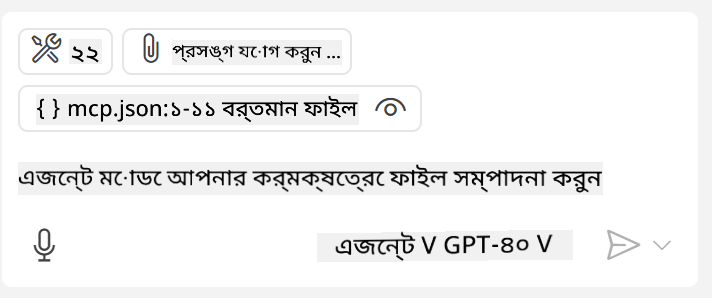
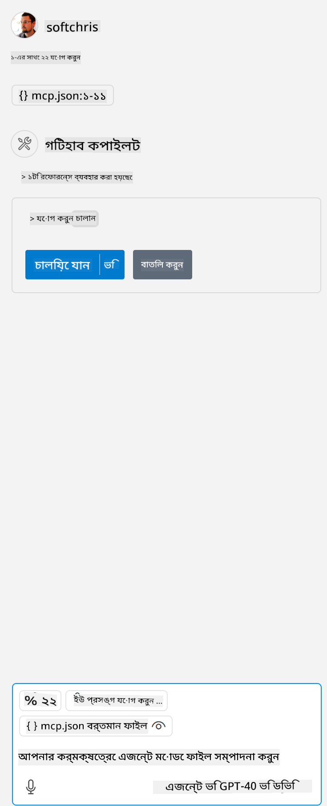

<!--
CO_OP_TRANSLATOR_METADATA:
{
  "original_hash": "c37fabfbc0dcbc9a4afb6d17e7d3be9f",
  "translation_date": "2025-05-17T11:04:17+00:00",
  "source_file": "03-GettingStarted/04-vscode/README.md",
  "language_code": "bn"
}
-->
চলুন পরবর্তী সেকশনে ভিজ্যুয়াল ইন্টারফেস কীভাবে ব্যবহার করা যায় সে সম্পর্কে আরও কথা বলি।

## পদ্ধতি

উচ্চ স্তরে আমাদের এইভাবে এগোতে হবে:

- আমাদের MCP সার্ভার খুঁজে বের করার জন্য একটি ফাইল কনফিগার করুন।
- সার্ভারটি চালু/সংযোগ করুন যাতে এটি তার সক্ষমতাগুলি তালিকাভুক্ত করে।
- GitHub Copilot এর চ্যাট ইন্টারফেসের মাধ্যমে এই সক্ষমতাগুলি ব্যবহার করুন।

চমৎকার, এখন আমরা ফ্লোটি বুঝেছি, আসুন একটি অনুশীলনের মাধ্যমে Visual Studio Code ব্যবহার করে একটি MCP সার্ভার ব্যবহার করার চেষ্টা করি।

## অনুশীলন: একটি সার্ভার ব্যবহার করা

এই অনুশীলনে, আমরা Visual Studio Code কনফিগার করব যাতে এটি আপনার MCP সার্ভার খুঁজে পায় এবং GitHub Copilot এর চ্যাট ইন্টারফেস থেকে ব্যবহার করা যায়।

### -0- প্রাক-ধাপ, MCP সার্ভার আবিষ্কার সক্ষম করুন

আপনাকে MCP সার্ভার আবিষ্কার সক্ষম করতে হতে পারে।

1. `File -> Preferences -> Settings` in Visual Studio Code.

1. Search for "MCP" and enable `chat.mcp.discovery.enabled` এ যান settings.json ফাইলে।

### -1- কনফিগ ফাইল তৈরি করুন

প্রকল্পের মূল ফোল্ডারে একটি কনফিগ ফাইল তৈরি করা শুরু করুন, আপনাকে MCP.json নামে একটি ফাইল তৈরি করতে হবে এবং এটি .vscode নামে একটি ফোল্ডারে রাখতে হবে। এটি এরকম দেখাবে:

```text
.vscode
|-- mcp.json
```

পরবর্তী, চলুন দেখি কীভাবে একটি সার্ভার এন্ট্রি যোগ করা যায়।

### -2- একটি সার্ভার কনফিগার করুন

*mcp.json* এ নিম্নলিখিত বিষয়বস্তু যোগ করুন:

```json
{
    "inputs": [],
    "servers": {
       "hello-mcp": {
           "command": "cmd",
           "args": [
               "/c", "node", "<absolute path>\\build\\index.js"
           ]
       }
    }
}
```

উপরের উদাহরণটি Node.js এ লেখা একটি সার্ভার কীভাবে শুরু করতে হয় তা দেখায়, অন্যান্য রানটাইমের জন্য সার্ভার শুরু করার সঠিক কমান্ড নির্দেশ করুন `command` and `args` ব্যবহার করে।

### -3- সার্ভার শুরু করুন

এখন আপনি একটি এন্ট্রি যোগ করেছেন, আসুন সার্ভারটি শুরু করি:

1. *mcp.json* এ আপনার এন্ট্রি খুঁজুন এবং নিশ্চিত করুন যে আপনি "play" আইকনটি খুঁজে পান:

    

1. "play" আইকনে ক্লিক করুন, আপনি GitHub Copilot এর চ্যাটে উপলব্ধ টুলের সংখ্যা বৃদ্ধি পেতে দেখবেন। আপনি যদি টুলস আইকনে ক্লিক করেন, আপনি নিবন্ধিত টুলগুলির একটি তালিকা দেখতে পাবেন। আপনি প্রতিটি টুল চেক/আনচেক করতে পারেন যদি আপনি চান GitHub Copilot সেগুলি প্রসঙ্গ হিসেবে ব্যবহার করুক:

  

1. একটি টুল চালানোর জন্য, এমন একটি প্রম্পট টাইপ করুন যা আপনি জানেন আপনার টুলগুলির একটি বর্ণনার সাথে মিলে যাবে, উদাহরণস্বরূপ এই ধরনের একটি প্রম্পট "22 যোগ করুন 1 এর সাথে":

  

  আপনি 23 বলছে এমন একটি প্রতিক্রিয়া দেখতে পাবেন।

## অ্যাসাইনমেন্ট

আপনার *mcp.json* ফাইলে একটি সার্ভার এন্ট্রি যোগ করার চেষ্টা করুন এবং নিশ্চিত করুন যে আপনি সার্ভার শুরু/বন্ধ করতে পারেন। নিশ্চিত করুন যে আপনি GitHub Copilot এর চ্যাট ইন্টারফেসের মাধ্যমে আপনার সার্ভারের টুলগুলির সাথে যোগাযোগ করতে পারেন।

## সমাধান

[সমাধান](./solution/README.md)

## মূল বিষয়গুলি

এই অধ্যায় থেকে মূল বিষয়গুলি হল:

- Visual Studio Code একটি দুর্দান্ত ক্লায়েন্ট যা আপনাকে একাধিক MCP সার্ভার এবং তাদের টুলগুলি ব্যবহার করতে দেয়।
- GitHub Copilot এর চ্যাট ইন্টারফেস হল কীভাবে আপনি সার্ভারগুলির সাথে যোগাযোগ করবেন।
- আপনি ব্যবহারকারীর কাছে এমন ইনপুটের জন্য প্রম্পট করতে পারেন যেমন API কী যা সার্ভার এন্ট্রি কনফিগার করার সময় *mcp.json* ফাইলে MCP সার্ভারে পাঠানো যেতে পারে।

## নমুনা

- [জাভা ক্যালকুলেটর](../samples/java/calculator/README.md)
- [.Net ক্যালকুলেটর](../../../../03-GettingStarted/samples/csharp)
- [জাভাস্ক্রিপ্ট ক্যালকুলেটর](../samples/javascript/README.md)
- [টাইপস্ক্রিপ্ট ক্যালকুলেটর](../samples/typescript/README.md)
- [পাইথন ক্যালকুলেটর](../../../../03-GettingStarted/samples/python) 

## অতিরিক্ত সম্পদ

- [Visual Studio ডকস](https://code.visualstudio.com/docs/copilot/chat/mcp-servers)

## পরবর্তী কি

- পরবর্তী: [SSE সার্ভার তৈরি করা](/03-GettingStarted/05-sse-server/README.md)

**অস্বীকৃতি**:  
এই নথিটি AI অনুবাদ পরিষেবা [Co-op Translator](https://github.com/Azure/co-op-translator) ব্যবহার করে অনুবাদ করা হয়েছে। আমরা যথাসম্ভব সঠিকতা বজায় রাখার চেষ্টা করি, তবে অনুগ্রহ করে সচেতন থাকুন যে স্বয়ংক্রিয় অনুবাদে ত্রুটি বা ভুল থাকতে পারে। নথির মূল ভাষায় থাকা আসল নথিটিকে প্রামাণিক উৎস হিসেবে বিবেচনা করা উচিত। গুরুত্বপূর্ণ তথ্যের জন্য, পেশাদার মানব অনুবাদ সুপারিশ করা হয়। এই অনুবাদ ব্যবহারের ফলে উদ্ভূত কোনো ভুল বোঝাবুঝি বা ভুল ব্যাখ্যার জন্য আমরা দায়ী নই।