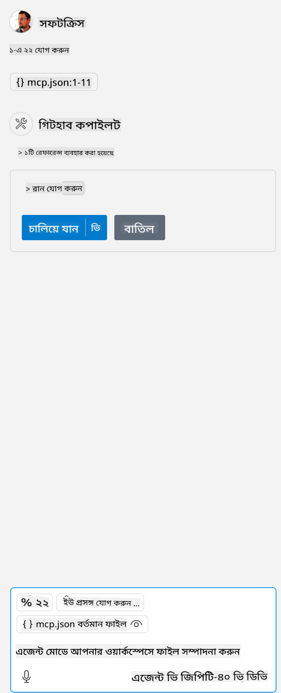

<!--
CO_OP_TRANSLATOR_METADATA:
{
  "original_hash": "5ef8f5821c1a04f7b1fc4f15098ecab8",
  "translation_date": "2025-07-13T19:40:57+00:00",
  "source_file": "03-GettingStarted/04-vscode/solution/README.md",
  "language_code": "bn"
}
-->
এটি এমন একটি কমান্ড চালানোর সমতুল্য: `node build/index.js`।

- আপনার সার্ভার ফাইল কোথায় অবস্থিত বা আপনার নির্বাচিত রানটাইম এবং সার্ভার অবস্থানের উপর নির্ভর করে সার্ভার চালু করার জন্য যা প্রয়োজন, সেই অনুযায়ী এই সার্ভার এন্ট্রি পরিবর্তন করুন।

## সার্ভারে ফিচারগুলি ব্যবহার করুন

- একবার আপনি *mcp.json* ফাইলটি *./vscode* ফোল্ডারে যোগ করার পর, `play` আইকনে ক্লিক করুন,

    লক্ষ্য করুন টুলিং আইকনটি পরিবর্তিত হচ্ছে এবং উপলব্ধ টুলের সংখ্যা বাড়ছে। টুলিং আইকনটি GitHub Copilot-এ চ্যাট ফিল্ডের ঠিক উপরে অবস্থিত।

## একটি টুল চালান

- আপনার চ্যাট উইন্ডোতে এমন একটি প্রম্পট টাইপ করুন যা আপনার টুলের বর্ণনার সাথে মেলে। উদাহরণস্বরূপ, `add` টুলটি চালানোর জন্য "add 3 to 20" টাইপ করুন।

    আপনি দেখতে পাবেন চ্যাট টেক্সট বক্সের উপরে একটি টুল প্রদর্শিত হচ্ছে যা আপনাকে টুলটি চালানোর জন্য নির্বাচন করতে বলছে, যেমন এই চিত্রে:

    

    টুলটি নির্বাচন করলে একটি সংখ্যাসূচক ফলাফল দেখাবে, যেমন "23", যদি আপনার প্রম্পট আগের মতো হয়।

**অস্বীকৃতি**:  
এই নথিটি AI অনুবাদ সেবা [Co-op Translator](https://github.com/Azure/co-op-translator) ব্যবহার করে অনূদিত হয়েছে। আমরা যথাসাধ্য সঠিকতার চেষ্টা করি, তবে স্বয়ংক্রিয় অনুবাদে ত্রুটি বা অসঙ্গতি থাকতে পারে। মূল নথিটি তার নিজস্ব ভাষায়ই কর্তৃত্বপূর্ণ উৎস হিসেবে বিবেচিত হওয়া উচিত। গুরুত্বপূর্ণ তথ্যের জন্য পেশাদার মানব অনুবাদ গ্রহণ করার পরামর্শ দেওয়া হয়। এই অনুবাদের ব্যবহারে সৃষ্ট কোনো ভুল বোঝাবুঝি বা ভুল ব্যাখ্যার জন্য আমরা দায়ী নই।