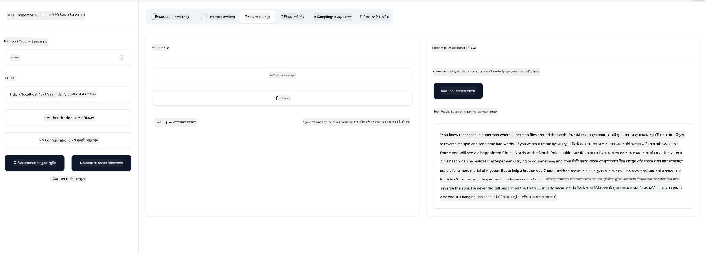

<!--
CO_OP_TRANSLATOR_METADATA:
{
  "original_hash": "d90ca3d326c48fab2ac0ebd3a9876f59",
  "translation_date": "2025-07-13T19:52:29+00:00",
  "source_file": "03-GettingStarted/05-sse-server/README.md",
  "language_code": "bn"
}
-->
এখন যেহেতু আমরা SSE সম্পর্কে একটু বেশি জানি, চলুন পরবর্তী ধাপে একটি SSE সার্ভার তৈরি করি।

## অনুশীলন: একটি SSE সার্ভার তৈরি করা

আমাদের সার্ভার তৈরি করতে হলে দুইটি বিষয় মাথায় রাখতে হবে:

- সংযোগ এবং মেসেজের জন্য এন্ডপয়েন্ট প্রকাশ করতে একটি ওয়েব সার্ভার ব্যবহার করতে হবে।
- stdio ব্যবহার করার সময় যেভাবে টুল, রিসোর্স এবং প্রম্পট ব্যবহার করতাম, সেভাবেই সার্ভার তৈরি করতে হবে।

### -1- একটি সার্ভার ইনস্ট্যান্স তৈরি করা

সার্ভার তৈরি করতে আমরা stdio এর মতো একই টাইপ ব্যবহার করব। তবে ট্রান্সপোর্ট হিসেবে SSE নির্বাচন করতে হবে।

পরবর্তী ধাপে প্রয়োজনীয় রুট যোগ করি।

### -2- রুট যোগ করা

এখন সংযোগ এবং ইনকামিং মেসেজ হ্যান্ডেল করার জন্য রুট যোগ করি:

পরবর্তী ধাপে সার্ভারের ক্ষমতা যোগ করি।

### -3- সার্ভারের ক্ষমতা যোগ করা

এখন যেহেতু আমরা SSE-সম্পর্কিত সবকিছু সংজ্ঞায়িত করেছি, চলুন সার্ভারের ক্ষমতা যেমন টুল, প্রম্পট এবং রিসোর্স যোগ করি।

আপনার সম্পূর্ণ কোড এরকম হওয়া উচিত:

দারুণ, আমাদের কাছে একটি SSE ব্যবহারকারী সার্ভার আছে, এখন এটিকে পরীক্ষা করি।

## অনুশীলন: Inspector দিয়ে একটি SSE সার্ভার ডিবাগ করা

Inspector একটি চমৎকার টুল যা আমরা আগের পাঠে দেখেছি [Creating your first server](/03-GettingStarted/01-first-server/README.md)। চলুন দেখি এখানে কি আমরা Inspector ব্যবহার করতে পারি:

### -1- Inspector চালানো

Inspector চালানোর জন্য প্রথমে একটি SSE সার্ভার চালু থাকতে হবে, তাই চলুন সেটা করি:

1. সার্ভার চালান

1. Inspector চালান

    > ![NOTE]
    > সার্ভার চালানো টার্মিনাল থেকে আলাদা একটি টার্মিনাল উইন্ডোতে এটি চালান। এছাড়াও নিচের কমান্ডটি আপনার সার্ভার যে URL-এ চলছে সেটার সাথে মানানসই করে পরিবর্তন করতে হবে।

    ```sh
    npx @modelcontextprotocol/inspector --cli http://localhost:8000/sse --method tools/list
    ```

Inspector চালানো সব রানটাইমে একই রকম। লক্ষ্য করুন, আমরা সার্ভারের পাথ বা সার্ভার শুরু করার কমান্ড না দিয়ে, সার্ভার যে URL-এ চলছে সেটি এবং `/sse` রুটটি উল্লেখ করছি।

### -2- টুলটি ব্যবহার করে দেখা

ড্রপলিস্ট থেকে SSE নির্বাচন করে সার্ভারের URL যেমন http:localhost:4321/sse দিন। এরপর "Connect" বাটনে ক্লিক করুন। আগের মতো টুল তালিকা থেকে একটি টুল নির্বাচন করুন এবং ইনপুট মান দিন। নিচের মত ফলাফল দেখতে পাবেন:



দারুণ, আপনি Inspector দিয়ে কাজ করতে পারছেন, এখন দেখি Visual Studio Code দিয়ে কিভাবে কাজ করা যায়।

## অ্যাসাইনমেন্ট

আপনার সার্ভার আরও ক্ষমতাসম্পন্ন করে তৈরি করার চেষ্টা করুন। উদাহরণস্বরূপ, [এই পেজটি](https://api.chucknorris.io/) দেখুন, যেখানে একটি API কল করার টুল যোগ করা যেতে পারে। সার্ভার কেমন হবে তা আপনি নির্ধারণ করবেন। মজা করুন :)

## সমাধান

[সমাধান](./solution/README.md) এখানে একটি সম্ভাব্য সমাধান এবং কাজ করা কোড দেওয়া আছে।

## মূল বিষয়সমূহ

এই অধ্যায় থেকে মূল বিষয়গুলো হলো:

- SSE stdio এর পর দ্বিতীয় সমর্থিত ট্রান্সপোর্ট।
- SSE সমর্থনের জন্য ওয়েব ফ্রেমওয়ার্ক ব্যবহার করে ইনকামিং সংযোগ এবং মেসেজ পরিচালনা করতে হয়।
- Inspector এবং Visual Studio Code উভয়ই SSE সার্ভার ব্যবহার করতে পারে, stdio সার্ভারের মতোই। তবে stdio এবং SSE এর মধ্যে কিছু পার্থক্য আছে। SSE এর জন্য সার্ভার আলাদাভাবে চালু করতে হয় এবং Inspector টুল চালাতে হয়। Inspector টুলে URL উল্লেখ করতে হয়।

## নমুনা 

- [Java Calculator](../samples/java/calculator/README.md)
- [.Net Calculator](../../../../03-GettingStarted/samples/csharp)
- [JavaScript Calculator](../samples/javascript/README.md)
- [TypeScript Calculator](../samples/typescript/README.md)
- [Python Calculator](../../../../03-GettingStarted/samples/python) 

## অতিরিক্ত সম্পদ

- [SSE](https://developer.mozilla.org/en-US/docs/Web/API/Server-sent_events)

## পরবর্তী ধাপ

- পরবর্তী: [HTTP Streaming with MCP (Streamable HTTP)](../06-http-streaming/README.md)

**অস্বীকৃতি**:  
এই নথিটি AI অনুবাদ সেবা [Co-op Translator](https://github.com/Azure/co-op-translator) ব্যবহার করে অনূদিত হয়েছে। আমরা যথাসাধ্য সঠিকতার চেষ্টা করি, তবে স্বয়ংক্রিয় অনুবাদে ত্রুটি বা অসঙ্গতি থাকতে পারে। মূল নথিটি তার নিজস্ব ভাষায়ই কর্তৃত্বপূর্ণ উৎস হিসেবে বিবেচিত হওয়া উচিত। গুরুত্বপূর্ণ তথ্যের জন্য পেশাদার মানব অনুবাদ গ্রহণ করার পরামর্শ দেওয়া হয়। এই অনুবাদের ব্যবহারে সৃষ্ট কোনো ভুল বোঝাবুঝি বা ভুল ব্যাখ্যার জন্য আমরা দায়ী নই।