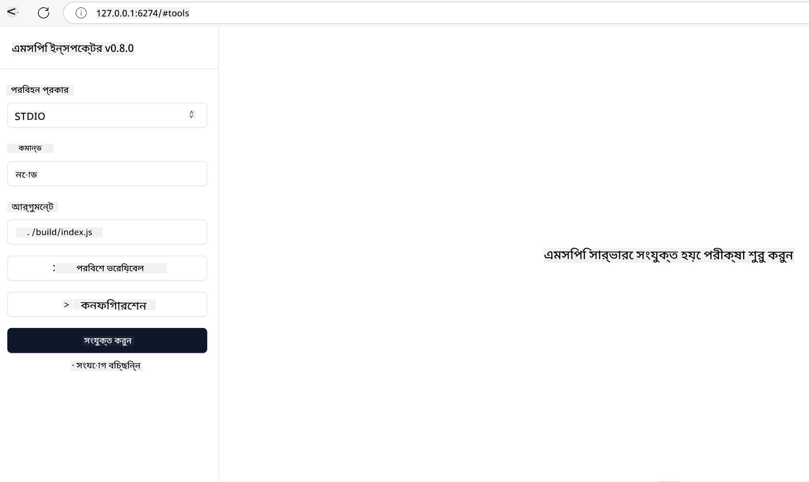

<!--
CO_OP_TRANSLATOR_METADATA:
{
  "original_hash": "717f34718a773f6cf52d8445e40a96bf",
  "translation_date": "2025-05-17T12:41:18+00:00",
  "source_file": "03-GettingStarted/07-testing/README.md",
  "language_code": "bn"
}
-->
## পরীক্ষা এবং ডিবাগিং

আপনার MCP সার্ভার পরীক্ষা শুরু করার আগে, ডিবাগিংয়ের জন্য উপলব্ধ সরঞ্জাম এবং সেরা পদ্ধতিগুলি বোঝা গুরুত্বপূর্ণ। কার্যকর পরীক্ষা নিশ্চিত করে যে আপনার সার্ভার প্রত্যাশিতভাবে আচরণ করছে এবং আপনাকে দ্রুত সমস্যাগুলি সনাক্ত ও সমাধান করতে সাহায্য করে। নিম্নলিখিত বিভাগটি আপনার MCP বাস্তবায়ন যাচাই করার জন্য সুপারিশকৃত পদ্ধতির রূপরেখা দেয়।

## সংক্ষিপ্ত বিবরণ

এই পাঠটি সঠিক পরীক্ষার পদ্ধতি নির্বাচন এবং সবচেয়ে কার্যকর পরীক্ষার সরঞ্জাম নিয়ে আলোচনা করে।

## শেখার লক্ষ্য

এই পাঠের শেষে, আপনি সক্ষম হবেন:

- পরীক্ষার বিভিন্ন পদ্ধতি বর্ণনা করতে।
- আপনার কোড কার্যকরভাবে পরীক্ষা করতে বিভিন্ন সরঞ্জাম ব্যবহার করতে।

## MCP সার্ভার পরীক্ষা

MCP আপনার সার্ভারগুলি পরীক্ষা এবং ডিবাগ করতে সহায়তা করার জন্য সরঞ্জাম সরবরাহ করে:

- **MCP Inspector**: একটি কমান্ড লাইন টুল যা CLI টুল এবং ভিজ্যুয়াল টুল হিসেবে চালানো যায়।
- **ম্যানুয়াল পরীক্ষা**: আপনি curl এর মতো একটি টুল ব্যবহার করে ওয়েব অনুরোধ চালাতে পারেন, তবে যে কোনও টুল যা HTTP চালাতে সক্ষম তা চলবে।
- **ইউনিট পরীক্ষা**: সার্ভার এবং ক্লায়েন্ট উভয়ের বৈশিষ্ট্যগুলি পরীক্ষা করার জন্য আপনার পছন্দের পরীক্ষার ফ্রেমওয়ার্ক ব্যবহার করা সম্ভব।

### MCP Inspector ব্যবহার করা

আমরা পূর্ববর্তী পাঠে এই টুলের ব্যবহার বর্ণনা করেছি তবে আসুন এটি উচ্চ স্তরে একটু আলোচনা করি। এটি একটি Node.js এ তৈরি টুল এবং আপনি `npx` এক্সিকিউটেবল কল করে এটি ব্যবহার করতে পারেন যা টুলটি নিজেই সাময়িকভাবে ডাউনলোড এবং ইনস্টল করবে এবং আপনার অনুরোধ চালানোর পর নিজেকে পরিষ্কার করবে।

[MCP Inspector](https://github.com/modelcontextprotocol/inspector) আপনাকে সাহায্য করে:

- **সার্ভার ক্ষমতা আবিষ্কার করুন**: উপলব্ধ সম্পদ, সরঞ্জাম এবং প্রম্পটগুলি স্বয়ংক্রিয়ভাবে সনাক্ত করুন
- **টুল কার্যকরতা পরীক্ষা করুন**: বিভিন্ন প্যারামিটার চেষ্টা করুন এবং রিয়েল-টাইমে প্রতিক্রিয়া দেখুন
- **সার্ভার মেটাডেটা দেখুন**: সার্ভার তথ্য, স্কিমা এবং কনফিগারেশন পরীক্ষা করুন

টুলের একটি সাধারণ রান এরকম দেখায়:

```bash
npx @modelcontextprotocol/inspector node build/index.js
```

উপরের কমান্ড একটি MCP এবং এর ভিজ্যুয়াল ইন্টারফেস শুরু করে এবং আপনার ব্রাউজারে একটি স্থানীয় ওয়েব ইন্টারফেস চালু করে। আপনি আপনার নিবন্ধিত MCP সার্ভার, তাদের উপলব্ধ সরঞ্জাম, সম্পদ এবং প্রম্পটগুলি প্রদর্শনকারী একটি ড্যাশবোর্ড দেখতে আশা করতে পারেন। ইন্টারফেস আপনাকে ইন্টারেক্টিভভাবে টুল কার্যকরতা পরীক্ষা করতে, সার্ভার মেটাডেটা পরীক্ষা করতে এবং রিয়েল-টাইম প্রতিক্রিয়া দেখতে দেয়, আপনার MCP সার্ভার বাস্তবায়ন যাচাই এবং ডিবাগ করা সহজ করে তোলে।

এটি দেখতে এরকম হতে পারে: 

আপনি এই টুলটি CLI মোডে চালাতে পারেন যেখানে আপনি `--cli` বৈশিষ্ট্য যোগ করেন। সার্ভারে সমস্ত টুল তালিকাভুক্ত করার জন্য "CLI" মোডে টুল চালানোর একটি উদাহরণ এখানে রয়েছে:

```sh
npx @modelcontextprotocol/inspector --cli node build/index.js --method tools/list
```

### ম্যানুয়াল পরীক্ষা

সার্ভার ক্ষমতা পরীক্ষা করার জন্য ইনস্পেক্টর টুল চালানোর পাশাপাশি, আরেকটি অনুরূপ পদ্ধতি হল HTTP ব্যবহার করতে সক্ষম একটি ক্লায়েন্ট চালানো, যেমন উদাহরণস্বরূপ curl।

curl ব্যবহার করে, আপনি HTTP অনুরোধ ব্যবহার করে সরাসরি MCP সার্ভার পরীক্ষা করতে পারেন:

```bash
# Example: Test server metadata
curl http://localhost:3000/v1/metadata

# Example: Execute a tool
curl -X POST http://localhost:3000/v1/tools/execute \
  -H "Content-Type: application/json" \
  -d '{"name": "calculator", "parameters": {"expression": "2+2"}}'
```

উপরের curl ব্যবহারের থেকে আপনি দেখতে পাচ্ছেন, আপনি একটি POST অনুরোধ ব্যবহার করেন একটি টুলের নাম এবং এর প্যারামিটারগুলি নিয়ে গঠিত পে-লোড ব্যবহার করে একটি টুল চালানোর জন্য। আপনার জন্য সবচেয়ে উপযুক্ত পদ্ধতি ব্যবহার করুন। সাধারণভাবে CLI টুলগুলি দ্রুত ব্যবহারযোগ্য এবং স্ক্রিপ্টেড হতে পারে যা CI/CD পরিবেশে উপকারী হতে পারে।

### ইউনিট পরীক্ষা

আপনার টুল এবং সম্পদের জন্য ইউনিট পরীক্ষা তৈরি করুন যাতে তারা প্রত্যাশিতভাবে কাজ করে। এখানে কিছু উদাহরণ পরীক্ষার কোড রয়েছে।

```python
import pytest

from mcp.server.fastmcp import FastMCP
from mcp.shared.memory import (
    create_connected_server_and_client_session as create_session,
)

# Mark the whole module for async tests
pytestmark = pytest.mark.anyio


async def test_list_tools_cursor_parameter():
    """Test that the cursor parameter is accepted for list_tools.

    Note: FastMCP doesn't currently implement pagination, so this test
    only verifies that the cursor parameter is accepted by the client.
    """

 server = FastMCP("test")

    # Create a couple of test tools
    @server.tool(name="test_tool_1")
    async def test_tool_1() -> str:
        """First test tool"""
        return "Result 1"

    @server.tool(name="test_tool_2")
    async def test_tool_2() -> str:
        """Second test tool"""
        return "Result 2"

    async with create_session(server._mcp_server) as client_session:
        # Test without cursor parameter (omitted)
        result1 = await client_session.list_tools()
        assert len(result1.tools) == 2

        # Test with cursor=None
        result2 = await client_session.list_tools(cursor=None)
        assert len(result2.tools) == 2

        # Test with cursor as string
        result3 = await client_session.list_tools(cursor="some_cursor_value")
        assert len(result3.tools) == 2

        # Test with empty string cursor
        result4 = await client_session.list_tools(cursor="")
        assert len(result4.tools) == 2
    
```

পূর্ববর্তী কোডটি নিম্নলিখিতগুলি করে:

- pytest ফ্রেমওয়ার্ক ব্যবহার করে যা আপনাকে ফাংশন হিসেবে পরীক্ষা তৈরি করতে এবং assert বিবৃতি ব্যবহার করতে দেয়।
- দুটি ভিন্ন টুল সহ একটি MCP সার্ভার তৈরি করে।
- নিশ্চিত করতে `assert` বিবৃতি ব্যবহার করে যে কিছু শর্ত পূরণ হয়েছে।

সম্পূর্ণ ফাইলটি [এখানে](https://github.com/modelcontextprotocol/python-sdk/blob/main/tests/client/test_list_methods_cursor.py) দেখুন

উপরের ফাইলটি দেখে, আপনি আপনার নিজের সার্ভার পরীক্ষা করতে পারেন যাতে ক্ষমতাগুলি প্রত্যাশিতভাবে তৈরি হয়।

সব প্রধান SDK-এর অনুরূপ পরীক্ষার বিভাগ রয়েছে যাতে আপনি আপনার নির্বাচিত রানটাইম অনুযায়ী সামঞ্জস্য করতে পারেন।

## নমুনা

- [Java Calculator](../samples/java/calculator/README.md)
- [.Net Calculator](../../../../03-GettingStarted/samples/csharp)
- [JavaScript Calculator](../samples/javascript/README.md)
- [TypeScript Calculator](../samples/typescript/README.md)
- [Python Calculator](../../../../03-GettingStarted/samples/python)

## অতিরিক্ত সম্পদ

- [Python SDK](https://github.com/modelcontextprotocol/python-sdk)

## পরবর্তী কি

- পরবর্তী: [Deployment](/03-GettingStarted/08-deployment/README.md)

**অস্বীকৃতি**:  
এই নথিটি AI অনুবাদ পরিষেবা [Co-op Translator](https://github.com/Azure/co-op-translator) ব্যবহার করে অনুবাদ করা হয়েছে। আমরা যথাযথতার জন্য চেষ্টা করি, তবে অনুগ্রহ করে মনে রাখবেন যে স্বয়ংক্রিয় অনুবাদে ত্রুটি বা অসঙ্গতি থাকতে পারে। এর মূল ভাষায় থাকা নথিটিকে কর্তৃত্বপূর্ণ উৎস হিসেবে বিবেচনা করা উচিত। গুরুত্বপূর্ণ তথ্যের জন্য, পেশাদার মানব অনুবাদ সুপারিশ করা হয়। এই অনুবাদ ব্যবহারের ফলে সৃষ্ট কোনো ভুল বোঝাবুঝি বা ভুল ব্যাখ্যার জন্য আমরা দায়ী থাকব না।