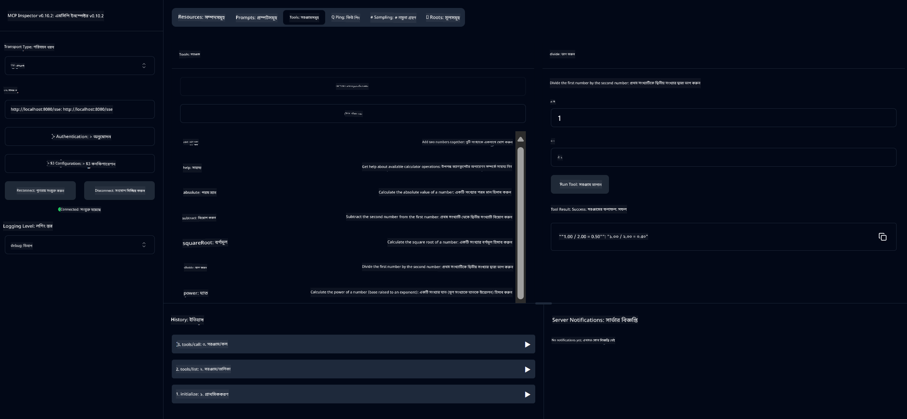

<!--
CO_OP_TRANSLATOR_METADATA:
{
  "original_hash": "13231e9951b68efd9df8c56bd5cdb27e",
  "translation_date": "2025-07-13T22:24:08+00:00",
  "source_file": "03-GettingStarted/samples/java/calculator/README.md",
  "language_code": "bn"
}
-->
# Basic Calculator MCP Service

এই সার্ভিসটি Model Context Protocol (MCP) ব্যবহার করে Spring Boot ও WebFlux ট্রান্সপোর্টের মাধ্যমে বেসিক ক্যালকুলেটর অপারেশন প্রদান করে। এটি MCP ইমপ্লিমেন্টেশন শেখার জন্য নতুনদের জন্য একটি সহজ উদাহরণ হিসেবে ডিজাইন করা হয়েছে।

অধিক তথ্যের জন্য দেখুন [MCP Server Boot Starter](https://docs.spring.io/spring-ai/reference/api/mcp/mcp-server-boot-starter-docs.html) রেফারেন্স ডকুমেন্টেশন।

## ওভারভিউ

সার্ভিসটি প্রদর্শন করে:
- SSE (Server-Sent Events) সাপোর্ট
- Spring AI এর `@Tool` অ্যানোটেশন ব্যবহার করে স্বয়ংক্রিয় টুল রেজিস্ট্রেশন
- বেসিক ক্যালকুলেটর ফাংশনসমূহ:
  - যোগ, বিয়োগ, গুণ, ভাগ
  - পাওয়ার ক্যালকুলেশন এবং বর্গমূল
  - মডুলাস (অবশিষ্ট) এবং অ্যাবসোলিউট ভ্যালু
  - অপারেশন বর্ণনার জন্য হেল্প ফাংশন

## ফিচারসমূহ

এই ক্যালকুলেটর সার্ভিস নিম্নলিখিত ক্ষমতা প্রদান করে:

1. **বেসিক আরিথমেটিক অপারেশনসমূহ**:
   - দুই সংখ্যার যোগ
   - এক সংখ্যাকে অন্য সংখ্যার থেকে বিয়োগ
   - দুই সংখ্যার গুণ
   - এক সংখ্যাকে অন্য সংখ্যার দ্বারা ভাগ (শূন্য ভাগের চেকসহ)

2. **অ্যাডভান্সড অপারেশনসমূহ**:
   - পাওয়ার ক্যালকুলেশন (বেসকে এক্সপোনেন্টে উত্তোলন)
   - বর্গমূল ক্যালকুলেশন (নেগেটিভ সংখ্যা চেকসহ)
   - মডুলাস (অবশিষ্ট) ক্যালকুলেশন
   - অ্যাবসোলিউট ভ্যালু ক্যালকুলেশন

3. **হেল্প সিস্টেম**:
   - বিল্ট-ইন হেল্প ফাংশন যা সব উপলব্ধ অপারেশন ব্যাখ্যা করে

## সার্ভিস ব্যবহারের পদ্ধতি

সার্ভিসটি MCP প্রোটোকলের মাধ্যমে নিম্নলিখিত API এন্ডপয়েন্ট প্রদান করে:

- `add(a, b)`: দুই সংখ্যার যোগফল
- `subtract(a, b)`: দ্বিতীয় সংখ্যাটি প্রথম থেকে বিয়োগ
- `multiply(a, b)`: দুই সংখ্যার গুণফল
- `divide(a, b)`: প্রথম সংখ্যাটি দ্বিতীয় দ্বারা ভাগ (শূন্য চেকসহ)
- `power(base, exponent)`: সংখ্যার পাওয়ার ক্যালকুলেশন
- `squareRoot(number)`: বর্গমূল নির্ণয় (নেগেটিভ চেকসহ)
- `modulus(a, b)`: ভাগশেষ নির্ণয়
- `absolute(number)`: সংখ্যার অ্যাবসোলিউট ভ্যালু নির্ণয়
- `help()`: উপলব্ধ অপারেশন সম্পর্কে তথ্য

## টেস্ট ক্লায়েন্ট

`com.microsoft.mcp.sample.client` প্যাকেজে একটি সহজ টেস্ট ক্লায়েন্ট অন্তর্ভুক্ত আছে। `SampleCalculatorClient` ক্লাসটি ক্যালকুলেটর সার্ভিসের উপলব্ধ অপারেশনগুলো প্রদর্শন করে।

## LangChain4j ক্লায়েন্ট ব্যবহারের পদ্ধতি

প্রজেক্টে `com.microsoft.mcp.sample.client.LangChain4jClient` এ একটি LangChain4j উদাহরণ ক্লায়েন্ট অন্তর্ভুক্ত আছে যা দেখায় কিভাবে ক্যালকুলেটর সার্ভিস LangChain4j এবং GitHub মডেলের সাথে ইন্টিগ্রেট করা যায়:

### প্রয়োজনীয়তা

1. **GitHub Token সেটআপ**:

   GitHub এর AI মডেল (যেমন phi-4) ব্যবহার করতে হলে একটি GitHub পার্সোনাল অ্যাক্সেস টোকেন লাগবে:

   ক. আপনার GitHub অ্যাকাউন্ট সেটিংসে যান: https://github.com/settings/tokens

   খ. "Generate new token" → "Generate new token (classic)" ক্লিক করুন

   গ. টোকেনের জন্য একটি বর্ণনামূলক নাম দিন

   ঘ. নিম্নলিখিত স্কোপগুলো নির্বাচন করুন:
      - `repo` (প্রাইভেট রিপোজিটরির পূর্ণ নিয়ন্ত্রণ)
      - `read:org` (অর্গ এবং টিম মেম্বারশিপ পড়া, অর্গ প্রজেক্ট পড়া)
      - `gist` (গিস্ট তৈরি)
      - `user:email` (ইউজারের ইমেইল ঠিকানা অ্যাক্সেস (শুধুমাত্র পড়া))

   ঙ. "Generate token" ক্লিক করে নতুন টোকেন কপি করুন

   চ. এটি পরিবেশ ভেরিয়েবল হিসেবে সেট করুন:

      Windows এ:
      ```
      set GITHUB_TOKEN=your-github-token
      ```

      macOS/Linux এ:
      ```bash
      export GITHUB_TOKEN=your-github-token
      ```

   ছ. স্থায়ী ব্যবহারের জন্য সিস্টেম সেটিংস থেকে পরিবেশ ভেরিয়েবলে এটি যোগ করুন

2. আপনার প্রজেক্টে LangChain4j GitHub ডিপেন্ডেন্সি যোগ করুন (pom.xml এ ইতিমধ্যে অন্তর্ভুক্ত):
   ```xml
   <dependency>
       <groupId>dev.langchain4j</groupId>
       <artifactId>langchain4j-github</artifactId>
       <version>${langchain4j.version}</version>
   </dependency>
   ```

3. নিশ্চিত করুন ক্যালকুলেটর সার্ভার `localhost:8080` এ চলছে

### LangChain4j ক্লায়েন্ট চালানো

এই উদাহরণটি প্রদর্শন করে:
- SSE ট্রান্সপোর্টের মাধ্যমে ক্যালকুলেটর MCP সার্ভারের সাথে সংযোগ
- LangChain4j ব্যবহার করে একটি চ্যাট বট তৈরি যা ক্যালকুলেটর অপারেশন ব্যবহার করে
- GitHub AI মডেল (বর্তমানে phi-4 মডেল) এর সাথে ইন্টিগ্রেশন

ক্লায়েন্ট নিম্নলিখিত নমুনা প্রশ্ন পাঠায় কার্যকারিতা প্রদর্শনের জন্য:
1. দুই সংখ্যার যোগফল নির্ণয়
2. একটি সংখ্যার বর্গমূল নির্ণয়
3. উপলব্ধ ক্যালকুলেটর অপারেশন সম্পর্কে হেল্প তথ্য পাওয়া

উদাহরণটি চালান এবং কনসোল আউটপুট দেখুন কিভাবে AI মডেল ক্যালকুলেটর টুল ব্যবহার করে প্রশ্নের উত্তর দেয়।

### GitHub মডেল কনফিগারেশন

LangChain4j ক্লায়েন্ট GitHub এর phi-4 মডেল ব্যবহার করার জন্য নিম্নলিখিত সেটিংস সহ কনফিগার করা হয়েছে:

```java
ChatLanguageModel model = GitHubChatModel.builder()
    .apiKey(System.getenv("GITHUB_TOKEN"))
    .timeout(Duration.ofSeconds(60))
    .modelName("phi-4")
    .logRequests(true)
    .logResponses(true)
    .build();
```

বিভিন্ন GitHub মডেল ব্যবহার করতে চাইলে `modelName` প্যারামিটারটি অন্য সমর্থিত মডেলে পরিবর্তন করুন (যেমন "claude-3-haiku-20240307", "llama-3-70b-8192" ইত্যাদি)।

## ডিপেন্ডেন্সিসমূহ

প্রজেক্টের জন্য নিম্নলিখিত প্রধান ডিপেন্ডেন্সি প্রয়োজন:

```xml
<!-- For MCP Server -->
<dependency>
    <groupId>org.springframework.ai</groupId>
    <artifactId>spring-ai-starter-mcp-server-webflux</artifactId>
</dependency>

<!-- For LangChain4j integration -->
<dependency>
    <groupId>dev.langchain4j</groupId>
    <artifactId>langchain4j-mcp</artifactId>
    <version>${langchain4j.version}</version>
</dependency>

<!-- For GitHub models support -->
<dependency>
    <groupId>dev.langchain4j</groupId>
    <artifactId>langchain4j-github</artifactId>
    <version>${langchain4j.version}</version>
</dependency>
```

## প্রজেক্ট বিল্ড করা

Maven ব্যবহার করে প্রজেক্ট বিল্ড করুন:
```bash
./mvnw clean install -DskipTests
```

## সার্ভার চালানো

### Java ব্যবহার করে

```bash
java -jar target/calculator-server-0.0.1-SNAPSHOT.jar
```

### MCP Inspector ব্যবহার করে

MCP Inspector MCP সার্ভিসের সাথে ইন্টারঅ্যাক্ট করার জন্য একটি সহায়ক টুল। এই ক্যালকুলেটর সার্ভিসের সাথে এটি ব্যবহার করতে:

1. **MCP Inspector ইনস্টল ও চালান** নতুন টার্মিনাল উইন্ডোতে:
   ```bash
   npx @modelcontextprotocol/inspector
   ```

2. **ওয়েব UI অ্যাক্সেস করুন** অ্যাপ দ্বারা প্রদর্শিত URL এ ক্লিক করে (সাধারণত http://localhost:6274)

3. **কনফিগারেশন করুন**:
   - ট্রান্সপোর্ট টাইপ "SSE" সেট করুন
   - আপনার চলমান সার্ভারের SSE এন্ডপয়েন্ট URL দিন: `http://localhost:8080/sse`
   - "Connect" ক্লিক করুন

4. **টুলগুলো ব্যবহার করুন**:
   - "List Tools" ক্লিক করে উপলব্ধ ক্যালকুলেটর অপারেশন দেখুন
   - একটি টুল নির্বাচন করে "Run Tool" ক্লিক করে অপারেশন চালান



### Docker ব্যবহার করে

প্রজেক্টে কন্টেইনারাইজড ডিপ্লয়মেন্টের জন্য একটি Dockerfile অন্তর্ভুক্ত আছে:

1. **Docker ইমেজ বিল্ড করুন**:
   ```bash
   docker build -t calculator-mcp-service .
   ```

2. **Docker কন্টেইনার চালান**:
   ```bash
   docker run -p 8080:8080 calculator-mcp-service
   ```

এটি করবে:
- Maven 3.9.9 এবং Eclipse Temurin 24 JDK সহ মাল্টি-স্টেজ Docker ইমেজ তৈরি
- অপ্টিমাইজড কন্টেইনার ইমেজ তৈরি
- সার্ভিস পোর্ট 8080 এ এক্সপোজ
- কন্টেইনারের ভিতরে MCP ক্যালকুলেটর সার্ভিস চালু

কন্টেইনার চালু হলে আপনি `http://localhost:8080` এ সার্ভিস অ্যাক্সেস করতে পারবেন।

## সমস্যা সমাধান

### GitHub Token সম্পর্কিত সাধারণ সমস্যা

1. **টোকেন পারমিশন সমস্যা**: যদি 403 Forbidden এরর পান, নিশ্চিত করুন আপনার টোকেনের পারমিশন প্রয়োজনীয় স্কোপ অনুযায়ী ঠিক আছে।

2. **টোকেন পাওয়া যায়নি**: "No API key found" এরর এলে নিশ্চিত করুন GITHUB_TOKEN পরিবেশ ভেরিয়েবল সঠিকভাবে সেট করা হয়েছে।

3. **রেট লিমিটিং**: GitHub API এর রেট লিমিট আছে। যদি 429 স্ট্যাটাস কোডের এরর পান, কয়েক মিনিট অপেক্ষা করে পুনরায় চেষ্টা করুন।

4. **টোকেন মেয়াদ উত্তীর্ণ**: GitHub টোকেনের মেয়াদ থাকে। কিছু সময় পর অথেনটিকেশন এরর এলে নতুন টোকেন জেনারেট করে পরিবেশ ভেরিয়েবল আপডেট করুন।

অতিরিক্ত সহায়তার জন্য দেখুন [LangChain4j ডকুমেন্টেশন](https://github.com/langchain4j/langchain4j) অথবা [GitHub API ডকুমেন্টেশন](https://docs.github.com/en/rest)।

**অস্বীকৃতি**:  
এই নথিটি AI অনুবাদ সেবা [Co-op Translator](https://github.com/Azure/co-op-translator) ব্যবহার করে অনূদিত হয়েছে। আমরা যথাসাধ্য সঠিকতার চেষ্টা করি, তবে স্বয়ংক্রিয় অনুবাদে ত্রুটি বা অসঙ্গতি থাকতে পারে। মূল নথিটি তার নিজস্ব ভাষায়ই কর্তৃত্বপূর্ণ উৎস হিসেবে বিবেচিত হওয়া উচিত। গুরুত্বপূর্ণ তথ্যের জন্য পেশাদার মানব অনুবাদ গ্রহণ করার পরামর্শ দেওয়া হয়। এই অনুবাদের ব্যবহারে সৃষ্ট কোনো ভুল বোঝাবুঝি বা ভুল ব্যাখ্যার জন্য আমরা দায়ী নই।