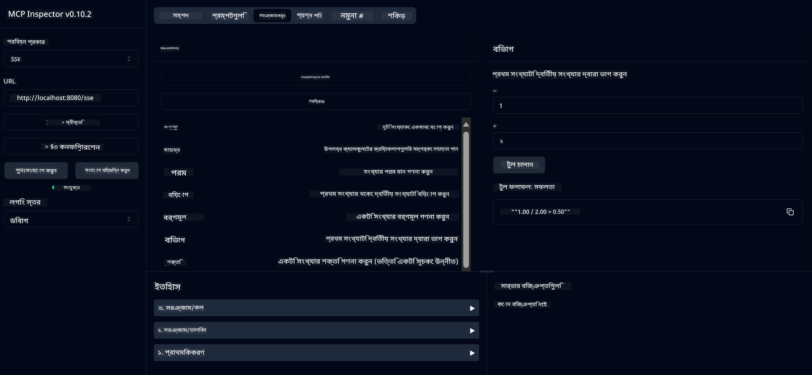

<!--
CO_OP_TRANSLATOR_METADATA:
{
  "original_hash": "13231e9951b68efd9df8c56bd5cdb27e",
  "translation_date": "2025-05-17T13:07:59+00:00",
  "source_file": "03-GettingStarted/samples/java/calculator/README.md",
  "language_code": "bn"
}
-->
# বেসিক ক্যালকুলেটর MCP সার্ভিস

এই সার্ভিসটি মডেল কনটেক্সট প্রোটোকল (MCP) এর মাধ্যমে বেসিক ক্যালকুলেটর অপারেশন প্রদান করে, যেখানে Spring Boot এবং WebFlux পরিবহন ব্যবহৃত হয়। এটি MCP ইমপ্লিমেন্টেশন সম্পর্কে শিক্ষানবিশদের জন্য একটি সহজ উদাহরণ হিসেবে ডিজাইন করা হয়েছে।

আরও তথ্যের জন্য, [MCP Server Boot Starter](https://docs.spring.io/spring-ai/reference/api/mcp/mcp-server-boot-starter-docs.html) রেফারেন্স ডকুমেন্টেশন দেখুন।

## সংক্ষিপ্ত বিবরণ

এই সার্ভিসটি প্রদর্শন করে:
- SSE (Server-Sent Events) এর জন্য সমর্থন
- Spring AI এর `@Tool` এনোটেশন ব্যবহার করে স্বয়ংক্রিয় টুল নিবন্ধন
- বেসিক ক্যালকুলেটর ফাংশন:
  - যোগ, বিয়োগ, গুণ, ভাগ
  - পাওয়ার এবং বর্গমূল হিসাব
  - মডুলাস (অবশিষ্টাংশ) এবং পরম মান
  - অপারেশন বর্ণনার জন্য সাহায্য ফাংশন

## বৈশিষ্ট্য

এই ক্যালকুলেটর সার্ভিস নিম্নলিখিত ক্ষমতাগুলি প্রদান করে:

1. **বেসিক গাণিতিক অপারেশন**:
   - দুটি সংখ্যার যোগফল
   - একটি সংখ্যা থেকে অন্যটি বিয়োগ
   - দুটি সংখ্যার গুণফল
   - একটি সংখ্যা দ্বারা অন্যটি ভাগ (শূন্য ভাগ চেক সহ)

2. **উন্নত অপারেশন**:
   - পাওয়ার হিসাব (একটি ভিত্তিকে একটি সূচকে উত্তোলন)
   - বর্গমূল হিসাব (নেগেটিভ সংখ্যা চেক সহ)
   - মডুলাস (অবশিষ্টাংশ) হিসাব
   - পরম মান হিসাব

3. **সাহায্য সিস্টেম**:
   - উপলব্ধ সমস্ত অপারেশন ব্যাখ্যা করার জন্য বিল্ট-ইন সাহায্য ফাংশন

## সার্ভিস ব্যবহার

এই সার্ভিসটি MCP প্রোটোকলের মাধ্যমে নিম্নলিখিত API এন্ডপয়েন্টগুলি প্রকাশ করে:

- `add(a, b)`: দুটি সংখ্যার যোগফল
- `subtract(a, b)`: প্রথম সংখ্যা থেকে দ্বিতীয়টি বিয়োগ
- `multiply(a, b)`: দুটি সংখ্যার গুণফল
- `divide(a, b)`: প্রথম সংখ্যা দ্বারা দ্বিতীয়টি ভাগ (শূন্য চেক সহ)
- `power(base, exponent)`: একটি সংখ্যার পাওয়ার হিসাব
- `squareRoot(number)`: বর্গমূল হিসাব (নেগেটিভ সংখ্যা চেক সহ)
- `modulus(a, b)`: ভাগ করার সময় অবশিষ্টাংশ হিসাব
- `absolute(number)`: পরম মান হিসাব
- `help()`: উপলব্ধ অপারেশন সম্পর্কে তথ্য প্রাপ্তি

## টেস্ট ক্লায়েন্ট

`com.microsoft.mcp.sample.client` প্যাকেজে একটি সহজ টেস্ট ক্লায়েন্ট অন্তর্ভুক্ত করা হয়েছে। `SampleCalculatorClient` ক্লাস ক্যালকুলেটর সার্ভিসের উপলব্ধ অপারেশন প্রদর্শন করে।

## LangChain4j ক্লায়েন্ট ব্যবহার

প্রকল্পে `com.microsoft.mcp.sample.client.LangChain4jClient` এ একটি LangChain4j উদাহরণ ক্লায়েন্ট অন্তর্ভুক্ত করা হয়েছে যা ক্যালকুলেটর সার্ভিসকে LangChain4j এবং GitHub মডেলগুলির সাথে ইন্টিগ্রেট করার পদ্ধতি প্রদর্শন করে:

### প্রয়োজনীয়তা

1. **GitHub টোকেন সেটআপ**:
   
   GitHub এর AI মডেলগুলি (যেমন phi-4) ব্যবহার করতে, আপনাকে একটি GitHub ব্যক্তিগত অ্যাক্সেস টোকেন প্রয়োজন:

   a. আপনার GitHub অ্যাকাউন্ট সেটিংসে যান: https://github.com/settings/tokens
   
   b. "Generate new token" → "Generate new token (classic)" এ ক্লিক করুন
   
   c. আপনার টোকেনকে একটি বর্ণনামূলক নাম দিন
   
   d. নিম্নলিখিত স্কোপগুলি নির্বাচন করুন:
      - `repo` (ব্যক্তিগত রিপোজিটরিগুলির সম্পূর্ণ নিয়ন্ত্রণ)
      - `read:org` (সংগঠন এবং টিম সদস্যপদ পড়া, সংগঠন প্রকল্প পড়া)
      - `gist` (জিস্ট তৈরি)
      - `user:email` (ব্যবহারকারীর ইমেল ঠিকানা অ্যাক্সেস (শুধুমাত্র পড়া))
   
   e. "Generate token" এ ক্লিক করুন এবং আপনার নতুন টোকেন কপি করুন
   
   f. এটিকে একটি পরিবেশ ভেরিয়েবল হিসেবে সেট করুন:
      
      Windows এ:
      ```
      set GITHUB_TOKEN=your-github-token
      ```
      
      macOS/Linux এ:
      ```bash
      export GITHUB_TOKEN=your-github-token
      ```

   g. স্থায়ী সেটআপের জন্য, আপনার পরিবেশ ভেরিয়েবলগুলির মাধ্যমে সিস্টেম সেটিংসে এটি যোগ করুন

2. আপনার প্রকল্পে LangChain4j GitHub নির্ভরতা যোগ করুন (ইতিমধ্যে pom.xml এ অন্তর্ভুক্ত):
   ```xml
   <dependency>
       <groupId>dev.langchain4j</groupId>
       <artifactId>langchain4j-github</artifactId>
       <version>${langchain4j.version}</version>
   </dependency>
   ```

3. নিশ্চিত করুন যে ক্যালকুলেটর সার্ভার `localhost:8080` এ চলছে

### LangChain4j ক্লায়েন্ট চালানো

এই উদাহরণটি প্রদর্শন করে:
- SSE পরিবহন মাধ্যমে ক্যালকুলেটর MCP সার্ভারের সাথে সংযোগ
- ক্যালকুলেটর অপারেশনগুলি ব্যবহার করে একটি চ্যাট বট তৈরি করতে LangChain4j ব্যবহার
- GitHub AI মডেলগুলির সাথে ইন্টিগ্রেশন (এখন phi-4 মডেল ব্যবহার করা হচ্ছে)

ক্লায়েন্ট নিম্নলিখিত নমুনা প্রশ্নগুলি পাঠায় কার্যকারিতা প্রদর্শন করতে:
1. দুটি সংখ্যার যোগফল হিসাব করা
2. একটি সংখ্যার বর্গমূল খুঁজে পাওয়া
3. উপলব্ধ ক্যালকুলেটর অপারেশন সম্পর্কে সাহায্য তথ্য প্রাপ্তি

উদাহরণটি চালান এবং দেখুন কনসোল আউটপুটে কিভাবে AI মডেল ক্যালকুলেটর টুলগুলি ব্যবহার করে প্রশ্নের উত্তর দেয়।

### GitHub মডেল কনফিগারেশন

LangChain4j ক্লায়েন্ট GitHub এর phi-4 মডেল ব্যবহার করার জন্য নিম্নলিখিত সেটিংস সহ কনফিগার করা হয়েছে:

```java
ChatLanguageModel model = GitHubChatModel.builder()
    .apiKey(System.getenv("GITHUB_TOKEN"))
    .timeout(Duration.ofSeconds(60))
    .modelName("phi-4")
    .logRequests(true)
    .logResponses(true)
    .build();
```

বিভিন্ন GitHub মডেল ব্যবহার করতে, কেবল `modelName` প্যারামিটারটি অন্য সমর্থিত মডেলে পরিবর্তন করুন (যেমন "claude-3-haiku-20240307", "llama-3-70b-8192", ইত্যাদি)।

## নির্ভরতা

প্রকল্পের জন্য নিম্নলিখিত প্রধান নির্ভরতাগুলি প্রয়োজন:

```xml
<!-- For MCP Server -->
<dependency>
    <groupId>org.springframework.ai</groupId>
    <artifactId>spring-ai-starter-mcp-server-webflux</artifactId>
</dependency>

<!-- For LangChain4j integration -->
<dependency>
    <groupId>dev.langchain4j</groupId>
    <artifactId>langchain4j-mcp</artifactId>
    <version>${langchain4j.version}</version>
</dependency>

<!-- For GitHub models support -->
<dependency>
    <groupId>dev.langchain4j</groupId>
    <artifactId>langchain4j-github</artifactId>
    <version>${langchain4j.version}</version>
</dependency>
```

## প্রকল্প নির্মাণ

Maven ব্যবহার করে প্রকল্পটি নির্মাণ করুন:
```bash
./mvnw clean install -DskipTests
```

## সার্ভার চালানো

### জাভা ব্যবহার করে

```bash
java -jar target/calculator-server-0.0.1-SNAPSHOT.jar
```

### MCP Inspector ব্যবহার করে

MCP Inspector MCP সার্ভিসের সাথে যোগাযোগ করার জন্য একটি সহায়ক টুল। এই ক্যালকুলেটর সার্ভিসের সাথে এটি ব্যবহার করতে:

1. **MCP Inspector ইনস্টল এবং চালান** একটি নতুন টার্মিনাল উইন্ডোতে:
   ```bash
   npx @modelcontextprotocol/inspector
   ```

2. **ওয়েব UI অ্যাক্সেস করুন** অ্যাপ্লিকেশন দ্বারা প্রদর্শিত URL এ ক্লিক করে (সাধারণত http://localhost:6274)

3. **সংযোগ কনফিগার করুন**:
   - পরিবহন প্রকার "SSE" সেট করুন
   - আপনার চলমান সার্ভারের SSE এন্ডপয়েন্টে URL সেট করুন: `http://localhost:8080/sse`
   - "Connect" এ ক্লিক করুন

4. **টুলগুলি ব্যবহার করুন**:
   - উপলব্ধ ক্যালকুলেটর অপারেশন দেখতে "List Tools" এ ক্লিক করুন
   - একটি টুল নির্বাচন করুন এবং একটি অপারেশন সম্পাদন করতে "Run Tool" এ ক্লিক করুন



### Docker ব্যবহার করে

প্রকল্পে কন্টেইনারাইজড ডিপ্লয়মেন্টের জন্য একটি Dockerfile অন্তর্ভুক্ত করা হয়েছে:

1. **Docker ইমেজ তৈরি করুন**:
   ```bash
   docker build -t calculator-mcp-service .
   ```

2. **Docker কন্টেইনার চালান**:
   ```bash
   docker run -p 8080:8080 calculator-mcp-service
   ```

এটি করবে:
- Maven 3.9.9 এবং Eclipse Temurin 24 JDK সহ একটি মাল্টি-স্টেজ Docker ইমেজ তৈরি করবে
- একটি অপ্টিমাইজড কন্টেইনার ইমেজ তৈরি করবে
- সার্ভিসটি পোর্ট 8080 এ উন্মুক্ত করবে
- কন্টেইনারের ভিতরে MCP ক্যালকুলেটর সার্ভিস শুরু করবে

আপনি কন্টেইনার চলার পরে সার্ভিসটি `http://localhost:8080` এ অ্যাক্সেস করতে পারেন।

## সমস্যা সমাধান

### GitHub টোকেনের সাধারণ সমস্যা

1. **টোকেন অনুমতি সমস্যা**: যদি আপনি 403 নিষিদ্ধ ত্রুটি পান, আপনার টোকেনের সঠিক অনুমতি রয়েছে কিনা তা চেক করুন যা প্রয়োজনীয়তায় বর্ণিত হয়েছে।

2. **টোকেন পাওয়া যায়নি**: যদি আপনি "কোনও API কী পাওয়া যায়নি" ত্রুটি পান, নিশ্চিত করুন যে GITHUB_TOKEN পরিবেশ ভেরিয়েবলটি সঠিকভাবে সেট করা হয়েছে।

3. **হার লিমিটিং**: GitHub API এর হার সীমা রয়েছে। যদি আপনি একটি হার সীমা ত্রুটি (স্ট্যাটাস কোড 429) পান, কয়েক মিনিট অপেক্ষা করুন এবং আবার চেষ্টা করুন।

4. **টোকেন মেয়াদ শেষ**: GitHub টোকেন মেয়াদোত্তীর্ণ হতে পারে। যদি কিছু সময় পর আপনাকে প্রমাণীকরণ ত্রুটি পাওয়া যায়, একটি নতুন টোকেন তৈরি করুন এবং আপনার পরিবেশ ভেরিয়েবল আপডেট করুন।

যদি আপনার আরও সহায়তার প্রয়োজন হয়, [LangChain4j ডকুমেন্টেশন](https://github.com/langchain4j/langchain4j) বা [GitHub API ডকুমেন্টেশন](https://docs.github.com/en/rest) দেখুন।

**অস্বীকৃতি**:  
এই নথিটি AI অনুবাদ পরিষেবা [Co-op Translator](https://github.com/Azure/co-op-translator) ব্যবহার করে অনুবাদ করা হয়েছে। আমরা যথাসম্ভব সঠিকতার চেষ্টা করি, তবে অনুগ্রহ করে সচেতন থাকুন যে স্বয়ংক্রিয় অনুবাদে ভুল বা অসঙ্গতি থাকতে পারে। মূল ভাষায় থাকা নথিটিকে কর্তৃত্বপূর্ণ উৎস হিসাবে বিবেচনা করা উচিত। গুরুত্বপূর্ণ তথ্যের জন্য, পেশাদার মানব অনুবাদ সুপারিশ করা হয়। এই অনুবাদ ব্যবহারের ফলে কোনো ভুল বোঝাবুঝি বা ভুল ব্যাখ্যা হলে আমরা দায়ী থাকব না।