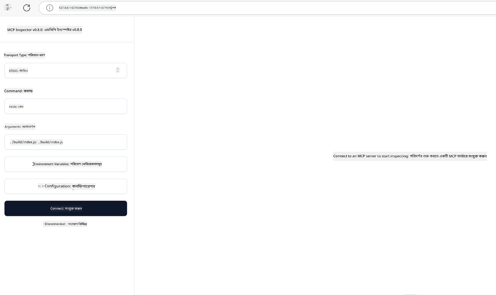

<!--
CO_OP_TRANSLATOR_METADATA:
{
  "original_hash": "83efa75a69bc831277263a6f1ae53669",
  "translation_date": "2025-08-18T14:56:43+00:00",
  "source_file": "04-PracticalImplementation/README.md",
  "language_code": "bn"
}
-->
# বাস্তব প্রয়োগ

[](https://youtu.be/vCN9-mKBDfQ)

_(উপরের ছবিতে ক্লিক করে এই পাঠের ভিডিও দেখুন)_

বাস্তব প্রয়োগের মাধ্যমে Model Context Protocol (MCP)-এর শক্তি বাস্তবিক হয়ে ওঠে। MCP-এর তত্ত্ব এবং স্থাপত্য বোঝা গুরুত্বপূর্ণ হলেও, এর আসল মূল্য তখনই প্রকাশ পায় যখন আপনি এই ধারণাগুলো ব্যবহার করে বাস্তব সমস্যার সমাধান করতে সক্ষম হবেন। এই অধ্যায়টি ধারণাগত জ্ঞান এবং হাতে-কলমে উন্নয়নের মধ্যে সেতুবন্ধন তৈরি করে, আপনাকে MCP-ভিত্তিক অ্যাপ্লিকেশন তৈরি করার প্রক্রিয়ায় গাইড করবে।

আপনি যদি বুদ্ধিমান সহকারী তৈরি করেন, ব্যবসার ওয়ার্কফ্লোতে AI সংযুক্ত করেন, বা ডেটা প্রসেসিংয়ের জন্য কাস্টম টুল তৈরি করেন, MCP একটি নমনীয় ভিত্তি প্রদান করে। এর ভাষা-নিরপেক্ষ ডিজাইন এবং জনপ্রিয় প্রোগ্রামিং ভাষার জন্য অফিসিয়াল SDK-গুলো এটি বিভিন্ন ডেভেলপারদের জন্য সহজলভ্য করে তোলে। এই SDK-গুলো ব্যবহার করে আপনি দ্রুত প্রোটোটাইপ তৈরি করতে, পুনরাবৃত্তি করতে এবং বিভিন্ন প্ল্যাটফর্ম ও পরিবেশে আপনার সমাধান স্কেল করতে পারবেন।

পরবর্তী অংশগুলোতে, আপনি বাস্তব উদাহরণ, নমুনা কোড, এবং ডিপ্লয়মেন্ট কৌশল পাবেন যা C#, Java with Spring, TypeScript, JavaScript, এবং Python-এ MCP বাস্তবায়ন দেখাবে। এছাড়াও, আপনি শিখবেন কীভাবে MCP সার্ভার ডিবাগ এবং পরীক্ষা করবেন, API পরিচালনা করবেন, এবং Azure ব্যবহার করে সমাধান ক্লাউডে ডিপ্লয় করবেন। এই হাতে-কলমে রিসোর্সগুলো আপনার শেখার গতি বাড়াবে এবং আপনাকে আত্মবিশ্বাসের সঙ্গে শক্তিশালী, প্রোডাকশন-রেডি MCP অ্যাপ্লিকেশন তৈরি করতে সাহায্য করবে।

## ওভারভিউ

এই পাঠটি বিভিন্ন প্রোগ্রামিং ভাষায় MCP বাস্তবায়নের ব্যবহারিক দিকগুলোর উপর ফোকাস করে। আমরা দেখব কীভাবে MCP SDK-গুলো C#, Java with Spring, TypeScript, JavaScript, এবং Python-এ ব্যবহার করে শক্তিশালী অ্যাপ্লিকেশন তৈরি করা যায়, MCP সার্ভার ডিবাগ এবং পরীক্ষা করা যায়, এবং পুনর্ব্যবহারযোগ্য রিসোর্স, প্রম্পট, এবং টুল তৈরি করা যায়।

## শেখার লক্ষ্য

এই পাঠ শেষে, আপনি সক্ষম হবেন:

- বিভিন্ন প্রোগ্রামিং ভাষায় অফিসিয়াল SDK ব্যবহার করে MCP সমাধান বাস্তবায়ন করতে
- পদ্ধতিগতভাবে MCP সার্ভার ডিবাগ এবং পরীক্ষা করতে
- সার্ভারের বৈশিষ্ট্য (Resources, Prompts, এবং Tools) তৈরি এবং ব্যবহার করতে
- জটিল কাজের জন্য কার্যকর MCP ওয়ার্কফ্লো ডিজাইন করতে
- কর্মক্ষমতা এবং নির্ভরযোগ্যতার জন্য MCP বাস্তবায়ন অপ্টিমাইজ করতে

## অফিসিয়াল SDK রিসোর্স

Model Context Protocol বিভিন্ন ভাষার জন্য অফিসিয়াল SDK প্রদান করে:

- [C# SDK](https://github.com/modelcontextprotocol/csharp-sdk)
- [Java with Spring SDK](https://github.com/modelcontextprotocol/java-sdk) **নোট:** [Project Reactor](https://projectreactor.io)-এর উপর নির্ভরশীল। (দেখুন [আলোচনা ইস্যু 246](https://github.com/orgs/modelcontextprotocol/discussions/246)।)
- [TypeScript SDK](https://github.com/modelcontextprotocol/typescript-sdk)
- [Python SDK](https://github.com/modelcontextprotocol/python-sdk)
- [Kotlin SDK](https://github.com/modelcontextprotocol/kotlin-sdk)

## MCP SDK-গুলোর সাথে কাজ করা

এই অংশে বিভিন্ন প্রোগ্রামিং ভাষায় MCP বাস্তবায়নের ব্যবহারিক উদাহরণ দেওয়া হয়েছে। আপনি `samples` ডিরেক্টরিতে ভাষাভিত্তিক সংগঠিত নমুনা কোড পাবেন।

### উপলব্ধ নমুনা

রিপোজিটরিতে নিম্নলিখিত ভাষায় [নমুনা বাস্তবায়ন](../../../04-PracticalImplementation/samples) অন্তর্ভুক্ত রয়েছে:

- [C#](./samples/csharp/README.md)
- [Java with Spring](./samples/java/containerapp/README.md)
- [TypeScript](./samples/typescript/README.md)
- [JavaScript](./samples/javascript/README.md)
- [Python](./samples/python/README.md)

প্রত্যেকটি নমুনা নির্দিষ্ট ভাষা এবং ইকোসিস্টেমের জন্য গুরুত্বপূর্ণ MCP ধারণা এবং বাস্তবায়ন প্যাটার্ন প্রদর্শন করে।

## মূল সার্ভার বৈশিষ্ট্য

MCP সার্ভারগুলো নিম্নলিখিত বৈশিষ্ট্যগুলোর যেকোনো সংমিশ্রণ বাস্তবায়ন করতে পারে:

### রিসোর্স

রিসোর্স ব্যবহারকারী বা AI মডেলের জন্য প্রাসঙ্গিক ডেটা এবং তথ্য প্রদান করে:

- ডকুমেন্ট রিপোজিটরি
- জ্ঞানভিত্তিক ডেটাবেস
- কাঠামোবদ্ধ ডেটা উৎস
- ফাইল সিস্টেম

### প্রম্পট

প্রম্পট হলো ব্যবহারকারীদের জন্য টেমপ্লেটেড বার্তা এবং ওয়ার্কফ্লো:

- পূর্বনির্ধারিত কথোপকথনের টেমপ্লেট
- নির্দেশিত ইন্টারঅ্যাকশন প্যাটার্ন
- বিশেষায়িত সংলাপ কাঠামো

### টুল

টুল হলো AI মডেলের জন্য কার্যকরী ফাংশন:

- ডেটা প্রসেসিং ইউটিলিটি
- বাহ্যিক API ইন্টিগ্রেশন
- গণনামূলক ক্ষমতা
- অনুসন্ধান কার্যকারিতা

## নমুনা বাস্তবায়ন: C# বাস্তবায়ন

অফিসিয়াল C# SDK রিপোজিটরিতে MCP-এর বিভিন্ন দিক প্রদর্শনকারী বেশ কিছু নমুনা বাস্তবায়ন অন্তর্ভুক্ত রয়েছে:

- **বেসিক MCP ক্লায়েন্ট**: একটি সাধারণ উদাহরণ যা দেখায় কীভাবে MCP ক্লায়েন্ট তৈরি এবং টুল কল করতে হয়
- **বেসিক MCP সার্ভার**: মৌলিক টুল রেজিস্ট্রেশন সহ একটি ন্যূনতম সার্ভার বাস্তবায়ন
- **অ্যাডভান্সড MCP সার্ভার**: টুল রেজিস্ট্রেশন, অথেনটিকেশন, এবং ত্রুটি পরিচালনা সহ একটি পূর্ণাঙ্গ সার্ভার
- **ASP.NET ইন্টিগ্রেশন**: ASP.NET Core-এর সাথে ইন্টিগ্রেশন প্রদর্শনকারী উদাহরণ
- **টুল বাস্তবায়ন প্যাটার্ন**: বিভিন্ন জটিলতার টুল বাস্তবায়নের জন্য বিভিন্ন প্যাটার্ন

C# MCP SDK প্রিভিউ পর্যায়ে রয়েছে এবং API-গুলো পরিবর্তিত হতে পারে। SDK-এর উন্নতির সাথে সাথে আমরা এই ব্লগটি নিয়মিত আপডেট করব।

### মূল বৈশিষ্ট্য

- [C# MCP Nuget ModelContextProtocol](https://www.nuget.org/packages/ModelContextProtocol)
- আপনার [প্রথম MCP সার্ভার তৈরি করা](https://devblogs.microsoft.com/dotnet/build-a-model-context-protocol-mcp-server-in-csharp/)।

সম্পূর্ণ C# বাস্তবায়নের নমুনার জন্য, [অফিসিয়াল C# SDK নমুনা রিপোজিটরি](https://github.com/modelcontextprotocol/csharp-sdk) দেখুন।

## নমুনা বাস্তবায়ন: Java with Spring বাস্তবায়ন

Java with Spring SDK এন্টারপ্রাইজ-গ্রেড বৈশিষ্ট্য সহ শক্তিশালী MCP বাস্তবায়নের বিকল্প প্রদান করে।

### মূল বৈশিষ্ট্য

- Spring Framework ইন্টিগ্রেশন
- শক্তিশালী টাইপ সেফটি
- রিঅ্যাকটিভ প্রোগ্রামিং সাপোর্ট
- বিস্তৃত ত্রুটি পরিচালনা

সম্পূর্ণ Java with Spring বাস্তবায়নের নমুনার জন্য, `samples` ডিরেক্টরির [Java with Spring নমুনা](samples/java/containerapp/README.md) দেখুন।

## নমুনা বাস্তবায়ন: JavaScript বাস্তবায়ন

JavaScript SDK MCP বাস্তবায়নের জন্য একটি হালকা এবং নমনীয় পদ্ধতি প্রদান করে।

### মূল বৈশিষ্ট্য

- Node.js এবং ব্রাউজার সাপোর্ট
- প্রমিজ-ভিত্তিক API
- Express এবং অন্যান্য ফ্রেমওয়ার্কের সাথে সহজ ইন্টিগ্রেশন
- স্ট্রিমিংয়ের জন্য WebSocket সাপোর্ট

সম্পূর্ণ JavaScript বাস্তবায়নের নমুনার জন্য, `samples` ডিরেক্টরির [JavaScript নমুনা](samples/javascript/README.md) দেখুন।

## নমুনা বাস্তবায়ন: Python বাস্তবায়ন

Python SDK MCP বাস্তবায়নের জন্য একটি পাইথনিক পদ্ধতি প্রদান করে এবং চমৎকার মেশিন লার্নিং ফ্রেমওয়ার্ক ইন্টিগ্রেশন সরবরাহ করে।

### মূল বৈশিষ্ট্য

- asyncio সহ Async/await সাপোর্ট
- FastAPI ইন্টিগ্রেশন
- সহজ টুল রেজিস্ট্রেশন
- জনপ্রিয় মেশিন লার্নিং লাইব্রেরির সাথে নেটিভ ইন্টিগ্রেশন

সম্পূর্ণ Python বাস্তবায়নের নমুনার জন্য, `samples` ডিরেক্টরির [Python নমুনা](samples/python/README.md) দেখুন।

## API ব্যবস্থাপনা

Azure API Management MCP সার্ভার সুরক্ষিত করার একটি চমৎকার সমাধান। ধারণাটি হলো আপনার MCP সার্ভারের সামনে একটি Azure API Management ইনস্ট্যান্স স্থাপন করা এবং এটি নিম্নলিখিত বৈশিষ্ট্যগুলো পরিচালনা করবে:

- রেট লিমিটিং
- টোকেন ব্যবস্থাপনা
- মনিটরিং
- লোড ব্যালেন্সিং
- নিরাপত্তা

### Azure নমুনা

এখানে একটি Azure নমুনা রয়েছে যা MCP সার্ভার তৈরি এবং Azure API Management দিয়ে সুরক্ষিত করার প্রক্রিয়া দেখায়: [Azure API Management সহ MCP সার্ভার তৈরি](https://github.com/Azure-Samples/remote-mcp-apim-functions-python)।

উপরের চিত্রে, নিম্নলিখিত প্রক্রিয়া ঘটে:

- Microsoft Entra ব্যবহার করে অথেনটিকেশন/অথরাইজেশন সম্পন্ন হয়।
- Azure API Management একটি গেটওয়ে হিসেবে কাজ করে এবং নীতিমালা ব্যবহার করে ট্রাফিক পরিচালনা করে।
- Azure Monitor সমস্ত অনুরোধ লগ করে ভবিষ্যৎ বিশ্লেষণের জন্য।

#### অথরাইজেশন ফ্লো

অথরাইজেশন ফ্লো বিস্তারিতভাবে দেখতে নিচের চিত্রটি দেখুন:


#### MCP অথরাইজেশন স্পেসিফিকেশন

[MCP অথরাইজেশন স্পেসিফিকেশন](https://modelcontextprotocol.io/specification/2025-03-26/basic/authorization#2-10-third-party-authorization-flow) সম্পর্কে আরও জানুন।

## Azure-এ রিমোট MCP সার্ভার ডিপ্লয় করা

আগে উল্লেখিত নমুনাটি ডিপ্লয় করার প্রক্রিয়া দেখা যাক:

1. রিপো ক্লোন করুন

    ```bash
    git clone https://github.com/Azure-Samples/remote-mcp-apim-functions-python.git
    cd remote-mcp-apim-functions-python
    ```

1. `Microsoft.App` রিসোর্স প্রোভাইডার রেজিস্টার করুন।

   - Azure CLI ব্যবহার করলে, `az provider register --namespace Microsoft.App --wait` চালান।
   - Azure PowerShell ব্যবহার করলে, `Register-AzResourceProvider -ProviderNamespace Microsoft.App` চালান। কিছুক্ষণ পর `(Get-AzResourceProvider -ProviderNamespace Microsoft.App).RegistrationState` চালিয়ে রেজিস্ট্রেশন সম্পন্ন হয়েছে কিনা পরীক্ষা করুন।

1. এই [azd](https://aka.ms/azd) কমান্ডটি চালান যা API ম্যানেজমেন্ট সার্ভিস, ফাংশন অ্যাপ (কোড সহ) এবং অন্যান্য প্রয়োজনীয় Azure রিসোর্স প্রভিশন করবে:

    ```shell
    azd up
    ```

    এই কমান্ডগুলো Azure-এ সমস্ত ক্লাউড রিসোর্স ডিপ্লয় করবে।

### MCP Inspector দিয়ে আপনার সার্ভার পরীক্ষা করা

1. একটি **নতুন টার্মিনাল উইন্ডোতে**, MCP Inspector ইনস্টল এবং চালান:

    ```shell
    npx @modelcontextprotocol/inspector
    ```

    আপনি নিচের মতো একটি ইন্টারফেস দেখতে পাবেন:

    

1. MCP Inspector ওয়েব অ্যাপটি লোড করতে অ্যাপ দ্বারা প্রদর্শিত URL-এ (যেমন [http://127.0.0.1:6274/#resources](http://127.0.0.1:6274/#resources)) CTRL ক্লিক করুন।
1. ট্রান্সপোর্ট টাইপ `SSE` সেট করুন।
1. `azd up`-এর পরে প্রদর্শিত আপনার চলমান API ম্যানেজমেন্ট SSE এন্ডপয়েন্টের URL সেট করুন এবং **Connect** করুন:

    ```shell
    https://<apim-servicename-from-azd-output>.azure-api.net/mcp/sse
    ```

1. **List Tools**। একটি টুলে ক্লিক করুন এবং **Run Tool** করুন।

যদি সমস্ত ধাপ সঠিকভাবে সম্পন্ন হয়, তবে আপনি MCP সার্ভারের সাথে সংযুক্ত হয়েছেন এবং একটি টুল কল করতে সক্ষম হয়েছেন।

## Azure-এর জন্য MCP সার্ভার

[Remote-mcp-functions](https://github.com/Azure-Samples/remote-mcp-functions-dotnet): এই সেটের রিপোজিটরিগুলো Python, C# .NET বা Node/TypeScript ব্যবহার করে Azure Functions-এর মাধ্যমে কাস্টম রিমোট MCP (Model Context Protocol) সার্ভার তৈরি এবং ডিপ্লয়ের জন্য একটি দ্রুত শুরু টেমপ্লেট।

নমুনাগুলো ডেভেলপারদের নিম্নলিখিত সুবিধা প্রদান করে:

- লোকালভাবে তৈরি এবং চালানো: একটি MCP সার্ভার লোকাল মেশিনে তৈরি এবং ডিবাগ করা
- Azure-এ ডিপ্লয়: একটি সহজ `azd up` কমান্ডের মাধ্যমে ক্লাউডে সহজে ডিপ্লয় করা
- ক্লায়েন্ট থেকে সংযোগ: VS Code-এর Copilot এজেন্ট মোড এবং MCP Inspector টুল সহ বিভিন্ন ক্লায়েন্ট থেকে MCP সার্ভারে সংযোগ করা

### মূল বৈশিষ্ট্য

- ডিজাইন অনুযায়ী নিরাপত্তা: MCP সার্ভার কী এবং HTTPS ব্যবহার করে সুরক্ষিত
- অথেনটিকেশন বিকল্প: বিল্ট-ইন অথ এবং/অথবা API ম্যানেজমেন্ট ব্যবহার করে OAuth সাপোর্ট
- নেটওয়ার্ক আইসোলেশন: Azure Virtual Networks (VNET) ব্যবহার করে নেটওয়ার্ক আইসোলেশন
- সার্ভারলেস আর্কিটেকচার: স্কেলেবল, ইভেন্ট-চালিত এক্সিকিউশনের জন্য Azure Functions ব্যবহার
- লোকাল ডেভেলপমেন্ট: বিস্তৃত লোকাল ডেভেলপমেন্ট এবং ডিবাগিং সাপোর্ট
- সহজ ডিপ্লয়মেন্ট: Azure-এ স্ট্রিমলাইনড ডিপ্লয়মেন্ট প্রক্রিয়া

রিপোজিটরিতে সমস্ত প্রয়োজনীয় কনফিগারেশন ফাইল, সোর্স কোড, এবং ইনফ্রাস্ট্রাকচার ডেফিনিশন অন্তর্ভুক্ত রয়েছে যা প্রোডাকশন-রেডি MCP সার্ভার বাস্তবায়নের জন্য দ্রুত শুরু করতে সাহায্য করে।

- [Azure Remote MCP Functions Python](https://github.com/Azure-Samples/remote-mcp-functions-python) - Python ব্যবহার করে Azure Functions-এর মাধ্যমে MCP বাস্তবায়নের নমুনা
- [Azure Remote MCP Functions .NET](https://github.com/Azure-Samples/remote-mcp-functions-dotnet) - C# .NET ব্যবহার করে Azure Functions-এর মাধ্যমে MCP বাস্তবায়নের নমুনা
- [Azure Remote MCP Functions Node/Typescript](https://github.com/Azure-Samples/remote-mcp-functions-typescript) - Node/TypeScript ব্যবহার করে Azure Functions-এর মাধ্যমে MCP বাস্তবায়নের নমুনা।

## মূল বিষয়গুলো

- MCP SDK-গুলো শক্তিশালী MCP সমাধান বাস্তবায়নের জন্য ভাষাভিত্তিক টুল সরবরাহ করে
- নির্ভরযোগ্য MCP অ্যাপ্লিকেশনের জন্য ডিবাগিং এবং পরীক্ষার প্রক্রিয়া অত্যন্ত গুরুত্বপূর্ণ
- পুনর্ব্যবহারযোগ্য প্রম্পট টেমপ্লেট AI ইন্টারঅ্যাকশনকে ধারাবাহিক করে তোলে
- ভালোভাবে ডিজাইন করা ওয়ার্কফ্লো একাধিক টুল ব্যবহার করে জটিল কাজগুলো পরিচালনা করতে পারে
- MCP সমাধান বাস্তবায়নের সময় নিরাপত্তা, কর্মক্ষমতা, এবং ত্রুটি পরিচালনার বিষয়গুলো বিবেচনা করা প্রয়োজন

## অনুশীলন

আপনার ডোমেইনের একটি বাস্তব সমস্যার সমাধানের জন্য একটি ব্যবহারিক MCP ওয়ার্কফ্লো ডিজাইন করুন:

1. এই সমস্যার সমাধানে সহায়ক ৩-৪টি টুল চিহ্নিত করুন
2. এই টুলগুলো কীভাবে ইন্টারঅ্যাক্ট করবে তা দেখানোর জন্য একটি ওয়ার্কফ্লো ডায়াগ্রাম তৈরি করুন
3. আপনার পছন্দের ভাষা ব্যবহার করে টুলগুলোর একটি মৌলিক সংস্করণ বাস্তবায়ন করুন
4. একটি প্রম্পট টেমপ্লেট তৈরি করুন যা মডেলকে আপনার টুল কার্যকরভাবে ব্যবহার করতে সাহায্য করবে

## অতিরিক্ত রিসোর্স

---

পরবর্তী: [উন্নত বিষয়াবলী](../05-AdvancedTopics/README.md)

**অস্বীকৃতি**:  
এই নথিটি AI অনুবাদ পরিষেবা [Co-op Translator](https://github.com/Azure/co-op-translator) ব্যবহার করে অনুবাদ করা হয়েছে। আমরা যথাসম্ভব সঠিকতার জন্য চেষ্টা করি, তবে অনুগ্রহ করে মনে রাখবেন যে স্বয়ংক্রিয় অনুবাদে ত্রুটি বা অসঙ্গতি থাকতে পারে। এর মূল ভাষায় থাকা নথিটিকে প্রামাণিক উৎস হিসেবে বিবেচনা করা উচিত। গুরুত্বপূর্ণ তথ্যের জন্য, পেশাদার মানব অনুবাদ সুপারিশ করা হয়। এই অনুবাদ ব্যবহারের ফলে কোনো ভুল বোঝাবুঝি বা ভুল ব্যাখ্যা হলে আমরা তার জন্য দায়বদ্ধ থাকব না।