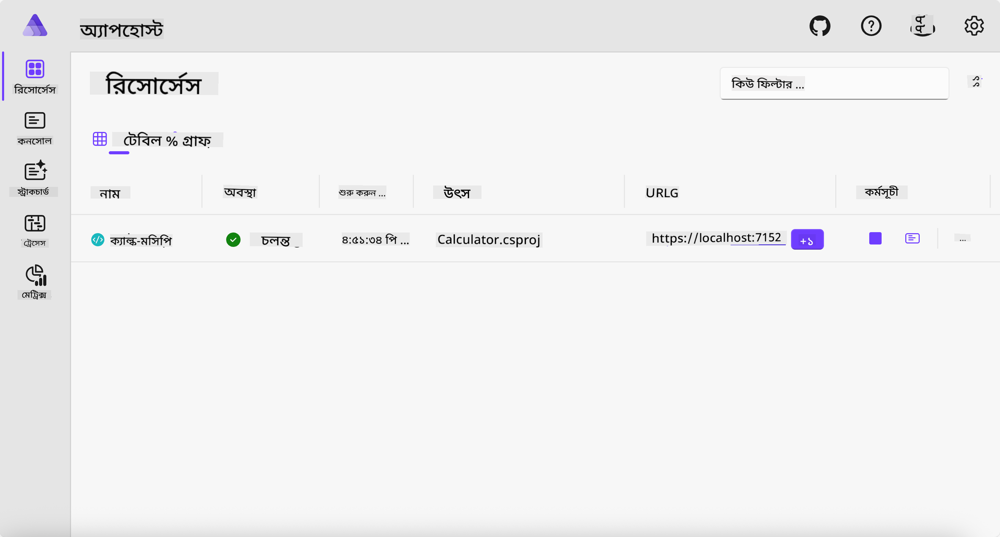
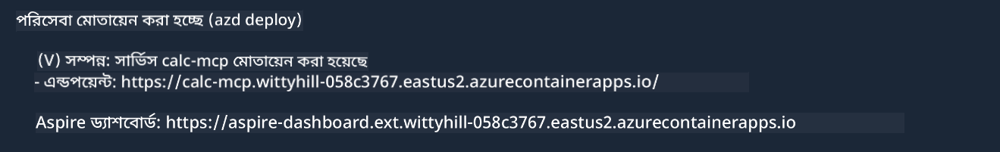

<!--
CO_OP_TRANSLATOR_METADATA:
{
  "original_hash": "0bc7bd48f55f1565f1d95ccb2c16f728",
  "translation_date": "2025-07-13T23:05:24+00:00",
  "source_file": "04-PracticalImplementation/samples/csharp/README.md",
  "language_code": "bn"
}
-->
# নমুনা

আগের উদাহরণটি দেখায় কীভাবে একটি লোকাল .NET প্রজেক্ট `stdio` টাইপের সাথে ব্যবহার করতে হয়। এবং কীভাবে একটি কন্টেইনারে লোকালি সার্ভার চালানো যায়। এটি অনেক পরিস্থিতিতে একটি ভালো সমাধান। তবে, সার্ভারটি দূর থেকে, যেমন ক্লাউড পরিবেশে চালানোও উপকারী হতে পারে। এ ক্ষেত্রে `http` টাইপ ব্যবহৃত হয়।

`04-PracticalImplementation` ফোল্ডারের সমাধানটি দেখলে এটি আগেরটির তুলনায় অনেক বেশি জটিল মনে হতে পারে। কিন্তু বাস্তবে তা নয়। যদি আপনি `src/Calculator` প্রজেক্টটি ভালো করে দেখেন, তাহলে দেখতে পাবেন এটি বেশিরভাগই আগের উদাহরণের মতোই কোড। একমাত্র পার্থক্য হল আমরা HTTP অনুরোধগুলি পরিচালনার জন্য একটি ভিন্ন লাইব্রেরি `ModelContextProtocol.AspNetCore` ব্যবহার করছি। এবং `IsPrime` মেথডটিকে প্রাইভেট করেছি, শুধু দেখানোর জন্য যে আপনার কোডে প্রাইভেট মেথড থাকতে পারে। বাকি কোড আগের মতোই।

অন্যান্য প্রজেক্টগুলো [.NET Aspire](https://learn.microsoft.com/dotnet/aspire/get-started/aspire-overview) থেকে এসেছে। সমাধানে .NET Aspire থাকার ফলে ডেভেলপারদের ডেভেলপমেন্ট ও টেস্টিং অভিজ্ঞতা উন্নত হয় এবং অবজারভেবিলিটিতেও সাহায্য করে। সার্ভার চালানোর জন্য এটি আবশ্যক নয়, তবে এটি আপনার সমাধানে রাখা একটি ভালো অভ্যাস।

## লোকালি সার্ভার চালানো শুরু করুন

1. VS Code (C# DevKit এক্সটেনশনসহ) থেকে `04-PracticalImplementation/samples/csharp` ডিরেক্টরিতে যান।
1. সার্ভার চালানোর জন্য নিচের কমান্ডটি চালান:

   ```bash
    dotnet watch run --project ./src/AppHost
   ```

1. যখন একটি ওয়েব ব্রাউজার .NET Aspire ড্যাশবোর্ড খুলবে, তখন `http` URLটি নোট করুন। এটি সাধারণত এরকম কিছু হবে: `http://localhost:5058/`।

   

## MCP Inspector দিয়ে Streamable HTTP পরীক্ষা করুন

যদি আপনার কাছে Node.js 22.7.5 বা তার উপরে থাকে, তাহলে MCP Inspector ব্যবহার করে আপনার সার্ভার পরীক্ষা করতে পারেন।

সার্ভার চালু করুন এবং একটি টার্মিনালে নিচের কমান্ডটি চালান:

```bash
npx @modelcontextprotocol/inspector http://localhost:5058
```


- Transport টাইপ হিসেবে `Streamable HTTP` নির্বাচন করুন।
- Url ফিল্ডে আগের নোট করা সার্ভারের URL দিন এবং শেষে `/mcp` যোগ করুন। এটি অবশ্যই `http` (https নয়) হবে, যেমন `http://localhost:5058/mcp`।
- Connect বাটনে ক্লিক করুন।

Inspector এর একটি ভালো দিক হল এটি কী ঘটছে তার একটি পরিষ্কার দৃশ্যমানতা দেয়।

- উপলব্ধ টুলগুলো তালিকাভুক্ত করার চেষ্টা করুন
- কিছু টুল ব্যবহার করে দেখুন, এগুলো আগের মতোই কাজ করবে।

## VS Code-এ GitHub Copilot Chat দিয়ে MCP Server পরীক্ষা করুন

Streamable HTTP ট্রান্সপোর্ট GitHub Copilot Chat-এ ব্যবহার করতে, পূর্বে তৈরি `calc-mcp` সার্ভারের কনফিগারেশনটি নিচের মতো পরিবর্তন করুন:

```jsonc
// .vscode/mcp.json
{
  "servers": {
    "calc-mcp": {
      "type": "http",
      "url": "http://localhost:5058/mcp"
    }
  }
}
```

কিছু পরীক্ষা করুন:

- "3 prime numbers after 6780" জিজ্ঞাসা করুন। লক্ষ্য করুন কিভাবে Copilot নতুন টুল `NextFivePrimeNumbers` ব্যবহার করে এবং প্রথম 3টি প্রাইম নাম্বারই রিটার্ন করে।
- "7 prime numbers after 111" জিজ্ঞাসা করুন, দেখুন কী হয়।
- "John has 24 lollies and wants to distribute them all to his 3 kids. How many lollies does each kid have?" জিজ্ঞাসা করুন, দেখুন কী হয়।

## সার্ভারটি Azure-এ ডিপ্লয় করুন

চলুন সার্ভারটি Azure-এ ডিপ্লয় করি যাতে আরও বেশি মানুষ এটি ব্যবহার করতে পারে।

একটি টার্মিনালে `04-PracticalImplementation/samples/csharp` ফোল্ডারে যান এবং নিচের কমান্ডটি চালান:

```bash
azd up
```

ডিপ্লয়মেন্ট শেষ হলে, আপনি এরকম একটি মেসেজ দেখতে পাবেন:



URLটি নিন এবং MCP Inspector ও GitHub Copilot Chat-এ ব্যবহার করুন।

```jsonc
// .vscode/mcp.json
{
  "servers": {
    "calc-mcp": {
      "type": "http",
      "url": "https://calc-mcp.gentleriver-3977fbcf.australiaeast.azurecontainerapps.io/mcp"
    }
  }
}
```

## পরবর্তী কী?

আমরা বিভিন্ন ট্রান্সপোর্ট টাইপ এবং টেস্টিং টুল পরীক্ষা করেছি। আমরা আপনার MCP সার্ভার Azure-এ ডিপ্লয় করেছি। কিন্তু যদি আমাদের সার্ভারকে প্রাইভেট রিসোর্সে অ্যাক্সেস করতে হয়? যেমন, একটি ডাটাবেস বা প্রাইভেট API? পরবর্তী অধ্যায়ে আমরা দেখব কীভাবে আমাদের সার্ভারের সিকিউরিটি উন্নত করা যায়।

**অস্বীকৃতি**:  
এই নথিটি AI অনুবাদ সেবা [Co-op Translator](https://github.com/Azure/co-op-translator) ব্যবহার করে অনূদিত হয়েছে। আমরা যথাসাধ্য সঠিকতার চেষ্টা করি, তবে স্বয়ংক্রিয় অনুবাদে ত্রুটি বা অসঙ্গতি থাকতে পারে। মূল নথিটি তার নিজস্ব ভাষায়ই কর্তৃত্বপূর্ণ উৎস হিসেবে বিবেচিত হওয়া উচিত। গুরুত্বপূর্ণ তথ্যের জন্য পেশাদার মানব অনুবাদ গ্রহণ করার পরামর্শ দেওয়া হয়। এই অনুবাদের ব্যবহারে সৃষ্ট কোনো ভুল বোঝাবুঝি বা ভুল ব্যাখ্যার জন্য আমরা দায়ী নই।