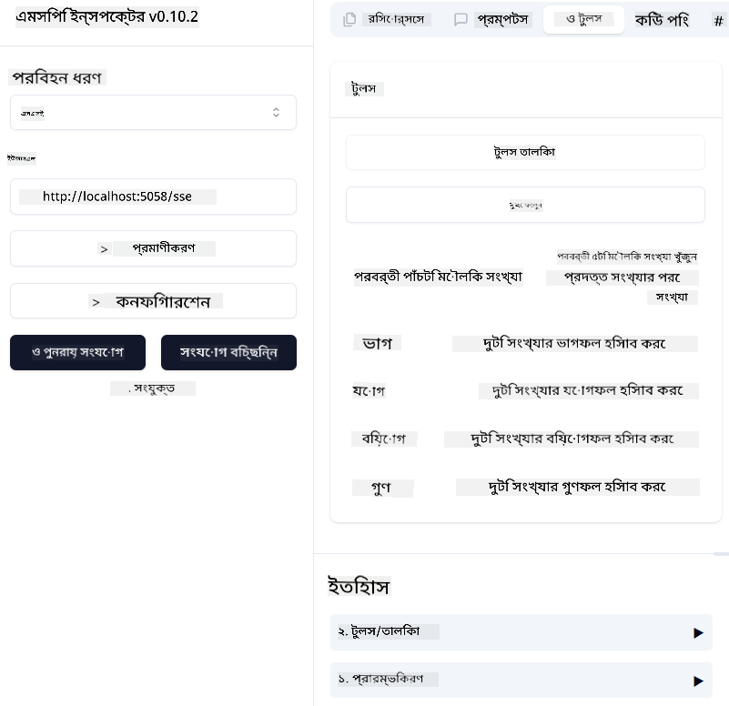
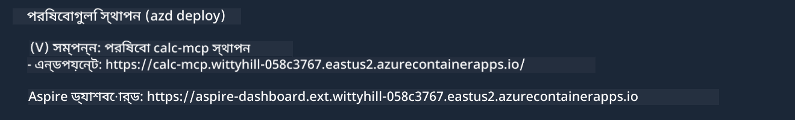

<!--
CO_OP_TRANSLATOR_METADATA:
{
  "original_hash": "5020a3e1a1c7f30c00f9e37f1fa208e3",
  "translation_date": "2025-05-17T14:06:44+00:00",
  "source_file": "04-PracticalImplementation/samples/csharp/README.md",
  "language_code": "bn"
}
-->
# নমুনা

আগের উদাহরণটি দেখায় কীভাবে একটি স্থানীয় .NET প্রকল্প `sdio` টাইপের সাথে ব্যবহার করা যায়। এবং কীভাবে একটি কন্টেইনারে স্থানীয়ভাবে সার্ভার চালানো যায়। এটি অনেক পরিস্থিতিতে একটি ভালো সমাধান। তবে সার্ভারকে দূরবর্তীভাবে চালানো উপকারী হতে পারে, যেমন ক্লাউড পরিবেশে। এখানেই `http` টাইপটি কাজে আসে।

`04-PracticalImplementation` ফোল্ডারের সমাধানটি দেখলে, এটি আগেরটির তুলনায় অনেক বেশি জটিল মনে হতে পারে। কিন্তু বাস্তবে, তা নয়। প্রকল্প `src/mcpserver/mcpserver.csproj`-এর দিকে ভালোভাবে তাকালে, আপনি দেখবেন যে এটি মূলত আগের উদাহরণের মতোই কোড। একমাত্র পার্থক্য হল আমরা HTTP অনুরোধগুলি পরিচালনা করতে একটি ভিন্ন লাইব্রেরি `ModelContextProtocol.AspNetCore` ব্যবহার করছি। এবং আমরা পদ্ধতি `IsPrime`-কে ব্যক্তিগত করার জন্য পরিবর্তন করেছি, শুধু দেখানোর জন্য যে আপনি আপনার কোডে ব্যক্তিগত পদ্ধতি রাখতে পারেন। বাকি কোড আগের মতোই।

অন্যান্য প্রকল্পগুলি [.NET Aspire](https://learn.microsoft.com/dotnet/aspire/get-started/aspire-overview) থেকে এসেছে। সমাধানে .NET Aspire থাকা বিকাশকারীকে উন্নয়ন এবং পরীক্ষার সময় অভিজ্ঞতা উন্নত করবে এবং পর্যবেক্ষণ সহায়তা করবে। এটি সার্ভার চালানোর জন্য প্রয়োজনীয় নয়, তবে আপনার সমাধানে এটি রাখা ভালো অভ্যাস।

## স্থানীয়ভাবে সার্ভার শুরু করুন

1. VS Code থেকে (C# DevKit এক্সটেনশনের সাথে), সমাধান `04-PracticalImplementation\samples\csharp\src\Calculator-chap4.sln` খুলুন।
2. সার্ভার শুরু করতে `F5` চাপুন। এটি .NET Aspire ড্যাশবোর্ড সহ একটি ওয়েব ব্রাউজার শুরু করা উচিত।

অথবা

1. একটি টার্মিনাল থেকে, ফোল্ডার `04-PracticalImplementation\samples\csharp\src`-এ যান
2. সার্ভার শুরু করতে নিম্নলিখিত কমান্ডটি কার্যকর করুন:
   ```bash
    dotnet run --project .\AppHost
   ```

3. ড্যাশবোর্ড থেকে `http` URL লক্ষ্য করুন। এটি কিছুটা এরকম হওয়া উচিত `http://localhost:5058/`.

## Test `SSE` ModelContext Protocol Inspector সহ

যদি আপনার Node.js 22.7.5 এবং উচ্চতর থাকে, আপনি আপনার সার্ভার পরীক্ষা করতে ModelContext Protocol Inspector ব্যবহার করতে পারেন।

সার্ভার শুরু করুন এবং একটি টার্মিনালে নিম্নলিখিত কমান্ড চালান:

```bash
npx @modelcontextprotocol/inspector@latest
```



- `SSE` as the Transport type. SSE stand for Server-Sent Events. 
- In the Url field, enter the URL of the server noted earlier,and append `/sse` নির্বাচন করুন। এটি `http` হওয়া উচিত (না `https`) something like `http://localhost:5058/sse`.
- select the Connect button.

A nice thing about the Inspector is that it provide a nice visibility on what is happening.

- Try listing the availables tools
- Try some of them, it should works just like before.


## Test `SSE` with Github Copilot Chat in VS Code

To use the `SSE` transport with Github Copilot Chat, change the configuration of the `mcp-calc` পূর্বে তৈরি সার্ভার এভাবে দেখতে:

```json
"mcp-calc": {
    "type": "sse",
    "url": "http://localhost:5058/sse"
}
```

কিছু পরীক্ষা করুন:
- 6780 এর পরে 3টি মৌলিক সংখ্যা চাইুন। লক্ষ্য করুন কপাইলট নতুন টুল `NextFivePrimeNumbers` ব্যবহার করবে এবং শুধুমাত্র প্রথম 3টি মৌলিক সংখ্যা ফেরত দেবে।
- 111 এর পরে 7টি মৌলিক সংখ্যা চাইুন, দেখুন কী ঘটে।

# সার্ভারকে Azure-এ স্থাপন করুন

আসুন সার্ভারকে Azure-এ স্থাপন করি যাতে আরও মানুষ এটি ব্যবহার করতে পারে।

একটি টার্মিনাল থেকে, ফোল্ডার `04-PracticalImplementation\samples\csharp\src`-এ যান এবং নিম্নলিখিত কমান্ড চালান:

```bash
azd init
```

এটি Azure সম্পদের কনফিগারেশন এবং আপনার Infrastructure as Code (IaC) সংরক্ষণের জন্য স্থানীয়ভাবে কিছু ফাইল তৈরি করবে।

তারপর, সার্ভারকে Azure-এ স্থাপন করতে নিম্নলিখিত কমান্ড চালান:

```bash
azd up
```

স্থাপন শেষ হলে, আপনার একটি বার্তা এরকম দেখতে পাওয়া উচিত:



Aspire ড্যাশবোর্ডে যান এবং MCP Inspector এবং Github Copilot Chat-এ ব্যবহার করার জন্য `HTTP` URL লক্ষ্য করুন।

## পরবর্তী কী?

আমরা বিভিন্ন পরিবহন টাইপ এবং পরীক্ষার টুল চেষ্টা করেছি এবং আমাদের MCP সার্ভারকে Azure-এ স্থাপন করেছি। কিন্তু যদি আমাদের সার্ভারকে ব্যক্তিগত সম্পদে প্রবেশ করতে হয়? উদাহরণস্বরূপ, একটি ডাটাবেস বা একটি ব্যক্তিগত API? পরবর্তী অধ্যায়ে, আমরা কীভাবে আমাদের সার্ভারের নিরাপত্তা উন্নত করতে পারি তা দেখব।

**অস্বীকৃতি**:  
এই নথিটি AI অনুবাদ পরিষেবা [Co-op Translator](https://github.com/Azure/co-op-translator) ব্যবহার করে অনুবাদ করা হয়েছে। আমরা যথাসম্ভব সঠিকতার জন্য চেষ্টা করি, তবে অনুগ্রহ করে সচেতন থাকুন যে স্বয়ংক্রিয় অনুবাদে ত্রুটি বা অসঙ্গতি থাকতে পারে। মূল ভাষায় থাকা নথিটি প্রামাণিক উৎস হিসেবে বিবেচিত হওয়া উচিত। গুরুত্বপূর্ণ তথ্যের জন্য, পেশাদার মানব অনুবাদ সুপারিশ করা হয়। এই অনুবাদ ব্যবহারের ফলে উদ্ভূত কোনো ভুল বোঝাবুঝি বা ভুল ব্যাখ্যার জন্য আমরা দায়ী নই।