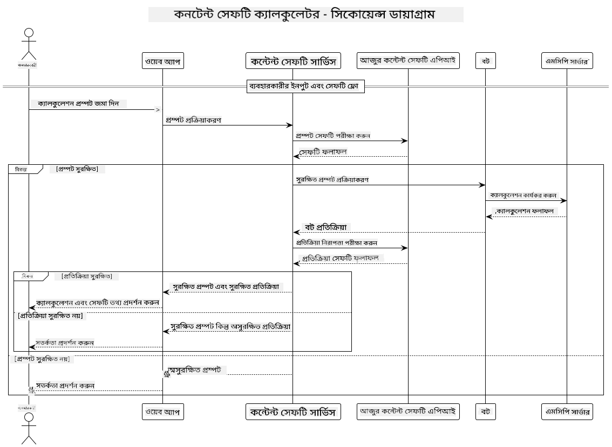

<!--
CO_OP_TRANSLATOR_METADATA:
{
  "original_hash": "e5ea5e7582f70008ea9bec3b3820f20a",
  "translation_date": "2025-07-13T23:14:12+00:00",
  "source_file": "04-PracticalImplementation/samples/java/containerapp/README.md",
  "language_code": "bn"
}
-->
## সিস্টেম আর্কিটেকচার

এই প্রকল্পটি একটি ওয়েব অ্যাপ্লিকেশন প্রদর্শন করে যা ব্যবহারকারীর প্রম্পটগুলি Model Context Protocol (MCP) এর মাধ্যমে ক্যালকুলেটর সার্ভিসে পাঠানোর আগে কন্টেন্ট সেফটি চেক করে।



### এটি কীভাবে কাজ করে

1. **ব্যবহারকারীর ইনপুট**: ব্যবহারকারী ওয়েব ইন্টারফেসে একটি গণনার প্রম্পট প্রদান করে  
2. **কন্টেন্ট সেফটি স্ক্রিনিং (ইনপুট)**: প্রম্পটটি Azure Content Safety API দ্বারা বিশ্লেষণ করা হয়  
3. **সেফটি সিদ্ধান্ত (ইনপুট)**:  
   - যদি কন্টেন্ট নিরাপদ হয় (সমস্ত ক্যাটাগরিতে severity < ২), তাহলে এটি ক্যালকুলেটরে পাঠানো হয়  
   - যদি কন্টেন্ট সম্ভাব্য ক্ষতিকর হিসেবে চিহ্নিত হয়, তাহলে প্রক্রিয়াটি বন্ধ হয়ে যায় এবং একটি সতর্কতা ফেরত দেয়  
4. **ক্যালকুলেটর ইন্টিগ্রেশন**: নিরাপদ কন্টেন্ট LangChain4j দ্বারা প্রক্রিয়াজাত হয়, যা MCP ক্যালকুলেটর সার্ভারের সাথে যোগাযোগ করে  
5. **কন্টেন্ট সেফটি স্ক্রিনিং (আউটপুট)**: বটের প্রতিক্রিয়া Azure Content Safety API দ্বারা বিশ্লেষণ করা হয়  
6. **সেফটি সিদ্ধান্ত (আউটপুট)**:  
   - যদি বটের প্রতিক্রিয়া নিরাপদ হয়, তাহলে এটি ব্যবহারকারীর কাছে দেখানো হয়  
   - যদি বটের প্রতিক্রিয়া সম্ভাব্য ক্ষতিকর হিসেবে চিহ্নিত হয়, তাহলে এটি একটি সতর্কতায় প্রতিস্থাপিত হয়  
7. **প্রতিক্রিয়া**: ফলাফল (যদি নিরাপদ হয়) ব্যবহারকারীর কাছে উভয় সেফটি বিশ্লেষণসহ প্রদর্শিত হয়  

## Model Context Protocol (MCP) ব্যবহার করে ক্যালকুলেটর সার্ভিস

এই প্রকল্পটি LangChain4j থেকে ক্যালকুলেটর MCP সার্ভিস কল করার জন্য Model Context Protocol (MCP) ব্যবহারের পদ্ধতি প্রদর্শন করে। বাস্তবায়নে একটি লোকাল MCP সার্ভার পোর্ট ৮০৮০-এ চালানো হয় যা ক্যালকুলেটর অপারেশন সরবরাহ করে।

### Azure Content Safety সার্ভিস সেটআপ করা

কন্টেন্ট সেফটি ফিচার ব্যবহারের আগে আপনাকে একটি Azure Content Safety সার্ভিস রিসোর্স তৈরি করতে হবে:

1. [Azure Portal](https://portal.azure.com) এ সাইন ইন করুন  
2. "Create a resource" ক্লিক করুন এবং "Content Safety" সার্চ করুন  
3. "Content Safety" নির্বাচন করে "Create" ক্লিক করুন  
4. আপনার রিসোর্সের জন্য একটি ইউনিক নাম দিন  
5. আপনার সাবস্ক্রিপশন এবং রিসোর্স গ্রুপ নির্বাচন করুন (অথবা নতুন তৈরি করুন)  
6. একটি সমর্থিত অঞ্চল নির্বাচন করুন ([Region availability](https://azure.microsoft.com/en-us/global-infrastructure/services/?products=cognitive-services) দেখুন)  
7. উপযুক্ত প্রাইসিং টিয়ার নির্বাচন করুন  
8. "Create" ক্লিক করে রিসোর্স ডিপ্লয় করুন  
9. ডিপ্লয়মেন্ট সম্পন্ন হলে "Go to resource" ক্লিক করুন  
10. বাম প্যানেলে "Resource Management" এর অধীনে "Keys and Endpoint" নির্বাচন করুন  
11. পরবর্তী ধাপে ব্যবহারের জন্য যেকোনো একটি কী এবং এন্ডপয়েন্ট URL কপি করুন  

### পরিবেশ ভেরিয়েবল কনফিগারেশন

GitHub মডেলগুলোর অথেন্টিকেশনের জন্য `GITHUB_TOKEN` পরিবেশ ভেরিয়েবল সেট করুন:  
```sh
export GITHUB_TOKEN=<your_github_token>
```

কন্টেন্ট সেফটি ফিচারগুলোর জন্য:  
```sh
export CONTENT_SAFETY_ENDPOINT=<your_content_safety_endpoint>
export CONTENT_SAFETY_KEY=<your_content_safety_key>
```

এই পরিবেশ ভেরিয়েবলগুলো অ্যাপ্লিকেশনকে Azure Content Safety সার্ভিসের সাথে অথেন্টিকেট করতে সাহায্য করে। যদি এগুলো সেট না করা থাকে, তাহলে অ্যাপ্লিকেশন ডেমো উদ্দেশ্যে প্লেসহোল্ডার মান ব্যবহার করবে, কিন্তু কন্টেন্ট সেফটি ফিচার সঠিকভাবে কাজ করবে না।

### ক্যালকুলেটর MCP সার্ভার চালু করা

ক্লায়েন্ট চালানোর আগে আপনাকে লোকালহোস্ট:৮০৮০-এ SSE মোডে ক্যালকুলেটর MCP সার্ভার চালু করতে হবে।

## প্রকল্পের বিবরণ

এই প্রকল্পটি LangChain4j এর সাথে Model Context Protocol (MCP) ইন্টিগ্রেশন প্রদর্শন করে ক্যালকুলেটর সার্ভিস কল করার জন্য। প্রধান বৈশিষ্ট্যসমূহ:

- MCP ব্যবহার করে ক্যালকুলেটর সার্ভিসের সাথে সংযোগ স্থাপন করে মৌলিক গণিত অপারেশন  
- ব্যবহারকারীর প্রম্পট এবং বটের প্রতিক্রিয়ার উপর দ্বৈত স্তরের কন্টেন্ট সেফটি চেকিং  
- GitHub এর gpt-4.1-nano মডেলের সাথে LangChain4j এর ইন্টিগ্রেশন  
- MCP ট্রান্সপোর্টের জন্য Server-Sent Events (SSE) ব্যবহার  

## কন্টেন্ট সেফটি ইন্টিগ্রেশন

প্রকল্পটিতে ব্যাপক কন্টেন্ট সেফটি ফিচার অন্তর্ভুক্ত রয়েছে যা নিশ্চিত করে যে ব্যবহারকারীর ইনপুট এবং সিস্টেমের প্রতিক্রিয়া উভয়ই ক্ষতিকর কন্টেন্ট থেকে মুক্ত:

1. **ইনপুট স্ক্রিনিং**: সমস্ত ব্যবহারকারীর প্রম্পট ক্ষতিকর কন্টেন্ট ক্যাটাগরির জন্য যেমন ঘৃণা ভাষা, সহিংসতা, আত্মহত্যা, এবং যৌন বিষয়বস্তু বিশ্লেষণ করা হয় প্রক্রিয়াকরণের আগে।  

2. **আউটপুট স্ক্রিনিং**: সম্ভাব্য আনস্ক্রিনড মডেল ব্যবহার করলেও, সিস্টেম সমস্ত তৈরি প্রতিক্রিয়া একই কন্টেন্ট সেফটি ফিল্টার দিয়ে যাচাই করে ব্যবহারকারীর সামনে দেখানোর আগে।  

এই দ্বৈত স্তরের পদ্ধতি নিশ্চিত করে যে সিস্টেম যেকোনো AI মডেল ব্যবহার করুক না কেন নিরাপদ থাকে, ব্যবহারকারীদের ক্ষতিকর ইনপুট এবং সম্ভাব্য সমস্যাযুক্ত AI-উৎপন্ন আউটপুট থেকে রক্ষা করে।

## ওয়েব ক্লায়েন্ট

অ্যাপ্লিকেশনটি একটি ব্যবহারকারী-বান্ধব ওয়েব ইন্টারফেস অন্তর্ভুক্ত করে যা ব্যবহারকারীদের Content Safety Calculator সিস্টেমের সাথে ইন্টারঅ্যাক্ট করার সুযোগ দেয়:

### ওয়েব ইন্টারফেস বৈশিষ্ট্যসমূহ

- গণনার প্রম্পট দেওয়ার জন্য সহজ ও বোধগম্য ফর্ম  
- দ্বৈত স্তরের কন্টেন্ট সেফটি যাচাই (ইনপুট ও আউটপুট)  
- প্রম্পট এবং প্রতিক্রিয়ার সেফটি সম্পর্কে রিয়েল-টাইম ফিডব্যাক  
- সহজ বোঝার জন্য রঙ-সংকেতিত সেফটি নির্দেশক  
- বিভিন্ন ডিভাইসে কাজ করার জন্য পরিষ্কার ও প্রতিক্রিয়াশীল ডিজাইন  
- ব্যবহারকারীদের গাইড করার জন্য উদাহরণস্বরূপ নিরাপদ প্রম্পট  

### ওয়েব ক্লায়েন্ট ব্যবহার

1. অ্যাপ্লিকেশন চালু করুন:  
   ```sh
   mvn spring-boot:run
   ```

2. আপনার ব্রাউজার খুলে `http://localhost:8087` এ যান  

3. প্রদত্ত টেক্সট এরিয়াতে একটি গণনার প্রম্পট লিখুন (যেমন, "Calculate the sum of 24.5 and 17.3")  

4. "Submit" ক্লিক করে আপনার অনুরোধ প্রক্রিয়াকরণ করুন  

5. ফলাফল দেখুন, যা অন্তর্ভুক্ত করবে:  
   - আপনার প্রম্পটের কন্টেন্ট সেফটি বিশ্লেষণ  
   - গণনা ফলাফল (যদি প্রম্পট নিরাপদ হয়)  
   - বটের প্রতিক্রিয়ার কন্টেন্ট সেফটি বিশ্লেষণ  
   - ইনপুট বা আউটপুট flagged হলে কোনো সেফটি সতর্কতা  

ওয়েব ক্লায়েন্ট স্বয়ংক্রিয়ভাবে উভয় কন্টেন্ট সেফটি যাচাই প্রক্রিয়া পরিচালনা করে, নিশ্চিত করে যে সমস্ত ইন্টারঅ্যাকশন নিরাপদ এবং উপযুক্ত, যেকোনো AI মডেল ব্যবহৃত হোক না কেন।

**অস্বীকৃতি**:  
এই নথিটি AI অনুবাদ সেবা [Co-op Translator](https://github.com/Azure/co-op-translator) ব্যবহার করে অনূদিত হয়েছে। আমরা যথাসাধ্য সঠিকতার চেষ্টা করি, তবে স্বয়ংক্রিয় অনুবাদে ত্রুটি বা অসঙ্গতি থাকতে পারে। মূল নথিটি তার নিজস্ব ভাষায়ই কর্তৃত্বপূর্ণ উৎস হিসেবে বিবেচিত হওয়া উচিত। গুরুত্বপূর্ণ তথ্যের জন্য পেশাদার মানব অনুবাদ গ্রহণ করার পরামর্শ দেওয়া হয়। এই অনুবাদের ব্যবহারে সৃষ্ট কোনো ভুল বোঝাবুঝি বা ভুল ব্যাখ্যার জন্য আমরা দায়ী নই।