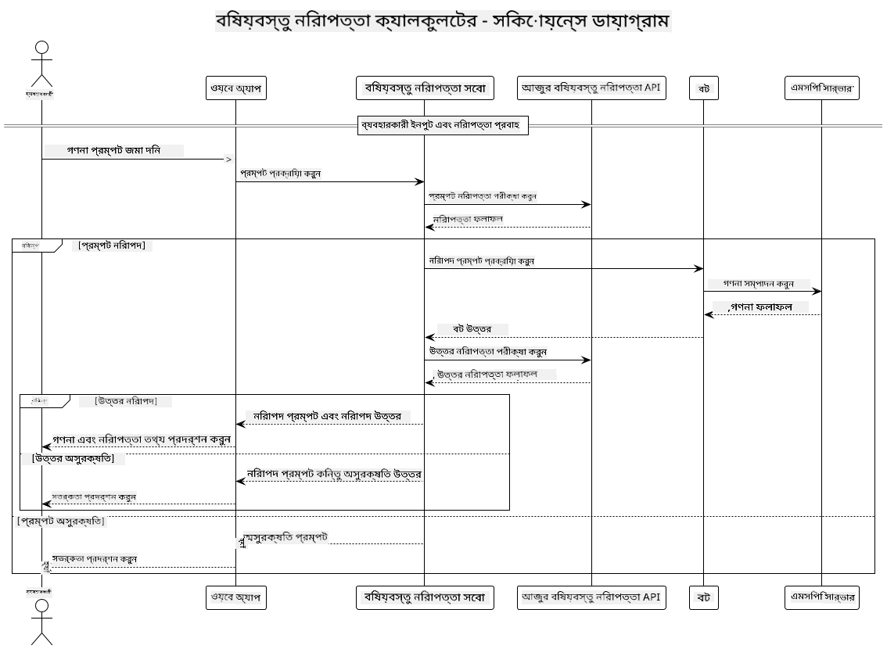

<!--
CO_OP_TRANSLATOR_METADATA:
{
  "original_hash": "e5ea5e7582f70008ea9bec3b3820f20a",
  "translation_date": "2025-05-17T14:23:56+00:00",
  "source_file": "04-PracticalImplementation/samples/java/containerapp/README.md",
  "language_code": "bn"
}
-->
## সিস্টেম স্থাপত্য

এই প্রকল্পটি একটি ওয়েব অ্যাপ্লিকেশন প্রদর্শন করে যা ব্যবহারকারীর প্রম্পটকে ক্যালকুলেটর সার্ভিসে Model Context Protocol (MCP) এর মাধ্যমে পাঠানোর আগে কনটেন্ট নিরাপত্তা যাচাই করে।



### এটি কীভাবে কাজ করে

1. **ব্যবহারকারীর ইনপুট**: ব্যবহারকারী ওয়েব ইন্টারফেসে একটি গণনার প্রম্পট প্রবেশ করান
2. **কনটেন্ট নিরাপত্তা স্ক্রিনিং (ইনপুট)**: Azure Content Safety API দ্বারা প্রম্পট বিশ্লেষণ করা হয়
3. **নিরাপত্তা সিদ্ধান্ত (ইনপুট)**:
   - যদি বিষয়বস্তু নিরাপদ হয় (সকল ক্যাটেগরিতে তীব্রতা < 2), এটি ক্যালকুলেটরে যায়
   - যদি বিষয়বস্তু সম্ভাব্য ক্ষতিকর হিসাবে চিহ্নিত হয়, প্রক্রিয়াটি বন্ধ হয় এবং একটি সতর্কতা ফেরত দেয়
4. **ক্যালকুলেটর ইন্টিগ্রেশন**: নিরাপদ বিষয়বস্তু LangChain4j দ্বারা প্রক্রিয়াকৃত হয়, যা MCP ক্যালকুলেটর সার্ভারের সাথে যোগাযোগ করে
5. **কনটেন্ট নিরাপত্তা স্ক্রিনিং (আউটপুট)**: বটের প্রতিক্রিয়া Azure Content Safety API দ্বারা বিশ্লেষণ করা হয়
6. **নিরাপত্তা সিদ্ধান্ত (আউটপুট)**:
   - যদি বটের প্রতিক্রিয়া নিরাপদ হয়, এটি ব্যবহারকারীকে দেখানো হয়
   - যদি বটের প্রতিক্রিয়া সম্ভাব্য ক্ষতিকর হিসাবে চিহ্নিত হয়, এটি একটি সতর্কতা দ্বারা প্রতিস্থাপিত হয়
7. **প্রতিক্রিয়া**: ফলাফল (যদি নিরাপদ হয়) ব্যবহারকারীকে প্রদর্শিত হয় উভয় নিরাপত্তা বিশ্লেষণের সাথে

## ক্যালকুলেটর সার্ভিসের সাথে Model Context Protocol (MCP) ব্যবহার করা

এই প্রকল্পটি LangChain4j থেকে ক্যালকুলেটর MCP সার্ভিস কল করার জন্য Model Context Protocol (MCP) ব্যবহারের প্রদর্শন করে। বাস্তবায়নটি স্থানীয় MCP সার্ভার ব্যবহার করে যা 8080 পোর্টে চালিত হয় ক্যালকুলেটর অপারেশন সরবরাহ করতে।

### Azure Content Safety সার্ভিস সেট আপ করা

কনটেন্ট নিরাপত্তা বৈশিষ্ট্যগুলি ব্যবহারের আগে, আপনাকে Azure Content Safety সার্ভিস রিসোর্স তৈরি করতে হবে:

1. [Azure Portal](https://portal.azure.com) এ সাইন ইন করুন
2. "Create a resource" ক্লিক করুন এবং "Content Safety" অনুসন্ধান করুন
3. "Content Safety" নির্বাচন করুন এবং "Create" ক্লিক করুন
4. আপনার রিসোর্সের জন্য একটি অনন্য নাম লিখুন
5. আপনার সাবস্ক্রিপশন এবং রিসোর্স গ্রুপ নির্বাচন করুন (অথবা একটি নতুন তৈরি করুন)
6. একটি সমর্থিত অঞ্চল নির্বাচন করুন (বিস্তারিত জানতে [Region availability](https://azure.microsoft.com/en-us/global-infrastructure/services/?products=cognitive-services) চেক করুন)
7. একটি উপযুক্ত মূল্য নির্ধারণের স্তর নির্বাচন করুন
8. রিসোর্স স্থাপন করতে "Create" ক্লিক করুন
9. স্থাপন সম্পন্ন হলে, "Go to resource" ক্লিক করুন
10. বাম প্যানেলে, "Resource Management" এর অধীনে "Keys and Endpoint" নির্বাচন করুন
11. পরবর্তী ধাপে ব্যবহারের জন্য যেকোনো একটি কী এবং এন্ডপয়েন্ট URL কপি করুন

### পরিবেশ ভেরিয়েবল কনফিগার করা

GitHub মডেলগুলির প্রমাণীকরণের জন্য `GITHUB_TOKEN` পরিবেশ ভেরিয়েবল সেট করুন:
```sh
export GITHUB_TOKEN=<your_github_token>
```

কনটেন্ট নিরাপত্তা বৈশিষ্ট্যের জন্য, সেট করুন:
```sh
export CONTENT_SAFETY_ENDPOINT=<your_content_safety_endpoint>
export CONTENT_SAFETY_KEY=<your_content_safety_key>
```

এই পরিবেশ ভেরিয়েবলগুলি অ্যাপ্লিকেশন দ্বারা Azure Content Safety সার্ভিসের সাথে প্রমাণীকরণের জন্য ব্যবহৃত হয়। যদি এই ভেরিয়েবলগুলি সেট না করা হয়, অ্যাপ্লিকেশনটি প্রদর্শনের উদ্দেশ্যে প্লেসহোল্ডার মান ব্যবহার করবে, কিন্তু কনটেন্ট নিরাপত্তা বৈশিষ্ট্যগুলি সঠিকভাবে কাজ করবে না।

### ক্যালকুলেটর MCP সার্ভার শুরু করা

ক্লায়েন্ট চালানোর আগে, আপনাকে localhost:8080 এ SSE মোডে ক্যালকুলেটর MCP সার্ভার শুরু করতে হবে।

## প্রকল্পের বিবরণ

এই প্রকল্পটি LangChain4j এর সাথে Model Context Protocol (MCP) ইন্টিগ্রেশন করে ক্যালকুলেটর সার্ভিস কল করার প্রদর্শন করে। প্রধান বৈশিষ্ট্যগুলি অন্তর্ভুক্ত:

- মৌলিক গণিত অপারেশনের জন্য ক্যালকুলেটর সার্ভিসের সাথে সংযোগ স্থাপন করতে MCP ব্যবহার করা
- ব্যবহারকারীর প্রম্পট এবং বটের প্রতিক্রিয়াতে দ্বৈত-স্তরের কনটেন্ট নিরাপত্তা যাচাই করা
- LangChain4j এর মাধ্যমে GitHub এর gpt-4.1-nano মডেলের সাথে ইন্টিগ্রেশন
- MCP পরিবহন জন্য Server-Sent Events (SSE) ব্যবহার করা

## কনটেন্ট নিরাপত্তা ইন্টিগ্রেশন

প্রকল্পটি ব্যাপক কনটেন্ট নিরাপত্তা বৈশিষ্ট্য অন্তর্ভুক্ত করে যাতে ব্যবহারকারীর ইনপুট এবং সিস্টেমের প্রতিক্রিয়াগুলি ক্ষতিকর বিষয়বস্তু মুক্ত থাকে:

1. **ইনপুট স্ক্রিনিং**: সমস্ত ব্যবহারকারী প্রম্পটকে ঘৃণা বক্তব্য, সহিংসতা, আত্ম-ক্ষতি, এবং যৌন বিষয়বস্তু যেমন ক্ষতিকর বিষয়বস্তু ক্যাটেগরির জন্য বিশ্লেষণ করা হয় প্রক্রিয়াকরণের আগে।

2. **আউটপুট স্ক্রিনিং**: সম্ভাব্য অসেন্সরড মডেলগুলি ব্যবহার করার সময়ও, সিস্টেমটি সমস্ত উত্পন্ন প্রতিক্রিয়াগুলি একই কনটেন্ট নিরাপত্তা ফিল্টারগুলির মাধ্যমে যাচাই করে ব্যবহারকারীর কাছে প্রদর্শনের আগে।

এই দ্বৈত-স্তরের পদ্ধতি নিশ্চিত করে যে সিস্টেমটি নিরাপদ থাকে কোন AI মডেল ব্যবহার করা হোক না কেন, ব্যবহারকারীদের ক্ষতিকর ইনপুট এবং সম্ভাব্য সমস্যাজনক AI-উৎপন্ন আউটপুট থেকে রক্ষা করে।

## ওয়েব ক্লায়েন্ট

অ্যাপ্লিকেশনটি একটি ব্যবহারকারী-বান্ধব ওয়েব ইন্টারফেস অন্তর্ভুক্ত করে যা ব্যবহারকারীদের কনটেন্ট নিরাপত্তা ক্যালকুলেটর সিস্টেমের সাথে ইন্টারঅ্যাক্ট করতে দেয়:

### ওয়েব ইন্টারফেসের বৈশিষ্ট্য

- গণনার প্রম্পট প্রবেশের জন্য সহজ, স্বজ্ঞাত ফর্ম
- দ্বৈত-স্তরের কনটেন্ট নিরাপত্তা যাচাই (ইনপুট এবং আউটপুট)
- প্রম্পট এবং প্রতিক্রিয়ার নিরাপত্তার উপর রিয়েল-টাইম প্রতিক্রিয়া
- সহজ ব্যাখ্যার জন্য রঙ-কোডেড নিরাপত্তা সূচক
- পরিষ্কার, প্রতিক্রিয়াশীল ডিজাইন যা বিভিন্ন ডিভাইসে কাজ করে
- ব্যবহারকারীদের গাইড করার জন্য নিরাপদ প্রম্পটের উদাহরণ

### ওয়েব ক্লায়েন্ট ব্যবহার করা

1. অ্যাপ্লিকেশন শুরু করুন:
   ```sh
   mvn spring-boot:run
   ```

2. আপনার ব্রাউজার খুলুন এবং `http://localhost:8087` এ যান

3. প্রদত্ত টেক্সট এলাকায় একটি গণনার প্রম্পট প্রবেশ করুন (যেমন, "Calculate the sum of 24.5 and 17.3")

4. আপনার অনুরোধ প্রক্রিয়া করতে "Submit" ক্লিক করুন

5. ফলাফল দেখুন, যা অন্তর্ভুক্ত করবে:
   - আপনার প্রম্পটের কনটেন্ট নিরাপত্তা বিশ্লেষণ
   - গণিতের ফলাফল (যদি প্রম্পট নিরাপদ ছিল)
   - বটের প্রতিক্রিয়ার কনটেন্ট নিরাপত্তা বিশ্লেষণ
   - যদি ইনপুট বা আউটপুট চিহ্নিত হয় তবে কোন নিরাপত্তা সতর্কতা

ওয়েব ক্লায়েন্টটি স্বয়ংক্রিয়ভাবে উভয় কনটেন্ট নিরাপত্তা যাচাই প্রক্রিয়াগুলি পরিচালনা করে, নিশ্চিত করে যে সমস্ত ইন্টারঅ্যাকশন নিরাপদ এবং উপযুক্ত থাকে কোন AI মডেল ব্যবহার করা হোক না কেন।

**অস্বীকৃতি**:  
এই নথিটি AI অনুবাদ পরিষেবা [Co-op Translator](https://github.com/Azure/co-op-translator) ব্যবহার করে অনুবাদ করা হয়েছে। আমরা যথাসাধ্য সঠিকতার জন্য চেষ্টা করি, তবে অনুগ্রহ করে সচেতন থাকুন যে স্বয়ংক্রিয় অনুবাদে ভুল বা অসত্যতা থাকতে পারে। এর মূল ভাষায় থাকা নথিটিকে প্রামাণিক উৎস হিসেবে বিবেচনা করা উচিত। গুরুত্বপূর্ণ তথ্যের জন্য, পেশাদার মানব অনুবাদ সুপারিশ করা হয়। এই অনুবাদ ব্যবহারের ফলে উদ্ভূত কোনো ভুল বোঝাবুঝি বা ভুল ব্যাখ্যার জন্য আমরা দায়ী থাকবো না।