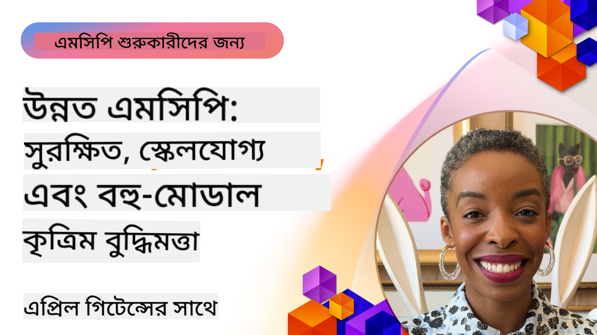

<!--
CO_OP_TRANSLATOR_METADATA:
{
  "original_hash": "d204bc94ea6027d06a703b21b711ca57",
  "translation_date": "2025-08-18T14:59:28+00:00",
  "source_file": "05-AdvancedTopics/README.md",
  "language_code": "bn"
}
-->
# MCP-এর উন্নত বিষয়সমূহ

_(উপরের ছবিতে ক্লিক করে এই পাঠের ভিডিও দেখুন)_

এই অধ্যায়ে Model Context Protocol (MCP) বাস্তবায়নের উন্নত বিষয়গুলো আলোচনা করা হয়েছে, যার মধ্যে রয়েছে মাল্টি-মোডাল ইন্টিগ্রেশন, স্কেলেবিলিটি, নিরাপত্তার সেরা অনুশীলন, এবং এন্টারপ্রাইজ ইন্টিগ্রেশন। এই বিষয়গুলো আধুনিক AI সিস্টেমের চাহিদা পূরণের জন্য শক্তিশালী এবং প্রোডাকশন-রেডি MCP অ্যাপ্লিকেশন তৈরি করতে অত্যন্ত গুরুত্বপূর্ণ।

## সংক্ষিপ্ত বিবরণ

এই পাঠে Model Context Protocol বাস্তবায়নের উন্নত ধারণাগুলো নিয়ে আলোচনা করা হয়েছে, যার মধ্যে রয়েছে মাল্টি-মোডাল ইন্টিগ্রেশন, স্কেলেবিলিটি, নিরাপত্তার সেরা অনুশীলন, এবং এন্টারপ্রাইজ ইন্টিগ্রেশন। এই বিষয়গুলো এমন MCP অ্যাপ্লিকেশন তৈরি করতে অপরিহার্য, যা এন্টারপ্রাইজ পরিবেশে জটিল চাহিদা পূরণ করতে সক্ষম।

## শেখার লক্ষ্যসমূহ

এই পাঠ শেষে আপনি সক্ষম হবেন:

- MCP ফ্রেমওয়ার্কে মাল্টি-মোডাল সক্ষমতা বাস্তবায়ন করতে
- উচ্চ-চাহিদার পরিস্থিতির জন্য স্কেলযোগ্য MCP আর্কিটেকচার ডিজাইন করতে
- MCP-এর নিরাপত্তা নীতিমালার সাথে সামঞ্জস্যপূর্ণ নিরাপত্তার সেরা অনুশীলন প্রয়োগ করতে
- MCP-কে এন্টারপ্রাইজ AI সিস্টেম এবং ফ্রেমওয়ার্কের সাথে ইন্টিগ্রেট করতে
- প্রোডাকশন পরিবেশে পারফরম্যান্স এবং নির্ভরযোগ্যতা অপ্টিমাইজ করতে

## পাঠ এবং নমুনা প্রকল্পসমূহ

| লিংক | শিরোনাম | বিবরণ |
|------|---------|--------|
| [5.1 Integration with Azure](./mcp-integration/README.md) | Azure-এর সাথে ইন্টিগ্রেশন | শিখুন কীভাবে আপনার MCP সার্ভারকে Azure-এ ইন্টিগ্রেট করবেন |
| [5.2 Multi modal sample](./mcp-multi-modality/README.md) | MCP মাল্টি-মোডাল নমুনা | অডিও, ইমেজ এবং মাল্টি-মোডাল রেসপন্সের নমুনা |
| [5.3 MCP OAuth2 sample](../../../05-AdvancedTopics/mcp-oauth2-demo) | MCP OAuth2 ডেমো | OAuth2 সহ MCP-এর একটি মিনিমাল Spring Boot অ্যাপ। এটি অথরাইজেশন এবং রিসোর্স সার্ভার হিসেবে নিরাপদ টোকেন ইস্যু, প্রোটেক্টেড এন্ডপয়েন্ট, Azure Container Apps-এ ডিপ্লয়মেন্ট এবং API ম্যানেজমেন্ট ইন্টিগ্রেশন প্রদর্শন করে। |
| [5.4 Root Contexts](./mcp-root-contexts/README.md) | রুট কনটেক্সট | রুট কনটেক্সট এবং সেগুলো কীভাবে বাস্তবায়ন করবেন তা শিখুন |
| [5.5 Routing](./mcp-routing/README.md) | রাউটিং | বিভিন্ন ধরনের রাউটিং শিখুন |
| [5.6 Sampling](./mcp-sampling/README.md) | স্যাম্পলিং | স্যাম্পলিং নিয়ে কাজ করার পদ্ধতি শিখুন |
| [5.7 Scaling](./mcp-scaling/README.md) | স্কেলিং | স্কেলিং সম্পর্কে জানুন |
| [5.8 Security](./mcp-security/README.md) | নিরাপত্তা | আপনার MCP সার্ভারকে সুরক্ষিত করুন |
| [5.9 Web Search sample](./web-search-mcp/README.md) | ওয়েব সার্চ MCP | Python MCP সার্ভার এবং ক্লায়েন্ট যা SerpAPI-এর সাথে ইন্টিগ্রেট করে রিয়েল-টাইম ওয়েব, নিউজ, প্রোডাক্ট সার্চ এবং Q&A প্রদান করে। এটি মাল্টি-টুল অর্কেস্ট্রেশন, এক্সটার্নাল API ইন্টিগ্রেশন এবং শক্তিশালী ত্রুটি পরিচালনা প্রদর্শন করে। |
| [5.10 Realtime Streaming](./mcp-realtimestreaming/README.md) | স্ট্রিমিং | রিয়েল-টাইম ডেটা স্ট্রিমিং আজকের ডেটা-চালিত বিশ্বে অত্যাবশ্যক হয়ে উঠেছে, যেখানে ব্যবসা এবং অ্যাপ্লিকেশনগুলোকে সময়মতো সিদ্ধান্ত নিতে তাৎক্ষণিক তথ্যের প্রয়োজন হয়। |
| [5.11 Realtime Web Search](./mcp-realtimesearch/README.md) | ওয়েব সার্চ | রিয়েল-টাইম ওয়েব সার্চ কীভাবে MCP রিয়েল-টাইম ওয়েব সার্চকে রূপান্তরিত করে, তা দেখায়। এটি AI মডেল, সার্চ ইঞ্জিন এবং অ্যাপ্লিকেশন জুড়ে কনটেক্সট ম্যানেজমেন্টের জন্য একটি স্ট্যান্ডার্ডাইজড পদ্ধতি প্রদান করে। |
| [5.12 Entra ID Authentication for Model Context Protocol Servers](./mcp-security-entra/README.md) | Entra ID অথেনটিকেশন | Microsoft Entra ID একটি শক্তিশালী ক্লাউড-ভিত্তিক পরিচয় এবং অ্যাক্সেস ম্যানেজমেন্ট সমাধান প্রদান করে, যা নিশ্চিত করে যে শুধুমাত্র অনুমোদিত ব্যবহারকারী এবং অ্যাপ্লিকেশনগুলোই আপনার MCP সার্ভারের সাথে ইন্টারঅ্যাক্ট করতে পারে। |
| [5.13 Azure AI Foundry Agent Integration](./mcp-foundry-agent-integration/README.md) | Azure AI Foundry ইন্টিগ্রেশন | Model Context Protocol সার্ভারগুলোকে Azure AI Foundry এজেন্টের সাথে ইন্টিগ্রেট করার পদ্ধতি শিখুন, যা শক্তিশালী টুল অর্কেস্ট্রেশন এবং এন্টারপ্রাইজ AI সক্ষমতা প্রদান করে। এটি স্ট্যান্ডার্ডাইজড এক্সটার্নাল ডেটা সোর্স সংযোগের সুবিধা দেয়। |
| [5.14 Context Engineering](./mcp-contextengineering/README.md) | কনটেক্সট ইঞ্জিনিয়ারিং | MCP সার্ভারের জন্য কনটেক্সট ইঞ্জিনিয়ারিং কৌশলগুলোর ভবিষ্যৎ সম্ভাবনা, যার মধ্যে রয়েছে কনটেক্সট অপ্টিমাইজেশন, ডায়নামিক কনটেক্সট ম্যানেজমেন্ট এবং MCP ফ্রেমওয়ার্কে কার্যকর প্রম্পট ইঞ্জিনিয়ারিংয়ের কৌশল। |

## অতিরিক্ত রেফারেন্স

MCP-এর উন্নত বিষয়গুলো নিয়ে সর্বশেষ তথ্যের জন্য দেখুন:
- [MCP Documentation](https://modelcontextprotocol.io/)
- [MCP Specification](https://spec.modelcontextprotocol.io/)
- [GitHub Repository](https://github.com/modelcontextprotocol)

## মূল বিষয়গুলো

- মাল্টি-মোডাল MCP বাস্তবায়ন AI-এর সক্ষমতাকে টেক্সট প্রসেসিংয়ের বাইরে প্রসারিত করে
- এন্টারপ্রাইজ ডিপ্লয়মেন্টের জন্য স্কেলেবিলিটি অত্যাবশ্যক এবং এটি হরিজন্টাল এবং ভার্টিকাল স্কেলিংয়ের মাধ্যমে সমাধান করা যায়
- বিস্তৃত নিরাপত্তা ব্যবস্থা ডেটা সুরক্ষিত করে এবং সঠিক অ্যাক্সেস নিয়ন্ত্রণ নিশ্চিত করে
- Azure OpenAI এবং Microsoft AI Foundry-এর মতো প্ল্যাটফর্মের সাথে এন্টারপ্রাইজ ইন্টিগ্রেশন MCP-এর সক্ষমতাকে উন্নত করে
- উন্নত MCP বাস্তবায়ন অপ্টিমাইজড আর্কিটেকচার এবং যত্নশীল রিসোর্স ম্যানেজমেন্ট থেকে উপকৃত হয়

## অনুশীলন

একটি নির্দিষ্ট ব্যবহার ক্ষেত্রে এন্টারপ্রাইজ-গ্রেড MCP বাস্তবায়ন ডিজাইন করুন:

1. আপনার ব্যবহার ক্ষেত্রে মাল্টি-মোডাল প্রয়োজনীয়তা চিহ্নিত করুন
2. সংবেদনশীল ডেটা সুরক্ষার জন্য প্রয়োজনীয় নিরাপত্তা নিয়ন্ত্রণের রূপরেখা তৈরি করুন
3. পরিবর্তনশীল লোড পরিচালনা করতে সক্ষম একটি স্কেলযোগ্য আর্কিটেকচার ডিজাইন করুন
4. এন্টারপ্রাইজ AI সিস্টেমের সাথে ইন্টিগ্রেশন পয়েন্ট পরিকল্পনা করুন
5. সম্ভাব্য পারফরম্যান্স সমস্যাগুলো এবং সেগুলোর সমাধানের কৌশল ডকুমেন্ট করুন

## অতিরিক্ত সম্পদ

- [Azure OpenAI Documentation](https://learn.microsoft.com/en-us/azure/ai-services/openai/)
- [Microsoft AI Foundry Documentation](https://learn.microsoft.com/en-us/ai-services/)

---

## পরবর্তী ধাপ

- [5.1 MCP Integration](./mcp-integration/README.md)

**অস্বীকৃতি**:  
এই নথিটি AI অনুবাদ পরিষেবা [Co-op Translator](https://github.com/Azure/co-op-translator) ব্যবহার করে অনুবাদ করা হয়েছে। আমরা যথাসাধ্য সঠিকতা নিশ্চিত করার চেষ্টা করি, তবে অনুগ্রহ করে মনে রাখবেন যে স্বয়ংক্রিয় অনুবাদে ত্রুটি বা অসঙ্গতি থাকতে পারে। মূল ভাষায় থাকা নথিটিকে প্রামাণিক উৎস হিসেবে বিবেচনা করা উচিত। গুরুত্বপূর্ণ তথ্যের জন্য, পেশাদার মানব অনুবাদ সুপারিশ করা হয়। এই অনুবাদ ব্যবহারের ফলে কোনো ভুল বোঝাবুঝি বা ভুল ব্যাখ্যা হলে আমরা দায়বদ্ধ থাকব না।