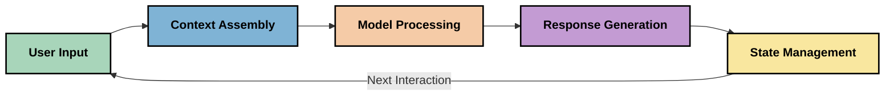
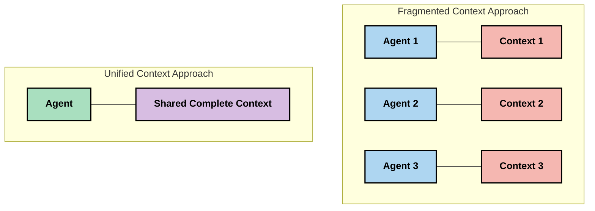
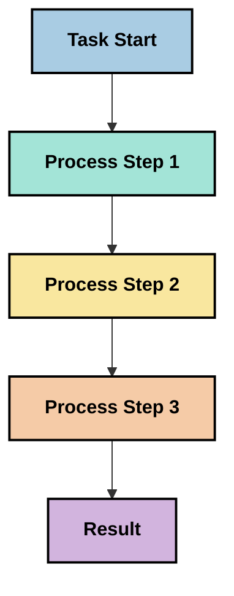
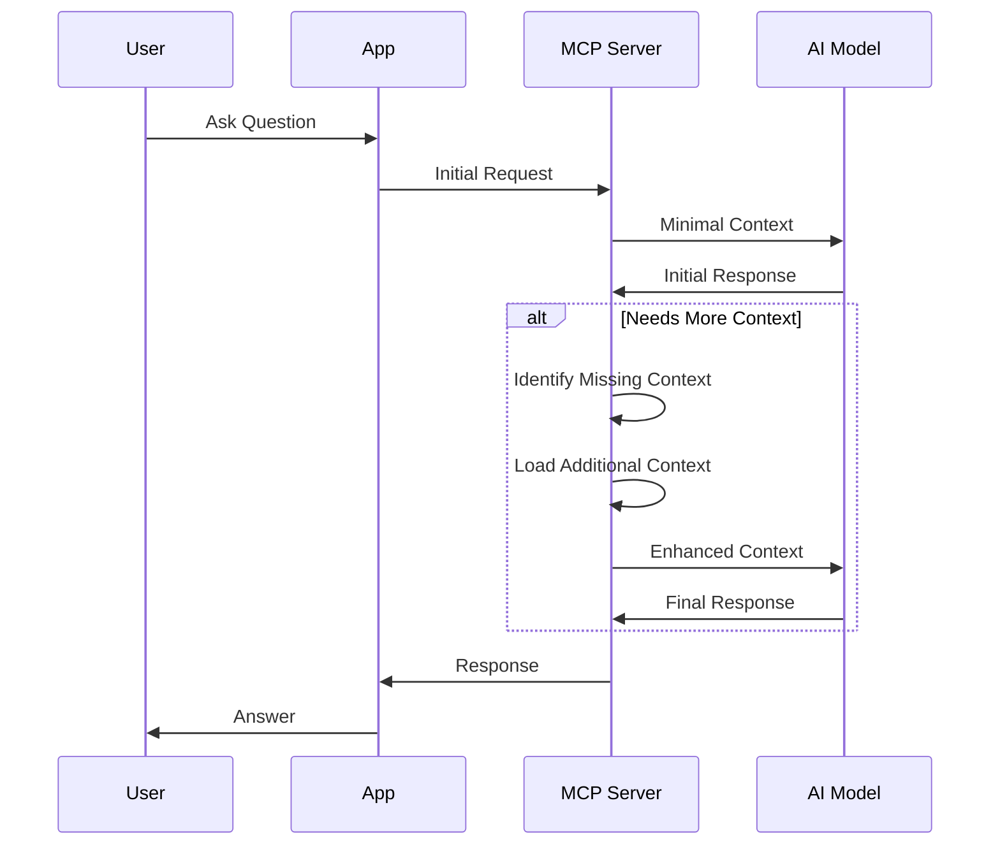
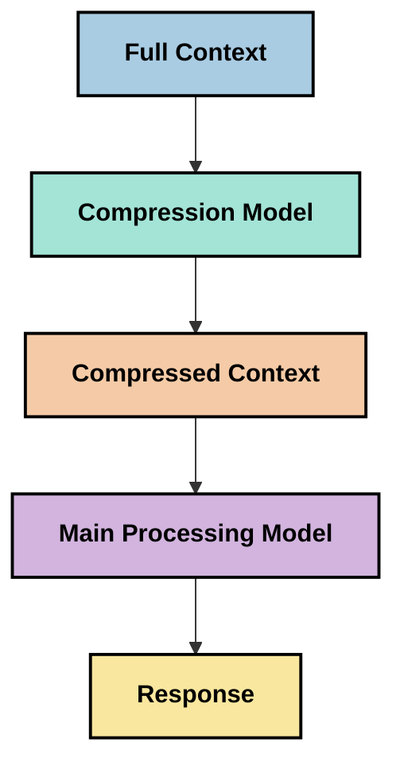

<!--
CO_OP_TRANSLATOR_METADATA:
{
  "original_hash": "5762e8e74dd99d8b7dbb31e69a82561e",
  "translation_date": "2025-07-17T01:40:15+00:00",
  "source_file": "05-AdvancedTopics/mcp-contextengineering/README.md",
  "language_code": "bn"
}
-->
# Context Engineering: MCP ইকোসিস্টেমে একটি উদীয়মান ধারণা

## ওভারভিউ

Context engineering হলো AI ক্ষেত্রে একটি উদীয়মান ধারণা যা অনুসন্ধান করে কিভাবে তথ্য গঠন করা হয়, সরবরাহ করা হয় এবং ক্লায়েন্ট ও AI সেবার মধ্যে ইন্টারঅ্যাকশনের সময় তা রক্ষণাবেক্ষণ করা হয়। Model Context Protocol (MCP) ইকোসিস্টেমের বিকাশের সাথে সাথে, প্রাসঙ্গিকতা কার্যকরভাবে পরিচালনা করার গুরুত্ব ক্রমবর্ধমান হচ্ছে। এই মডিউলটি context engineering ধারণাটি পরিচয় করিয়ে দেয় এবং MCP বাস্তবায়নে এর সম্ভাব্য প্রয়োগগুলি অন্বেষণ করে।

## শেখার উদ্দেশ্য

এই মডিউল শেষ করার পর, আপনি সক্ষম হবেন:

- context engineering এর উদীয়মান ধারণা এবং MCP অ্যাপ্লিকেশনগুলিতে এর সম্ভাব্য ভূমিকা বোঝা
- context ব্যবস্থাপনায় MCP প্রোটোকল ডিজাইন যে মূল চ্যালেঞ্জগুলি সমাধান করে তা চিহ্নিত করা
- উন্নত context হ্যান্ডলিংয়ের মাধ্যমে মডেল পারফরম্যান্স বাড়ানোর কৌশল অন্বেষণ করা
- context কার্যকারিতা পরিমাপ ও মূল্যায়নের পদ্ধতি বিবেচনা করা
- MCP ফ্রেমওয়ার্কের মাধ্যমে AI অভিজ্ঞতা উন্নত করতে এই উদীয়মান ধারণাগুলি প্রয়োগ করা

## Context Engineering এর পরিচিতি

Context engineering হলো একটি উদীয়মান ধারণা যা ব্যবহারকারী, অ্যাপ্লিকেশন এবং AI মডেলের মধ্যে তথ্য প্রবাহের সচেতন ডিজাইন ও ব্যবস্থাপনায় কেন্দ্রীভূত। prompt engineering এর মতো প্রতিষ্ঠিত ক্ষেত্রের থেকে ভিন্ন, context engineering এখনও প্র্যাকটিশনারদের দ্বারা সংজ্ঞায়িত হচ্ছে যারা AI মডেলকে সঠিক সময়ে সঠিক তথ্য প্রদান করার অনন্য চ্যালেঞ্জগুলি সমাধান করার চেষ্টা করছেন।

বড় ভাষা মডেল (LLMs) বিকশিত হওয়ার সাথে সাথে context এর গুরুত্ব ক্রমবর্ধমান স্পষ্ট হয়ে উঠেছে। আমরা যে context প্রদান করি তার গুণমান, প্রাসঙ্গিকতা এবং গঠন সরাসরি মডেল আউটপুটকে প্রভাবিত করে। Context engineering এই সম্পর্কটি অন্বেষণ করে এবং কার্যকর context ব্যবস্থাপনার জন্য নীতিমালা বিকাশের চেষ্টা করে।

> "২০২৫ সালে, মডেলগুলো অত্যন্ত বুদ্ধিমান। কিন্তু সবচেয়ে বুদ্ধিমান মানুষও তাদের কাজ কার্যকরভাবে করতে পারবে না যদি তারা যা করতে বলা হচ্ছে তার প্রাসঙ্গিকতা না জানে... 'Context engineering' হলো prompt engineering এর পরবর্তী স্তর। এটি একটি গতিশীল সিস্টেমে স্বয়ংক্রিয়ভাবে এটি করার ব্যাপার।" — Walden Yan, Cognition AI

Context engineering অন্তর্ভুক্ত করতে পারে:

1. **Context Selection**: নির্ধারণ করা কোন তথ্য একটি নির্দিষ্ট কাজের জন্য প্রাসঙ্গিক
2. **Context Structuring**: তথ্যকে এমনভাবে সংগঠিত করা যাতে মডেল সহজে বুঝতে পারে
3. **Context Delivery**: তথ্য মডেলে কখন এবং কিভাবে পাঠানো হবে তা অপ্টিমাইজ করা
4. **Context Maintenance**: সময়ের সাথে context এর অবস্থা ও পরিবর্তন পরিচালনা করা
5. **Context Evaluation**: context এর কার্যকারিতা পরিমাপ ও উন্নত করা

এই ফোকাসের ক্ষেত্রগুলি MCP ইকোসিস্টেমের জন্য বিশেষভাবে প্রাসঙ্গিক, যা অ্যাপ্লিকেশনগুলোকে LLMs এর কাছে context প্রদান করার জন্য একটি মানক পদ্ধতি প্রদান করে।

## Context Journey এর দৃষ্টিভঙ্গি

Context engineering কে বোঝার একটি উপায় হলো MCP সিস্টেমের মাধ্যমে তথ্যের যাত্রাপথ অনুসরণ করা:



### Context Journey এর মূল ধাপসমূহ:

1. **User Input**: ব্যবহারকারীর কাছ থেকে কাঁচা তথ্য (টেক্সট, ছবি, ডকুমেন্ট)
2. **Context Assembly**: ব্যবহারকারীর ইনপুটকে সিস্টেম context, কথোপকথনের ইতিহাস এবং অন্যান্য প্রাপ্ত তথ্যের সাথে মিলিয়ে একত্রিত করা
3. **Model Processing**: AI মডেল একত্রিত context প্রক্রিয়াকরণ করে
4. **Response Generation**: মডেল প্রদত্ত context এর ভিত্তিতে আউটপুট তৈরি করে
5. **State Management**: ইন্টারঅ্যাকশনের ভিত্তিতে সিস্টেম তার অভ্যন্তরীণ অবস্থা আপডেট করে

এই দৃষ্টিভঙ্গি AI সিস্টেমে context এর গতিশীল প্রকৃতি তুলে ধরে এবং প্রতিটি ধাপে তথ্য পরিচালনার সেরা উপায় সম্পর্কে গুরুত্বপূর্ণ প্রশ্ন তোলে।

## Context Engineering এর উদীয়মান নীতিমালা

Context engineering ক্ষেত্র গড়ে উঠার সাথে সাথে কিছু প্রাথমিক নীতিমালা প্র্যাকটিশনারদের কাছ থেকে উদীয়মান হচ্ছে। এই নীতিমালা MCP বাস্তবায়নের সিদ্ধান্তে সহায়ক হতে পারে:

### নীতি ১: Context সম্পূর্ণভাবে শেয়ার করুন

Context সিস্টেমের সব উপাদানের মধ্যে সম্পূর্ণরূপে শেয়ার করা উচিত, একাধিক এজেন্ট বা প্রক্রিয়ায় বিভক্ত হওয়া উচিত নয়। যখন context বিভক্ত হয়, সিস্টেমের এক অংশে নেওয়া সিদ্ধান্ত অন্য অংশের সিদ্ধান্তের সাথে বিরোধ সৃষ্টি করতে পারে।



MCP অ্যাপ্লিকেশনগুলিতে, এর অর্থ হলো এমন সিস্টেম ডিজাইন করা যেখানে context পুরো পাইপলাইনের মাধ্যমে নির্বিঘ্নে প্রবাহিত হয়, বিভক্ত নয়।

### নীতি ২: বুঝুন যে প্রতিটি ক্রিয়াই অন্তর্নিহিত সিদ্ধান্ত বহন করে

মডেল যে প্রতিটি কাজ করে তা context ব্যাখ্যার বিষয়ে অন্তর্নিহিত সিদ্ধান্ত বহন করে। যখন একাধিক উপাদান ভিন্ন ভিন্ন context নিয়ে কাজ করে, তখন এই অন্তর্নিহিত সিদ্ধান্তগুলি বিরোধ সৃষ্টি করতে পারে, যার ফলে অসঙ্গত ফলাফল হয়।

এই নীতির MCP অ্যাপ্লিকেশনগুলিতে গুরুত্বপূর্ণ প্রভাব রয়েছে:
- বিভক্ত context সহ সমান্তরাল কার্যকরীর পরিবর্তে জটিল কাজের জন্য রৈখিক প্রক্রিয়াকরণ পছন্দ করুন
- নিশ্চিত করুন যে সব সিদ্ধান্ত গ্রহণের পয়েন্ট একই context তথ্য অ্যাক্সেস করতে পারে
- এমন সিস্টেম ডিজাইন করুন যেখানে পরবর্তী ধাপগুলি পূর্ববর্তী সিদ্ধান্তের সম্পূর্ণ context দেখতে পারে

### নীতি ৩: Context গভীরতা এবং উইন্ডো সীমাবদ্ধতার মধ্যে ভারসাম্য বজায় রাখুন

কথোপকথন ও প্রক্রিয়া দীর্ঘ হওয়ার সাথে সাথে context উইন্ডো শেষ হয়ে যায়। কার্যকর context engineering এই ব্যাপ্তি এবং প্রযুক্তিগত সীমাবদ্ধতার মধ্যে ভারসাম্য বজায় রাখার পদ্ধতি অনুসন্ধান করে।

সম্ভাব্য পদ্ধতিগুলো অন্তর্ভুক্ত:

- context কম্প্রেশন যা প্রয়োজনীয় তথ্য বজায় রেখে টোকেন ব্যবহার কমায়
- প্রাসঙ্গিকতার ভিত্তিতে context প্রগতিশীলভাবে লোড করা
- পূর্ববর্তী ইন্টারঅ্যাকশনের সারাংশ তৈরি করা, মূল সিদ্ধান্ত ও তথ্য সংরক্ষণ করে

## Context চ্যালেঞ্জ এবং MCP প্রোটোকল ডিজাইন

Model Context Protocol (MCP) context ব্যবস্থাপনার অনন্য চ্যালেঞ্জগুলি বিবেচনা করে ডিজাইন করা হয়েছে। এই চ্যালেঞ্জগুলি বোঝা MCP প্রোটোকল ডিজাইনের মূল দিকগুলি ব্যাখ্যা করতে সাহায্য করে:

### চ্যালেঞ্জ ১: Context উইন্ডো সীমাবদ্ধতা

অধিকাংশ AI মডেলের context উইন্ডোর আকার নির্দিষ্ট, যা একবারে প্রক্রিয়াকৃত তথ্যের পরিমাণ সীমাবদ্ধ করে।

**MCP ডিজাইন প্রতিক্রিয়া:**  
- প্রোটোকল সমর্থন করে কাঠামোবদ্ধ, রিসোর্স-ভিত্তিক context যা দক্ষতার সাথে রেফারেন্স করা যায়  
- রিসোর্সগুলো পেজিনেটেড এবং প্রগতিশীলভাবে লোড করা যায়  

### চ্যালেঞ্জ ২: প্রাসঙ্গিকতা নির্ধারণ

কোন তথ্য context এ অন্তর্ভুক্ত করা উচিত তা নির্ধারণ করা কঠিন।

**MCP ডিজাইন প্রতিক্রিয়া:**  
- প্রয়োজন অনুযায়ী তথ্য ডাইনামিকভাবে রিট্রিভ করার জন্য নমনীয় টুলিং  
- ধারাবাহিক context সংগঠনের জন্য কাঠামোবদ্ধ প্রম্পট  

### চ্যালেঞ্জ ৩: Context স্থায়িত্ব

ইন্টারঅ্যাকশনের মধ্যে অবস্থা পরিচালনা করার জন্য context ট্র্যাকিং প্রয়োজন।

**MCP ডিজাইন প্রতিক্রিয়া:**  
- স্ট্যান্ডার্ডাইজড সেশন ম্যানেজমেন্ট  
- context পরিবর্তনের জন্য স্পষ্ট ইন্টারঅ্যাকশন প্যাটার্ন  

### চ্যালেঞ্জ ৪: মাল্টি-মোডাল Context

বিভিন্ন ধরনের ডেটা (টেক্সট, ছবি, কাঠামোবদ্ধ ডেটা) ভিন্ন হ্যান্ডলিং প্রয়োজন।

**MCP ডিজাইন প্রতিক্রিয়া:**  
- বিভিন্ন কন্টেন্ট টাইপের জন্য প্রোটোকল ডিজাইন  
- মাল্টি-মোডাল তথ্যের স্ট্যান্ডার্ডাইজড উপস্থাপনা  

### চ্যালেঞ্জ ৫: নিরাপত্তা ও গোপনীয়তা

Context প্রায়ই সংবেদনশীল তথ্য ধারণ করে যা সুরক্ষিত রাখতে হবে।

**MCP ডিজাইন প্রতিক্রিয়া:**  
- ক্লায়েন্ট ও সার্ভারের দায়িত্বের মধ্যে স্পষ্ট সীমানা  
- ডেটা এক্সপোজার কমানোর জন্য স্থানীয় প্রক্রিয়াকরণ বিকল্প  

এই চ্যালেঞ্জগুলি বোঝা এবং MCP কীভাবে এগুলো মোকাবেলা করে তা আরও উন্নত context engineering কৌশল অন্বেষণের ভিত্তি প্রদান করে।

## উদীয়মান Context Engineering পদ্ধতি

Context engineering ক্ষেত্র বিকাশের সাথে সাথে কয়েকটি প্রতিশ্রুতিশীল পদ্ধতি উদীয়মান হচ্ছে। এগুলো প্রতিষ্ঠিত সেরা অনুশীলন নয়, বরং বর্তমান চিন্তাভাবনা যা MCP বাস্তবায়নের অভিজ্ঞতা বাড়ার সাথে সাথে পরিবর্তিত হতে পারে।

### ১. সিঙ্গেল-থ্রেডেড রৈখিক প্রক্রিয়াকরণ

বিভিন্ন এজেন্ট আর্কিটেকচারের বিপরীতে যা context বিতরণ করে, কিছু প্র্যাকটিশনার দেখছেন যে সিঙ্গেল-থ্রেডেড রৈখিক প্রক্রিয়াকরণ বেশি সঙ্গতিপূর্ণ ফলাফল দেয়। এটি ঐক্যবদ্ধ context বজায় রাখার নীতির সাথে সামঞ্জস্যপূর্ণ।



যদিও এই পদ্ধতি সমান্তরাল প্রক্রিয়াকরণের তুলনায় কম দক্ষ মনে হতে পারে, এটি প্রায়ই বেশি সুসংগত এবং নির্ভরযোগ্য ফলাফল দেয় কারণ প্রতিটি ধাপ পূর্ববর্তী সিদ্ধান্তের সম্পূর্ণ বোঝাপড়ার উপর ভিত্তি করে গড়ে ওঠে।

### ২. Context Chunking এবং অগ্রাধিকার নির্ধারণ

বড় context গুলোকে পরিচালনাযোগ্য অংশে ভাগ করা এবং সবচেয়ে গুরুত্বপূর্ণ অংশগুলোকে অগ্রাধিকার দেওয়া।

```python
# Conceptual Example: Context Chunking and Prioritization
def process_with_chunked_context(documents, query):
    # 1. Break documents into smaller chunks
    chunks = chunk_documents(documents)
    
    # 2. Calculate relevance scores for each chunk
    scored_chunks = [(chunk, calculate_relevance(chunk, query)) for chunk in chunks]
    
    # 3. Sort chunks by relevance score
    sorted_chunks = sorted(scored_chunks, key=lambda x: x[1], reverse=True)
    
    # 4. Use the most relevant chunks as context
    context = create_context_from_chunks([chunk for chunk, score in sorted_chunks[:5]])
    
    # 5. Process with the prioritized context
    return generate_response(context, query)
```

উপরের ধারণাটি দেখায় কিভাবে বড় ডকুমেন্টগুলোকে ছোট অংশে ভাগ করে শুধুমাত্র সবচেয়ে প্রাসঙ্গিক অংশগুলো context হিসেবে নির্বাচন করা যায়। এই পদ্ধতি context উইন্ডো সীমাবদ্ধতার মধ্যে কাজ করতে সাহায্য করে এবং বড় জ্ঞানভাণ্ডার ব্যবহার করতে দেয়।

### ৩. প্রগতিশীল Context লোডিং

একবারে সব context লোড করার পরিবর্তে প্রয়োজন অনুযায়ী ধাপে ধাপে লোড করা।



প্রগতিশীল context লোডিং শুরু হয় ন্যূনতম context দিয়ে এবং প্রয়োজন হলে বাড়ানো হয়। এটি সহজ প্রশ্নের জন্য টোকেন ব্যবহারে উল্লেখযোগ্য হ্রাস ঘটায় এবং জটিল প্রশ্ন পরিচালনার ক্ষমতা বজায় রাখে।

### ৪. Context কম্প্রেশন এবং সারাংশ তৈরি

প্রয়োজনীয় তথ্য সংরক্ষণ করে context আকার কমানো।



Context কম্প্রেশন ফোকাস করে:  
- পুনরাবৃত্ত তথ্য অপসারণ  
- দীর্ঘ বিষয়বস্তু সারাংশ তৈরি  
- মূল তথ্য ও বিস্তারিত আহরণ  
- গুরুত্বপূর্ণ context উপাদান সংরক্ষণ  
- টোকেন দক্ষতার জন্য অপ্টিমাইজেশন  

এই পদ্ধতি দীর্ঘ কথোপকথন context উইন্ডোর মধ্যে রাখা বা বড় ডকুমেন্ট কার্যকরভাবে প্রক্রিয়াকরণের জন্য বিশেষভাবে মূল্যবান। কিছু প্র্যাকটিশনার context কম্প্রেশন এবং কথোপকথন ইতিহাসের সারাংশ তৈরির জন্য বিশেষায়িত মডেল ব্যবহার করছেন।

## অনুসন্ধানমূলক Context Engineering বিবেচনা

Context engineering এর উদীয়মান ক্ষেত্র অন্বেষণ করার সময় MCP বাস্তবায়নের ক্ষেত্রে কিছু বিবেচনা মনে রাখা উচিত। এগুলো নির্দেশমূলক সেরা অনুশীলন নয়, বরং এমন ক্ষেত্র যা আপনার নির্দিষ্ট ব্যবহারে উন্নতি আনতে পারে।

### আপনার Context লক্ষ্য বিবেচনা করুন

জটিল context ব্যবস্থাপনা সমাধান বাস্তবায়নের আগে স্পষ্টভাবে নির্ধারণ করুন আপনি কী অর্জন করতে চান:  
- মডেল সফল হতে কোন নির্দিষ্ট তথ্য প্রয়োজন?  
- কোন তথ্য অপরিহার্য এবং কোনটি অতিরিক্ত?  
- আপনার পারফরম্যান্স সীমাবদ্ধতা কী (লেটেন্সি, টোকেন সীমা, খরচ)?  

### স্তরভিত্তিক Context পদ্ধতি অন্বেষণ করুন

কিছু প্র্যাকটিশনার ধারণাগত স্তরে context সাজিয়ে সফলতা পাচ্ছেন:  
- **Core Layer**: মডেলের জন্য সর্বদা প্রয়োজনীয় তথ্য  
- **Situational Layer**: চলমান ইন্টারঅ্যাকশনের নির্দিষ্ট context  
- **Supporting Layer**: অতিরিক্ত তথ্য যা সহায়ক হতে পারে  
- **Fallback Layer**: প্রয়োজন হলে অ্যাক্সেস করা তথ্য  

### রিট্রিভাল কৌশল পরীক্ষা করুন

আপনার context এর কার্যকারিতা প্রায়ই নির্ভর করে তথ্য কীভাবে রিট্রিভ করা হয় তার উপর:  
- ধারণাগত প্রাসঙ্গিক তথ্য খুঁজতে সেমান্টিক সার্চ ও এমবেডিং  
- নির্দিষ্ট তথ্যের জন্য কীওয়ার্ড ভিত্তিক সার্চ  
- একাধিক রিট্রিভাল পদ্ধতির সংমিশ্রণ  
- বিভাগ, তারিখ বা উৎসের ভিত্তিতে মেটাডেটা ফিল্টারিং  

### Context সামঞ্জস্য পরীক্ষা করুন

আপনার context এর গঠন ও প্রবাহ মডেল বোঝাপড়াকে প্রভাবিত করতে পারে:  
- সম্পর্কিত তথ্য একত্রিত করা  
- ধারাবাহিক ফরম্যাটিং ও সংগঠন ব্যবহার করা  
- যৌক্তিক বা কালানুক্রমিক ক্রম বজায় রাখা যেখানে প্রযোজ্য  
- বিরোধপূর্ণ তথ্য এড়ানো  

### মাল্টি-এজেন্ট আর্কিটেকচারের সুবিধা-অসুবিধা বিবেচনা করুন

যদিও মাল্টি-এজেন্ট আর্কিটেকচার অনেক AI ফ্রেমওয়ার্কে জনপ্রিয়, context ব্যবস্থাপনায় এর উল্লেখযোগ্য চ্যালেঞ্জ রয়েছে:  
- context বিভাজন এজেন্টদের মধ্যে অসঙ্গত সিদ্ধান্তের কারণ হতে পারে  
- সমান্তরাল প্রক্রিয়াকরণ বিরোধ সৃষ্টি করতে পারে যা মীমাংসা কঠিন  
- এজেন্টদের মধ্যে যোগাযোগের অতিরিক্ত ওভারহেড পারফরম্যান্স লাভ কমাতে পারে  
- সামঞ্জস্য বজায় রাখতে জটিল অবস্থা ব্যবস্থাপনা প্রয়োজন  

অনেক ক্ষেত্রে, বিস্তৃত context ব্যবস্থাপনা সহ একক এজেন্ট পদ্ধতি বিভক্ত context সহ একাধিক বিশেষায়িত এজেন্টের চেয়ে বেশি নির্ভরযোগ্য ফলাফল দিতে পারে।

### মূল্যায়ন পদ্ধতি উন্নয়ন করুন

সময়ক্রমে context engineering উন্নত করতে, সফলতা কীভাবে পরিমাপ করবেন তা বিবেচনা করুন:  
- বিভিন্ন context গঠন A/B টেস্টিং  
- টোকেন ব্যবহার ও প্রতিক্রিয়া সময় পর্যবেক্ষণ  
- ব্যবহারকারীর সন্তুষ্টি ও কাজ সম্পন্নের হার ট্র্যাকিং  
- context কৌশল ব্যর্থ হওয়ার কারণ বিশ্লেষণ  

এই বিবেচনাগুলো context engineering ক্ষেত্রে সক্রিয় অনুসন্ধানের অংশ। ক্ষেত্রটি পরিপক্ক হওয়ার সাথে সাথে আরও স্পষ্ট প্যাটার্ন ও অনুশীলন উদীয়মান হবে।

## Context কার্যকারিতা পরিমাপ: একটি বিকাশমান কাঠামো

Context engineering ধারণা হিসেবে উদীয়মান হওয়ায়, প্র্যাকটিশনাররা এর কার্যকারিতা কীভাবে পরিমাপ করা যায় তা অন্বেষণ শুরু করেছেন। এখনো কোনো প্রতিষ্ঠিত কাঠামো নেই, তবে বিভিন্ন মেট্রিক বিবেচনা করা হচ্ছে যা ভবিষ্যতের কাজের পথনির্দেশ করতে পারে।

### সম্ভাব্য পরিমাপ মাত্রা

#### ১. ইনপুট দক্ষতা বিবেচনা

- **Context-to-Response অনুপাত**: প্রতিক্রিয়ার আকারের তুলনায় কত context প্রয়োজন?  
- **টোকেন ব্যবহার**: প্রদত্ত context টোকেনের কত শতাংশ প্রতিক্রিয়াকে প্রভাবিত করে?  
- **Context হ্রাস**: কাঁচা তথ্য কতটা কার্যকরভাবে কম্প্রেস করা যায়?  

#### ২. পারফরম্যান্স বিবেচনা

- **লেটেন্সি প্রভাব**: context ব্যবস্থাপনা প্রতিক্রিয়া সময়ে কী প্রভাব ফেলে?  
- **টোকেন অর্থনীতি**: টোকেন ব্যবহার কতটা অপ্টিমাইজ করা হচ্ছে?  
- **রিট্রিভাল নির্ভুলতা**: প্রাপ্ত তথ্য কতটা প্রাসঙ্গিক?  
- **রিসোর্স ব্যবহার**: কত কম্পিউটেশনাল রিসোর্স প্রয়োজন?  

#### ৩. গুণগত বিবেচনা

- **প্রতিক্রিয়া প্রাসঙ্গিকতা**: প্রতিক্রিয়া কতটা প্রশ্নের সাথে সঙ্গতিপূর্ণ?  
- **তথ্যগত সঠিকতা**: context ব্যবস্থাপনা তথ্যগত সঠিকতা বাড়ায় কি?  
- **সঙ্গতি**: একই ধরনের প্রশ্নে প্রতিক্রিয়া কতটা সঙ্গতিপূর্ণ?  
- **হ্যালুসিনেশন হার**: উন্নত context মডেল হ্যালুসিনেশন কমায় কি?  

#### ৪. ব্যবহারকারীর অভিজ্ঞতা বিবেচনা

- **ফলো-আপ হার**: ব্যবহারকারীরা কতবার স্পষ্টকরণের জন্য ফিরে আসে?  
- **কাজ সম্পন্ন**: ব্যবহারকারীরা সফলভাবে তাদের লক্ষ্য অর্জন করে কি?  
- **সন্তুষ্টি সূ
- [Model Context Protocol ওয়েবসাইট](https://modelcontextprotocol.io/)
- [Model Context Protocol স্পেসিফিকেশন](https://github.com/modelcontextprotocol/modelcontextprotocol)
- [MCP ডকুমেন্টেশন](https://modelcontextprotocol.io/docs)
- [MCP C# SDK](https://github.com/modelcontextprotocol/csharp-sdk)
- [MCP Python SDK](https://github.com/modelcontextprotocol/python-sdk)
- [MCP TypeScript SDK](https://github.com/modelcontextprotocol/typescript-sdk)
- [MCP Inspector](https://github.com/modelcontextprotocol/inspector) - MCP সার্ভারের জন্য ভিজ্যুয়াল টেস্টিং টুল

### Context Engineering নিবন্ধসমূহ
- [মাল্টি-এজেন্ট তৈরি করবেন না: Context Engineering এর নীতিমালা](https://cognition.ai/blog/dont-build-multi-agents) - Walden Yan এর context engineering নীতিমালা সম্পর্কে অন্তর্দৃষ্টি
- [এজেন্ট তৈরির একটি ব্যবহারিক গাইড](https://cdn.openai.com/business-guides-and-resources/a-practical-guide-to-building-agents.pdf) - OpenAI এর কার্যকর এজেন্ট ডিজাইনের গাইড
- [কার্যকর এজেন্ট তৈরি](https://www.anthropic.com/engineering/building-effective-agents) - Anthropic এর এজেন্ট উন্নয়নের পদ্ধতি

### সম্পর্কিত গবেষণা
- [বড় ভাষা মডেলের জন্য ডায়নামিক রিট্রিভাল অগমেন্টেশন](https://arxiv.org/abs/2310.01487) - ডায়নামিক রিট্রিভাল পদ্ধতি নিয়ে গবেষণা
- [মধ্যভাগে হারিয়ে যাওয়া: ভাষা মডেল কীভাবে দীর্ঘ প্রসঙ্গ ব্যবহার করে](https://arxiv.org/abs/2307.03172) - প্রসঙ্গ প্রক্রিয়াকরণের গুরুত্বপূর্ণ গবেষণা
- [CLIP Latents দিয়ে হায়ারার্কিকাল টেক্সট-শর্তাধীন ইমেজ জেনারেশন](https://arxiv.org/abs/2204.06125) - DALL-E 2 পেপার, প্রসঙ্গ গঠন সম্পর্কে অন্তর্দৃষ্টি
- [বড় ভাষা মডেল আর্কিটেকচারে প্রসঙ্গের ভূমিকা অনুসন্ধান](https://aclanthology.org/2023.findings-emnlp.124/) - প্রসঙ্গ পরিচালনা নিয়ে সাম্প্রতিক গবেষণা
- [মাল্টি-এজেন্ট সহযোগিতা: একটি সমীক্ষা](https://arxiv.org/abs/2304.03442) - মাল্টি-এজেন্ট সিস্টেম এবং তাদের চ্যালেঞ্জ নিয়ে গবেষণা

### অতিরিক্ত সম্পদ
- [Context Window অপ্টিমাইজেশন কৌশলসমূহ](https://learn.microsoft.com/en-us/azure/ai-services/openai/concepts/context-window)
- [উন্নত RAG কৌশলসমূহ](https://www.microsoft.com/en-us/research/blog/retrieval-augmented-generation-rag-and-frontier-models/)
- [Semantic Kernel ডকুমেন্টেশন](https://github.com/microsoft/semantic-kernel)
- [Context Management এর জন্য AI Toolkit](https://github.com/microsoft/aitoolkit)

## পরবর্তী ধাপ
- [6. কমিউনিটি অবদানসমূহ](../../06-CommunityContributions/README.md)

**অস্বীকৃতি**:  
এই নথিটি AI অনুবাদ সেবা [Co-op Translator](https://github.com/Azure/co-op-translator) ব্যবহার করে অনূদিত হয়েছে। আমরা যথাসাধ্য সঠিকতার চেষ্টা করি, তবে স্বয়ংক্রিয় অনুবাদে ত্রুটি বা অসঙ্গতি থাকতে পারে। মূল নথিটি তার নিজস্ব ভাষায়ই কর্তৃত্বপূর্ণ উৎস হিসেবে বিবেচিত হওয়া উচিত। গুরুত্বপূর্ণ তথ্যের জন্য পেশাদার মানব অনুবাদ গ্রহণ করার পরামর্শ দেওয়া হয়। এই অনুবাদের ব্যবহারে সৃষ্ট কোনো ভুল বোঝাবুঝি বা ভুল ব্যাখ্যার জন্য আমরা দায়ী নই।