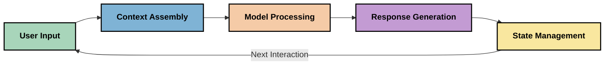
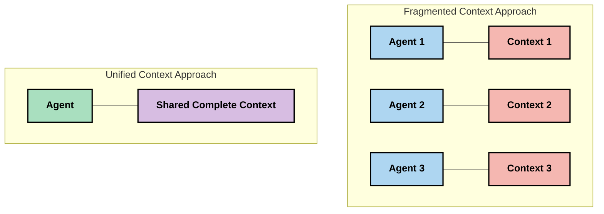
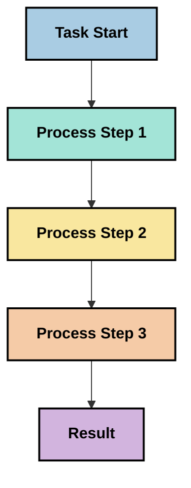
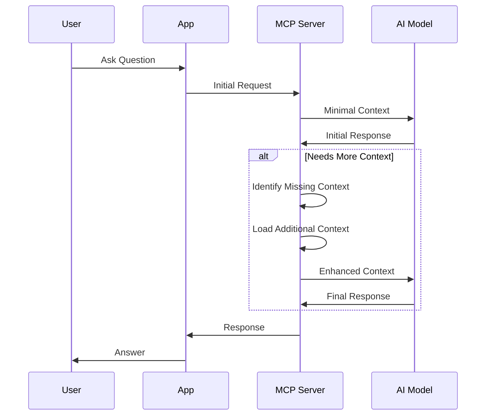
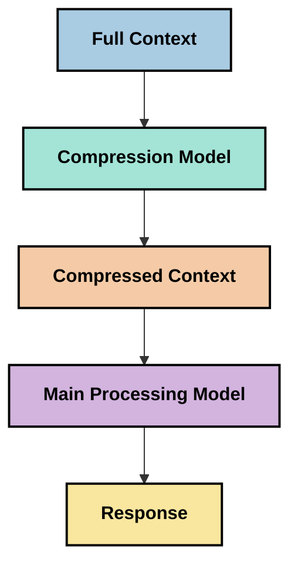

<!--
CO_OP_TRANSLATOR_METADATA:
{
  "original_hash": "fd169ca3071b81b5ee282e194bc823df",
  "translation_date": "2025-09-15T20:06:38+00:00",
  "source_file": "05-AdvancedTopics/mcp-contextengineering/README.md",
  "language_code": "bn"
}
-->
# প্রসঙ্গ প্রকৌশল: MCP ইকোসিস্টেমে একটি উদীয়মান ধারণা

## সংক্ষিপ্ত বিবরণ

প্রসঙ্গ প্রকৌশল AI ক্ষেত্রে একটি উদীয়মান ধারণা যা ক্লায়েন্ট এবং AI পরিষেবার মধ্যে মিথস্ক্রিয়ার সময় তথ্য কীভাবে গঠন, সরবরাহ এবং রক্ষণাবেক্ষণ করা হয় তা অন্বেষণ করে। মডেল প্রসঙ্গ প্রোটোকল (MCP) ইকোসিস্টেম বিকশিত হওয়ার সাথে সাথে, প্রসঙ্গ কার্যকরভাবে পরিচালনা করার গুরুত্ব ক্রমবর্ধমানভাবে গুরুত্বপূর্ণ হয়ে উঠছে। এই মডিউলটি প্রসঙ্গ প্রকৌশলের ধারণা পরিচয় করিয়ে দেয় এবং MCP বাস্তবায়নে এর সম্ভাব্য প্রয়োগগুলি অন্বেষণ করে।

## শিক্ষার উদ্দেশ্য

এই মডিউল শেষে, আপনি সক্ষম হবেন:

- প্রসঙ্গ প্রকৌশলের উদীয়মান ধারণা এবং MCP অ্যাপ্লিকেশনে এর সম্ভাব্য ভূমিকা বুঝতে
- MCP প্রোটোকল ডিজাইন যে প্রসঙ্গ ব্যবস্থাপনার মূল চ্যালেঞ্জগুলি সমাধান করে তা সনাক্ত করতে
- উন্নত প্রসঙ্গ পরিচালনার মাধ্যমে মডেলের কর্মক্ষমতা উন্নত করার কৌশল অন্বেষণ করতে
- প্রসঙ্গ কার্যকারিতা পরিমাপ এবং মূল্যায়নের পদ্ধতি বিবেচনা করতে
- MCP কাঠামোর মাধ্যমে AI অভিজ্ঞতা উন্নত করতে এই উদীয়মান ধারণাগুলি প্রয়োগ করতে

## প্রসঙ্গ প্রকৌশলের পরিচিতি

প্রসঙ্গ প্রকৌশল একটি উদীয়মান ধারণা যা ব্যবহারকারী, অ্যাপ্লিকেশন এবং AI মডেলের মধ্যে তথ্য প্রবাহের ইচ্ছাকৃত নকশা এবং ব্যবস্থাপনার উপর কেন্দ্রীভূত। প্রম্পট প্রকৌশলের মতো প্রতিষ্ঠিত ক্ষেত্রগুলির বিপরীতে, প্রসঙ্গ প্রকৌশল এখনও অনুশীলনকারীদের দ্বারা সংজ্ঞায়িত হচ্ছে কারণ তারা AI মডেলগুলিকে সঠিক সময়ে সঠিক তথ্য সরবরাহ করার অনন্য চ্যালেঞ্জগুলি সমাধান করার জন্য কাজ করছে।

যেহেতু বড় ভাষার মডেল (LLMs) বিকশিত হয়েছে, প্রসঙ্গের গুরুত্ব ক্রমবর্ধমানভাবে স্পষ্ট হয়ে উঠেছে। আমরা যে প্রসঙ্গ প্রদান করি তার গুণমান, প্রাসঙ্গিকতা এবং গঠন সরাসরি মডেলের আউটপুটকে প্রভাবিত করে। প্রসঙ্গ প্রকৌশল এই সম্পর্কটি অন্বেষণ করে এবং কার্যকর প্রসঙ্গ ব্যবস্থাপনার জন্য নীতিগুলি বিকাশ করার চেষ্টা করে।

> "২০২৫ সালে, মডেলগুলি অত্যন্ত বুদ্ধিমান। কিন্তু এমনকি সবচেয়ে স্মার্ট মানুষও তাদের কাজ কার্যকরভাবে করতে পারবে না যদি তারা যা করতে বলা হচ্ছে তার প্রসঙ্গ না থাকে... 'প্রসঙ্গ প্রকৌশল' প্রম্পট প্রকৌশলের পরবর্তী স্তর। এটি একটি গতিশীল সিস্টেমে এটি স্বয়ংক্রিয়ভাবে করার বিষয়ে।" — ওয়ালডেন ইয়ান, কগনিশন AI

প্রসঙ্গ প্রকৌশল অন্তর্ভুক্ত করতে পারে:

1. **প্রসঙ্গ নির্বাচন**: নির্ধারণ করা কোন তথ্য একটি নির্দিষ্ট কাজের জন্য প্রাসঙ্গিক
2. **প্রসঙ্গ গঠন**: মডেলের বোঝার সর্বাধিক করার জন্য তথ্য সংগঠিত করা
3. **প্রসঙ্গ সরবরাহ**: তথ্য কীভাবে এবং কখন মডেলে পাঠানো হবে তা অপ্টিমাইজ করা
4. **প্রসঙ্গ রক্ষণাবেক্ষণ**: সময়ের সাথে প্রসঙ্গের অবস্থা এবং বিবর্তন পরিচালনা করা
5. **প্রসঙ্গ মূল্যায়ন**: প্রসঙ্গের কার্যকারিতা পরিমাপ এবং উন্নত করা

এই ফোকাসের ক্ষেত্রগুলি MCP ইকোসিস্টেমের জন্য বিশেষভাবে প্রাসঙ্গিক, যা LLM-কে প্রসঙ্গ সরবরাহ করার জন্য অ্যাপ্লিকেশনগুলির জন্য একটি মানক উপায় প্রদান করে।

## প্রসঙ্গ যাত্রার দৃষ্টিভঙ্গি

প্রসঙ্গ প্রকৌশলকে কল্পনা করার একটি উপায় হল MCP সিস্টেমের মাধ্যমে তথ্য যে যাত্রা করে তা ট্রেস করা:



### প্রসঙ্গ যাত্রার মূল ধাপসমূহ:

1. **ব্যবহারকারীর ইনপুট**: ব্যবহারকারীর কাছ থেকে কাঁচা তথ্য (টেক্সট, ছবি, ডকুমেন্ট)
2. **প্রসঙ্গ সমাবেশ**: ব্যবহারকারীর ইনপুটকে সিস্টেম প্রসঙ্গ, কথোপকথনের ইতিহাস এবং অন্যান্য পুনরুদ্ধার করা তথ্যের সাথে একত্রিত করা
3. **মডেল প্রক্রিয়াকরণ**: AI মডেল সমাবেশকৃত প্রসঙ্গ প্রক্রিয়া করে
4. **প্রতিক্রিয়া উৎপাদন**: মডেল প্রদত্ত প্রসঙ্গের উপর ভিত্তি করে আউটপুট তৈরি করে
5. **অবস্থা ব্যবস্থাপনা**: সিস্টেম মিথস্ক্রিয়ার উপর ভিত্তি করে তার অভ্যন্তরীণ অবস্থা আপডেট করে

এই দৃষ্টিভঙ্গি AI সিস্টেমে প্রসঙ্গের গতিশীল প্রকৃতি তুলে ধরে এবং প্রতিটি ধাপে তথ্য কীভাবে সর্বোত্তমভাবে পরিচালনা করা যায় সে সম্পর্কে গুরুত্বপূর্ণ প্রশ্ন উত্থাপন করে।

## প্রসঙ্গ প্রকৌশলে উদীয়মান নীতিমালা

প্রসঙ্গ প্রকৌশল ক্ষেত্রটি আকার নিতে শুরু করার সাথে সাথে, অনুশীলনকারীদের কাছ থেকে কিছু প্রাথমিক নীতিমালা উদ্ভূত হচ্ছে। এই নীতিগুলি MCP বাস্তবায়নের পছন্দগুলিকে অবহিত করতে সাহায্য করতে পারে:

### নীতি ১: প্রসঙ্গ সম্পূর্ণভাবে ভাগ করুন

প্রসঙ্গ সিস্টেমের সমস্ত উপাদানের মধ্যে সম্পূর্ণভাবে ভাগ করা উচিত বরং একাধিক এজেন্ট বা প্রক্রিয়ার মধ্যে বিভক্ত হওয়া উচিত। যখন প্রসঙ্গ বিতরণ করা হয়, সিস্টেমের এক অংশে নেওয়া সিদ্ধান্তগুলি অন্য কোথাও নেওয়া সিদ্ধান্তগুলির সাথে বিরোধ করতে পারে।



MCP অ্যাপ্লিকেশনে, এটি পরামর্শ দেয় যে প্রসঙ্গ পাইপলাইনের পুরো অংশে নির্বিঘ্নে প্রবাহিত হয় এমন সিস্টেম ডিজাইন করা উচিত বরং এটি বিভক্ত করা উচিত নয়।

### নীতি ২: বুঝুন যে কর্মগুলি অন্তর্নিহিত সিদ্ধান্ত বহন করে

মডেল যে প্রতিটি কর্ম গ্রহণ করে তা প্রসঙ্গ কীভাবে ব্যাখ্যা করা হবে সে সম্পর্কে অন্তর্নিহিত সিদ্ধান্তকে অন্তর্ভুক্ত করে। যখন একাধিক উপাদান বিভিন্ন প্রসঙ্গে কাজ করে, এই অন্তর্নিহিত সিদ্ধান্তগুলি বিরোধ করতে পারে, যার ফলে অসঙ্গত ফলাফল হয়।

এই নীতির MCP অ্যাপ্লিকেশনের জন্য গুরুত্বপূর্ণ প্রভাব রয়েছে:
- জটিল কাজের সমান্তরাল কার্যকরী প্রক্রিয়াকরণের উপর রৈখিক প্রক্রিয়াকরণকে অগ্রাধিকার দিন
- নিশ্চিত করুন যে সমস্ত সিদ্ধান্তের পয়েন্ট একই প্রসঙ্গ তথ্য অ্যাক্সেস করতে পারে
- এমন সিস্টেম ডিজাইন করুন যেখানে পরবর্তী ধাপগুলি পূর্ববর্তী সিদ্ধান্তের সম্পূর্ণ প্রসঙ্গ দেখতে পারে

### নীতি ৩: প্রসঙ্গ গভীরতা এবং উইন্ডো সীমাবদ্ধতার মধ্যে ভারসাম্য বজায় রাখুন

যেহেতু কথোপকথন এবং প্রক্রিয়াগুলি দীর্ঘতর হয়, প্রসঙ্গ উইন্ডো শেষ পর্যন্ত পূর্ণ হয়ে যায়। কার্যকর প্রসঙ্গ প্রকৌশল এই ব্যাপক প্রসঙ্গ এবং প্রযুক্তিগত সীমাবদ্ধতার মধ্যে উত্তেজনা পরিচালনার পদ্ধতিগুলি অন্বেষণ করে।

যে সম্ভাব্য পদ্ধতিগুলি অন্বেষণ করা হচ্ছে তা অন্তর্ভুক্ত করে:
- প্রসঙ্গ সংকোচন যা টোকেন ব্যবহারের সময় প্রয়োজনীয় তথ্য বজায় রাখে
- বর্তমান প্রয়োজনের সাথে প্রাসঙ্গিকতার উপর ভিত্তি করে প্রসঙ্গের প্রগতিশীল লোডিং
- পূর্ববর্তী মিথস্ক্রিয়ার সারসংক্ষেপ তৈরি করা যখন মূল সিদ্ধান্ত এবং তথ্য সংরক্ষণ করা

## প্রসঙ্গ চ্যালেঞ্জ এবং MCP প্রোটোকল ডিজাইন

মডেল প্রসঙ্গ প্রোটোকল (MCP) প্রসঙ্গ ব্যবস্থাপনার অনন্য চ্যালেঞ্জগুলির সচেতনতার সাথে ডিজাইন করা হয়েছে। এই চ্যালেঞ্জগুলি বোঝা MCP প্রোটোকল ডিজাইনের মূল দিকগুলি ব্যাখ্যা করতে সাহায্য করে:

### চ্যালেঞ্জ ১: প্রসঙ্গ উইন্ডো সীমাবদ্ধতা
বেশিরভাগ AI মডেলের নির্দিষ্ট প্রসঙ্গ উইন্ডো আকার থাকে, যা একবারে কতটা তথ্য প্রক্রিয়া করতে পারে তা সীমিত করে।

**MCP ডিজাইনের প্রতিক্রিয়া:** 
- প্রোটোকল কাঠামোগত, রিসোর্স-ভিত্তিক প্রসঙ্গ সমর্থন করে যা দক্ষতার সাথে উল্লেখ করা যেতে পারে
- রিসোর্সগুলি পৃষ্ঠায় বিভক্ত এবং প্রগতিশীলভাবে লোড করা যেতে পারে

### চ্যালেঞ্জ ২: প্রাসঙ্গিকতা নির্ধারণ
কোন তথ্য প্রসঙ্গে অন্তর্ভুক্ত করার জন্য সবচেয়ে প্রাসঙ্গিক তা নির্ধারণ করা কঠিন।

**MCP ডিজাইনের প্রতিক্রিয়া:**
- নমনীয় সরঞ্জামগুলি প্রয়োজনের উপর ভিত্তি করে তথ্যের গতিশীল পুনরুদ্ধার সক্ষম করে
- কাঠামোগত প্রম্পটগুলি ধারাবাহিক প্রসঙ্গ সংগঠন সক্ষম করে

### চ্যালেঞ্জ ৩: প্রসঙ্গ স্থায়িত্ব
মিথস্ক্রিয়ার জুড়ে অবস্থা পরিচালনা করার জন্য প্রসঙ্গের যত্নশীল ট্র্যাকিং প্রয়োজন।

**MCP ডিজাইনের প্রতিক্রিয়া:**
- মানক সেশন ব্যবস্থাপনা
- প্রসঙ্গ বিবর্তনের জন্য স্পষ্টভাবে সংজ্ঞায়িত মিথস্ক্রিয়া প্যাটার্ন

### চ্যালেঞ্জ ৪: মাল্টি-মোডাল প্রসঙ্গ
বিভিন্ন ধরনের ডেটা (টেক্সট, ছবি, কাঠামোগত ডেটা) বিভিন্ন পরিচালনার প্রয়োজন।

**MCP ডিজাইনের প্রতিক্রিয়া:**
- প্রোটোকল ডিজাইন বিভিন্ন বিষয়বস্তুর ধরনকে সামঞ্জস্য করে
- মাল্টি-মোডাল তথ্যের মানক উপস্থাপনা

### চ্যালেঞ্জ ৫: নিরাপত্তা এবং গোপনীয়তা
প্রসঙ্গ প্রায়ই সংবেদনশীল তথ্য ধারণ করে যা রক্ষা করতে হবে।

**MCP ডিজাইনের প্রতিক্রিয়া:**
- ক্লায়েন্ট এবং সার্ভারের দায়িত্বের মধ্যে স্পষ্ট সীমানা
- ডেটা এক্সপোজার কমানোর জন্য স্থানীয় প্রক্রিয়াকরণের বিকল্প

এই চ্যালেঞ্জগুলি এবং MCP কীভাবে সেগুলি সমাধান করে তা বোঝা আরও উন্নত প্রসঙ্গ প্রকৌশল কৌশলগুলি অন্বেষণ করার জন্য একটি ভিত্তি প্রদান করে।

## উদীয়মান প্রসঙ্গ প্রকৌশল পদ্ধতি

প্রসঙ্গ প্রকৌশল ক্ষেত্রটি বিকশিত হওয়ার সাথে সাথে, বেশ কয়েকটি প্রতিশ্রুতিশীল পদ্ধতি উদীয়মান হচ্ছে। এগুলি প্রতিষ্ঠিত সেরা অনুশীলনগুলির পরিবর্তে বর্তমান চিন্তাভাবনাকে উপস্থাপন করে এবং MCP বাস্তবায়নের সাথে আমাদের আরও অভিজ্ঞতা অর্জনের সাথে সাথে সম্ভবত বিকশিত হবে।

### ১. একক-থ্রেডেড রৈখিক প্রক্রিয়াকরণ

প্রসঙ্গ বিতরণ করে এমন মাল্টি-এজেন্ট আর্কিটেকচারের বিপরীতে, কিছু অনুশীলনকারী খুঁজে পাচ্ছেন যে একক-থ্রেডেড রৈখিক প্রক্রিয়াকরণ আরও ধারাবাহিক ফলাফল তৈরি করে। এটি ঐক্যবদ্ধ প্রসঙ্গ বজায় রাখার নীতির সাথে সামঞ্জস্যপূর্ণ।



যদিও এই পদ্ধতিটি সমান্তরাল প্রক্রিয়াকরণের তুলনায় কম দক্ষ বলে মনে হতে পারে, এটি প্রায়শই আরও সংহত এবং নির্ভরযোগ্য ফলাফল তৈরি করে কারণ প্রতিটি ধাপ পূর্ববর্তী সিদ্ধান্তের সম্পূর্ণ বোঝার উপর ভিত্তি করে তৈরি হয়।

### ২. প্রসঙ্গ চাঙ্কিং এবং অগ্রাধিকার নির্ধারণ

বড় প্রসঙ্গগুলিকে পরিচালনাযোগ্য অংশে ভেঙে এবং সবচেয়ে গুরুত্বপূর্ণ বিষয়গুলিকে অগ্রাধিকার দেওয়া।

```python
# Conceptual Example: Context Chunking and Prioritization
def process_with_chunked_context(documents, query):
    # 1. Break documents into smaller chunks
    chunks = chunk_documents(documents)
    
    # 2. Calculate relevance scores for each chunk
    scored_chunks = [(chunk, calculate_relevance(chunk, query)) for chunk in chunks]
    
    # 3. Sort chunks by relevance score
    sorted_chunks = sorted(scored_chunks, key=lambda x: x[1], reverse=True)
    
    # 4. Use the most relevant chunks as context
    context = create_context_from_chunks([chunk for chunk, score in sorted_chunks[:5]])
    
    # 5. Process with the prioritized context
    return generate_response(context, query)
```

উপরের ধারণাটি চিত্রিত করে যে আমরা কীভাবে বড় ডকুমেন্টগুলিকে পরিচালনাযোগ্য অংশে ভেঙে এবং প্রসঙ্গের জন্য শুধুমাত্র সবচেয়ে প্রাসঙ্গিক অংশগুলি নির্বাচন করতে পারি। এই পদ্ধতিটি প্রসঙ্গ উইন্ডো সীমাবদ্ধতার মধ্যে কাজ করতে সাহায্য করতে পারে যখন বড় জ্ঞানভিত্তি ব্যবহার করা হয়।

### ৩. প্রগতিশীল প্রসঙ্গ লোডিং

প্রয়োজন অনুযায়ী প্রসঙ্গ প্রগতিশীলভাবে লোড করা, একবারে সব নয়।



প্রগতিশীল প্রসঙ্গ লোডিং ন্যূনতম প্রসঙ্গ দিয়ে শুরু হয় এবং শুধুমাত্র প্রয়োজন হলে প্রসারিত হয়। এটি সহজ প্রশ্নের জন্য টোকেন ব্যবহারের উল্লেখযোগ্যভাবে হ্রাস করতে পারে যখন জটিল প্রশ্নগুলি পরিচালনা করার ক্ষমতা বজায় রাখে।

### ৪. প্রসঙ্গ সংকোচন এবং সারসংক্ষেপ

প্রয়োজনীয় তথ্য সংরক্ষণ করার সময় প্রসঙ্গের আকার কমানো।



প্রসঙ্গ সংকোচন ফোকাস করে:
- অতিরিক্ত তথ্য অপসারণ
- দীর্ঘ বিষয়বস্তুর সারসংক্ষেপ তৈরি করা
- মূল তথ্য এবং বিবরণ বের করা
- গুরুত্বপূর্ণ প্রসঙ্গ উপাদান সংরক্ষণ করা
- টোকেন দক্ষতার জন্য অপ্টিমাইজ করা

এই পদ্ধতিটি দীর্ঘ কথোপকথনের প্রসঙ্গ উইন্ডোর মধ্যে বজায় রাখার জন্য বা বড় ডকুমেন্টগুলি দক্ষতার সাথে প্রক্রিয়া করার জন্য বিশেষভাবে মূল্যবান হতে পারে। কিছু অনুশীলনকারী কথোপকথনের ইতিহাসের প্রসঙ্গ সংকোচন এবং সারসংক্ষেপের জন্য বিশেষ মডেল ব্যবহার করছেন।

## অনুসন্ধানমূলক প্রসঙ্গ প্রকৌশল বিবেচনা

MCP বাস্তবায়নের সাথে কাজ করার সময় প্রসঙ্গ প্রকৌশলের উদীয়মান ক্ষেত্রটি অন্বেষণ করার সাথে সাথে বেশ কয়েকটি বিবেচনা মনে রাখা মূল্যবান। এগুলি নির্ধারিত সেরা অনুশীলন নয় বরং অনুসন্ধানের ক্ষেত্র যা আপনার নির্দিষ্ট ব্যবহারের ক্ষেত্রে উন্নতি আনতে পারে।

### আপনার প্রসঙ্গ লক্ষ্যগুলি বিবেচনা করুন

জটিল প্রসঙ্গ ব্যবস্থাপনা সমাধান বাস্তবায়নের আগে, আপনি যা অর্জন করতে চান তা স্পষ্টভাবে প্রকাশ করুন:
- মডেল সফল হতে কোন নির্দিষ্ট তথ্যের প্রয়োজন?
- কোন তথ্য অপরিহার্য বনাম পরিপূরক?
- আপনার কর্মক্ষমতা সীমাবদ্ধতা কী (বিলম্ব, টোকেন সীমা, খরচ)?

### স্তরযুক্ত প্রসঙ্গ পদ্ধতি অন্বেষণ করুন

কিছু অনুশীলনকারী ধারণাগত স্তরে সাজানো প্রসঙ্গ দিয়ে সাফল্য খুঁজে পাচ্ছেন:
- **কোর স্তর**: অপরিহার্য তথ্য যা মডেলের সর্বদা প্রয়োজন
- **পরিস্থিতিগত স্তর**: বর্তমান মিথস্ক্রিয়ার সাথে সম্পর্কিত প্রসঙ্গ
- **সমর্থনকারী স্তর**: অতিরিক্ত তথ্য যা সহায়ক হতে পারে
- **ফলব্যাক স্তর**: শুধুমাত্র প্রয়োজন হলে অ্যাক্সেস করা তথ্য

### পুনরুদ্ধার কৌশলগুলি তদন্ত করুন

আপনার প্রসঙ্গের কার্যকারিতা প্রায়শই আপনি কীভাবে তথ্য পুনরুদ্ধার করেন তার উপর নির্ভর করে:
- ধারণাগতভাবে প্রাসঙ্গিক তথ্য খুঁজে বের করার জন্য সেমান্টিক অনুসন্ধান এবং এম্বেডিং
- নির্দিষ্ট তথ্যগত বিবরণের জন্য কীওয়ার্ড-ভিত্তিক অনুসন্ধান
- একাধিক পুনরুদ্ধার পদ্ধতি একত্রিত করে হাইব্রিড পদ্ধতি
- বিভাগ, তারিখ বা উৎসের উপর ভিত্তি করে স্কোপ সংকীর্ণ করতে মেটাডেটা ফিল্টারিং

### প্রসঙ্গ সামঞ্জস্য নিয়ে পরীক্ষা করুন

আপনার প্রসঙ্গের গঠন এবং প্রবাহ মডেলের বোঝার উপর প্রভাব ফেলতে পারে:
- সম্পর্কিত তথ্য একসাথে গ্রুপ করা
- ধারাবাহিক বিন্যাস এবং সংগঠন ব্যবহার করা
- যেখানে প্রাসঙ্গিক সেখানে যৌক্তিক বা কালানুক্রমিক ক্রম বজায় রাখা
- বিরোধপূর্ণ তথ্য এড়ানো

### মাল্টি-এজেন্ট আর্কিটেকচারের ট্রেডঅফগুলি বিবেচনা করুন

যদিও অনেক AI কাঠামোতে মাল্টি-এজেন্ট আর্কিটেকচার জনপ্রিয়, তারা প্রসঙ্গ ব্যবস্থাপনার জন্য উল্লেখযোগ্য চ্যালেঞ্জ নিয়ে আসে:
- প্রসঙ্গ বিভাজন এজেন্টগুলির মধ্যে অসঙ্গত সিদ্ধান্তের দিকে নিয়ে যেতে পারে
- সমান্তরাল প্রক্রিয়াকরণ বিরোধ তৈরি করতে পারে যা সমাধান করা কঠিন
- এজেন্টগুলির মধ্যে যোগাযোগের ওভারহেড কর্মক্ষমতা লাভকে অফসেট করতে পারে
- প্রসঙ্গ সামঞ্জস্য বজায় রাখতে জটিল অবস্থা ব্যবস্থাপনার প্রয়োজন

অনেক ক্ষেত্রে, একটি একক-এজেন্ট পদ্ধতি যা ব্যাপক প্রসঙ্গ ব্যবস্থাপনা সহ মাল্টি-এজেন্ট আর্কিটেকচারের তুলনায় আরও নির্ভরযোগ্য ফলাফল তৈরি করতে পারে।

### মূল্যায়ন পদ্ধতি বিকাশ করুন

সময়ের সাথে প্রসঙ্গ প্রকৌশল উন্নত করতে, আপনি কীভাবে সাফল্য পরিমাপ করবেন তা বিবেচনা করুন:
- বিভিন্ন প্রসঙ্গ কাঠামো পরীক্ষা করার জন্য A/B টেস্টিং
- টোকেন ব্যবহার এবং প্রতিক্রিয়া সময় পর্যবেক্ষণ করা
- ব্যবহারকারীর সন্তুষ্টি এবং কাজ সম্পন্ন করার হার ট্র্যাক করা
- প্রসঙ্গ কৌশলগুলি ব্যর্থ হলে এবং কেন তা বিশ্লেষণ করা

এই বিবেচনাগুলি প্রসঙ্গ প্রকৌশল ক্ষেত্রে সক্রিয় অনুসন্ধানের ক্ষেত্র উপস্থাপন করে। ক্ষেত্রটি পরিপক্ক হওয়ার সাথে সাথে আরও নির্ধারিত প্যাটার্ন এবং অনুশীলন সম্ভবত উদ্ভূত হবে।

## প্রসঙ্গ কার্যকারিতা পরিমাপ: একটি বিকশিত কাঠামো

প্রসঙ্গ প্রকৌশল একটি ধারণা হিসাবে উদীয়মান হওয়ার সাথে সাথে, অনুশীলনকারীরা অন্বেষণ করতে শুরু করেছে যে আমরা কীভাবে এর কার্যকারিতা পরিমাপ করতে পারি। এখনও কোনও প্রতিষ্ঠিত কাঠামো বিদ্যমান নেই, তবে বিভিন্ন মেট্রিক বিবেচনা করা
- [মডেল কনটেক্সট প্রোটোকল ওয়েবসাইট](https://modelcontextprotocol.io/)
- [মডেল কনটেক্সট প্রোটোকল স্পেসিফিকেশন](https://github.com/modelcontextprotocol/modelcontextprotocol)
- [MCP ডকুমেন্টেশন](https://modelcontextprotocol.io/docs)
- [MCP C# SDK](https://github.com/modelcontextprotocol/csharp-sdk)
- [MCP Python SDK](https://github.com/modelcontextprotocol/python-sdk)
- [MCP TypeScript SDK](https://github.com/modelcontextprotocol/typescript-sdk)
- [MCP Inspector](https://github.com/modelcontextprotocol/inspector) - MCP সার্ভারের জন্য ভিজ্যুয়াল টেস্টিং টুল

### কনটেক্সট ইঞ্জিনিয়ারিং সম্পর্কিত প্রবন্ধ
- [মাল্টি-এজেন্ট তৈরি করবেন না: কনটেক্সট ইঞ্জিনিয়ারিংয়ের নীতিমালা](https://cognition.ai/blog/dont-build-multi-agents) - ওয়ালডেন ইয়ানের কনটেক্সট ইঞ্জিনিয়ারিং নীতিমালা নিয়ে মতামত
- [এজেন্ট তৈরির জন্য একটি ব্যবহারিক গাইড](https://cdn.openai.com/business-guides-and-resources/a-practical-guide-to-building-agents.pdf) - কার্যকর এজেন্ট ডিজাইনের উপর OpenAI-এর গাইড
- [কার্যকর এজেন্ট তৈরি](https://www.anthropic.com/engineering/building-effective-agents) - এজেন্ট ডেভেলপমেন্টে Anthropic-এর পদ্ধতি

### সম্পর্কিত গবেষণা
- [বড় ভাষার মডেলের জন্য ডায়নামিক রিট্রিভাল অগমেন্টেশন](https://arxiv.org/abs/2310.01487) - ডায়নামিক রিট্রিভাল পদ্ধতি নিয়ে গবেষণা
- [মাঝখানে হারিয়ে যাওয়া: কীভাবে ভাষার মডেল দীর্ঘ কনটেক্সট ব্যবহার করে](https://arxiv.org/abs/2307.03172) - কনটেক্সট প্রসেসিং প্যাটার্ন নিয়ে গুরুত্বপূর্ণ গবেষণা
- [CLIP ল্যাটেন্টস সহ হায়ারারকিকাল টেক্সট-কন্ডিশনড ইমেজ জেনারেশন](https://arxiv.org/abs/2204.06125) - DALL-E 2 পেপার, কনটেক্সট স্ট্রাকচারিং নিয়ে অন্তর্দৃষ্টি
- [বড় ভাষার মডেল আর্কিটেকচারে কনটেক্সটের ভূমিকা অন্বেষণ](https://aclanthology.org/2023.findings-emnlp.124/) - কনটেক্সট হ্যান্ডলিং নিয়ে সাম্প্রতিক গবেষণা
- [মাল্টি-এজেন্ট সহযোগিতা: একটি সার্ভে](https://arxiv.org/abs/2304.03442) - মাল্টি-এজেন্ট সিস্টেম এবং তাদের চ্যালেঞ্জ নিয়ে গবেষণা

### অতিরিক্ত রিসোর্স
- [কনটেক্সট উইন্ডো অপ্টিমাইজেশন টেকনিক](https://learn.microsoft.com/en-us/azure/ai-services/openai/concepts/context-window)
- [উন্নত RAG টেকনিক](https://www.microsoft.com/en-us/research/blog/retrieval-augmented-generation-rag-and-frontier-models/)
- [সেমান্টিক কার্নেল ডকুমেন্টেশন](https://github.com/microsoft/semantic-kernel)
- [কনটেক্সট ম্যানেজমেন্টের জন্য AI টুলকিট](https://github.com/microsoft/aitoolkit)

## পরবর্তী কী 

- [5.15 MCP কাস্টম ট্রান্সপোর্ট](../mcp-transport/README.md)

---

**অস্বীকৃতি**:  
এই নথিটি AI অনুবাদ পরিষেবা [Co-op Translator](https://github.com/Azure/co-op-translator) ব্যবহার করে অনুবাদ করা হয়েছে। আমরা যথাসম্ভব সঠিক অনুবাদ প্রদানের চেষ্টা করি, তবে অনুগ্রহ করে মনে রাখবেন যে স্বয়ংক্রিয় অনুবাদে ত্রুটি বা অসঙ্গতি থাকতে পারে। মূল ভাষায় থাকা নথিটিকে প্রামাণিক উৎস হিসেবে বিবেচনা করা উচিত। গুরুত্বপূর্ণ তথ্যের জন্য, পেশাদার মানব অনুবাদ সুপারিশ করা হয়। এই অনুবাদ ব্যবহারের ফলে কোনো ভুল বোঝাবুঝি বা ভুল ব্যাখ্যা হলে আমরা তার জন্য দায়ী থাকব না।