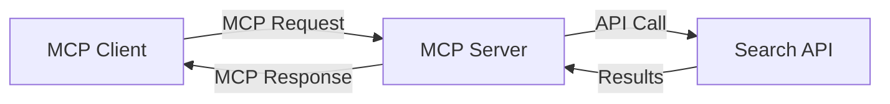
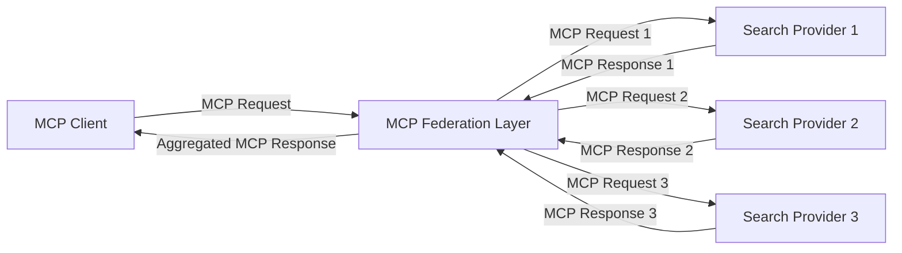
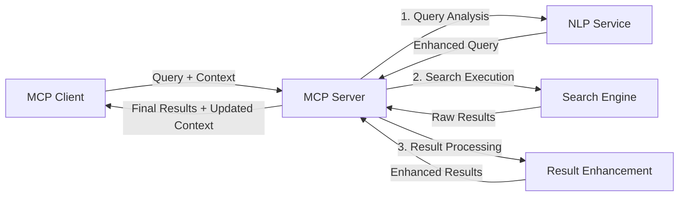

<!--
CO_OP_TRANSLATOR_METADATA:
{
  "original_hash": "333a03e51f90bdf3e6f1ba1694c73f36",
  "translation_date": "2025-07-17T00:11:09+00:00",
  "source_file": "05-AdvancedTopics/mcp-realtimesearch/README.md",
  "language_code": "bn"
}
-->
## কোড উদাহরণ ডিসক্লেইমার

> **গুরুত্বপূর্ণ নোট**: নিচের কোড উদাহরণগুলো Model Context Protocol (MCP) কে ওয়েব সার্চ ফাংশনালিটির সাথে ইন্টিগ্রেট করার প্রক্রিয়া দেখায়। যদিও এগুলো অফিসিয়াল MCP SDK-এর প্যাটার্ন ও স্ট্রাকচার অনুসরণ করে, শিক্ষামূলক উদ্দেশ্যে এগুলো সরলীকৃত করা হয়েছে।
> 
> এই উদাহরণগুলো প্রদর্শন করে:
> 
> ১. **পাইথন ইমপ্লিমেন্টেশন**: একটি FastMCP সার্ভার ইমপ্লিমেন্টেশন যা ওয়েব সার্চ টুল সরবরাহ করে এবং একটি এক্সটার্নাল সার্চ API-র সাথে সংযুক্ত হয়। এই উদাহরণটি সঠিক লাইফস্প্যান ম্যানেজমেন্ট, কনটেক্সট হ্যান্ডলিং, এবং টুল ইমপ্লিমেন্টেশন দেখায় যা [অফিসিয়াল MCP পাইথন SDK](https://github.com/modelcontextprotocol/python-sdk) এর প্যাটার্ন অনুসরণ করে। সার্ভারটি সুপারিশকৃত Streamable HTTP ট্রান্সপোর্ট ব্যবহার করে, যা প্রোডাকশন ডিপ্লয়মেন্টে পুরানো SSE ট্রান্সপোর্টের পরিবর্তে ব্যবহৃত হয়।
> 
> ২. **জাভাস্ক্রিপ্ট ইমপ্লিমেন্টেশন**: একটি টাইপস্ক্রিপ্ট/জাভাস্ক্রিপ্ট ইমপ্লিমেন্টেশন যা FastMCP প্যাটার্ন ব্যবহার করে [অফিসিয়াল MCP টাইপস্ক্রিপ্ট SDK](https://github.com/modelcontextprotocol/typescript-sdk) থেকে, যেখানে সঠিক টুল ডেফিনিশন এবং ক্লায়েন্ট কানেকশন সহ একটি সার্চ সার্ভার তৈরি করা হয়েছে। এটি সেশন ম্যানেজমেন্ট এবং কনটেক্সট সংরক্ষণের জন্য সর্বশেষ সুপারিশকৃত প্যাটার্ন অনুসরণ করে।
> 
> এই উদাহরণগুলো প্রোডাকশনে ব্যবহারের জন্য অতিরিক্ত এরর হ্যান্ডলিং, অথেনটিকেশন, এবং নির্দিষ্ট API ইন্টিগ্রেশন কোড প্রয়োজন হবে। প্রদর্শিত সার্চ API এন্ডপয়েন্টগুলো (`https://api.search-service.example/search`) প্লেসহোল্ডার, এগুলো প্রকৃত সার্চ সার্ভিস এন্ডপয়েন্ট দিয়ে প্রতিস্থাপন করতে হবে।
> 
> সম্পূর্ণ ইমপ্লিমেন্টেশন ডিটেইলস এবং সর্বশেষ পদ্ধতির জন্য, অনুগ্রহ করে [অফিসিয়াল MCP স্পেসিফিকেশন](https://spec.modelcontextprotocol.io/) এবং SDK ডকুমেন্টেশন দেখুন।

## মূল ধারণা

### Model Context Protocol (MCP) ফ্রেমওয়ার্ক

মূলত, Model Context Protocol AI মডেল, অ্যাপ্লিকেশন, এবং সার্ভিসগুলোর মধ্যে কনটেক্সট বিনিময়ের জন্য একটি স্ট্যান্ডার্ডাইজড পদ্ধতি প্রদান করে। রিয়েল-টাইম ওয়েব সার্চে, এই ফ্রেমওয়ার্কটি সঙ্গতিপূর্ণ, বহু-পর্বের সার্চ অভিজ্ঞতা তৈরিতে অপরিহার্য। প্রধান উপাদানগুলো হলো:

১. **ক্লায়েন্ট-সার্ভার আর্কিটেকচার**: MCP সার্চ ক্লায়েন্ট (রিকোয়েস্টকারী) এবং সার্চ সার্ভার (প্রোভাইডার) এর মধ্যে স্পষ্ট বিভাজন স্থাপন করে, যা নমনীয় ডিপ্লয়মেন্ট মডেল সম্ভব করে।

২. **JSON-RPC কমিউনিকেশন**: প্রোটোকলটি JSON-RPC ব্যবহার করে মেসেজ আদান-প্রদান করার জন্য, যা ওয়েব প্রযুক্তির সাথে সামঞ্জস্যপূর্ণ এবং বিভিন্ন প্ল্যাটফর্মে সহজে ইমপ্লিমেন্ট করা যায়।

৩. **কনটেক্সট ম্যানেজমেন্ট**: MCP বহু ইন্টারঅ্যাকশনের মধ্যে সার্চ কনটেক্সট রক্ষা, আপডেট এবং ব্যবহার করার জন্য কাঠামোবদ্ধ পদ্ধতি নির্ধারণ করে।

৪. **টুল ডেফিনিশন**: সার্চ সক্ষমতাগুলো স্ট্যান্ডার্ডাইজড টুল হিসেবে প্রকাশ করা হয়, যাদের সুস্পষ্ট প্যারামিটার এবং রিটার্ন ভ্যালু থাকে।

৫. **স্ট্রিমিং সাপোর্ট**: প্রোটোকলটি রিয়েল-টাইম সার্চের জন্য প্রয়োজনীয় স্ট্রিমিং রেজাল্ট সাপোর্ট করে, যেখানে ফলাফল ধাপে ধাপে আসতে পারে।

### ওয়েব সার্চ ইন্টিগ্রেশন প্যাটার্ন

MCP কে ওয়েব সার্চের সাথে ইন্টিগ্রেট করার সময় কয়েকটি প্যাটার্ন দেখা যায়:

#### ১. সরাসরি সার্চ প্রোভাইডার ইন্টিগ্রেশন

এই প্যাটার্নে MCP সার্ভার সরাসরি এক বা একাধিক সার্চ API-র সাথে ইন্টারফেস করে, MCP রিকোয়েস্টগুলো API-নির্দিষ্ট কল এ রূপান্তর করে এবং ফলাফল MCP রেসপন্স হিসেবে ফরম্যাট করে।

#### ২. কনটেক্সট সংরক্ষণসহ ফেডারেটেড সার্চ

এই প্যাটার্নে সার্চ কোয়েরিগুলো একাধিক MCP-কম্প্যাটিবল সার্চ প্রোভাইডারের মধ্যে বিতরণ করা হয়, যারা বিভিন্ন ধরনের কনটেন্ট বা সার্চ সক্ষমতায় বিশেষজ্ঞ হতে পারে, একই সাথে একটি ঐক্যবদ্ধ কনটেক্সট বজায় রাখা হয়।

#### ৩. কনটেক্সট-বর্ধিত সার্চ চেইন

এই প্যাটার্নে সার্চ প্রক্রিয়াটি একাধিক ধাপে বিভক্ত করা হয়, যেখানে প্রতিটি ধাপে কনটেক্সট সমৃদ্ধ হয়, ফলে ক্রমবর্ধমান প্রাসঙ্গিক ফলাফল পাওয়া যায়।

### সার্চ কনটেক্সট উপাদান

MCP-ভিত্তিক ওয়েব সার্চে কনটেক্সট সাধারণত অন্তর্ভুক্ত করে:

- **কোয়্যারির ইতিহাস**: সেশনের পূর্ববর্তী সার্চ কোয়েরি
- **ব্যবহারকারীর পছন্দ**: ভাষা, অঞ্চল, সেফ সার্চ সেটিংস
- **ইন্টারঅ্যাকশন ইতিহাস**: কোন ফলাফলগুলো ক্লিক করা হয়েছে, ফলাফলে কত সময় ব্যয় হয়েছে
- **সার্চ প্যারামিটার**: ফিল্টার, সাজানোর ক্রম, এবং অন্যান্য সার্চ মডিফায়ার
- **ডোমেইন জ্ঞান**: সার্চের সাথে সম্পর্কিত বিষয়ভিত্তিক কনটেক্সট
- **কালানুক্রমিক কনটেক্সট**: সময়ভিত্তিক প্রাসঙ্গিকতা বিষয়ক ফ্যাক্টর
- **সোর্স পছন্দ**: বিশ্বাসযোগ্য বা পছন্দসই তথ্য উৎস

## ব্যবহার ক্ষেত্র ও অ্যাপ্লিকেশন

### গবেষণা ও তথ্য সংগ্রহ

MCP গবেষণা ওয়ার্কফ্লো উন্নত করে:

- সার্চ সেশনের মধ্যে গবেষণার কনটেক্সট সংরক্ষণ করে
- আরও জটিল এবং প্রাসঙ্গিক কোয়েরি সক্ষম করে
- বহু-সোর্স সার্চ ফেডারেশন সমর্থন করে
- সার্চ ফলাফল থেকে জ্ঞান আহরণ সহজ করে

### রিয়েল-টাইম নিউজ ও ট্রেন্ড মনিটরিং

MCP-চালিত সার্চ নিউজ মনিটরিংয়ে সুবিধা দেয়:

- উদীয়মান সংবাদ গল্পের প্রায়-রিয়েল-টাইম আবিষ্কার
- প্রাসঙ্গিক তথ্যের কনটেক্সচুয়াল ফিল্টারিং
- একাধিক উৎসে বিষয় ও সত্তার ট্র্যাকিং
- ব্যবহারকারীর কনটেক্সট ভিত্তিক ব্যক্তিগতকৃত নিউজ অ্যালার্ট

### AI-সহায়ক ব্রাউজিং ও গবেষণা

MCP AI-সহায়ক ব্রাউজিংয়ে নতুন সম্ভাবনা তৈরি করে:

- বর্তমান ব্রাউজার কার্যকলাপের ভিত্তিতে কনটেক্সচুয়াল সার্চ সাজেশন
- ওয়েব সার্চের সাথে LLM-চালিত সহকারীদের নির্বিঘ্ন ইন্টিগ্রেশন
- বহু-পর্বের সার্চ পরিমার্জন কনটেক্সট বজায় রেখে
- উন্নত তথ্য যাচাই ও ফ্যাক্ট-চেকিং

## ভবিষ্যৎ প্রবণতা ও উদ্ভাবন

### ওয়েব সার্চে MCP-এর বিবর্তন

ভবিষ্যতে MCP নিম্নলিখিত বিষয়গুলো মোকাবেলা করার জন্য বিবর্তিত হবে বলে আশা করা হচ্ছে:

- **মাল্টিমোডাল সার্চ**: টেক্সট, ছবি, অডিও, এবং ভিডিও সার্চকে সংরক্ষিত কনটেক্সটসহ একত্রিত করা
- **ডিসেন্ট্রালাইজড সার্চ**: বিতরণকৃত এবং ফেডারেটেড সার্চ ইকোসিস্টেম সমর্থন করা
- **Search Privacy**: প্রসঙ্গ-সচেতন গোপনীয়তা রক্ষা করে অনুসন্ধান পদ্ধতি  
- **Query Understanding**: প্রাকৃতিক ভাষার অনুসন্ধান প্রশ্নের গভীর অর্থবোধক বিশ্লেষণ  

### প্রযুক্তিতে সম্ভাব্য অগ্রগতি  

ভবিষ্যতে MCP অনুসন্ধানের দিশা নির্ধারণ করবে এমন উদীয়মান প্রযুক্তিগুলো:  

1. **Neural Search Architectures**: MCP-এর জন্য এমবেডিং-ভিত্তিক অনুসন্ধান ব্যবস্থা  
2. **Personalized Search Context**: সময়ের সাথে ব্যবহারকারীর অনুসন্ধান প্যাটার্ন শেখা  
3. **Knowledge Graph Integration**: ডোমেইন-নির্দিষ্ট জ্ঞান গ্রাফ দ্বারা প্রসঙ্গভিত্তিক অনুসন্ধান উন্নতকরণ  
4. **Cross-Modal Context**: বিভিন্ন অনুসন্ধান মাধ্যম জুড়ে প্রসঙ্গ বজায় রাখা  

## হাতে কলমে অনুশীলন  

### অনুশীলন ১: একটি মৌলিক MCP অনুসন্ধান পাইপলাইন সেটআপ করা  

এই অনুশীলনে আপনি শিখবেন:  
- একটি মৌলিক MCP অনুসন্ধান পরিবেশ কনফিগার করা  
- ওয়েব অনুসন্ধানের জন্য প্রসঙ্গ হ্যান্ডলার বাস্তবায়ন করা  
- অনুসন্ধান পুনরাবৃত্তির মধ্যে প্রসঙ্গ সংরক্ষণ পরীক্ষা ও যাচাই করা  

### অনুশীলন ২: MCP অনুসন্ধান দিয়ে একটি গবেষণা সহকারী তৈরি করা  

একটি পূর্ণাঙ্গ অ্যাপ্লিকেশন তৈরি করুন যা:  
- প্রাকৃতিক ভাষার গবেষণা প্রশ্ন প্রক্রিয়াকরণ করে  
- প্রসঙ্গ-সচেতন ওয়েব অনুসন্ধান সম্পাদন করে  
- একাধিক উৎস থেকে তথ্য সংকলন করে  
- সংগঠিত গবেষণা ফলাফল উপস্থাপন করে  

### অনুশীলন ৩: MCP দিয়ে মাল্টি-সোর্স অনুসন্ধান ফেডারেশন বাস্তবায়ন করা  

উন্নত অনুশীলন যা অন্তর্ভুক্ত:  
- একাধিক অনুসন্ধান ইঞ্জিনে প্রসঙ্গ-সচেতন প্রশ্ন প্রেরণ  
- ফলাফল র‍্যাঙ্কিং ও সমন্বয়  
- অনুসন্ধান ফলাফলের প্রসঙ্গভিত্তিক ডুপ্লিকেশন অপসারণ  
- উৎস-নির্দিষ্ট মেটাডেটা পরিচালনা  

## অতিরিক্ত সম্পদ  

- [Model Context Protocol Specification](https://spec.modelcontextprotocol.io/) - অফিসিয়াল MCP স্পেসিফিকেশন ও বিস্তারিত প্রোটোকল ডকুমেন্টেশন  
- [Model Context Protocol Documentation](https://modelcontextprotocol.io/) - বিস্তারিত টিউটোরিয়াল ও বাস্তবায়ন গাইড  
- [MCP Python SDK](https://github.com/modelcontextprotocol/python-sdk) - MCP প্রোটোকলের অফিসিয়াল পাইথন ইমপ্লিমেন্টেশন  
- [MCP TypeScript SDK](https://github.com/modelcontextprotocol/typescript-sdk) - MCP প্রোটোকলের অফিসিয়াল টাইপস্ক্রিপ্ট ইমপ্লিমেন্টেশন  
- [MCP Reference Servers](https://github.com/modelcontextprotocol/servers) - MCP সার্ভারের রেফারেন্স ইমপ্লিমেন্টেশন  
- [Bing Web Search API Documentation](https://learn.microsoft.com/en-us/bing/search-apis/bing-web-search/overview) - মাইক্রোসফটের ওয়েব অনুসন্ধান API  
- [Google Custom Search JSON API](https://developers.google.com/custom-search/v1/overview) - গুগলের প্রোগ্রামেবল অনুসন্ধান ইঞ্জিন  
- [SerpAPI Documentation](https://serpapi.com/search-api) - সার্চ ইঞ্জিন রেজাল্ট পেজ API  
- [Meilisearch Documentation](https://www.meilisearch.com/docs) - ওপেন-সোর্স অনুসন্ধান ইঞ্জিন  
- [Elasticsearch Documentation](https://www.elastic.co/guide/index.html) - বিতরণকৃত অনুসন্ধান ও বিশ্লেষণ ইঞ্জিন  
- [LangChain Documentation](https://python.langchain.com/docs/get_started/introduction) - LLM ব্যবহার করে অ্যাপ্লিকেশন নির্মাণ  

## শেখার ফলাফল  

এই মডিউল সম্পন্ন করার মাধ্যমে আপনি সক্ষম হবেন:  

- রিয়েল-টাইম ওয়েব অনুসন্ধানের মৌলিক বিষয় ও চ্যালেঞ্জ বুঝতে  
- Model Context Protocol (MCP) কীভাবে রিয়েল-টাইম ওয়েব অনুসন্ধান ক্ষমতা বাড়ায় তা ব্যাখ্যা করতে  
- জনপ্রিয় ফ্রেমওয়ার্ক ও API ব্যবহার করে MCP-ভিত্তিক অনুসন্ধান সমাধান বাস্তবায়ন করতে  
- MCP দিয়ে স্কেলেবল, উচ্চ-দক্ষতা সম্পন্ন অনুসন্ধান আর্কিটেকচার ডিজাইন ও ডিপ্লয় করতে  
- MCP ধারণাগুলো বিভিন্ন ক্ষেত্রে প্রয়োগ করতে যেমন সেমান্টিক অনুসন্ধান, গবেষণা সহায়ক, এবং AI-সহায়িত ব্রাউজিং  
- MCP-ভিত্তিক অনুসন্ধান প্রযুক্তির উদীয়মান প্রবণতা ও ভবিষ্যৎ উদ্ভাবন মূল্যায়ন করতে  

### বিশ্বাস ও নিরাপত্তা বিবেচনা  

MCP-ভিত্তিক ওয়েব অনুসন্ধান সমাধান বাস্তবায়নের সময় MCP স্পেসিফিকেশন থেকে এই গুরুত্বপূর্ণ নীতিগুলো মনে রাখুন:  

1. **ব্যবহারকারীর সম্মতি ও নিয়ন্ত্রণ**: ব্যবহারকারীদের স্পষ্ট সম্মতি নিতে হবে এবং সকল ডেটা অ্যাক্সেস ও অপারেশন সম্পর্কে বুঝতে হবে। বিশেষ করে ওয়েব অনুসন্ধান বাস্তবায়নে যা বাহ্যিক ডেটা উৎস অ্যাক্সেস করতে পারে।  

2. **ডেটা গোপনীয়তা**: অনুসন্ধান প্রশ্ন ও ফলাফল যথাযথভাবে পরিচালনা করতে হবে, বিশেষ করে যখন তা সংবেদনশীল তথ্য ধারণ করতে পারে। ব্যবহারকারীর ডেটা সুরক্ষায় যথাযথ অ্যাক্সেস নিয়ন্ত্রণ প্রয়োগ করুন।  

3. **টুল নিরাপত্তা**: অনুসন্ধান টুলগুলোর জন্য সঠিক অনুমোদন ও যাচাই প্রয়োগ করুন, কারণ এগুলো স্বতঃস্ফূর্ত কোড কার্যকর করার মাধ্যমে নিরাপত্তা ঝুঁকি সৃষ্টি করতে পারে। টুলের আচরণ বর্ণনা বিশ্বাসযোগ্য নয় যতক্ষণ না তা বিশ্বাসযোগ্য সার্ভার থেকে প্রাপ্ত।  

4. **পরিষ্কার ডকুমেন্টেশন**: MCP-ভিত্তিক অনুসন্ধান বাস্তবায়নের ক্ষমতা, সীমাবদ্ধতা ও নিরাপত্তা বিবেচনা সম্পর্কে স্পষ্ট ডকুমেন্টেশন প্রদান করুন, MCP স্পেসিফিকেশনের নির্দেশিকা অনুসরণ করে।  

5. **দৃঢ় সম্মতি প্রবাহ**: শক্তিশালী সম্মতি ও অনুমোদন প্রবাহ তৈরি করুন যা প্রতিটি টুল ব্যবহারের আগে তার কার্যকারিতা স্পষ্টভাবে ব্যাখ্যা করে, বিশেষ করে যেগুলো বাহ্যিক ওয়েব রিসোর্সের সাথে ইন্টারঅ্যাক্ট করে।  

MCP নিরাপত্তা ও বিশ্বাস ও নিরাপত্তা বিবেচনার সম্পূর্ণ বিবরণের জন্য [অফিসিয়াল ডকুমেন্টেশন](https://modelcontextprotocol.io/specification/2025-03-26#security-and-trust-%26-safety) দেখুন।  

## পরবর্তী ধাপ  

- [5.12 Entra ID Authentication for Model Context Protocol Servers](../mcp-security-entra/README.md)

**অস্বীকৃতি**:  
এই নথিটি AI অনুবাদ সেবা [Co-op Translator](https://github.com/Azure/co-op-translator) ব্যবহার করে অনূদিত হয়েছে। আমরা যথাসাধ্য সঠিকতার চেষ্টা করি, তবে স্বয়ংক্রিয় অনুবাদে ত্রুটি বা অসঙ্গতি থাকতে পারে। মূল নথিটি তার নিজস্ব ভাষায়ই কর্তৃত্বপূর্ণ উৎস হিসেবে বিবেচিত হওয়া উচিত। গুরুত্বপূর্ণ তথ্যের জন্য পেশাদার মানব অনুবাদ গ্রহণ করার পরামর্শ দেওয়া হয়। এই অনুবাদের ব্যবহারে সৃষ্ট কোনো ভুল বোঝাবুঝি বা ভুল ব্যাখ্যার জন্য আমরা দায়ী নই।