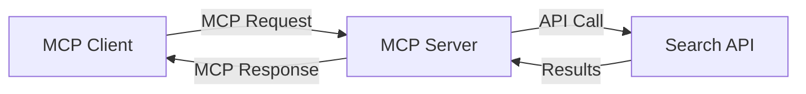
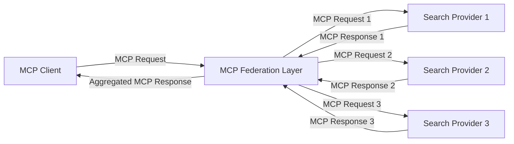
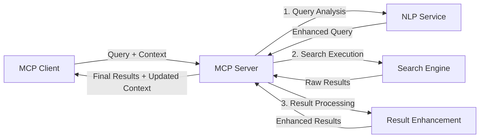

<!--
CO_OP_TRANSLATOR_METADATA:
{
  "original_hash": "16bef2c93c6a86d4ca6a8ce9e120e384",
  "translation_date": "2025-06-13T02:38:44+00:00",
  "source_file": "05-AdvancedTopics/mcp-realtimesearch/README.md",
  "language_code": "bn"
}
-->
## কোড উদাহরণ সম্পর্কে সতর্কতা

> **গুরুত্বপূর্ণ নোট**: নিচের কোড উদাহরণগুলো Model Context Protocol (MCP) কে ওয়েব সার্চ ফাংশনালিটির সাথে ইন্টিগ্রেট করার প্রদর্শন। যদিও এগুলো অফিসিয়াল MCP SDK-এর প্যাটার্ন এবং স্ট্রাকচার অনুসরণ করে, শিক্ষামূলক উদ্দেশ্যে সহজীকৃত।
> 
> এই উদাহরণগুলো প্রদর্শন করে:
> 
> ১. **পাইথন ইমপ্লিমেন্টেশন**: একটি FastMCP সার্ভার যা ওয়েব সার্চ টুল সরবরাহ করে এবং বাইরের সার্চ API-এর সাথে সংযুক্ত। উদাহরণটি [অফিসিয়াল MCP পাইথন SDK](https://github.com/modelcontextprotocol/python-sdk) অনুসারে সঠিক লাইফস্প্যান ম্যানেজমেন্ট, কনটেক্সট হ্যান্ডলিং এবং টুল ইমপ্লিমেন্টেশন দেখায়। সার্ভারটি Streamable HTTP ট্রান্সপোর্ট ব্যবহার করে যা প্রোডাকশনে পুরানো SSE ট্রান্সপোর্টের পরিবর্তে সুপারিশকৃত।
> 
> ২. **জাভাস্ক্রিপ্ট ইমপ্লিমেন্টেশন**: [অফিসিয়াল MCP টাইপস্ক্রিপ্ট SDK](https://github.com/modelcontextprotocol/typescript-sdk) থেকে FastMCP প্যাটার্ন ব্যবহার করে টাইপস্ক্রিপ্ট/জাভাস্ক্রিপ্টে সার্চ সার্ভার তৈরি, সঠিক টুল ডেফিনিশন এবং ক্লায়েন্ট সংযোগসহ। এটি সেশন ম্যানেজমেন্ট এবং কনটেক্সট রক্ষণাবেক্ষণের জন্য সর্বশেষ সুপারিশকৃত প্যাটার্ন অনুসরণ করে।
> 
> এই উদাহরণগুলো প্রোডাকশনে ব্যবহারের জন্য অতিরিক্ত এরর হ্যান্ডলিং, অথেনটিকেশন এবং নির্দিষ্ট API ইন্টিগ্রেশন কোড প্রয়োজন হবে। প্রদর্শিত সার্চ API এন্ডপয়েন্টগুলি (`https://api.search-service.example/search`) প্লেসহোল্ডার, এগুলো প্রকৃত সার্চ সার্ভিস এন্ডপয়েন্ট দিয়ে প্রতিস্থাপন করতে হবে।
> 
> সম্পূর্ণ ইমপ্লিমেন্টেশন বিবরণ এবং সর্বশেষ পদ্ধতির জন্য, দয়া করে [অফিসিয়াল MCP স্পেসিফিকেশন](https://spec.modelcontextprotocol.io/) এবং SDK ডকুমেন্টেশন দেখুন।

## মূল ধারণাসমূহ

### Model Context Protocol (MCP) ফ্রেমওয়ার্ক

মূলত, Model Context Protocol AI মডেল, অ্যাপ্লিকেশন এবং সার্ভিসগুলোর মধ্যে কনটেক্সট বিনিময়ের জন্য একটি স্ট্যান্ডার্ড পদ্ধতি প্রদান করে। রিয়েল-টাইম ওয়েব সার্চে, এই ফ্রেমওয়ার্কটি সঙ্গতিপূর্ণ, মাল্টি-টার্ন সার্চ অভিজ্ঞতা তৈরিতে অপরিহার্য। প্রধান উপাদানগুলো:

১. **ক্লায়েন্ট-সার্ভার আর্কিটেকচার**: MCP স্পষ্টভাবে সার্চ ক্লায়েন্ট (রিকোয়েস্টার) এবং সার্চ সার্ভার (প্রোভাইডার) আলাদা করে, নমনীয় ডিপ্লয়মেন্ট মডেল সম্ভব করে।

২. **JSON-RPC কমিউনিকেশন**: প্রোটোকলটি মেসেজ বিনিময়ের জন্য JSON-RPC ব্যবহার করে, যা ওয়েব প্রযুক্তির সাথে সামঞ্জস্যপূর্ণ এবং বিভিন্ন প্ল্যাটফর্মে সহজে বাস্তবায়নযোগ্য।

৩. **কনটেক্সট ম্যানেজমেন্ট**: MCP বহু ইন্টারঅ্যাকশনের মধ্যে সার্চ কনটেক্সট রক্ষা, আপডেট এবং ব্যবহার করার জন্য কাঠামোবদ্ধ পদ্ধতি নির্ধারণ করে।

৪. **টুল ডেফিনিশন**: সার্চ সক্ষমতাগুলো স্ট্যান্ডার্ডাইজড টুল হিসেবে প্রকাশ পায়, যাদের সুস্পষ্ট প্যারামিটার এবং রিটার্ন ভ্যালু থাকে।

৫. **স্ট্রিমিং সাপোর্ট**: প্রোটোকলটি স্ট্রিমিং ফলাফল সমর্থন করে, যা রিয়েল-টাইম সার্চে ফলাফল পর্যায়ক্রমে আসার জন্য অপরিহার্য।

### ওয়েব সার্চ ইন্টিগ্রেশন প্যাটার্ন

MCP কে ওয়েব সার্চের সাথে ইন্টিগ্রেট করার সময় কয়েকটি প্যাটার্ন দেখা যায়:

#### ১. ডাইরেক্ট সার্চ প্রোভাইডার ইন্টিগ্রেশন

এই প্যাটার্নে MCP সার্ভার সরাসরি এক বা একাধিক সার্চ API-এর সাথে ইন্টারফেস করে, MCP রিকোয়েস্টগুলো API-নির্দিষ্ট কল হিসেবে অনুবাদ করে এবং ফলাফল MCP রেসপন্স হিসেবে ফরম্যাট করে।

#### ২. ফেডারেটেড সার্চ উইথ কনটেক্সট প্রিজার্ভেশন

এই প্যাটার্নে সার্চ কুয়েরিগুলো একাধিক MCP-কমপ্যাটিবল সার্চ প্রোভাইডারের মধ্যে বিতরণ করা হয়, যাদের প্রত্যেকে ভিন্ন ধরনের কনটেন্ট বা সার্চ সক্ষমতায় বিশেষজ্ঞ, একই সময়ে একটি ঐক্যবদ্ধ কনটেক্সট রক্ষা করে।

#### ৩. কনটেক্সট-এনহ্যান্সড সার্চ চেইন

এই প্যাটার্নে সার্চ প্রক্রিয়াটি একাধিক ধাপে বিভক্ত, যেখানে প্রতিটি ধাপে কনটেক্সট সমৃদ্ধ হয়, ফলে ক্রমবর্ধমান প্রাসঙ্গিক ফলাফল পাওয়া যায়।

### সার্চ কনটেক্সট উপাদান

MCP-ভিত্তিক ওয়েব সার্চে কনটেক্সট সাধারণত অন্তর্ভুক্ত করে:

- **কুয়েরি ইতিহাস**: সেশনের পূর্ববর্তী সার্চ কুয়েরি
- **ব্যবহারকারীর পছন্দসমূহ**: ভাষা, অঞ্চল, সেফ সার্চ সেটিংস
- **ইন্টারঅ্যাকশন ইতিহাস**: কোন ফলাফলগুলো ক্লিক করা হয়েছে, কত সময় ব্যয় হয়েছে
- **সার্চ প্যারামিটার**: ফিল্টার, সাজানোর অর্ডার এবং অন্যান্য সার্চ পরিবর্তক
- **ডোমেইন জ্ঞান**: সার্চের সাথে সম্পর্কিত বিষয়ভিত্তিক কনটেক্সট
- **সময়গত কনটেক্সট**: সময়-ভিত্তিক প্রাসঙ্গিকতা ফ্যাক্টর
- **সোর্স পছন্দসমূহ**: বিশ্বাসযোগ্য বা পছন্দসই তথ্য উৎস

## ব্যবহার ক্ষেত্র ও অ্যাপ্লিকেশন

### গবেষণা ও তথ্য সংগ্রহ

MCP গবেষণা ওয়ার্কফ্লো উন্নত করে:

- সার্চ সেশনের মধ্যে গবেষণা কনটেক্সট সংরক্ষণ
- আরো উন্নত ও প্রসঙ্গভিত্তিক কুয়েরি সক্ষমকরণ
- মাল্টি-সোর্স সার্চ ফেডারেশন সমর্থন
- সার্চ ফলাফল থেকে জ্ঞান আহরণ সহজ করা

### রিয়েল-টাইম নিউজ ও ট্রেন্ড মনিটরিং

MCP চালিত সার্চ নিউজ মনিটরিংয়ে সুবিধা দেয়:

- উদীয়মান সংবাদ গল্পের প্রায়-রিয়েল-টাইম আবিষ্কার
- প্রাসঙ্গিক তথ্যের প্রসঙ্গভিত্তিক ফিল্টারিং
- একাধিক উৎসে বিষয় ও সত্তার ট্র্যাকিং
- ব্যবহারকারীর কনটেক্সট ভিত্তিক ব্যক্তিগতকৃত নিউজ অ্যালার্ট

### AI-অগমেন্টেড ব্রাউজিং ও গবেষণা

MCP নতুন সম্ভাবনা তৈরি করে AI-অগমেন্টেড ব্রাউজিংয়ে:

- বর্তমান ব্রাউজার কার্যকলাপের ভিত্তিতে প্রসঙ্গভিত্তিক সার্চ সাজেশন
- LLM-চালিত অ্যাসিস্ট্যান্টের সাথে ওয়েব সার্চের সিমলেস ইন্টিগ্রেশন
- রক্ষা করা কনটেক্সট সহ মাল্টি-টার্ন সার্চ রিফাইনমেন্ট
- উন্নত তথ্য যাচাই ও ফ্যাক্ট-চেকিং

## ভবিষ্যৎ প্রবণতা ও উদ্ভাবন

### ওয়েব সার্চে MCP-এর বিবর্তন

ভবিষ্যতে, MCP এর উন্নতি প্রত্যাশিত যা মোকাবেলা করবে:

- **মাল্টিমোডাল সার্চ**: টেক্সট, ছবি, অডিও এবং ভিডিও সার্চের ইন্টিগ্রেশন রক্ষা করা কনটেক্সটসহ
- **ডিসেন্ট্রালাইজড সার্চ**: বিতরণকৃত ও ফেডারেটেড সার্চ ইকোসিস্টেম সমর্থন
- **সার্চ প্রাইভেসি**: প্রসঙ্গ-সচেতন প্রাইভেসি রক্ষাকারী সার্চ পদ্ধতি
- **কুয়েরি আন্ডারস্ট্যান্ডিং**: প্রাকৃতিক ভাষার সার্চ কুয়েরির গভীর সেম্যান্টিক পার্সিং

### প্রযুক্তিতে সম্ভাব্য অগ্রগতি

নতুন প্রযুক্তি যা MCP সার্চের ভবিষ্যত গঠন করবে:

১. **নিউরাল সার্চ আর্কিটেকচার**: এম্বেডিং-ভিত্তিক সার্চ সিস্টেম MCP-র জন্য অপ্টিমাইজড  
২. **ব্যক্তিগতকৃত সার্চ কনটেক্সট**: সময়ের সাথে ব্যবহারকারীর সার্চ প্যাটার্ন শেখা  
৩. **নলেজ গ্রাফ ইন্টিগ্রেশন**: ডোমেইন-নির্দিষ্ট নলেজ গ্রাফ দ্বারা প্রসঙ্গভিত্তিক সার্চ উন্নতকরণ  
৪. **ক্রস-মোডাল কনটেক্সট**: বিভিন্ন সার্চ মোডালিটির মধ্যে কনটেক্সট রক্ষা

## হাতে কলমে অনুশীলন

### অনুশীলন ১: একটি মৌলিক MCP সার্চ পাইপলাইন সেটআপ করা

এই অনুশীলনে আপনি শিখবেন:
- একটি মৌলিক MCP সার্চ পরিবেশ কনফিগার করা
- ওয়েব সার্চের জন্য কনটেক্সট হ্যান্ডলার ইমপ্লিমেন্ট করা
- সার্চ ইটারেশনের মধ্যে কনটেক্সট রক্ষণাবেক্ষণ পরীক্ষা ও যাচাই করা

### অনুশীলন ২: MCP সার্চ দিয়ে একটি গবেষণা সহকারী তৈরি করা

সম্পূর্ণ অ্যাপ্লিকেশন তৈরি করুন যা:
- প্রাকৃতিক ভাষার গবেষণা প্রশ্ন প্রক্রিয়াজাত করে
- প্রসঙ্গ-সচেতন ওয়েব সার্চ সম্পাদন করে
- একাধিক উৎস থেকে তথ্য সংশ্লেষণ করে
- সংগঠিত গবেষণা ফলাফল উপস্থাপন করে

### অনুশীলন ৩: MCP দিয়ে মাল্টি-সোর্স সার্চ ফেডারেশন ইমপ্লিমেন্ট করা

উন্নত অনুশীলন যা কভার করে:
- প্রসঙ্গ-সচেতন কুয়েরি বিতরণ একাধিক সার্চ ইঞ্জিনে
- ফলাফল র‌্যাংকিং ও একত্রিকরণ
- সার্চ ফলাফলের প্রসঙ্গভিত্তিক ডুপ্লিকেশন অপসারণ
- সোর্স-নির্দিষ্ট মেটাডেটা হ্যান্ডলিং

## অতিরিক্ত সম্পদ

- [Model Context Protocol Specification](https://spec.modelcontextprotocol.io/) - অফিসিয়াল MCP স্পেসিফিকেশন ও বিস্তারিত প্রোটোকল ডকুমেন্টেশন  
- [Model Context Protocol Documentation](https://modelcontextprotocol.io/) - বিস্তারিত টিউটোরিয়াল ও ইমপ্লিমেন্টেশন গাইড  
- [MCP Python SDK](https://github.com/modelcontextprotocol/python-sdk) - MCP প্রোটোকলের অফিসিয়াল পাইথন ইমপ্লিমেন্টেশন  
- [MCP TypeScript SDK](https://github.com/modelcontextprotocol/typescript-sdk) - MCP প্রোটোকলের অফিসিয়াল টাইপস্ক্রিপ্ট ইমপ্লিমেন্টেশন  
- [MCP Reference Servers](https://github.com/modelcontextprotocol/servers) - MCP সার্ভারের রেফারেন্স ইমপ্লিমেন্টেশন  
- [Bing Web Search API Documentation](https://learn.microsoft.com/en-us/bing/search-apis/bing-web-search/overview) - মাইক্রোসফটের ওয়েব সার্চ API  
- [Google Custom Search JSON API](https://developers.google.com/custom-search/v1/overview) - গুগলের প্রোগ্রামেবল সার্চ ইঞ্জিন  
- [SerpAPI Documentation](https://serpapi.com/search-api) - সার্চ ইঞ্জিন রেজাল্টস পেজ API  
- [Meilisearch Documentation](https://www.meilisearch.com/docs) - ওপেন সোর্স সার্চ ইঞ্জিন  
- [Elasticsearch Documentation](https://www.elastic.co/guide/index.html) - বিতরণকৃত সার্চ ও অ্যানালিটিক্স ইঞ্জিন  
- [LangChain Documentation](https://python.langchain.com/docs/get_started/introduction) - LLM-সহ অ্যাপ্লিকেশন নির্মাণ

## শেখার ফলাফল

এই মডিউল সম্পন্ন করার মাধ্যমে আপনি সক্ষম হবেন:

- রিয়েল-টাইম ওয়েব সার্চের মূল বিষয় এবং এর চ্যালেঞ্জগুলো বুঝতে  
- Model Context Protocol (MCP) কীভাবে রিয়েল-টাইম ওয়েব সার্চ সক্ষমতা বাড়ায় ব্যাখ্যা করতে  
- জনপ্রিয় ফ্রেমওয়ার্ক এবং API ব্যবহার করে MCP-ভিত্তিক সার্চ সলিউশন ইমপ্লিমেন্ট করতে  
- MCP ব্যবহার করে স্কেলেবল, উচ্চ-পারফরম্যান্স সার্চ আর্কিটেকচার ডিজাইন ও ডিপ্লয় করতে  
- MCP ধারণা বিভিন্ন ব্যবহার ক্ষেত্রে প্রয়োগ করতে, যেমন সেম্যান্টিক সার্চ, গবেষণা সহায়তা, এবং AI-অগমেন্টেড ব্রাউজিং  
- MCP-ভিত্তিক সার্চ প্রযুক্তিতে উদীয়মান প্রবণতা এবং ভবিষ্যৎ উদ্ভাবন মূল্যায়ন করতে

### বিশ্বাস ও নিরাপত্তা বিবেচনা

MCP-ভিত্তিক ওয়েব সার্চ সলিউশন ইমপ্লিমেন্ট করার সময় MCP স্পেসিফিকেশনের নিম্নলিখিত গুরুত্বপূর্ণ নীতিগুলো মনে রাখুন:

১. **ব্যবহারকারীর সম্মতি ও নিয়ন্ত্রণ**: ব্যবহারকারীদের স্পষ্ট সম্মতি নিতে হবে এবং সব ডেটা অ্যাক্সেস ও অপারেশন সম্পর্কে বুঝতে হবে। বিশেষ করে ওয়েব সার্চ ইমপ্লিমেন্টেশনে যা বাইরের ডেটা সোর্স অ্যাক্সেস করতে পারে।

২. **ডেটা গোপনীয়তা**: সার্চ কুয়েরি ও ফলাফল যথাযথভাবে হ্যান্ডেল করতে হবে, বিশেষ করে যখন সেগুলো সংবেদনশীল তথ্য ধারণ করতে পারে। ব্যবহারকারীর ডেটা সুরক্ষায় যথাযথ অ্যাক্সেস নিয়ন্ত্রণ প্রয়োগ করুন।

৩. **টুল সুরক্ষা**: সার্চ টুলের জন্য সঠিক অথরাইজেশন ও ভ্যালিডেশন ইমপ্লিমেন্ট করুন, কারণ এগুলো অপ্রত্যাশিত কোড এক্সিকিউশনের মাধ্যমে নিরাপত্তা ঝুঁকি সৃষ্টি করতে পারে। টুলের আচরণ বর্ণনা অবিশ্বাস্য হিসেবে গণ্য করুন যতক্ষণ না তা বিশ্বাসযোগ্য সার্ভার থেকে প্রাপ্ত।

৪. **পরিষ্কার ডকুমেন্টেশন**: আপনার MCP-ভিত্তিক সার্চ ইমপ্লিমেন্টেশনের সক্ষমতা, সীমাবদ্ধতা এবং নিরাপত্তা বিবেচনা সম্পর্কে পরিষ্কার ডকুমেন্টেশন প্রদান করুন, MCP স্পেসিফিকেশন অনুসারে।

৫. **মজবুত সম্মতি প্রবাহ**: এমন সম্মতি ও অথরাইজেশন প্রবাহ তৈরি করুন যা প্রতিটি টুলের কার্যক্রম স্পষ্টভাবে ব্যাখ্যা করে এবং ব্যবহার অনুমোদনের আগে ব্যবহারকারীকে জানায়, বিশেষ করে বাইরের ওয়েব রিসোর্সের সাথে ইন্টারঅ্যাক্ট করা টুলগুলোর জন্য।

MCP নিরাপত্তা ও বিশ্বাস ও সুরক্ষা বিবেচনার সম্পূর্ণ বিবরণের জন্য [অফিসিয়াল ডকুমেন্টেশন](https://modelcontextprotocol.io/specification/2025-03-26#security-and-trust-%26-safety) দেখুন।

## পরবর্তী ধাপ

- [৬. কমিউনিটি অবদান](../../06-CommunityContributions/README.md)

**অস্বীকৃতি**:  
এই নথিটি AI অনুবাদ সেবা [Co-op Translator](https://github.com/Azure/co-op-translator) ব্যবহার করে অনূদিত হয়েছে। আমরা যথাসাধ্য সঠিকতার জন্য চেষ্টা করি, তবে দয়া করে মনে রাখবেন যে স্বয়ংক্রিয় অনুবাদে ত্রুটি বা ভুল থাকতে পারে। মূল নথিটি তার নিজস্ব ভাষায়ই কর্তৃত্বপূর্ণ উৎস হিসেবে বিবেচিত হবে। গুরুত্বপূর্ণ তথ্যের জন্য পেশাদার মানব অনুবাদের পরামর্শ দেওয়া হয়। এই অনুবাদের ব্যবহারে সৃষ্ট কোনো ভুল বোঝাবুঝি বা ব্যাখ্যার জন্য আমরা দায়ী নই।