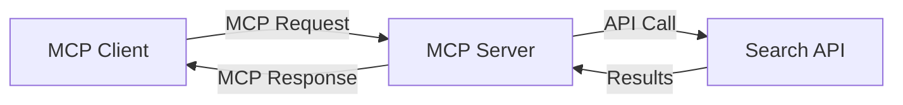
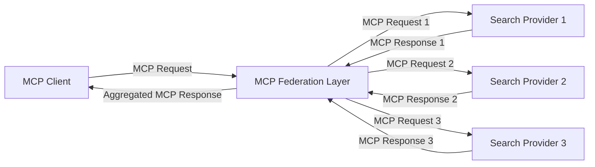
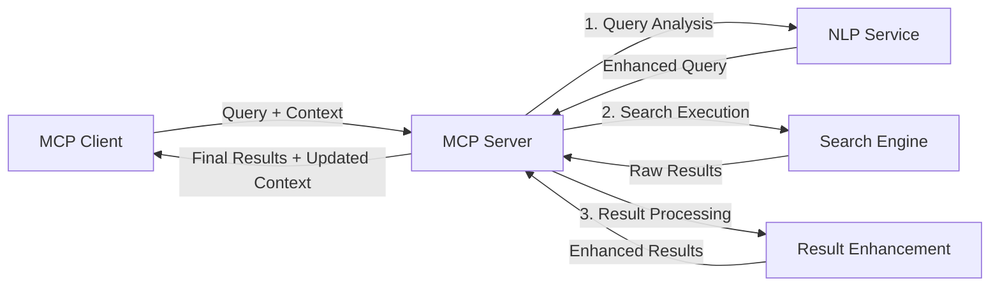

<!--
CO_OP_TRANSLATOR_METADATA:
{
  "original_hash": "eb12652eb7bd17f2193b835a344425c6",
  "translation_date": "2025-06-26T13:50:00+00:00",
  "source_file": "05-AdvancedTopics/mcp-realtimesearch/README.md",
  "language_code": "bn"
}
-->
## কোড উদাহরণ সংক্রান্ত অস্বীকৃতি

> **গুরুত্বপূর্ণ নোট**: নিচের কোড উদাহরণগুলো Model Context Protocol (MCP) কে ওয়েব সার্চ ফাংশনালিটির সাথে সংযুক্ত করার প্রক্রিয়া প্রদর্শন করে। যদিও এগুলো অফিসিয়াল MCP SDK-এর প্যাটার্ন ও স্ট্রাকচার অনুসরণ করে, শিক্ষামূলক উদ্দেশ্যে এগুলো সরলীকৃত করা হয়েছে।
> 
> এই উদাহরণগুলোতে রয়েছে:
> 
> ১. **পাইথন ইমপ্লিমেন্টেশন**: একটি FastMCP সার্ভার ইমপ্লিমেন্টেশন যা ওয়েব সার্চ টুল সরবরাহ করে এবং একটি বহিরাগত সার্চ API-র সাথে সংযুক্ত হয়। এই উদাহরণটি অফিসিয়াল MCP পাইথন SDK-এর প্যাটার্ন অনুসারে সঠিক লাইফস্প্যান ম্যানেজমেন্ট, কনটেক্সট হ্যান্ডলিং এবং টুল ইমপ্লিমেন্টেশন দেখায়। সার্ভারটি প্রোডাকশন ডিপ্লয়মেন্টের জন্য পুরানো SSE ট্রান্সপোর্টের পরিবর্তে সুপারিশকৃত Streamable HTTP ট্রান্সপোর্ট ব্যবহার করে।
> 
> ২. **জাভাস্ক্রিপ্ট ইমপ্লিমেন্টেশন**: অফিসিয়াল MCP টাইপস্ক্রিপ্ট SDK থেকে FastMCP প্যাটার্ন ব্যবহার করে একটি টাইপস্ক্রিপ্ট/জাভাস্ক্রিপ্ট ইমপ্লিমেন্টেশন, যা সঠিক টুল ডেফিনিশন এবং ক্লায়েন্ট সংযোগ সহ একটি সার্চ সার্ভার তৈরি করে। এটি সেশন ম্যানেজমেন্ট এবং কনটেক্সট সংরক্ষণের সর্বশেষ সুপারিশকৃত প্যাটার্ন অনুসরণ করে।
> 
> এই উদাহরণগুলোর জন্য প্রোডাকশনে ব্যবহারের আগে অতিরিক্ত এরর হ্যান্ডলিং, অথেন্টিকেশন এবং নির্দিষ্ট API ইন্টিগ্রেশন কোড প্রয়োজন হবে। প্রদর্শিত সার্চ API এন্ডপয়েন্টগুলি (`https://api.search-service.example/search`) প্লেসহোল্ডার, এগুলো প্রকৃত সার্চ সার্ভিস এন্ডপয়েন্ট দিয়ে প্রতিস্থাপন করতে হবে।
> 
> সম্পূর্ণ ইমপ্লিমেন্টেশন বিস্তারিত এবং সর্বশেষ পদ্ধতির জন্য অনুগ্রহ করে [অফিসিয়াল MCP স্পেসিফিকেশন](https://spec.modelcontextprotocol.io/) এবং SDK ডকুমেন্টেশন দেখুন।

## মূল ধারণাসমূহ

### Model Context Protocol (MCP) ফ্রেমওয়ার্ক

মূলত, Model Context Protocol AI মডেল, অ্যাপ্লিকেশন এবং সার্ভিসগুলোর মধ্যে কনটেক্সট বিনিময়ের জন্য একটি স্ট্যান্ডার্ড পদ্ধতি প্রদান করে। রিয়েল-টাইম ওয়েব সার্চে, এই ফ্রেমওয়ার্কটি সঙ্গতিপূর্ণ, বহু-টার্ন সার্চ অভিজ্ঞতা তৈরির জন্য অপরিহার্য। প্রধান উপাদানসমূহ হলো:

১. **ক্লায়েন্ট-সার্ভার আর্কিটেকচার**: MCP সার্চ ক্লায়েন্ট (অনুরোধকারী) এবং সার্চ সার্ভার (প্রদানকারী) এর মধ্যে স্পষ্ট বিভাজন প্রতিষ্ঠা করে, যা নমনীয় ডিপ্লয়মেন্ট মডেলকে সমর্থন করে।

২. **JSON-RPC কমিউনিকেশন**: প্রোটোকলটি JSON-RPC ব্যবহার করে মেসেজ বিনিময়ের জন্য, যা ওয়েব প্রযুক্তির সাথে সামঞ্জস্যপূর্ণ এবং বিভিন্ন প্ল্যাটফর্মে সহজে বাস্তবায়নযোগ্য।

৩. **কনটেক্সট ম্যানেজমেন্ট**: MCP বহু ইন্টারঅ্যাকশনের মধ্যে সার্চ কনটেক্সট রক্ষা, আপডেট এবং ব্যবহার করার জন্য গঠনমূলক পদ্ধতি নির্ধারণ করে।

৪. **টুল ডেফিনিশন**: সার্চ ক্ষমতাগুলোকে স্ট্যান্ডার্ডাইজড টুল হিসেবে প্রকাশ করা হয়, যার সুস্পষ্ট প্যারামিটার ও রিটার্ন মান থাকে।

৫. **স্ট্রিমিং সাপোর্ট**: প্রোটোকলটি রিয়েল-টাইম সার্চের জন্য প্রয়োজনীয়, যেখানে ফলাফল ক্রমান্বয়ে আসতে পারে, সেই জন্য স্ট্রিমিং ফলাফল সাপোর্ট করে।

### ওয়েব সার্চ ইন্টিগ্রেশন প্যাটার্নসমূহ

MCP কে ওয়েব সার্চের সাথে সংযুক্ত করার সময় কয়েকটি প্যাটার্ন দেখা যায়:

#### ১. সরাসরি সার্চ প্রোভাইডার ইন্টিগ্রেশন

এই প্যাটার্নে, MCP সার্ভার সরাসরি এক বা একাধিক সার্চ API-এর সাথে ইন্টারফেস করে, MCP অনুরোধগুলো API-নির্দিষ্ট কলগুলিতে রূপান্তর করে এবং ফলাফলগুলো MCP রেসপন্স হিসেবে ফরম্যাট করে।

#### ২. কনটেক্সট সংরক্ষণসহ ফেডারেটেড সার্চ

এই প্যাটার্নে সার্চ কুয়েরিগুলো একাধিক MCP-সামঞ্জস্যপূর্ণ সার্চ প্রোভাইডারের মধ্যে বিতরণ করা হয়, যারা বিভিন্ন ধরনের কনটেন্ট বা সার্চ ক্ষমতায় বিশেষজ্ঞ হতে পারে, এবং একই সময়ে একটি ঐক্যবদ্ধ কনটেক্সট বজায় রাখা হয়।

#### ৩. কনটেক্সট-বর্ধিত সার্চ চেইন

এই প্যাটার্নে সার্চ প্রক্রিয়াটি একাধিক পর্যায়ে বিভক্ত করা হয়, যেখানে প্রতিটি ধাপে কনটেক্সট সমৃদ্ধ হয়, ফলে ক্রমান্বয়ে আরও প্রাসঙ্গিক ফলাফল পাওয়া যায়।

### সার্চ কনটেক্সট উপাদানসমূহ

MCP-ভিত্তিক ওয়েব সার্চে, কনটেক্সট সাধারণত অন্তর্ভুক্ত করে:

- **কুয়েরি ইতিহাস**: সেশনের পূর্ববর্তী সার্চ কুয়েরিগুলো
- **ব্যবহারকারীর পছন্দসমূহ**: ভাষা, অঞ্চল, সেফ সার্চ সেটিংস
- **ইন্টারঅ্যাকশন ইতিহাস**: কোন ফলাফলগুলো ক্লিক করা হয়েছে, ফলাফলগুলোর ওপর কত সময় ব্যয় হয়েছে
- **সার্চ প্যারামিটার**: ফিল্টার, সোর্ট অর্ডার, এবং অন্যান্য সার্চ পরিবর্তক
- **ডোমেইন জ্ঞান**: সার্চের জন্য প্রাসঙ্গিক বিষয়ভিত্তিক কনটেক্সট
- **কালানুক্রমিক কনটেক্সট**: সময়-ভিত্তিক প্রাসঙ্গিকতা উপাদান
- **সোর্স পছন্দ**: বিশ্বাসযোগ্য বা পছন্দসই তথ্য উৎস

## ব্যবহারের ক্ষেত্র ও অ্যাপ্লিকেশন

### গবেষণা ও তথ্য সংগ্রহ

MCP গবেষণা কার্যপ্রবাহ উন্নত করে:

- সার্চ সেশনের মধ্যে গবেষণা কনটেক্সট সংরক্ষণ করে
- আরও জটিল ও কনটেক্সট-ভিত্তিক প্রাসঙ্গিক কুয়েরি সক্ষম করে
- মাল্টি-সোর্স সার্চ ফেডারেশন সমর্থন করে
- সার্চ ফলাফল থেকে জ্ঞান আহরণ সহজতর করে

### রিয়েল-টাইম সংবাদ ও ট্রেন্ড মনিটরিং

MCP চালিত সার্চ সংবাদ পর্যবেক্ষণের জন্য সুবিধা দেয়:

- উদীয়মান সংবাদ কাহিনীগুলোর প্রায়-রিয়েল-টাইম আবিষ্কার
- প্রাসঙ্গিক তথ্যের কনটেক্সচুয়াল ফিল্টারিং
- একাধিক উৎস জুড়ে বিষয় ও সত্তার ট্র্যাকিং
- ব্যবহারকারীর কনটেক্সট অনুযায়ী ব্যক্তিগতকৃত সংবাদ সতর্কতা

### AI-সহায়িত ব্রাউজিং ও গবেষণা

MCP নতুন সম্ভাবনা তৈরি করে AI-সহায়িত ব্রাউজিংয়ের জন্য:

- বর্তমান ব্রাউজার কার্যকলাপের ভিত্তিতে কনটেক্সচুয়াল সার্চ পরামর্শ
- LLM-চালিত সহকারী সঙ্গে ওয়েব সার্চের নির্বিঘ্ন একীভূতকরণ
- বহু-টার্ন সার্চ পরিমার্জন কনটেক্সট বজায় রেখে
- উন্নত তথ্য যাচাই ও সত্যতা নিরীক্ষণ

## ভবিষ্যৎ প্রবণতা ও উদ্ভাবন

### MCP এর ওয়েব সার্চে বিবর্তন

আগামী দিনে আমরা আশা করি MCP নিম্নলিখিত বিষয়গুলো মোকাবেলা করবে:

- **মাল্টিমোডাল সার্চ**: টেক্সট, ছবি, অডিও ও ভিডিও সার্চকে সংরক্ষিত কনটেক্সটসহ একত্রিত করা
- **বিকেন্দ্রীভূত সার্চ**: বিতরণকৃত ও ফেডারেটেড সার্চ ইকোসিস্টেম সমর্থন
- **সার্চ প্রাইভেসি**: কনটেক্সট-সচেতন গোপনীয়তা রক্ষাকারী সার্চ পদ্ধতি
- **কুয়েরি বোঝাপড়া**: প্রাকৃতিক ভাষার সার্চ কুয়েরির গভীর সেমান্টিক পার্সিং

### প্রযুক্তিগত সম্ভাব্য অগ্রগতি

MCP সার্চের ভবিষ্যত গঠনে প্রভাব ফেলবে এমন উদীয়মান প্রযুক্তি:

১. **নিউরাল সার্চ আর্কিটেকচার**: এম্বেডিং-ভিত্তিক সার্চ সিস্টেম যা MCP-র জন্য অপ্টিমাইজ করা হয়েছে  
২. **ব্যক্তিগতকৃত সার্চ কনটেক্সট**: সময়ের সঙ্গে ব্যক্তিগত ব্যবহারকারীর সার্চ প্যাটার্ন শেখা  
৩. **জ্ঞান গ্রাফ ইন্টিগ্রেশন**: ডোমেইন-নির্দিষ্ট জ্ঞান গ্রাফ দ্বারা সমৃদ্ধ কনটেক্সচুয়াল সার্চ  
৪. **ক্রস-মোডাল কনটেক্সট**: বিভিন্ন সার্চ মোডালিটির মধ্যে কনটেক্সট বজায় রাখা

## হাতে-কলমে অনুশীলন

### অনুশীলন ১: একটি মৌলিক MCP সার্চ পাইপলাইন সেটআপ

এই অনুশীলনে আপনি শিখবেন:

- একটি মৌলিক MCP সার্চ পরিবেশ কনফিগার করা
- ওয়েব সার্চের জন্য কনটেক্সট হ্যান্ডলার ইমপ্লিমেন্ট করা
- সার্চ ইটারেশনের মধ্যে কনটেক্সট সংরক্ষণ পরীক্ষা ও যাচাই করা

### অনুশীলন ২: MCP সার্চ দিয়ে একটি গবেষণা সহকারী তৈরি

একটি পূর্ণাঙ্গ অ্যাপ্লিকেশন তৈরি করুন যা:

- প্রাকৃতিক ভাষার গবেষণা প্রশ্ন প্রক্রিয়া করে
- কনটেক্সট-সচেতন ওয়েব সার্চ করে
- একাধিক উৎস থেকে তথ্য সংশ্লেষণ করে
- সংগঠিত গবেষণা ফলাফল উপস্থাপন করে

### অনুশীলন ৩: MCP দিয়ে মাল্টি-সোর্স সার্চ ফেডারেশন ইমপ্লিমেন্ট করা

উন্নত অনুশীলন যা অন্তর্ভুক্ত:

- একাধিক সার্চ ইঞ্জিনে কনটেক্সট-সচেতন কুয়েরি প্রেরণ
- ফলাফল র‌্যাংকিং ও একত্রিকরণ
- সার্চ ফলাফলের কনটেক্সচুয়াল ডিডুপ্লিকেশন
- সোর্স-নির্দিষ্ট মেটাডেটা হ্যান্ডলিং

## অতিরিক্ত সম্পদ

- [Model Context Protocol Specification](https://spec.modelcontextprotocol.io/) - অফিসিয়াল MCP স্পেসিফিকেশন ও বিস্তারিত প্রোটোকল ডকুমেন্টেশন  
- [Model Context Protocol Documentation](https://modelcontextprotocol.io/) - বিস্তারিত টিউটোরিয়াল ও ইমপ্লিমেন্টেশন গাইড  
- [MCP Python SDK](https://github.com/modelcontextprotocol/python-sdk) - MCP প্রোটোকলের অফিসিয়াল পাইথন ইমপ্লিমেন্টেশন  
- [MCP TypeScript SDK](https://github.com/modelcontextprotocol/typescript-sdk) - MCP প্রোটোকলের অফিসিয়াল টাইপস্ক্রিপ্ট ইমপ্লিমেন্টেশন  
- [MCP Reference Servers](https://github.com/modelcontextprotocol/servers) - MCP সার্ভারের রেফারেন্স ইমপ্লিমেন্টেশন  
- [Bing Web Search API Documentation](https://learn.microsoft.com/en-us/bing/search-apis/bing-web-search/overview) - মাইক্রোসফটের ওয়েব সার্চ API  
- [Google Custom Search JSON API](https://developers.google.com/custom-search/v1/overview) - গুগলের প্রোগ্রামেবল সার্চ ইঞ্জিন  
- [SerpAPI Documentation](https://serpapi.com/search-api) - সার্চ ইঞ্জিন ফলাফল পেজ API  
- [Meilisearch Documentation](https://www.meilisearch.com/docs) - ওপেন-সোর্স সার্চ ইঞ্জিন  
- [Elasticsearch Documentation](https://www.elastic.co/guide/index.html) - বিতরণকৃত সার্চ ও অ্যানালিটিক্স ইঞ্জিন  
- [LangChain Documentation](https://python.langchain.com/docs/get_started/introduction) - LLM ব্যবহার করে অ্যাপ্লিকেশন নির্মাণ

## শেখার ফলাফল

এই মডিউল সম্পন্ন করার মাধ্যমে আপনি সক্ষম হবেন:

- রিয়েল-টাইম ওয়েব সার্চের মৌলিক বিষয় এবং এর চ্যালেঞ্জগুলো বুঝতে  
- কিভাবে Model Context Protocol (MCP) রিয়েল-টাইম ওয়েব সার্চ সক্ষমতা উন্নত করে তা ব্যাখ্যা করতে  
- জনপ্রিয় ফ্রেমওয়ার্ক ও API ব্যবহার করে MCP-ভিত্তিক সার্চ সমাধান বাস্তবায়ন করতে  
- MCP দিয়ে স্কেলেবল ও উচ্চ-পারফরম্যান্স সার্চ আর্কিটেকচার ডিজাইন ও ডিপ্লয় করতে  
- MCP ধারণাগুলো বিভিন্ন ব্যবহার ক্ষেত্রে প্রয়োগ করতে, যেমন সেমান্টিক সার্চ, গবেষণা সহায়তা, এবং AI-সহায়িত ব্রাউজিং  
- MCP-ভিত্তিক সার্চ প্রযুক্তির উদীয়মান প্রবণতা ও ভবিষ্যৎ উদ্ভাবন মূল্যায়ন করতে

### বিশ্বাস ও নিরাপত্তা বিবেচনা

MCP-ভিত্তিক ওয়েব সার্চ সমাধান বাস্তবায়নের সময় MCP স্পেসিফিকেশন থেকে নিম্নলিখিত গুরুত্বপূর্ণ নীতিমালা অনুসরণ করুন:

১. **ব্যবহারকারীর সম্মতি ও নিয়ন্ত্রণ**: ব্যবহারকারীরা অবশ্যই স্পষ্টভাবে সম্মতি প্রদান করবেন এবং সব ডেটা অ্যাক্সেস ও অপারেশন সম্পর্কে সচেতন হবেন। এটি বিশেষভাবে গুরুত্বপূর্ণ যখন ওয়েব সার্চ বহিরাগত ডেটা উৎসে প্রবেশাধিকার পায়।

২. **ডেটা গোপনীয়তা**: সার্চ কুয়েরি ও ফলাফল যথাযথভাবে পরিচালনা করুন, বিশেষত যখন সেগুলো সংবেদনশীল তথ্য ধারণ করতে পারে। ব্যবহারকারীর ডেটা সুরক্ষার জন্য উপযুক্ত অ্যাক্সেস নিয়ন্ত্রণ প্রয়োগ করুন।

৩. **টুল নিরাপত্তা**: সার্চ টুলগুলোর জন্য সঠিক অনুমোদন ও যাচাই প্রক্রিয়া বাস্তবায়ন করুন, কারণ এগুলো স্বতন্ত্র কোড এক্সিকিউশনের মাধ্যমে নিরাপত্তা ঝুঁকি সৃষ্টি করতে পারে। টুলের আচরণ বর্ণনা অবিশ্বাসযোগ্য হিসেবে গণ্য করা উচিত যতক্ষণ না তা বিশ্বাসযোগ্য সার্ভার থেকে প্রাপ্ত হয়।

৪. **পরিষ্কার ডকুমেন্টেশন**: আপনার MCP-ভিত্তিক সার্চ ইমপ্লিমেন্টেশনের ক্ষমতা, সীমাবদ্ধতা ও নিরাপত্তা বিবেচনা সম্পর্কে স্পষ্ট ডকুমেন্টেশন প্রদান করুন, MCP স্পেসিফিকেশন থেকে ইমপ্লিমেন্টেশন নির্দেশিকা অনুসরণ করে।

৫. **দৃঢ় সম্মতি প্রবাহ**: এমন সম্মতি ও অনুমোদন প্রবাহ তৈরি করুন যা প্রতিটি টুল ব্যবহারের আগে স্পষ্টভাবে ব্যাখ্যা করে টুলটি কী করে, বিশেষত যেগুলো বহিরাগত ওয়েব রিসোর্সের সাথে ইন্টারঅ্যাক্ট করে।

MCP নিরাপত্তা ও বিশ্বাসযোগ্যতা সংক্রান্ত পূর্ণ বিবরণের জন্য [অফিসিয়াল ডকুমেন্টেশন](https://modelcontextprotocol.io/specification/2025-03-26#security-and-trust-%26-safety) দেখুন।

## পরবর্তী ধাপ

- [5.11 Entra ID Authentication for Model Context Protocol Servers](../mcp-security-entra/README.md)

**দায়িত্বহীনতা**:  
এই নথিটি AI অনুবাদ সেবা [Co-op Translator](https://github.com/Azure/co-op-translator) ব্যবহার করে অনূদিত হয়েছে। আমরা যথাসাধ্য সঠিকতার জন্য চেষ্টা করি, তবে স্বয়ংক্রিয় অনুবাদে ত্রুটি বা অসঙ্গতি থাকতে পারে। মূল নথিটি তার স্বাভাবিক ভাষায়ই কর্তৃত্বপূর্ণ উৎস হিসেবে বিবেচনা করা উচিত। গুরুত্বপূর্ণ তথ্যের জন্য পেশাদার মানব অনুবাদের পরামর্শ দেওয়া হয়। এই অনুবাদের ব্যবহারের ফলে সৃষ্ট কোনো ভুল বোঝাবুঝি বা ব্যাখ্যার জন্য আমরা দায়বদ্ধ নই।