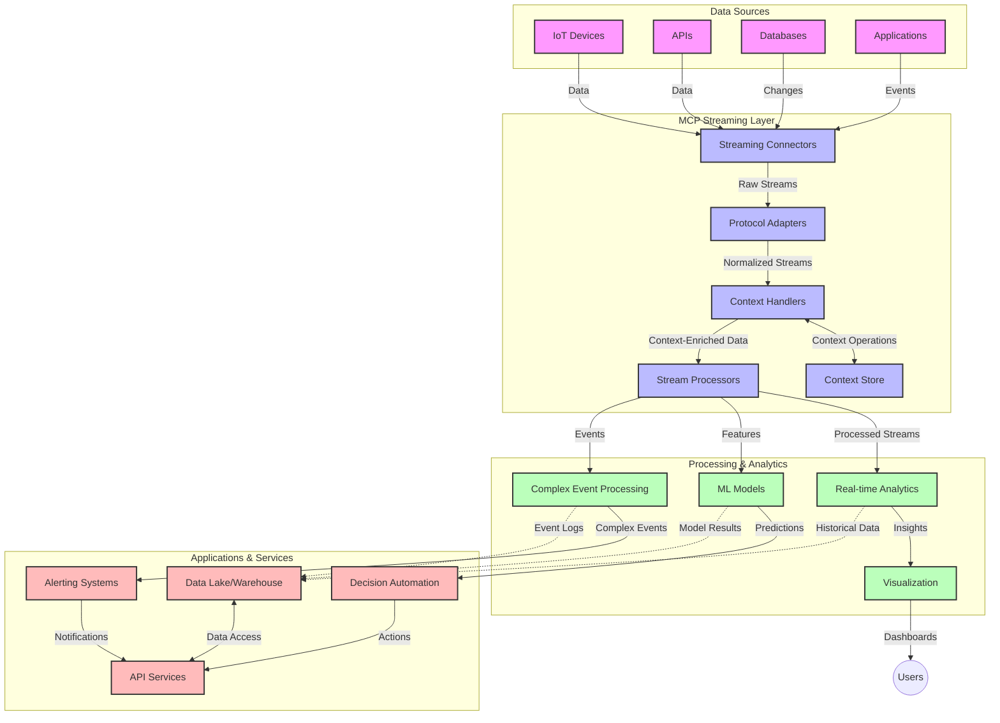

<!--
CO_OP_TRANSLATOR_METADATA:
{
  "original_hash": "68c518dbff8a3b127ed2aa934054c56c",
  "translation_date": "2025-06-11T17:06:28+00:00",
  "source_file": "05-AdvancedTopics/mcp-realtimestreaming/README.md",
  "language_code": "bn"
}
-->
# Model Context Protocol ফর রিয়েল-টাইম ডেটা স্ট্রিমিং

## ওভারভিউ

রিয়েল-টাইম ডেটা স্ট্রিমিং আজকের তথ্য-চালিত বিশ্বে অত্যাবশ্যক হয়ে উঠেছে, যেখানে ব্যবসা এবং অ্যাপ্লিকেশনগুলি সময়োপযোগী সিদ্ধান্ত নিতে তথ্যের সাথে তৎক্ষণাৎ অ্যাক্সেস চায়। Model Context Protocol (MCP) এই রিয়েল-টাইম স্ট্রিমিং প্রক্রিয়াগুলিকে অপ্টিমাইজ করার ক্ষেত্রে একটি গুরুত্বপূর্ণ অগ্রগতি উপস্থাপন করে, যা ডেটা প্রসেসিং দক্ষতা বৃদ্ধি করে, প্রাসঙ্গিকতা বজায় রাখে এবং সামগ্রিক সিস্টেম পারফরম্যান্স উন্নত করে।

এই মডিউলটি দেখাবে কিভাবে MCP AI মডেল, স্ট্রিমিং প্ল্যাটফর্ম এবং অ্যাপ্লিকেশন জুড়ে প্রসঙ্গ ব্যবস্থাপনার জন্য একটি মানক পদ্ধতি প্রদান করে রিয়েল-টাইম ডেটা স্ট্রিমিংকে রূপান্তরিত করে।

## রিয়েল-টাইম ডেটা স্ট্রিমিং পরিচিতি

রিয়েল-টাইম ডেটা স্ট্রিমিং একটি প্রযুক্তিগত ধারণা যা ডেটা উৎপন্ন হওয়ার সাথে সাথে ধারাবাহিকভাবে স্থানান্তর, প্রক্রিয়াকরণ এবং বিশ্লেষণ সক্ষম করে, যাতে সিস্টেমগুলি নতুন তথ্যের প্রতি তৎক্ষণাৎ প্রতিক্রিয়া জানাতে পারে। প্রচলিত ব্যাচ প্রসেসিংয়ের বিপরীতে, যা স্থির ডেটাসেটের উপর কাজ করে, স্ট্রিমিং ডেটা চলমান অবস্থায় প্রক্রিয়াকরণ করে, কম লেটেন্সিতে অন্তর্দৃষ্টি এবং ক্রিয়া প্রদান করে।

### রিয়েল-টাইম ডেটা স্ট্রিমিং এর মূল ধারণাসমূহ:

- **ধারাবাহিক ডেটা প্রবাহ**: ডেটা একটি অবিরাম, কখনও শেষ না হওয়া ইভেন্ট বা রেকর্ডের স্ট্রিম হিসেবে প্রক্রিয়াজাত হয়।
- **কম লেটেন্সি প্রসেসিং**: ডেটা উৎপত্তি থেকে প্রক্রিয়াকরণের মধ্যে সময় সর্বনিম্ন রাখা হয়।
- **স্কেলযোগ্যতা**: স্ট্রিমিং আর্কিটেকচার ভেরিয়েবল ডেটা পরিমাণ এবং গতি সামলাতে সক্ষম হতে হবে।
- **ফল্ট টলারেন্স**: সিস্টেমগুলিকে ব্যর্থতার বিরুদ্ধে স্থিতিস্থাপক হতে হবে যাতে ডেটার অবিচ্ছিন্ন প্রবাহ নিশ্চিত হয়।
- **স্টেটফুল প্রসেসিং**: অর্থবহ বিশ্লেষণের জন্য ইভেন্ট জুড়ে প্রসঙ্গ বজায় রাখা অপরিহার্য।

### Model Context Protocol এবং রিয়েল-টাইম স্ট্রিমিং

Model Context Protocol (MCP) রিয়েল-টাইম স্ট্রিমিং পরিবেশে বেশ কিছু গুরুত্বপূর্ণ চ্যালেঞ্জ মোকাবেলা করে:

1. **প্রসঙ্গগত ধারাবাহিকতা**: MCP বিতরণকৃত স্ট্রিমিং উপাদানগুলির মধ্যে প্রসঙ্গ বজায় রাখার পদ্ধতি মানক করে, নিশ্চিত করে যে AI মডেল এবং প্রক্রিয়াকরণ নোডগুলি প্রাসঙ্গিক ঐতিহাসিক ও পরিবেশগত প্রসঙ্গে অ্যাক্সেস পায়।

2. **দক্ষ স্টেট ম্যানেজমেন্ট**: প্রসঙ্গ প্রেরণের জন্য কাঠামোবদ্ধ পদ্ধতি প্রদান করে MCP স্ট্রিমিং পাইপলাইনে স্টেট ম্যানেজমেন্টের ওভারহেড কমায়।

3. **ইন্টারঅপারেবিলিটি**: MCP বিভিন্ন স্ট্রিমিং প্রযুক্তি ও AI মডেলের মধ্যে প্রসঙ্গ শেয়ারিংয়ের জন্য একটি সাধারণ ভাষা তৈরি করে, যা আরও নমনীয় ও সম্প্রসারিত আর্কিটেকচারকে সম্ভব করে।

4. **স্ট্রিমিং-অপ্টিমাইজড প্রসঙ্গ**: MCP বাস্তবায়নগুলি রিয়েল-টাইম সিদ্ধান্ত গ্রহণের জন্য সবচেয়ে প্রাসঙ্গিক প্রসঙ্গ উপাদানগুলিকে অগ্রাধিকার দিতে পারে, যা পারফরম্যান্স ও নির্ভুলতা উভয়ই অপ্টিমাইজ করে।

5. **অ্যাডাপ্টিভ প্রসেসিং**: MCP এর মাধ্যমে সঠিক প্রসঙ্গ ব্যবস্থাপনার মাধ্যমে স্ট্রিমিং সিস্টেমগুলি ডেটার পরিবর্তনশীল অবস্থা ও প্যাটার্ন অনুযায়ী প্রসেসিং গতিশীলভাবে সামঞ্জস্য করতে পারে।

আইওটি সেন্সর নেটওয়ার্ক থেকে শুরু করে আর্থিক ট্রেডিং প্ল্যাটফর্ম পর্যন্ত আধুনিক অ্যাপ্লিকেশনগুলিতে, MCP এবং স্ট্রিমিং প্রযুক্তির সংমিশ্রণ আরও বুদ্ধিমান, প্রসঙ্গ-সচেতন প্রসেসিং সক্ষম করে যা জটিল ও পরিবর্তনশীল পরিস্থিতিতে রিয়েল-টাইমে সঠিক প্রতিক্রিয়া জানাতে পারে।

## শেখার উদ্দেশ্য

এই পাঠের শেষে, আপনি সক্ষম হবেন:

- রিয়েল-টাইম ডেটা স্ট্রিমিং এর মৌলিক বিষয় ও চ্যালেঞ্জ বুঝতে
- ব্যাখ্যা করতে কিভাবে Model Context Protocol (MCP) রিয়েল-টাইম ডেটা স্ট্রিমিং উন্নত করে
- জনপ্রিয় ফ্রেমওয়ার্ক যেমন Kafka এবং Pulsar ব্যবহার করে MCP-ভিত্তিক স্ট্রিমিং সমাধান বাস্তবায়ন করতে
- MCP ব্যবহার করে ফল্ট-টলারেন্ট, উচ্চ-পারফরম্যান্স স্ট্রিমিং আর্কিটেকচার ডিজাইন ও ডিপ্লয় করতে
- MCP ধারণাগুলো IoT, আর্থিক ট্রেডিং, এবং AI-চালিত বিশ্লেষণ ক্ষেত্রে প্রয়োগ করতে
- MCP-ভিত্তিক স্ট্রিমিং প্রযুক্তিতে উদীয়মান প্রবণতা ও ভবিষ্যৎ উদ্ভাবন মূল্যায়ন করতে

### সংজ্ঞা ও গুরুত্ব

রিয়েল-টাইম ডেটা স্ট্রিমিং হলো ডেটার ধারাবাহিক উৎপত্তি, প্রক্রিয়াকরণ এবং কম লেটেন্সিতে ডেলিভারি। ব্যাচ প্রসেসিংয়ের বিপরীতে, যেখানে ডেটা একত্রিত করে গুচ্ছ আকারে প্রক্রিয়াজাত করা হয়, স্ট্রিমিং ডেটা আসার সাথে সাথেই ধাপে ধাপে প্রক্রিয়াজাত করে, যা তৎক্ষণাৎ অন্তর্দৃষ্টি এবং কার্যকরী সিদ্ধান্ত গ্রহণ সম্ভব করে।

রিয়েল-টাইম ডেটা স্ট্রিমিং এর মূল বৈশিষ্ট্যসমূহ:

- **কম লেটেন্সি**: মিলিসেকেন্ড থেকে সেকেন্ডের মধ্যে ডেটা প্রক্রিয়াকরণ ও বিশ্লেষণ
- **ধারাবাহিক প্রবাহ**: বিভিন্ন উৎস থেকে অবিচ্ছিন্ন ডেটা স্ট্রিম
- **তৎক্ষণাৎ প্রক্রিয়াকরণ**: ডেটা আসার সাথে সাথেই বিশ্লেষণ, ব্যাচে নয়
- **ইভেন্ট-চালিত আর্কিটেকচার**: ইভেন্ট ঘটার সাথে সাথেই প্রতিক্রিয়া

### প্রচলিত ডেটা স্ট্রিমিংয়ের চ্যালেঞ্জসমূহ

প্রচলিত ডেটা স্ট্রিমিং পদ্ধতিগুলো নিম্নলিখিত সীমাবদ্ধতায় ভুগে:

1. **প্রসঙ্গ হারানো**: বিতরণকৃত সিস্টেম জুড়ে প্রসঙ্গ বজায় রাখতে অসুবিধা
2. **স্কেলিং সমস্যা**: উচ্চ পরিমাণ ও উচ্চ গতির ডেটা সামলাতে চ্যালেঞ্জ
3. **ইন্টিগ্রেশন জটিলতা**: বিভিন্ন সিস্টেমের মধ্যে ইন্টারঅপারেবিলিটি সমস্যা
4. **লেটেন্সি ব্যবস্থাপনা**: থ্রুপুট ও প্রক্রিয়াকরণ সময়ের মধ্যে সামঞ্জস্য রাখা
5. **ডেটা সঙ্গতি**: স্ট্রিম জুড়ে ডেটার সঠিকতা ও সম্পূর্ণতা নিশ্চিত করা

## Model Context Protocol (MCP) বোঝা

### MCP কী?

Model Context Protocol (MCP) একটি মানক যোগাযোগ প্রোটোকল যা AI মডেল এবং অ্যাপ্লিকেশনগুলোর মধ্যে দক্ষ ইন্টারঅ্যাকশন সহজতর করার জন্য ডিজাইন করা হয়েছে। রিয়েল-টাইম ডেটা স্ট্রিমিংয়ের প্রসঙ্গে, MCP প্রদান করে:

- ডেটা পাইপলাইনে প্রসঙ্গ সংরক্ষণ
- ডেটা বিনিময়ের ফরম্যাট মানকরণ
- বড় ডেটাসেটের প্রেরণ অপ্টিমাইজেশন
- মডেল-টু-মডেল এবং মডেল-টু-অ্যাপ্লিকেশন যোগাযোগ উন্নতকরণ

### মূল উপাদান ও আর্কিটেকচার

রিয়েল-টাইম স্ট্রিমিংয়ের জন্য MCP আর্কিটেকচারের প্রধান উপাদানগুলো:

1. **Context Handlers**: স্ট্রিমিং পাইপলাইনে প্রসঙ্গগত তথ্য পরিচালনা ও রক্ষণাবেক্ষণ করে
2. **Stream Processors**: প্রসঙ্গ-সচেতন কৌশল ব্যবহার করে আসা ডেটা স্ট্রিম প্রক্রিয়াজাত করে
3. **Protocol Adapters**: বিভিন্ন স্ট্রিমিং প্রোটোকলের মধ্যে রূপান্তর করে প্রসঙ্গ সংরক্ষণ করে
4. **Context Store**: প্রসঙ্গগত তথ্য দক্ষতার সঙ্গে সংরক্ষণ ও পুনরুদ্ধার করে
5. **Streaming Connectors**: বিভিন্ন স্ট্রিমিং প্ল্যাটফর্মের সাথে সংযোগ স্থাপন করে (Kafka, Pulsar, Kinesis ইত্যাদি)



### MCP কিভাবে রিয়েল-টাইম ডেটা হ্যান্ডলিং উন্নত করে

MCP প্রচলিত স্ট্রিমিং চ্যালেঞ্জগুলো মোকাবেলা করে:

- **প্রসঙ্গগত অখণ্ডতা**: পুরো পাইপলাইনে ডেটা পয়েন্টগুলোর মধ্যে সম্পর্ক বজায় রাখা
- **অপ্টিমাইজড ট্রান্সমিশন**: বুদ্ধিমত্তার সঙ্গে প্রসঙ্গ ব্যবস্থাপনা করে ডেটা বিনিময়ে পুনরাবৃত্তি কমানো
- **মানকৃত ইন্টারফেস**: স্ট্রিমিং উপাদানগুলোর জন্য সঙ্গতিপূর্ণ API প্রদান
- **কম লেটেন্সি**: দক্ষ প্রসঙ্গ পরিচালনার মাধ্যমে প্রক্রিয়াকরণের ওভারহেড কমানো
- **বর্ধিত স্কেলযোগ্যতা**: প্রসঙ্গ বজায় রেখে অনুভূমিক স্কেলিং সমর্থন করা

## ইন্টিগ্রেশন ও বাস্তবায়ন

রিয়েল-টাইম ডেটা স্ট্রিমিং সিস্টেমগুলোর জন্য পারফরম্যান্স এবং প্রসঙ্গগত অখণ্ডতা বজায় রাখতে সাবধানে আর্কিটেকচার ডিজাইন ও বাস্তবায়ন প্রয়োজন। Model Context Protocol AI মডেল ও স্ট্রিমিং প্রযুক্তির সংমিশ্রণের জন্য একটি মানক পদ্ধতি প্রদান করে, যা আরও জটিল, প্রসঙ্গ-সচেতন প্রসেসিং পাইপলাইন তৈরি সম্ভব করে।

### স্ট্রিমিং আর্কিটেকচারে MCP ইন্টিগ্রেশনের ওভারভিউ

রিয়েল-টাইম স্ট্রিমিং পরিবেশে MCP বাস্তবায়নের জন্য প্রধান বিবেচ্য বিষয়সমূহ:

1. **Context Serialization এবং Transport**: MCP স্ট্রিমিং ডেটা প্যাকেটে প্রসঙ্গগত তথ্য এনকোড করার দক্ষ পদ্ধতি প্রদান করে, নিশ্চিত করে যে প্রয়োজনীয় প্রসঙ্গ ডেটার সাথে পুরো প্রক্রিয়াজাতকরণ পাইপলাইনে অনুসরণ করে। এর মধ্যে স্ট্রিমিং ট্রান্সপোর্টের জন্য অপ্টিমাইজড মানক সিরিয়ালাইজেশন ফরম্যাট অন্তর্ভুক্ত।

2. **স্টেটফুল স্ট্রিম প্রসেসিং**: MCP প্রসঙ্গ উপস্থাপনায় সামঞ্জস্য বজায় রেখে আরও বুদ্ধিমান স্টেটফুল প্রসেসিং সক্ষম করে। এটি বিশেষভাবে মূল্যবান বিতরণকৃত স্ট্রিমিং আর্কিটেকচারে যেখানে স্টেট ম্যানেজমেন্ট সাধারণত চ্যালেঞ্জিং।

3. **ইভেন্ট-টাইম বনাম প্রসেসিং-টাইম**: MCP বাস্তবায়নগুলোকে ইভেন্ট কখন ঘটেছিল এবং কখন প্রক্রিয়াজাত হচ্ছে তার পার্থক্য করার চ্যালেঞ্জ মোকাবেলা করতে হবে। প্রোটোকলটি ইভেন্ট টাইম সেমান্টিক্স সংরক্ষণকারী কালক্রমিক প্রসঙ্গ অন্তর্ভুক্ত করতে পারে।

4. **ব্যাকপ্রেশার ম্যানেজমেন্ট**: প্রসঙ্গ হ্যান্ডলিং মানক করে MCP স্ট্রিমিং সিস্টেমে ব্যাকপ্রেশার পরিচালনায় সাহায্য করে, উপাদানগুলোকে তাদের প্রক্রিয়াকরণ ক্ষমতা জানাতে এবং প্রবাহ সামঞ্জস্য করতে দেয়।

5. **Context Windowing এবং Aggregation**: MCP কালক্রমিক ও সম্পর্কযুক্ত প্রসঙ্গের কাঠামোবদ্ধ উপস্থাপনা দিয়ে আরও উন্নত উইন্ডোয়িং অপারেশন সক্ষম করে, যা ইভেন্ট স্ট্রিম জুড়ে আরও অর্থবহ সমষ্টি তৈরি সম্ভব করে।

6. **এক্স্যাক্টলি-ওয়ান্স প্রসেসিং**: এক্স্যাক্টলি-ওয়ান্স সেমান্টিক্স প্রয়োজন এমন স্ট্রিমিং সিস্টেমে MCP প্রসেসিং মেটাডেটা অন্তর্ভুক্ত করতে পারে, যা বিতরণকৃত উপাদানগুলোর মধ্যে প্রসেসিং স্ট্যাটাস ট্র্যাক ও যাচাই করতে সাহায্য করে।

বিভিন্ন স্ট্রিমিং প্রযুক্তিতে MCP বাস্তবায়ন প্রসঙ্গ ব্যবস্থাপনার জন্য একটি ঐক্যবদ্ধ পদ্ধতি তৈরি করে, কাস্টম ইন্টিগ্রেশন কোডের প্রয়োজন কমায় এবং ডেটা পাইপলাইনে অর্থবহ প্রসঙ্গ বজায় রাখার ক্ষমতা বাড়ায়।

### বিভিন্ন ডেটা স্ট্রিমিং ফ্রেমওয়ার্কে MCP

MCP জনপ্রিয় স্ট্রিমিং ফ্রেমওয়ার্কগুলোর সাথে ইন্টিগ্রেট করা যায়:

#### Apache Kafka ইন্টিগ্রেশন

```python
from mcp_streaming import MCPKafkaConnector

# Initialize MCP Kafka connector
connector = MCPKafkaConnector(
    bootstrap_servers='localhost:9092',
    context_preservation=True
)

# Create a context-aware consumer
consumer = connector.create_consumer('input-topic')

# Process streaming data with context
for message in consumer:
    context = message.get_context()
    data = message.get_value()
    
    # Process with context awareness
    result = process_with_context(data, context)
    
    # Produce output with preserved context
    connector.produce('output-topic', result, context=context)
```

#### Apache Pulsar বাস্তবায়ন

```python
from mcp_streaming import MCPPulsarClient

# Initialize MCP Pulsar client
client = MCPPulsarClient('pulsar://localhost:6650')

# Subscribe with context awareness
consumer = client.subscribe('input-topic', 'subscription-name', 
                           context_enabled=True)

# Process messages with context preservation
while True:
    message = consumer.receive()
    context = message.get_context()
    
    # Process with context
    result = process_with_context(message.data(), context)
    
    # Acknowledge the message
    consumer.acknowledge(message)
    
    # Send result with preserved context
    producer = client.create_producer('output-topic')
    producer.send(result, context=context)
```

### ডিপ্লয়মেন্টের সেরা অনুশীলনসমূহ

রিয়েল-টাইম স্ট্রিমিংয়ের জন্য MCP বাস্তবায়নের সময়:

1. **ফল্ট টলারেন্স ডিজাইন করুন**:
   - সঠিক ত্রুটি পরিচালনা বাস্তবায়ন করুন
   - ব্যর্থ মেসেজের জন্য ডেড-লেটার কিউ ব্যবহার করুন
   - আইডেম্পোটেন্ট প্রসেসর ডিজাইন করুন

2. **পারফরম্যান্স অপ্টিমাইজ করুন**:
   - উপযুক্ত বাফার সাইজ কনফিগার করুন
   - প্রয়োজনীয় ক্ষেত্রে ব্যাচিং ব্যবহার করুন
   - ব্যাকপ্রেশার মেকানিজম বাস্তবায়ন করুন

3. **মনিটর ও পর্যবেক্ষণ করুন**:
   - স্ট্রিম প্রসেসিং মেট্রিক্স ট্র্যাক করুন
   - প্রসঙ্গ প্রোপাগেশন মনিটর করুন
   - অস্বাভাবিকতার জন্য সতর্কতা সেট করুন

4. **আপনার স্ট্রিম সুরক্ষিত করুন**:
   - সংবেদনশীল ডেটার জন্য এনক্রিপশন বাস্তবায়ন করুন
   - প্রমাণীকরণ ও অনুমোদন ব্যবহার করুন
   - যথাযথ অ্যাক্সেস নিয়ন্ত্রণ প্রয়োগ করুন

### IoT এবং Edge Computing এ MCP

MCP IoT স্ট্রিমিং উন্নত করে:

- ডিভাইস প্রসঙ্গ স্ট্রিমিং পাইপলাইনে সংরক্ষণ করে
- কার্যকর এজ-টু-ক্লাউড ডেটা স্ট্রিমিং সক্ষম করে
- IoT ডেটা স্ট্রিমে রিয়েল-টাইম বিশ্লেষণ সমর্থন করে
- প্রসঙ্গসহ ডিভাইস-টু-ডিভাইস যোগাযোগ সহজ করে

উদাহরণ: স্মার্ট সিটি সেন্সর নেটওয়ার্ক  
```
Sensors → Edge Gateways → MCP Stream Processors → Real-time Analytics → Automated Responses
```

### আর্থিক লেনদেন এবং উচ্চ-ফ্রিকোয়েন্সি ট্রেডিংয়ে ভূমিকা

MCP আর্থিক ডেটা স্ট্রিমিংয়ের জন্য উল্লেখযোগ্য সুবিধা প্রদান করে:

- ট্রেডিং সিদ্ধান্তের জন্য আল্ট্রা-লো লেটেন্সি প্রসেসিং
- প্রক্রিয়াজাতকরণের পুরো সময় লেনদেন প্রসঙ্গ বজায় রাখা
- প্রসঙ্গ সচেতন জটিল ইভেন্ট প্রসেসিং সমর্থন
- বিতরণকৃত ট্রেডিং সিস্টেম জুড়ে ডেটা সঙ্গতি নিশ্চিত করা

### AI-চালিত ডেটা বিশ্লেষণে উন্নতি

MCP স্ট্রিমিং বিশ্লেষণের জন্য নতুন সম্ভাবনা তৈরি করে:

- রিয়েল-টাইম মডেল ট্রেনিং এবং ইনফারেন্স
- স্ট্রিমিং ডেটা থেকে ধারাবাহিক শেখা
- প্রসঙ্গ-সচেতন ফিচার এক্সট্রাকশন
- সংরক্ষিত প্রসঙ্গসহ মাল্টি-মডেল ইনফারেন্স পাইপলাইন

## ভবিষ্যৎ প্রবণতা ও উদ্ভাবন

### রিয়েল-টাইম পরিবেশে MCP এর বিবর্তন

অগ্রগতিতে, MCP নিম্নলিখিত বিষয়গুলো মোকাবেলা করার প্রত্যাশা:

- **কোয়ান্টাম কম্পিউটিং ইন্টিগ্রেশন**: কোয়ান্টাম-ভিত্তিক স্ট্রিমিং সিস্টেমের প্রস্তুতি
- **এজ-নেটিভ প্রসেসিং**: আরও প্রসঙ্গ-সচেতন প্রসেসিং এজ ডিভাইসে স্থানান্তর
- **স্বয়ংক্রিয় স্ট্রিম ব্যবস্থাপনা**: স্ব-অপ্টিমাইজিং স্ট্রিমিং পাইপলাইন
- **ফেডারেটেড স্ট্রিমিং**: গোপনীয়তা বজায় রেখে বিতরণকৃত প্রসেসিং

### প্রযুক্তিগত সম্ভাব্য উন্নয়ন

MCP স্ট্রিমিংয়ের ভবিষ্যত গঠনে উদীয়মান প্রযুক্তি:

1. **AI-অপ্টিমাইজড স্ট্রিমিং প্রোটোকল**: AI ওয়ার্কলোডের জন্য বিশেষভাবে ডিজাইন করা প্রোটোকল
2. **নিউরোমরফিক কম্পিউটিং ইন্টিগ্রেশন**: ব্রেইন-অনুপ্রাণিত স্ট্রিম প্রসেসিং
3. **সার্ভারলেস স্ট্রিমিং**: অবকাঠামো ব্যবস্থাপনা ছাড়া ইভেন্ট-চালিত, স্কেলেবল স্ট্রিমিং
4. **বিতরণকৃত প্রসঙ্গ স্টোর**: বিশ্বব্যাপী বিতরণকৃত

**দায়িত্ব ত্যাগ**:  
এই নথিটি AI অনুবাদ সেবা [Co-op Translator](https://github.com/Azure/co-op-translator) ব্যবহার করে অনূদিত হয়েছে। আমরা যথাসাধ্য সঠিকতার চেষ্টা করি, তবে দয়া করে লক্ষ্য করুন যে স্বয়ংক্রিয় অনুবাদে ভুল বা অসঙ্গতি থাকতে পারে। মূল নথিটি তার মাতৃভাষায়ই প্রামাণিক উৎস হিসেবে বিবেচনা করা উচিত। গুরুত্বপূর্ণ তথ্যের জন্য পেশাদার মানব অনুবাদ গ্রহণ করার পরামর্শ দেওয়া হয়। এই অনুবাদের ব্যবহারের ফলে সৃষ্ট কোনো ভুল বোঝাবুঝি বা ভুল ব্যাখ্যার জন্য আমরা দায়ী নই।