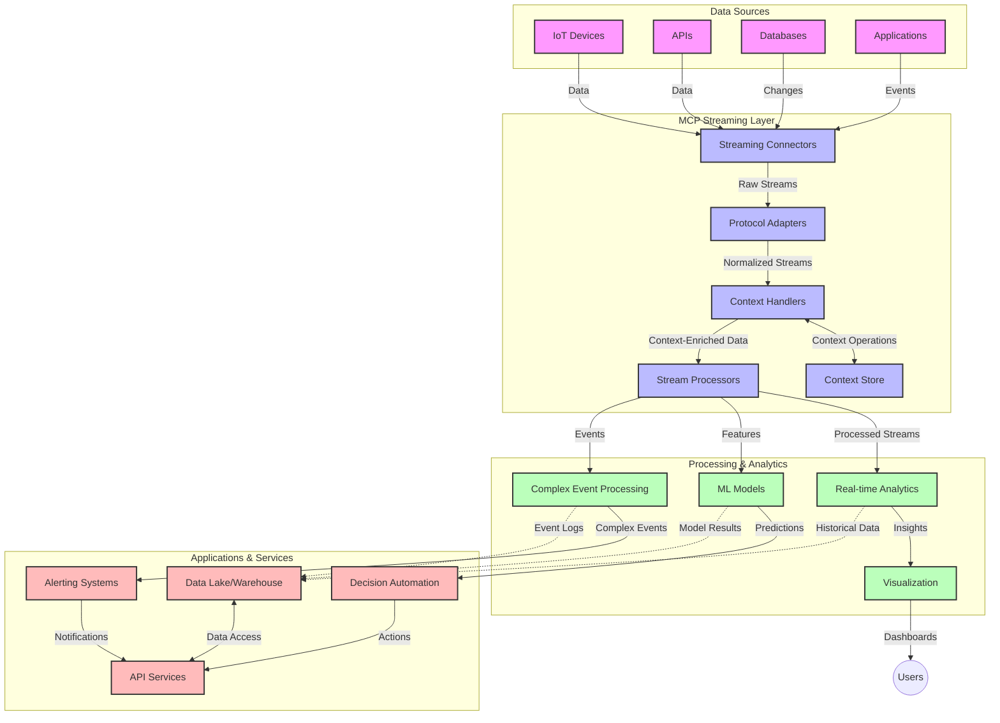

<!--
CO_OP_TRANSLATOR_METADATA:
{
  "original_hash": "195f7287638b77a549acadd96c8f981c",
  "translation_date": "2025-06-12T23:18:56+00:00",
  "source_file": "05-AdvancedTopics/mcp-realtimestreaming/README.md",
  "language_code": "bn"
}
-->
# Model Context Protocol for Real-Time Data Streaming

## ওভারভিউ

আজকের তথ্যভিত্তিক বিশ্বে, যেখানে ব্যবসা ও অ্যাপ্লিকেশনগুলো সময়োপযোগী সিদ্ধান্ত নিতে তথ্যের তাৎক্ষণিক প্রবাহ প্রয়োজন, সেখানে রিয়েল-টাইম ডেটা স্ট্রিমিং অপরিহার্য হয়ে উঠেছে। Model Context Protocol (MCP) এই রিয়েল-টাইম স্ট্রিমিং প্রক্রিয়াগুলোর অপ্টিমাইজেশনে একটি গুরুত্বপূর্ণ অগ্রগতি, যা ডেটা প্রক্রিয়াকরণ দক্ষতা বাড়ায়, প্রসঙ্গগত সামঞ্জস্য বজায় রাখে এবং সামগ্রিক সিস্টেম পারফরম্যান্স উন্নত করে।

এই মডিউলটি MCP কীভাবে AI মডেল, স্ট্রিমিং প্ল্যাটফর্ম এবং অ্যাপ্লিকেশনগুলোর মধ্যে প্রসঙ্গ ব্যবস্থাপনায় একটি মানসম্মত পদ্ধতি প্রদান করে রিয়েল-টাইম ডেটা স্ট্রিমিং পরিবর্তন করে তা অন্বেষণ করে।

## রিয়েল-টাইম ডেটা স্ট্রিমিং পরিচিতি

রিয়েল-টাইম ডেটা স্ট্রিমিং এমন একটি প্রযুক্তিগত ধারা যা তথ্য উৎপাদনের সাথে সাথেই ধারাবাহিকভাবে ডেটা স্থানান্তর, প্রক্রিয়াকরণ এবং বিশ্লেষণ সম্ভব করে, ফলে সিস্টেমগুলো নতুন তথ্যের প্রতি তাৎক্ষণিক সাড়া দিতে পারে। যেখানে প্রচলিত ব্যাচ প্রক্রিয়াকরণ স্থির ডেটাসেটের উপর কাজ করে, সেখানে স্ট্রিমিং চলমান ডেটা প্রক্রিয়াকরণ করে, যা ন্যূনতম বিলম্বে অন্তর্দৃষ্টি ও কার্যক্রম প্রদান করে।

### রিয়েল-টাইম ডেটা স্ট্রিমিংয়ের মূল ধারণাসমূহ:

- **অবিচ্ছিন্ন ডেটা প্রবাহ**: ডেটা একটি অবিরাম, কখনো শেষ না হওয়া ইভেন্ট বা রেকর্ডের ধারা হিসেবে প্রক্রিয়াকৃত হয়।
- **নিম্ন বিলম্ব প্রক্রিয়াকরণ**: ডেটা উৎপাদন ও প্রক্রিয়াকরণের মধ্যে সময় কমিয়ে আনা হয়।
- **স্কেলযোগ্যতা**: স্ট্রিমিং আর্কিটেকচারগুলোকে পরিবর্তনশীল ডেটার পরিমাণ ও গতি সামলাতে সক্ষম হতে হবে।
- **ত্রুটিপ্রতিরোধ ক্ষমতা**: ডেটার অবিচ্ছিন্ন প্রবাহ নিশ্চিত করতে সিস্টেমগুলোকে ব্যর্থতার বিরুদ্ধে স্থিতিস্থাপক হতে হবে।
- **স্টেটফুল প্রক্রিয়াকরণ**: ইভেন্টগুলোর মধ্যে প্রসঙ্গ ধরে রাখা অর্থবহ বিশ্লেষণের জন্য অত্যাবশ্যক।

### Model Context Protocol এবং রিয়েল-টাইম স্ট্রিমিং

Model Context Protocol (MCP) রিয়েল-টাইম স্ট্রিমিং পরিবেশের কয়েকটি গুরুত্বপূর্ণ চ্যালেঞ্জ মোকাবেলা করে:

1. **প্রসঙ্গগত ধারাবাহিকতা**: MCP বিতরণকৃত স্ট্রিমিং উপাদানগুলোর মধ্যে প্রসঙ্গ বজায় রাখার পদ্ধতি মানসম্মত করে, নিশ্চিত করে AI মডেল এবং প্রক্রিয়াকরণ নোডগুলো প্রাসঙ্গিক ঐতিহাসিক ও পরিবেশগত প্রসঙ্গে অ্যাক্সেস পায়।

2. **কার্যকর স্টেট ম্যানেজমেন্ট**: প্রসঙ্গ প্রেরণের জন্য গঠনমূলক ব্যবস্থা প্রদান করে MCP স্ট্রিমিং পাইপলাইনের স্টেট ব্যবস্থাপনার ওভারহেড কমায়।

3. **ইন্টারঅপারেবিলিটি**: MCP বিভিন্ন স্ট্রিমিং প্রযুক্তি এবং AI মডেলের মধ্যে প্রসঙ্গ ভাগাভাগির জন্য একটি সাধারণ ভাষা তৈরি করে, যা আরও নমনীয় ও সম্প্রসার্য আর্কিটেকচার সম্ভব করে।

4. **স্ট্রিমিং-অপ্টিমাইজড প্রসঙ্গ**: MCP বাস্তবায়নগুলি কোন প্রসঙ্গ উপাদানগুলো রিয়েল-টাইম সিদ্ধান্ত গ্রহণের জন্য সবচেয়ে প্রাসঙ্গিক তা অগ্রাধিকার দিতে পারে, পারফরম্যান্স ও নির্ভুলতার জন্য অপ্টিমাইজ করে।

5. **অ্যাডাপটিভ প্রক্রিয়াকরণ**: MCP এর মাধ্যমে সঠিক প্রসঙ্গ ব্যবস্থাপনার ফলে স্ট্রিমিং সিস্টেমগুলো ডেটার পরিবর্তনশীল অবস্থা ও প্যাটার্ন অনুযায়ী প্রক্রিয়াকরণ গতিশীলভাবে সামঞ্জস্য করতে পারে।

আইওটি সেন্সর নেটওয়ার্ক থেকে শুরু করে আর্থিক ট্রেডিং প্ল্যাটফর্ম পর্যন্ত আধুনিক অ্যাপ্লিকেশনগুলোতে MCP এবং স্ট্রিমিং প্রযুক্তির সংমিশ্রণ আরও বুদ্ধিমান, প্রসঙ্গ-সচেতন প্রক্রিয়াকরণ সক্ষম করে, যা জটিল এবং পরিবর্তনশীল পরিস্থিতিতে রিয়েল-টাইমে উপযুক্ত সাড়া দিতে পারে।

## শেখার উদ্দেশ্য

এই পাঠ শেষে আপনি পারবেন:

- রিয়েল-টাইম ডেটা স্ট্রিমিংয়ের মৌলিক বিষয় এবং এর চ্যালেঞ্জগুলো বোঝা
- Model Context Protocol (MCP) কীভাবে রিয়েল-টাইম ডেটা স্ট্রিমিং উন্নত করে তা ব্যাখ্যা করা
- Kafka এবং Pulsar-এর মতো জনপ্রিয় ফ্রেমওয়ার্ক ব্যবহার করে MCP-ভিত্তিক স্ট্রিমিং সমাধান বাস্তবায়ন করা
- MCP ব্যবহার করে ত্রুটিপ্রতিরোধী, উচ্চ-পারফরম্যান্স স্ট্রিমিং আর্কিটেকচার ডিজাইন ও স্থাপন করা
- MCP ধারণাগুলো IoT, আর্থিক ট্রেডিং এবং AI-চালিত বিশ্লেষণ ক্ষেত্রে প্রয়োগ করা
- MCP-ভিত্তিক স্ট্রিমিং প্রযুক্তির উদীয়মান প্রবণতা ও ভবিষ্যৎ উদ্ভাবন মূল্যায়ন করা

### সংজ্ঞা এবং গুরুত্ব

রিয়েল-টাইম ডেটা স্ট্রিমিং হল এমন একটি প্রক্রিয়া যেখানে ডেটা অবিচ্ছিন্নভাবে উৎপন্ন, প্রক্রিয়াকৃত এবং ন্যূনতম বিলম্বে সরবরাহ করা হয়। ব্যাচ প্রক্রিয়াকরণের বিপরীতে, যেখানে ডেটা একত্রিত হয়ে ব্যাচ আকারে প্রক্রিয়াকৃত হয়, স্ট্রিমিং ডেটা আসার সাথে সাথেই ধাপে ধাপে প্রক্রিয়াকরণ হয়, যা তাৎক্ষণিক অন্তর্দৃষ্টি ও কার্যক্রম নিশ্চিত করে।

রিয়েল-টাইম ডেটা স্ট্রিমিংয়ের মূল বৈশিষ্ট্যগুলো:

- **নিম্ন বিলম্ব**: মিলিসেকেন্ড থেকে সেকেন্ডের মধ্যে ডেটা প্রক্রিয়াকরণ ও বিশ্লেষণ
- **অবিচ্ছিন্ন প্রবাহ**: বিভিন্ন উৎস থেকে ডেটার অবিরাম প্রবাহ
- **তাৎক্ষণিক প্রক্রিয়াকরণ**: ব্যাচের পরিবর্তে ডেটা আসার সঙ্গে সঙ্গেই বিশ্লেষণ
- **ইভেন্ট-চালিত আর্কিটেকচার**: ইভেন্ট ঘটার সাথে সাথেই সাড়া দেয়া

### প্রচলিত ডেটা স্ট্রিমিংয়ের চ্যালেঞ্জসমূহ

প্রচলিত ডেটা স্ট্রিমিং পদ্ধতিগুলো নিম্নলিখিত সীমাবদ্ধতার সম্মুখীন:

1. **প্রসঙ্গ হারানো**: বিতরণকৃত সিস্টেমে প্রসঙ্গ ধরে রাখা কঠিন
2. **স্কেলিং সমস্যা**: উচ্চ পরিমাণ ও উচ্চ গতি সম্পন্ন ডেটা সামলাতে সমস্যা
3. **ইন্টিগ্রেশন জটিলতা**: বিভিন্ন সিস্টেমের মধ্যে ইন্টারঅপারেবিলিটির সমস্যা
4. **বিলম্ব ব্যবস্থাপনা**: থ্রুপুট ও প্রক্রিয়াকরণের সময়ের মধ্যে সামঞ্জস্য রাখা
5. **ডেটা সঙ্গতি**: স্ট্রিম জুড়ে ডেটার নির্ভুলতা ও সম্পূর্ণতা নিশ্চিত করা

## Model Context Protocol (MCP) বোঝা

### MCP কী?

Model Context Protocol (MCP) একটি মানসম্মত যোগাযোগ প্রোটোকল যা AI মডেল ও অ্যাপ্লিকেশনগুলোর মধ্যে কার্যকর ইন্টারঅ্যাকশন সহজতর করার জন্য ডিজাইন করা হয়েছে। রিয়েল-টাইম ডেটা স্ট্রিমিংয়ের ক্ষেত্রে MCP নিম্নলিখিত সুবিধা প্রদান করে:

- ডেটা পাইপলাইনের মাধ্যমে প্রসঙ্গ সংরক্ষণ
- ডেটা বিনিময়ের ফরম্যাট মানসম্মতকরণ
- বৃহৎ ডেটাসেটের প্রেরণ অপ্টিমাইজেশন
- মডেল থেকে মডেল এবং মডেল থেকে অ্যাপ্লিকেশন যোগাযোগ উন্নতকরণ

### মূল উপাদান ও আর্কিটেকচার

রিয়েল-টাইম স্ট্রিমিংয়ের জন্য MCP আর্কিটেকচারের প্রধান উপাদানগুলো:

1. **Context Handlers**: স্ট্রিমিং পাইপলাইনের মধ্যে প্রসঙ্গগত তথ্য পরিচালনা ও সংরক্ষণ করে
2. **Stream Processors**: প্রসঙ্গ-সচেতন প্রযুক্তি ব্যবহার করে ইনকামিং ডেটা স্ট্রিম প্রক্রিয়াকরণ করে
3. **Protocol Adapters**: বিভিন্ন স্ট্রিমিং প্রোটোকলের মধ্যে প্রসঙ্গ বজায় রেখে রূপান্তর করে
4. **Context Store**: প্রসঙ্গগত তথ্য দক্ষতার সঙ্গে সংরক্ষণ ও পুনরুদ্ধার করে
5. **Streaming Connectors**: বিভিন্ন স্ট্রিমিং প্ল্যাটফর্ম (Kafka, Pulsar, Kinesis ইত্যাদি) এর সাথে সংযোগ স্থাপন করে



### MCP কীভাবে রিয়েল-টাইম ডেটা হ্যান্ডলিং উন্নত করে

MCP প্রচলিত স্ট্রিমিং চ্যালেঞ্জগুলো মোকাবেলা করে:

- **প্রসঙ্গগত অখণ্ডতা**: পুরো পাইপলাইনে ডেটা পয়েন্টগুলোর মধ্যে সম্পর্ক বজায় রাখা
- **অপ্টিমাইজড ট্রান্সমিশন**: বুদ্ধিমত্তার সাথে প্রসঙ্গ ব্যবস্থাপনার মাধ্যমে ডেটা বিনিময়ে পুনরাবৃত্তি কমানো
- **মানসম্মত ইন্টারফেস**: স্ট্রিমিং উপাদানগুলোর জন্য সঙ্গতিপূর্ণ API প্রদান
- **কম বিলম্ব**: দক্ষ প্রসঙ্গ ব্যবস্থাপনার মাধ্যমে প্রক্রিয়াকরণের ওভারহেড হ্রাস
- **উন্নত স্কেলযোগ্যতা**: প্রসঙ্গ বজায় রেখে অনুভূমিক স্কেলিং সমর্থন

## ইন্টিগ্রেশন এবং বাস্তবায়ন

রিয়েল-টাইম ডেটা স্ট্রিমিং সিস্টেমগুলো পারফরম্যান্স এবং প্রসঙ্গগত অখণ্ডতা বজায় রাখতে সাবধানতার সাথে আর্কিটেকচার ডিজাইন এবং বাস্তবায়ন প্রয়োজন। Model Context Protocol AI মডেল এবং স্ট্রিমিং প্রযুক্তির সংমিশ্রণে একটি মানসম্মত পদ্ধতি প্রদান করে, যা আরও উন্নত, প্রসঙ্গ-সচেতন প্রক্রিয়াকরণ পাইপলাইন তৈরিতে সহায়ক।

### স্ট্রিমিং আর্কিটেকচারে MCP ইন্টিগ্রেশনের ওভারভিউ

রিয়েল-টাইম স্ট্রিমিং পরিবেশে MCP বাস্তবায়নের সময় কয়েকটি গুরুত্বপূর্ণ বিষয় বিবেচনা করতে হয়:

1. **Context Serialization and Transport**: MCP স্ট্রিমিং ডেটা প্যাকেটের মধ্যে প্রসঙ্গগত তথ্য এনকোড করার জন্য কার্যকর পদ্ধতি প্রদান করে, নিশ্চিত করে যে প্রয়োজনীয় প্রসঙ্গ ডেটার সাথে পুরো প্রক্রিয়াকরণ পাইপলাইনে প্রবাহিত হয়। এতে স্ট্রিমিং পরিবহনের জন্য অপ্টিমাইজড মানসম্মত সিরিয়ালাইজেশন ফরম্যাট অন্তর্ভুক্ত।

2. **Stateful Stream Processing**: MCP প্রসঙ্গের ধারাবাহিক উপস্থাপনা বজায় রেখে আরও বুদ্ধিমান স্টেটফুল প্রক্রিয়াকরণ সক্ষম করে। এটি বিশেষভাবে বিতরণকৃত স্ট্রিমিং আর্কিটেকচারে মূল্যবান, যেখানে স্টেট ম্যানেজমেন্ট চ্যালেঞ্জিং।

3. **Event-Time vs. Processing-Time**: MCP বাস্তবায়নগুলোকে ইভেন্ট কখন ঘটেছে এবং কখন প্রক্রিয়াকৃত হচ্ছে তার পার্থক্য করার চ্যালেঞ্জ মোকাবেলা করতে হয়। প্রোটোকলটি ইভেন্ট টাইম সেমান্টিক্স সংরক্ষণকারী কালানুক্রমিক প্রসঙ্গ অন্তর্ভুক্ত করতে পারে।

4. **Backpressure Management**: প্রসঙ্গ হ্যান্ডলিং মানসম্মতকরণের মাধ্যমে MCP স্ট্রিমিং সিস্টেমে ব্যাকপ্রেশার নিয়ন্ত্রণে সাহায্য করে, উপাদানগুলোকে তাদের প্রক্রিয়াকরণের সক্ষমতা জানাতে এবং প্রবাহ সামঞ্জস্য করতে দেয়।

5. **Context Windowing and Aggregation**: MCP গঠনমূলক কালানুক্রমিক ও সম্পর্কিত প্রসঙ্গ উপস্থাপনা প্রদান করে আরও জটিল উইন্ডোয়িং অপারেশন সহজতর করে, যা ইভেন্ট স্ট্রিম জুড়ে অর্থবহ সংকলন সম্ভব করে।

6. **Exactly-Once Processing**: এক্সাক্টলি-ওয়ান্স সেমান্টিক্স প্রয়োজন এমন স্ট্রিমিং সিস্টেমে MCP প্রসেসিং মেটাডেটা অন্তর্ভুক্ত করতে পারে, যা বিতরণকৃত উপাদানগুলোর মধ্যে প্রক্রিয়াকরণ অবস্থা ট্র্যাক ও যাচাই করতে সহায়ক।

বিভিন্ন স্ট্রিমিং প্রযুক্তিতে MCP বাস্তবায়ন প্রসঙ্গ ব্যবস্থাপনায় একটি ঐক্যবদ্ধ পদ্ধতি তৈরি করে, কাস্টম ইন্টিগ্রেশন কোডের প্রয়োজন কমায় এবং ডেটা পাইপলাইনে প্রসঙ্গ অর্থবহ রাখার ক্ষমতা বৃদ্ধি করে।

### বিভিন্ন ডেটা স্ট্রিমিং ফ্রেমওয়ার্কে MCP

নিম্নলিখিত উদাহরণগুলো বর্তমান MCP স্পেসিফিকেশন অনুসরণ করে, যা JSON-RPC ভিত্তিক প্রোটোকলের উপর নির্ভরশীল এবং পৃথক পরিবহন ব্যবস্থা ব্যবহার করে। কোড দেখায় কিভাবে Kafka এবং Pulsar-এর মতো স্ট্রিমিং প্ল্যাটফর্মের সাথে ইন্টিগ্রেট করা যায় এবং MCP প্রোটোকলের পূর্ণ সামঞ্জস্য বজায় রাখা যায়।

এই উদাহরণগুলো MCP-এর কেন্দ্রীয় প্রসঙ্গ সচেতনতা বজায় রেখে রিয়েল-টাইম ডেটা প্রক্রিয়াকরণ প্রদর্শন করে। এই পদ্ধতি নিশ্চিত করে যে কোড নমুনাগুলো MCP স্পেসিফিকেশনের বর্তমান অবস্থার যথাযথ প্রতিফলন করে (জুন ২০২৫ পর্যন্ত)।

MCP জনপ্রিয় স্ট্রিমিং ফ্রেমওয়ার্কগুলোর সাথে ইন্টিগ্রেট করা যায়, যেমন:

#### Apache Kafka ইন্টিগ্রেশন

```python
import asyncio
import json
from typing import Dict, Any, Optional
from confluent_kafka import Consumer, Producer, KafkaError
from mcp.client import Client, ClientCapabilities
from mcp.core.message import JsonRpcMessage
from mcp.core.transports import Transport

# Custom transport class to bridge MCP with Kafka
class KafkaMCPTransport(Transport):
    def __init__(self, bootstrap_servers: str, input_topic: str, output_topic: str):
        self.bootstrap_servers = bootstrap_servers
        self.input_topic = input_topic
        self.output_topic = output_topic
        self.producer = Producer({'bootstrap.servers': bootstrap_servers})
        self.consumer = Consumer({
            'bootstrap.servers': bootstrap_servers,
            'group.id': 'mcp-client-group',
            'auto.offset.reset': 'earliest'
        })
        self.message_queue = asyncio.Queue()
        self.running = False
        self.consumer_task = None
        
    async def connect(self):
        """Connect to Kafka and start consuming messages"""
        self.consumer.subscribe([self.input_topic])
        self.running = True
        self.consumer_task = asyncio.create_task(self._consume_messages())
        return self
        
    async def _consume_messages(self):
        """Background task to consume messages from Kafka and queue them for processing"""
        while self.running:
            try:
                msg = self.consumer.poll(1.0)
                if msg is None:
                    await asyncio.sleep(0.1)
                    continue
                
                if msg.error():
                    if msg.error().code() == KafkaError._PARTITION_EOF:
                        continue
                    print(f"Consumer error: {msg.error()}")
                    continue
                
                # Parse the message value as JSON-RPC
                try:
                    message_str = msg.value().decode('utf-8')
                    message_data = json.loads(message_str)
                    mcp_message = JsonRpcMessage.from_dict(message_data)
                    await self.message_queue.put(mcp_message)
                except Exception as e:
                    print(f"Error parsing message: {e}")
            except Exception as e:
                print(f"Error in consumer loop: {e}")
                await asyncio.sleep(1)
    
    async def read(self) -> Optional[JsonRpcMessage]:
        """Read the next message from the queue"""
        try:
            message = await self.message_queue.get()
            return message
        except Exception as e:
            print(f"Error reading message: {e}")
            return None
    
    async def write(self, message: JsonRpcMessage) -> None:
        """Write a message to the Kafka output topic"""
        try:
            message_json = json.dumps(message.to_dict())
            self.producer.produce(
                self.output_topic,
                message_json.encode('utf-8'),
                callback=self._delivery_report
            )
            self.producer.poll(0)  # Trigger callbacks
        except Exception as e:
            print(f"Error writing message: {e}")
    
    def _delivery_report(self, err, msg):
        """Kafka producer delivery callback"""
        if err is not None:
            print(f'Message delivery failed: {err}')
        else:
            print(f'Message delivered to {msg.topic()} [{msg.partition()}]')
    
    async def close(self) -> None:
        """Close the transport"""
        self.running = False
        if self.consumer_task:
            self.consumer_task.cancel()
            try:
                await self.consumer_task
            except asyncio.CancelledError:
                pass
        self.consumer.close()
        self.producer.flush()

# Example usage of the Kafka MCP transport
async def kafka_mcp_example():
    # Create MCP client with Kafka transport
    client = Client(
        {"name": "kafka-mcp-client", "version": "1.0.0"},
        ClientCapabilities({})
    )
    
    # Create and connect the Kafka transport
    transport = KafkaMCPTransport(
        bootstrap_servers="localhost:9092",
        input_topic="mcp-responses",
        output_topic="mcp-requests"
    )
    
    await client.connect(transport)
    
    try:
        # Initialize the MCP session
        await client.initialize()
        
        # Example of executing a tool via MCP
        response = await client.execute_tool(
            "process_data",
            {
                "data": "sample data",
                "metadata": {
                    "source": "sensor-1",
                    "timestamp": "2025-06-12T10:30:00Z"
                }
            }
        )
        
        print(f"Tool execution response: {response}")
        
        # Clean shutdown
        await client.shutdown()
    finally:
        await transport.close()

# Run the example
if __name__ == "__main__":
    asyncio.run(kafka_mcp_example())
```

#### Apache Pulsar বাস্তবায়ন

```python
import asyncio
import json
import pulsar
from typing import Dict, Any, Optional
from mcp.core.message import JsonRpcMessage
from mcp.core.transports import Transport
from mcp.server import Server, ServerOptions
from mcp.server.tools import Tool, ToolExecutionContext, ToolMetadata

# Create a custom MCP transport that uses Pulsar
class PulsarMCPTransport(Transport):
    def __init__(self, service_url: str, request_topic: str, response_topic: str):
        self.service_url = service_url
        self.request_topic = request_topic
        self.response_topic = response_topic
        self.client = pulsar.Client(service_url)
        self.producer = self.client.create_producer(response_topic)
        self.consumer = self.client.subscribe(
            request_topic,
            "mcp-server-subscription",
            consumer_type=pulsar.ConsumerType.Shared
        )
        self.message_queue = asyncio.Queue()
        self.running = False
        self.consumer_task = None
    
    async def connect(self):
        """Connect to Pulsar and start consuming messages"""
        self.running = True
        self.consumer_task = asyncio.create_task(self._consume_messages())
        return self
    
    async def _consume_messages(self):
        """Background task to consume messages from Pulsar and queue them for processing"""
        while self.running:
            try:
                # Non-blocking receive with timeout
                msg = self.consumer.receive(timeout_millis=500)
                
                # Process the message
                try:
                    message_str = msg.data().decode('utf-8')
                    message_data = json.loads(message_str)
                    mcp_message = JsonRpcMessage.from_dict(message_data)
                    await self.message_queue.put(mcp_message)
                    
                    # Acknowledge the message
                    self.consumer.acknowledge(msg)
                except Exception as e:
                    print(f"Error processing message: {e}")
                    # Negative acknowledge if there was an error
                    self.consumer.negative_acknowledge(msg)
            except Exception as e:
                # Handle timeout or other exceptions
                await asyncio.sleep(0.1)
    
    async def read(self) -> Optional[JsonRpcMessage]:
        """Read the next message from the queue"""
        try:
            message = await self.message_queue.get()
            return message
        except Exception as e:
            print(f"Error reading message: {e}")
            return None
    
    async def write(self, message: JsonRpcMessage) -> None:
        """Write a message to the Pulsar output topic"""
        try:
            message_json = json.dumps(message.to_dict())
            self.producer.send(message_json.encode('utf-8'))
        except Exception as e:
            print(f"Error writing message: {e}")
    
    async def close(self) -> None:
        """Close the transport"""
        self.running = False
        if self.consumer_task:
            self.consumer_task.cancel()
            try:
                await self.consumer_task
            except asyncio.CancelledError:
                pass
        self.consumer.close()
        self.producer.close()
        self.client.close()

# Define a sample MCP tool that processes streaming data
@Tool(
    name="process_streaming_data",
    description="Process streaming data with context preservation",
    metadata=ToolMetadata(
        required_capabilities=["streaming"]
    )
)
async def process_streaming_data(
    ctx: ToolExecutionContext,
    data: str,
    source: str,
    priority: str = "medium"
) -> Dict[str, Any]:
    """
    Process streaming data while preserving context
    
    Args:
        ctx: Tool execution context
        data: The data to process
        source: The source of the data
        priority: Priority level (low, medium, high)
        
    Returns:
        Dict containing processed results and context information
    """
    # Example processing that leverages MCP context
    print(f"Processing data from {source} with priority {priority}")
    
    # Access conversation context from MCP
    conversation_id = ctx.conversation_id if hasattr(ctx, 'conversation_id') else "unknown"
    
    # Return results with enhanced context
    return {
        "processed_data": f"Processed: {data}",
        "context": {
            "conversation_id": conversation_id,
            "source": source,
            "priority": priority,
            "processing_timestamp": ctx.get_current_time_iso()
        }
    }

# Example MCP server implementation using Pulsar transport
async def run_mcp_server_with_pulsar():
    # Create MCP server
    server = Server(
        {"name": "pulsar-mcp-server", "version": "1.0.0"},
        ServerOptions(
            capabilities={"streaming": True}
        )
    )
    
    # Register our tool
    server.register_tool(process_streaming_data)
    
    # Create and connect Pulsar transport
    transport = PulsarMCPTransport(
        service_url="pulsar://localhost:6650",
        request_topic="mcp-requests",
        response_topic="mcp-responses"
    )
    
    try:
        # Start the server with the Pulsar transport
        await server.run(transport)
    finally:
        await transport.close()

# Run the server
if __name__ == "__main__":
    asyncio.run(run_mcp_server_with_pulsar())
```

### স্থাপনার জন্য সেরা অনুশীলন

রিয়েল-টাইম স্ট্রিমিংয়ের জন্য MCP বাস্তবায়নের সময়:

1. **ত্রুটিপ্রতিরোধ ডিজাইন করুন**:
   - সঠিক ত্রুটি পরিচালনা বাস্তবায়ন করুন
   - ব্যর্থ মেসেজের জন্য ডেড-লেটার কিউ ব্যবহার করুন
   - আইডেমপোটেন্ট প্রসেসর ডিজাইন করুন

2. **পারফরম্যান্স অপ্টিমাইজ করুন**:
   - উপযুক্ত বাফার সাইজ কনফিগার করুন
   - যেখানে প্রয়োজন ব্যাচিং ব্যবহার করুন
   - ব্যাকপ্রেশার মেকানিজম বাস্তবায়ন করুন

3. **মনিটর ও পর্যবেক্ষণ করুন**:
   - স্ট্রিম প্রক্রিয়াকরণ মেট্রিক্স ট্র্যাক করুন
   - প্রসঙ্গ সম্প্রসারণ পর্যবেক্ষণ করুন
   - অস্বাভাবিকতার জন্য অ্যালার্ট সেট করুন

4. **আপনার স্ট্রিমগুলো সুরক্ষিত করুন**:
   - সংবেদনশীল ডেটার জন্য এনক্রিপশন বাস্তবায়ন করুন
   - প্রমাণীকরণ ও অনুমোদন ব্যবহার করুন
   - সঠিক অ্যাক্সেস নিয়ন্ত্রণ প্রয়োগ করুন

### IoT এবং এজ কম্পিউটিংয়ে MCP

MCP IoT স্ট্রিমিং উন্নত করে:

- ডিভাইস প্রসঙ্গ পাইপলাইনের মাধ্যমে সংরক্ষণ
- দক্ষ এজ-টু-ক্লাউড ডেটা স্ট্রিমিং সক্ষমকরণ
- IoT ডেটা স্ট্রিমে রিয়েল-টাইম বিশ্লেষণ সমর্থন
- প্রসঙ্গসহ ডিভাইস-টু-ডিভাইস যোগাযোগ সহজতর করা

উদাহরণ: স্মার্ট সিটি সেন্সর নেটওয়ার্ক
```
Sensors → Edge Gateways → MCP Stream Processors → Real-time Analytics → Automated Responses
```

### আর্থিক লেনদেন ও হাই-ফ্রিকোয়েন্সি ট্রেডিংয়ে ভূমিকা

MCP আর্থিক ডেটা স্ট্রিমিংয়ে উল্লেখযোগ্য সুবিধা দেয়:

- ট্রেডিং সিদ্ধান্তের জন্য আল্ট্রা-লো লেটেন্সি প্রক্রিয়াকরণ
- প্রক্রিয়াকরণের পুরো সময় লেনদেনের প্রসঙ্গ বজায় রাখা
- প্রসঙ্গ সচেতন জটিল ইভেন্ট প্রক্রিয়াকরণ সমর্থন
- বিতরণকৃত ট্রেডিং সিস্টেমে ডেটার সঙ্গতি নিশ্চিত করা

### AI-চালিত ডেটা অ্যানালিটিক্স উন্নতকরণ

MCP স্ট্রিমিং অ্যানালিটিক্সে নতুন সম্ভাবনা সৃষ্টি করে:

- রিয়েল-টাইম মডেল ট্রেনিং ও ইনফারেন্স
- স্ট্রিমিং ডেটা থেকে অবিচ্ছিন্ন শিক্ষা
- প্রসঙ্গ সচেতন ফিচার এক্সট্রাকশন
- সংরক্ষিত প্রসঙ্গসহ মাল্টি-মডেল ইনফারেন্স পাইপলাইন

## ভবিষ্যৎ প্রবণতা ও উদ্ভাবন

### রিয়েল-টাইম পরিবেশে MCP এর বিবর্তন

আগামীতে MCP নিম্নলিখিত বিষয়গুলো মোকাবেলা করবে বলে আশা করা হচ্ছে:

- **কোয়ান্টাম কম্পিউটিং ইন্টিগ্রেশন**: কোয়ান্টাম-ভিত্তিক স্ট্রিমিং সিস্টেমের জন্য প্রস্তুতি
- **এজ-নেটিভ প্রক্রিয়াকরণ**: আরও প্রসঙ্গ সচেতন প্রক্রিয়াকরণ এজ ডিভাইসে স্থানান্তর
- **স্বয়ংক্রিয় স্ট্রিম ম্যানেজমেন্ট**: স্ব-অপ্টিমাইজিং স্ট্রিমিং পাইপলাইন
- **ফেডারেটেড স্ট্রিমিং**: গোপনীয়তা বজায় রেখে বিতরণকৃত প্রক্রিয়াকরণ

### প্রযুক্তিতে সম্ভাব্য অগ্রগতি

MCP স্ট্রিম

**অস্বীকৃতি**:  
এই নথিটি AI অনুবাদ সেবা [Co-op Translator](https://github.com/Azure/co-op-translator) ব্যবহার করে অনূদিত হয়েছে। আমরা যথাসাধ্য সঠিকতা বজায় রাখার চেষ্টা করি, তবে স্বয়ংক্রিয় অনুবাদে ত্রুটি বা ভুল থাকতে পারে। মূল নথিটি তার নিজ ভাষায়ই প্রামাণিক উৎস হিসেবে বিবেচনা করা উচিত। গুরুত্বপূর্ণ তথ্যের জন্য পেশাদার মানব অনুবাদের পরামর্শ দেওয়া হয়। এই অনুবাদ ব্যবহারের ফলে সৃষ্ট কোনো ভুল বোঝাবুঝি বা ব্যাখ্যার জন্য আমরা দায়ী নই।