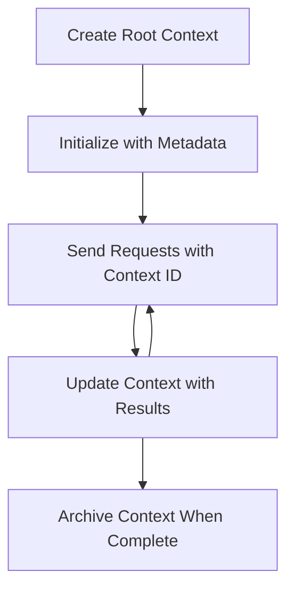

<!--
CO_OP_TRANSLATOR_METADATA:
{
  "original_hash": "ebdb86db46113f1cbd59ce4c74caaa79",
  "translation_date": "2025-07-17T00:09:18+00:00",
  "source_file": "05-AdvancedTopics/mcp-root-contexts/README.md",
  "language_code": "bn"
}
-->
# MCP Root Contexts

Root contexts হল Model Context Protocol-এর একটি মৌলিক ধারণা যা একাধিক অনুরোধ এবং সেশনের মধ্যে কথোপকথনের ইতিহাস এবং শেয়ার করা অবস্থা বজায় রাখার জন্য একটি স্থায়ী স্তর প্রদান করে।

## পরিচিতি

এই পাঠে, আমরা MCP-তে root contexts কীভাবে তৈরি, পরিচালনা এবং ব্যবহার করা যায় তা অন্বেষণ করব।

## শেখার উদ্দেশ্য

এই পাঠের শেষে, আপনি সক্ষম হবেন:

- root contexts-এর উদ্দেশ্য এবং কাঠামো বুঝতে
- MCP ক্লায়েন্ট লাইব্রেরি ব্যবহার করে root contexts তৈরি এবং পরিচালনা করতে
- .NET, Java, JavaScript, এবং Python অ্যাপ্লিকেশনগুলিতে root contexts বাস্তবায়ন করতে
- বহু-পর্যায়ের কথোপকথন এবং অবস্থা ব্যবস্থাপনার জন্য root contexts ব্যবহার করতে
- root context ব্যবস্থাপনার সেরা অনুশীলনগুলি প্রয়োগ করতে

## Root Contexts বোঝা

Root contexts হল এমন ধারক যা সম্পর্কিত একাধিক ইন্টারঅ্যাকশনের ইতিহাস এবং অবস্থা ধারণ করে। এগুলো সক্ষম করে:

- **কথোপকথনের স্থায়িত্ব**: সুসংগত বহু-পর্যায়ের কথোপকথন বজায় রাখা
- **মেমরি ব্যবস্থাপনা**: ইন্টারঅ্যাকশনের মধ্যে তথ্য সংরক্ষণ এবং পুনরুদ্ধার
- **অবস্থা ব্যবস্থাপনা**: জটিল ওয়ার্কফ্লোতে অগ্রগতি ট্র্যাক করা
- **কন্টেক্সট শেয়ারিং**: একাধিক ক্লায়েন্টকে একই কথোপকথন অবস্থা অ্যাক্সেস করার অনুমতি দেওয়া

MCP-তে, root contexts-এর প্রধান বৈশিষ্ট্যগুলি হল:

- প্রতিটি root context-এর একটি অনন্য শনাক্তকারী থাকে।
- এগুলো কথোপকথনের ইতিহাস, ব্যবহারকারীর পছন্দ এবং অন্যান্য মেটাডেটা ধারণ করতে পারে।
- প্রয়োজন অনুযায়ী এগুলো তৈরি, অ্যাক্সেস এবং আর্কাইভ করা যায়।
- সূক্ষ্ম-স্তরের অ্যাক্সেস নিয়ন্ত্রণ এবং অনুমতি সমর্থন করে।

## Root Context Lifecycle



## Root Contexts নিয়ে কাজ করা

এখানে root contexts কীভাবে তৈরি এবং পরিচালনা করা যায় তার একটি উদাহরণ দেওয়া হল।

### C# বাস্তবায়ন

```csharp
// .NET Example: Root Context Management
using Microsoft.Mcp.Client;
using System;
using System.Threading.Tasks;
using System.Collections.Generic;

public class RootContextExample
{
    private readonly IMcpClient _client;
    private readonly IRootContextManager _contextManager;
    
    public RootContextExample(IMcpClient client, IRootContextManager contextManager)
    {
        _client = client;
        _contextManager = contextManager;
    }
    
    public async Task DemonstrateRootContextAsync()
    {
        // 1. Create a new root context
        var contextResult = await _contextManager.CreateRootContextAsync(new RootContextCreateOptions
        {
            Name = "Customer Support Session",
            Metadata = new Dictionary<string, string>
            {
                ["CustomerName"] = "Acme Corporation",
                ["PriorityLevel"] = "High",
                ["Domain"] = "Cloud Services"
            }
        });
        
        string contextId = contextResult.ContextId;
        Console.WriteLine($"Created root context with ID: {contextId}");
        
        // 2. First interaction using the context
        var response1 = await _client.SendPromptAsync(
            "I'm having issues scaling my web service deployment in the cloud.", 
            new SendPromptOptions { RootContextId = contextId }
        );
        
        Console.WriteLine($"First response: {response1.GeneratedText}");
        
        // Second interaction - the model will have access to the previous conversation
        var response2 = await _client.SendPromptAsync(
            "Yes, we're using containerized deployments with Kubernetes.", 
            new SendPromptOptions { RootContextId = contextId }
        );
        
        Console.WriteLine($"Second response: {response2.GeneratedText}");
        
        // 3. Add metadata to the context based on conversation
        await _contextManager.UpdateContextMetadataAsync(contextId, new Dictionary<string, string>
        {
            ["TechnicalEnvironment"] = "Kubernetes",
            ["IssueType"] = "Scaling"
        });
        
        // 4. Get context information
        var contextInfo = await _contextManager.GetRootContextInfoAsync(contextId);
        
        Console.WriteLine("Context Information:");
        Console.WriteLine($"- Name: {contextInfo.Name}");
        Console.WriteLine($"- Created: {contextInfo.CreatedAt}");
        Console.WriteLine($"- Messages: {contextInfo.MessageCount}");
        
        // 5. When the conversation is complete, archive the context
        await _contextManager.ArchiveRootContextAsync(contextId);
        Console.WriteLine($"Archived context {contextId}");
    }
}
```

উপরের কোডে আমরা:

1. একটি গ্রাহক সহায়তা সেশনের জন্য root context তৈরি করেছি।
2. ঐ context-এর মধ্যে একাধিক বার্তা পাঠিয়েছি, যাতে মডেল অবস্থা বজায় রাখতে পারে।
3. কথোপকথনের ভিত্তিতে প্রাসঙ্গিক মেটাডেটা দিয়ে context আপডেট করেছি।
4. কথোপকথনের ইতিহাস বুঝতে context তথ্য পুনরুদ্ধার করেছি।
5. কথোপকথন শেষ হলে context আর্কাইভ করেছি।

## উদাহরণ: আর্থিক বিশ্লেষণের জন্য Root Context বাস্তবায়ন

এই উদাহরণে, আমরা একটি আর্থিক বিশ্লেষণ সেশনের জন্য root context তৈরি করব, যা একাধিক ইন্টারঅ্যাকশনের মধ্যে অবস্থা বজায় রাখার পদ্ধতি প্রদর্শন করবে।

### Java বাস্তবায়ন

```java
// Java Example: Root Context Implementation
package com.example.mcp.contexts;

import com.mcp.client.McpClient;
import com.mcp.client.ContextManager;
import com.mcp.models.RootContext;
import com.mcp.models.McpResponse;

import java.util.HashMap;
import java.util.Map;
import java.util.UUID;

public class RootContextsDemo {
    private final McpClient client;
    private final ContextManager contextManager;
    
    public RootContextsDemo(String serverUrl) {
        this.client = new McpClient.Builder()
            .setServerUrl(serverUrl)
            .build();
            
        this.contextManager = new ContextManager(client);
    }
    
    public void demonstrateRootContext() throws Exception {
        // Create context metadata
        Map<String, String> metadata = new HashMap<>();
        metadata.put("projectName", "Financial Analysis");
        metadata.put("userRole", "Financial Analyst");
        metadata.put("dataSource", "Q1 2025 Financial Reports");
        
        // 1. Create a new root context
        RootContext context = contextManager.createRootContext("Financial Analysis Session", metadata);
        String contextId = context.getId();
        
        System.out.println("Created context: " + contextId);
        
        // 2. First interaction
        McpResponse response1 = client.sendPrompt(
            "Analyze the trends in Q1 financial data for our technology division",
            contextId
        );
        
        System.out.println("First response: " + response1.getGeneratedText());
        
        // 3. Update context with important information gained from response
        contextManager.addContextMetadata(contextId, 
            Map.of("identifiedTrend", "Increasing cloud infrastructure costs"));
        
        // Second interaction - using the same context
        McpResponse response2 = client.sendPrompt(
            "What's driving the increase in cloud infrastructure costs?",
            contextId
        );
        
        System.out.println("Second response: " + response2.getGeneratedText());
        
        // 4. Generate a summary of the analysis session
        McpResponse summaryResponse = client.sendPrompt(
            "Summarize our analysis of the technology division financials in 3-5 key points",
            contextId
        );
        
        // Store the summary in context metadata
        contextManager.addContextMetadata(contextId, 
            Map.of("analysisSummary", summaryResponse.getGeneratedText()));
            
        // Get updated context information
        RootContext updatedContext = contextManager.getRootContext(contextId);
        
        System.out.println("Context Information:");
        System.out.println("- Created: " + updatedContext.getCreatedAt());
        System.out.println("- Last Updated: " + updatedContext.getLastUpdatedAt());
        System.out.println("- Analysis Summary: " + 
            updatedContext.getMetadata().get("analysisSummary"));
            
        // 5. Archive context when done
        contextManager.archiveContext(contextId);
        System.out.println("Context archived");
    }
}
```

উপরের কোডে আমরা:

1. একটি আর্থিক বিশ্লেষণ সেশনের জন্য root context তৈরি করেছি।
2. ঐ context-এর মধ্যে একাধিক বার্তা পাঠিয়েছি, যাতে মডেল অবস্থা বজায় রাখতে পারে।
3. কথোপকথনের ভিত্তিতে প্রাসঙ্গিক মেটাডেটা দিয়ে context আপডেট করেছি।
4. বিশ্লেষণ সেশনের সারাংশ তৈরি করে সেটি context মেটাডেটায় সংরক্ষণ করেছি।
5. কথোপকথন শেষ হলে context আর্কাইভ করেছি।

## উদাহরণ: Root Context ব্যবস্থাপনা

কথোপকথনের ইতিহাস এবং অবস্থা বজায় রাখার জন্য root contexts কার্যকরভাবে পরিচালনা করা অত্যন্ত গুরুত্বপূর্ণ। নিচে root context ব্যবস্থাপনা বাস্তবায়নের একটি উদাহরণ দেওয়া হল।

### JavaScript বাস্তবায়ন

```javascript
// JavaScript Example: Managing MCP Root Contexts
const { McpClient, RootContextManager } = require('@mcp/client');

class ContextSession {
  constructor(serverUrl, apiKey = null) {
    // Initialize the MCP client
    this.client = new McpClient({
      serverUrl,
      apiKey
    });
    
    // Initialize context manager
    this.contextManager = new RootContextManager(this.client);
  }
  
  /**
   * Create a new conversation context
   * @param {string} sessionName - Name of the conversation session
   * @param {Object} metadata - Additional metadata for the context
   * @returns {Promise<string>} - Context ID
   */
  async createConversationContext(sessionName, metadata = {}) {
    try {
      const contextResult = await this.contextManager.createRootContext({
        name: sessionName,
        metadata: {
          ...metadata,
          createdAt: new Date().toISOString(),
          status: 'active'
        }
      });
      
      console.log(`Created root context '${sessionName}' with ID: ${contextResult.id}`);
      return contextResult.id;
    } catch (error) {
      console.error('Error creating root context:', error);
      throw error;
    }
  }
  
  /**
   * Send a message in an existing context
   * @param {string} contextId - The root context ID
   * @param {string} message - The user's message
   * @param {Object} options - Additional options
   * @returns {Promise<Object>} - Response data
   */
  async sendMessage(contextId, message, options = {}) {
    try {
      // Send the message using the specified context
      const response = await this.client.sendPrompt(message, {
        rootContextId: contextId,
        temperature: options.temperature || 0.7,
        allowedTools: options.allowedTools || []
      });
      
      // Optionally store important insights from the conversation
      if (options.storeInsights) {
        await this.storeConversationInsights(contextId, message, response.generatedText);
      }
      
      return {
        message: response.generatedText,
        toolCalls: response.toolCalls || [],
        contextId
      };
    } catch (error) {
      console.error(`Error sending message in context ${contextId}:`, error);
      throw error;
    }
  }
  
  /**
   * Store important insights from a conversation
   * @param {string} contextId - The root context ID
   * @param {string} userMessage - User's message
   * @param {string} aiResponse - AI's response
   */
  async storeConversationInsights(contextId, userMessage, aiResponse) {
    try {
      // Extract potential insights (in a real app, this would be more sophisticated)
      const combinedText = userMessage + "\n" + aiResponse;
      
      // Simple heuristic to identify potential insights
      const insightWords = ["important", "key point", "remember", "significant", "crucial"];
      
      const potentialInsights = combinedText
        .split(".")
        .filter(sentence => 
          insightWords.some(word => sentence.toLowerCase().includes(word))
        )
        .map(sentence => sentence.trim())
        .filter(sentence => sentence.length > 10);
      
      // Store insights in context metadata
      if (potentialInsights.length > 0) {
        const insights = {};
        potentialInsights.forEach((insight, index) => {
          insights[`insight_${Date.now()}_${index}`] = insight;
        });
        
        await this.contextManager.updateContextMetadata(contextId, insights);
        console.log(`Stored ${potentialInsights.length} insights in context ${contextId}`);
      }
    } catch (error) {
      console.warn('Error storing conversation insights:', error);
      // Non-critical error, so just log warning
    }
  }
  
  /**
   * Get summary information about a context
   * @param {string} contextId - The root context ID
   * @returns {Promise<Object>} - Context information
   */
  async getContextInfo(contextId) {
    try {
      const contextInfo = await this.contextManager.getContextInfo(contextId);
      
      return {
        id: contextInfo.id,
        name: contextInfo.name,
        created: new Date(contextInfo.createdAt).toLocaleString(),
        lastUpdated: new Date(contextInfo.lastUpdatedAt).toLocaleString(),
        messageCount: contextInfo.messageCount,
        metadata: contextInfo.metadata,
        status: contextInfo.status
      };
    } catch (error) {
      console.error(`Error getting context info for ${contextId}:`, error);
      throw error;
    }
  }
  
  /**
   * Generate a summary of the conversation in a context
   * @param {string} contextId - The root context ID
   * @returns {Promise<string>} - Generated summary
   */
  async generateContextSummary(contextId) {
    try {
      // Ask the model to generate a summary of the conversation so far
      const response = await this.client.sendPrompt(
        "Please summarize our conversation so far in 3-4 sentences, highlighting the main points discussed.",
        { rootContextId: contextId, temperature: 0.3 }
      );
      
      // Store the summary in context metadata
      await this.contextManager.updateContextMetadata(contextId, {
        conversationSummary: response.generatedText,
        summarizedAt: new Date().toISOString()
      });
      
      return response.generatedText;
    } catch (error) {
      console.error(`Error generating context summary for ${contextId}:`, error);
      throw error;
    }
  }
  
  /**
   * Archive a context when it's no longer needed
   * @param {string} contextId - The root context ID
   * @returns {Promise<Object>} - Result of the archive operation
   */
  async archiveContext(contextId) {
    try {
      // Generate a final summary before archiving
      const summary = await this.generateContextSummary(contextId);
      
      // Archive the context
      await this.contextManager.archiveContext(contextId);
      
      return {
        status: "archived",
        contextId,
        summary
      };
    } catch (error) {
      console.error(`Error archiving context ${contextId}:`, error);
      throw error;
    }
  }
}

// Example usage
async function demonstrateContextSession() {
  const session = new ContextSession('https://mcp-server-example.com');
  
  try {
    // 1. Create a new context for a product support conversation
    const contextId = await session.createConversationContext(
      'Product Support - Database Performance',
      {
        customer: 'Globex Corporation',
        product: 'Enterprise Database',
        severity: 'Medium',
        supportAgent: 'AI Assistant'
      }
    );
    
    // 2. First message in the conversation
    const response1 = await session.sendMessage(
      contextId,
      "I'm experiencing slow query performance on our database cluster after the latest update.",
      { storeInsights: true }
    );
    console.log('Response 1:', response1.message);
    
    // Follow-up message in the same context
    const response2 = await session.sendMessage(
      contextId,
      "Yes, we've already checked the indexes and they seem to be properly configured.",
      { storeInsights: true }
    );
    console.log('Response 2:', response2.message);
    
    // 3. Get information about the context
    const contextInfo = await session.getContextInfo(contextId);
    console.log('Context Information:', contextInfo);
    
    // 4. Generate and display conversation summary
    const summary = await session.generateContextSummary(contextId);
    console.log('Conversation Summary:', summary);
    
    // 5. Archive the context when done
    const archiveResult = await session.archiveContext(contextId);
    console.log('Archive Result:', archiveResult);
    
    // 6. Handle any errors gracefully
  } catch (error) {
    console.error('Error in context session demonstration:', error);
  }
}

demonstrateContextSession();
```

উপরের কোডে আমরা:

1. `createConversationContext` ফাংশন ব্যবহার করে একটি পণ্য সহায়তা কথোপকথনের জন্য root context তৈরি করেছি। এই ক্ষেত্রে, context ডাটাবেস পারফরম্যান্স সমস্যার বিষয়ে।

2. ঐ context-এর মধ্যে একাধিক বার্তা পাঠিয়েছি, যাতে মডেল অবস্থা বজায় রাখতে পারে, `sendMessage` ফাংশন ব্যবহার করে। পাঠানো বার্তাগুলো ধীরগতির কুয়েরি পারফরম্যান্স এবং ইনডেক্স কনফিগারেশন সম্পর্কিত।

3. কথোপকথনের ভিত্তিতে প্রাসঙ্গিক মেটাডেটা দিয়ে context আপডেট করেছি।

4. কথোপকথনের সারাংশ তৈরি করে সেটি context মেটাডেটায় `generateContextSummary` ফাংশন দিয়ে সংরক্ষণ করেছি।

5. কথোপকথন শেষ হলে `archiveContext` ফাংশন ব্যবহার করে context আর্কাইভ করেছি।

6. ত্রুটি সুষ্ঠুভাবে পরিচালনা করেছি যাতে স্থায়িত্ব নিশ্চিত হয়।

## বহু-পর্যায়ের সহায়তার জন্য Root Context

এই উদাহরণে, আমরা একটি বহু-পর্যায়ের সহায়তা সেশনের জন্য root context তৈরি করব, যা একাধিক ইন্টারঅ্যাকশনের মধ্যে অবস্থা বজায় রাখার পদ্ধতি প্রদর্শন করবে।

### Python বাস্তবায়ন

```python
# Python Example: Root Context for Multi-Turn Assistance
import asyncio
from datetime import datetime
from mcp_client import McpClient, RootContextManager

class AssistantSession:
    def __init__(self, server_url, api_key=None):
        self.client = McpClient(server_url=server_url, api_key=api_key)
        self.context_manager = RootContextManager(self.client)
    
    async def create_session(self, name, user_info=None):
        """Create a new root context for an assistant session"""
        metadata = {
            "session_type": "assistant",
            "created_at": datetime.now().isoformat(),
        }
        
        # Add user information if provided
        if user_info:
            metadata.update({f"user_{k}": v for k, v in user_info.items()})
            
        # Create the root context
        context = await self.context_manager.create_root_context(name, metadata)
        return context.id
    
    async def send_message(self, context_id, message, tools=None):
        """Send a message within a root context"""
        # Create options with context ID
        options = {
            "root_context_id": context_id
        }
        
        # Add tools if specified
        if tools:
            options["allowed_tools"] = tools
        
        # Send the prompt within the context
        response = await self.client.send_prompt(message, options)
        
        # Update context metadata with conversation progress
        await self.context_manager.update_context_metadata(
            context_id,
            {
                f"message_{datetime.now().timestamp()}": message[:50] + "...",
                "last_interaction": datetime.now().isoformat()
            }
        )
        
        return response
    
    async def get_conversation_history(self, context_id):
        """Retrieve conversation history from a context"""
        context_info = await self.context_manager.get_context_info(context_id)
        messages = await self.client.get_context_messages(context_id)
        
        return {
            "context_info": context_info,
            "messages": messages
        }
    
    async def end_session(self, context_id):
        """End an assistant session by archiving the context"""
        # Generate a summary prompt first
        summary_response = await self.client.send_prompt(
            "Please summarize our conversation and any key points or decisions made.",
            {"root_context_id": context_id}
        )
        
        # Store summary in metadata
        await self.context_manager.update_context_metadata(
            context_id,
            {
                "summary": summary_response.generated_text,
                "ended_at": datetime.now().isoformat(),
                "status": "completed"
            }
        )
        
        # Archive the context
        await self.context_manager.archive_context(context_id)
        
        return {
            "status": "completed",
            "summary": summary_response.generated_text
        }

# Example usage
async def demo_assistant_session():
    assistant = AssistantSession("https://mcp-server-example.com")
    
    # 1. Create session
    context_id = await assistant.create_session(
        "Technical Support Session",
        {"name": "Alex", "technical_level": "advanced", "product": "Cloud Services"}
    )
    print(f"Created session with context ID: {context_id}")
    
    # 2. First interaction
    response1 = await assistant.send_message(
        context_id, 
        "I'm having trouble with the auto-scaling feature in your cloud platform.",
        ["documentation_search", "diagnostic_tool"]
    )
    print(f"Response 1: {response1.generated_text}")
    
    # Second interaction in the same context
    response2 = await assistant.send_message(
        context_id,
        "Yes, I've already checked the configuration settings you mentioned, but it's still not working."
    )
    print(f"Response 2: {response2.generated_text}")
    
    # 3. Get history
    history = await assistant.get_conversation_history(context_id)
    print(f"Session has {len(history['messages'])} messages")
    
    # 4. End session
    end_result = await assistant.end_session(context_id)
    print(f"Session ended with summary: {end_result['summary']}")

if __name__ == "__main__":
    asyncio.run(demo_assistant_session())
```

উপরের কোডে আমরা:

1. `create_session` ফাংশন ব্যবহার করে একটি প্রযুক্তিগত সহায়তা সেশনের জন্য root context তৈরি করেছি। context-এ ব্যবহারকারীর নাম এবং প্রযুক্তিগত স্তরের মতো তথ্য অন্তর্ভুক্ত রয়েছে।

2. ঐ context-এর মধ্যে একাধিক বার্তা পাঠিয়েছি, যাতে মডেল অবস্থা বজায় রাখতে পারে, `send_message` ফাংশন ব্যবহার করে। পাঠানো বার্তাগুলো অটো-স্কেলিং ফিচারের সমস্যাগুলো সম্পর্কে।

3. `get_conversation_history` ফাংশন ব্যবহার করে কথোপকথনের ইতিহাস পুনরুদ্ধার করেছি, যা context তথ্য এবং বার্তাগুলো প্রদান করে।

4. `end_session` ফাংশন ব্যবহার করে সেশন শেষ করেছি, context আর্কাইভ এবং সারাংশ তৈরি করে। সারাংশ কথোপকথনের মূল পয়েন্টগুলো ধারণ করে।

## Root Context সেরা অনুশীলন

root contexts কার্যকরভাবে পরিচালনার জন্য কিছু সেরা অনুশীলন:

- **কেন্দ্রিত context তৈরি করুন**: বিভিন্ন কথোপকথনের উদ্দেশ্য বা ডোমেইনের জন্য আলাদা root contexts তৈরি করুন যাতে স্পষ্টতা বজায় থাকে।

- **মেয়াদ শেষের নীতি নির্ধারণ করুন**: পুরানো contexts আর্কাইভ বা মুছে ফেলার নীতি প্রয়োগ করুন যাতে স্টোরেজ নিয়ন্ত্রণ এবং ডেটা সংরক্ষণ নীতিমালা মেনে চলা যায়।

- **প্রাসঙ্গিক মেটাডেটা সংরক্ষণ করুন**: কথোপকথনের গুরুত্বপূর্ণ তথ্য context মেটাডেটায় সংরক্ষণ করুন যা ভবিষ্যতে কাজে লাগতে পারে।

- **Context ID ধারাবাহিকভাবে ব্যবহার করুন**: একবার context তৈরি হলে, তার ID ধারাবাহিকভাবে সব সম্পর্কিত অনুরোধে ব্যবহার করুন যাতে ধারাবাহিকতা বজায় থাকে।

- **সারাংশ তৈরি করুন**: যখন context বড় হয়ে যায়, তখন গুরুত্বপূর্ণ তথ্য ধারণের জন্য সারাংশ তৈরি করার কথা ভাবুন যাতে context আকার নিয়ন্ত্রণে থাকে।

- **অ্যাক্সেস নিয়ন্ত্রণ বাস্তবায়ন করুন**: বহু-ব্যবহারকারী সিস্টেমের জন্য, কথোপকথন context-এর গোপনীয়তা এবং নিরাপত্তা নিশ্চিত করতে সঠিক অ্যাক্সেস নিয়ন্ত্রণ প্রয়োগ করুন।

- **Context সীমাবদ্ধতা মোকাবেলা করুন**: context আকারের সীমাবদ্ধতা সম্পর্কে সচেতন থাকুন এবং দীর্ঘ কথোপকথন পরিচালনার জন্য কৌশল গ্রহণ করুন।

- **কথোপকথন শেষ হলে আর্কাইভ করুন**: কথোপকথন শেষ হলে context আর্কাইভ করুন যাতে সংস্থান মুক্ত হয় এবং কথোপকথনের ইতিহাস সংরক্ষিত থাকে।

## পরবর্তী ধাপ

- [5.5 Routing](../mcp-routing/README.md)

**অস্বীকৃতি**:  
এই নথিটি AI অনুবাদ সেবা [Co-op Translator](https://github.com/Azure/co-op-translator) ব্যবহার করে অনূদিত হয়েছে। আমরা যথাসাধ্য সঠিকতার চেষ্টা করি, তবে স্বয়ংক্রিয় অনুবাদে ত্রুটি বা অসঙ্গতি থাকতে পারে। মূল নথিটি তার নিজস্ব ভাষায়ই কর্তৃত্বপূর্ণ উৎস হিসেবে বিবেচিত হওয়া উচিত। গুরুত্বপূর্ণ তথ্যের জন্য পেশাদার মানব অনুবাদ গ্রহণ করার পরামর্শ দেওয়া হয়। এই অনুবাদের ব্যবহারে সৃষ্ট কোনো ভুল বোঝাবুঝি বা ভুল ব্যাখ্যার জন্য আমরা দায়ী নই।