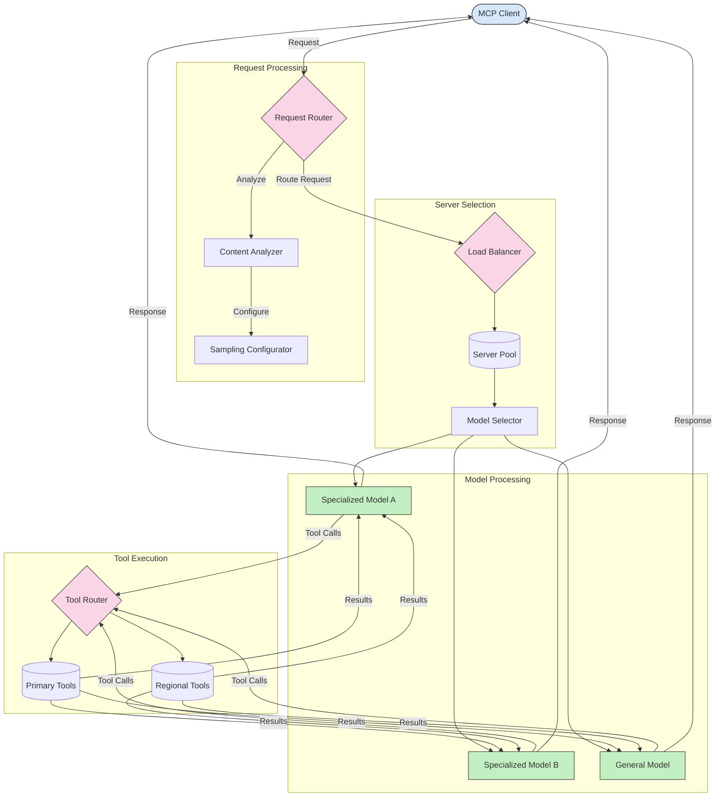

<!--
CO_OP_TRANSLATOR_METADATA:
{
  "original_hash": "2f1b473818b5a6cc9a9bbf777fffa6d4",
  "translation_date": "2025-07-14T21:46:06+00:00",
  "source_file": "05-AdvancedTopics/mcp-routing/README.md",
  "language_code": "bn"
}
-->
## MCP-তে স্যাম্পলিং এবং রাউটিং আর্কিটেকচার

স্যাম্পলিং হল Model Context Protocol (MCP)-এর একটি গুরুত্বপূর্ণ উপাদান যা কার্যকরী অনুরোধ প্রক্রিয়াকরণ এবং রাউটিং নিশ্চিত করে। এটি আসা অনুরোধগুলো বিশ্লেষণ করে সবচেয়ে উপযুক্ত মডেল বা সার্ভিস নির্ধারণ করে, বিভিন্ন মানদণ্ড যেমন কনটেন্ট টাইপ, ব্যবহারকারীর প্রসঙ্গ, এবং সিস্টেম লোডের ভিত্তিতে।

স্যাম্পলিং এবং রাউটিং একত্রিত করে এমন একটি শক্তিশালী আর্কিটেকচার তৈরি করা যায় যা সম্পদের সর্বোত্তম ব্যবহার নিশ্চিত করে এবং উচ্চ প্রাপ্যতা বজায় রাখে। স্যাম্পলিং প্রক্রিয়া অনুরোধগুলো শ্রেণীবদ্ধ করতে ব্যবহৃত হয়, আর রাউটিং সেগুলোকে উপযুক্ত মডেল বা সার্ভিসের কাছে পাঠায়।

নিচের চিত্রটি দেখায় কিভাবে স্যাম্পলিং এবং রাউটিং একসাথে কাজ করে একটি বিস্তৃত MCP আর্কিটেকচারে:

## পরবর্তী ধাপ

- [5.6 স্যাম্পলিং](../mcp-sampling/README.md)

**অস্বীকৃতি**:  
এই নথিটি AI অনুবাদ সেবা [Co-op Translator](https://github.com/Azure/co-op-translator) ব্যবহার করে অনূদিত হয়েছে। আমরা যথাসাধ্য সঠিকতার চেষ্টা করি, তবে স্বয়ংক্রিয় অনুবাদে ত্রুটি বা অসঙ্গতি থাকতে পারে। মূল নথিটি তার নিজস্ব ভাষায়ই কর্তৃত্বপূর্ণ উৎস হিসেবে বিবেচিত হওয়া উচিত। গুরুত্বপূর্ণ তথ্যের জন্য পেশাদার মানব অনুবাদ গ্রহণ করার পরামর্শ দেওয়া হয়। এই অনুবাদের ব্যবহারে সৃষ্ট কোনো ভুল বোঝাবুঝি বা ভুল ব্যাখ্যার জন্য আমরা দায়ী নই।