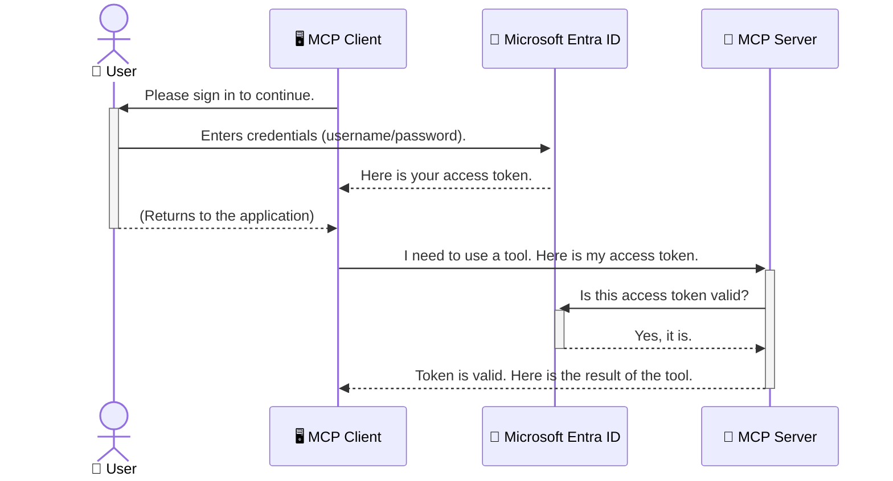

<!--
CO_OP_TRANSLATOR_METADATA:
{
  "original_hash": "0abf26a6c4dbe905d5d49ccdc0ccfe92",
  "translation_date": "2025-06-26T16:23:16+00:00",
  "source_file": "05-AdvancedTopics/mcp-security-entra/README.md",
  "language_code": "bn"
}
-->
# AI ওয়ার্কফ্লো সুরক্ষা: Model Context Protocol সার্ভারের জন্য Entra ID Authentication

## পরিচিতি
আপনার Model Context Protocol (MCP) সার্ভার সুরক্ষিত রাখা ঠিক তেমনি গুরুত্বপূর্ণ যেমন আপনার বাড়ির মূল দরজা লক করা। MCP সার্ভার খোলা রাখলে আপনার টুলস এবং ডেটা অননুমোদিত অ্যাক্সেসের ঝুঁকিতে পড়ে, যা সিকিউরিটি ব্রিচের কারণ হতে পারে। Microsoft Entra ID একটি শক্তিশালী ক্লাউড-ভিত্তিক পরিচয় এবং প্রবেশাধিকার ব্যবস্থাপনা সমাধান প্রদান করে, যা নিশ্চিত করে যে শুধুমাত্র অনুমোদিত ব্যবহারকারী এবং অ্যাপ্লিকেশনই আপনার MCP সার্ভারের সঙ্গে ইন্টারঅ্যাক্ট করতে পারে। এই অংশে, আপনি শিখবেন কিভাবে Entra ID Authentication ব্যবহার করে আপনার AI ওয়ার্কফ্লো সুরক্ষিত করবেন।

## শেখার লক্ষ্যসমূহ
এই অংশ শেষ করার পর, আপনি সক্ষম হবেন:

- MCP সার্ভার সুরক্ষার গুরুত্ব বুঝতে।
- Microsoft Entra ID এবং OAuth 2.0 Authentication এর মৌলিক ধারণা ব্যাখ্যা করতে।
- পাবলিক এবং কনফিডেনশিয়াল ক্লায়েন্টের মধ্যে পার্থক্য চিনতে।
- Entra ID Authentication প্রয়োগ করতে, স্থানীয় (পাবলিক ক্লায়েন্ট) এবং দূরবর্তী (কনফিডেনশিয়াল ক্লায়েন্ট) MCP সার্ভার পরিস্থিতিতে।
- AI ওয়ার্কফ্লো তৈরি করার সময় সুরক্ষার সেরা অনুশীলনগুলো প্রয়োগ করতে।

## সুরক্ষা এবং MCP

যেমন আপনি আপনার বাড়ির মূল দরজা খোলা রাখবেন না, তেমনি MCP সার্ভারও যেকোনো ব্যক্তির জন্য উন্মুক্ত রাখা উচিত নয়। আপনার AI ওয়ার্কফ্লো সুরক্ষিত রাখা অত্যাবশ্যক, যাতে আপনি বিশ্বাসযোগ্য, শক্তিশালী এবং নিরাপদ অ্যাপ্লিকেশন তৈরি করতে পারেন। এই অধ্যায়ে Microsoft Entra ID ব্যবহার করে MCP সার্ভার সুরক্ষিত করার পদ্ধতি শেখানো হবে, যাতে শুধুমাত্র অনুমোদিত ব্যবহারকারী এবং অ্যাপ্লিকেশনই আপনার টুলস এবং ডেটার সঙ্গে যোগাযোগ করতে পারে।

## MCP সার্ভারের জন্য সুরক্ষা কেন গুরুত্বপূর্ণ

ধরা যাক আপনার MCP সার্ভারে এমন একটি টুল আছে যা ইমেইল পাঠাতে পারে বা গ্রাহকের ডেটাবেস অ্যাক্সেস করতে পারে। একটি সুরক্ষাহীন সার্ভার মানে যে কেউ ওই টুল ব্যবহার করতে পারবে, যার ফলে অননুমোদিত ডেটা অ্যাক্সেস, স্প্যাম, বা অন্যান্য ক্ষতিকারক কাজ হতে পারে।

Authentication প্রয়োগ করলে আপনি নিশ্চিত হবেন যে সার্ভারে আসা প্রতিটি অনুরোধ যাচাই করা হয়েছে, অর্থাৎ অনুরোধকারী ব্যবহারকারী বা অ্যাপ্লিকেশনের পরিচয় নিশ্চিত হয়েছে। এটি আপনার AI ওয়ার্কফ্লো সুরক্ষার প্রথম এবং সবচেয়ে গুরুত্বপূর্ণ ধাপ।

## Microsoft Entra ID এর পরিচিতি

[**Microsoft Entra ID**](https://adoption.microsoft.com/microsoft-security/entra/) একটি ক্লাউড-ভিত্তিক পরিচয় এবং প্রবেশাধিকার ব্যবস্থাপনা সেবা। এটি আপনার অ্যাপ্লিকেশনগুলোর জন্য একটি সার্বজনীন সিকিউরিটি গার্ডের মতো কাজ করে। এটি ব্যবহারকারীর পরিচয় যাচাই (authentication) এবং তারা কী করতে পারবে তা নির্ধারণ (authorization) করার জটিল প্রক্রিয়া পরিচালনা করে।

Entra ID ব্যবহার করে আপনি:

- ব্যবহারকারীদের জন্য নিরাপদ সাইন-ইন সক্রিয় করতে পারেন।
- API এবং সার্ভিসগুলো সুরক্ষিত রাখতে পারেন।
- কেন্দ্রীয় স্থান থেকে প্রবেশাধিকার নীতিমালা পরিচালনা করতে পারেন।

MCP সার্ভারের জন্য, Entra ID একটি শক্তিশালী এবং ব্যাপকভাবে বিশ্বাসযোগ্য সমাধান প্রদান করে, যার মাধ্যমে নির্ধারণ করা যায় কে আপনার সার্ভারের ক্ষমতাগুলো ব্যবহার করতে পারবে।

---

## Entra ID Authentication কিভাবে কাজ করে: একটি সহজ ব্যাখ্যা

Entra ID Authentication পরিচালনার জন্য ওপেন স্ট্যান্ডার্ড যেমন **OAuth 2.0** ব্যবহার করে। যদিও বিস্তারিত জটিল হতে পারে, মূল ধারণাটি সহজ এবং একটি উপমার মাধ্যমে বোঝা যায়।

### OAuth 2.0 এর সহজ পরিচিতি: ভ্যালেট কি

OAuth 2.0 কে আপনার গাড়ির জন্য একটি ভ্যালেট সার্ভিস হিসেবে ভাবুন। যখন আপনি কোনো রেস্টুরেন্টে যান, তখন আপনি ভ্যালেটকে আপনার মাস্টার কি দেন না। পরিবর্তে, আপনি একটি **ভ্যালেট কি** দেন যা সীমিত অনুমতি রাখে—গাড়ি চালু করতে পারে এবং দরজা লক করতে পারে, কিন্তু ট্রাঙ্ক বা গ্লাভ কম্পার্টমেন্ট খুলতে পারে না।

এই উপমায়:

- **আপনি** হলেন **ব্যবহারকারী**।
- **আপনার গাড়ি** হল MCP সার্ভার, যার মূল্যবান টুলস এবং ডেটা আছে।
- **ভ্যালেট** হল **Microsoft Entra ID**।
- **পার্কিং এটেনড্যান্ট** হল MCP ক্লায়েন্ট (অ্যাপ্লিকেশন যা সার্ভারে অ্যাক্সেস করতে চায়)।
- **ভ্যালেট কি** হল **Access Token**।

Access Token হলো একটি নিরাপদ টেক্সট স্ট্রিং যা MCP ক্লায়েন্ট Entra ID থেকে সাইন-ইন করার পর পায়। ক্লায়েন্ট এই টোকেনটি MCP সার্ভারে প্রতিটি অনুরোধের সাথে পাঠায়। সার্ভার টোকেন যাচাই করে নিশ্চিত করে যে অনুরোধটি বৈধ এবং ক্লায়েন্টের প্রয়োজনীয় অনুমতি আছে, সবকিছু আপনার আসল ক্রেডেনশিয়াল (যেমন পাসওয়ার্ড) ছাড়াই।

### Authentication প্রবাহ

প্রক্রিয়াটি বাস্তবে কিভাবে কাজ করে:



### Microsoft Authentication Library (MSAL) পরিচিতি

কোডের উদাহরণে ব্যবহৃত একটি গুরুত্বপূর্ণ উপাদান হলো **Microsoft Authentication Library (MSAL)**।

MSAL হলো Microsoft কর্তৃক তৈরি একটি লাইব্রেরি যা ডেভেলপারদের জন্য Authentication পরিচালনা অনেক সহজ করে তোলে। আপনি নিজে জটিল কোড লেখার পরিবর্তে, MSAL সাইন-ইন, সিকিউরিটি টোকেন ব্যবস্থাপনা, এবং সেশন রিফ্রেশের কাজগুলো সামলে নেয়।

MSAL ব্যবহারের সুবিধা:

- **নিরাপদ:** এটি শিল্প মানের প্রোটোকল এবং সুরক্ষা সেরা অনুশীলন অনুসরণ করে, যা আপনার কোডে দুর্বলতার ঝুঁকি কমায়।
- **সহজ উন্নয়ন:** OAuth 2.0 এবং OpenID Connect এর জটিলতা লুকিয়ে রাখে, মাত্র কয়েক লাইনের কোডে শক্তিশালী Authentication যোগ করা যায়।
- **নিয়মিত আপডেট:** Microsoft নিয়মিত MSAL আপডেট করে নতুন সুরক্ষা হুমকি এবং প্ল্যাটফর্ম পরিবর্তনের সাথে খাপ খাইয়ে।

MSAL .NET, JavaScript/TypeScript, Python, Java, Go, এবং মোবাইল প্ল্যাটফর্ম যেমন iOS ও Android সহ বিভিন্ন ভাষা এবং ফ্রেমওয়ার্ক সমর্থন করে। এর মানে, আপনি আপনার প্রযুক্তি স্ট্যাক জুড়ে একই Authentication প্যাটার্ন ব্যবহার করতে পারবেন।

MSAL সম্পর্কে আরও জানতে অফিসিয়াল [MSAL ওভারভিউ ডকুমেন্টেশন](https://learn.microsoft.com/entra/identity-platform/msal-overview) দেখুন।

---

## Entra ID দিয়ে MCP সার্ভার সুরক্ষা: ধাপে ধাপে নির্দেশিকা

এখন চলুন দেখে নেওয়া যাক কিভাবে একটি লোকাল MCP সার্ভার সুরক্ষিত করা যায় (যেটি `stdio`) using Entra ID. This example uses a **public client**, which is suitable for applications running on a user's machine, like a desktop app or a local development server.

### Scenario 1: Securing a Local MCP Server (with a Public Client)

In this scenario, we'll look at an MCP server that runs locally, communicates over `stdio`, and uses Entra ID to authenticate the user before allowing access to its tools. The server will have a single tool that fetches the user's profile information from the Microsoft Graph API.

#### 1. Setting Up the Application in Entra ID

Before writing any code, you need to register your application in Microsoft Entra ID. This tells Entra ID about your application and grants it permission to use the authentication service.

1. Navigate to the **[Microsoft Entra portal](https://entra.microsoft.com/)**.
2. Go to **App registrations** and click **New registration**.
3. Give your application a name (e.g., "My Local MCP Server").
4. For **Supported account types**, select **Accounts in this organizational directory only**.
5. You can leave the **Redirect URI** blank for this example.
6. Click **Register**.

Once registered, take note of the **Application (client) ID** and **Directory (tenant) ID**. You'll need these in your code.

#### 2. The Code: A Breakdown

Let's look at the key parts of the code that handle authentication. The full code for this example is available in the [Entra ID - Local - WAM](https://github.com/Azure-Samples/mcp-auth-servers/tree/main/src/entra-id-local-wam) folder of the [mcp-auth-servers GitHub repository](https://github.com/Azure-Samples/mcp-auth-servers).

**`AuthenticationService.cs`**

This class is responsible for handling the interaction with Entra ID.

- **`CreateAsync`**: This method initializes the `PublicClientApplication` from the MSAL (Microsoft Authentication Library). It's configured with your application's `clientId` and `tenantId`.
- **`WithBroker`**: This enables the use of a broker (like the Windows Web Account Manager), which provides a more secure and seamless single sign-on experience.
- **`AcquireTokenAsync`** পদ্ধতি ব্যবহার করে কাজ করে): এটি মূল পদ্ধতি যা প্রথমে টোকেন চুপচাপ পেতে চেষ্টা করে (যদি ব্যবহারকারীর বৈধ সেশন থাকে, তাহলে আবার সাইন-ইন করতে হয় না)। যদি চুপচাপ টোকেন না পাওয়া যায়, তাহলে ব্যবহারকারীকে ইন্টারেক্টিভভাবে সাইন-ইন করতে বলা হয়।

```csharp
// Simplified for clarity
public static async Task<AuthenticationService> CreateAsync(ILogger<AuthenticationService> logger)
{
    var msalClient = PublicClientApplicationBuilder
        .Create(_clientId) // Your Application (client) ID
        .WithAuthority(AadAuthorityAudience.AzureAdMyOrg)
        .WithTenantId(_tenantId) // Your Directory (tenant) ID
        .WithBroker(new BrokerOptions(BrokerOptions.OperatingSystems.Windows))
        .Build();

    // ... cache registration ...

    return new AuthenticationService(logger, msalClient);
}

public async Task<string> AcquireTokenAsync()
{
    try
    {
        // Try silent authentication first
        var accounts = await _msalClient.GetAccountsAsync();
        var account = accounts.FirstOrDefault();

        AuthenticationResult? result = null;

        if (account != null)
        {
            result = await _msalClient.AcquireTokenSilent(_scopes, account).ExecuteAsync();
        }
        else
        {
            // If no account, or silent fails, go interactive
            result = await _msalClient.AcquireTokenInteractive(_scopes).ExecuteAsync();
        }

        return result.AccessToken;
    }
    catch (Exception ex)
    {
        _logger.LogError(ex, "An error occurred while acquiring the token.");
        throw; // Optionally rethrow the exception for higher-level handling
    }
}
```

**`Program.cs`**

This is where the MCP server is set up and the authentication service is integrated.

- **`AddSingleton<AuthenticationService>`**: This registers the `AuthenticationService` with the dependency injection container, so it can be used by other parts of the application (like our tool).
- **`GetUserDetailsFromGraph` tool**: This tool requires an instance of `AuthenticationService`. Before it does anything, it calls `authService.AcquireTokenAsync()` ব্যবহার করে একটি বৈধ access token নেয়। Authentication সফল হলে, এটি Microsoft Graph API কল করে ব্যবহারকারীর বিস্তারিত তথ্য নিয়ে আসে।

```csharp
// Simplified for clarity
[McpServerTool(Name = "GetUserDetailsFromGraph")]
public static async Task<string> GetUserDetailsFromGraph(
    AuthenticationService authService)
{
    try
    {
        // This will trigger the authentication flow
        var accessToken = await authService.AcquireTokenAsync();

        // Use the token to create a GraphServiceClient
        var graphClient = new GraphServiceClient(
            new BaseBearerTokenAuthenticationProvider(new TokenProvider(authService)));

        var user = await graphClient.Me.GetAsync();

        return System.Text.Json.JsonSerializer.Serialize(user);
    }
    catch (Exception ex)
    {
        return $"Error: {ex.Message}";
    }
}
```

#### ৩. কিভাবে সবকিছু একসাথে কাজ করে

1. যখন MCP ক্লায়েন্ট `GetUserDetailsFromGraph` tool, the tool first calls `AcquireTokenAsync`.
2. `AcquireTokenAsync` triggers the MSAL library to check for a valid token.
3. If no token is found, MSAL, through the broker, will prompt the user to sign in with their Entra ID account.
4. Once the user signs in, Entra ID issues an access token.
5. The tool receives the token and uses it to make a secure call to the Microsoft Graph API.
6. The user's details are returned to the MCP client.

This process ensures that only authenticated users can use the tool, effectively securing your local MCP server.

### Scenario 2: Securing a Remote MCP Server (with a Confidential Client)

When your MCP server is running on a remote machine (like a cloud server) and communicates over a protocol like HTTP Streaming, the security requirements are different. In this case, you should use a **confidential client** and the **Authorization Code Flow**. This is a more secure method because the application's secrets are never exposed to the browser.

This example uses a TypeScript-based MCP server that uses Express.js to handle HTTP requests.

#### 1. Setting Up the Application in Entra ID

The setup in Entra ID is similar to the public client, but with one key difference: you need to create a **client secret**.

1. Navigate to the **[Microsoft Entra portal](https://entra.microsoft.com/)**.
2. In your app registration, go to the **Certificates & secrets** tab.
3. Click **New client secret**, give it a description, and click **Add**.
4. **Important:** Copy the secret value immediately. You will not be able to see it again.
5. You also need to configure a **Redirect URI**. Go to the **Authentication** tab, click **Add a platform**, select **Web**, and enter the redirect URI for your application (e.g., `http://localhost:3001/auth/callback`).

> **⚠️ Important Security Note:** For production applications, Microsoft strongly recommends using **secretless authentication** methods such as **Managed Identity** or **Workload Identity Federation** instead of client secrets. Client secrets pose security risks as they can be exposed or compromised. Managed identities provide a more secure approach by eliminating the need to store credentials in your code or configuration.
>
> For more information about managed identities and how to implement them, see the [Managed identities for Azure resources overview](https://learn.microsoft.com/entra/identity/managed-identities-azure-resources/overview).

#### 2. The Code: A Breakdown

This example uses a session-based approach. When the user authenticates, the server stores the access token and refresh token in a session and gives the user a session token. This session token is then used for subsequent requests. The full code for this example is available in the [Entra ID - Confidential client](https://github.com/Azure-Samples/mcp-auth-servers/tree/main/src/entra-id-cca-session) folder of the [mcp-auth-servers GitHub repository](https://github.com/Azure-Samples/mcp-auth-servers).

**`Server.ts`**

This file sets up the Express server and the MCP transport layer.

- **`requireBearerAuth`**: This is middleware that protects the `/sse` and `/message` endpoints. It checks for a valid bearer token in the `Authorization` header of the request.
- **`EntraIdServerAuthProvider`**: This is a custom class that implements the `McpServerAuthorizationProvider` interface. It's responsible for handling the OAuth 2.0 flow.
- **`/auth/callback`** এন্ডপয়েন্টে অ্যাক্সেস করতে চায়: এটি Entra ID থেকে Authentication সম্পন্ন হওয়ার পর Redirect হ্যান্ডেল করে। এখানে Authorization Code কে Access Token এবং Refresh Token এ রূপান্তর করা হয়।

```typescript
// Simplified for clarity
const app = express();
const { server } = createServer();
const provider = new EntraIdServerAuthProvider();

// Protect the SSE endpoint
app.get("/sse", requireBearerAuth({
  provider,
  requiredScopes: ["User.Read"]
}), async (req, res) => {
  // ... connect to the transport ...
});

// Protect the message endpoint
app.post("/message", requireBearerAuth({
  provider,
  requiredScopes: ["User.Read"]
}), async (req, res) => {
  // ... handle the message ...
});

// Handle the OAuth 2.0 callback
app.get("/auth/callback", (req, res) => {
  provider.handleCallback(req.query.code, req.query.state)
    .then(result => {
      // ... handle success or failure ...
    });
});
```

**`Tools.ts`**

This file defines the tools that the MCP server provides. The `getUserDetails` টুল আগের উদাহরণের মতো, কিন্তু এটি সেশন থেকে Access Token নেয়।

```typescript
// Simplified for clarity
server.setRequestHandler(CallToolRequestSchema, async (request) => {
  const { name } = request.params;
  const context = request.params?.context as { token?: string } | undefined;
  const sessionToken = context?.token;

  if (name === ToolName.GET_USER_DETAILS) {
    if (!sessionToken) {
      throw new AuthenticationError("Authentication token is missing or invalid. Ensure the token is provided in the request context.");
    }

    // Get the Entra ID token from the session store
    const tokenData = tokenStore.getToken(sessionToken);
    const entraIdToken = tokenData.accessToken;

    const graphClient = Client.init({
      authProvider: (done) => {
        done(null, entraIdToken);
      }
    });

    const user = await graphClient.api('/me').get();

    // ... return user details ...
  }
});
```

**`auth/EntraIdServerAuthProvider.ts`**

This class handles the logic for:

- Redirecting the user to the Entra ID sign-in page.
- Exchanging the authorization code for an access token.
- Storing the tokens in the `tokenStore`.
- Refreshing the access token when it expires.

#### 3. How It All Works Together

1. When a user first tries to connect to the MCP server, the `requireBearerAuth` middleware will see that they don't have a valid session and will redirect them to the Entra ID sign-in page.
2. The user signs in with their Entra ID account.
3. Entra ID redirects the user back to the `/auth/callback` endpoint with an authorization code.
4. The server exchanges the code for an access token and a refresh token, stores them, and creates a session token which is sent to the client.
5. The client can now use this session token in the `Authorization` header for all future requests to the MCP server.
6. When the `getUserDetails` টুল কল করলে, এটি সেশন টোকেন ব্যবহার করে Entra ID Access Token খুঁজে বের করে এবং তারপর Microsoft Graph API কল করে।

এই প্রবাহ পাবলিক ক্লায়েন্ট প্রবাহের থেকে বেশি জটিল, কিন্তু ইন্টারনেট-ফেসিং এন্ডপয়েন্টের জন্য প্রয়োজনীয়। কারণ দূরবর্তী MCP সার্ভারগুলো পাবলিক ইন্টারনেটের মাধ্যমে অ্যাক্সেসযোগ্য, তাই তাদেরকে শক্তিশালী সুরক্ষা ব্যবস্থা প্রয়োজন অননুমোদিত অ্যাক্সেস এবং সম্ভাব্য আক্রমণ থেকে রক্ষা করার জন্য।

## সুরক্ষার সেরা অনুশীলনসমূহ

- **সর্বদা HTTPS ব্যবহার করুন:** ক্লায়েন্ট এবং সার্ভারের মধ্যে যোগাযোগ এনক্রিপ্ট করুন যাতে টোকেন চুরি না হয়।
- **Role-Based Access Control (RBAC) প্রয়োগ করুন:** শুধু যাচাই করবেন না যে ব্যবহারকারী authenticated কি না; যাচাই করুন তারা কী করতে অনুমোদিত। Entra ID তে রোল ডিফাইন করে MCP সার্ভারে তা যাচাই করতে পারেন।
- **মনিটর এবং অডিট করুন:** সমস্ত authentication ইভেন্ট লগ করুন যাতে সন্দেহজনক কার্যকলাপ শনাক্ত ও প্রতিক্রিয়া জানানো যায়।
- **রেট লিমিটিং এবং থ্রটলিং হ্যান্ডেল করুন:** Microsoft Graph এবং অন্যান্য API রেট লিমিটিং প্রয়োগ করে। MCP সার্ভারে HTTP 429 (Too Many Requests) এর জন্য exponential backoff এবং retry logic প্রয়োগ করুন। API কল কমাতে ফ্রিকোয়েন্টলি ব্যবহৃত ডেটা ক্যাশ করার কথা ভাবুন।
- **টোকেন সুরক্ষিত সংরক্ষণ:** Access Token এবং Refresh Token নিরাপদে সংরক্ষণ করুন। লোকাল অ্যাপ্লিকেশনের জন্য সিস্টেমের সিকিউর স্টোরেজ ব্যবহার করুন। সার্ভার অ্যাপ্লিকেশনের জন্য এনক্রিপ্টেড স্টোরেজ বা Azure Key Vault-এর মতো সিকিউর কী ম্যানেজমেন্ট সার্ভিস বিবেচনা করুন।
- **টোকেন মেয়াদ শেষ হওয়ার হ্যান্ডেলিং:** Access Token-এর সীমিত সময় থাকে। Refresh Token ব্যবহার করে স্বয়ংক্রিয় টোকেন রিফ্রেশ করুন যাতে ব্যবহারকারী পুনরায় লগইন না করেও সেশন চালিয়ে যেতে পারে।
- **Azure API Management ব্যবহার বিবেচনা করুন:** MCP সার্ভারে সরাসরি সুরক্ষা প্রয়োগ করলে ভালো নিয়ন্ত্রণ পাওয়া যায়, কিন্তু API গেটওয়ে যেমন Azure API Management অনেক সুরক্ষা বিষয় স্বয়ংক্রিয়ভাবে পরিচালনা করে, যেমন Authentication, Authorization, Rate Limiting, এবং মনিটরিং। এটি একটি কেন্দ্রীয় সুরক্ষা স্তর প্রদান করে যা ক্লায়েন্ট এবং MCP সার্ভারের মধ্যে থাকে। MCP-এর জন্য API গেটওয়ে ব্যবহারের বিস্তারিত জানতে [Azure API Management Your Auth Gateway For MCP Servers](https://techcommunity.microsoft.com/blog/integrationsonazureblog/azure-api-management-your-auth-gateway-for-mcp-servers/4402690) দেখুন।

## মূল বিষয়গুলো

- MCP সার্ভার সুরক্ষা আপনার ডেটা এবং টুলস রক্ষায় অপরিহার্য।
- Microsoft Entra ID Authentication এবং Authorization-এর জন্য শক্তিশালী ও স্কেলেবল সমাধান।
- স্থানীয় অ্যাপ্লিকেশনের জন্য **পাবলিক ক্লায়েন্ট** এবং দূরবর্তী সার্ভারের জন্য **কনফিডেনশিয়াল ক্লায়েন্ট** ব্যবহার করুন।
- ওয়েব অ্যাপ্লিকেশনের জন্য **Authorization Code Flow** সবচেয়ে নিরাপদ বিকল্প।

## অনুশীলন

1. আপনি যে MCP সার্ভার তৈরি করতে চান তা কি লোকাল হবে না দূরবর্তী?
2. আপনার উত্তরের ভিত্তিতে, পাবলিক না কনফিডেনশিয়াল ক্লায়েন্ট ব্যবহার করবেন?
3. Microsoft Graph এর বিরুদ্ধে কাজ করার জন্য আপনার MCP সার্ভার কোন অনুমতি চাইবে?

## হাতে কলমে অনুশীলন

### অনুশীলন ১: Entra ID-তে একটি অ্যাপ্লিকেশন রেজিস্টার করুন
Microsoft Entra পোর্টালে যান।  
আপনার MCP সার্ভারের জন্য একটি নতুন অ্যাপ্লিকেশন রেজিস্টার করুন।  
Application (client) ID এবং Directory (tenant) ID নোট করুন।

### অনুশীলন ২: লোকাল MCP সার্ভার সুরক্ষিত করুন (পাবলিক ক্লায়েন্ট)
- MSAL (Microsoft Authentication Library) ব্যবহার করে ইউজার Authentication ইন্টিগ্রেট করুন।
- Microsoft Graph থেকে ইউজার ডিটেইলস ফেচ করার MCP টুলটি কল করে Authentication ফ্লো পরীক্ষা করুন।

### অনুশীলন ৩: দূরবর্তী MCP সার্ভার সুরক্ষিত করুন (কনফিডেনশিয়াল ক্লায়েন্ট)
- Entra ID তে একটি কনফিডেনশিয়াল ক্লায়েন্ট রেজিস্টার করুন এবং ক্লায়েন্ট সিক্রেট তৈরি করুন।
- Express.js MCP সার্ভারে Authorization Code Flow কনফিগার করুন।
- প্রোটেক্টেড এন্ডপয়েন্টগুলো পরীক্ষা করুন এবং টোকেন-ভিত্তিক অ্যাক্সেস নিশ্চিত করুন।

### অনুশীলন ৪: সুরক্ষার সেরা অনুশীলনগুলো প্রয়োগ করুন
- আপনার লোকাল বা দূরবর্তী সার্ভারের জন্য HTTPS সক্রিয় করুন।
- সার্ভার লজিকে Role-Based Access Control (RBAC) প্রয়োগ করুন।
- টোকেন মেয়াদ শেষ হওয়া হ্যান্ডেলিং এবং নিরাপদ টোকেন স্টোরেজ যোগ করুন।

## সম্পদসমূহ

1. **MSAL ওভারভিউ ডকুমেন্টেশন**  
   Microsoft Authentication Library (MSAL) কীভাবে প্ল্যাটফর্ম জুড়ে নিরাপদ টোকেন অর্জন সহজ করে তা শিখুন:  
   [MSAL Overview on Microsoft Learn](https://learn.microsoft.com/en-gb/entra/msal/overview)

2. **Azure-Samples/mcp-auth-servers GitHub রিপোজিটরি**  
   Authentication ফ্লো দেখানোর জন্য MCP সার্ভারের রেফারেন্স ইমপ্লিমেন্টেশন:  
   [Azure-Samples/mcp-auth-servers on GitHub](https://github.com/Azure-Samples/mcp-auth-servers)

3. **Managed Identities for Azure Resources ওভারভিউ**  
   সিক্রেট বাদ দিয়ে সিস্টেম বা ইউজার-অ্যাসাইনড ম্যানেজড আইডেন্টিটি ব্যবহারের পদ্ধতি:  
   [Managed Identities Overview on Microsoft Learn](https://learn.microsoft.com/en-us/entra/identity/managed-identities-azure-resources/)

4. **Azure API Management: Your Auth Gateway for MCP Servers**  
   MCP সার্ভারের জন্য APIM কে একটি নিরাপদ OAuth2 গেটওয়ে হিসেবে ব্যবহারের বিস্তারিত:  
   [Azure API Management Your Auth Gateway For MCP Servers](https://techcommunity.microsoft.com/blog/integrationsonazureblog/azure-api-management-your-auth-gateway-for-mcp-servers/4402690)

5. **Microsoft Graph Permissions Reference**  
   Microsoft Graph এর ডেলিগেটেড এবং অ্যাপ্লিকেশন পারমিশনের বিস্তৃত তালিকা:  
   [Microsoft Graph Permissions Reference](https://learn.microsoft.com/zh-tw/graph/permissions-reference)

## শেখার ফলাফল
এই অংশ শেষ করার পর, আপনি পারবেন:

- MCP সার্ভার এবং AI ওয়ার্কফ্লোর জন্য Authentication কেন গুরুত্বপূর্ণ তা ব্যাখ্যা করতে।
- স্থানীয় এবং দূরবর্তী MCP সার্ভার পরিস্থিতিতে Entra ID Authentication সেটআপ এবং কনফিগার করতে।
- আপনার সার্ভারের ডিপ্লয়মেন্ট অনুযায়ী সঠিক ক্লায়েন্ট টাইপ (পাবলিক বা কনফিডেনশিয়াল) নির্বাচন করতে।
- নিরাপদ কোডিং অনুশীলন বাস্তবায়ন করতে, যার মধ্যে রয়েছে টোকেন সংরক্ষণ এবং রোল-ভিত্তিক অথরাইজেশন।
- আপনার MCP সার্ভার এবং এর টুলসকে অননুমোদিত অ্যাক্সেস থেকে আত্মবিশ্বাসের সঙ্গে সুরক্ষিত রাখতে।

## পরবর্তী ধাপ

- [6. Community Contributions](../../06-CommunityContributions/README.md)

**দায়িত্বের অস্বীকার**:  
এই নথিটি AI অনুবাদ সেবা [Co-op Translator](https://github.com/Azure/co-op-translator) ব্যবহার করে অনূদিত হয়েছে। আমরা যথাসাধ্য সঠিকতার জন্য চেষ্টা করি, তবে অনুগ্রহ করে জানুন যে স্বয়ংক্রিয় অনুবাদে ভুল বা অমিল থাকতে পারে। মূল নথিটি তার নিজস্ব ভাষায় সর্বোত্তম এবং প্রামাণিক উৎস হিসেবে বিবেচনা করা উচিত। গুরুত্বপূর্ণ তথ্যের জন্য পেশাদার মানব অনুবাদের পরামর্শ দেওয়া হয়। এই অনুবাদের ব্যবহারে কোনো ভুল বোঝাবুঝি বা ভুল ব্যাখ্যার জন্য আমরা দায়ী নই।