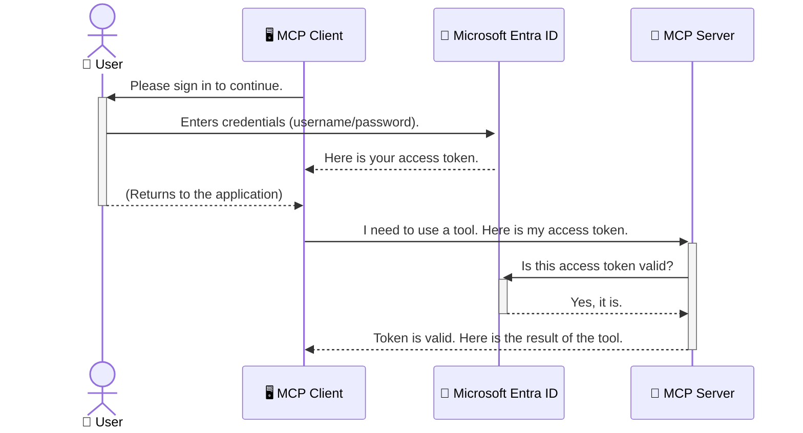

<!--
CO_OP_TRANSLATOR_METADATA:
{
  "original_hash": "9abe1d303ab126f9a8b87f03cebe5213",
  "translation_date": "2025-06-26T14:41:11+00:00",
  "source_file": "05-AdvancedTopics/mcp-security-entra/README.md",
  "language_code": "bn"
}
-->
# AI ওয়ার্কফ্লো সুরক্ষা: Model Context Protocol সার্ভারের জন্য Entra ID প্রমাণীকরণ

## পরিচিতি  
আপনার Model Context Protocol (MCP) সার্ভার সুরক্ষিত রাখা ঠিক তেমনই গুরুত্বপূর্ণ, যেমন আপনার বাড়ির প্রধান দরজা লক করে রাখা। MCP সার্ভার খোলা রেখে দিলে আপনার টুলস এবং ডেটা অননুমোদিত প্রবেশের ঝুঁকিতে পড়ে, যা নিরাপত্তা লঙ্ঘনের কারণ হতে পারে। Microsoft Entra ID একটি শক্তিশালী ক্লাউড-ভিত্তিক পরিচয় ও প্রবেশাধিকার ব্যবস্থাপনা সমাধান প্রদান করে, যা নিশ্চিত করে যে শুধুমাত্র অনুমোদিত ব্যবহারকারী ও অ্যাপ্লিকেশনই আপনার MCP সার্ভারের সাথে যোগাযোগ করতে পারে। এই অংশে আপনি শিখবেন কিভাবে Entra ID প্রমাণীকরণের মাধ্যমে আপনার AI ওয়ার্কফ্লো সুরক্ষিত করবেন।

## শেখার লক্ষ্য  
এই অংশ শেষে আপনি পারবেন:

- MCP সার্ভার সুরক্ষার গুরুত্ব বুঝতে।  
- Microsoft Entra ID এবং OAuth 2.0 প্রমাণীকরণের মৌলিক বিষয়গুলো ব্যাখ্যা করতে।  
- পাবলিক এবং কনফিডেনশিয়াল ক্লায়েন্টের মধ্যে পার্থক্য চিনতে।  
- স্থানীয় (পাবলিক ক্লায়েন্ট) এবং দূরবর্তী (কনফিডেনশিয়াল ক্লায়েন্ট) MCP সার্ভার পরিস্থিতিতে Entra ID প্রমাণীকরণ প্রয়োগ করতে।  
- AI ওয়ার্কফ্লো উন্নয়নের সময় নিরাপত্তার সেরা অনুশীলনগুলি প্রয়োগ করতে।  

# AI ওয়ার্কফ্লো সুরক্ষা: Model Context Protocol সার্ভারের জন্য Entra ID প্রমাণীকরণ

যেমন আপনি আপনার বাড়ির প্রধান দরজা খোলা রাখবেন না, তেমনি MCP সার্ভারও সবার জন্য উন্মুক্ত রাখা উচিত নয়। AI ওয়ার্কফ্লো সুরক্ষিত রাখা জরুরি যাতে আপনি শক্তিশালী, বিশ্বাসযোগ্য এবং নিরাপদ অ্যাপ্লিকেশন তৈরি করতে পারেন। এই অধ্যায়ে Microsoft Entra ID ব্যবহার করে MCP সার্ভার সুরক্ষিত করার পদ্ধতি শেখানো হবে, যাতে শুধুমাত্র অনুমোদিত ব্যবহারকারী ও অ্যাপ্লিকেশনই আপনার টুলস ও ডেটার সাথে যোগাযোগ করতে পারে।

## MCP সার্ভারের জন্য নিরাপত্তার গুরুত্ব

ভাবুন আপনার MCP সার্ভারে এমন একটি টুল আছে যা ইমেল পাঠাতে পারে বা গ্রাহক ডেটাবেসে প্রবেশাধিকার পেতে পারে। যদি সার্ভার সুরক্ষিত না থাকে, তবে যেকেউ সেই টুল ব্যবহার করতে পারবে, যা অননুমোদিত ডেটা প্রবেশাধিকার, স্প্যাম বা অন্য ক্ষতিকর কার্যকলাপের কারণ হতে পারে।

প্রমাণীকরণ প্রয়োগ করে আপনি নিশ্চিত করেন যে প্রতিটি সার্ভারের অনুরোধ যাচাই করা হয়েছে, অর্থাৎ অনুরোধকারী ব্যবহারকারী বা অ্যাপ্লিকেশনের পরিচয় নিশ্চিত করা হয়েছে। এটি AI ওয়ার্কফ্লো সুরক্ষার প্রথম এবং সবচেয়ে গুরুত্বপূর্ণ ধাপ।

## Microsoft Entra ID পরিচিতি

**Microsoft Entra ID** একটি ক্লাউড-ভিত্তিক পরিচয় ও প্রবেশাধিকার ব্যবস্থাপনা সেবা। এটিকে ভাবুন আপনার অ্যাপ্লিকেশনগুলোর জন্য একটি সার্বজনীন নিরাপত্তা প্রহরী হিসেবে। এটি ব্যবহারকারীর পরিচয় যাচাই (authentication) এবং তাদের কী কাজ করার অনুমতি আছে তা নির্ধারণ (authorization) করার জটিল প্রক্রিয়া পরিচালনা করে।

Entra ID ব্যবহার করে আপনি:

- ব্যবহারকারীদের জন্য নিরাপদ সাইন-ইন সক্ষম করতে পারেন।  
- API এবং সার্ভিসগুলো সুরক্ষিত রাখতে পারেন।  
- কেন্দ্রীয় স্থান থেকে প্রবেশাধিকার নীতি পরিচালনা করতে পারেন।  

MCP সার্ভারের জন্য Entra ID একটি শক্তিশালী এবং ব্যাপকভাবে বিশ্বাসযোগ্য সমাধান প্রদান করে, যা নির্ধারণ করে কে আপনার সার্ভারের ক্ষমতাগুলো ব্যবহার করতে পারবে।

---

## Entra ID প্রমাণীকরণ কীভাবে কাজ করে: একটি সহজ ব্যাখ্যা

Entra ID প্রমাণীকরণের জন্য ওপেন স্ট্যান্ডার্ড যেমন **OAuth 2.0** ব্যবহার করে। যদিও বিস্তারিত বিষয় জটিল হতে পারে, মূল ধারণাটি সহজ এবং একটি রূপক দিয়ে বোঝানো যায়।

### OAuth 2.0 এর সহজ পরিচিতি: ভ্যালেট চাবি

OAuth 2.0 কে ভাবুন আপনার গাড়ির জন্য একটি ভ্যালেট সার্ভিস হিসেবে। আপনি যখন রেস্টুরেন্টে যান, তখন আপনি ভ্যালেটকে আপনার মূল চাবি দেন না। বরং একটি **ভ্যালেট চাবি** দেন যার সীমিত অনুমতি থাকে—যা গাড়ি চালাতে এবং দরজা লক করতে পারে, কিন্তু ট্রাঙ্ক বা গ্লাভ কম্পার্টমেন্ট খুলতে পারে না।

এই রূপকে:

- **আপনি** হচ্ছেন **ব্যবহারকারী**।  
- **আপনার গাড়ি** হলো **MCP সার্ভার** যার মূল্যবান টুলস ও ডেটা আছে।  
- **ভ্যালেট** হলো **Microsoft Entra ID**।  
- **পার্কিং অ্যাটেনডেন্ট** হলো **MCP ক্লায়েন্ট** (যে অ্যাপ্লিকেশন সার্ভারে প্রবেশ করতে চায়)।  
- **ভ্যালেট চাবি** হলো **অ্যাক্সেস টোকেন**।  

অ্যাক্সেস টোকেন হলো একটি সুরক্ষিত টেক্সট স্ট্রিং যা MCP ক্লায়েন্ট Entra ID থেকে সাইন-ইন করার পর পায়। ক্লায়েন্ট এই টোকেন MCP সার্ভারে প্রতিটি অনুরোধের সাথে উপস্থাপন করে। সার্ভার টোকেন যাচাই করে নিশ্চিত করে অনুরোধ বৈধ এবং ক্লায়েন্টের যথাযথ অনুমতি আছে, সবই আপনার আসল পরিচয়পত্র (যেমন পাসওয়ার্ড) ছাড়াই।

### প্রমাণীকরণ প্রবাহ

প্রকৃতিতে প্রক্রিয়াটি এরকম কাজ করে:



### Microsoft Authentication Library (MSAL) পরিচিতি

কোডে প্রবেশ করার আগে, একটি গুরুত্বপূর্ণ উপাদান পরিচয় করিয়ে দেওয়া দরকার: **Microsoft Authentication Library (MSAL)**।

MSAL হলো Microsoft কর্তৃক উন্নত একটি লাইব্রেরি যা ডেভেলপারদের জন্য প্রমাণীকরণ পরিচালনা অনেক সহজ করে তোলে। আপনি নিরাপত্তা টোকেন, সাইন-ইন এবং সেশন রিফ্রেশ করার জটিল কোড লেখার পরিবর্তে MSAL এই কাজগুলো করে দেয়।

MSAL ব্যবহারের সুবিধা:

- **নিরাপদ:** এটি শিল্প-মানের প্রোটোকল এবং নিরাপত্তার সেরা অনুশীলন অনুসরণ করে, আপনার কোডে দুর্বলতা কমায়।  
- **সহজ উন্নয়ন:** OAuth 2.0 এবং OpenID Connect এর জটিলতা আড়াল করে, কয়েক লাইনে শক্তিশালী প্রমাণীকরণ যুক্ত করতে সাহায্য করে।  
- **পরিচালিত:** Microsoft নিয়মিত MSAL আপডেট করে নতুন নিরাপত্তা হুমকি ও প্ল্যাটফর্ম পরিবর্তনের সাথে খাপ খাইয়ে নিতে।  

MSAL .NET, JavaScript/TypeScript, Python, Java, Go এবং মোবাইল প্ল্যাটফর্ম যেমন iOS ও Android সহ বিভিন্ন ভাষা ও ফ্রেমওয়ার্ক সমর্থন করে। এর মানে আপনি আপনার পুরো প্রযুক্তি স্ট্যাক জুড়ে একই প্রমাণীকরণ প্যাটার্ন ব্যবহার করতে পারবেন।

MSAL সম্পর্কে আরও জানতে, অফিসিয়াল [MSAL ওভারভিউ ডকুমেন্টেশন](https://learn.microsoft.com/entra/identity-platform/msal-overview) দেখুন।

---

## Entra ID দিয়ে আপনার MCP সার্ভার সুরক্ষিত করা: ধাপে ধাপে নির্দেশিকা

এখন চলুন একটি স্থানীয় MCP সার্ভার কীভাবে সুরক্ষিত করবেন তা দেখি (যা `stdio`) using Entra ID. This example uses a **public client**, which is suitable for applications running on a user's machine, like a desktop app or a local development server.

### Scenario 1: Securing a Local MCP Server (with a Public Client)

In this scenario, we'll look at an MCP server that runs locally, communicates over `stdio`, and uses Entra ID to authenticate the user before allowing access to its tools. The server will have a single tool that fetches the user's profile information from the Microsoft Graph API.

#### 1. Setting Up the Application in Entra ID

Before writing any code, you need to register your application in Microsoft Entra ID. This tells Entra ID about your application and grants it permission to use the authentication service.

1. Navigate to the **[Microsoft Entra portal](https://entra.microsoft.com/)**.
2. Go to **App registrations** and click **New registration**.
3. Give your application a name (e.g., "My Local MCP Server").
4. For **Supported account types**, select **Accounts in this organizational directory only**.
5. You can leave the **Redirect URI** blank for this example.
6. Click **Register**.

Once registered, take note of the **Application (client) ID** and **Directory (tenant) ID**. You'll need these in your code.

#### 2. The Code: A Breakdown

Let's look at the key parts of the code that handle authentication. The full code for this example is available in the [Entra ID - Local - WAM](https://github.com/Azure-Samples/mcp-auth-servers/tree/main/src/entra-id-local-wam) folder of the [mcp-auth-servers GitHub repository](https://github.com/Azure-Samples/mcp-auth-servers).

**`AuthenticationService.cs`**

This class is responsible for handling the interaction with Entra ID.

- **`CreateAsync`**: This method initializes the `PublicClientApplication` from the MSAL (Microsoft Authentication Library). It's configured with your application's `clientId` and `tenantId`.
- **`WithBroker`**: This enables the use of a broker (like the Windows Web Account Manager), which provides a more secure and seamless single sign-on experience.
- **`AcquireTokenAsync`** ব্যবহার করে): এটি মূল পদ্ধতি। প্রথমে এটি চুপচাপ একটি টোকেন পাওয়ার চেষ্টা করে (যাতে ব্যবহারকারী পুনরায় সাইন-ইন করতে না হয়, যদি বৈধ সেশন থাকে)। যদি চুপচাপ টোকেন পাওয়া না যায়, তবে এটি ব্যবহারকারীকে ইন্টারেক্টিভভাবে সাইন-ইন করতে বলে।

```csharp
// Simplified for clarity
public static async Task<AuthenticationService> CreateAsync(ILogger<AuthenticationService> logger)
{
    var msalClient = PublicClientApplicationBuilder
        .Create(_clientId) // Your Application (client) ID
        .WithAuthority(AadAuthorityAudience.AzureAdMyOrg)
        .WithTenantId(_tenantId) // Your Directory (tenant) ID
        .WithBroker(new BrokerOptions(BrokerOptions.OperatingSystems.Windows))
        .Build();

    // ... cache registration ...

    return new AuthenticationService(logger, msalClient);
}

public async Task<string> AcquireTokenAsync()
{
    try
    {
        // Try silent authentication first
        var accounts = await _msalClient.GetAccountsAsync();
        var account = accounts.FirstOrDefault();

        AuthenticationResult? result = null;

        if (account != null)
        {
            result = await _msalClient.AcquireTokenSilent(_scopes, account).ExecuteAsync();
        }
        else
        {
            // If no account, or silent fails, go interactive
            result = await _msalClient.AcquireTokenInteractive(_scopes).ExecuteAsync();
        }

        return result.AccessToken;
    }
    catch (Exception ex)
    {
        _logger.LogError(ex, "An error occurred while acquiring the token.");
        throw; // Optionally rethrow the exception for higher-level handling
    }
}
```

**`Program.cs`**

This is where the MCP server is set up and the authentication service is integrated.

- **`AddSingleton<AuthenticationService>`**: This registers the `AuthenticationService` with the dependency injection container, so it can be used by other parts of the application (like our tool).
- **`GetUserDetailsFromGraph` tool**: This tool requires an instance of `AuthenticationService`. Before it does anything, it calls `authService.AcquireTokenAsync()` একটি বৈধ অ্যাক্সেস টোকেন পাওয়ার জন্য। যদি প্রমাণীকরণ সফল হয়, এটি টোকেন ব্যবহার করে Microsoft Graph API কল করে ব্যবহারকারীর বিবরণ সংগ্রহ করে।  

```csharp
// Simplified for clarity
[McpServerTool(Name = "GetUserDetailsFromGraph")]
public static async Task<string> GetUserDetailsFromGraph(
    AuthenticationService authService)
{
    try
    {
        // This will trigger the authentication flow
        var accessToken = await authService.AcquireTokenAsync();

        // Use the token to create a GraphServiceClient
        var graphClient = new GraphServiceClient(
            new BaseBearerTokenAuthenticationProvider(new TokenProvider(authService)));

        var user = await graphClient.Me.GetAsync();

        return System.Text.Json.JsonSerializer.Serialize(user);
    }
    catch (Exception ex)
    {
        return $"Error: {ex.Message}";
    }
}
```

#### ৩. সবকিছু কিভাবে একসাথে কাজ করে

1. MCP ক্লায়েন্ট যখন `GetUserDetailsFromGraph` tool, the tool first calls `AcquireTokenAsync`.
2. `AcquireTokenAsync` triggers the MSAL library to check for a valid token.
3. If no token is found, MSAL, through the broker, will prompt the user to sign in with their Entra ID account.
4. Once the user signs in, Entra ID issues an access token.
5. The tool receives the token and uses it to make a secure call to the Microsoft Graph API.
6. The user's details are returned to the MCP client.

This process ensures that only authenticated users can use the tool, effectively securing your local MCP server.

### Scenario 2: Securing a Remote MCP Server (with a Confidential Client)

When your MCP server is running on a remote machine (like a cloud server) and communicates over a protocol like HTTP Streaming, the security requirements are different. In this case, you should use a **confidential client** and the **Authorization Code Flow**. This is a more secure method because the application's secrets are never exposed to the browser.

This example uses a TypeScript-based MCP server that uses Express.js to handle HTTP requests.

#### 1. Setting Up the Application in Entra ID

The setup in Entra ID is similar to the public client, but with one key difference: you need to create a **client secret**.

1. Navigate to the **[Microsoft Entra portal](https://entra.microsoft.com/)**.
2. In your app registration, go to the **Certificates & secrets** tab.
3. Click **New client secret**, give it a description, and click **Add**.
4. **Important:** Copy the secret value immediately. You will not be able to see it again.
5. You also need to configure a **Redirect URI**. Go to the **Authentication** tab, click **Add a platform**, select **Web**, and enter the redirect URI for your application (e.g., `http://localhost:3001/auth/callback`).

> **⚠️ Important Security Note:** For production applications, Microsoft strongly recommends using **secretless authentication** methods such as **Managed Identity** or **Workload Identity Federation** instead of client secrets. Client secrets pose security risks as they can be exposed or compromised. Managed identities provide a more secure approach by eliminating the need to store credentials in your code or configuration.
>
> For more information about managed identities and how to implement them, see the [Managed identities for Azure resources overview](https://learn.microsoft.com/entra/identity/managed-identities-azure-resources/overview).

#### 2. The Code: A Breakdown

This example uses a session-based approach. When the user authenticates, the server stores the access token and refresh token in a session and gives the user a session token. This session token is then used for subsequent requests. The full code for this example is available in the [Entra ID - Confidential client](https://github.com/Azure-Samples/mcp-auth-servers/tree/main/src/entra-id-cca-session) folder of the [mcp-auth-servers GitHub repository](https://github.com/Azure-Samples/mcp-auth-servers).

**`Server.ts`**

This file sets up the Express server and the MCP transport layer.

- **`requireBearerAuth`**: This is middleware that protects the `/sse` and `/message` endpoints. It checks for a valid bearer token in the `Authorization` header of the request.
- **`EntraIdServerAuthProvider`**: This is a custom class that implements the `McpServerAuthorizationProvider` interface. It's responsible for handling the OAuth 2.0 flow.
- **`/auth/callback`** এন্ডপয়েন্টে কল করে: এই এন্ডপয়েন্টটি ব্যবহারকারী প্রমাণীকরণের পর Entra ID থেকে রিডাইরেক্ট হ্যান্ডেল করে। এটি authorization কোডের বিনিময়ে একটি অ্যাক্সেস টোকেন এবং রিফ্রেশ টোকেন পায়।

```typescript
// Simplified for clarity
const app = express();
const { server } = createServer();
const provider = new EntraIdServerAuthProvider();

// Protect the SSE endpoint
app.get("/sse", requireBearerAuth({
  provider,
  requiredScopes: ["User.Read"]
}), async (req, res) => {
  // ... connect to the transport ...
});

// Protect the message endpoint
app.post("/message", requireBearerAuth({
  provider,
  requiredScopes: ["User.Read"]
}), async (req, res) => {
  // ... handle the message ...
});

// Handle the OAuth 2.0 callback
app.get("/auth/callback", (req, res) => {
  provider.handleCallback(req.query.code, req.query.state)
    .then(result => {
      // ... handle success or failure ...
    });
});
```

**`Tools.ts`**

This file defines the tools that the MCP server provides. The `getUserDetails` টুলটি আগের উদাহরণের মতোই, কিন্তু এটি সেশন থেকে অ্যাক্সেস টোকেন নেয়।

```typescript
// Simplified for clarity
server.setRequestHandler(CallToolRequestSchema, async (request) => {
  const { name } = request.params;
  const context = request.params?.context as { token?: string } | undefined;
  const sessionToken = context?.token;

  if (name === ToolName.GET_USER_DETAILS) {
    if (!sessionToken) {
      throw new AuthenticationError("Authentication token is missing or invalid. Ensure the token is provided in the request context.");
    }

    // Get the Entra ID token from the session store
    const tokenData = tokenStore.getToken(sessionToken);
    const entraIdToken = tokenData.accessToken;

    const graphClient = Client.init({
      authProvider: (done) => {
        done(null, entraIdToken);
      }
    });

    const user = await graphClient.api('/me').get();

    // ... return user details ...
  }
});
```

**`auth/EntraIdServerAuthProvider.ts`**

This class handles the logic for:

- Redirecting the user to the Entra ID sign-in page.
- Exchanging the authorization code for an access token.
- Storing the tokens in the `tokenStore`.
- Refreshing the access token when it expires.

#### 3. How It All Works Together

1. When a user first tries to connect to the MCP server, the `requireBearerAuth` middleware will see that they don't have a valid session and will redirect them to the Entra ID sign-in page.
2. The user signs in with their Entra ID account.
3. Entra ID redirects the user back to the `/auth/callback` endpoint with an authorization code.
4. The server exchanges the code for an access token and a refresh token, stores them, and creates a session token which is sent to the client.
5. The client can now use this session token in the `Authorization` header for all future requests to the MCP server.
6. When the `getUserDetails` টুল কল করার সময়, এটি সেশন টোকেন ব্যবহার করে Entra ID অ্যাক্সেস টোকেন খুঁজে বের করে এবং তারপর Microsoft Graph API কল করে।

এই প্রবাহটি পাবলিক ক্লায়েন্ট ফ্লো থেকে বেশি জটিল, কিন্তু ইন্টারনেট-সামনা এন্ডপয়েন্টের জন্য প্রয়োজন। যেহেতু দূরবর্তী MCP সার্ভারগুলো পাবলিক ইন্টারনেটের মাধ্যমে অ্যাক্সেসযোগ্য, তাই তারা অননুমোদিত প্রবেশ ও সম্ভাব্য আক্রমণের বিরুদ্ধে শক্তিশালী নিরাপত্তা ব্যবস্থা প্রয়োজন।

## নিরাপত্তার সেরা অনুশীলনসমূহ

- **সবসময় HTTPS ব্যবহার করুন**: ক্লায়েন্ট এবং সার্ভারের মধ্যে যোগাযোগ এনক্রিপ্ট করুন যাতে টোকেন ছিনতাই হওয়া থেকে রক্ষা পাওয়া যায়।  
- **রোল-ভিত্তিক প্রবেশাধিকার নিয়ন্ত্রণ (RBAC) প্রয়োগ করুন**: শুধু যাচাই করবেন না ব্যবহারকারী প্রমাণীকৃত কিনা; যাচাই করুন তারা কী করতে অনুমোদিত। Entra ID তে রোল নির্ধারণ করে MCP সার্ভারে তা পরীক্ষা করুন।  
- **মনিটর এবং অডিট করুন**: সব প্রমাণীকরণ ইভেন্ট লগ করুন যাতে সন্দেহজনক কার্যকলাপ শনাক্ত ও প্রতিক্রিয়া জানানো যায়।  
- **রেট লিমিটিং এবং থ্রটলিং পরিচালনা করুন**: Microsoft Graph এবং অন্যান্য API রেট লিমিটিং প্রয়োগ করে। MCP সার্ভারে এক্সপোনেনশিয়াল ব্যাকঅফ ও পুনরায় চেষ্টা করার লজিক প্রয়োগ করুন যাতে HTTP 429 (Too Many Requests) সাড়া সুন্দরভাবে হ্যান্ডেল হয়। ঘন ঘন ব্যবহৃত ডেটা ক্যাশ করার কথা ভাবুন যাতে API কল কম হয়।  
- **টোকেন সুরক্ষিত সংরক্ষণ**: অ্যাক্সেস টোকেন ও রিফ্রেশ টোকেন নিরাপদে সংরক্ষণ করুন। স্থানীয় অ্যাপ্লিকেশনের জন্য সিস্টেমের নিরাপদ স্টোরেজ ব্যবহার করুন। সার্ভার অ্যাপ্লিকেশনের জন্য এনক্রিপ্টেড স্টোরেজ বা Azure Key Vault এর মতো নিরাপদ কী ব্যবস্থাপনা সেবা বিবেচনা করুন।  
- **টোকেন মেয়াদ শেষ হওয়ার পরিচালনা**: অ্যাক্সেস টোকেনের সীমিত মেয়াদ থাকে। রিফ্রেশ টোকেন ব্যবহার করে স্বয়ংক্রিয় টোকেন রিফ্রেশ প্রয়োগ করুন যাতে ব্যবহারকারীকে পুনরায় প্রমাণীকরণের ঝামেলা না হয়।  
- **Azure API Management ব্যবহার বিবেচনা করুন**: MCP সার্ভারে সরাসরি নিরাপত্তা প্রয়োগ করলে সূক্ষ্ম নিয়ন্ত্রণ পাওয়া যায়, তবে API গেটওয়ে যেমন Azure API Management অনেক নিরাপত্তা বিষয় স্বয়ংক্রিয়ভাবে পরিচালনা করে, যেমন প্রমাণীকরণ, অনুমোদন, রেট লিমিটিং ও মনিটরিং। এটি একটি কেন্দ্রীয় নিরাপত্তা স্তর প্রদান করে যা আপনার ক্লায়েন্ট ও MCP সার্ভারের মধ্যে অবস্থান করে। MCP এর জন্য API গেটওয়ে ব্যবহারের বিস্তারিত জানতে দেখুন [Azure API Management Your Auth Gateway For MCP Servers](https://techcommunity.microsoft.com/blog/integrationsonazureblog/azure-api-management-your-auth-gateway-for-mcp-servers/4402690)।

## মূল বিষয়গুলো

- MCP সার্ভার সুরক্ষা আপনার ডেটা ও টুলস রক্ষা করার জন্য অপরিহার্য।  
- Microsoft Entra ID প্রমাণীকরণ ও অনুমোদনের জন্য একটি শক্তিশালী ও স্কেলেবল সমাধান।  
- স্থানীয় অ্যাপ্লিকেশনের জন্য **পাবলিক ক্লায়েন্ট** এবং দূরবর্তী সার্ভারের জন্য **কনফিডেনশিয়াল ক্লায়েন্ট** ব্যবহার করুন।  
- ওয়েব অ্যাপ্লিকেশনের জন্য **Authorization Code Flow** সবচেয়ে নিরাপদ বিকল্প।  

## অনুশীলন

1. আপনি যে MCP সার্ভার তৈরি করতে পারেন তা ভাবুন। এটি কি স্থানীয় সার্ভার হবে নাকি দূরবর্তী?  
2. আপনার উত্তরের ভিত্তিতে, আপনি পাবলিক নাকি কনফিডেনশিয়াল ক্লায়েন্ট ব্যবহার করবেন?  
3. Microsoft Graph বিরুদ্ধে কাজ করার জন্য আপনার MCP সার্ভার কী অনুমতি চাওয়ার পরিকল্পনা করছে?  

## হাতে-কলমে অনুশীলন

### অনুশীলন ১: Entra ID তে একটি অ্যাপ্লিকেশন নিবন্ধন করুন  
Microsoft Entra পোর্টালে যান।  
আপনার MCP সার্ভারের জন্য একটি নতুন অ্যাপ্লিকেশন নিবন্ধন করুন।  
Application (client) ID এবং Directory (tenant) ID নোট করুন।  

### অনুশীলন ২: স্থানীয় MCP সার্ভার সুরক্ষিত করা (পাবলিক ক্লায়েন্ট)  
MSAL (Microsoft Authentication Library) ব্যবহার করে ব্যবহারকারী প্রমাণীকরণ একীভূত করুন।  
Microsoft Graph থেকে ব্যবহারকারীর তথ্য আনতে MCP টুল কল করে প্রমাণীকরণ প্রবাহ পরীক্ষা করুন।  

### অনুশীলন ৩: দূরবর্তী MCP সার্ভার সুরক্ষিত করা (কনফিডেনশিয়াল ক্লায়েন্ট)  
Entra ID তে একটি কনফিডেনশিয়াল ক্লায়েন্ট নিবন্ধন করুন এবং ক্লায়েন্ট সিক্রেট তৈরি করুন।  
Authorization Code Flow ব্যবহার করে আপনার Express.js MCP সার্ভার কনফিগার করুন।  
সুরক্ষিত এন্ডপয়েন্টগুলো পরীক্ষা করুন এবং টোকেন-ভিত্তিক প্রবেশাধিকার নিশ্চিত করুন।  

### অনুশীলন ৪: নিরাপত্তার সেরা অনুশীলন প্রয়োগ করুন  
আপনার স্থানীয় বা দূরবর্তী সার্ভারের জন্য HTTPS সক্ষম করুন।  
সার্ভার লজিকে রোল-ভিত্তিক প্রবেশাধিকার নিয়ন্ত্রণ (RBAC) প্রয়োগ করুন।  
টোকেন মেয়াদ শেষ হওয়া এবং সুরক্ষিত টোকেন সংরক্ষণ যুক্ত করুন।  

## সম্পদসমূহ

1. **MSAL ওভারভিউ ডকুমেন্টেশন**  
   Microsoft Authentication Library (MSAL) কীভাবে বিভিন্ন প্ল্যাটফর্মে নিরাপদ টোকেন অর্জন সক্ষম করে তা শিখুন:  
   [MSAL Overview on Microsoft Learn](https://learn.microsoft.com/en-gb/entra/msal/overview)  

2. **Azure-Samples/mcp-auth-servers GitHub রিপোজিটরি**  
   MCP সার্ভারের প্রমাণীকরণ প্রবাহের রেফারেন্স ইমপ্লিমেন্টেশন:  
   [Azure-Samples/mcp-auth-servers on GitHub](https://github.com/Azure-Samples/mcp-auth-servers)  

3. **Azure রিসোর্সের জন্য Managed Identities ওভারভিউ**  
   সিক্রেট বাদ দিয়ে সিস্টেম বা ব্যবহারকারী-নির্ধারিত Managed Identities কীভাবে ব্যবহার করবেন তা বুঝুন:  
   [Managed Identities Overview on Microsoft Learn](https://learn.microsoft.com/en-us/entra/identity/managed-identities-azure-resources/)  

4. **Azure API Management: MCP সার্ভারের জন্য আপনার অথ গেটওয়ে**  
   MCP সার্ভারের জন্য APIM কে নিরাপদ OAuth2 গেটওয়ে হিসেবে ব্যবহারের বিস্তারিত:  
   [Azure API Management Your Auth Gateway For MCP Servers](https://techcommunity.microsoft.com/blog/integrationsonazureblog/azure-api-management-your-auth-gateway-for-mcp-servers/4402690)  

5. **Microsoft Graph Permissions Reference**  
   Microsoft Graph এর ডেলিগেটেড এবং অ্যাপ্লিকেশন অনুমতির পূর্ণাঙ্গ তালিকা:  
   [Microsoft Graph Permissions Reference](https://learn.microsoft.com/zh-tw/graph/permissions-reference)  

## শেখার ফলাফল  
এই অংশ সম্পন্ন করার পর, আপনি সক্ষম হবেন:

- MCP সার্ভার এবং AI ওয়ার্কফ্লোর জন্য প্রমাণীকরণের গুরুত্ব ব্যাখ্যা করতে।  
- স্থানীয় এবং দূরবর্তী MCP সার্ভার পরিস্থিতিতে Entra ID প্রমাণীকরণ সেটআপ ও কনফিগার করতে।  
- আপনার সার্ভারের ডিপ্লয়মেন্ট অনুযায়ী সঠিক ক্লায়েন্ট টাইপ (

**অস্বীকারোক্তি**:  
এই নথিটি AI অনুবাদ সেবা [Co-op Translator](https://github.com/Azure/co-op-translator) ব্যবহার করে অনূদিত হয়েছে। আমরা যথাসাধ্য সঠিকতার চেষ্টা করি, তবে অনুগ্রহ করে জানুন যে স্বয়ংক্রিয় অনুবাদে ত্রুটি বা অসঙ্গতি থাকতে পারে। মূল নথিটি তার নিজস্ব ভাষায় কর্তৃত্বপূর্ণ উৎস হিসেবে বিবেচনা করা উচিত। গুরুত্বপূর্ণ তথ্যের জন্য পেশাদার মানব অনুবাদ প্রয়োজনীয়। এই অনুবাদের ব্যবহার থেকে উদ্ভূত কোনো ভুলবোঝাবুঝি বা ভুল ব্যাখ্যার জন্য আমরা দায়ী নই।