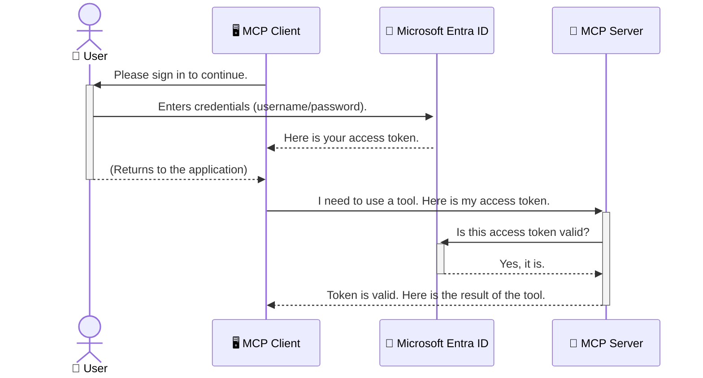

<!--
CO_OP_TRANSLATOR_METADATA:
{
  "original_hash": "6e562d7e5a77c8982da4aa8f762ad1d8",
  "translation_date": "2025-07-02T09:10:38+00:00",
  "source_file": "05-AdvancedTopics/mcp-security-entra/README.md",
  "language_code": "bn"
}
-->
# AI ওয়ার্কফ্লো সুরক্ষা: Model Context Protocol সার্ভারের জন্য Entra ID প্রমাণীকরণ

## পরিচিতি  
আপনার Model Context Protocol (MCP) সার্ভার সুরক্ষিত রাখা ঠিক যেমন আপনার বাড়ির প্রধান দরজা লক করা জরুরি। MCP সার্ভার খোলা রেখে দিলে আপনার টুলস এবং ডেটা অননুমোদিত প্রবেশের মুখোমুখি হতে পারে, যা সুরক্ষা লঙ্ঘনের কারণ হতে পারে। Microsoft Entra ID একটি শক্তিশালী ক্লাউড-ভিত্তিক পরিচয় ও অ্যাক্সেস ম্যানেজমেন্ট সেবা প্রদান করে, যা নিশ্চিত করে যে শুধুমাত্র অনুমোদিত ব্যবহারকারী ও অ্যাপ্লিকেশনই আপনার MCP সার্ভারের সাথে যোগাযোগ করতে পারে। এই অংশে, আপনি শিখবেন কীভাবে Entra ID প্রমাণীকরণের মাধ্যমে আপনার AI ওয়ার্কফ্লোগুলো সুরক্ষিত করবেন।

## শেখার লক্ষ্যসমূহ  
এই অংশ শেষ করার পর, আপনি সক্ষম হবেন:

- MCP সার্ভার সুরক্ষার গুরুত্ব বুঝতে।  
- Microsoft Entra ID এবং OAuth 2.0 প্রমাণীকরণের মৌলিক বিষয়গুলো ব্যাখ্যা করতে।  
- পাবলিক এবং কনফিডেনশিয়াল ক্লায়েন্টের মধ্যে পার্থক্য চিনতে।  
- স্থানীয় (পাবলিক ক্লায়েন্ট) এবং রিমোট (কনফিডেনশিয়াল ক্লায়েন্ট) MCP সার্ভার পরিস্থিতিতে Entra ID প্রমাণীকরণ প্রয়োগ করতে।  
- AI ওয়ার্কফ্লো উন্নয়নের সময় সুরক্ষার সেরা পদ্ধতি প্রয়োগ করতে।

## সুরক্ষা এবং MCP

যেমন আপনি আপনার বাড়ির প্রধান দরজা খোলা রাখবেন না, তেমনি MCP সার্ভারও যেকোনো ব্যক্তির জন্য উন্মুক্ত রাখা উচিত নয়। AI ওয়ার্কফ্লো সুরক্ষিত রাখা জরুরি যাতে আপনি শক্তিশালী, বিশ্বাসযোগ্য এবং নিরাপদ অ্যাপ্লিকেশন তৈরি করতে পারেন। এই অধ্যায়ে, আমরা Microsoft Entra ID ব্যবহার করে MCP সার্ভার সুরক্ষার পদ্ধতি আলোচনা করব, যা নিশ্চিত করে যে শুধুমাত্র অনুমোদিত ব্যবহারকারী এবং অ্যাপ্লিকেশনই আপনার টুলস ও ডেটার সাথে যোগাযোগ করতে পারে।

## MCP সার্ভারের জন্য সুরক্ষা কেন গুরুত্বপূর্ণ?

ভাবুন আপনার MCP সার্ভারে এমন একটি টুল আছে যা ইমেল পাঠাতে পারে বা গ্রাহকের ডাটাবেস অ্যাক্সেস করতে পারে। যদি সার্ভার সুরক্ষাহীন থাকে, তবে যেকোনো ব্যক্তি ওই টুল ব্যবহার করতে পারে, যার ফলে অননুমোদিত ডেটা অ্যাক্সেস, স্প্যাম বা অন্যান্য ক্ষতিকর কার্যকলাপ হতে পারে।

প্রমাণীকরণ প্রয়োগের মাধ্যমে আপনি নিশ্চিত করেন যে, সার্ভারে প্রতিটি অনুরোধ যাচাই করা হয়, অর্থাৎ অনুরোধকারী ব্যবহারকারী বা অ্যাপ্লিকেশনের পরিচয় নিশ্চিত হয়। এটি AI ওয়ার্কফ্লো সুরক্ষার প্রথম এবং সবচেয়ে গুরুত্বপূর্ণ ধাপ।

## Microsoft Entra ID পরিচিতি

[**Microsoft Entra ID**](https://adoption.microsoft.com/microsoft-security/entra/) হলো একটি ক্লাউড-ভিত্তিক পরিচয় ও অ্যাক্সেস ম্যানেজমেন্ট সেবা। এটিকে ভাবুন আপনার অ্যাপ্লিকেশনের জন্য একটি সার্বজনীন নিরাপত্তা প্রহরী হিসেবে। এটি ব্যবহারকারীর পরিচয় যাচাই (authentication) এবং তাদের কী করতে পারবে তা নির্ধারণ (authorization) করার জটিল প্রক্রিয়া পরিচালনা করে।

Entra ID ব্যবহার করে আপনি:

- ব্যবহারকারীদের জন্য নিরাপদ সাইন-ইন সক্ষম করতে পারেন।  
- API এবং সার্ভিসগুলো সুরক্ষিত করতে পারেন।  
- কেন্দ্রীয় স্থানে থেকে অ্যাক্সেস নীতিমালা পরিচালনা করতে পারেন।

MCP সার্ভারের জন্য, Entra ID একটি শক্তিশালী ও ব্যাপকভাবে বিশ্বাসযোগ্য সমাধান প্রদান করে যে কে আপনার সার্ভারের ক্ষমতাগুলো ব্যবহার করতে পারবে তা নিয়ন্ত্রণ করার জন্য।

---

## Entra ID প্রমাণীকরণ কীভাবে কাজ করে: একটি সহজ ব্যাখ্যা

Entra ID **OAuth 2.0** এর মতো ওপেন স্ট্যান্ডার্ড ব্যবহার করে প্রমাণীকরণ পরিচালনা করে। যদিও বিস্তারিত জটিল হতে পারে, মূল ধারণাটি সহজ এবং একটি উপমা দিয়ে বোঝানো যায়।

### OAuth 2.0 এর একটি সহজ পরিচিতি: ভ্যালেট কী

OAuth 2.0 কে ভাবুন আপনার গাড়ির জন্য একটি ভ্যালেট সার্ভিস হিসেবে। যখন আপনি একটি রেস্টুরেন্টে যান, তখন আপনি ভ্যালেটকে আপনার মাস্টার কী দেন না। বরং আপনি একটি **ভ্যালেট কী** দেন যার সীমিত অনুমতি থাকে—গাড়ি চালু করতে পারে এবং দরজা লক করতে পারে, কিন্তু ট্রাঙ্ক বা গ্লাভ কম্পার্টমেন্ট খুলতে পারে না।

এই উপমায়:

- **আপনি** হচ্ছেন **ব্যবহারকারী**।  
- **আপনার গাড়ি** হলো **MCP সার্ভার** যার মূল্যবান টুলস ও ডেটা রয়েছে।  
- **ভ্যালেট** হলো **Microsoft Entra ID**।  
- **পার্কিং অ্যাটেনডেন্ট** হলো **MCP ক্লায়েন্ট** (সার্ভারে অ্যাক্সেসের চেষ্টা করা অ্যাপ্লিকেশন)।  
- **ভ্যালেট কী** হলো **অ্যাক্সেস টোকেন**।

অ্যাক্সেস টোকেন হলো একটি নিরাপদ স্ট্রিং যা MCP ক্লায়েন্ট Entra ID থেকে সাইন-ইন করার পর পায়। এরপর ক্লায়েন্ট প্রতিটি অনুরোধে এই টোকেন MCP সার্ভারে উপস্থাপন করে। সার্ভার টোকেন যাচাই করে নিশ্চিত করে অনুরোধ বৈধ এবং ক্লায়েন্টের যথাযথ অনুমতি আছে, সবই আপনার আসল ক্রেডেনশিয়াল (যেমন পাসওয়ার্ড) ছাড়াই।

### প্রমাণীকরণ প্রবাহ

প্রকৃতপক্ষে প্রক্রিয়াটি এরকম কাজ করে:



### Microsoft Authentication Library (MSAL) পরিচিতি

কোডে যাওয়ার আগে, একটি গুরুত্বপূর্ণ উপাদান পরিচয় করিয়ে দেয়া যাক: **Microsoft Authentication Library (MSAL)**।

MSAL হলো Microsoft তৈরি একটি লাইব্রেরি যা ডেভেলপারদের জন্য প্রমাণীকরণ পরিচালনা অনেক সহজ করে তোলে। নিরাপত্তা টোকেন, সাইন-ইন পরিচালনা এবং সেশন রিফ্রেশ করার জটিল কাজগুলো MSAL স্বয়ংক্রিয়ভাবে করে দেয়।

MSAL ব্যবহারের সুবিধা:

- **নিরাপদ:** এটি শিল্প-মানের প্রোটোকল ও সুরক্ষা সেরা পদ্ধতি অনুসরণ করে, যা কোডে দুর্বলতা কমায়।  
- **সহজ উন্নয়ন:** OAuth 2.0 এবং OpenID Connect এর জটিলতা লুকিয়ে রেখে কয়েকটি লাইনে শক্তিশালী প্রমাণীকরণ যোগ করা যায়।  
- **নিয়মিত আপডেট:** Microsoft নিয়মিত MSAL আপডেট করে নতুন সুরক্ষা হুমকি ও প্ল্যাটফর্ম পরিবর্তন মোকাবেলা করার জন্য।

MSAL .NET, JavaScript/TypeScript, Python, Java, Go এবং মোবাইল প্ল্যাটফর্ম (iOS ও Android) সহ বিভিন্ন ভাষা ও ফ্রেমওয়ার্ক সমর্থন করে। অর্থাৎ আপনি সমগ্র প্রযুক্তি স্ট্যাক জুড়ে একই ধরনের প্রমাণীকরণ প্যাটার্ন ব্যবহার করতে পারবেন।

MSAL সম্পর্কে আরও জানতে অফিসিয়াল [MSAL ওভারভিউ ডকুমেন্টেশন](https://learn.microsoft.com/entra/identity-platform/msal-overview) দেখুন।

---

## Entra ID দিয়ে MCP সার্ভার সুরক্ষিত করা: ধাপে ধাপে নির্দেশিকা

এখন চলুন দেখাই কীভাবে স্থানীয় MCP সার্ভার সুরক্ষিত করবেন (যা `stdio`) using Entra ID. This example uses a **public client**, which is suitable for applications running on a user's machine, like a desktop app or a local development server.

### Scenario 1: Securing a Local MCP Server (with a Public Client)

In this scenario, we'll look at an MCP server that runs locally, communicates over `stdio`, and uses Entra ID to authenticate the user before allowing access to its tools. The server will have a single tool that fetches the user's profile information from the Microsoft Graph API.

#### 1. Setting Up the Application in Entra ID

Before writing any code, you need to register your application in Microsoft Entra ID. This tells Entra ID about your application and grants it permission to use the authentication service.

1. Navigate to the **[Microsoft Entra portal](https://entra.microsoft.com/)**.
2. Go to **App registrations** and click **New registration**.
3. Give your application a name (e.g., "My Local MCP Server").
4. For **Supported account types**, select **Accounts in this organizational directory only**.
5. You can leave the **Redirect URI** blank for this example.
6. Click **Register**.

Once registered, take note of the **Application (client) ID** and **Directory (tenant) ID**. You'll need these in your code.

#### 2. The Code: A Breakdown

Let's look at the key parts of the code that handle authentication. The full code for this example is available in the [Entra ID - Local - WAM](https://github.com/Azure-Samples/mcp-auth-servers/tree/main/src/entra-id-local-wam) folder of the [mcp-auth-servers GitHub repository](https://github.com/Azure-Samples/mcp-auth-servers).

**`AuthenticationService.cs`**

This class is responsible for handling the interaction with Entra ID.

- **`CreateAsync`**: This method initializes the `PublicClientApplication` from the MSAL (Microsoft Authentication Library). It's configured with your application's `clientId` and `tenantId`.
- **`WithBroker`**: This enables the use of a broker (like the Windows Web Account Manager), which provides a more secure and seamless single sign-on experience.
- **`AcquireTokenAsync` পদ্ধতি ব্যবহার করে): এটি মূল মেথড যা প্রথমে টোকেন নিঃশব্দে পাওয়ার চেষ্টা করে (অর্থাৎ ব্যবহারকারী যদি ইতিমধ্যেই বৈধ সেশন রাখে তাহলে পুনরায় সাইন-ইন করতে হবে না)। যদি নিঃশব্দে টোকেন না পাওয়া যায়, তবে ব্যবহারকারীকে ইন্টারেক্টিভ সাইন-ইনের জন্য বলা হয়।

```csharp
// Simplified for clarity
public static async Task<AuthenticationService> CreateAsync(ILogger<AuthenticationService> logger)
{
    var msalClient = PublicClientApplicationBuilder
        .Create(_clientId) // Your Application (client) ID
        .WithAuthority(AadAuthorityAudience.AzureAdMyOrg)
        .WithTenantId(_tenantId) // Your Directory (tenant) ID
        .WithBroker(new BrokerOptions(BrokerOptions.OperatingSystems.Windows))
        .Build();

    // ... cache registration ...

    return new AuthenticationService(logger, msalClient);
}

public async Task<string> AcquireTokenAsync()
{
    try
    {
        // Try silent authentication first
        var accounts = await _msalClient.GetAccountsAsync();
        var account = accounts.FirstOrDefault();

        AuthenticationResult? result = null;

        if (account != null)
        {
            result = await _msalClient.AcquireTokenSilent(_scopes, account).ExecuteAsync();
        }
        else
        {
            // If no account, or silent fails, go interactive
            result = await _msalClient.AcquireTokenInteractive(_scopes).ExecuteAsync();
        }

        return result.AccessToken;
    }
    catch (Exception ex)
    {
        _logger.LogError(ex, "An error occurred while acquiring the token.");
        throw; // Optionally rethrow the exception for higher-level handling
    }
}
```

**`Program.cs`**

This is where the MCP server is set up and the authentication service is integrated.

- **`AddSingleton<AuthenticationService>`**: This registers the `AuthenticationService` with the dependency injection container, so it can be used by other parts of the application (like our tool).
- **`GetUserDetailsFromGraph` tool**: This tool requires an instance of `AuthenticationService`. Before it does anything, it calls `authService.AcquireTokenAsync()`** ব্যবহার করে একটি বৈধ অ্যাক্সেস টোকেন পাওয়া হয়। প্রমাণীকরণ সফল হলে, এটি টোকেন ব্যবহার করে Microsoft Graph API কল করে ব্যবহারকারীর বিস্তারিত তথ্য সংগ্রহ করে।

```csharp
// Simplified for clarity
[McpServerTool(Name = "GetUserDetailsFromGraph")]
public static async Task<string> GetUserDetailsFromGraph(
    AuthenticationService authService)
{
    try
    {
        // This will trigger the authentication flow
        var accessToken = await authService.AcquireTokenAsync();

        // Use the token to create a GraphServiceClient
        var graphClient = new GraphServiceClient(
            new BaseBearerTokenAuthenticationProvider(new TokenProvider(authService)));

        var user = await graphClient.Me.GetAsync();

        return System.Text.Json.JsonSerializer.Serialize(user);
    }
    catch (Exception ex)
    {
        return $"Error: {ex.Message}";
    }
}
```

#### ৩. সবকিছু একসাথে কীভাবে কাজ করে

1. যখন MCP ক্লায়েন্ট `GetUserDetailsFromGraph` tool, the tool first calls `AcquireTokenAsync`.
2. `AcquireTokenAsync` triggers the MSAL library to check for a valid token.
3. If no token is found, MSAL, through the broker, will prompt the user to sign in with their Entra ID account.
4. Once the user signs in, Entra ID issues an access token.
5. The tool receives the token and uses it to make a secure call to the Microsoft Graph API.
6. The user's details are returned to the MCP client.

This process ensures that only authenticated users can use the tool, effectively securing your local MCP server.

### Scenario 2: Securing a Remote MCP Server (with a Confidential Client)

When your MCP server is running on a remote machine (like a cloud server) and communicates over a protocol like HTTP Streaming, the security requirements are different. In this case, you should use a **confidential client** and the **Authorization Code Flow**. This is a more secure method because the application's secrets are never exposed to the browser.

This example uses a TypeScript-based MCP server that uses Express.js to handle HTTP requests.

#### 1. Setting Up the Application in Entra ID

The setup in Entra ID is similar to the public client, but with one key difference: you need to create a **client secret**.

1. Navigate to the **[Microsoft Entra portal](https://entra.microsoft.com/)**.
2. In your app registration, go to the **Certificates & secrets** tab.
3. Click **New client secret**, give it a description, and click **Add**.
4. **Important:** Copy the secret value immediately. You will not be able to see it again.
5. You also need to configure a **Redirect URI**. Go to the **Authentication** tab, click **Add a platform**, select **Web**, and enter the redirect URI for your application (e.g., `http://localhost:3001/auth/callback`).

> **⚠️ Important Security Note:** For production applications, Microsoft strongly recommends using **secretless authentication** methods such as **Managed Identity** or **Workload Identity Federation** instead of client secrets. Client secrets pose security risks as they can be exposed or compromised. Managed identities provide a more secure approach by eliminating the need to store credentials in your code or configuration.
>
> For more information about managed identities and how to implement them, see the [Managed identities for Azure resources overview](https://learn.microsoft.com/entra/identity/managed-identities-azure-resources/overview).

#### 2. The Code: A Breakdown

This example uses a session-based approach. When the user authenticates, the server stores the access token and refresh token in a session and gives the user a session token. This session token is then used for subsequent requests. The full code for this example is available in the [Entra ID - Confidential client](https://github.com/Azure-Samples/mcp-auth-servers/tree/main/src/entra-id-cca-session) folder of the [mcp-auth-servers GitHub repository](https://github.com/Azure-Samples/mcp-auth-servers).

**`Server.ts`**

This file sets up the Express server and the MCP transport layer.

- **`requireBearerAuth`**: This is middleware that protects the `/sse` and `/message` endpoints. It checks for a valid bearer token in the `Authorization` header of the request.
- **`EntraIdServerAuthProvider`**: This is a custom class that implements the `McpServerAuthorizationProvider` interface. It's responsible for handling the OAuth 2.0 flow.
- **`/auth/callback` এন্ডপয়েন্টে অনুরোধ করে: এটি Entra ID থেকে ব্যবহারকারী প্রমাণীকরণের পরে রিডাইরেক্ট হ্যান্ডেল করে। এখানে authorization code কে access token এবং refresh token এ রূপান্তর করা হয়।

```typescript
// Simplified for clarity
const app = express();
const { server } = createServer();
const provider = new EntraIdServerAuthProvider();

// Protect the SSE endpoint
app.get("/sse", requireBearerAuth({
  provider,
  requiredScopes: ["User.Read"]
}), async (req, res) => {
  // ... connect to the transport ...
});

// Protect the message endpoint
app.post("/message", requireBearerAuth({
  provider,
  requiredScopes: ["User.Read"]
}), async (req, res) => {
  // ... handle the message ...
});

// Handle the OAuth 2.0 callback
app.get("/auth/callback", (req, res) => {
  provider.handleCallback(req.query.code, req.query.state)
    .then(result => {
      // ... handle success or failure ...
    });
});
```

**`Tools.ts`**

This file defines the tools that the MCP server provides. The `getUserDetails` টুলটি আগের উদাহরণের মতই, কিন্তু এটি সেশন থেকে অ্যাক্সেস টোকেন সংগ্রহ করে।**

```typescript
// Simplified for clarity
server.setRequestHandler(CallToolRequestSchema, async (request) => {
  const { name } = request.params;
  const context = request.params?.context as { token?: string } | undefined;
  const sessionToken = context?.token;

  if (name === ToolName.GET_USER_DETAILS) {
    if (!sessionToken) {
      throw new AuthenticationError("Authentication token is missing or invalid. Ensure the token is provided in the request context.");
    }

    // Get the Entra ID token from the session store
    const tokenData = tokenStore.getToken(sessionToken);
    const entraIdToken = tokenData.accessToken;

    const graphClient = Client.init({
      authProvider: (done) => {
        done(null, entraIdToken);
      }
    });

    const user = await graphClient.api('/me').get();

    // ... return user details ...
  }
});
```

**`auth/EntraIdServerAuthProvider.ts`**

This class handles the logic for:

- Redirecting the user to the Entra ID sign-in page.
- Exchanging the authorization code for an access token.
- Storing the tokens in the `tokenStore`.
- Refreshing the access token when it expires.

#### 3. How It All Works Together

1. When a user first tries to connect to the MCP server, the `requireBearerAuth` middleware will see that they don't have a valid session and will redirect them to the Entra ID sign-in page.
2. The user signs in with their Entra ID account.
3. Entra ID redirects the user back to the `/auth/callback` endpoint with an authorization code.
4. The server exchanges the code for an access token and a refresh token, stores them, and creates a session token which is sent to the client.
5. The client can now use this session token in the `Authorization` header for all future requests to the MCP server.
6. When the `getUserDetails` টুল কল করা হলে, এটি সেশন টোকেন ব্যবহার করে Entra ID অ্যাক্সেস টোকেন খুঁজে বের করে এবং সেটি ব্যবহার করে Microsoft Graph API কল করে।**

এই প্রবাহটি পাবলিক ক্লায়েন্ট প্রবাহের তুলনায় বেশি জটিল, তবে ইন্টারনেট-ভিত্তিক এন্ডপয়েন্টগুলোর জন্য এটি আবশ্যক। যেহেতু রিমোট MCP সার্ভারগুলো পাবলিক ইন্টারনেটের মাধ্যমে অ্যাক্সেসযোগ্য, তাই অননুমোদিত প্রবেশ এবং সম্ভাব্য আক্রমণ থেকে সুরক্ষার জন্য শক্তিশালী নিরাপত্তা ব্যবস্থা প্রয়োজন।

## সুরক্ষার সেরা পদ্ধতি

- **সর্বদা HTTPS ব্যবহার করুন:** ক্লায়েন্ট ও সার্ভারের মধ্যে যোগাযোগ এনক্রিপ্ট করে টোকেন চুরি রোধ করুন।  
- **Role-Based Access Control (RBAC) প্রয়োগ করুন:** শুধু যাচাই করবেন না ব্যবহারকারী প্রমাণীকৃত কিনা, বরং তারা কী করতে অনুমোদিত সেটিও যাচাই করুন। Entra ID তে রোল ডিফাইন করে MCP সার্ভারে তা যাচাই করুন।  
- **মনিটর ও অডিট করুন:** সব প্রমাণীকরণ ইভেন্ট লগ করুন যাতে সন্দেহজনক কার্যকলাপ শনাক্ত ও প্রতিক্রিয়া নেওয়া যায়।  
- **রেট লিমিটিং ও থ্রটলিং হ্যান্ডেল করুন:** Microsoft Graph এবং অন্যান্য API গুলো রেট লিমিট করে। MCP সার্ভারে এক্সপোনেনশিয়াল ব্যাকঅফ ও রিট্রাই লজিক প্রয়োগ করুন HTTP 429 (Too Many Requests) হ্যান্ডেল করার জন্য। প্রায়ই ব্যবহৃত ডেটা ক্যাশ করার কথা ভাবুন API কল কমানোর জন্য।  
- **টোকেন সুরক্ষিত রাখুন:** অ্যাক্সেস ও রিফ্রেশ টোকেন নিরাপদে সংরক্ষণ করুন। স্থানীয় অ্যাপ্লিকেশনের জন্য সিস্টেমের নিরাপদ স্টোরেজ ব্যবহার করুন। সার্ভার অ্যাপ্লিকেশনের জন্য এনক্রিপ্টেড স্টোরেজ বা Azure Key Vault-এর মতো নিরাপদ কী ম্যানেজমেন্ট সেবা বিবেচনা করুন।  
- **টোকেনের মেয়াদ উত্তীর্ণ হওয়ার হ্যান্ডলিং:** অ্যাক্সেস টোকেনের একটি সীমিত সময় থাকে। স্বয়ংক্রিয়ভাবে রিফ্রেশ টোকেন ব্যবহার করে টোকেন রিফ্রেশের ব্যবস্থা করুন যাতে ব্যবহারকারী পুনরায় লগইন না করেও অবিচ্ছিন্ন অভিজ্ঞতা পায়।  
- **Azure API Management ব্যবহার বিবেচনা করুন:** MCP সার্ভারে সরাসরি নিরাপত্তা প্রয়োগ করলে বিস্তারিত নিয়ন্ত্রণ পাওয়া যায়, তবে API গেটওয়ে যেমন Azure API Management অনেক নিরাপত্তা বিষয় স্বয়ংক্রিয়ভাবে পরিচালনা করে, যেমন প্রমাণীকরণ, অনুমোদন, রেট লিমিটিং ও মনিটরিং। এটি ক্লায়েন্ট ও MCP সার্ভারের মধ্যে একটি কেন্দ্রীয় নিরাপত্তা স্তর হিসেবে কাজ করে। MCP এর জন্য API গেটওয়ে ব্যবহার সম্পর্কে আরও জানতে আমাদের [Azure API Management Your Auth Gateway For MCP Servers](https://techcommunity.microsoft.com/blog/integrationsonazureblog/azure-api-management-your-auth-gateway-for-mcp-servers/4402690) দেখুন।

## প্রধান বিষয়সমূহ

- MCP সার্ভার সুরক্ষা আপনার ডেটা ও টুলস রক্ষা করার জন্য অপরিহার্য।  
- Microsoft Entra ID একটি শক্তিশালী এবং স্কেলযোগ্য প্রমাণীকরণ ও অনুমোদন সমাধান প্রদান করে।  
- স্থানীয় অ্যাপ্লিকেশনের জন্য **পাবলিক ক্লায়েন্ট** এবং রিমোট সার্ভারের জন্য **কনফিডেনশিয়াল ক্লায়েন্ট** ব্যবহার করুন।  
- ওয়েব অ্যাপ্লিকেশনের জন্য **Authorization Code Flow** সবচেয়ে নিরাপদ বিকল্প।  

## অনুশীলন

1. আপনি যে MCP সার্ভার তৈরি করতে পারেন সেটি স্থানীয় নাকি রিমোট হবে?  
2. আপনার উত্তরের ভিত্তিতে, আপনি পাবলিক নাকি কনফিডেনশিয়াল ক্লায়েন্ট ব্যবহার করবেন?  
3. Microsoft Graph এর বিরুদ্ধে কাজ করার জন্য আপনার MCP সার্ভার কোন অনুমতি চাইবে?

## হাতে কলম অনুশীলন

### অনুশীলন ১: Entra ID তে একটি অ্যাপ্লিকেশন নিবন্ধন করুন  
Microsoft Entra পোর্টালে যান।  
আপনার MCP সার্ভারের জন্য একটি নতুন অ্যাপ্লিকেশন নিবন্ধন করুন।  
Application (client) ID এবং Directory (tenant) ID নোট করুন।

### অনুশীলন ২: স্থানীয় MCP সার্ভার সুরক্ষিত করা (পাবলিক ক্লায়েন্ট)  
- MSAL (Microsoft Authentication Library) ব্যবহার করে ইউজার প্রমাণীকরণ সংযোজনের জন্য কোড উদাহরণ অনুসরণ করুন।  
- Microsoft Graph থেকে ব্যবহারকারীর বিস্তারিত আনার MCP টুল কল করে প্রমাণীকরণ প্রবাহ পরীক্ষা করুন।

### অনুশীলন ৩: রিমোট MCP সার্ভার সুরক্ষিত করা (কনফিডেনশিয়াল ক্লায়েন্ট)  
- Entra ID তে একটি কনফিডেনশিয়াল ক্লায়েন্ট নিবন্ধন করুন এবং একটি ক্লায়েন্ট সিক্রেট তৈরি করুন।  
- আপনার Express.js MCP সার্ভারে Authorization Code Flow কনফিগার করুন।  
- সুরক্ষিত এন্ডপয়েন্টগুলো পরীক্ষা করুন এবং টোকেন ভিত্তিক অ্যাক্সেস নিশ্চিত করুন।

### অনুশীলন ৪: সুরক্ষার সেরা পদ্ধতি প্রয়োগ করুন  
- আপনার স্থানীয় বা রিমোট সার্ভারের জন্য HTTPS সক্রিয় করুন।  
- সার্ভার লজিকে রোল ভিত্তিক অ্যাক্সেস কন্ট্রোল (RBAC) প্রয়োগ করুন।  
- টোকেন মেয়াদ উত্তীর্ণ হওয়ার হ্যান্ডলিং এবং নিরাপদ টোকেন সংরক্ষণ যোগ করুন।

## রিসোর্সসমূহ

1. **MSAL ওভারভিউ ডকুমেন্টেশন**  
Microsoft Authentication Library (MSAL) কীভাবে বিভিন্ন প্ল্যাটফর্মে নিরাপদ টোকেন প্রাপ্তি সহজ করে তা জানুন:  
[MSAL Overview on Microsoft Learn](https://learn.microsoft.com/en-gb/entra/msal/overview)

2. **Azure-Samples/mcp-auth-servers GitHub রিপোজিটরি**  
MCP সার্ভারের প্রমাণীকরণ প্রবাহের রেফারেন্স ইমপ্লিমেন্টেশন:  
[Azure-Samples/mcp-auth-servers on GitHub](https://github.com/Azure-Samples/mcp-auth-servers)

3. **Managed Identities for Azure Resources ওভারভিউ**  
সিক্রেট ছাড়াই সিস্টেম বা ব্যবহারকারী-নির্ধারিত ম্যানেজড আইডেন্টিটি ব্যবহার করার পদ্ধতি:  
[Managed Identities Overview on Microsoft Learn](https://learn.microsoft.com/en-us/entra/identity/managed-identities-azure-resources/)

4. **Azure API Management: Your Auth Gateway for MCP Servers**  
MCP সার্ভারের জন্য APIM কে নিরাপদ OAuth2 গেটওয়ে হিসেবে ব্যবহার সম্পর্কিত বিস্তারিত:  
[Azure API Management Your Auth Gateway For MCP Servers](https://techcommunity.microsoft.com/blog/integrationsonazureblog/azure-api-management-your-auth-gateway-for-mcp-servers/4402690)

5. **Microsoft Graph Permissions Reference**  
Microsoft Graph এর জন্য ডেলিগেটেড ও অ্যাপ্লিকেশন অনুমতির সম্পূর্ণ তালিকা:  
[Microsoft Graph Permissions Reference](https://learn.microsoft.com/zh-tw/graph/permissions-reference)

## শেখার ফলাফল  
এই অংশ শেষ করার পর আপনি সক্ষম হবেন:

- MCP সার্ভার ও AI ওয়ার্কফ্লোর জন্য প্রমাণীকরণ কেন গুরুত্বপূর্ণ তা ব্যাখ্যা করতে।  
- স্থানীয় এবং রিমোট MCP সার্ভার পরিস্থিতিতে Entra ID প্রমাণীকরণ সেটআপ ও কনফিগার করতে।  
- সার্ভারের ডিপ্লয়মেন্ট অনুসারে সঠিক ক্লায়েন্ট টাইপ (পাবলিক বা কনফিডেনশিয়াল) নির্বাচন করতে।  
- নিরাপদ কোডিং পদ্ধতি প্রয়োগ করতে, যার মধ্যে টোকেন সংরক্ষণ ও র

**অস্বীকৃতি**:  
এই নথিটি AI অনুবাদ সেবা [Co-op Translator](https://github.com/Azure/co-op-translator) ব্যবহার করে অনূদিত হয়েছে। আমরা যথাসাধ্য সঠিকতার চেষ্টা করি, তবে স্বয়ংক্রিয় অনুবাদে ত্রুটি বা ভুল থাকতে পারে। মূল নথিটি তার নিজস্ব ভাষায় প্রামাণিক উৎস হিসেবে বিবেচিত হওয়া উচিত। গুরুত্বপূর্ণ তথ্যের জন্য পেশাদার মানব অনুবাদের পরামর্শ দেওয়া হয়। এই অনুবাদ ব্যবহারের ফলে সৃষ্ট কোনো ভুল বোঝাবুঝি বা ভুল ব্যাখ্যার জন্য আমরা দায়ী নই।