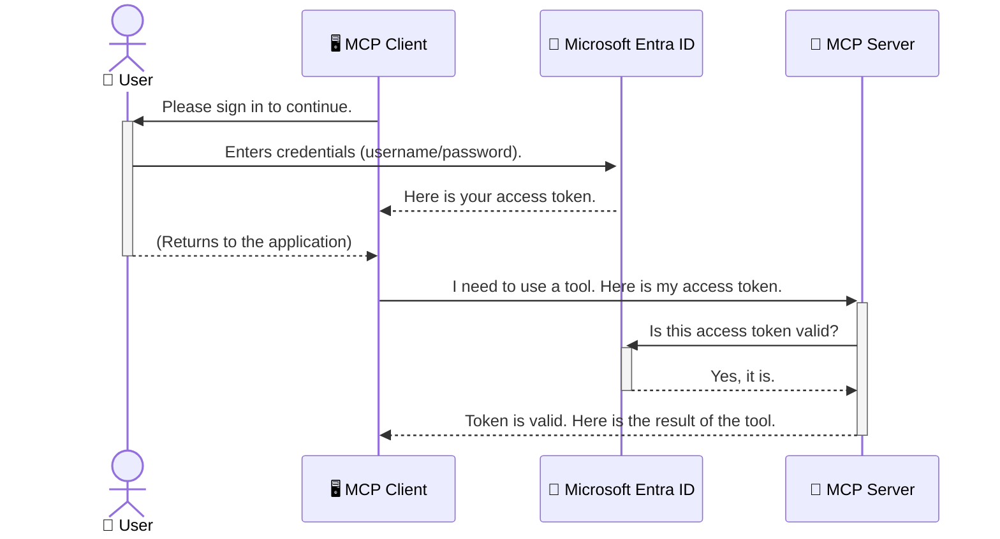

<!--
CO_OP_TRANSLATOR_METADATA:
{
  "original_hash": "6e562d7e5a77c8982da4aa8f762ad1d8",
  "translation_date": "2025-07-14T02:55:43+00:00",
  "source_file": "05-AdvancedTopics/mcp-security-entra/README.md",
  "language_code": "bn"
}
-->
# AI ওয়ার্কফ্লো সুরক্ষা: Model Context Protocol সার্ভারের জন্য Entra ID প্রমাণীকরণ

## পরিচিতি
আপনার Model Context Protocol (MCP) সার্ভার সুরক্ষিত রাখা ঠিক তেমনি গুরুত্বপূর্ণ যেমন আপনার বাড়ির সামনের দরজা লক করা। MCP সার্ভার খোলা রেখে দিলে আপনার টুল এবং ডেটা অননুমোদিত প্রবেশের ঝুঁকিতে পড়ে, যা নিরাপত্তা লঙ্ঘনের কারণ হতে পারে। Microsoft Entra ID একটি শক্তিশালী ক্লাউড-ভিত্তিক পরিচয় ও প্রবেশাধিকার ব্যবস্থাপনা সমাধান প্রদান করে, যা নিশ্চিত করে যে শুধুমাত্র অনুমোদিত ব্যবহারকারী এবং অ্যাপ্লিকেশনই আপনার MCP সার্ভারের সাথে যোগাযোগ করতে পারে। এই অংশে, আপনি শিখবেন কিভাবে Entra ID প্রমাণীকরণ ব্যবহার করে আপনার AI ওয়ার্কফ্লো সুরক্ষিত করবেন।

## শেখার উদ্দেশ্য
এই অংশ শেষ করার পর, আপনি সক্ষম হবেন:

- MCP সার্ভার সুরক্ষার গুরুত্ব বুঝতে।
- Microsoft Entra ID এবং OAuth 2.0 প্রমাণীকরণের মৌলিক ধারণা ব্যাখ্যা করতে।
- পাবলিক এবং কনফিডেনশিয়াল ক্লায়েন্টের মধ্যে পার্থক্য চিনতে।
- স্থানীয় (পাবলিক ক্লায়েন্ট) এবং রিমোট (কনফিডেনশিয়াল ক্লায়েন্ট) MCP সার্ভার পরিস্থিতিতে Entra ID প্রমাণীকরণ প্রয়োগ করতে।
- AI ওয়ার্কফ্লো উন্নয়নের সময় সুরক্ষার সেরা অনুশীলনগুলো প্রয়োগ করতে।

## নিরাপত্তা এবং MCP

যেমন আপনি আপনার বাড়ির সামনের দরজা খোলা রাখবেন না, তেমনি MCP সার্ভারও সবার জন্য উন্মুক্ত রাখা উচিত নয়। আপনার AI ওয়ার্কফ্লো সুরক্ষিত রাখা অত্যাবশ্যক যাতে আপনি শক্তিশালী, বিশ্বাসযোগ্য এবং নিরাপদ অ্যাপ্লিকেশন তৈরি করতে পারেন। এই অধ্যায়ে Microsoft Entra ID ব্যবহার করে MCP সার্ভার সুরক্ষিত করার পদ্ধতি শেখানো হবে, যাতে শুধুমাত্র অনুমোদিত ব্যবহারকারী এবং অ্যাপ্লিকেশনই আপনার টুল এবং ডেটার সাথে যোগাযোগ করতে পারে।

## MCP সার্ভারের জন্য নিরাপত্তা কেন গুরুত্বপূর্ণ

ধরুন আপনার MCP সার্ভারে এমন একটি টুল আছে যা ইমেইল পাঠাতে পারে বা গ্রাহকের ডেটাবেস অ্যাক্সেস করতে পারে। যদি সার্ভার সুরক্ষিত না থাকে, তাহলে যেকেউ সেই টুল ব্যবহার করতে পারবে, যার ফলে অননুমোদিত ডেটা অ্যাক্সেস, স্প্যাম বা অন্যান্য ক্ষতিকর কার্যকলাপ ঘটতে পারে।

প্রমাণীকরণ প্রয়োগ করে, আপনি নিশ্চিত করেন যে সার্ভারে প্রতিটি অনুরোধ যাচাই করা হয়, অর্থাৎ অনুরোধকারী ব্যবহারকারী বা অ্যাপ্লিকেশনের পরিচয় নিশ্চিত করা হয়। এটি আপনার AI ওয়ার্কফ্লো সুরক্ষার প্রথম এবং সবচেয়ে গুরুত্বপূর্ণ ধাপ।

## Microsoft Entra ID পরিচিতি

[**Microsoft Entra ID**](https://adoption.microsoft.com/microsoft-security/entra/) একটি ক্লাউড-ভিত্তিক পরিচয় ও প্রবেশাধিকার ব্যবস্থাপনা সেবা। এটিকে ভাবুন আপনার অ্যাপ্লিকেশনগুলোর জন্য একটি সার্বজনীন নিরাপত্তা প্রহরী হিসেবে। এটি ব্যবহারকারীর পরিচয় যাচাই (প্রমাণীকরণ) এবং তারা কী করতে পারবে তা নির্ধারণ (অনুমোদন) করার জটিল প্রক্রিয়া পরিচালনা করে।

Entra ID ব্যবহার করে আপনি:

- ব্যবহারকারীদের জন্য নিরাপদ সাইন-ইন সক্ষম করতে পারেন।
- API এবং সার্ভিসগুলো সুরক্ষিত রাখতে পারেন।
- কেন্দ্রীয় স্থানে থেকে প্রবেশাধিকার নীতি পরিচালনা করতে পারেন।

MCP সার্ভারের জন্য, Entra ID একটি শক্তিশালী এবং ব্যাপকভাবে বিশ্বাসযোগ্য সমাধান প্রদান করে, যা নির্ধারণ করে কে আপনার সার্ভারের ক্ষমতাগুলো ব্যবহার করতে পারবে।

---

## Entra ID প্রমাণীকরণ কিভাবে কাজ করে: একটি সহজ ব্যাখ্যা

Entra ID প্রমাণীকরণের জন্য **OAuth 2.0** এর মতো ওপেন স্ট্যান্ডার্ড ব্যবহার করে। যদিও বিস্তারিত জটিল হতে পারে, মূল ধারণাটি সহজ এবং একটি উপমা দিয়ে বোঝা যায়।

### OAuth 2.0 এর সহজ পরিচিতি: ভ্যালেট কী

OAuth 2.0 কে ভাবুন আপনার গাড়ির জন্য একটি ভ্যালেট সার্ভিস হিসেবে। যখন আপনি একটি রেস্টুরেন্টে যান, আপনি আপনার মাস্টার কী ভ্যালেটকে দেন না। পরিবর্তে, আপনি একটি **ভ্যালেট কী** দেন যার সীমিত অনুমতি থাকে—এটি গাড়ি চালু করতে এবং দরজা লক করতে পারে, কিন্তু ট্রাঙ্ক বা গ্লাভ কম্পার্টমেন্ট খুলতে পারে না।

এই উপমায়:

- **আপনি** হচ্ছেন **ব্যবহারকারী**।
- **আপনার গাড়ি** MCP সার্ভার, যার মূল্যবান টুল এবং ডেটা রয়েছে।
- **ভ্যালেট** হল **Microsoft Entra ID**।
- **পার্কিং অ্যাটেনডেন্ট** হল MCP ক্লায়েন্ট (অ্যাপ্লিকেশন যা সার্ভারে অ্যাক্সেস চায়)।
- **ভ্যালেট কী** হল **অ্যাক্সেস টোকেন**।

অ্যাক্সেস টোকেন একটি নিরাপদ টেক্সট স্ট্রিং যা MCP ক্লায়েন্ট Entra ID থেকে সাইন-ইন করার পর পায়। ক্লায়েন্ট এই টোকেন MCP সার্ভারে প্রতিটি অনুরোধের সাথে পাঠায়। সার্ভার টোকেন যাচাই করে নিশ্চিত করে যে অনুরোধ বৈধ এবং ক্লায়েন্টের প্রয়োজনীয় অনুমতি আছে, সবই আপনার আসল ক্রেডেনশিয়াল (যেমন পাসওয়ার্ড) ছাড়াই।

### প্রমাণীকরণ প্রবাহ

প্রক্রিয়াটি বাস্তবে কিভাবে কাজ করে:



### Microsoft Authentication Library (MSAL) পরিচিতি

কোডে যাওয়ার আগে, একটি গুরুত্বপূর্ণ উপাদান পরিচয় করিয়ে দেওয়া দরকার: **Microsoft Authentication Library (MSAL)**।

MSAL হল Microsoft দ্বারা তৈরি একটি লাইব্রেরি যা ডেভেলপারদের জন্য প্রমাণীকরণ পরিচালনা করা অনেক সহজ করে তোলে। আপনাকে নিরাপত্তা টোকেন, সাইন-ইন এবং সেশন রিফ্রেশ করার জটিল কোড লেখার পরিবর্তে, MSAL এই কাজগুলো করে দেয়।

MSAL ব্যবহারের সুবিধা:

- **নিরাপদ:** এটি শিল্প-মানের প্রোটোকল এবং নিরাপত্তার সেরা অনুশীলন অনুসরণ করে, আপনার কোডে দুর্বলতার ঝুঁকি কমায়।
- **সহজ উন্নয়ন:** OAuth 2.0 এবং OpenID Connect প্রোটোকলের জটিলতা লুকিয়ে রাখে, কয়েক লাইনের কোডে শক্তিশালী প্রমাণীকরণ যোগ করতে দেয়।
- **রক্ষণাবেক্ষণ:** Microsoft নিয়মিত MSAL আপডেট করে নতুন নিরাপত্তা হুমকি এবং প্ল্যাটফর্ম পরিবর্তনের সাথে খাপ খাইয়ে নিতে।

MSAL .NET, JavaScript/TypeScript, Python, Java, Go এবং মোবাইল প্ল্যাটফর্ম যেমন iOS ও Android সহ বিভিন্ন ভাষা ও ফ্রেমওয়ার্ক সমর্থন করে। এর মানে আপনি আপনার প্রযুক্তি স্ট্যাক জুড়ে একই ধারাবাহিক প্রমাণীকরণ প্যাটার্ন ব্যবহার করতে পারবেন।

MSAL সম্পর্কে আরও জানতে, অফিসিয়াল [MSAL ওভারভিউ ডকুমেন্টেশন](https://learn.microsoft.com/entra/identity-platform/msal-overview) দেখুন।

---

## Entra ID দিয়ে আপনার MCP সার্ভার সুরক্ষিত করা: ধাপে ধাপে নির্দেশিকা

এখন, চলুন দেখি কিভাবে স্থানীয় MCP সার্ভার (যা `stdio` এর মাধ্যমে যোগাযোগ করে) Entra ID ব্যবহার করে সুরক্ষিত করা যায়। এই উদাহরণে একটি **পাবলিক ক্লায়েন্ট** ব্যবহার করা হয়েছে, যা ব্যবহারকারীর মেশিনে চলা অ্যাপ্লিকেশনের জন্য উপযুক্ত, যেমন ডেস্কটপ অ্যাপ বা স্থানীয় ডেভেলপমেন্ট সার্ভার।

### পরিস্থিতি ১: স্থানীয় MCP সার্ভার সুরক্ষা (পাবলিক ক্লায়েন্ট সহ)

এই পরিস্থিতিতে, আমরা একটি স্থানীয় MCP সার্ভার দেখব যা `stdio` এর মাধ্যমে যোগাযোগ করে এবং Entra ID ব্যবহারকারীর প্রমাণীকরণ করে তার টুলগুলোতে প্রবেশাধিকার দেয়। সার্ভারে একটি টুল থাকবে যা Microsoft Graph API থেকে ব্যবহারকারীর প্রোফাইল তথ্য নিয়ে আসে।

#### ১. Entra ID তে অ্যাপ্লিকেশন সেটআপ করা

কোন কোড লেখার আগে, আপনাকে Microsoft Entra ID তে আপনার অ্যাপ্লিকেশন নিবন্ধন করতে হবে। এটি Entra ID কে আপনার অ্যাপ্লিকেশন সম্পর্কে জানায় এবং প্রমাণীকরণ সেবা ব্যবহারের অনুমতি দেয়।

1. **[Microsoft Entra পোর্টাল](https://entra.microsoft.com/)** এ যান।
2. **App registrations** এ যান এবং **New registration** ক্লিক করুন।
3. আপনার অ্যাপ্লিকেশনের নাম দিন (যেমন "My Local MCP Server")।
4. **Supported account types** এ **Accounts in this organizational directory only** নির্বাচন করুন।
5. এই উদাহরণের জন্য **Redirect URI** ফাঁকা রাখতে পারেন।
6. **Register** ক্লিক করুন।

নিবন্ধনের পর, **Application (client) ID** এবং **Directory (tenant) ID** নোট করে রাখুন। এগুলো কোডে প্রয়োজন হবে।

#### ২. কোড: একটি বিশ্লেষণ

চলুন প্রমাণীকরণ পরিচালনার মূল অংশগুলো দেখি। এই উদাহরণের সম্পূর্ণ কোড [Entra ID - Local - WAM](https://github.com/Azure-Samples/mcp-auth-servers/tree/main/src/entra-id-local-wam) ফোল্ডারে পাওয়া যাবে [mcp-auth-servers GitHub রিপোজিটরিতে](https://github.com/Azure-Samples/mcp-auth-servers)।

**`AuthenticationService.cs`**

এই ক্লাস Entra ID এর সাথে ইন্টারঅ্যাকশন পরিচালনা করে।

- **`CreateAsync`**: MSAL থেকে `PublicClientApplication` ইনিশিয়ালাইজ করে। এটি আপনার অ্যাপ্লিকেশনের `clientId` এবং `tenantId` দিয়ে কনফিগার করা হয়।
- **`WithBroker`**: ব্রোকার (যেমন Windows Web Account Manager) ব্যবহার সক্রিয় করে, যা আরও নিরাপদ এবং সিমলেস সিঙ্গল সাইন-অন অভিজ্ঞতা দেয়।
- **`AcquireTokenAsync`**: মূল মেথড। প্রথমে এটি সাইলেন্টলি টোকেন পাওয়ার চেষ্টা করে (যদি ব্যবহারকারীর বৈধ সেশন থাকে, তাহলে পুনরায় সাইন-ইন করতে হয় না)। যদি সাইলেন্ট টোকেন না পাওয়া যায়, তাহলে ব্যবহারকারীকে ইন্টারেক্টিভ সাইন-ইনের জন্য অনুরোধ করে।

```csharp
// Simplified for clarity
public static async Task<AuthenticationService> CreateAsync(ILogger<AuthenticationService> logger)
{
    var msalClient = PublicClientApplicationBuilder
        .Create(_clientId) // Your Application (client) ID
        .WithAuthority(AadAuthorityAudience.AzureAdMyOrg)
        .WithTenantId(_tenantId) // Your Directory (tenant) ID
        .WithBroker(new BrokerOptions(BrokerOptions.OperatingSystems.Windows))
        .Build();

    // ... cache registration ...

    return new AuthenticationService(logger, msalClient);
}

public async Task<string> AcquireTokenAsync()
{
    try
    {
        // Try silent authentication first
        var accounts = await _msalClient.GetAccountsAsync();
        var account = accounts.FirstOrDefault();

        AuthenticationResult? result = null;

        if (account != null)
        {
            result = await _msalClient.AcquireTokenSilent(_scopes, account).ExecuteAsync();
        }
        else
        {
            // If no account, or silent fails, go interactive
            result = await _msalClient.AcquireTokenInteractive(_scopes).ExecuteAsync();
        }

        return result.AccessToken;
    }
    catch (Exception ex)
    {
        _logger.LogError(ex, "An error occurred while acquiring the token.");
        throw; // Optionally rethrow the exception for higher-level handling
    }
}
```

**`Program.cs`**

এখানে MCP সার্ভার সেটআপ এবং প্রমাণীকরণ সার্ভিস ইন্টিগ্রেট করা হয়।

- **`AddSingleton<AuthenticationService>`**: `AuthenticationService` কে ডিপেনডেন্সি ইনজেকশন কন্টেইনারে রেজিস্টার করে, যাতে অ্যাপ্লিকেশনের অন্যান্য অংশ (যেমন টুল) এটি ব্যবহার করতে পারে।
- **`GetUserDetailsFromGraph` টুল**: এই টুল `AuthenticationService` এর একটি ইনস্ট্যান্স চায়। এটি প্রথমে `authService.AcquireTokenAsync()` কল করে বৈধ অ্যাক্সেস টোকেন পায়। প্রমাণীকরণ সফল হলে, টোকেন ব্যবহার করে Microsoft Graph API কল করে ব্যবহারকারীর তথ্য আনে।

```csharp
// Simplified for clarity
[McpServerTool(Name = "GetUserDetailsFromGraph")]
public static async Task<string> GetUserDetailsFromGraph(
    AuthenticationService authService)
{
    try
    {
        // This will trigger the authentication flow
        var accessToken = await authService.AcquireTokenAsync();

        // Use the token to create a GraphServiceClient
        var graphClient = new GraphServiceClient(
            new BaseBearerTokenAuthenticationProvider(new TokenProvider(authService)));

        var user = await graphClient.Me.GetAsync();

        return System.Text.Json.JsonSerializer.Serialize(user);
    }
    catch (Exception ex)
    {
        return $"Error: {ex.Message}";
    }
}
```

#### ৩. সবকিছু কিভাবে একসাথে কাজ করে

1. MCP ক্লায়েন্ট যখন `GetUserDetailsFromGraph` টুল ব্যবহার করতে চায়, টুল প্রথমে `AcquireTokenAsync` কল করে।
2. `AcquireTokenAsync` MSAL লাইব্রেরিকে বৈধ টোকেন আছে কিনা চেক করতে বলে।
3. যদি টোকেন না পাওয়া যায়, MSAL ব্রোকারের মাধ্যমে ব্যবহারকারীকে Entra ID অ্যাকাউন্ট দিয়ে সাইন-ইন করতে বলে।
4. ব্যবহারকারী সাইন-ইন করলে, Entra ID একটি অ্যাক্সেস টোকেন ইস্যু করে।
5. টুল টোকেন পেয়ে Microsoft Graph API-তে নিরাপদ কল করে।
6. ব্যবহারকারীর তথ্য MCP ক্লায়েন্টকে ফেরত দেয়।

এই প্রক্রিয়া নিশ্চিত করে যে শুধুমাত্র প্রমাণীকৃত ব্যবহারকারীরাই টুল ব্যবহার করতে পারে, ফলে আপনার স্থানীয় MCP সার্ভার সুরক্ষিত থাকে।

### পরিস্থিতি ২: রিমোট MCP সার্ভার সুরক্ষা (কনফিডেনশিয়াল ক্লায়েন্ট সহ)

যখন আপনার MCP সার্ভার রিমোট মেশিনে (যেমন ক্লাউড সার্ভার) চলে এবং HTTP Streaming এর মতো প্রোটোকলের মাধ্যমে যোগাযোগ করে, তখন নিরাপত্তার চাহিদা আলাদা হয়। এই ক্ষেত্রে, আপনাকে **কনফিডেনশিয়াল ক্লায়েন্ট** এবং **Authorization Code Flow** ব্যবহার করতে হবে। এটি আরও নিরাপদ কারণ অ্যাপ্লিকেশনের সিক্রেট ব্রাউজারে কখনো প্রকাশ পায় না।

এই উদাহরণে TypeScript ভিত্তিক MCP সার্ভার ব্যবহার করা হয়েছে, যা Express.js দিয়ে HTTP অনুরোধ পরিচালনা করে।

#### ১. Entra ID তে অ্যাপ্লিকেশন সেটআপ করা

Entra ID তে সেটআপ পাবলিক ক্লায়েন্টের মতোই, তবে একটি গুরুত্বপূর্ণ পার্থক্য আছে: আপনাকে একটি **client secret** তৈরি করতে হবে।

1. **[Microsoft Entra পোর্টাল](https://entra.microsoft.com/)** এ যান।
2. আপনার অ্যাপ নিবন্ধনে **Certificates & secrets** ট্যাবে যান।
3. **New client secret** ক্লিক করুন, একটি বর্ণনা দিন এবং **Add** ক্লিক করুন।
4. **গুরুত্বপূর্ণ:** সিক্রেট মানটি অবিলম্বে কপি করে রাখুন। পরে এটি আর দেখা যাবে না।
5. আপনাকে একটি **Redirect URI** কনফিগার করতে হবে। **Authentication** ট্যাবে যান, **Add a platform** ক্লিক করুন, **Web** নির্বাচন করুন এবং আপনার অ্যাপ্লিকেশনের রিডাইরেক্ট URI দিন (যেমন `http://localhost:3001/auth/callback`)।

> **⚠️ গুরুত্বপূর্ণ নিরাপত্তা নোট:** প্রোডাকশন অ্যাপ্লিকেশনের জন্য, Microsoft দৃঢ়ভাবে পরামর্শ দেয় **secretless authentication** পদ্ধতি যেমন **Managed Identity** বা **Workload Identity Federation** ব্যবহার করতে। ক্লায়েন্ট সিক্রেট নিরাপত্তার ঝুঁকি সৃষ্টি করে কারণ এটি প্রকাশ বা কম্প্রোমাইজ হতে পারে। Managed identity গুলো নিরাপদ পদ্ধতি প্রদান করে কারণ এতে আপনার কোড বা কনফিগারেশনে ক্রেডেনশিয়াল সংরক্ষণ করতে হয় না।
>
> Managed identities এবং তাদের বাস্তবায়ন সম্পর্কে আরও জানতে, দেখুন [Managed identities for Azure resources overview](https://learn.microsoft.com/entra/identity/managed-identities-azure-resources/overview)।

#### ২. কোড: একটি বিশ্লেষণ

এই উদাহরণে সেশন-ভিত্তিক পদ্ধতি ব্যবহার করা হয়েছে। ব্যবহারকারী প্রমাণীকৃত হলে, সার্ভার অ্যাক্সেস টোকেন এবং রিফ্রেশ টোকেন সেশনে সংরক্ষণ করে এবং ব্যবহারকারীকে একটি সেশন টোকেন দেয়। পরবর্তী অনুরোধে এই সেশন টোকেন ব্যবহার করা হয়। সম্পূর্ণ কোড [Entra ID - Confidential client](https://github.com/Azure-Samples/mcp-auth-servers/tree/main/src/entra-id-cca-session) ফোল্ডারে পাওয়া যাবে [mcp-auth-servers GitHub রিপোজিটরিতে](https://github.com/Azure-Samples/mcp-auth-servers)।

**`Server.ts`**

এই ফাইলটি Express সার্ভার এবং MCP ট্রান্সপোর্ট লেয়ার সেটআপ করে।

- **`requireBearerAuth`**: এটি একটি মিডলওয়্যার যা `/sse` এবং `/message` এন্ডপয়েন্টগুলো সুরক্ষিত করে। এটি অনুরোধের `Authorization` হেডারে বৈধ বেয়ারার টোকেন আছে কিনা চেক করে।
- **`EntraIdServerAuthProvider`**: একটি কাস্টম ক্লাস যা `McpServerAuthorizationProvider` ইন্টারফেস ইমপ্লিমেন্ট করে। এটি OAuth 2.0 ফ্লো পরিচালনার দায়িত্বে থাকে।
- **`/auth/callback`**: এই এন্ডপয়েন্ট Entra ID থেকে প্রমাণীকরণের পর রিডাইরেক্ট হ্যান্ডেল করে। এটি authorization code কে access token এবং refresh token এ রূপান্তর করে।

```typescript
// Simplified for clarity
const app = express();
const { server } = createServer();
const provider = new EntraIdServerAuthProvider();

// Protect the SSE endpoint
app.get("/sse", requireBearerAuth({
  provider,
  requiredScopes: ["User.Read"]
}), async (req, res) => {
  // ... connect to the transport ...
});

// Protect the message endpoint
app.post("/message", requireBearerAuth({
  provider,
  requiredScopes: ["User.Read"]
}), async (req, res) => {
  // ... handle the message ...
});

// Handle the OAuth 2.0 callback
app.get("/auth/callback", (req, res) => {
  provider.handleCallback(req.query.code, req.query.state)
    .then(result => {
      // ... handle success or failure ...
    });
});
```

**`Tools.ts`**

এই ফাইলে MCP সার্ভারের সরবরাহকৃত টুলগুলো সংজ্ঞায়িত করা হয়েছে। `getUserDetails` টুলটি আগের উদাহরণের মতোই, তবে এটি সেশন থেকে অ্যাক্সেস টোকেন নেয়।

```typescript
// Simplified for clarity
server.setRequestHandler(CallToolRequestSchema, async (request) => {
  const { name } = request.params;
  const context = request.params?.context as { token?: string } | undefined;
  const sessionToken = context?.token;

  if (name === ToolName.GET_USER_DETAILS) {
    if (!sessionToken) {
      throw new AuthenticationError("Authentication token is missing or invalid. Ensure the token is provided in the request context.");
    }

    // Get the Entra ID token from the session store
    const tokenData = tokenStore.getToken(sessionToken);
    const entraIdToken = tokenData.accessToken;

    const graphClient = Client.init({
      authProvider: (done) => {
        done(null, entraIdToken);
      }
    });

    const user = await graphClient.api('/me').get();

    // ... return user details ...
  }
});
```

**`auth/EntraIdServerAuthProvider.ts`**

এই ক্লাসের কাজ:

- ব্যবহারকারীকে Entra ID সাইন-ইন পেজে রিডাইরেক্ট করা।
- authorization code কে access token এ রূপান্তর করা।
- টোকেনগুলো `tokenStore` এ সংরক্ষণ করা।
- অ্যাক্সেস টোকেনের মেয়াদ শেষ হলে তা রিফ্রেশ করা।

#### ৩. সবকিছু কিভাবে একসাথে কাজ করে

1. যখন ব্যবহারকারী প্রথম MCP সার্ভারে সংযোগ করার চেষ্টা করে, `requireBearerAuth` মিডলওয়্যার দেখে যে বৈধ সেশন নেই এবং ব্যবহারকারীকে Entra ID সাইন-ইন পেজে রিডাইরেক্ট করে।
2. ব্যবহারকারী তার Entra ID অ্যাকাউন্ট দিয়ে সাইন-ইন করে।
3. Entra ID ব্যবহারকারীকে `/auth/callback` এন্ডপয়েন্টে authorization code সহ রিডাইরেক্ট করে।
4. সার্ভার কোডের বিনিময়ে একটি access token এবং refresh token গ্রহণ করে, সেগুলো সংরক্ষণ করে এবং একটি session token তৈরি করে যা ক্লায়েন্টকে পাঠানো হয়।  
5. ক্লায়েন্ট এখন এই session token ব্যবহার করে MCP সার্ভারের সকল ভবিষ্যত অনুরোধে `Authorization` হেডারে এটি পাঠাতে পারে।  
6. যখন `getUserDetails` টুল কল করা হয়, তখন এটি session token ব্যবহার করে Entra ID access token খুঁজে বের করে এবং তারপর Microsoft Graph API কল করে।  

এই প্রবাহটি public client flow থেকে বেশি জটিল, তবে ইন্টারনেট-ফেসিং এন্ডপয়েন্টের জন্য এটি প্রয়োজনীয়। যেহেতু রিমোট MCP সার্ভারগুলো পাবলিক ইন্টারনেটের মাধ্যমে অ্যাক্সেসযোগ্য, তাই অননুমোদিত প্রবেশ এবং সম্ভাব্য আক্রমণ থেকে সুরক্ষার জন্য শক্তিশালী নিরাপত্তা ব্যবস্থা প্রয়োজন।  


## Security Best Practices

- **সবসময় HTTPS ব্যবহার করুন**: ক্লায়েন্ট এবং সার্ভারের মধ্যে যোগাযোগ এনক্রিপ্ট করুন যাতে টোকেনগুলি আটকানো থেকে রক্ষা পায়।  
- **Role-Based Access Control (RBAC) বাস্তবায়ন করুন**: শুধু ব্যবহারকারী প্রমাণীকৃত কিনা তা যাচাই করবেন না; তারা কী করতে অনুমোদিত তা যাচাই করুন। Entra ID-তে রোল নির্ধারণ করতে পারেন এবং MCP সার্ভারে সেগুলো যাচাই করতে পারেন।  
- **মনিটর এবং অডিট করুন**: সব প্রমাণীকরণ ইভেন্ট লগ করুন যাতে সন্দেহজনক কার্যকলাপ শনাক্ত ও প্রতিক্রিয়া জানানো যায়।  
- **রেট লিমিটিং এবং থ্রটলিং হ্যান্ডেল করুন**: Microsoft Graph এবং অন্যান্য API-তে অপব্যবহার রোধে রেট লিমিটিং থাকে। MCP সার্ভারে এক্সপোনেনশিয়াল ব্যাকঅফ এবং রিট্রাই লজিক বাস্তবায়ন করুন যাতে HTTP 429 (Too Many Requests) রেসপন্স সুন্দরভাবে হ্যান্ডেল করা যায়। প্রায়ই ব্যবহৃত ডেটা ক্যাশিং করার কথা ভাবুন যাতে API কল কমানো যায়।  
- **টোকেন সুরক্ষিতভাবে সংরক্ষণ করুন**: Access token এবং refresh token নিরাপদে সংরক্ষণ করুন। লোকাল অ্যাপ্লিকেশনের জন্য সিস্টেমের সিকিউর স্টোরেজ ব্যবহার করুন। সার্ভার অ্যাপ্লিকেশনের জন্য এনক্রিপ্টেড স্টোরেজ বা Azure Key Vault-এর মতো সিকিউর কী ম্যানেজমেন্ট সার্ভিস ব্যবহার করার কথা ভাবুন।  
- **টোকেন মেয়াদ উত্তীর্ণ হ্যান্ডেলিং**: Access token-এর একটি সীমিত মেয়াদ থাকে। Refresh token ব্যবহার করে স্বয়ংক্রিয় টোকেন রিফ্রেশ বাস্তবায়ন করুন যাতে ব্যবহারকারী পুনরায় প্রমাণীকরণের প্রয়োজন ছাড়াই সেবা অব্যাহত রাখতে পারে।  
- **Azure API Management ব্যবহার বিবেচনা করুন**: MCP সার্ভারে সরাসরি নিরাপত্তা বাস্তবায়ন করলে সূক্ষ্ম নিয়ন্ত্রণ পাওয়া যায়, তবে Azure API Management-এর মতো API গেটওয়ে অনেক নিরাপত্তা বিষয় স্বয়ংক্রিয়ভাবে পরিচালনা করতে পারে, যেমন প্রমাণীকরণ, অনুমোদন, রেট লিমিটিং এবং মনিটরিং। এগুলো ক্লায়েন্ট এবং MCP সার্ভারের মধ্যে একটি কেন্দ্রীয় নিরাপত্তা স্তর প্রদান করে। MCP-এর সাথে API গেটওয়ে ব্যবহারের বিস্তারিত জানতে আমাদের [Azure API Management Your Auth Gateway For MCP Servers](https://techcommunity.microsoft.com/blog/integrationsonazureblog/azure-api-management-your-auth-gateway-for-mcp-servers/4402690) দেখুন।  


## Key Takeaways

- আপনার MCP সার্ভার সুরক্ষিত রাখা অত্যন্ত গুরুত্বপূর্ণ যাতে আপনার ডেটা এবং টুলস সুরক্ষিত থাকে।  
- Microsoft Entra ID একটি শক্তিশালী এবং স্কেলেবল প্রমাণীকরণ ও অনুমোদন সমাধান প্রদান করে।  
- লোকাল অ্যাপ্লিকেশনের জন্য **public client** এবং রিমোট সার্ভারের জন্য **confidential client** ব্যবহার করুন।  
- ওয়েব অ্যাপ্লিকেশনের জন্য **Authorization Code Flow** সবচেয়ে নিরাপদ বিকল্প।  


## Exercise

1. আপনি যে MCP সার্ভার তৈরি করতে পারেন তা চিন্তা করুন। এটি কি লোকাল সার্ভার হবে নাকি রিমোট সার্ভার?  
2. আপনার উত্তরের ভিত্তিতে, আপনি public নাকি confidential client ব্যবহার করবেন?  
3. Microsoft Graph-এর বিরুদ্ধে কাজ করার জন্য আপনার MCP সার্ভার কোন অনুমতি চাইবে?  


## Hands-on Exercises

### Exercise 1: Entra ID-তে একটি অ্যাপ্লিকেশন নিবন্ধন করুন  
Microsoft Entra পোর্টালে যান।  
আপনার MCP সার্ভারের জন্য একটি নতুন অ্যাপ্লিকেশন নিবন্ধন করুন।  
Application (client) ID এবং Directory (tenant) ID নোট করুন।  

### Exercise 2: লোকাল MCP সার্ভার সুরক্ষিত করুন (Public Client)  
- ব্যবহারকারী প্রমাণীকরণের জন্য MSAL (Microsoft Authentication Library) ইন্টিগ্রেট করার কোড উদাহরণ অনুসরণ করুন।  
- Microsoft Graph থেকে ব্যবহারকারীর বিবরণ আনার MCP টুল কল করে প্রমাণীকরণ প্রবাহ পরীক্ষা করুন।  

### Exercise 3: রিমোট MCP সার্ভার সুরক্ষিত করুন (Confidential Client)  
- Entra ID-তে একটি confidential client নিবন্ধন করুন এবং একটি client secret তৈরি করুন।  
- আপনার Express.js MCP সার্ভারে Authorization Code Flow কনফিগার করুন।  
- সুরক্ষিত এন্ডপয়েন্টগুলো পরীক্ষা করুন এবং টোকেন-ভিত্তিক অ্যাক্সেস নিশ্চিত করুন।  

### Exercise 4: Security Best Practices প্রয়োগ করুন  
- আপনার লোকাল বা রিমোট সার্ভারের জন্য HTTPS সক্রিয় করুন।  
- সার্ভার লজিকে role-based access control (RBAC) বাস্তবায়ন করুন।  
- টোকেন মেয়াদ উত্তীর্ণ হ্যান্ডেলিং এবং সুরক্ষিত টোকেন সংরক্ষণ যোগ করুন।  


## Resources

1. **MSAL Overview Documentation**  
   Microsoft Authentication Library (MSAL) কীভাবে বিভিন্ন প্ল্যাটফর্মে নিরাপদ টোকেন অর্জন সক্ষম করে তা শিখুন:  
   [MSAL Overview on Microsoft Learn](https://learn.microsoft.com/en-gb/entra/msal/overview)  

2. **Azure-Samples/mcp-auth-servers GitHub Repository**  
   MCP সার্ভারের প্রমাণীকরণ প্রবাহের রেফারেন্স ইমপ্লিমেন্টেশন:  
   [Azure-Samples/mcp-auth-servers on GitHub](https://github.com/Azure-Samples/mcp-auth-servers)  

3. **Managed Identities for Azure Resources Overview**  
   সিক্রেট ছাড়াই সিস্টেম বা ইউজার-অ্যাসাইনড ম্যানেজড আইডেন্টিটি ব্যবহার করার উপায়:  
   [Managed Identities Overview on Microsoft Learn](https://learn.microsoft.com/en-us/entra/identity/managed-identities-azure-resources/)  

4. **Azure API Management: Your Auth Gateway for MCP Servers**  
   MCP সার্ভারের জন্য APIM কে একটি নিরাপদ OAuth2 গেটওয়ে হিসেবে ব্যবহারের বিস্তারিত:  
   [Azure API Management Your Auth Gateway For MCP Servers](https://techcommunity.microsoft.com/blog/integrationsonazureblog/azure-api-management-your-auth-gateway-for-mcp-servers/4402690)  

5. **Microsoft Graph Permissions Reference**  
   Microsoft Graph-এর জন্য ডেলিগেটেড এবং অ্যাপ্লিকেশন অনুমতির বিস্তৃত তালিকা:  
   [Microsoft Graph Permissions Reference](https://learn.microsoft.com/zh-tw/graph/permissions-reference)  


## Learning Outcomes  
এই অংশ সম্পন্ন করার পর আপনি সক্ষম হবেন:  

- MCP সার্ভার এবং AI ওয়ার্কফ্লোর জন্য প্রমাণীকরণের গুরুত্ব ব্যাখ্যা করতে।  
- লোকাল এবং রিমোট MCP সার্ভার পরিস্থিতির জন্য Entra ID প্রমাণীকরণ সেটআপ ও কনফিগার করতে।  
- আপনার সার্ভারের ডিপ্লয়মেন্ট অনুযায়ী সঠিক ক্লায়েন্ট টাইপ (public বা confidential) নির্বাচন করতে।  
- নিরাপদ কোডিং অনুশীলন বাস্তবায়ন করতে, যার মধ্যে টোকেন সংরক্ষণ এবং রোল-ভিত্তিক অনুমোদন অন্তর্ভুক্ত।  
- আপনার MCP সার্ভার এবং এর টুলসকে অননুমোদিত প্রবেশ থেকে আত্মবিশ্বাসের সাথে সুরক্ষিত রাখতে।  


## What's next  

- [5.13 Model Context Protocol (MCP) Integration with Azure AI Foundry](../mcp-foundry-agent-integration/README.md)

**অস্বীকৃতি**:  
এই নথিটি AI অনুবাদ সেবা [Co-op Translator](https://github.com/Azure/co-op-translator) ব্যবহার করে অনূদিত হয়েছে। আমরা যথাসাধ্য সঠিকতার চেষ্টা করি, তবে স্বয়ংক্রিয় অনুবাদে ত্রুটি বা অসঙ্গতি থাকতে পারে। মূল নথিটি তার নিজস্ব ভাষায়ই কর্তৃত্বপূর্ণ উৎস হিসেবে বিবেচিত হওয়া উচিত। গুরুত্বপূর্ণ তথ্যের জন্য পেশাদার মানব অনুবাদ গ্রহণ করার পরামর্শ দেওয়া হয়। এই অনুবাদের ব্যবহারে সৃষ্ট কোনো ভুল বোঝাবুঝি বা ভুল ব্যাখ্যার জন্য আমরা দায়ী নই।