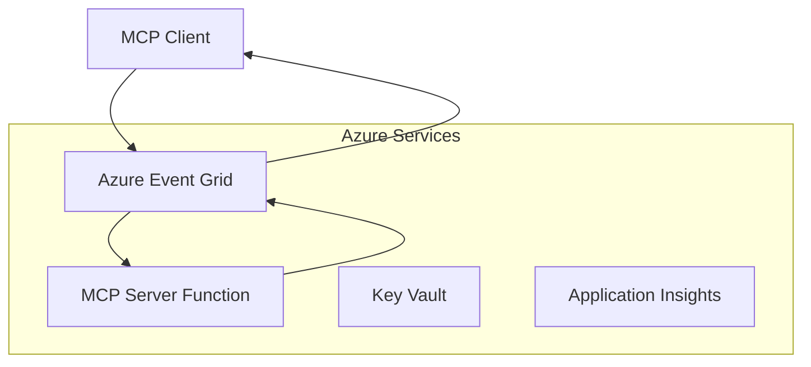
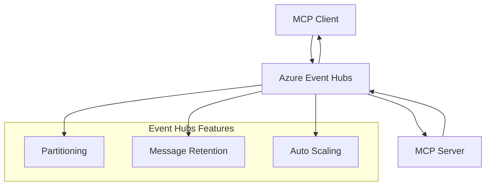

<!--
CO_OP_TRANSLATOR_METADATA:
{
  "original_hash": "c71c60af76120a517809a6cfba47e9a3",
  "translation_date": "2025-09-15T21:31:32+00:00",
  "source_file": "05-AdvancedTopics/mcp-transport/README.md",
  "language_code": "bn"
}
-->
# MCP কাস্টম ট্রান্সপোর্ট - উন্নত বাস্তবায়ন গাইড

মডেল কনটেক্সট প্রোটোকল (MCP) পরিবহন পদ্ধতিতে নমনীয়তা প্রদান করে, যা বিশেষায়িত এন্টারপ্রাইজ পরিবেশের জন্য কাস্টম বাস্তবায়নকে সক্ষম করে। এই উন্নত গাইডটি Azure Event Grid এবং Azure Event Hubs ব্যবহার করে কাস্টম ট্রান্সপোর্ট বাস্তবায়নের উদাহরণ অনুসন্ধান করে, যা স্কেলযোগ্য, ক্লাউড-নেটিভ MCP সমাধান তৈরির জন্য কার্যকর।

## ভূমিকা

যদিও MCP-এর স্ট্যান্ডার্ড ট্রান্সপোর্ট (stdio এবং HTTP স্ট্রিমিং) বেশিরভাগ ব্যবহার ক্ষেত্রে কার্যকর, এন্টারপ্রাইজ পরিবেশ প্রায়ই উন্নত স্কেলযোগ্যতা, নির্ভরযোগ্যতা এবং বিদ্যমান ক্লাউড অবকাঠামোর সাথে ইন্টিগ্রেশনের জন্য বিশেষায়িত পরিবহন পদ্ধতির প্রয়োজন হয়। কাস্টম ট্রান্সপোর্ট MCP-কে ক্লাউড-নেটিভ মেসেজিং পরিষেবাগুলিকে অ্যাসিঙ্ক্রোনাস যোগাযোগ, ইভেন্ট-চালিত আর্কিটেকচার এবং বিতরণকৃত প্রসেসিংয়ের জন্য ব্যবহার করতে সক্ষম করে।

এই পাঠটি সর্বশেষ MCP স্পেসিফিকেশন (2025-06-18), Azure মেসেজিং পরিষেবা এবং প্রতিষ্ঠিত এন্টারপ্রাইজ ইন্টিগ্রেশন প্যাটার্নের উপর ভিত্তি করে উন্নত ট্রান্সপোর্ট বাস্তবায়ন অনুসন্ধান করে।

### **MCP ট্রান্সপোর্ট আর্কিটেকচার**

**MCP স্পেসিফিকেশন (2025-06-18) থেকে:**

- **স্ট্যান্ডার্ড ট্রান্সপোর্ট**: stdio (প্রস্তাবিত), HTTP স্ট্রিমিং (দূরবর্তী পরিস্থিতির জন্য)
- **কাস্টম ট্রান্সপোর্ট**: যে কোনো ট্রান্সপোর্ট যা MCP মেসেজ এক্সচেঞ্জ প্রোটোকল বাস্তবায়ন করে
- **মেসেজ ফরম্যাট**: JSON-RPC 2.0 MCP-নির্দিষ্ট এক্সটেনশনের সাথে
- **দ্বিমুখী যোগাযোগ**: নোটিফিকেশন এবং প্রতিক্রিয়ার জন্য পূর্ণ ডুপ্লেক্স যোগাযোগ প্রয়োজন

## শেখার লক্ষ্য

এই উন্নত পাঠ শেষে, আপনি সক্ষম হবেন:

- **কাস্টম ট্রান্সপোর্টের প্রয়োজনীয়তা বুঝুন**: MCP প্রোটোকলকে যে কোনো ট্রান্সপোর্ট লেয়ারে বাস্তবায়ন করুন এবং সম্মতি বজায় রাখুন
- **Azure Event Grid ট্রান্সপোর্ট তৈরি করুন**: সার্ভারলেস স্কেলযোগ্যতার জন্য Azure Event Grid ব্যবহার করে ইভেন্ট-চালিত MCP সার্ভার তৈরি করুন
- **Azure Event Hubs ট্রান্সপোর্ট বাস্তবায়ন করুন**: রিয়েল-টাইম স্ট্রিমিংয়ের জন্য Azure Event Hubs ব্যবহার করে উচ্চ-থ্রুপুট MCP সমাধান ডিজাইন করুন
- **এন্টারপ্রাইজ প্যাটার্ন প্রয়োগ করুন**: বিদ্যমান Azure অবকাঠামো এবং নিরাপত্তা মডেলের সাথে কাস্টম ট্রান্সপোর্ট ইন্টিগ্রেট করুন
- **ট্রান্সপোর্ট নির্ভরযোগ্যতা পরিচালনা করুন**: এন্টারপ্রাইজ পরিস্থিতির জন্য মেসেজ টেকসইতা, অর্ডারিং এবং ত্রুটি পরিচালনা বাস্তবায়ন করুন
- **পারফরম্যান্স অপ্টিমাইজ করুন**: স্কেল, লেটেন্সি এবং থ্রুপুট প্রয়োজনীয়তার জন্য ট্রান্সপোর্ট সমাধান ডিজাইন করুন

## **ট্রান্সপোর্টের প্রয়োজনীয়তা**

### **MCP স্পেসিফিকেশন (2025-06-18) থেকে মূল প্রয়োজনীয়তা:**

```yaml
Message Protocol:
  format: "JSON-RPC 2.0 with MCP extensions"
  bidirectional: "Full duplex communication required"
  ordering: "Message ordering must be preserved per session"
  
Transport Layer:
  reliability: "Transport MUST handle connection failures gracefully"
  security: "Transport MUST support secure communication"
  identification: "Each session MUST have unique identifier"
  
Custom Transport:
  compliance: "MUST implement complete MCP message exchange"
  extensibility: "MAY add transport-specific features"
  interoperability: "MUST maintain protocol compatibility"
```

## **Azure Event Grid ট্রান্সপোর্ট বাস্তবায়ন**

Azure Event Grid একটি সার্ভারলেস ইভেন্ট রাউটিং পরিষেবা প্রদান করে যা ইভেন্ট-চালিত MCP আর্কিটেকচারের জন্য আদর্শ। এই বাস্তবায়নটি স্কেলযোগ্য, আলগা-কাপলড MCP সিস্টেম তৈরি করার পদ্ধতি প্রদর্শন করে।

### **আর্কিটেকচার ওভারভিউ**



### **C# বাস্তবায়ন - Event Grid ট্রান্সপোর্ট**

```csharp
using Azure.Messaging.EventGrid;
using Microsoft.Extensions.Azure;
using System.Text.Json;

public class EventGridMcpTransport : IMcpTransport
{
    private readonly EventGridPublisherClient _publisher;
    private readonly string _topicEndpoint;
    private readonly string _clientId;
    
    public EventGridMcpTransport(string topicEndpoint, string accessKey, string clientId)
    {
        _publisher = new EventGridPublisherClient(
            new Uri(topicEndpoint), 
            new AzureKeyCredential(accessKey));
        _topicEndpoint = topicEndpoint;
        _clientId = clientId;
    }
    
    public async Task SendMessageAsync(McpMessage message)
    {
        var eventGridEvent = new EventGridEvent(
            subject: $"mcp/{_clientId}",
            eventType: "MCP.MessageReceived",
            dataVersion: "1.0",
            data: JsonSerializer.Serialize(message))
        {
            Id = Guid.NewGuid().ToString(),
            EventTime = DateTimeOffset.UtcNow
        };
        
        await _publisher.SendEventAsync(eventGridEvent);
    }
    
    public async Task<McpMessage> ReceiveMessageAsync(CancellationToken cancellationToken)
    {
        // Event Grid is push-based, so implement webhook receiver
        // This would typically be handled by Azure Functions trigger
        throw new NotImplementedException("Use EventGridTrigger in Azure Functions");
    }
}

// Azure Function for receiving Event Grid events
[FunctionName("McpEventGridReceiver")]
public async Task<IActionResult> HandleEventGridMessage(
    [EventGridTrigger] EventGridEvent eventGridEvent,
    ILogger log)
{
    try
    {
        var mcpMessage = JsonSerializer.Deserialize<McpMessage>(
            eventGridEvent.Data.ToString());
        
        // Process MCP message
        var response = await _mcpServer.ProcessMessageAsync(mcpMessage);
        
        // Send response back via Event Grid
        await _transport.SendMessageAsync(response);
        
        return new OkResult();
    }
    catch (Exception ex)
    {
        log.LogError(ex, "Error processing Event Grid MCP message");
        return new BadRequestResult();
    }
}
```

### **TypeScript বাস্তবায়ন - Event Grid ট্রান্সপোর্ট**

```typescript
import { EventGridPublisherClient, AzureKeyCredential } from "@azure/eventgrid";
import { McpTransport, McpMessage } from "./mcp-types";

export class EventGridMcpTransport implements McpTransport {
    private publisher: EventGridPublisherClient;
    private clientId: string;
    
    constructor(
        private topicEndpoint: string,
        private accessKey: string,
        clientId: string
    ) {
        this.publisher = new EventGridPublisherClient(
            topicEndpoint,
            new AzureKeyCredential(accessKey)
        );
        this.clientId = clientId;
    }
    
    async sendMessage(message: McpMessage): Promise<void> {
        const event = {
            id: crypto.randomUUID(),
            source: `mcp-client-${this.clientId}`,
            type: "MCP.MessageReceived",
            time: new Date(),
            data: message
        };
        
        await this.publisher.sendEvents([event]);
    }
    
    // Event-driven receive via Azure Functions
    onMessage(handler: (message: McpMessage) => Promise<void>): void {
        // Implementation would use Azure Functions Event Grid trigger
        // This is a conceptual interface for the webhook receiver
    }
}

// Azure Functions implementation
import { app, InvocationContext, EventGridEvent } from "@azure/functions";

app.eventGrid("mcpEventGridHandler", {
    handler: async (event: EventGridEvent, context: InvocationContext) => {
        try {
            const mcpMessage = event.data as McpMessage;
            
            // Process MCP message
            const response = await mcpServer.processMessage(mcpMessage);
            
            // Send response via Event Grid
            await transport.sendMessage(response);
            
        } catch (error) {
            context.error("Error processing MCP message:", error);
            throw error;
        }
    }
});
```

### **Python বাস্তবায়ন - Event Grid ট্রান্সপোর্ট**

```python
from azure.eventgrid import EventGridPublisherClient, EventGridEvent
from azure.core.credentials import AzureKeyCredential
import asyncio
import json
from typing import Callable, Optional
import uuid
from datetime import datetime

class EventGridMcpTransport:
    def __init__(self, topic_endpoint: str, access_key: str, client_id: str):
        self.client = EventGridPublisherClient(
            topic_endpoint, 
            AzureKeyCredential(access_key)
        )
        self.client_id = client_id
        self.message_handler: Optional[Callable] = None
    
    async def send_message(self, message: dict) -> None:
        """Send MCP message via Event Grid"""
        event = EventGridEvent(
            data=message,
            subject=f"mcp/{self.client_id}",
            event_type="MCP.MessageReceived",
            data_version="1.0"
        )
        
        await self.client.send(event)
    
    def on_message(self, handler: Callable[[dict], None]) -> None:
        """Register message handler for incoming events"""
        self.message_handler = handler

# Azure Functions implementation
import azure.functions as func
import logging

def main(event: func.EventGridEvent) -> None:
    """Azure Functions Event Grid trigger for MCP messages"""
    try:
        # Parse MCP message from Event Grid event
        mcp_message = json.loads(event.get_body().decode('utf-8'))
        
        # Process MCP message
        response = process_mcp_message(mcp_message)
        
        # Send response back via Event Grid
        # (Implementation would create new Event Grid client)
        
    except Exception as e:
        logging.error(f"Error processing MCP Event Grid message: {e}")
        raise
```

## **Azure Event Hubs ট্রান্সপোর্ট বাস্তবায়ন**

Azure Event Hubs MCP পরিস্থিতির জন্য কম লেটেন্সি এবং উচ্চ মেসেজ ভলিউমের প্রয়োজনীয়তার জন্য উচ্চ-থ্রুপুট, রিয়েল-টাইম স্ট্রিমিং ক্ষমতা প্রদান করে।

### **আর্কিটেকচার ওভারভিউ**



### **C# বাস্তবায়ন - Event Hubs ট্রান্সপোর্ট**

```csharp
using Azure.Messaging.EventHubs;
using Azure.Messaging.EventHubs.Producer;
using Azure.Messaging.EventHubs.Consumer;
using System.Text;

public class EventHubsMcpTransport : IMcpTransport, IDisposable
{
    private readonly EventHubProducerClient _producer;
    private readonly EventHubConsumerClient _consumer;
    private readonly string _consumerGroup;
    private readonly CancellationTokenSource _cancellationTokenSource;
    
    public EventHubsMcpTransport(
        string connectionString, 
        string eventHubName,
        string consumerGroup = "$Default")
    {
        _producer = new EventHubProducerClient(connectionString, eventHubName);
        _consumer = new EventHubConsumerClient(
            consumerGroup, 
            connectionString, 
            eventHubName);
        _consumerGroup = consumerGroup;
        _cancellationTokenSource = new CancellationTokenSource();
    }
    
    public async Task SendMessageAsync(McpMessage message)
    {
        var messageBody = JsonSerializer.Serialize(message);
        var eventData = new EventData(Encoding.UTF8.GetBytes(messageBody));
        
        // Add MCP-specific properties
        eventData.Properties.Add("MessageType", message.Method ?? "response");
        eventData.Properties.Add("MessageId", message.Id);
        eventData.Properties.Add("Timestamp", DateTimeOffset.UtcNow);
        
        await _producer.SendAsync(new[] { eventData });
    }
    
    public async Task StartReceivingAsync(
        Func<McpMessage, Task> messageHandler)
    {
        await foreach (PartitionEvent partitionEvent in _consumer.ReadEventsAsync(
            _cancellationTokenSource.Token))
        {
            try
            {
                var messageBody = Encoding.UTF8.GetString(
                    partitionEvent.Data.EventBody.ToArray());
                var mcpMessage = JsonSerializer.Deserialize<McpMessage>(messageBody);
                
                await messageHandler(mcpMessage);
            }
            catch (Exception ex)
            {
                // Handle deserialization or processing errors
                Console.WriteLine($"Error processing message: {ex.Message}");
            }
        }
    }
    
    public void Dispose()
    {
        _cancellationTokenSource?.Cancel();
        _producer?.DisposeAsync().AsTask().Wait();
        _consumer?.DisposeAsync().AsTask().Wait();
        _cancellationTokenSource?.Dispose();
    }
}
```

### **TypeScript বাস্তবায়ন - Event Hubs ট্রান্সপোর্ট**

```typescript
import { 
    EventHubProducerClient, 
    EventHubConsumerClient, 
    EventData 
} from "@azure/event-hubs";

export class EventHubsMcpTransport implements McpTransport {
    private producer: EventHubProducerClient;
    private consumer: EventHubConsumerClient;
    private isReceiving = false;
    
    constructor(
        private connectionString: string,
        private eventHubName: string,
        private consumerGroup: string = "$Default"
    ) {
        this.producer = new EventHubProducerClient(
            connectionString, 
            eventHubName
        );
        this.consumer = new EventHubConsumerClient(
            consumerGroup,
            connectionString,
            eventHubName
        );
    }
    
    async sendMessage(message: McpMessage): Promise<void> {
        const eventData: EventData = {
            body: JSON.stringify(message),
            properties: {
                messageType: message.method || "response",
                messageId: message.id,
                timestamp: new Date().toISOString()
            }
        };
        
        await this.producer.sendBatch([eventData]);
    }
    
    async startReceiving(
        messageHandler: (message: McpMessage) => Promise<void>
    ): Promise<void> {
        if (this.isReceiving) return;
        
        this.isReceiving = true;
        
        const subscription = this.consumer.subscribe({
            processEvents: async (events, context) => {
                for (const event of events) {
                    try {
                        const messageBody = event.body as string;
                        const mcpMessage: McpMessage = JSON.parse(messageBody);
                        
                        await messageHandler(mcpMessage);
                        
                        // Update checkpoint for at-least-once delivery
                        await context.updateCheckpoint(event);
                    } catch (error) {
                        console.error("Error processing Event Hubs message:", error);
                    }
                }
            },
            processError: async (err, context) => {
                console.error("Event Hubs error:", err);
            }
        });
    }
    
    async close(): Promise<void> {
        this.isReceiving = false;
        await this.producer.close();
        await this.consumer.close();
    }
}
```

### **Python বাস্তবায়ন - Event Hubs ট্রান্সপোর্ট**

```python
from azure.eventhub import EventHubProducerClient, EventHubConsumerClient
from azure.eventhub import EventData
import json
import asyncio
from typing import Callable, Dict, Any
import logging

class EventHubsMcpTransport:
    def __init__(
        self, 
        connection_string: str, 
        eventhub_name: str,
        consumer_group: str = "$Default"
    ):
        self.producer = EventHubProducerClient.from_connection_string(
            connection_string, 
            eventhub_name=eventhub_name
        )
        self.consumer = EventHubConsumerClient.from_connection_string(
            connection_string,
            consumer_group=consumer_group,
            eventhub_name=eventhub_name
        )
        self.is_receiving = False
    
    async def send_message(self, message: Dict[str, Any]) -> None:
        """Send MCP message via Event Hubs"""
        event_data = EventData(json.dumps(message))
        
        # Add MCP-specific properties
        event_data.properties = {
            "messageType": message.get("method", "response"),
            "messageId": message.get("id"),
            "timestamp": "2025-01-14T10:30:00Z"  # Use actual timestamp
        }
        
        async with self.producer:
            event_data_batch = await self.producer.create_batch()
            event_data_batch.add(event_data)
            await self.producer.send_batch(event_data_batch)
    
    async def start_receiving(
        self, 
        message_handler: Callable[[Dict[str, Any]], None]
    ) -> None:
        """Start receiving MCP messages from Event Hubs"""
        if self.is_receiving:
            return
        
        self.is_receiving = True
        
        async with self.consumer:
            await self.consumer.receive(
                on_event=self._on_event_received(message_handler),
                starting_position="-1"  # Start from beginning
            )
    
    def _on_event_received(self, handler: Callable):
        """Internal event handler wrapper"""
        async def handle_event(partition_context, event):
            try:
                # Parse MCP message from Event Hubs event
                message_body = event.body_as_str(encoding='UTF-8')
                mcp_message = json.loads(message_body)
                
                # Process MCP message
                await handler(mcp_message)
                
                # Update checkpoint for at-least-once delivery
                await partition_context.update_checkpoint(event)
                
            except Exception as e:
                logging.error(f"Error processing Event Hubs message: {e}")
        
        return handle_event
    
    async def close(self) -> None:
        """Clean up transport resources"""
        self.is_receiving = False
        await self.producer.close()
        await self.consumer.close()
```

## **উন্নত ট্রান্সপোর্ট প্যাটার্ন**

### **মেসেজ টেকসইতা এবং নির্ভরযোগ্যতা**

```csharp
// Implementing message durability with retry logic
public class ReliableTransportWrapper : IMcpTransport
{
    private readonly IMcpTransport _innerTransport;
    private readonly RetryPolicy _retryPolicy;
    
    public async Task SendMessageAsync(McpMessage message)
    {
        await _retryPolicy.ExecuteAsync(async () =>
        {
            try
            {
                await _innerTransport.SendMessageAsync(message);
            }
            catch (TransportException ex) when (ex.IsRetryable)
            {
                // Log and retry
                throw;
            }
        });
    }
}
```

### **ট্রান্সপোর্ট নিরাপত্তা ইন্টিগ্রেশন**

```csharp
// Integrating Azure Key Vault for transport security
public class SecureTransportFactory
{
    private readonly SecretClient _keyVaultClient;
    
    public async Task<IMcpTransport> CreateEventGridTransportAsync()
    {
        var accessKey = await _keyVaultClient.GetSecretAsync("EventGridAccessKey");
        var topicEndpoint = await _keyVaultClient.GetSecretAsync("EventGridTopic");
        
        return new EventGridMcpTransport(
            topicEndpoint.Value.Value,
            accessKey.Value.Value,
            Environment.MachineName
        );
    }
}
```

### **ট্রান্সপোর্ট মনিটরিং এবং পর্যবেক্ষণযোগ্যতা**

```csharp
// Adding telemetry to custom transports
public class ObservableTransport : IMcpTransport
{
    private readonly IMcpTransport _transport;
    private readonly ILogger _logger;
    private readonly TelemetryClient _telemetryClient;
    
    public async Task SendMessageAsync(McpMessage message)
    {
        using var activity = Activity.StartActivity("MCP.Transport.Send");
        activity?.SetTag("transport.type", "EventGrid");
        activity?.SetTag("message.method", message.Method);
        
        var stopwatch = Stopwatch.StartNew();
        
        try
        {
            await _transport.SendMessageAsync(message);
            
            _telemetryClient.TrackDependency(
                "EventGrid",
                "SendMessage",
                DateTime.UtcNow.Subtract(stopwatch.Elapsed),
                stopwatch.Elapsed,
                true
            );
        }
        catch (Exception ex)
        {
            _telemetryClient.TrackException(ex);
            throw;
        }
    }
}
```

## **এন্টারপ্রাইজ ইন্টিগ্রেশন পরিস্থিতি**

### **পরিস্থিতি ১: বিতরণকৃত MCP প্রসেসিং**

Azure Event Grid ব্যবহার করে MCP অনুরোধগুলি একাধিক প্রসেসিং নোডে বিতরণ করা:

```yaml
Architecture:
  - MCP Client sends requests to Event Grid topic
  - Multiple Azure Functions subscribe to process different tool types
  - Results aggregated and returned via separate response topic
  
Benefits:
  - Horizontal scaling based on message volume
  - Fault tolerance through redundant processors
  - Cost optimization with serverless compute
```

### **পরিস্থিতি ২: রিয়েল-টাইম MCP স্ট্রিমিং**

উচ্চ-ফ্রিকোয়েন্সি MCP ইন্টারঅ্যাকশনের জন্য Azure Event Hubs ব্যবহার করা:

```yaml
Architecture:
  - MCP Client streams continuous requests via Event Hubs
  - Stream Analytics processes and routes messages
  - Multiple consumers handle different aspect of processing
  
Benefits:
  - Low latency for real-time scenarios
  - High throughput for batch processing
  - Built-in partitioning for parallel processing
```

### **পরিস্থিতি ৩: হাইব্রিড ট্রান্সপোর্ট আর্কিটেকচার**

বিভিন্ন ব্যবহার ক্ষেত্রে একাধিক ট্রান্সপোর্ট একত্রিত করা:

```csharp
public class HybridMcpTransport : IMcpTransport
{
    private readonly IMcpTransport _realtimeTransport; // Event Hubs
    private readonly IMcpTransport _batchTransport;    // Event Grid
    private readonly IMcpTransport _fallbackTransport; // HTTP Streaming
    
    public async Task SendMessageAsync(McpMessage message)
    {
        // Route based on message characteristics
        var transport = message.Method switch
        {
            "tools/call" when IsRealtime(message) => _realtimeTransport,
            "resources/read" when IsBatch(message) => _batchTransport,
            _ => _fallbackTransport
        };
        
        await transport.SendMessageAsync(message);
    }
}
```

## **পারফরম্যান্স অপ্টিমাইজেশন**

### **Event Grid-এর জন্য মেসেজ ব্যাচিং**

```csharp
public class BatchingEventGridTransport : IMcpTransport
{
    private readonly List<McpMessage> _messageBuffer = new();
    private readonly Timer _flushTimer;
    private const int MaxBatchSize = 100;
    
    public async Task SendMessageAsync(McpMessage message)
    {
        lock (_messageBuffer)
        {
            _messageBuffer.Add(message);
            
            if (_messageBuffer.Count >= MaxBatchSize)
            {
                _ = Task.Run(FlushMessages);
            }
        }
    }
    
    private async Task FlushMessages()
    {
        List<McpMessage> toSend;
        lock (_messageBuffer)
        {
            toSend = new List<McpMessage>(_messageBuffer);
            _messageBuffer.Clear();
        }
        
        if (toSend.Any())
        {
            var events = toSend.Select(CreateEventGridEvent);
            await _publisher.SendEventsAsync(events);
        }
    }
}
```

### **Event Hubs-এর জন্য পার্টিশনিং কৌশল**

```csharp
public class PartitionedEventHubsTransport : IMcpTransport
{
    public async Task SendMessageAsync(McpMessage message)
    {
        // Partition by client ID for session affinity
        var partitionKey = ExtractClientId(message);
        
        var eventData = new EventData(JsonSerializer.SerializeToUtf8Bytes(message))
        {
            PartitionKey = partitionKey
        };
        
        await _producer.SendAsync(new[] { eventData });
    }
}
```

## **কাস্টম ট্রান্সপোর্ট পরীক্ষা করা**

### **টেস্ট ডাবল ব্যবহার করে ইউনিট টেস্টিং**

```csharp
[Test]
public async Task EventGridTransport_SendMessage_PublishesCorrectEvent()
{
    // Arrange
    var mockPublisher = new Mock<EventGridPublisherClient>();
    var transport = new EventGridMcpTransport(mockPublisher.Object);
    var message = new McpMessage { Method = "tools/list", Id = "test-123" };
    
    // Act
    await transport.SendMessageAsync(message);
    
    // Assert
    mockPublisher.Verify(
        x => x.SendEventAsync(
            It.Is<EventGridEvent>(e => 
                e.EventType == "MCP.MessageReceived" &&
                e.Subject == "mcp/test-client"
            )
        ),
        Times.Once
    );
}
```

### **Azure টেস্ট কন্টেইনার ব্যবহার করে ইন্টিগ্রেশন টেস্টিং**

```csharp
[Test]
public async Task EventHubsTransport_IntegrationTest()
{
    // Using Testcontainers for integration testing
    var eventHubsContainer = new EventHubsContainer()
        .WithEventHub("test-hub");
    
    await eventHubsContainer.StartAsync();
    
    var transport = new EventHubsMcpTransport(
        eventHubsContainer.GetConnectionString(),
        "test-hub"
    );
    
    // Test message round-trip
    var sentMessage = new McpMessage { Method = "test", Id = "123" };
    McpMessage receivedMessage = null;
    
    await transport.StartReceivingAsync(msg => {
        receivedMessage = msg;
        return Task.CompletedTask;
    });
    
    await transport.SendMessageAsync(sentMessage);
    await Task.Delay(1000); // Allow for message processing
    
    Assert.That(receivedMessage?.Id, Is.EqualTo("123"));
}
```

## **সেরা অনুশীলন এবং নির্দেশিকা**

### **ট্রান্সপোর্ট ডিজাইন নীতিমালা**

1. **আইডেমপোটেন্সি**: ডুপ্লিকেট পরিচালনা করার জন্য মেসেজ প্রসেসিং আইডেমপোটেন্ট নিশ্চিত করুন
2. **ত্রুটি পরিচালনা**: ব্যাপক ত্রুটি পরিচালনা এবং ডেড লেটার কিউ বাস্তবায়ন করুন
3. **মনিটরিং**: বিস্তারিত টেলিমেট্রি এবং স্বাস্থ্য পরীক্ষা যোগ করুন
4. **নিরাপত্তা**: ম্যানেজড আইডেন্টিটি এবং সর্বনিম্ন প্রিভিলেজ অ্যাক্সেস ব্যবহার করুন
5. **পারফরম্যান্স**: আপনার নির্দিষ্ট লেটেন্সি এবং থ্রুপুট প্রয়োজনীয়তার জন্য ডিজাইন করুন

### **Azure-নির্দিষ্ট সুপারিশ**

1. **ম্যানেজড আইডেন্টিটি ব্যবহার করুন**: প্রোডাকশনে সংযোগ স্ট্রিং এড়িয়ে চলুন
2. **সার্কিট ব্রেকার বাস্তবায়ন করুন**: Azure পরিষেবা বিভ্রাট থেকে সুরক্ষা প্রদান করুন
3. **খরচ পর্যবেক্ষণ করুন**: মেসেজ ভলিউম এবং প্রসেসিং খরচ ট্র্যাক করুন
4. **স্কেলের জন্য পরিকল্পনা করুন**: প্রাথমিকভাবে পার্টিশনিং এবং স্কেলিং কৌশল ডিজাইন করুন
5. **যথাযথভাবে পরীক্ষা করুন**: ব্যাপক পরীক্ষার জন্য Azure DevTest Labs ব্যবহার করুন

## **উপসংহার**

কাস্টম MCP ট্রান্সপোর্ট Azure-এর মেসেজিং পরিষেবাগুলি ব্যবহার করে শক্তিশালী এন্টারপ্রাইজ পরিস্থিতি সক্ষম করে। Event Grid বা Event Hubs ট্রান্সপোর্ট বাস্তবায়ন করে, আপনি স্কেলযোগ্য, নির্ভরযোগ্য MCP সমাধান তৈরি করতে পারেন যা বিদ্যমান Azure অবকাঠামোর সাথে নির্বিঘ্নে ইন্টিগ্রেট হয়।

প্রদত্ত উদাহরণগুলি MCP প্রোটোকল সম্মতি এবং Azure সেরা অনুশীলন বজায় রেখে কাস্টম ট্রান্সপোর্ট বাস্তবায়নের জন্য প্রোডাকশন-রেডি প্যাটার্ন প্রদর্শন করে।

## **অতিরিক্ত সম্পদ**

- [MCP স্পেসিফিকেশন 2025-06-18](https://spec.modelcontextprotocol.io/specification/2025-06-18/)
- [Azure Event Grid ডকুমেন্টেশন](https://docs.microsoft.com/azure/event-grid/)
- [Azure Event Hubs ডকুমেন্টেশন](https://docs.microsoft.com/azure/event-hubs/)
- [Azure Functions Event Grid Trigger](https://docs.microsoft.com/azure/azure-functions/functions-bindings-event-grid)
- [Azure SDK for .NET](https://github.com/Azure/azure-sdk-for-net)
- [Azure SDK for TypeScript](https://github.com/Azure/azure-sdk-for-js)
- [Azure SDK for Python](https://github.com/Azure/azure-sdk-for-python)

---

> *এই গাইডটি প্রোডাকশন MCP সিস্টেমের জন্য ব্যবহারিক বাস্তবায়ন প্যাটার্নগুলির উপর ফোকাস করে। সর্বদা আপনার নির্দিষ্ট প্রয়োজনীয়তা এবং Azure পরিষেবা সীমার বিরুদ্ধে ট্রান্সপোর্ট বাস্তবায়ন যাচাই করুন।*
> **বর্তমান মান**: এই গাইডটি [MCP স্পেসিফিকেশন 2025-06-18](https://spec.modelcontextprotocol.io/specification/2025-06-18/) ট্রান্সপোর্ট প্রয়োজনীয়তা এবং এন্টারপ্রাইজ পরিবেশের জন্য উন্নত ট্রান্সপোর্ট প্যাটার্ন প্রতিফলিত করে।

## পরবর্তী কী
- [6. কমিউনিটি কন্ট্রিবিউশন](../../06-CommunityContributions/README.md)

---

**অস্বীকৃতি**:  
এই নথিটি AI অনুবাদ পরিষেবা [Co-op Translator](https://github.com/Azure/co-op-translator) ব্যবহার করে অনুবাদ করা হয়েছে। আমরা যথাসম্ভব সঠিক অনুবাদ প্রদানের চেষ্টা করি, তবে অনুগ্রহ করে মনে রাখবেন যে স্বয়ংক্রিয় অনুবাদে ত্রুটি বা অসঙ্গতি থাকতে পারে। মূল ভাষায় থাকা নথিটিকে প্রামাণিক উৎস হিসেবে বিবেচনা করা উচিত। গুরুত্বপূর্ণ তথ্যের জন্য, পেশাদার মানব অনুবাদ সুপারিশ করা হয়। এই অনুবাদ ব্যবহারের ফলে কোনো ভুল বোঝাবুঝি বা ভুল ব্যাখ্যা হলে আমরা দায়বদ্ধ থাকব না।