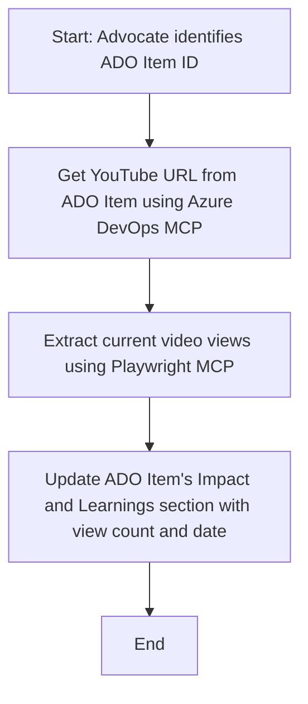

<!--
CO_OP_TRANSLATOR_METADATA:
{
  "original_hash": "14a2dfbea55ef735660a06bd6bdfe5f3",
  "translation_date": "2025-07-14T06:10:38+00:00",
  "source_file": "09-CaseStudy/UpdateADOItemsFromYT.md",
  "language_code": "bn"
}
-->
# কেস স্টাডি: MCP দিয়ে YouTube ডেটা থেকে Azure DevOps আইটেম আপডেট করা

> **দ্রষ্টব্য:** ইতিমধ্যেই অনলাইনে এমন টুল এবং রিপোর্ট রয়েছে যা YouTube-এর মতো প্ল্যাটফর্ম থেকে ডেটা নিয়ে Azure DevOps আইটেম আপডেট করার কাজ স্বয়ংক্রিয় করতে পারে। নিচের পরিস্থিতিটি শুধুমাত্র একটি নমুনা ব্যবহার কেস হিসেবে দেওয়া হয়েছে, যা দেখায় কিভাবে MCP টুলগুলো অটোমেশন এবং ইন্টিগ্রেশন কাজের জন্য প্রয়োগ করা যেতে পারে।

## ওভারভিউ

এই কেস স্টাডিতে দেখানো হয়েছে কিভাবে Model Context Protocol (MCP) এবং এর টুলগুলো ব্যবহার করে Azure DevOps (ADO) ওয়ার্ক আইটেমগুলোকে অনলাইন প্ল্যাটফর্ম যেমন YouTube থেকে প্রাপ্ত তথ্য দিয়ে স্বয়ংক্রিয়ভাবে আপডেট করা যায়। বর্ণিত পরিস্থিতিটি এই টুলগুলোর বিস্তৃত ক্ষমতার একটি উদাহরণ মাত্র, যা অনেক ধরনের অনুরূপ অটোমেশন প্রয়োজনের জন্য মানিয়ে নেওয়া যেতে পারে।

এই উদাহরণে, একজন Advocate ADO আইটেম ব্যবহার করে অনলাইন সেশনগুলো ট্র্যাক করেন, যেখানে প্রতিটি আইটেমে একটি YouTube ভিডিও URL থাকে। MCP টুলগুলো ব্যবহার করে Advocate সহজেই ADO আইটেমগুলো সর্বশেষ ভিডিও মেট্রিক্স যেমন ভিউ কাউন্ট দিয়ে আপডেট রাখতে পারেন, যা পুনরাবৃত্তিমূলক এবং স্বয়ংক্রিয়। এই পদ্ধতিটি অন্যান্য ক্ষেত্রে যেখানে অনলাইন উৎস থেকে তথ্য ADO বা অন্যান্য সিস্টেমে ইন্টিগ্রেট করতে হয়, সেগুলোর জন্যও প্রযোজ্য।

## পরিস্থিতি

একজন Advocate অনলাইন সেশন এবং কমিউনিটি এনগেজমেন্টের প্রভাব ট্র্যাক করার দায়িত্বে আছেন। প্রতিটি সেশন 'DevRel' প্রজেক্টের ADO ওয়ার্ক আইটেম হিসেবে লগ করা হয়, এবং ওয়ার্ক আইটেমে YouTube ভিডিও URL-এর জন্য একটি ফিল্ড থাকে। সেশনের পৌঁছন সঠিকভাবে রিপোর্ট করার জন্য Advocate-কে ভিডিও ভিউয়ের বর্তমান সংখ্যা এবং তথ্য সংগ্রহের তারিখ সহ ADO আইটেম আপডেট করতে হয়।

## ব্যবহৃত টুলসমূহ

- [Azure DevOps MCP](https://github.com/microsoft/azure-devops-mcp): MCP এর মাধ্যমে ADO ওয়ার্ক আইটেমে প্রোগ্রাম্যাটিক অ্যাক্সেস এবং আপডেট সক্ষম করে।
- [Playwright MCP](https://github.com/microsoft/playwright-mcp): ব্রাউজার অটোমেশন করে ওয়েব পেজ থেকে যেমন YouTube ভিডিও স্ট্যাটিস্টিক্স লাইভ ডেটা সংগ্রহ করে।

## ধাপে ধাপে ওয়ার্কফ্লো

1. **ADO আইটেম সনাক্তকরণ**: 'DevRel' প্রজেক্টের ADO ওয়ার্ক আইটেম আইডি (যেমন 1234) দিয়ে শুরু করুন।
2. **YouTube URL সংগ্রহ**: Azure DevOps MCP টুল ব্যবহার করে ওয়ার্ক আইটেম থেকে YouTube URL নিন।
3. **ভিডিও ভিউ সংগ্রহ**: Playwright MCP টুল ব্যবহার করে YouTube URL এ যান এবং বর্তমান ভিউ কাউন্ট সংগ্রহ করুন।
4. **ADO আইটেম আপডেট**: Azure DevOps MCP টুল দিয়ে 'Impact and Learnings' সেকশনে সর্বশেষ ভিউ কাউন্ট এবং তথ্য সংগ্রহের তারিখ লিখুন।

## উদাহরণ প্রম্পট

```bash
- Work with the ADO Item ID: 1234
- The project is '2025-Awesome'
- Get the YouTube URL for the ADO item
- Use Playwright to get the current views from the YouTube video
- Update the ADO item with the current video views and the updated date of the information
```

## Mermaid ফ্লোচার্ট



## প্রযুক্তিগত বাস্তবায়ন

- **MCP অর্কেস্ট্রেশন**: MCP সার্ভার ওয়ার্কফ্লো পরিচালনা করে, যা Azure DevOps MCP এবং Playwright MCP টুল দুটোর ব্যবহারে সমন্বয় সাধন করে।
- **অটোমেশন**: প্রক্রিয়াটি ম্যানুয়ালি চালানো যেতে পারে অথবা নিয়মিত সময় অন্তর স্বয়ংক্রিয়ভাবে চালানোর জন্য নির্ধারণ করা যেতে পারে যাতে ADO আইটেম আপডেট থাকে।
- **বিস্তারণযোগ্যতা**: একই প্যাটার্ন ব্যবহার করে ADO আইটেম অন্যান্য অনলাইন মেট্রিক্স (যেমন লাইক, কমেন্ট) বা অন্যান্য প্ল্যাটফর্ম থেকে আপডেট করা যেতে পারে।

## ফলাফল এবং প্রভাব

- **দক্ষতা**: Advocate-দের জন্য ভিডিও মেট্রিক্স সংগ্রহ এবং আপডেটের ম্যানুয়াল কাজ কমিয়ে দেয়।
- **সঠিকতা**: নিশ্চিত করে যে ADO আইটেমগুলো সর্বশেষ অনলাইন ডেটা প্রতিফলিত করে।
- **পুনরাবৃত্তিযোগ্যতা**: অনুরূপ পরিস্থিতিতে অন্যান্য ডেটা উৎস বা মেট্রিক্সের জন্য পুনরায় ব্যবহারযোগ্য ওয়ার্কফ্লো প্রদান করে।

## রেফারেন্সসমূহ

- [Azure DevOps MCP](https://github.com/microsoft/azure-devops-mcp)
- [Playwright MCP](https://github.com/microsoft/playwright-mcp)
- [Model Context Protocol (MCP)](https://modelcontextprotocol.io/)

**অস্বীকৃতি**:  
এই নথিটি AI অনুবাদ সেবা [Co-op Translator](https://github.com/Azure/co-op-translator) ব্যবহার করে অনূদিত হয়েছে। আমরা যথাসাধ্য সঠিকতার চেষ্টা করি, তবে স্বয়ংক্রিয় অনুবাদে ত্রুটি বা অসঙ্গতি থাকতে পারে। মূল নথিটি তার নিজস্ব ভাষায়ই কর্তৃত্বপূর্ণ উৎস হিসেবে বিবেচিত হওয়া উচিত। গুরুত্বপূর্ণ তথ্যের জন্য পেশাদার মানব অনুবাদ গ্রহণ করার পরামর্শ দেওয়া হয়। এই অনুবাদের ব্যবহারে সৃষ্ট কোনো ভুল বোঝাবুঝি বা ভুল ব্যাখ্যার জন্য আমরা দায়ী নই।