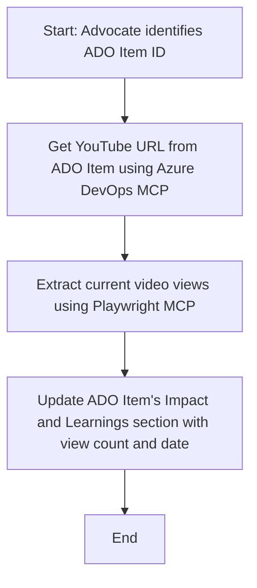

<!--
CO_OP_TRANSLATOR_METADATA:
{
  "original_hash": "14a2dfbea55ef735660a06bd6bdfe5f3",
  "translation_date": "2025-06-13T21:33:12+00:00",
  "source_file": "09-CaseStudy/UpdateADOItemsFromYT.md",
  "language_code": "bn"
}
-->
# কেস স্টাডি: MCP দিয়ে YouTube ডেটা থেকে Azure DevOps আইটেম আপডেট করা

> **দ্রষ্টব্য:** YouTube-এর মতো প্ল্যাটফর্ম থেকে ডেটা নিয়ে Azure DevOps আইটেম আপডেট করার কাজ স্বয়ংক্রিয় করার জন্য অনলাইনে বিভিন্ন টুল ও রিপোর্ট রয়েছে। নিচের পরিস্থিতি শুধুমাত্র একটি উদাহরণ হিসেবে দেওয়া হয়েছে যাতে MCP টুলগুলো কীভাবে অটোমেশন ও ইন্টিগ্রেশন কাজে ব্যবহার করা যায় তা বোঝানো যায়।

## ওভারভিউ

এই কেস স্টাডিতে দেখানো হয়েছে কীভাবে Model Context Protocol (MCP) এবং এর টুলগুলো ব্যবহার করে Azure DevOps (ADO) ওয়ার্ক আইটেমগুলোকে অনলাইন প্ল্যাটফর্ম যেমন YouTube থেকে প্রাপ্ত তথ্য দিয়ে স্বয়ংক্রিয়ভাবে আপডেট করা যায়। বর্ণিত পরিস্থিতিটি এই টুলগুলোর বিস্তৃত ক্ষমতার একটি উদাহরণ মাত্র, যা অনেক অনুরূপ অটোমেশন প্রয়োজনের জন্য মানিয়ে নেওয়া যেতে পারে।

এই উদাহরণে, একজন Advocate ADO আইটেম ব্যবহার করে অনলাইন সেশন ট্র্যাক করেন, যেখানে প্রতিটি আইটেমে একটি YouTube ভিডিও URL থাকে। MCP টুলগুলো ব্যবহার করে Advocate আপডেটেড ভিডিও মেট্রিক্স যেমন ভিউ কাউন্ট নিয়মিত ও স্বয়ংক্রিয়ভাবে ADO আইটেমে রাখার সুযোগ পান। এই পদ্ধতিটি অন্যান্য ক্ষেত্রে যেখানে অনলাইন সোর্স থেকে তথ্য ADO বা অন্য সিস্টেমে সংযুক্ত করতে হয় সেগুলোর জন্যও প্রযোজ্য।

## পরিস্থিতি

একজন Advocate অনলাইন সেশন এবং কমিউনিটি এনগেজমেন্টের প্রভাব ট্র্যাক করার দায়িত্বে আছেন। প্রতিটি সেশন 'DevRel' প্রজেক্টের ADO ওয়ার্ক আইটেম হিসেবে লগ হয়, যেখানে YouTube ভিডিও URL-এর জন্য একটি ফিল্ড থাকে। সেশনের রিচ সঠিকভাবে রিপোর্ট করার জন্য Advocate-কে বর্তমান ভিডিও ভিউ সংখ্যা এবং তথ্য সংগ্রহের তারিখ সহ ADO আইটেম আপডেট করতে হয়।

## ব্যবহৃত টুলসমূহ

- [Azure DevOps MCP](https://github.com/microsoft/azure-devops-mcp): MCP ব্যবহার করে ADO ওয়ার্ক আইটেমে প্রোগ্রাম্যাটিক অ্যাক্সেস ও আপডেট করার সুবিধা দেয়।
- [Playwright MCP](https://github.com/microsoft/playwright-mcp): ব্রাউজার অটোমেশন করে ওয়েবপেজ থেকে যেমন YouTube ভিডিও স্ট্যাটিস্টিক্স লাইভ ডেটা বের করে আনে।

## ধাপে ধাপে ওয়ার্কফ্লো

1. **ADO আইটেম শনাক্ত করুন**: 'DevRel' প্রজেক্টের ADO ওয়ার্ক আইটেম আইডি (যেমন, 1234) দিয়ে শুরু করুন।
2. **YouTube URL সংগ্রহ করুন**: Azure DevOps MCP টুল দিয়ে ওয়ার্ক আইটেম থেকে YouTube URL নিন।
3. **ভিডিও ভিউ বের করুন**: Playwright MCP টুল ব্যবহার করে YouTube URL-এ যান এবং বর্তমান ভিউ কাউন্ট সংগ্রহ করুন।
4. **ADO আইটেম আপডেট করুন**: Azure DevOps MCP টুল দিয়ে 'Impact and Learnings' সেকশনে সর্বশেষ ভিউ কাউন্ট ও তথ্য সংগ্রহের তারিখ লিখুন।

## উদাহরণ প্রম্পট

```bash
- Work with the ADO Item ID: 1234
- The project is '2025-Awesome'
- Get the YouTube URL for the ADO item
- Use Playwright to get the current views from the YouTube video
- Update the ADO item with the current video views and the updated date of the information
```

## Mermaid ফ্লোচার্ট



## টেকনিক্যাল ইমপ্লিমেন্টেশন

- **MCP অর্কেস্ট্রেশন**: MCP সার্ভার ওয়ার্কফ্লো পরিচালনা করে, যা Azure DevOps MCP ও Playwright MCP টুল দুটোকে সমন্বয় করে।
- **অটোমেশন**: এই প্রক্রিয়াটি ম্যানুয়ালি শুরু করা যায় অথবা নিয়মিত সময় অন্তর চালানোর জন্য নির্ধারিত হতে পারে যাতে ADO আইটেম আপডেট থাকে।
- **বিস্তৃতযোগ্যতা**: একই প্যাটার্ন ব্যবহার করে ADO আইটেম অন্য অনলাইন মেট্রিক্স (যেমন, লাইক, কমেন্ট) বা অন্য প্ল্যাটফর্ম থেকেও আপডেট করা যেতে পারে।

## ফলাফল ও প্রভাব

- **কার্যক্ষমতা**: Advocateদের জন্য ভিডিও মেট্রিক্স সংগ্রহ ও আপডেটের ম্যানুয়াল কাজ কমিয়ে দেয়।
- **সঠিকতা**: ADO আইটেমগুলো সর্বশেষ অনলাইন ডেটা প্রতিফলিত করে।
- **পুনরাবৃত্তিযোগ্যতা**: অন্যান্য ডেটা সোর্স বা মেট্রিক্সের জন্য একই ওয়ার্কফ্লো পুনরায় ব্যবহারযোগ্য।

## রেফারেন্সসমূহ

- [Azure DevOps MCP](https://github.com/microsoft/azure-devops-mcp)
- [Playwright MCP](https://github.com/microsoft/playwright-mcp)
- [Model Context Protocol (MCP)](https://modelcontextprotocol.io/)

**দ্রষ্টব্য**:  
এই নথিটি AI অনুবাদ সেবা [Co-op Translator](https://github.com/Azure/co-op-translator) ব্যবহার করে অনূদিত হয়েছে। আমরা যথাসাধ্য সঠিকতার চেষ্টা করি, তবে স্বয়ংক্রিয় অনুবাদে ত্রুটি বা ভুল থাকতে পারে। মূল নথিটি তার নিজস্ব ভাষায় প্রামাণিক উৎস হিসেবে বিবেচনা করা উচিত। গুরুত্বপূর্ণ তথ্যের জন্য পেশাদার মানব অনুবাদ গ্রহণ করা উত্তম। এই অনুবাদের ব্যবহারে সৃষ্ট কোনো ভুল বোঝাবুঝি বা ভুল ব্যাখ্যার জন্য আমরা দায়বদ্ধ নই।