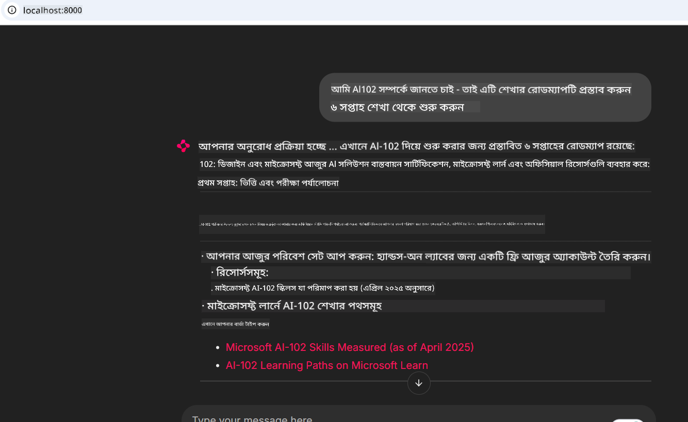
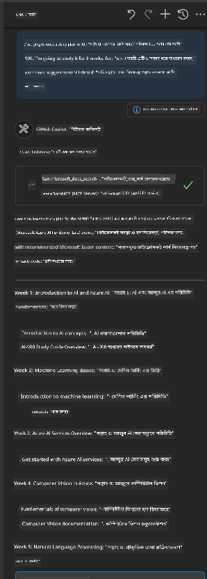

<!--
CO_OP_TRANSLATOR_METADATA:
{
  "original_hash": "4319d291c9d124ecafea52b3d04bfa0e",
  "translation_date": "2025-07-14T06:20:59+00:00",
  "source_file": "09-CaseStudy/docs-mcp/README.md",
  "language_code": "bn"
}
-->
# Case Study: ক্লায়েন্ট থেকে Microsoft Learn Docs MCP সার্ভারে সংযোগ স্থাপন

আপনি কি কখনও কোডের সমস্যার সমাধান করতে গিয়ে ডকুমেন্টেশন সাইট, Stack Overflow, এবং অসংখ্য সার্চ ইঞ্জিন ট্যাবের মধ্যে ঝাঁপিয়ে পড়েছেন? হয়তো আপনার কাছে ডকুমেন্টেশনের জন্য আলাদা একটি মনিটর আছে, অথবা আপনি বারবার IDE এবং ব্রাউজারের মধ্যে alt-tab করছেন। কেমন হয় যদি ডকুমেন্টেশন সরাসরি আপনার ওয়ার্কফ্লোতে নিয়ে আসা যেত—আপনার অ্যাপ, IDE, বা এমনকি আপনার নিজস্ব কাস্টম টুলে ইন্টিগ্রেটেড? এই কেস স্টাডিতে, আমরা দেখাবো কিভাবে আপনার নিজস্ব ক্লায়েন্ট অ্যাপ্লিকেশন থেকে সরাসরি Microsoft Learn Docs MCP সার্ভারের সাথে সংযোগ স্থাপন করা যায়।

## ওভারভিউ

আধুনিক ডেভেলপমেন্ট শুধু কোড লেখা নয়—এটি সঠিক সময়ে সঠিক তথ্য পাওয়ার ব্যাপার। ডকুমেন্টেশন সর্বত্র আছে, কিন্তু প্রায়ই যেখানে সবচেয়ে বেশি দরকার সেখানে থাকে না: আপনার টুল এবং ওয়ার্কফ্লোর মধ্যে। ডকুমেন্টেশন রিট্রিভাল সরাসরি আপনার অ্যাপ্লিকেশনে ইন্টিগ্রেট করে আপনি সময় বাঁচাতে পারেন, প্রসঙ্গ পরিবর্তনের ঝামেলা কমাতে পারেন, এবং উৎপাদনশীলতা বাড়াতে পারেন। এই অংশে, আমরা দেখাবো কিভাবে একটি ক্লায়েন্টকে Microsoft Learn Docs MCP সার্ভারের সাথে সংযোগ করতে হয়, যাতে আপনি আপনার অ্যাপ ছাড়াই রিয়েল-টাইম, প্রসঙ্গ-সচেতন ডকুমেন্টেশন অ্যাক্সেস করতে পারেন।

আমরা সংযোগ স্থাপন, রিকোয়েস্ট পাঠানো, এবং স্ট্রিমিং রেসপন্স দক্ষতার সাথে হ্যান্ডেল করার প্রক্রিয়া ধাপে ধাপে দেখাবো। এই পদ্ধতি আপনার ওয়ার্কফ্লোকে আরও সহজ করে তোলে এবং স্মার্ট, সহায়ক ডেভেলপার টুল তৈরির পথ খুলে দেয়।

## শেখার উদ্দেশ্য

আমরা কেন এটা করছি? কারণ সেরা ডেভেলপার অভিজ্ঞতা হলো যেগুলো ঘর্ষণ দূর করে। কল্পনা করুন এমন একটি বিশ্ব যেখানে আপনার কোড এডিটর, চ্যাটবট, বা ওয়েব অ্যাপ আপনার ডকুমেন্টেশন প্রশ্নের উত্তর তৎক্ষণাৎ দিতে পারে, Microsoft Learn এর সর্বশেষ কন্টেন্ট ব্যবহার করে। এই অধ্যায়ের শেষে আপনি জানতে পারবেন:

- ডকুমেন্টেশনের জন্য MCP সার্ভার-ক্লায়েন্ট যোগাযোগের মৌলিক বিষয়গুলো
- Microsoft Learn Docs MCP সার্ভারের সাথে সংযোগ করার জন্য কনসোল বা ওয়েব অ্যাপ্লিকেশন তৈরি করা
- রিয়েল-টাইম ডকুমেন্টেশন রিট্রিভালের জন্য স্ট্রিমিং HTTP ক্লায়েন্ট ব্যবহার করা
- আপনার অ্যাপ্লিকেশনে ডকুমেন্টেশন রেসপন্স লগ এবং বিশ্লেষণ করা

আপনি দেখবেন কিভাবে এই দক্ষতাগুলো আপনাকে এমন টুল তৈরি করতে সাহায্য করবে যা শুধু প্রতিক্রিয়াশীল নয়, সত্যিই ইন্টারেক্টিভ এবং প্রসঙ্গ-সচেতন।

## Scenario 1 - MCP দিয়ে রিয়েল-টাইম ডকুমেন্টেশন রিট্রিভাল

এই সিনারিওতে, আমরা দেখাবো কিভাবে একটি ক্লায়েন্টকে Microsoft Learn Docs MCP সার্ভারের সাথে সংযোগ করতে হয়, যাতে আপনি আপনার অ্যাপ ছাড়াই রিয়েল-টাইম, প্রসঙ্গ-সচেতন ডকুমেন্টেশন অ্যাক্সেস করতে পারেন।

চলুন এটি প্র্যাকটিসে নিয়ে আসি। আপনার কাজ হলো এমন একটি অ্যাপ লিখা যা Microsoft Learn Docs MCP সার্ভারের সাথে সংযোগ স্থাপন করবে, `microsoft_docs_search` টুল কল করবে, এবং স্ট্রিমিং রেসপন্স কনসোলে লগ করবে।

### কেন এই পদ্ধতি?
কারণ এটি আরও উন্নত ইন্টিগ্রেশনের ভিত্তি—আপনি যদি একটি চ্যাটবট, IDE এক্সটেনশন, বা ওয়েব ড্যাশবোর্ড চালাতে চান।

এই সিনারিওর কোড এবং নির্দেশনা আপনি এই কেস স্টাডির [`solution`](./solution/README.md) ফোল্ডারে পাবেন। ধাপগুলো আপনাকে সংযোগ সেটআপ করতে সাহায্য করবে:
- সংযোগের জন্য অফিসিয়াল MCP SDK এবং স্ট্রিমেবল HTTP ক্লায়েন্ট ব্যবহার করুন
- ডকুমেন্টেশন রিট্রিভ করার জন্য `microsoft_docs_search` টুলকে একটি কোয়েরি প্যারামিটার সহ কল করুন
- সঠিক লগিং এবং এরর হ্যান্ডলিং বাস্তবায়ন করুন
- ব্যবহারকারীদের একাধিক সার্চ কোয়েরি দেওয়ার জন্য একটি ইন্টারেক্টিভ কনসোল ইন্টারফেস তৈরি করুন

এই সিনারিও দেখায় কিভাবে:
- Docs MCP সার্ভারের সাথে সংযোগ স্থাপন করবেন
- একটি কোয়েরি পাঠাবেন
- ফলাফল পার্স এবং প্রিন্ট করবেন

এখানে সমাধান চালানোর একটি উদাহরণ দেওয়া হলো:

```
Prompt> What is Azure Key Vault?
Answer> Azure Key Vault is a cloud service for securely storing and accessing secrets. ...
```

নিচে একটি ন্যূনতম নমুনা সমাধান দেওয়া হলো। সম্পূর্ণ কোড এবং বিস্তারিত সমাধান ফোল্ডারে পাওয়া যাবে।

<details>
<summary>Python</summary>

```python
import asyncio
from mcp.client.streamable_http import streamablehttp_client
from mcp import ClientSession

async def main():
    async with streamablehttp_client("https://learn.microsoft.com/api/mcp") as (read_stream, write_stream, _):
        async with ClientSession(read_stream, write_stream) as session:
            await session.initialize()
            result = await session.call_tool("microsoft_docs_search", {"query": "Azure Functions best practices"})
            print(result.content)

if __name__ == "__main__":
    asyncio.run(main())
```

- সম্পূর্ণ বাস্তবায়ন এবং লগিং এর জন্য দেখুন [`scenario1.py`](../../../../09-CaseStudy/docs-mcp/solution/python/scenario1.py)।
- ইনস্টলেশন এবং ব্যবহারের নির্দেশনার জন্য দেখুন একই ফোল্ডারের [`README.md`](./solution/python/README.md) ফাইল।
</details>

## Scenario 2 - MCP দিয়ে ইন্টারেক্টিভ স্টাডি প্ল্যান জেনারেটর ওয়েব অ্যাপ

এই সিনারিওতে, আপনি শিখবেন কিভাবে Docs MCP কে একটি ওয়েব ডেভেলপমেন্ট প্রকল্পে ইন্টিগ্রেট করতে হয়। লক্ষ্য হলো ব্যবহারকারীদের Microsoft Learn ডকুমেন্টেশন সরাসরি একটি ওয়েব ইন্টারফেস থেকে সার্চ করার সুযোগ দেওয়া, যাতে ডকুমেন্টেশন আপনার অ্যাপ বা সাইটের মধ্যে তৎক্ষণাৎ অ্যাক্সেসযোগ্য হয়।

আপনি দেখবেন কিভাবে:
- একটি ওয়েব অ্যাপ সেটআপ করবেন
- Docs MCP সার্ভারের সাথে সংযোগ করবেন
- ব্যবহারকারীর ইনপুট হ্যান্ডেল করবেন এবং ফলাফল প্রদর্শন করবেন

এখানে সমাধান চালানোর একটি উদাহরণ:

```
User> I want to learn about AI102 - so suggest the roadmap to get it started from learn for 6 weeks

Assistant> Here’s a detailed 6-week roadmap to start your preparation for the AI-102: Designing and Implementing a Microsoft Azure AI Solution certification, using official Microsoft resources and focusing on exam skills areas:

---
## Week 1: Introduction & Fundamentals
- **Understand the Exam**: Review the [AI-102 exam skills outline](https://learn.microsoft.com/en-us/credentials/certifications/exams/ai-102/).
- **Set up Azure**: Sign up for a free Azure account if you don't have one.
- **Learning Path**: [Introduction to Azure AI services](https://learn.microsoft.com/en-us/training/modules/intro-to-azure-ai/)
- **Focus**: Get familiar with Azure portal, AI capabilities, and necessary tools.

....more weeks of the roadmap...

Let me know if you want module-specific recommendations or need more customized weekly tasks!
```

নিচে একটি ন্যূনতম নমুনা সমাধান দেওয়া হলো। সম্পূর্ণ কোড এবং বিস্তারিত সমাধান ফোল্ডারে পাওয়া যাবে।



<details>
<summary>Python (Chainlit)</summary>

Chainlit হলো কথোপকথনমূলক AI ওয়েব অ্যাপ তৈরির একটি ফ্রেমওয়ার্ক। এটি ইন্টারেক্টিভ চ্যাটবট এবং অ্যাসিস্ট্যান্ট তৈরি করা সহজ করে, যা MCP টুল কল করতে পারে এবং রিয়েল টাইমে ফলাফল প্রদর্শন করে। দ্রুত প্রোটোটাইপিং এবং ব্যবহারকারী-বান্ধব ইন্টারফেসের জন্য এটি আদর্শ।

```python
import chainlit as cl
import requests

MCP_URL = "https://learn.microsoft.com/api/mcp"

@cl.on_message
def handle_message(message):
    query = {"question": message}
    response = requests.post(MCP_URL, json=query)
    if response.ok:
        result = response.json()
        cl.Message(content=result.get("answer", "No answer found.")).send()
    else:
        cl.Message(content="Error: " + response.text).send()
```

- সম্পূর্ণ বাস্তবায়নের জন্য দেখুন [`scenario2.py`](../../../../09-CaseStudy/docs-mcp/solution/python/scenario2.py)।
- সেটআপ এবং চালানোর নির্দেশনার জন্য দেখুন [`README.md`](./solution/python/README.md)।
</details>

## Scenario 3: VS Code-এ MCP সার্ভার দিয়ে ইন-এডিটর ডকস

আপনি যদি ব্রাউজার ট্যাব পরিবর্তন না করে সরাসরি VS Code-এ Microsoft Learn Docs পেতে চান, তাহলে আপনার এডিটরে MCP সার্ভার ব্যবহার করতে পারেন। এটি আপনাকে:
- VS Code-এ কোডিং পরিবেশ ছাড়াই ডকস সার্চ এবং পড়ার সুযোগ দেয়।
- ডকুমেন্টেশন রেফারেন্স এবং লিঙ্ক সরাসরি README বা কোর্স ফাইলে ইনসার্ট করতে দেয়।
- GitHub Copilot এবং MCP একসাথে ব্যবহার করে একটি নির্বিঘ্ন, AI-চালিত ডকুমেন্টেশন ওয়ার্কফ্লো তৈরি করতে সাহায্য করে।

**আপনি শিখবেন কিভাবে:**
- আপনার ওয়ার্কস্পেস রুটে একটি বৈধ `.vscode/mcp.json` ফাইল যোগ করবেন (নিচে উদাহরণ দেখুন)।
- MCP প্যানেল খুলবেন অথবা VS Code এর কমান্ড প্যালেট ব্যবহার করে ডকস সার্চ এবং ইনসার্ট করবেন।
- কাজ করার সময় আপনার মার্কডাউন ফাইলে সরাসরি ডকুমেন্টেশন রেফারেন্স করবেন।
- এই ওয়ার্কফ্লো GitHub Copilot এর সাথে মিলিয়ে আরও বেশি উৎপাদনশীলতা অর্জন করবেন।

এখানে VS Code-এ MCP সার্ভার সেটআপের একটি উদাহরণ:

```json
{
  "servers": {
    "LearnDocsMCP": {
      "url": "https://learn.microsoft.com/api/mcp"
    }
  }
}
```

</details>

> বিস্তারিত স্ক্রিনশট এবং ধাপে ধাপে গাইডের জন্য দেখুন [`README.md`](./solution/scenario3/README.md)।



এই পদ্ধতি কারো জন্যই আদর্শ যারা টেকনিক্যাল কোর্স তৈরি করছেন, ডকুমেন্টেশন লিখছেন, অথবা ঘন ঘন রেফারেন্সের প্রয়োজনীয়তা সহ কোড ডেভেলপ করছেন।

## মূল বিষয়সমূহ

ডকুমেন্টেশন সরাসরি আপনার টুলে ইন্টিগ্রেট করা শুধু সুবিধাজনক নয়—এটি উৎপাদনশীলতার জন্য একটি বড় পরিবর্তন। Microsoft Learn Docs MCP সার্ভারের সাথে আপনার ক্লায়েন্ট থেকে সংযোগ করে আপনি:

- আপনার কোড এবং ডকুমেন্টেশনের মধ্যে প্রসঙ্গ পরিবর্তন দূর করতে পারবেন
- আপ-টু-ডেট, প্রসঙ্গ-সচেতন ডকস রিয়েল টাইমে পেতে পারবেন
- আরও স্মার্ট, ইন্টারেক্টিভ ডেভেলপার টুল তৈরি করতে পারবেন

এই দক্ষতাগুলো আপনাকে এমন সমাধান তৈরি করতে সাহায্য করবে যা শুধু কার্যকর নয়, ব্যবহারেও আনন্দদায়ক।

## অতিরিক্ত রিসোর্স

আপনার বোঝাপড়া গভীর করতে, এই অফিসিয়াল রিসোর্সগুলো অন্বেষণ করুন:

- [Microsoft Learn Docs MCP Server (GitHub)](https://github.com/MicrosoftDocs/mcp)
- [Get started with Azure MCP Server (mcp-python)](https://learn.microsoft.com/en-us/azure/developer/azure-mcp-server/get-started#create-the-python-app)
- [What is the Azure MCP Server?](https://learn.microsoft.com/en-us/azure/developer/azure-mcp-server/)
- [Model Context Protocol (MCP) Introduction](https://modelcontextprotocol.io/introduction)
- [Add plugins from a MCP Server (Python)](https://learn.microsoft.com/en-us/semantic-kernel/concepts/plugins/adding-mcp-plugins)

**অস্বীকৃতি**:  
এই নথিটি AI অনুবাদ সেবা [Co-op Translator](https://github.com/Azure/co-op-translator) ব্যবহার করে অনূদিত হয়েছে। আমরা যথাসাধ্য সঠিকতার চেষ্টা করি, তবে স্বয়ংক্রিয় অনুবাদে ত্রুটি বা অসঙ্গতি থাকতে পারে। মূল নথিটি তার নিজস্ব ভাষায়ই কর্তৃত্বপূর্ণ উৎস হিসেবে বিবেচিত হওয়া উচিত। গুরুত্বপূর্ণ তথ্যের জন্য পেশাদার মানব অনুবাদ গ্রহণ করার পরামর্শ দেওয়া হয়। এই অনুবাদের ব্যবহারে সৃষ্ট কোনো ভুল বোঝাবুঝি বা ভুল ব্যাখ্যার জন্য আমরা দায়ী নই।