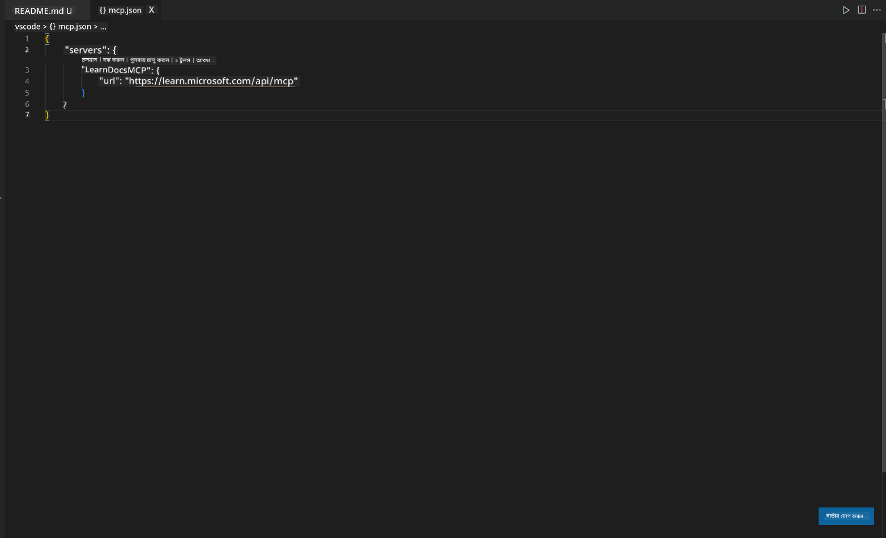
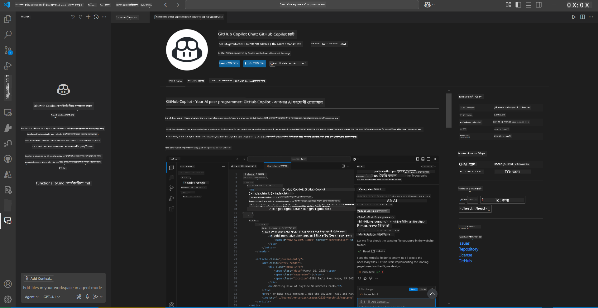
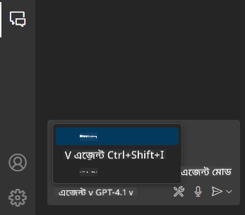
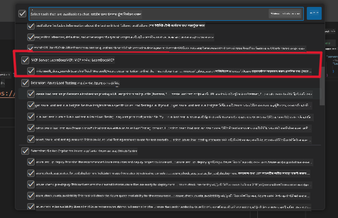
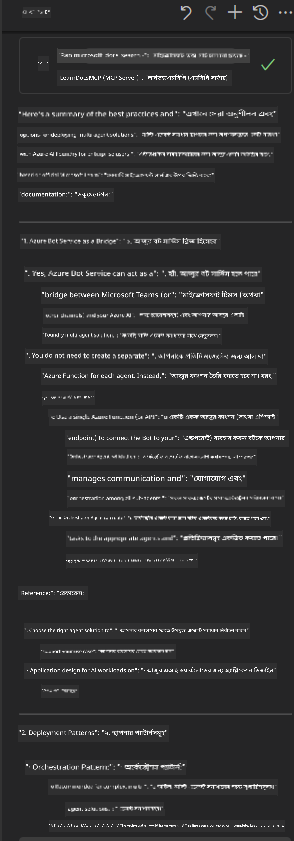

<!--
CO_OP_TRANSLATOR_METADATA:
{
  "original_hash": "db532b1ec386c9ce38c791653dc3c881",
  "translation_date": "2025-06-21T14:37:21+00:00",
  "source_file": "09-CaseStudy/docs-mcp/solution/scenario3/README.md",
  "language_code": "bn"
}
-->
# Scenario 3: VS Code-এ MCP সার্ভার সহ ইন-এডিটর ডকস

## ওভারভিউ

এই সিনারিওতে, আপনি শিখবেন কীভাবে MCP সার্ভার ব্যবহার করে Microsoft Learn Docs সরাসরি আপনার Visual Studio Code পরিবেশে নিয়ে আসা যায়। ব্রাউজারের ট্যাব বারবার পরিবর্তন না করে, আপনি আপনার এডিটরের ভিতর থেকেই অফিসিয়াল ডকুমেন্টেশন অ্যাক্সেস, সার্চ এবং রেফারেন্স করতে পারবেন। এই পদ্ধতি আপনার কাজের ধারা সহজ করে, মনোযোগ ধরে রাখে এবং GitHub Copilot-এর মতো টুলের সাথে নির্বিঘ্ন ইন্টিগ্রেশন নিশ্চিত করে।

- VS Code-এর ভিতরেই ডকস সার্চ ও পড়ুন, আপনার কোডিং পরিবেশ ছাড়াই।
- ডকুমেন্টেশন রেফারেন্স করুন এবং সরাসরি README বা কোর্স ফাইলে লিঙ্ক যোগ করুন।
- GitHub Copilot এবং MCP একসাথে ব্যবহার করে একটি নির্বিঘ্ন, AI-চালিত ডকুমেন্টেশন ওয়ার্কফ্লো তৈরি করুন।

## শেখার লক্ষ্যসমূহ

এই অধ্যায়ের শেষে, আপনি বুঝতে পারবেন কীভাবে VS Code-এ MCP সার্ভার সেটআপ ও ব্যবহার করতে হয় যাতে আপনার ডকুমেন্টেশন এবং ডেভেলপমেন্ট ওয়ার্কফ্লো উন্নত হয়। আপনি সক্ষম হবেন:

- MCP সার্ভার ব্যবহার করে ডকুমেন্টেশন অনুসন্ধানের জন্য আপনার ওয়ার্কস্পেস কনফিগার করতে।
- VS Code-এর ভিতর থেকেই ডকুমেন্টেশন সার্চ ও ইনসার্ট করতে।
- GitHub Copilot এবং MCP-এর শক্তি একত্রিত করে আরও উৎপাদনশীল, AI-সহায়ক ওয়ার্কফ্লো গড়ে তুলতে।

এই দক্ষতাগুলো আপনাকে মনোযোগ ধরে রাখতে, ডকুমেন্টেশনের গুণগত মান বাড়াতে এবং একজন ডেভেলপার বা টেকনিক্যাল রাইটার হিসেবে আপনার উৎপাদনশীলতা বাড়াতে সাহায্য করবে।

## সমাধান

ইন-এডিটর ডকুমেন্টেশন অ্যাক্সেস পেতে, আপনি MCP সার্ভারকে VS Code এবং GitHub Copilot-এর সাথে ইন্টিগ্রেট করার একটি ধাপে ধাপে প্রক্রিয়া অনুসরণ করবেন। এই সমাধানটি কোর্স লেখক, ডকুমেন্টেশন রাইটার এবং ডেভেলপারদের জন্য উপযুক্ত যারা এডিটরে থেকে ডকস এবং Copilot-এর সাথে কাজ করার সময় মনোযোগ বজায় রাখতে চান।

- কোর্স বা প্রজেক্ট ডকুমেন্টেশন লেখার সময় README-তে দ্রুত রেফারেন্স লিঙ্ক যোগ করুন।
- কোড জেনারেট করতে Copilot ব্যবহার করুন এবং MCP দিয়ে প্রাসঙ্গিক ডকস দ্রুত খুঁজে উদ্ধৃত করুন।
- এডিটরে মনোযোগ ধরে রাখুন এবং উৎপাদনশীলতা বাড়ান।

### ধাপে ধাপে গাইড

শুরু করতে, নিচের ধাপগুলো অনুসরণ করুন। প্রতিটি ধাপের জন্য, আপনি ভিজ্যুয়াল প্রদর্শনের জন্য assets ফোল্ডার থেকে একটি স্ক্রিনশট যোগ করতে পারেন।

1. **MCP কনফিগারেশন যোগ করুন:**
   আপনার প্রজেক্ট রুটে একটি `.vscode/mcp.json` ফাইল তৈরি করুন এবং নিচের কনফিগারেশন যোগ করুন:
   ```json
   {
     "servers": {
       "LearnDocsMCP": {
         "url": "https://learn.microsoft.com/api/mcp"
       }
     }
   }
   ```
   এই কনফিগারেশনটি VS Code-কে বলে কীভাবে [`Microsoft Learn Docs MCP server`](https://github.com/MicrosoftDocs/mcp)-এর সাথে সংযোগ স্থাপন করতে হবে।
   
   
    
2. **GitHub Copilot Chat প্যানেল খুলুন:**
   যদি আপনার কাছে GitHub Copilot এক্সটেনশন ইনস্টল না থাকে, তাহলে VS Code-এর Extensions ভিউ থেকে এটি ইনস্টল করুন। আপনি সরাসরি [Visual Studio Code Marketplace](https://marketplace.visualstudio.com/items?itemName=GitHub.copilot-chat) থেকে ডাউনলোড করতে পারেন। এরপর, সাইডবার থেকে Copilot Chat প্যানেল খুলুন।

   

3. **এজেন্ট মোড সক্রিয় করুন এবং টুলস যাচাই করুন:**
   Copilot Chat প্যানেলে এজেন্ট মোড চালু করুন।

   

   এজেন্ট মোড চালু করার পর যাচাই করুন MCP সার্ভার উপলব্ধ টুলসের মধ্যে আছে কি না। এটি নিশ্চিত করে যে Copilot এজেন্ট ডকুমেন্টেশন সার্ভার থেকে প্রাসঙ্গিক তথ্য আনতে পারবে।
   
   
4. **নতুন চ্যাট শুরু করুন এবং এজেন্টকে প্রশ্ন করুন:**
   Copilot Chat প্যানেলে একটি নতুন চ্যাট খুলুন। এখন আপনি আপনার ডকুমেন্টেশন সম্পর্কিত প্রশ্ন এজেন্টকে করতে পারবেন। এজেন্ট MCP সার্ভার ব্যবহার করে Microsoft Learn-এর প্রাসঙ্গিক ডকুমেন্টেশন সরাসরি আপনার এডিটরে প্রদর্শন করবে।

   - *"আমি টপিক X-এর জন্য একটি স্টাডি প্ল্যান তৈরি করতে চাই। আমি এটি ৮ সপ্তাহ ধরে পড়ব, প্রতিটি সপ্তাহে আমি কী কী বিষয় পড়ব তা সাজেস্ট করুন।"*

   

5. **লাইভ কুয়েরি:**

   > Azure AI Foundry Discord-এর [#get-help](https://discord.gg/D6cRhjHWSC) সেকশনের একটি লাইভ কুয়েরি নিচে দেওয়া হলো ([মূল মেসেজ দেখুন](https://discord.com/channels/1113626258182504448/1385498306720829572)):
   
   *"আমি Azure AI Foundry-তে তৈরি AI এজেন্ট নিয়ে মাল্টি-এজেন্ট সলিউশন কীভাবে ডিপ্লয় করব তা জানতে চাই। আমি দেখেছি Copilot Studio চ্যানেলের মতো সরাসরি ডিপ্লয়মেন্ট পদ্ধতি নেই। তাহলে এন্টারপ্রাইজ ব্যবহারকারীদের জন্য বিভিন্ন ডিপ্লয়মেন্ট পদ্ধতি কী কী যা ইন্টারঅ্যাক্ট করে কাজ সম্পন্ন করতে পারে?
অনেক আর্টিকেল/ব্লগ আছে যেখানে বলা হয়েছে Azure Bot সার্ভিস ব্যবহার করে MS Teams এবং Azure AI Foundry Agents-এর মধ্যে ব্রিজ তৈরি করা যায়। তাহলে আমি যদি Azure Bot সেটআপ করি যা Azure AI Foundry-এর Orchestrator Agent-এর সাথে Azure Function-এর মাধ্যমে সংযুক্ত হয়, তাহলে কি এটি কাজ করবে? না কি প্রতিটি AI এজেন্টের জন্য আলাদা Azure Function তৈরি করে Bot Framework-এ অর্কেস্ট্রেশন করতে হবে? অন্য কোনো পরামর্শ থাকলে স্বাগত।"*

   

   এজেন্ট প্রাসঙ্গিক ডকুমেন্টেশন লিঙ্ক এবং সারাংশ প্রদান করবে, যা আপনি সরাসরি আপনার মার্কডাউন ফাইলে ইনসার্ট করতে পারেন বা কোডে রেফারেন্স হিসেবে ব্যবহার করতে পারেন।
   
### নমুনা কুয়েরি

নিচে কিছু উদাহরণ কুয়েরি দেওয়া হলো যা আপনি চেষ্টা করতে পারেন। এই কুয়েরিগুলো দেখাবে কীভাবে MCP সার্ভার এবং Copilot একসাথে কাজ করে VS Code ছাড়াই তাৎক্ষণিক, প্রসঙ্গ-সচেতন ডকুমেন্টেশন এবং রেফারেন্স প্রদান করতে পারে:

- "আমাকে দেখাও কীভাবে Azure Functions triggers ব্যবহার করতে হয়।"
- "Azure Key Vault-এর অফিসিয়াল ডকুমেন্টেশনের লিঙ্ক ইনসার্ট করো।"
- "Azure রিসোর্স সিকিউর করার জন্য সেরা অনুশীলনগুলো কী কী?"
- "Azure AI সার্ভিসের জন্য একটি quickstart খুঁজে দাও।"

এই কুয়েরিগুলো দেখাবে কীভাবে MCP সার্ভার এবং Copilot একসাথে কাজ করে VS Code ছাড়াই তাৎক্ষণিক, প্রসঙ্গ-সচেতন ডকুমেন্টেশন এবং রেফারেন্স প্রদান করতে পারে।

---

**বিস্তারিত বিবৃতি**:  
এই নথিটি AI অনুবাদ সেবা [Co-op Translator](https://github.com/Azure/co-op-translator) ব্যবহার করে অনূদিত হয়েছে। আমরা যথাসাধ্য সঠিকতার চেষ্টা করি, তবে স্বয়ংক্রিয় অনুবাদে ত্রুটি বা অসঙ্গতি থাকতে পারে। মূল নথিটি তার নিজস্ব ভাষায় কর্তৃপক্ষপ্রাপ্ত উৎস হিসেবে বিবেচনা করা উচিত। গুরুত্বপূর্ণ তথ্যের জন্য পেশাদার মানব অনুবাদ প্রয়োজন। এই অনুবাদের ব্যবহার থেকে উদ্ভূত কোনো ভুল বোঝাবুঝি বা ভুল ব্যাখ্যার জন্য আমরা দায়বদ্ধ নই।