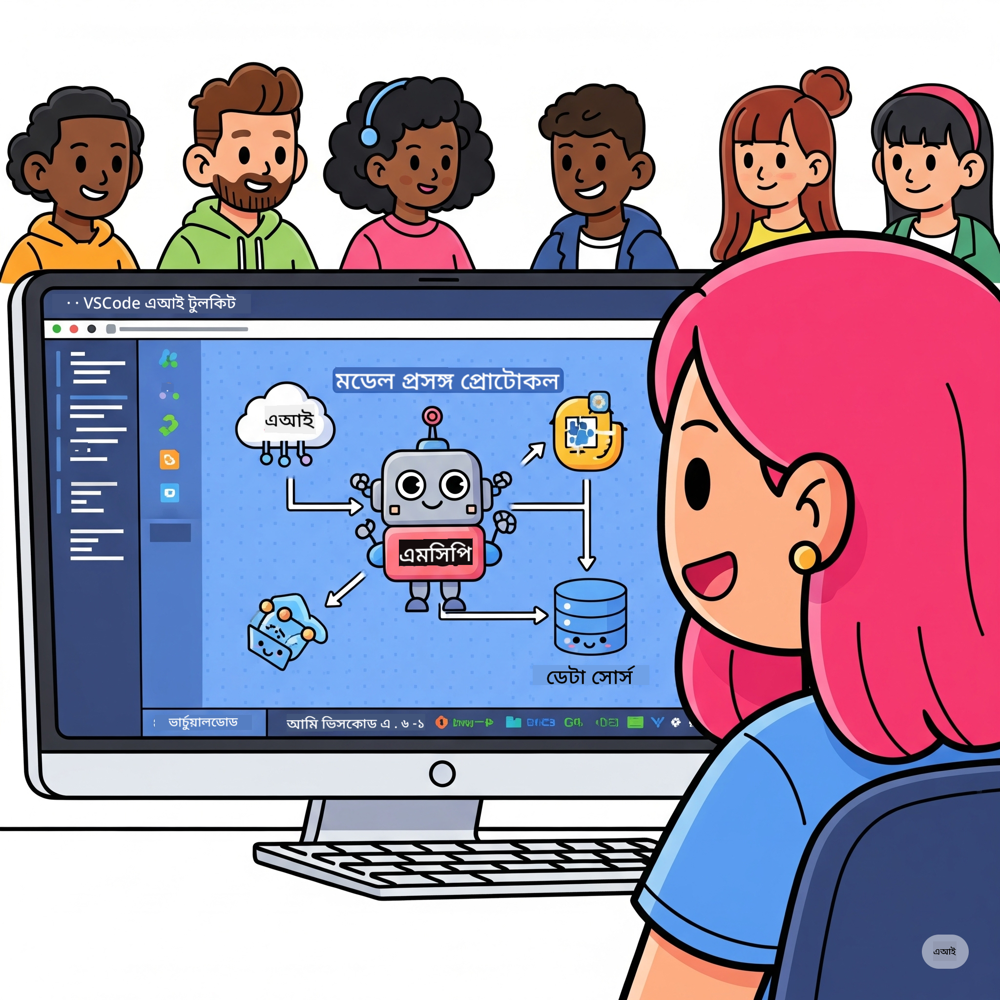

<!--
CO_OP_TRANSLATOR_METADATA:
{
  "original_hash": "1b000fd6e1b04c047578bfc5d07d54eb",
  "translation_date": "2025-08-18T15:18:43+00:00",
  "source_file": "10-StreamliningAIWorkflowsBuildingAnMCPServerWithAIToolkit/README.md",
  "language_code": "bn"
}
-->
# এআই ওয়ার্কফ্লো সহজতর করা: এআই টুলকিট দিয়ে একটি এমসিপি সার্ভার তৈরি করা

## 🎯 ওভারভিউ

_(উপরের ছবিতে ক্লিক করে এই পাঠের ভিডিও দেখুন)_

**মডেল কনটেক্সট প্রোটোকল (MCP) ওয়ার্কশপে** আপনাকে স্বাগতম! এই বিস্তৃত হাতে-কলমে ওয়ার্কশপটি দুটি আধুনিক প্রযুক্তিকে একত্রিত করে এআই অ্যাপ্লিকেশন ডেভেলপমেন্টে বিপ্লব ঘটাবে:

- **🔗 মডেল কনটেক্সট প্রোটোকল (MCP)**: এআই টুল ইন্টিগ্রেশনের জন্য একটি ওপেন স্ট্যান্ডার্ড
- **🛠️ ভিজ্যুয়াল স্টুডিও কোডের জন্য এআই টুলকিট (AITK)**: মাইক্রোসফটের শক্তিশালী এআই ডেভেলপমেন্ট এক্সটেনশন

### 🎓 আপনি কী শিখবেন

এই ওয়ার্কশপ শেষে, আপনি বুদ্ধিমান অ্যাপ্লিকেশন তৈরি করার দক্ষতা অর্জন করবেন যা এআই মডেলকে বাস্তব জগতের টুল এবং পরিষেবার সাথে সংযুক্ত করে। স্বয়ংক্রিয় টেস্টিং থেকে কাস্টম এপিআই ইন্টিগ্রেশন পর্যন্ত, আপনি জটিল ব্যবসায়িক সমস্যার সমাধানে ব্যবহারিক দক্ষতা অর্জন করবেন।

## 🏗️ প্রযুক্তি স্ট্যাক

### 🔌 মডেল কনটেক্সট প্রোটোকল (MCP)

MCP হলো এআই-এর জন্য **"USB-C"** - একটি সার্বজনীন স্ট্যান্ডার্ড যা এআই মডেলকে বাইরের টুল এবং ডেটা সোর্সের সাথে সংযুক্ত করে।

**✨ মূল বৈশিষ্ট্য:**

- 🔄 **স্ট্যান্ডার্ডাইজড ইন্টিগ্রেশন**: এআই-টুল সংযোগের জন্য সার্বজনীন ইন্টারফেস
- 🏛️ **ফ্লেক্সিবল আর্কিটেকচার**: লোকাল এবং রিমোট সার্ভার stdio/SSE ট্রান্সপোর্টের মাধ্যমে
- 🧰 **সমৃদ্ধ ইকোসিস্টেম**: এক প্রোটোকলে টুল, প্রম্পট এবং রিসোর্স
- 🔒 **এন্টারপ্রাইজ-রেডি**: বিল্ট-ইন সিকিউরিটি এবং নির্ভরযোগ্যতা

**🎯 কেন MCP গুরুত্বপূর্ণ:**
যেমন USB-C তারের বিশৃঙ্খলা দূর করেছে, MCP এআই ইন্টিগ্রেশনের জটিলতা দূর করে। এক প্রোটোকল, অসীম সম্ভাবনা।

### 🤖 ভিজ্যুয়াল স্টুডিও কোডের জন্য এআই টুলকিট (AITK)

মাইক্রোসফটের ফ্ল্যাগশিপ এআই ডেভেলপমেন্ট এক্সটেনশন যা VS Code-কে একটি এআই পাওয়ারহাউসে রূপান্তরিত করে।

**🚀 মূল ক্ষমতাসমূহ:**

- 📦 **মডেল ক্যাটালগ**: Azure AI, GitHub, Hugging Face, Ollama থেকে মডেল অ্যাক্সেস
- ⚡ **লোকাল ইনফারেন্স**: ONNX-অপ্টিমাইজড CPU/GPU/NPU এক্সিকিউশন
- 🏗️ **এজেন্ট বিল্ডার**: MCP ইন্টিগ্রেশনের সাথে ভিজ্যুয়াল এআই এজেন্ট ডেভেলপমেন্ট
- 🎭 **মাল্টি-মোডাল**: টেক্সট, ভিশন এবং স্ট্রাকচার্ড আউটপুট সাপোর্ট

**💡 ডেভেলপমেন্ট সুবিধা:**

- জিরো-কনফিগ মডেল ডিপ্লয়মেন্ট
- ভিজ্যুয়াল প্রম্পট ইঞ্জিনিয়ারিং
- রিয়েল-টাইম টেস্টিং প্লেগ্রাউন্ড
- সিমলেস MCP সার্ভার ইন্টিগ্রেশন

## 📚 শেখার যাত্রা

### [🚀 মডিউল ১: এআই টুলকিটের বুনিয়াদি](./lab1/README.md)

**সময়কাল**: ১৫ মিনিট

- 🛠️ ভিজ্যুয়াল স্টুডিও কোডের জন্য এআই টুলকিট ইনস্টল এবং কনফিগার করুন
- 🗂️ মডেল ক্যাটালগ অন্বেষণ করুন (GitHub, ONNX, OpenAI, Anthropic, Google থেকে ১০০+ মডেল)
- 🎮 ইন্টারঅ্যাকটিভ প্লেগ্রাউন্ডে রিয়েল-টাইম মডেল টেস্টিং শিখুন
- 🤖 এজেন্ট বিল্ডার দিয়ে আপনার প্রথম এআই এজেন্ট তৈরি করুন
- 📊 বিল্ট-ইন মেট্রিক্স (F1, প্রাসঙ্গিকতা, সাদৃশ্য, সামঞ্জস্য) দিয়ে মডেল পারফরম্যান্স মূল্যায়ন করুন
- ⚡ ব্যাচ প্রসেসিং এবং মাল্টি-মোডাল সাপোর্ট ক্ষমতা শিখুন

**🎯 শেখার ফলাফল**: AITK ক্ষমতা সম্পর্কে বিস্তৃত ধারণা সহ একটি কার্যকরী এআই এজেন্ট তৈরি করুন

### [🌐 মডিউল ২: এআই টুলকিটের সাথে MCP বুনিয়াদি](./lab2/README.md)

**সময়কাল**: ২০ মিনিট

- 🧠 মডেল কনটেক্সট প্রোটোকল (MCP) আর্কিটেকচার এবং ধারণা আয়ত্ত করুন
- 🌐 মাইক্রোসফটের MCP সার্ভার ইকোসিস্টেম অন্বেষণ করুন
- 🤖 Playwright MCP সার্ভার ব্যবহার করে একটি ব্রাউজার অটোমেশন এজেন্ট তৈরি করুন
- 🔧 MCP সার্ভারগুলোকে এআই টুলকিট এজেন্ট বিল্ডারের সাথে ইন্টিগ্রেট করুন
- 📊 আপনার এজেন্টে MCP টুল কনফিগার এবং টেস্ট করুন
- 🚀 MCP-চালিত এজেন্ট প্রোডাকশনে ডিপ্লয় করুন

**🎯 শেখার ফলাফল**: বাইরের টুল দিয়ে সুপারচার্জড একটি এআই এজেন্ট ডিপ্লয় করুন

### [🔧 মডিউল ৩: এআই টুলকিট দিয়ে উন্নত MCP ডেভেলপমেন্ট](./lab3/README.md)

**সময়কাল**: ২০ মিনিট

- 💻 এআই টুলকিট ব্যবহার করে কাস্টম MCP সার্ভার তৈরি করুন
- 🐍 MCP Python SDK (v1.9.3) কনফিগার এবং ব্যবহার করুন
- 🔍 ডিবাগিংয়ের জন্য MCP Inspector সেট আপ এবং ব্যবহার করুন
- 🛠️ পেশাদার ডিবাগিং ওয়ার্কফ্লো সহ একটি Weather MCP Server তৈরি করুন
- 🧪 এজেন্ট বিল্ডার এবং ইনস্পেক্টর এনভায়রনমেন্টে MCP সার্ভার ডিবাগ করুন

**🎯 শেখার ফলাফল**: আধুনিক টুলিং সহ কাস্টম MCP সার্ভার তৈরি এবং ডিবাগ করুন

### [🐙 মডিউল ৪: বাস্তব MCP ডেভেলপমেন্ট - কাস্টম GitHub ক্লোন সার্ভার](./lab4/README.md)

**সময়কাল**: ৩০ মিনিট

- 🏗️ ডেভেলপমেন্ট ওয়ার্কফ্লোর জন্য একটি বাস্তব GitHub ক্লোন MCP সার্ভার তৈরি করুন
- 🔄 ভ্যালিডেশন এবং এরর হ্যান্ডলিং সহ স্মার্ট রিপোজিটরি ক্লোনিং বাস্তবায়ন করুন
- 📁 বুদ্ধিমান ডিরেক্টরি ম্যানেজমেন্ট এবং VS Code ইন্টিগ্রেশন তৈরি করুন
- 🤖 কাস্টম MCP টুল সহ GitHub Copilot Agent Mode ব্যবহার করুন
- 🛡️ প্রোডাকশন-রেডি নির্ভরযোগ্যতা এবং ক্রস-প্ল্যাটফর্ম সামঞ্জস্য প্রয়োগ করুন

**🎯 শেখার ফলাফল**: ডেভেলপমেন্ট ওয়ার্কফ্লো সহজতর করার জন্য একটি প্রোডাকশন-রেডি MCP সার্ভার ডিপ্লয় করুন

## 💡 বাস্তব-জগতের প্রয়োগ এবং প্রভাব

### 🏢 এন্টারপ্রাইজ ব্যবহার

#### 🔄 ডেভঅপস অটোমেশন

আপনার ডেভেলপমেন্ট ওয়ার্কফ্লোকে বুদ্ধিমান অটোমেশনের মাধ্যমে রূপান্তর করুন:

- **স্মার্ট রিপোজিটরি ম্যানেজমেন্ট**: এআই-চালিত কোড রিভিউ এবং মার্জ সিদ্ধান্ত
- **ইন্টেলিজেন্ট CI/CD**: কোড পরিবর্তনের উপর ভিত্তি করে স্বয়ংক্রিয় পাইপলাইন অপ্টিমাইজেশন
- **ইস্যু ট্রায়াজ**: স্বয়ংক্রিয় বাগ শ্রেণীবিভাগ এবং অ্যাসাইনমেন্ট

#### 🧪 কোয়ালিটি অ্যাসিওরেন্স বিপ্লব

এআই-চালিত অটোমেশনের মাধ্যমে টেস্টিং উন্নত করুন:

- **ইন্টেলিজেন্ট টেস্ট জেনারেশন**: স্বয়ংক্রিয়ভাবে বিস্তৃত টেস্ট স্যুট তৈরি করুন
- **ভিজ্যুয়াল রিগ্রেশন টেস্টিং**: এআই-চালিত UI পরিবর্তন সনাক্তকরণ
- **পারফরম্যান্স মনিটরিং**: সক্রিয় সমস্যা সনাক্তকরণ এবং সমাধান

#### 📊 ডেটা পাইপলাইন বুদ্ধিমত্তা

আরও স্মার্ট ডেটা প্রসেসিং ওয়ার্কফ্লো তৈরি করুন:

- **অ্যাডাপটিভ ETL প্রসেস**: স্বয়ং-অপ্টিমাইজিং ডেটা ট্রান্সফরমেশন
- **অ্যানোমালি ডিটেকশন**: রিয়েল-টাইম ডেটা কোয়ালিটি মনিটরিং
- **ইন্টেলিজেন্ট রাউটিং**: স্মার্ট ডেটা ফ্লো ম্যানেজমেন্ট

#### 🎧 গ্রাহক অভিজ্ঞতা উন্নতি

অসাধারণ গ্রাহক ইন্টারঅ্যাকশন তৈরি করুন:

- **কনটেক্সট-অওয়্যার সাপোর্ট**: গ্রাহকের ইতিহাসে অ্যাক্সেস সহ এআই এজেন্ট
- **প্রোঅ্যাকটিভ সমস্যা সমাধান**: পূর্বাভাসমূলক গ্রাহক পরিষেবা
- **মাল্টি-চ্যানেল ইন্টিগ্রেশন**: প্ল্যাটফর্ম জুড়ে একীভূত এআই অভিজ্ঞতা

## 🛠️ প্রয়োজনীয়তা এবং সেটআপ

### 💻 সিস্টেমের প্রয়োজনীয়তা

| কম্পোনেন্ট | প্রয়োজনীয়তা | নোট |
|-----------|-------------|-------|
| **অপারেটিং সিস্টেম** | Windows 10+, macOS 10.15+, Linux | যেকোনো আধুনিক OS |
| **ভিজ্যুয়াল স্টুডিও কোড** | সর্বশেষ স্থিতিশীল সংস্করণ | AITK-এর জন্য প্রয়োজনীয় |
| **Node.js** | v18.0+ এবং npm | MCP সার্ভার ডেভেলপমেন্টের জন্য |
| **Python** | 3.10+ | Python MCP সার্ভারের জন্য ঐচ্ছিক |
| **মেমোরি** | ন্যূনতম ৮ জিবি RAM | লোকাল মডেলের জন্য ১৬ জিবি সুপারিশকৃত |

### 🔧 ডেভেলপমেন্ট এনভায়রনমেন্ট

#### প্রস্তাবিত VS Code এক্সটেনশন

- **AI Toolkit** (ms-windows-ai-studio.windows-ai-studio)
- **Python** (ms-python.python)
- **Python Debugger** (ms-python.debugpy)
- **GitHub Copilot** (GitHub.copilot) - ঐচ্ছিক কিন্তু সহায়ক

#### ঐচ্ছিক টুল

- **uv**: আধুনিক Python প্যাকেজ ম্যানেজার
- **MCP Inspector**: MCP সার্ভারের জন্য ভিজ্যুয়াল ডিবাগিং টুল
- **Playwright**: ওয়েব অটোমেশন উদাহরণের জন্য

## 🎖️ শেখার ফলাফল এবং সার্টিফিকেশন পথ

### 🏆 দক্ষতা অর্জনের চেকলিস্ট

এই ওয়ার্কশপ সম্পন্ন করে, আপনি নিম্নলিখিত দক্ষতাগুলো আয়ত্ত করবেন:

#### 🎯 মূল দক্ষতা

- [ ] **MCP প্রোটোকল দক্ষতা**: আর্কিটেকচার এবং ইমপ্লিমেন্টেশন প্যাটার্নের গভীর জ্ঞান
- [ ] **AITK দক্ষতা**: দ্রুত ডেভেলপমেন্টের জন্য এআই টুলকিটের বিশেষজ্ঞ-স্তরের ব্যবহার
- [ ] **কাস্টম সার্ভার ডেভেলপমেন্ট**: প্রোডাকশন MCP সার্ভার তৈরি, ডিপ্লয় এবং রক্ষণাবেক্ষণ
- [ ] **টুল ইন্টিগ্রেশন দক্ষতা**: এআইকে বিদ্যমান ডেভেলপমেন্ট ওয়ার্কফ্লোর সাথে নির্বিঘ্নে সংযুক্ত করা
- [ ] **সমস্যা সমাধানের প্রয়োগ**: শেখা দক্ষতাগুলো বাস্তব ব্যবসায়িক চ্যালেঞ্জে প্রয়োগ করা

#### 🔧 প্রযুক্তিগত দক্ষতা

- [ ] VS Code-এ AI Toolkit সেট আপ এবং কনফিগার করা
- [ ] কাস্টম MCP সার্ভার ডিজাইন এবং ইমপ্লিমেন্ট করা
- [ ] MCP আর্কিটেকচারে GitHub মডেল ইন্টিগ্রেট করা
- [ ] Playwright দিয়ে অটোমেটেড টেস্টিং ওয়ার্কফ্লো তৈরি করা
- [ ] প্রোডাকশনের জন্য এআই এজেন্ট ডিপ্লয় করা
- [ ] MCP সার্ভারের পারফরম্যান্স ডিবাগ এবং অপ্টিমাইজ করা

#### 🚀 উন্নত ক্ষমতা

- [ ] এন্টারপ্রাইজ-স্কেল এআই ইন্টিগ্রেশন ডিজাইন করা
- [ ] এআই অ্যাপ্লিকেশনের জন্য সিকিউরিটি বেস্ট প্র্যাকটিস ইমপ্লিমেন্ট করা
- [ ] স্কেলেবল MCP সার্ভার আর্কিটেকচার ডিজাইন করা
- [ ] নির্দিষ্ট ডোমেইনের জন্য কাস্টম টুল চেইন তৈরি করা
- [ ] এআই-নেটিভ ডেভেলপমেন্টে অন্যদের মেন্টর করা

## 📖 অতিরিক্ত রিসোর্স

- [MCP স্পেসিফিকেশন](https://modelcontextprotocol.io/docs)
- [AI Toolkit GitHub রিপোজিটরি](https://github.com/microsoft/vscode-ai-toolkit)
- [সাম্পল MCP সার্ভার কালেকশন](https://github.com/modelcontextprotocol/servers)
- [বেস্ট প্র্যাকটিস গাইড](https://modelcontextprotocol.io/docs/best-practices)

---

**🚀 আপনার এআই ডেভেলপমেন্ট ওয়ার্কফ্লো বিপ্লব করতে প্রস্তুত?**

MCP এবং AI Toolkit দিয়ে বুদ্ধিমান অ্যাপ্লিকেশন তৈরির ভবিষ্যৎ গড়ে তুলি!

**অস্বীকৃতি**:  
এই নথিটি AI অনুবাদ পরিষেবা [Co-op Translator](https://github.com/Azure/co-op-translator) ব্যবহার করে অনুবাদ করা হয়েছে। আমরা যথাসম্ভব সঠিকতার জন্য চেষ্টা করি, তবে অনুগ্রহ করে মনে রাখবেন যে স্বয়ংক্রিয় অনুবাদে ত্রুটি বা অসঙ্গতি থাকতে পারে। এর মূল ভাষায় থাকা নথিটিকে প্রামাণিক উৎস হিসেবে বিবেচনা করা উচিত। গুরুত্বপূর্ণ তথ্যের জন্য, পেশাদার মানব অনুবাদ সুপারিশ করা হয়। এই অনুবাদ ব্যবহারের ফলে কোনো ভুল বোঝাবুঝি বা ভুল ব্যাখ্যা হলে আমরা দায়বদ্ধ থাকব না।